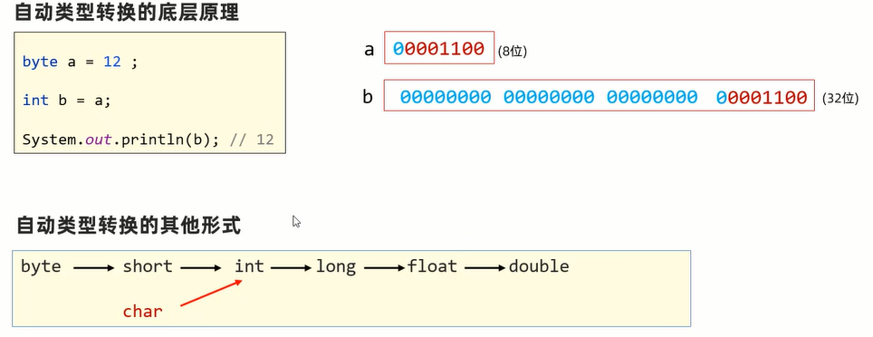
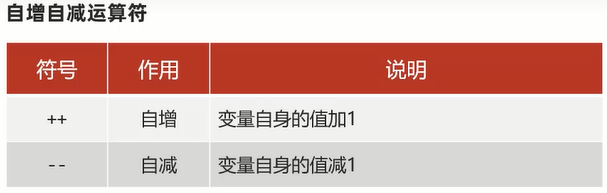
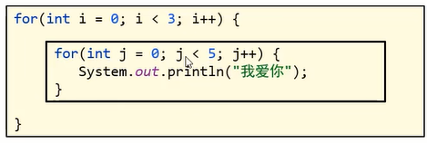

# JavaSE 基础篇

## 一、搭建环境

### 1.1 JDK

Java 语言的产品是 JDK(Java Development Kit: Java 开发者工具包)，必须安装 JDK 才能使用 Java 语言。

**JDK 产品的发展史**:  


**JDK 下载和安装**：

- JDK 的下载去甲骨文官网的[Java 板块](https://www.oracle.com/java/technologies/downloads/#jdk17-windows)去下载 JDK17 版本，选择好对应的平台，选择 Installer 安装版。
- 下载后双击安装包进行安装，安装路径`D:\Java\jdk-17`文件夹。
- 安装完后，打开命令行运行`java -version`和`javac -version`看是否是 17 版本。
- 那两个命令实际上运行是的`D:\Java\jdk-17\bin\java.exe`和`D:\Java\jdk-17\bin\javac.exe`

**JDK 的组成**：


**Java 的跨平台工作原理**：每个平台都有各自的 JVM 虚拟机，开发人员编写的 Java 代码只需要一次编译后就可以处处运行。

**Path 环境变量**：用于记住程序路径，方便在命令窗口的任意目录启动程序。

**JAVA_HOME 环境变量**：告诉操作系统 JDK 安装在了哪个位置（将来其他技术要通过这个环境变量找 JDK）

**最常用的命令行窗口命令**

| 常用命令 | 作用                                                                                                        |
| -------- | ----------------------------------------------------------------------------------------------------------- |
| 盘符:    | 切换到某个盘下，D:，C:                                                                                      |
| dir      | 查看当前路径下的文件信息                                                                                    |
| cd       | 进入单级目录：cd itheima 进入多级目录：cd D:\itheima\JavaSE 回退到上一级目录：cd .. 回退到盘符根目录：cd \  |
| cls      | 清屏                                                                                                        |

### 1.2 HelloWorld

Java 程序开发的三个步骤：编写代码、编译代码、运行代码。

1. **编写 HelloWorld**

   ```java
   public class HelloWorld {
     public static void main(String[] args) {
       System.out.println("Hello World!");
     }
   }
   ```

2. **编译运行 HelloWorld**

   编译：`javac 文件名.java`，例如：`javac HelloWorld.java`  
   运行：`java 类名`，例如：`java HelloWorld`

   注意：

   - 第一个 java 程序建议使用记事本书写
   - 建议代码文件名全英文，首字母大写，满足驼峰模式，源代码文件的后缀必须是`.java`
   - 文件名必须与代码中的类名称一致。

   Java 程序的**执行原理**：不管什么样的高级程序语言，最终都是翻译成计算机底层可以识别的机器语言（由 0 和 1 组成的）。

### 1.3 IDEA 开发工具

**集成开发环境**(IDE, Integrated Development Environment)

- 把代码编写，编译，执行等多种功能综合到一起的开发工具，可以进行代码智能提示，错误提醒，项目管理等等。
- 常见 Java 的 IDE 工具有：Eclipse、MyEclipse、IntelliJ IDEA、Jbuilder、NetBeans 等

**IntelliJ IDEA 开发工具**

- IntelliJ IDEA 一般简称 IDEA，是 Java 编程语言开发的集成环境，在业界被公认为最好的 java 开发工具。
- IDEA 在代码错误提醒，智能代码补全等多方面表现的非常优秀，是 Java 开发企业级首选工具。

进入 jetbrains 官网，找到[IntelliJ IDEA](https://www.jetbrains.com/idea/)，选择旗舰版或者社区版进行下载安装。如果 POJIE，可以去[异常教程](https://www.exception.site/essay/idea-reset-eval)里搜索教程。

**IDEA 项目结构**：

- project(项目、工程)
- module(模块)
- package(包)
- class(类)

  


这些结构的划分，是为了方便管理项目技术和代码文件的。

**使用步骤**：

1. 创建 Project 空项目
2. 创建 Module 模块
3. 创建 Package 包
4. 创建 class 类
5. 在类中编写代码
6. 完成编译运行

## 二、Java 基础语法

### 2.1 基本概念

1. **注释**

   注释是写在程序中对代码进行解释说明的文字，方便自己和其他人查看，以便理解程序的。

   

2. **字面量**

   计算机是用来处理数据的，**字面量**就是告诉程序员：数据在程序中的书写格式。

   

3. **变量**

   变量就是用来存储一个数据的内存区域（可以理解成盒子），且里面存储的数据可以变化。

   

   

4. **数据类型**

   数据类型就是约束变量存储数据的形式。

   

5. **关键字和标识符**

   Java 自己保留的一些单词，作为特殊功能的。我们不能用来作为类名或者变量名，否则会报错。

   

   标识符就是由一些字符、符号组合起来的名称，用于给类、方法、变量等起名字的规矩。

   标识符的要求：由数字、字母、下划线或美元字符等组成，但是，不能以数字开头，不能是关键字，并且区分大小写。

### 2.2 类型转换

#### 2.2.1 动类型转换

类型范围**小**的变量，可以直接赋值给类型范围**大**的变量。



#### 2.2.2 表达式的自动类型转换

在表达式中，小范围类型的变量会自动转换成当前较大范围的类型再运算。

`byte、short、char ——> init ——> long ——> float ——> double`。

注意事项：

- 表达式的最终结果类型由表达式中的**最高类型决定**；
- 在表达式中，byte、short、char 是直接转换成 int 类型参与运算的。

#### 2.2.3 强制类型转换

可以强行将类型范围大的变量、数据赋值给类型范围小的变量。`数据类型 变量2 = (数据类型)变量1`。

注意事项：

- 强制类型转化可能造成数据(丢失)溢出；
- 浮点型强转成整型，直接丢掉小数部分，保留整数部分返回。

### 2.3 运算符

运算符：对字面量或者变量进行操作的符号。

#### 2.3.1 算数运算符


注意：

- `+`符号与字符串运算的时候是用作**连接符**的，其结果依然是一个字符串。
- `/`符号在两个整数相除时，结果还是整数，原因是它们的最高类型是整数。

#### 2.3.2 自增自减运算符



注意：

- `++`和`--`既可以放在变量的后边，也可以放在变量的前边。
- `++`和`--`只能操作变量，不能操作字面量。

#### 2.3.3 赋值运算符

`=`是最常见的赋值运算符，以下是一些扩展的赋值运算符。


注意：扩展的赋值运算符隐含了强制类型转换。

#### 2.3.4 关系运算符

关系运算符是对数据进行条件判断的符号，最终会返回一个比较的布尔结果(`false`或者`true`)。


注意：在做相等判断时，千万不要把`==`误写成`=`。

#### 2.3.5 逻辑运算符

逻辑运算符可以把多个条件的布尔结果放在一起运算，最终返回一个布尔结果。


注意：逻辑与`&`、逻辑或`|`：无论左边是 false 还是 true，**右边都要执行**。

#### 2.3.6 三元运算符

格式：`条件表达式 ? 值1 ： 值2`

执行流程：首先计算关系表达式的值，如果值为 true，返回值 1，如果为 false，返回值 2。

#### 2.3.7 运算符优先级


## 三、流程控制

Java 提供了一些流程控制语句，来控制程序的执行流程：顺序结构（程序默认流程）、分支结构（if、switch）、循环结构（for、while、do-while）。

### 3.1 if 分支

根据判定的结果（真或假）决定执行某个分支的代码。

```java
public class Main {
    public static void main(String[] args) {
        int score = 99;
        if (score >= 0 && score < 60) {
            System.out.println("您本月的绩效是：C");
        } else if (score >= 60 && score < 80) {
            System.out.println("您本月的绩效是：B");
        } else if (score >= 80 && score < 90) {
            System.out.println("您本月的绩效是：A");
        } else if (score >= 90 && score <= 100) {
            System.out.println("您本月的绩效是：A+");
        } else {
            System.out.println("您录入的分数有问题！");
        }
    }
}
```

### 3.2 switch 分支

也是匹配条件去执行分支，适合做值匹配的分支选择，结构清晰，格式良好。

```java
public class Main {
    public static void main(String[] args) {
        String s = "1";
        switch (s) {
            case "1":
                System.out.println("1");
            case "2":
                System.out.println("2");
                break;
            case "3":
                System.out.println("3");
                break;
            default:
                System.out.println("4");
        }
    }
}
```

注意：

- 表达式类型只能是 byte、short、int、char，JDK5 开始支持枚举，JDK7 开始支持 String，不支持 double、float、long。
- case 给出的值不允许重复，且只能是字面量，不能是变量。
- 不要忘记写 break，否则会出现穿透现象。

### 3.3 for 循环

控制一段代码反复执行很多次。

```java
public class Main {
    public static void main(String[] args) {
        for (int i = 0; i < 3; i ++) {
            System.out.println(i);
        }
    }
}
```

### 3.4 while 循环

也是控制一段代码反复执行很多次。

```java
public class Main {
    public static void main(String[] args) {
        int i = 0;
        while (i < 3) {
            System.out.println(i);
            i ++;
        }
    }
}
```

### 3.5 do-while 循环

先执行再判断循环条件。

```java
public class Main {
    public static void main(String[] args) {
        int i = 0;
        do {
            System.out.println(i);
            i ++;
        } while (i < 3);
    }
}
```

### 3.6 死循环和嵌套循环




### 3.7 break 和 continue

- break: 跳出并结束当前循环。
- continue：用于跳出当前这一次的循环，继续后续次数的循环。

## 四、数组

数组就是用来存储**一批同种类型**数据的内存区域（可以理解为容器）。

### 4.1 静态初始化数组

定义数组的时候直接给数组赋值。

完整格式：`数据类型[] 数组名 = new 数据类型[]{ 元素1, 元素2, 元素3... }`，例如`int[] nums = new int[]{ 1, 2, 3 }`。  
简化格式：`数据类型[] 数组名 = { 元素1, 元素2, 元素3... }`，例如`String[] names = { "张三", "李四", "王五" }`。

访问某个元素：`数组名称[索引]`，例如`nums[0]`是拿 nums 这个数组的第一项，拿到后可以使用`=`进行重新赋值。  
数组的长度属性：`数组名.length`。

注意：

- `数据类型[] 数组名`也可以写成`数据类型 数组名[]`，一般用前面的。
- 数组里每个元素的类型必须是**同一种**。
- 数组一旦定义出来，程序执行的过程中，**长度和类型就固定了**。

### 4.2 动态初始化数组

定义数组的时候只确定元素的类型和数组的长度，之后再存入具体数据。先定义后赋值，中括号的值作为数组的长度，每一项根据类型取具体的默认值。

格式：`数据类型[] 数组名 = new 数据类型[长度]`  
例如：`double[] arr = new double[3]`
动态赋值：`arr[0] = 9.9`，而后面两位没有赋值的是默认为`0.0`


注意：

- 静态和动态初始化数组不能混用，像`int[] arrs = new int[3]{30, 40, 50}`就是错误的。
- 动态初始化适用于一开始就知道数据的数量，而静态初始化适用于一开始就能确定元素值。

### 4.3 遍历数组

遍历：就是一个一个数据的访问。

```java
public class Main {
    public static void main(String[] args) {
        int[] ages = { 20, 30, 40, 50 };
        for (int i = 0; i < ages.length; i ++) {
            System.out.println(ages[i]);
        }
    }
}
```

### 4.4 **常见问题**

- 问题 1：如果访问的元素文职超过最大索引，执行时会出现`ArrayIndexOutOfBoundsException`（数组索引越界异常）。
- 问题 2：如果数组变量中没有存储数组的地址，而是`null`，在访问数组信息时会出现`NullPointerException`（空指针异常）。

## 五、方法

方法是一种语法结构，它可以把一段代码封装成一个功能，以方便重复调用。

### 5.1 方法的定义和调用

  


```java
public class Main {
    public static void main(String[] args) {
        int[] nums = { 20, 30, 40, 50 };
        // 方法调用，是方法名跟上一对括号()，根据情况传递参数
        System.out.println(sum(nums));
    }
    // 创建一个方法，用于求一个数组之和
    public static int sum(int[] nums) {
        int rlt = 0;
        for (int i = 0; i < nums.length; i ++) {
            rlt += nums[i];
        }
        return rlt;
    }
}
```

注意：

- 方法的修饰符：暂时都使用`public static`修饰（后面会讲）。
- 方法申明了具体的返回值类型，内部必须使用 return 返回对应类型的数据。如果是申明`void`，那么内部不要用 return 返回数据。
- 形参列表可以有多个，甚至可以没有；如果有多个形参，多个形参必须用`,`隔开，且不能给初始化值。实参要严格对应形参传递。
- 方法的编写顺序无所谓，但是方法不能嵌套，也就是说方法是平级的，这是和 JavaScript 的一个区别。

### 5.2 方法的参数是值传递

Java 的参数传递机制：值传递。

在传输实参给方法的形参的时候，并不是传递实参变量变身，而是传递实参中存储的值，这个就是值传递。无论参数是基本类型（数据值）还是引用类型（地址值），都是值传递。这和 JavaScript 是一样的。

```java
public class Main {
    public static void main(String[] args) {
        int a = 10;
        // 基本类型作为参数进行传递
        change(a);
        System.out.println(a); // 10
    }
    // 方法的参数是值传递
    public static void change(int a) {
        System.out.println(a); // 10
        a = 20;
        System.out.println(a); // 20
    }
}
```

```java
public class Main {
    public static void main(String[] args) {
        int[] nums = { 20, 30, 40, 50 };
        System.out.println(nums); // [I@4eec7777
        change(nums);
        System.out.println(nums); // [I@4eec7777
        // 因为是同一地址值，它们都指向同一个对象，那么修改nums[1]这里也会生效
        System.out.println(nums[1]); // 60
    }
    // 方法的参数是值传递，这里是传递的一个地址值[I@4eec7777，内外都指向同一个对象
    public static void change(int[] nums) {
        System.out.println(nums); // [I@4eec7777
        System.out.println(nums[1]); // 30
        nums[1] = 60;
        System.out.println(nums); // [I@4eec7777
        System.out.println(nums[1]); // 60
        // 内部nums被赋予了新地址，以前的地址不要，那么它指向新对象了。
        // 如果是引用传递，外部的nums也会跟着它变，实际是没有变，只是内部nums变成新地址了
        nums = new int[]{ 90, 100, 300 };
        System.out.println(nums); // [I@3b07d329
        System.out.println(nums[1]); // 100
    }
}
```

### 5.3 方法其他常见形式

方法重载：**同一个类**中，出现多个方法**名称相同**，但是**形参列表是不同**的，那么这些方法就是重载方法。（方法名相同，形参不同）

形参列表不同值的是：形参的**个数**、**类型**、**顺序**不同，不关心形参的名称。（括号内不同）

## 六、面向对象

### 6.1 设计对象并使用

类（理解为设计图）：是对象共同特征的描述。  
对象：是真实存在的具体实例。  
结论：在 java 中，必须先设计类，才能创建对象并使用。


```java
public class Main {
    public static void main(String[] args) {
        Car car = new Car();
        System.out.println(car.name); // null
        System.out.println(car.price); // 0.0
        car.name = "宝马";
        car.price = 38.9;
        System.out.println(car.name); // 宝马
        System.out.println(car.price); // 38.9
        car.start(); // 宝马启动了
        car.run(); // 价格是：38.9的宝马跑的很快

        System.out.println("------------------------");

        Car car2 = new Car();
        System.out.println(car2.name); // null
        System.out.println(car2.price); // 0.0
        car2.name = "奔驰";
        car2.price = 39.9;
        System.out.println(car2.name); // 奔驰
        System.out.println(car2.price); // 39.9
        car2.start(); // 奔驰启动了
        car2.run(); // 价格是：39.9的奔驰跑的很快
    }
}
class Car {
    // 成员变量
    String name;
    double price;
    // 方法
    public void start() {
        System.out.println(name + "启动了");
    }

    public void run() {
        System.out.println("价格是：" + price + "的" + name + "跑的很快");
    }
}
```

### 6.2 构造器

#### 6.2.1 构造器的定义以及调用

定义在类中的，可以用于初始化一个类的对象，并返回对象的地址。


#### 6.2.2 构造器分类和作用

- 无参数构造器(默认存在的)：初始化对象时，成员变量的数据均采用默认值。
- 有参数构造器：在初始化对象的时候，同时可以接收参数为对象进行赋值。

```java
public class Main {
    public static void main(String[] args) {
        Car car = new Car(); // 无参数构造器被调用了
        car.name = "宝马";
        car.price = 38.9;
        System.out.println(car.name); // 宝马
        System.out.println(car.price); // 38.9

        System.out.println("------------------------");

        Car car2 = new Car("奔驰", 39.9); // 有参数构造器被调用了
        System.out.println(car2.name); // 奔驰
        System.out.println(car2.price); // 39.9
    }
}
class Car {
    // 成员变量
    String name;
    double price;
    // 无参数构造器
    public Car() {
        System.out.println("无参数构造器被调用了");
    }
    // 有参数构造器
    public Car(String n, double p) {
        name = n;
        price = p;
        System.out.println("有参数构造器被调用了");
    }
}
```

#### 6.2.3 构造器的注意事项

- 任何类定义出来，默认就自带了无参数构造器，写不写都有。
- 一旦定义了有参数构造器，那么无参数构造器就没有了，如果还想用无参数构造器，此时就需要自己手写一个无参数构造器了。

### 6.3 this

this 表示当前对象的地址，可以出现在构造器和成员方法中。

```java
public class Main {
    public static void main(String[] args) {
        Car car = new Car();
        car.run();
        System.out.println(car); // Car@682a0b20
    }
}
class Car {
    // 构造器
    public Car() {
        System.out.println(this); // Car@682a0b20
    }
    // 普通方法
    public void run() {
        System.out.println(this); // Car@682a0b20
    }
}
```

this 的作用：可以用于指定访问当前对象的成员变量、成员方法。

比如之前的有参数构造器，传入的参数是`n`和`p`，本来是想传入`name`和`price`，发现构造器使用成员变量时没有带`this.`。那么这样的情况我们就可以用 this 来改造。

```java
class Car {
    // 成员变量
    String name;
    double price;
    // 有参数构造器
    public Car(String name, double price) {
        this.name = name; // 以前是name = n
        this.price = price; // 以前是price = p
    }
}
```

### 6.4 封装

面向对象的三大特征：封装、继承、多态。

封装：告诉我们，如何正确设计对象的属性和方法。

封装的原则：对象代表什么，就得封装对应的数据，并提供数据对应的行为。（简单理解行为操作数据）

封装的好处：让编程变得很简单，有什么事，找对象，调用方法就行。

如何进行封装更好：

- 一般建议对成员变量使用`private`(私有)关键字进行修饰（private 修饰的成员只能在当前类中访问）。
- 为每个成员变量提供配套 public 修饰的`getter`、`setter`方法暴露其取值和赋值。


### 6.5 标准 JavaBean

标准 JavaBean 也可以称为实体类，其对象可以用于在程序中封装数据。

标准 JavaBean 须满足如下书写要求：

- 成员变量使用 private 修饰。
- 提供成员变量对应的 setXxx() 、 getXxx()方法。
- 必须提供一个无参数构造器；有参数构造器是可写可不写的。

```java
public class User {
    // 成员变量使用 private 修饰
    private String name;
    private double height;
    private double salary;
    // 必须提供一个无参数构造器
    public User() {
    }
    // 有参数构造器是可写可不写的
    public User(String name, double height, double salary) {
        this.name = name;
        this.height = height;
        this.salary = salary;
    }
    // 提供成员变量对应的 setXxx() 、 getXxx()方法
    public String getName() {
        return name;
    }
    // 提供成员变量对应的 setXxx() 、 getXxx()方法
    public void setName(String name) {
        this.name = name;
    }

    public double getHeight() {
        return height;
    }

    public void setHeight(double height) {
        this.height = height;
    }

    public double getSalary() {
        return salary;
    }

    public void setSalary(double salary) {
        this.salary = salary;
    }
}
```

### 6.6 成员变量和局部变量区别

| 区别         | 成员变量                                   | 局部变量                                       |
| ------------ | ------------------------------------------ | ---------------------------------------------- |
| 类中位置不同 | 类中，方法外                               | 常见于方法中                                   |
| 初始化值不同 | 有默认值，无需初始化                       | 没有默认值，使用之前需要完成赋值               |
| 内存位置不同 | 堆内存                                     | 栈内存                                         |
| 生命周期不同 | 随着对象的创建而存在，随着对象的消失而消失 | 随着方法的调用而存在，随着方法的运行结束而消失 |
| 作用域       |                                            | 在所归属的大括号中                             |

## 七、常用 API(String 和 ArrayList)

String 类定义的变量可以用于存储字符串，同时 String 类提供了很多操作字符串的功能，我们可直接使用。

ArrayList 代表的是集合类，集合是一种容器，与数组类似，不同的是集合的大小是不固定的。  
通过创建 ArrayList 的对象表示得到的一个集合容器，同时 ArrayList 提供了比数组更好用、更丰富的 API 给程序员使用。

### 7.1 String

#### 7.1.1 String 概述

`java.lang.String`类代表字符串，String 类定义的变量可以用于指向字符串对象，然后操作该字符串。

Java 程序中的所有字符串文字（例如"abc"）都为此类的对象。

String 其实常被称为不可变字符串类型，它的对象在创建后不能被更改。（对象不可变，不是变量不可变，变量可以指向新的字符串对象）

```java
public static void main(String[] args) {
        String str = "123";
        str += "456"; // 这个过程是用两个字符串创建了一个新字符串，
        str += "789"; // 原来的字符串是不可变，而str变量变成了新地址
        System.out.println(str); // "123456789"
    }
```

#### 7.1.2 String 创建的 2 种方式

- 方式一：直接使用`""`定义。`String name = "张三"`（推荐方式）
- 方式二：通过 String 类的构造器创建对象。
  - `new String()`：创建一个空白字符串对象，不含有任何内容。（几乎不用）
  - `new String(String)`：根据传入的字符串内容，来创建字符串对象。（几乎不用）
  - `new String(char[] c)`：根据字符数组的内容，来闯将字符串对象。
  - `new String(byte[] b)`：根据字节数组的内容，来创建字符串对象。

```java
public class Main {
    public static void main(String[] args) {
        String s = "我爱你中国";
        System.out.println(s);

        String s1 = new String();
        System.out.println(s1);

        String s2 = new String("我是中国人");
        System.out.println(s2);

        char[] chars = { 'a', 'b', '中', '国' };
        String s3 = new String(chars);
        System.out.println(s3);

        byte[] bytes = { 97, 98, 99, 65, 66, 67 };
        String s4 = new String(bytes);
        System.out.println(s4);
    }
}
```

区别：以`""`方式给出的字符串对象，在字符串常量池中存储，而且相同内容只会在其中存储一份。通过构造器 new 对象，每 new 一次都会产生一个新对象，放在堆内存中。

```java
public class Main {
    public static void main(String[] args) {
        String s1 = "abc"; // 放到了字符串常量池
        String s2 = "abc"; // 它也指向了字符串常量池中的"abc"
        System.out.println(s1 == s2); // true

        char[] chs = { 'a', 'b', 'c' };
        String s3 = new String(chs); // 创建新的字符串对象放到了堆中
        String s4 = new String(chs); // 再次创建新的字符串对象放到了堆中
        System.out.println(s3 == s4); // false

        String s5 = "bc";
        String s6 = "a" + s5; // 运用了+运算，但它生成新字符串对象放到了堆中
        System.out.println(s1 == s6); // false

        String s7 = "a" + "b" + "c"; // 在编译期会优化成"abc"，也就是s1在字符串常量池的"abc"
        System.out.println(s1 == s7); // true
    }
}
```

#### 7.1.3 字符串比较

上一小节是使用`==`比较字符串对象的地址值是否相同（当然它也可用于基本类型的值比较），如果要比较字符串对象内容是否相同用哪个呢？

`equals`是用来比较 String 类之间的内容是否一样的。它是大小写敏感的，如果不需要区分大小写可以使用`equalsIgnoreCase`。

```java
public class Main {
    public static void main(String[] args) {
        String s1 = "abc";
        String s2 = "AbC";
        System.out.println(s1.equals(s2)); // false
        System.out.println(s1.equalsIgnoreCase(s2)); // true
    }
}
```

#### 7.1.4 遍历、替换、截取、分割

| 方法名                                                               | 说明                                                     |
| -------------------------------------------------------------------- | -------------------------------------------------------- |
| public int length()                                                  | 返回此字符串的长度                                       |
| public char charAt(int index)                                        | 获取某个索引位置处的字符                                 |
| public char[] toCharArray()                                          | 将当前字符串转换成字符数组返回                           |
| public String substring(int beginIndex, int endIndex)                | 根据开始和结束索引进行截取，得到新的字符串（包前不包后） |
| public String substring(int beginIndex)                              | 从传入的索引处截取，截取到末尾，得到新的字符串           |
| public String replace(CharSequence target, CharSequence replacement) | 使用新值，将字符串中的旧值替换，得到新的字符串           |
| public String[] split(String regex)                                  | 根据传入的规则切割字符串，得到字符串数组返回             |

### 7.2 ArrayList

#### 7.2.1 ArrayList 概述

回顾一下数组的特点，数组定义完成并启动后，类型确定、长度固定。来么问题就来了，在个数不能确定，且要进行增删数据操作的时候，数组是不太合适的。

ArrayList**动态数组**能解决这个问题，可以看下它的特点：

- 动态数组的大小是不固定的，启动后可以动态变化，类型也可以选择不固定。
- 动态数组非常适合做元素个数不确定，且要进行增删操作的业务场景。
- 动态数组提供了许多丰富、好用的功能，而数组的功能很单一。

PS：ArrayList 是集合类的类型的一种，后面还有几个集合类的类型。

#### 7.2.2 创建动态数组并添加元素

使用`new ArrayList()`可以创建空的动态数组。使用`add(E e)`可以添加元素 e，默认将元素放到动态数组末尾。而`add(int index, E e)`表示将元素 e 插入到动态数组的 index 索引处，原 index 到末尾的元素会自动往后挪一位。

```java
import java.util.ArrayList;

public class Main {
    public static void main(String[] args) {
        ArrayList list = new ArrayList();

        list.add("Java");
        list.add("MySql");
        list.add("Spring");

        System.out.println(list); // [Java, MySql, Spring]

        list.add(1, "JDBC");
        System.out.println(list); // [Java, JDBC, MySql, Spring]
    }
}
```

#### 7.2.2 动态数组对泛型的支持

使用泛型可以在编译阶段约束集合对象只能操作某种数据类型。动态数组对泛型的支持形式是`ArrayList<E>`，这个`E`就是“某种数据类型”。

注意：集合中只能存储引用类型，不支持基本数据类型。（可以使用基本类型对应的包装类）

举例：

- `ArrayList<String>`：此集合只能操作字符串类型的元素。
- `ArrayList<Ineger>`：此集合只能操作整数类型的元素。（Ineger 是 int 的包装类）

```java
import java.util.ArrayList;

public class Main {
    public static void main(String[] args) {
        ArrayList<String> list = new ArrayList<>(); // 只能放入字符串

        list.add("Java");
        list.add("MySql");
        list.add("Spring");
        // list.add(2); 报错

        System.out.println(list); // [Java, MySql, Spring]
    }
}
```

#### 7.2.3 对元素进行查、改、删

| 方法名称                           | 规则                                   |
| ---------------------------------- | -------------------------------------- |
| public E get(int index)            | 返回指定索引处的元素                   |
| public int size()                  | 返回集合中的元素的个数                 |
| public E remove(int index)         | 删除指定索引处的元素，返回被删除的元素 |
| public boolean(Object 0)           | 删除指定的元素，返回删除是否成功       |
| public E set(int index, E element) | 修改指定索引处的元素，返回被修改的元素 |
