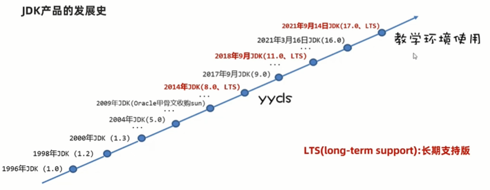
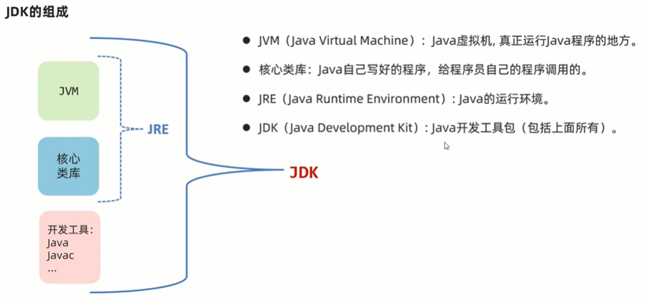

# 环境搭建和基础语法

## 环境和初运行

### JDK

Java 语言的产品是 JDK(Java Development Kit: Java 开发者工具包)，必须安装 JDK 才能使用 Java 语言。

JDK 产品的发展史:  


JDK 下载和安装：

- JDK 的下载去甲骨文官网的[Java 板块](https://www.oracle.com/java/technologies/downloads/#jdk17-windows)去下载 JDK17 版本，选择好对应的平台，选择 Installer 安装版。
- 下载后双击安装包进行安装，安装路径`D:\Java\jdk-17`文件夹。
- 安装完后，打开命令行运行`java -version`和`javac -version`看是否是 17 版本。
- 那两个命令实际上运行是的`D:\Java\jdk-17\bin\java.exe`和`D:\Java\jdk-17\bin\javac.exe`

JDK 的组成：



Java 的跨平台工作原理：每个平台都有各自的 JVM 虚拟机，开发人员编写的 Java 代码只需要一次编译后就可以处处运行。

Path 环境变量：用于记住程序路径，方便在命令窗口的任意目录启动程序。
JAVA_HOME 环境变量：告诉操作系统 JDK 安装在了哪个位置（将来其他技术要通过这个环境变量找 JDK）

最常用的命令行窗口命令

| 常用命令 | 作用                                                                                                        |
| -------- | ----------------------------------------------------------------------------------------------------------- |
| 盘符:    | 切换到某个盘下，D:，C:                                                                                      |
| dir      | 查看当前路径下的文件信息                                                                                    |
| cd       | 进入单级目录：cd itheima 进入多级目录：cd D:\itheima\JavaSE 回退到上一级目录：cd .. 回退到盘符根目录：cd \  |
| cls      | 清屏                                                                                                        |

### HelloWorld

Java 程序开发的三个步骤：编写代码、编译代码、运行代码。

1. 编写 HelloWorld

```java
public class HelloWorld {
  public static void main(String[] args) {
    System.out.println("Hello World!");
  }
}
```

2. 编译运行 HelloWorld

编译：`javac 文件名.java`，例如：`javac HelloWorld.java`  
运行：`java 类名`，例如：`java HelloWorld`

注意：

- 第一个 java 程序建议使用记事本书写
- 建议代码文件名全英文，首字母大写，满足驼峰模式，源代码文件的后缀必须是`.java`
- 文件名必须与代码中的类名称一致。

Java 程序的**执行原理**：不管什么样的高级程序语言，最终都是翻译成计算机底层可以识别的机器语言（由 0 和 1 组成的）。

## IDEA 开发工具

### IDEA 概述以及安装

集成开发环境(IDE, Integrated Development Environment)

- 把代码编写，编译，执行等多种功能综合到一起的开发工具，可以进行代码智能提示，错误提醒，项目管理等等。
- 常见 Java 的 IDE 工具有：Eclipse、MyEclipse、IntelliJ IDEA、Jbuilder、NetBeans 等

IntelliJ IDEA 开发工具

- IntelliJ IDEA 一般简称 IDEA，是 Java 编程语言开发的集成环境，在业界被公认为最好的 java 开发工具。
- IDEA 在代码错误提醒，智能代码补全等多方面表现的非常优秀，是 Java 开发企业级首选工具。

进入 jetbrains 官网，找到[IntelliJ IDEA](https://www.jetbrains.com/idea/)，选择旗舰版或者社区版进行下载安装。如果 POJIE，可以去[异常教程](https://www.exception.site/essay/idea-reset-eval)里搜索教程。

## Java 基础语法
