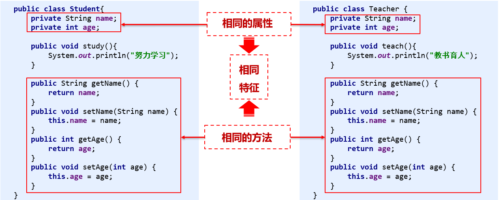
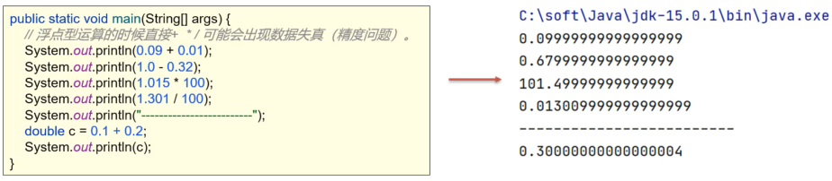
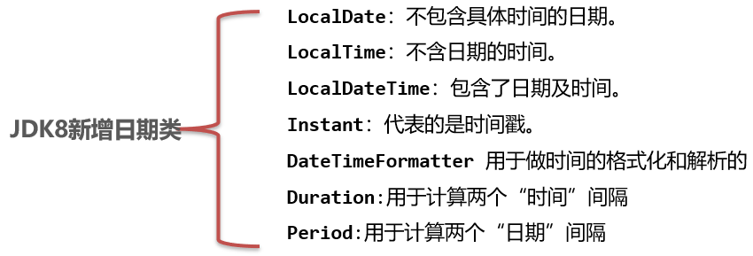
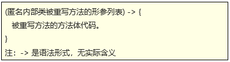
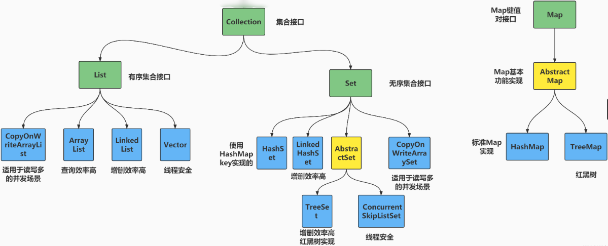
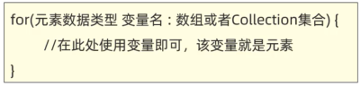

# JavaSE 加强篇 1

## 一、面向对象高级

### 1.1 static

#### 1.1.1 static 修饰变量

static 是**静态**的意思，可以修饰成员变量和成员方法。

static 修饰成员变量表示该成员变量只在内存中**只存储一份**，可以**被共享**访问、修改，这种变量被称作**静态成员变量**（属于类，可以被所有实例对象共享）。

一般通过`类名.静态成员变量`进行访问，`对象.静态成员变量`也可以访问但是不太推荐。

```java
public class User {
  // 静态成员变量
  public static int onlineNum = 161;
  // 实例成员变量
  private String name;
  private int age;
}
public class Main {
    public static void main(String[] args) {
        System.out.println(User.onlineNum);
    }
}
```

#### 1.1.2 static 修饰方法

static 修饰成员方法被称为**静态成员方法**（属于类），它同样是被所有实例对象共享的，通常使用`类名.静态成员方法`来访问（也可`对象.静态成员方法`）。

```java
class User {
    // 静态成员变量
    public static int onlineNum = 161;
    // 实例成员变量
    private String name;
    public User() {}
    public User(String name) {
        this.name = name;
    }
    // 实例成员方法
    public void study() {
        System.out.println(this.name + "好好学习天天向上");
    }
    // 静态成员方法
    public static void getOnlineNum() {
        System.out.println("在线人数"+ User.onlineNum);
    }
}

public class Main {
    public static void main(String[] args) {
        // 直接使用类名访问静态成员方法，也能用某个实例对象访问，但是没必要
        User.getOnlineNum();
        User user = new User("张三");
        // 实例成员方法，必须使用实例对象去调用
        user.study();
    }
}
```

实例方法和静态方法的使用场景：

- 表示对象自己的行为的，且方法中需要**访问实例成员**的，则该方法必须声明成实例方法。
- 如果该方法是以执行一个**共用功能**为目的，则可以声明成静态方法。

#### 1.1.3 static 使用注意事项

- 静态方法只能访问静态的成员，不可以直接访问实例成员。
- 实例方法可以访问静态的成员，也可以访问实例成员。
- 静态方法中是不可以出现 this 关键字的。

#### 1.1.4 static 应用——工具类

当同一个功能多处开发，会出现代码重复度过高的情况，并且这些功能在业务或者逻辑上属于同一个模块。

根据上述问题，我们可以将那些功能封装成一个工具类，这个工具类中都是一些静态方法，每个方法都是以完成一个共用的功能为目的，这个类是用来给系统开发人员共同使用的。

工具类一是调用方便，二是提高了代码复用（一次编写，处处可用）

```java
import java.util.Random;

// 工具类
public class ItheimUtil {
    // 注意：由于工具类无需创建对象，所以把其构造器私有化会显得很专业！
    private ItheimUtil(){}

    // 静态方法，生成验证码
    public static String createVerifyCode(int n){
        // 开发一个验证码：
        // 1、定义一个变量记住验证码。
        String code = "";
        // 2、定义一个变量记住全部验证码字符。
        String data = "abcdefghijklmnopqrstuvwxyzABCDEFGHIJKLMNOPQRSTUVWXYZ0123456789";
        // 3、定义一个循环生成几个随机索引，去得到几个字符
        Random r = new Random();
        for (int i = 0; i < n; i++) {
            // 4、获取随机索引对应的字符。链接给code
            int index = r.nextInt(data.length());
            code += data.charAt(index);
        }
        return code;
    }
}
public class Login {
    public static void main(String[] args) {
        // 开发一个验证码：
        System.out.println(ItheimUtil.createVerifyCode(6));
    }
}
```

为什么工具类中的方法不用实例方法做？

- 实例方法需要创建对象调用。
- 此时用对象只是为了调用方法，这样只会浪费内存。

工具类定义时的其他要求：

- 由于工具里面都是静态方法，直接用类名即可访问，因此，工具类**无需创建对象**，建议将工具类的**构造器进行私有**。

#### 1.1.5 static 应用——代码块

代码块概述

- 代码块是类的 5 大成分之一（成员变量、构造器，方法，**代码块**，内部类），定义在类中方法外。
- 在 Java 类下，使用单独的`{ }`括起来的代码被称为代码块 。

静态代码块:

- 格式：`static{}`
- 特点：需要通过 static 关键字修饰，随着类的加载而加载（比`main`先执行），并且自动触发、只执行一次
- 使用场景：在类加载的时候做一些静态数据初始化的操作，以便后续使用。

```java
public class Main {
    public static String name;
    public static void main(String[] args) {
        System.out.println("main方法被执行了");
        System.out.println(Main.name);
    }
    // 静态代码块，比main先执行，常用于初始化静态资源
    static {
        System.out.println("静态代码块被执行了");
        Main.name = "张三";
    }
}
```

构造代码块（了解，见的少）：

- 格式：`{}`
- 特点：每次创建对象，调用构造器执行时，都会执行该代码块中的代码，并且在**构造器执行前**执行
- 使用场景：初始化实例资源。

```java
class User {
    private String name;
    public User() {
        System.out.println("构造函数被执行了");
        System.out.println(this.name);
    }
    // 构造代码块，比构造器先执行，用于初始化实例资源（其实用的少）
    {
        System.out.println("构造代码块被执行了");
        this.name = "张三";
    }
}
public class Main {
    public static void main(String[] args) {
        User user = new User();
    }
}
```

#### 1.1.6 static 应用——单例

单例模式：可以保证系统中，应用该模块的这个类**永远只有一个实例**，即一个类永远只能创建一个对象。

```java
// 恶汉单例
public class Singleton {
    // 恶汉单例是比较急切的，需要在加载类的时候就创建这个实例
    private static Singleton instance = new Singleton();
    private Singleton() {}
    // 提供访问这个实例的静态方法
    public static Singleton getInstance() {
        return instance;
    }
}
```

```java
// 懒汉单例
public class Singleton {
    private static Singleton instance;
    private Singleton() {}
    // 懒汉单例只要在访问时创建实例即可
    public static Singleton getInstance() {
        return instance == null ? (instance = new Singleton()) : instance;
    }
}
```

### 1.2 继承

#### 1.2.1 继承概述

Java 中提供了一个关键字`extends`，用这个关键字可以让一个类和另一个类建立起父子关系。

`public class Student extends People { }`

`Student`被称为子类（派生类），`People`类被称为父类（基类或超类）。

作用：当子类继承父类后，就可以直接使用父类公共的属性和方法了。

```java
// Student继承了People
class Student extends People {

}
class People {
    public void run() {
        System.out.println("人会跑");
    }
}
public class Main {
    public static void main(String[] args) {
        Student s = new Student();
        s.run();
    }
}
```

#### 1.2.2 继承的规范

继承可以提高代码的复用性，比如以下代码就能用继承来改写。



在改写前我们了解一下继承的规范：子类们相同特征（共性属性、方法）放在父类中定义，子类独有的属性和行为应该定义在子类自己里面。如果子类的独有属性、行为定义在父类中，会导致其他子类也会得到这些属性和行为，这不符合面向对象逻辑。

```java
public class People {
    private String name;
    private int age;

    public String getName() {
        return name;
    }

    public void setName(String name) {
        this.name = name;
    }

    public int getAge() {
        return age;
    }

    public void setAge(int age) {
        this.age = age;
    }
}
public class Teacher extends People {
    // 教师独有的行为
    public void teach() {
        System.out.println("教书育人");
    }
}
public class Student extends People {
    // 学生独有的行为
    public void study() {
        System.out.println("努力学习");
    }
}
```

#### 1.2.3 继承的特点

继承的特点

- 子类可以继承父类的属性和行为，但是子类**不能继承父类的构造器**。
  - 子类有自己的构造器。父类的构造器用于初始化父类自己的实例对象。
  - 对于父类的私有成员，其实继承了，但是不能直接访问。
  - 对于父类的静态成员，没有继承，但是可以共享父类的静态成员。
- 一个类**只能继承一个直接父类**。
  - Java 是单继承，例如 A 不能同时继承 B 和 C。
  - 虽然不支持多继承，但是**支持多层继承**，例如 A 继承 B，B 又继承 C。
- Java 中所有的类都是 Object 类的子类。
  - 要么直接继承了 Object，要么默认继承了 Object，要么间接继承了 Object，Object 是祖宗类。

#### 1.2.4 继承后的成员

在子类方法中访问成员，满足**就近原则**

- 先在子类局部范围里找
- 然后在子类成员范围里找
- 让在在父类成员范围找，如果还找不到就报错

如果父类中，出现了重名的成员，会优先使用子类的，此时如果一定要在子类中使用父类的怎么办？

- 可以通过`super`关键字，指定访问父类的成员。

```java
public class Main {
    public static void main(String[] args) {
        Dog dog = new Dog();
        dog.showName();
    }
}
public class Animal {
    public String name = "某个动物";
    public void run() {
        System.out.println("动物可以跑");
    }
}
public class Dog extends Animal {
    public String name = "某条狗";
    public void  lookDoor() {
        System.out.println("狗可以看门");
    }
    public void showName() {
        String name = "局部名";
        System.out.println(name); // 局部名
        System.out.println(this.name); // 某条狗
        System.out.println(super.name); // 某个动物
        run(); // 动物可以跑
        super.run(); // 动物可以跑
    }
}
```

#### 1.2.5 方法重写

在继承体系中，子类出现了和父类中一模一样的方法声明，我们就称子类这个方法是**重写**的方法。

当子类需要父类的功能，但父类的该功能不完全满足自己的需要时，子类可以重写父类中的方法。

注意：

- 重写方法的名称、形参列表必须与被重写方法的名称和参数列表一致。
- 私有方法不能被重写。
- 子类重写父类方法时，访问权限必须大于或等于父类。
- 子类不能重写父类的静态方法，如果重写那就会报错。

```java
public class Main {
    public static void main(String[] args) {
        Dog dog = new Dog();
        dog.run("小鸡");
    }
}
public class Animal {
    // 子类的run必须是protected或者public
    protected void run(String msg) {
        System.out.println("动物在跑"+msg);
    }
}
public class Dog extends Animal {
    // 重写父类的run方法，run名相同，参数列表msg不能少
    public void run(String msg) {
        System.out.println("狗在追"+msg);
    }
}
```

`@Override`重写注解

- `@Override`是放在重写后的方法上，作为重写是否正确的校验注解。
- 加上该注解后如果重写错误，编译阶段会出现错误提示。
- 建议重写方法都加上`@Override`注解，代码安全，优雅。

#### 1.2.6 继承时的构造器

子类中所有的构造器默认都会先访问父类中无参构造器，再执行自己。因为，子类初始化之前会先完成父类数据空间的初始化。

子类构造器的第一行语句默认是`super()`，意思是隐式的，我们不需要显示调用。除非你要调用父类的有参构造器，就可以显示使用`super(params)`。

```java
public class Main {
    public static void main(String[] args) {
        // Animal构造器被调用 Dog无参数构造器被调用
        Dog dog = new Dog();
        System.out.println("-------------------");
        // Animal构造器被调用 Dog有参数构造器被调用
        Dog dog1 = new Dog("煤球", 1);
    }
}
public class Animal {
    public Animal() {
        System.out.println("Animal构造器被调用");
    }
}
public class Dog extends Animal {
    private String name;
    private int age;
    public Dog() {
        System.out.println("Dog无参数构造器被调用");
    }
    public Dog(String name, int age) {
        this.name = name;
        this.age = age;
        System.out.println("Dog有参数构造器被调用");
    }
}
```

上面这个例子可以看出子类无论是无参还是有参构造器都会隐式调用父类的无参构造器，在[前面的章节](./1.JavaSE基础篇.html#_6-2-3-构造器的注意事项)里说过“一旦定义了有参数构造器，那么无参数构造器就没有了，如果还想用无参数构造器，此时就需要自己手写一个无参数构造器了”。结合起来考虑就是，如果一个类要考虑到它以后可能被继承，那么在写了有参数构造器后就一定要带上无参数构造器。

```java
public class Main {
    public static void main(String[] args) {
        // Animal无参数构造器被调用 Dog无参数构造器被调用
        Dog dog = new Dog();
        System.out.println("-------------------");
        // Animal有参数构造器被调用 Dog有参数构造器被调用
        Dog dog1 = new Dog("煤球", 1);
    }
}
public class Animal {
    private String name;
    private int age;
    public Animal() {
        System.out.println("Animal无参数构造器被调用");
    }
    public Animal(String name, int age) {
        this.name = name;
        this.age = age;
        System.out.println("Animal有参数构造器被调用");
    }
}
public class Dog extends Animal {
    public Dog() {
        System.out.println("Dog无参数构造器被调用");
    }
    // 这里显示使用super(name, age)，从父类无参构造器改为调用父类有参数构造器
    public Dog(String name, int age) {
        super(name, age); // 覆盖隐式的super();
        System.out.println("Dog有参数构造器被调用");
    }
}
```

#### 1.2.7 this 和 super

- this：代表本类对象的引用；
- super：代表父类存储空间的标识。

| 关键字 | 访问成员变量                     | 访问成员的方法                     | 访问构造的方法            |
| ------ | -------------------------------- | ---------------------------------- | ------------------------- |
| this   | `this.成员变量`访问本类成员变量  | `this.成员方法()`访问本类成员方法  | `this()`访问本类构造器    |
| super  | `super.成员变量`访问父类成员变量 | `super.成员方法()`访问父类成员方法 | `super()`方法父类构造函数 |

注意：

- `this()`和`super()`都只能放在**构造器里的第一行**。
- 构造器里有了`this()`，就不能再有`super()`了。
- `super.成员方法()`放置顺序没有要求。

关于`this()`的场景

```java
public class Main {
    public static void main(String[] args) {
        Student s = new Student("张三");
    }
}
public class People {
    private int age;
    public People() {
        System.out.println("People无参数构造器");
    }
    public People(int age) {
        System.out.println("People有参数构造器");
        this.age = age;
    }
}
public class Student extends People {
    private String name;
    private String schoolName;
    public Student() {
        System.out.println("Student无参数构造器");
    }
    /*
      this()只能放在第一行。并且本构造函数里不能有Super(...)，这是为了避免重复调
      用父类构造函数。这个this()调用Student(String name, String schoolName)，它
      又进而调用super(18)
     */
    public Student(String name) {
        this(name, "清华");
    }
    public Student(String name, String schoolName) {
        super(18); // 只能放在方法的第一行
        this.name = name;
        this.schoolName = schoolName;
        System.out.println("Student有参数构造器");
    }
}
```

### 1.3 包、权限修饰符、final、枚举

#### 1.3.1 包

包是用来分门别类的管理各种不同类的，类似于文件夹，建包利于程序的管理和维护。

建包的语法格式：`package 公司域名倒写.技术名称`。包名建议全部英文小写，且具备意义。建包语句必须在第一行。`package com.itheima.javabean;`

导包

- 相同包下的类可以直接访问，不同包下的类必须导包，才可以使用。导包格式：`import 包名.类名`。
- 假如一个类中需要用到不同类，而这两个类的名称是一样的，那么默认只能导入一个类，另一个类要带包名访问。

#### 1.3.2 权限修饰符

权限修饰符：是用来控制一个成员能够被访问的范围。

可以修饰成员变量，方法，构造器，内部类，不同权限修饰符修饰的成员能够被访问的范围将受到限制。

权限修饰符有 4 中作用范围，有小到大是`private`、`缺省`、`protected`、`public`。

| 修饰符    | 同一个类中 | 同一个包中其他类 | 不同包下的子类 | 不同包下的无关类 |
| --------- | ---------- | ---------------- | -------------- | ---------------- |
| private   | √          |                  |                |                  |
| 缺省      | √          | √                |                |                  |
| protected | √          | √                | √              |                  |
| public    | √          | √                | √              | √                |

建议

- 成员变量一般私有。
- 方法一般公开。
- 如果该成员只希望本类访问，使用`private`修饰。
- 如果该成员只希望本类、同一个包下的其他类和子类、不同包的子类访问，使用`protected`修饰。

#### 1.3.3 final 和常量

final 的作用：

- final 关键字是最终的意思，可以修饰（类、方法、变量）。
- 修饰类：表明该类是最终类，不能被继承。
- 修饰方法：表明该方法是最终方法，不能被重写。
- 修饰变量：表示该变量第一次赋值后，不能再次被赋值（有且仅能被赋值一次）。

final 修饰变量的注意：

- final 修饰的变量是基本类型：那么变量存储的数据值不能发生改变。
- final 修饰的变量是引用类型：那么变量存储的地址值不能发生改变，但是地址指向的对象内容是可以发生变化的。

常量：使用了`public static final`修饰的成员变量，它必须有初始值，而且执行的过程中其值不能被改变。

常量名的命名规范：英文单词全部大写，多个单词下划线连接起来。

常量的作用：通常用来记录系统的配置数据。`public static final String LOGIN_NAME = "admin"`

常量的原理：在编译阶段会进行“宏替换”，把使用常量的地方全部替换成真实的字面量。

#### 1.3.4 枚举

枚举是 Java 中的一种特殊类型，它是为了做信息的标志和信息的分类的。

```java
enum Season {
  SPRING,
  SUMMER,
  AUTUMN,
  WINTER
};
```

反编译后的样子

```java
Compiled from "Season.java"
public final class Season extends java.lang.Enum<Season> {
  public static final Season SPRING = new Season();
  public static final Season SUMMER = new Season();
  public static final Season AUTUMN = new Season();
  public static final Season WINTER = new Season();
  public static Season[] values();
  public static Season valueOf(java.lang.String);
}
```

枚举的特征：

- 枚举类都是继承了枚举类型：`java.lang.Enum`。
- 枚举都是最终类，不可以被继承。
- 构造器的都是私有的，枚举对外不能创建对象。
- 枚举类的第一行默认都是罗列枚举对象的名称的。

选择常量做信息标志和分类，虽然可以实现可读性，但是入参值不受约束，代码相对不够严谨。而用枚举，代码可读性好，入参约束严谨，代码优雅，是最好的信息分类技术。

### 1.4 抽象类

#### 1.4.1 abstract

在 Java 中`abstract`是抽象类的意思，可以修饰类、成员方法。`abstract`修饰类，这个类就是抽象类；修饰方法，这个方法就是抽象方法。

注意：

- 抽象方法只有方法签名，不能声明方法体
- 一个类中如果定义了抽象方法，这个类必须声明成抽象类，否则报错。

#### 1.4.2 理解抽象类

- 抽象类可以理解成不完整的设计图，一般作为父类，让子类来继承。
- 当父类知道子类一定要完成某些行为，但是每个子类该行为的实现有不同，于是该父类就把该行为定义成抽象方法的形式，具体实现交给子类去完成。此时这个类就可以声明成抽象类。

```java
// 一个类中如果定义了抽象方法，这个类必须声明成抽象类
public abstract class Animal {
    // 抽象方法只有方法签名，不能声明方法体
    public abstract void run();
}
public class Dog extends Animal {
    // 子类实现有不同
    @Override
    public void run() {
        System.out.println("狗在跑");
    }
}
public class Cat extends Animal {
    // 子类实现有不同
    @Override
    public void run() {
        System.out.println("猫在跑");
    }
}
```

#### 1.4.3 特征和注意事项

- 类有的成员（成员变量、方法、构造器），抽象类都具备。
- 抽象类中不一定有抽象方法，有抽象方法的类一定是抽象类。
- 一个类继承了抽象类，那么它必须重写完抽象类的全部抽象方法，否则这个类也必须定义成抽象类。
- 不能用`abstract`修饰变量、代码块、构造器。
- 最重要的特征：得到了抽象方法，失去了创建对象的能力（假如能创建，那调用那个抽象方法就会报错）。

#### 1.4.4 final 和 abstract 是什么关系

- 互斥关系
- abstract 定义的抽象类作为模板让子类继承，final 定义的类不能被继承。
- 抽象方法定义通用功能让子类重写，final 定义的方法子类不能重写。

#### 1.4.5 模板方法模式

当系统中出现同一个功能多处在开发，而该功能中大部分代码时一样的，只有其中部分可能不同的时候，就可以使用**模板方法模式**。

模板方法模式实现步骤：

- 先定义一个抽象类。
- 把相同或相似代码，也就是功能**通用且能确定**的代码作为**模板方法**的进行书写定义。
- 把不同的代码，也就是**不通用不确定**的代码作为**抽象方法**进行书写。
- 子类继承这个抽象类，子类**重写抽象方法**，完成各自**不同的功能**。

```java
public class Test {
    public static void main(String[] args) {
        // 目标：理解模板方法模式的思想和使用步骤。
        StudentMiddle s = new StudentMiddle();
        s.write();

        StudentChild s2 = new StudentChild();
        s2.write();
    }
}
public abstract class Student {
    /**
       正式：声明了模板方法模式
       final ：这个方法不能被子类重写，因为它是给子类直接使用的。
     */
    public final void write(){
        System.out.println("\t\t\t\t《我的爸爸》");
        System.out.println("你的爸爸是啥样，来说说：");
        // 正文部分（每个子类都要写的，每个子类写的情况不一样
        //  因此。模板方法把正文部分定义成抽象方法，交给
        //  具体的子类来完成）
        System.out.println(writeMain());

        System.out.println("我的爸爸简直太好了~~");
    }
    // 抽象方法
    public abstract String writeMain();
}
public class StudentChild extends Student{
    @Override
    public String writeMain() {
        return "的爸爸太牛b了，他总是买东西给我吃。。";
    }
}
public class StudentMiddle extends Student{
    @Override
    public String writeMain() {
        return  "我的爸爸也很牛，我开车都不看红绿灯的，" +
                "下辈子还要做他儿子~~";
    }
}
```

### 1.5 接口

#### 1.5.1 认识接口

接口的格式：

```java
public interface 接口名 {
    // 常量
    // 抽象方法
}
```

JDK8 之前接口中只能是抽象方法和常量，没有其他成分了。

```java
// 声明了一个接口，体现一种规范，规范一定是公开的
public interface InerfaceDemo {
    // 接口中的成分特点：JDK8之前接口中只能有抽象方法和常量
    public static final String LOGIN_NAME = "admin";
    // 由于接口体现规范思想，规范默认都是公开的，所以代码层面，public abstract可以省略不写
    public abstract void run();
    // void eat();
}
```

#### 1.5.2 接口被实现

接口是用来被类**实现**(implements)的，实现接口的类称为**实现类**。接口可以被类**单实现**，也可以被类**多实现**。但要注意一点，一个类实现接口，必须重写完全部接口的全部抽象方法，否则这个类需要定义成抽象类

```java
public interface InerfaceDemo {
    public abstract void run();
    public abstract void eat();
}
public interface InerfaceDemo2 {
    public abstract void study();

}
// 可以多实现
public class Student implements InerfaceDemo, InerfaceDemo2 {
    // 必须重写所有抽象方法
    @Override
    public void run() {}
    @Override
    public void eat() {}
    @Override
    public void study() {}
}
```

#### 1.5.3 接口可多继承接口

类和类的关系：单继承。  
类和接口的关系：多实现。  
接口和接口的关系：多继承，一个接口可以同时继承多个接口。

接口多继承的作用：规范合并，整合多个接口为同一个接口，便于子类实现。

```java
public interface InerfaceDemo {
    public abstract void run();
    public abstract void eat();
}
public interface InerfaceDemo2 {
    public abstract void study();

}
// 一个接口可以同时继承多个接口
public interface InerfaceDemo3 extends InerfaceDemo, InerfaceDemo2{
}
// 那么一个实现类只要实现InerfaceDemo3就可以间接多实现InerfaceDemo和InerfaceDemo2
public class Student implements InerfaceDemo3 {
    @Override
    public void run() {}
    @Override
    public void eat() {}
    @Override
    public void study() {}
}
```

#### 1.5.4 JDK8 之后的接口

JDK8 之后的接口新增了三种方法（开发中很少用到，主要是源码中用了）：

- 默认方法：`default`修饰，实现类对象调用。
- 静态方法：`static`修饰，必须用当前接口名调用。
- 私有方法：`private`修饰，JDK9 开始才有的，只能在接口内部被调用。

```java
public class Main {
    public static void main(String[] args) {
        People p = new People();
        p.run(); // 调实现类里实现的方法
        p.eat(); // 调接口里的默认方法
        InerfaceDemo.study(); // 调接口的静态方法
    }
}
public class People implements InerfaceDemo {
    public void run() {
        System.out.println("跑步");
        InerfaceDemo.study();
    }
}
public interface InerfaceDemo {
    public abstract void run();
    public default void eat() {
        System.out.println("吃饭");
        InerfaceDemo.study();
        // 接口的私有方法只能在接口内部调用
        this.teach();
    }
    public static void study() {
        System.out.println("学习");
    }
    private void teach() {
        System.out.println("教书育人");
    }
}
```

#### 1.5.5 接口的注意事项

- 接口不能创建对象。
- 一个类实现多个接口，多个接口中有同样的静态方法不冲突。
- 一个类继承了父类，同时又实现了接口，父类中和接口中有同名方法，默认用父类的。
- 一个类实现了多个接口，多个接口中存在同名的默认方法，不冲突，这个类重写该方法即可。
- 一个接口继承多个接口，是没有问题的，如果多个接口中存在规范冲突（例如同名但返回值类型不同）则不能多继承。

### 1.6 多态、内部类

#### 1.6.1 了解多态

多态：同类型的对象，执行同一个行为，会表现出不同的行为特征。简单来说就是值对象可以有多种形态。

多态的前提：有继承/实现关系；有父类引用指向子类对象；有方法重写。

多态的常见形式：

```java
父类类型 对象名称 = new 子类构造器;
接口 对象名称 = new 实现类构造器;
```

```java
interface Animal {
    public abstract void run();
}
public class Dog implements Animal {
    @Override
    public void run() {
        System.out.println("狗跑得非常快");
    }
}
public class Tortoise implements Animal {
    @Override
    public void run() {
        System.out.println("乌龟跑地非常慢");
    }
}
public class Main {
    public static void main(String[] args) {
        Animal a1 = new Dog();
        Animal a2 = new Tortoise();
        a1.run(); // 狗跑得非常快
        a2.run(); // 乌龟跑地非常慢
    }
}
```

多态中成员访问特点：

- 方法调用：编译看左边，运行看右边。
- 变量调用：编译看左边，运行也看左边。（多态侧重行为多态）

```java
interface Animal {
    public String name = "动物名";
    public abstract void run();
}
public class Dog implements Animal {
    public String name = "狗名";
    @Override
    public void run() {
        System.out.println("狗跑得非常快");
    }
}
public class Tortoise implements Animal {
    public String name = "乌龟名";
    @Override
    public void run() {
        System.out.println("乌龟跑地非常慢");
    }
}
public class Main {
    public static void main(String[] args) {
        Animal a1 = new Dog();
        Animal a2 = new Tortoise();
        System.out.println(a1.name); // 动物名，多态体现在行为上的，与属性无关
        a1.run(); // 狗跑得非常快
        System.out.println(a2.name); // 动物名，多态体现在行为上的，与属性无关
        a2.run(); // 乌龟跑地非常慢
    }
}
```

#### 1.6.2 多态的优势和劣势

优势：

- 在多态形式下，右边对象可以实现解耦，便于扩展和维护（以后换一个子类构造器就可以了）。
- 定义方法的时候，使用父类型作为参数，该方法就可以接收这父类的一切子类对象，体现出多态的扩展性与便利。

```java
public class Animal {
    public String name = "动物名";
    public void run() {
        System.out.println(this.name);
        System.out.println("动物会跑");
    }
}
public class Dog extends Animal {
    public String name = "狗名";
    @Override
    public void run() {
        System.out.println(this.name);
        System.out.println("狗跑得非常快");
    }
}
public class Tortoise extends Animal {
    public String name = "乌龟名";
    @Override
    public void run() {
        System.out.println(this.name);
        System.out.println("乌龟跑地非常慢");
    }
}
public class Main {
    public static void main(String[] args) {
        Animal a1 = new Dog(); // 解耦，右边可以自由选择子类构造器
        Animal a2 = new Tortoise();
        go(a1);
        go(a2);
        /*
        * 预备~~~
          狗名
          狗跑得非常快
          结束~~~
          预备~~~
          乌龟名
          乌龟跑地非常慢
          结束~~~
        *
        */
    }
    // 定义方法，传入的参数类型选择父类，那么调用时可以传入它的任何子类
    public static void go(Animal animal) {
        System.out.println("预备~~~");
        animal.run();
        System.out.println("结束~~~");
    }
}
```

劣势：多态下不能使用子类的独有功能。

```java
public class Dog extends Animal {
    public String name = "狗名";
    @Override
    public void run() {
        System.out.println(this.name);
        System.out.println("狗跑得非常快");
    }
    // 子类独有方法，Animal a1 = new Dog()，这个a1就调用不了lookDoor
    public void lookDoor() {
        System.out.println("狗看门");
    }
}
```

#### 1.6.3 多态下引用类型转换

自动类型转换(从子到父)：子类对象赋值给父类类型的变量指向。`Animal animal = new Cat()`

强制类型转换(从父到子)：

- 从父到子必须强制类型转换：`子类 对象变量 = (子类)父类类型的变量`
- 作用：可以解决多态下的劣势，可以实现调用子类独有的功能。
- 注意：如果转型后的类型和对象真实类型不是同一种类型，那么就会报`ClassCastException`。`Animal a = new Tortoise(); Dog d = (Dog)a; // ClassCastException`

```java
public class Animal {
    public void run() {
        System.out.println("动物会跑");
    }
}
public class Dog extends Animal {
    @Override
    public void run() {
        System.out.println("狗跑得非常快");
    }
    public void lookDoor() {
        System.out.println("狗看门");
    }
}
public class Main {
    public static void main(String[] args) {
        Animal animal = new Dog();
        animal.run(); // 狗跑得非常快，多态的优势
        Dog dog = (Dog)animal; // 强制类型转换
        // 解决多态的劣势，转成子类，就能调用它独有方法。
        dog.lookDoor(); // 狗看门

        // Tortoise tortoise = (Tortoise)animal; 会报错，得确保强制的类型确实是它的父类
    }
}
```

Java 建议强转前使用`instanceof`判断当前对象的真实类型，再进行强转。`变量名 instanceof 真实类型`。

```java
public class Animal {
    public void run() {
        System.out.println("动物会跑");
    }
}
public class Dog extends Animal {
    @Override
    public void run() {
        System.out.println("狗跑得非常快");
    }
    public void lookDoor() {
        System.out.println("狗看门");
    }
}
public class Tortoise extends Animal {
    @Override
    public void run() {
        System.out.println("乌龟跑得非常慢");
    }
    public void layEggs() {
        System.out.println("乌龟下蛋");
    }
}
public class Main {
    public static void main(String[] args) {
        Animal animal1 = new Dog();
        go(animal1);
        System.out.println("-----------------");
        Animal animal2 = new Tortoise();
        go(animal2);
    }
    public static void go(Animal animal) {
        // run是子类都重写的方法，利用多态的优势，直接调用它
        animal.run();
        // 要调用子类特有的方法，需要强转，强转前最好使用instanceof进行判断
        if (animal instanceof Dog) {
            Dog dog = (Dog)animal;
            dog.lookDoor();
        } else if (animal instanceof Tortoise) {
            Tortoise tortoise = (Tortoise)animal;
            tortoise.layEggs();
        }
    }
}
```

### 1.7 内部类

#### 1.7.1 内部类概述

当一个事物的内部，还有一个部分需要一个完整的结构进行描述，而这个内部的完整的结构又只为外部事物提供服务，那么整个内部的完整结构可以选择使用内部类来设计。

内部类就是定义在一个类里面的类，里面的类可以理解成“寄生”，外部类可以理解成“宿主”。

作用：

- 内部类通常可以方便访问外部类的成员，包括私有的成员。
- 内部类提供了更好的封装性，内部类本身就可以用`private`、`protected`等修饰，封装性可以做更多控制。

分类：

- 静态内部类[了解]
- 成员内部类（非静态内部类）[了解]
- 局部内部类[了解]
- 匿名内部类（重点）

#### 1.7.2 静态内部类

- 有`static`修饰，属于外部类本身。
- 它的特点和使用与普通类是完全一样的，类有的成分它都有，只是位置在别人里面而已。

```java
public class Outer {
    // 静态成员内部类
    public static class Inner {
        private String name;
        private int age;
        public static String schoolName;
        public Inner() {}
        public Inner(String name, int age) {
            this.name = name;
            this.age = age;
        }
        public void show() {
            System.out.println("名称：" + name);
        }
        public String getName() {
            return name;
        }
        public void setName(String name) {
            this.name = name;
        }
        public int getAge() {
            return age;
        }
        public void setAge(int age) {
            this.age = age;
        }
    }
}
public class Main {
    public static void main(String[] args) {
        // 使用静态成员内部类
        Outer.Inner inner = new Outer.Inner("张三", 18);
        inner.show();
    }
}
```

静态内部类的访问拓展：

1. 静态内部类中是否可以直接访问外部类的静态成员？
   - 可以，外部类的静态成员只有一份可以被共享访问。
2. 静态内部类中是否可以直接访问外部类的实例成员？
   - 不可以的，外部类的实例成员必须用外部类对象访问。

#### 1.7.3 成员内部类

- 无`static`修饰，属于外部类的对象。
- JDK16 之前，成员内部类中不能定义静态成员，JDK16 开始也可以定义静态成员了。

```java
public class Outer {
    // 成员内部类
    public class Inner {
        private String name;
        private int age;
        private static String schoolName = "清华";
        public Inner() {}
        public Inner(String name, int age) {
            this.name = name;
            this.age = age;
        }
        public void show() {
            System.out.println("名称：" + name);
        }
        public static String getSchoolName() {
            return schoolName;
        }
        public String getName() {
            return name;
        }
        public void setName(String name) {
            this.name = name;
        }
        public int getAge() {
            return age;
        }
        public void setAge(int age) {
            this.age = age;
        }
    }
}
public class Main {
    public static void main(String[] args) {
        // 外部类名.内部类名 对象名 = new 外部类构造器.new 内部类构造器()
        Outer.Inner inner = new Outer().new Inner("张三", 18);
        inner.show();
        System.out.println(Outer.Inner.getSchoolName());
    }
}
```

成员颞部类的访问拓展：

1. 成员内部类中是否可以直接访问外部类的静态成员？
   - 可以，外部类的静态成员只有一份可以被共享访问。
2. 成员内部类的实例方法中是否可以直接访问外部类的实例成员？
   - 可以的，因为必须先有外部类对象，才能有成员内部类对象，所以可以直接访问外部类对象的实例成员。

在成员内部类中访问所在外部类对象 ，格式：`外部类名.this`

```java
class People{
    private int heartbeat = 150;
    public class Heart{
        private int heartbeat = 110;
        public void show(){
            int heartbeat = 78;
            System.out.println(??); // 78，heartbeat
            System.out.println(??); // 110，this.heartbeat
            System.out.println(??); // 150，People.this.heartbeat
        }
    }
}
```

#### 1.7.4 局部内部类

- 局部内部类放在方法、代码块、构造器等**执行体**中。
- 局部内部类的类文件名为：`外部类$N内部类.class`

```java
// 了解局部内部类的语法
public class Test {
    static {
        // 局部内部类
        class Dog{}
        // 局部抽象内部类
        abstract class Animal{}
        // 局部接口
        interface SportManInter{}
    }
    public static void main(String[] args) {
        // 局部内部类
        class Cat{
            private String name;
            public static int onLineNumber = 100;
            public String getName() {
                return name;
            }
            public void setName(String name) {
                this.name = name;
            }
        }
        // 局部接口
        interface SportManInter{}

        Cat c = new Cat();
        c.setName("叮当猫~");
        System.out.println(c.getName());
    }
}
```

#### 1.7.5 匿名内部类

- 本质上是一个没有名字的局部内部类，定义在方法中、代码块中等。
- 作用：方便创建子类对象，最终目的是为了简化代码编写。

```java
new 类|抽象类名|接口名() {
    重写方法;
}
// 例如
Employee a = new Employee() {
    public void work() {

    }
}
a.work();
```

```java
public class Test {
    public static void main(String[] args) {
        // 用匿名内部类改写，产生一个匿名内部类的对象
        Animal a = new Animal() {
            @Override
            public void run() {
                System.out.println("老虎跑得快");
            }
        }
    }
}
// class Tigger extends Animal {
//     @Override
//     public void run() {
//         System.out.println("老虎跑得快");
//     }
// }
abstract class Animal {
   public abstract void run();
}
```

特点：

- 匿名内部类是一个没有名字的内部类。
- 匿名内部类写出来就会产生一个匿名内部类的对象。

```java
// 匿名内部类作为参数进行传递，有点类似js中将函数作为参数传递
public class Test2 {
    public static void main(String[] args) {
        Swimming s = new Swimming() {
            @Override
            public void swim() {
                System.out.println("学生快乐的自由泳🏊‍");
            }
        };
        go(s);

        System.out.println("--------------");

        Swimming s1 = new Swimming() {
            @Override
            public void swim() {
                System.out.println("老师泳🏊的贼快~~~~~");
            }
        };
        go(s1);

        System.out.println("--------------");

        // 直接传，不用变量进行接收了
        go(new Swimming() {
            @Override
            public void swim() {
                System.out.println("运动员🏊的贼快啊~~~~~");
            }
        });
    }

    // 学生 老师 运动员可以一起参加游泳比赛
    public static void go(Swimming s){
        System.out.println("开始。。。");
        s.swim();
        System.out.println("结束。。。");
    }
}


interface Swimming{
    void swim();
}
```

点击事件的监听用匿名内部类来实现，这就更像 js 的匿名函数写法了

```java
//  为按钮绑定点击事件监听器。
btn.addActionListener(new ActionListener() {
    @Override
    public void actionPerformed(ActionEvent e) {
        System.out.println("登录一下~~");
    }
});
// 简化（后续会讲），太像js的箭头函数了
btn.addActionListener(e -> System.out.println("登录一下~~"));
```

## 二、常用 API

### 2.1 Object 和 Objects

一个类要么默认继承了 Object 类，要么间接继承了 Object 类，Object 类是 Java 中的祖宗类。Object 作为所有类的父类，提供了很多常用的方法给每个子类拿来使用。

Object 类的常用方法

- `public String toString()`：默认是放回当前对象在堆内存中的地址信息`类的全限名@内存地址`。
- `public boolean equals(Object o)`：默认是比较当前对象与另一个对象的地址是否相同，相同放回 true，不同放回 false。

toString 存在的意义：父类 toString()方法存在的意义就是为了被子类重写，以便放回对象的内容信息，而不是地址信息。

```java
public class Student {
    private String name;
    private int age;
    private char sex;
    public Student() {
    }
    public Student(String name, int age, char sex) {
        this.name = name;
        this.age = age;
        this.sex = sex;
    }
    // 重写Object上的toString
    @Override
    public String toString() {
        return "Student{" +
                "name='" + name + '\'' +
                ", age=" + age +
                ", sex=" + sex +
                '}';
    }
}
public class Main {
    public static void main(String[] args) {
        Student s = new Student("张三", 18, '男');
        System.out.println(s.toString()); // Student{name='张三', age=18, sex=男}
    }
}
```

equals 存在的意义：父类 equals 方法存在的意义就是为了被子类重写，以便子类自己来定制比较规则。

```java
import java.util.Objects;

public class Student {
    private String name;
    private int age;
    private char sex;
    public Student() {
    }
    public Student(String name, int age, char sex) {
        this.name = name;
        this.age = age;
        this.sex = sex;
    }

    @Override
    public boolean equals(Object o) {
        if (this == o) return true;
        if (o == null || getClass() != o.getClass()) return false;
        Student student = (Student) o;
        // 判断对应的属性，属性是基本类型直接用`==`判断，是引用类型就用Objects.equals判断（下面会讲）
        return age == student.age && sex == student.sex && Objects.equals(name, student.name);
    }
}
public class Main {
    public static void main(String[] args) {
        Student s = new Student("张三", 18, '男');
        Student s2 = new Student("张三", 18, '男');
        System.out.println(s.equals(s2)); // true
    }
}
```

Objects 继承自 Object，它是一个工具类，提供了一些方法去完成一些功能。

`Objects.equals`的源码如下：

```java
// 是同一个对象返回true，不是同一个对象但是它们对象的属性都一样就返回true
public static boolean equals(Object a, Object b) {
    return (a == b) || (a != null && a.equals(b));
}
```

`Object.isNull`的源码如下：

```java
public static boolean isNull(Object obj) {
    return obj == null;
}
```

### 2.2 StringBuilder

StringBuilder 是一个可变的字符串类，我们可以把它看做是一个对象容器。`StringBuilder(...)`

StringBuilder 作用：提高字符串的操作效率，如拼接、修改等。

StringBuilder 常用方法：

| 方法名称                                | 说明                                                    |
| --------------------------------------- | ------------------------------------------------------- |
| `public StringBuilder append(任意类型)` | 添加数据并返回 StringBuilder 对象本身                   |
| `public StringBuilder reverse()`        | 将对象的内容反转                                        |
| `public int length()`                   | 返回对象内容长度                                        |
| `public String toString()`              | 通过 toString()就可以实现把 StringBuilder 转换成 String |

```java
public class Main {
    public static void main(String[] args) {
        StringBuilder s = new StringBuilder();
        // append是拼接
        s.append('你').append("是").append('谁').append(1).append("23");
        System.out.println(s);
        // reverse是反转
        s.reverse().append("789");
        System.out.println(s);
        // 用toString，将StringBuilder转为String
        check(s.reverse().toString());
    }
    public static void check(String s) {
        System.out.println("check: " + s);
    }
}
```

- `String`内容是不可变的，使用`+`进行拼接它时，其实每次都新生成了一个 StringBuilder 用于拼接，在用一个新 String 用于保存。
- `StringBuilder`内部是可变的，拼接字符串性能好，不用每次创建新 StringBuilder 对象，复用即可。
- 所以定义字符串使用`String`，而拼接、修改等操作使用`StringBuilder`。

### 2.3 Math、BigDecimal

#### 2.3.1 Math

Math 类：包含执行基本数字运算的方法，Math 类没有提供公开的构造器。

Math 类的常用方法：

| 方法名                                         | 说明                                       |
| ---------------------------------------------- | ------------------------------------------ |
| `public static int abs(int a)`                 | 获取参数的绝对值                           |
| `public static double ceil(double a)`          | 向上取整                                   |
| `public static double floor(double a)`         | 向下取整                                   |
| `public static int round(float a)`             | 四舍五入                                   |
| `public static int max(int a, int b)`          | 获取两个 int 值中的较大值                  |
| `public static double pow(double a, double b)` | 返回 a 的 b 次幂的值                       |
| `public static double random()`                | 返回值为 double 的随机数，范围`[0.0, 1.0)` |

```java
// 返回[a, b]的随机数
public static int getRandom(int a, int b) {
    if (a >= b) return a;
    return (int)(Math.random() * (b + 1 - a)) + a;
}
```

#### 2.3.2 BigDecimal

BigDecimal 作用：用于解决浮点型运算精度失真的问题



对于 BigDecimal 构造器，是禁止使用`BigDecimal(double)`将 double 值转换为 BigDecimal 对象。

- 说明：`BigDecimal(double)`存在精度损失风险，在精度计算或值比较的场景中可能会导致业务逻辑异常。
- 如：`BigDecimal g = new BigDecimal(0.1F)`实际的存储值为`0.10000000149`。
- 证例：优先推荐入参为 String 的构造方法，或使用 BigDecimal 的 valueOf 方法，此方法内部其实执行了 Double 的 toString，而 Double 的 toString 按 double 的实际能表的精度对尾数进行了截取。
- `BigDecimal r1 = new BigDecimal("0.1");`或`BigDecimal r2 = BigDecimal.valueOf(0.1)`

BigDecimal 常见 API

| 方法名                                                       | 说明          |
| ------------------------------------------------------------ | ------------- |
| `public BigDecimal add(BigDecimal b)`                        | 加法          |
| `public BigDecimal subtract(BigDecimal b)`                   | 减法          |
| `public BigDecimal mutiply(BigDecimal b)`                    | 乘法          |
| `public BigDecimal divide(BigDecimal b)`                     | 除法          |
| `public BigDecimal divide(BigDecimal b, 精确几位, 舍入模式)` | 除法          |
| `public double doubleValue()`                                | 转化成 double |

```java
import java.math.BigDecimal;
import java.math.RoundingMode;
import java.util.Arrays;

public class Main {
    public static void main(String[] args) {
        // 浮点数运算精度丢失的问题
        System.out.println(0.09 * 0.01);
        System.out.println(1.0 - 0.32);
        System.out.println(1.015 * 100);
        System.out.println(1.301 / 100);

        System.out.println("----------------------------------");

        double a = 0.1;
        double b = 0.2;
        double c = a + b;
        System.out.println(c);

        System.out.println("------------------------------------");

        // 使用BigDecimal.valueOf代替BigDecimal构造器，避免精度损失
        BigDecimal a1 = BigDecimal.valueOf(a);
        BigDecimal b1 = BigDecimal.valueOf(b);
        // BigDecimal c1 = a1.add(b1); // 加，使用BigDecimal提供的加法
        // BigDecimal c1 = a1.subtract(b1); // 减，使用BigDecimal提供的减法
        // BigDecimal c1 = a1.multiply(b1); // 乘，使用BigDecimal提供的乘法
        BigDecimal c1 = a1.divide(b1); // 除，使用BigDecimal提供的除法
        System.out.println(c1);

        System.out.println("------------------------------------");

        double rs = c1.doubleValue(); // 将BigDecimal转为double
        System.out.println(rs);

        System.out.println("------------------------------------");

        // 10.0 / 3.0 本身就是精度丢失的，那么我们需要给它配置保留精度的参数
        BigDecimal a2 = BigDecimal.valueOf(10.0);
        BigDecimal b2 = BigDecimal.valueOf(3.0);
        // 对于3.333333...保留2位小数，并四舍五入（0.5向上）
        BigDecimal c2 = a2.divide(b2, 2, RoundingMode.HALF_UP);

    }
}

```

### 2.4 System

System 的功能是通用的，都是直接用类名调用即可，所以 System 不能被实例化。

System 类的常用方法

| 方法名                                                                         | 说明                                         |
| ------------------------------------------------------------------------------ | -------------------------------------------- |
| `public static void exit(int status)`                                          | 终止当前运行的 Java 虚拟机，非零表示异常终止 |
| `public static long currentTimeMillis()`                                       | 返回当前系统的时间毫秒值形式                 |
| `public static void arraycopy(源数组, 开始索引, 目标数组, 开始索引, 拷贝个数)` | 数组拷贝                                     |

```java
import java.util.Arrays;

public class Main {
    public static void main(String[] args) {
        // System.exit(0); // 终止程序，不要用

        // 从1970年1月1日到现在经过多少毫秒
        long time = System.currentTimeMillis();
        System.out.println(time);

        // 数组拷贝
        int[] arr1 = { 10, 20, 30, 40, 50, 60, 70 };
        int[] arr2 = new int[6]; // { 0, 0, 0, 0, 0, 0 } ===> { 0, 0, 40, 50, 60, 0 }
        // 源数组, 开始索引, 目标数组, 开始索引, 拷贝个数
        System.arraycopy(arr1, 3, arr2, 2, 3);
        System.out.println(Arrays.toString(arr2));
    }
}
```

### 2.5 时间

#### 2.5.1 Date

Date 类代表当前所在系统的日期时间信息。

`public Date(...)`创建一个 Date 对象，不传参那就是代表系统当前时间，参考可以将参数转换成对应的 Date 日期对象。

`public long getTime()`获取时间对象的毫秒值。

`public void setTime(long time)`设置日期对象的时间为当前时间毫秒值对应的时间。

```java
import java.util.Date;

public class Main {
    public static void main(String[] args) {
        Date date = new Date();
        System.out.println(date);
        System.out.println(date.getTime());

        Date date2 = new Date(1682582830506L);
        System.out.println(date2);
        date2.setTime(1682582835506L);
        System.out.println(date2);
    }
}
```

#### 2.5.2 SimpleDateFormat

SimpleDateFormat 类作用

- 可以对 Date 对象或时间毫秒值**格式化**成我们喜欢的时间形式。
- 也可以把字符串的时间形式解析成日期对象。

`public SimpleDateFormat(...)`构造一个 SimpleDateFormat，如果不传参数则使用默认格式，有参数则按照指定格式来格式化。

`public final String format(Date date)`将日期格式化成日期/时间**字符串**。

`public final String format(Object time)`将时间毫秒值格式化成日期/时间**字符串**。

常用格式：

| 字符 | 说明      | 举例                 |
| ---- | --------- | -------------------- |
| `y`  | 年        | `1996`、`96`         |
| `M`  | 月        | `07`、`July`、`Jul`  |
| `d`  | 日        | `28`                 |
| `E`  | 星期      | `Tuesday`、`Tue`     |
| `u`  | 星期      | `1`星期一，`7`星期天 |
| `a`  | 上午/下午 | `AM`、`PM`           |
| `H`  | 时(24 制) | `23`                 |
| `h`  | 时(12 制) | `11`                 |
| `m`  | 分        | `59`                 |
| `s`  | 秒        | `59`                 |
| `S`  | 毫秒      | `978`                |

```java
import java.text.SimpleDateFormat;
import java.util.Date;

public class Main {
    public static void main(String[] args) {
        Date date = new Date();
        System.out.println(date);

        // 创建格式化对象
        SimpleDateFormat sdf = new SimpleDateFormat("yyyy年MM月dd日 HH:mm:ss EEE a");
        // 利用这个对象去格式化date
        String rs = sdf.format(date);
        System.out.println(rs);

        long time = System.currentTimeMillis();
        // 利用这个对象去格式化毫秒值
        String rs2 = sdf.format(time);
        System.out.println(rs2);
    }
}
```

`public Date parse(String source)`从给定字符串的开始解析文本以生成日期。

```java
import java.text.ParseException;
import java.text.SimpleDateFormat;
import java.util.Date;

public class Main {
    public static void main(String[] args) throws ParseException {
        try {
            // 2021年08月06日 11:11:11往后2天14小时49分06秒后的时间是多少
            SimpleDateFormat sdf = new SimpleDateFormat("yyyy年MM月dd日 HH:mm:ss");
            Date date = sdf.parse("2021年08月06日 11:11:11");
            long time = (((2 * 24 + 14) * 60 + 49) * 60 + 6) * 1000;
            String rs = sdf.format(date.getTime() + time);
            System.out.println(rs);
        } catch(ParseException e) {
            System.out.println("日期的格式与给定格式不符");
        }
    }
}
```

#### 2.5.3 Calendar

Calendar 代表了系统此刻日期对应的日历对象。Calendar 是一个抽象类，不能直接创建对象。

`public static Calendar getInstance()`获取当前日历对象。

Calendar 常用方法

| 方法名                                  | 说明                        |
| --------------------------------------- | --------------------------- |
| `public int get(int field)`             | 取日期中的某个字段信息      |
| `public void set(int field, int value)` | 修改日历的某个字段信息      |
| `public void add(int field, int amout)` | 为某个字段增加/减少指定的值 |
| `public final Date getTime()`           | 拿到此刻日期对象            |
| `public long getTimeInMillis()`         | 拿到此刻时间毫秒值          |

注意：calendar 是可变日期对象，一旦修改后其对象本身表示的时间将产生变化。

```java
import java.util.Calendar;
import java.util.Date;

public class CalendarDemo{
    public static void main(String[] args) {
        // 1、拿到系统此刻日历对象
        Calendar cal = Calendar.getInstance();
        // 在打印的信息里找field
        System.out.println(cal);

        // 2、获取日历的信息:public int get(int field)：取日期中的某个字段信息。
        int year = cal.get(Calendar.YEAR);
        System.out.println(year);

        int mm = cal.get(Calendar.MONTH) + 1;
        System.out.println(mm);

        int days = cal.get(Calendar.DAY_OF_YEAR) ;
        System.out.println(days);

        // 3、public void set(int field,int value)：修改日历的某个字段信息。
        // cal.set(Calendar.HOUR , 12);
        // System.out.println(cal);

        // 4.public void add(int field,int amount)：为某个字段增加/减少指定的值
        // 请问64天后是什么时间
        cal.add(Calendar.DAY_OF_YEAR , 64);
        cal.add(Calendar.MINUTE , 59);

        //  5.public final Date getTime(): 拿到此刻日期对象。
        Date d = cal.getTime();
        System.out.println(d);

        //  6.public long getTimeInMillis(): 拿到此刻时间毫秒值
        long time = cal.getTimeInMillis();
        System.out.println(time);
    }
}
```

### 2.6 JDK8 新增日期

#### 2.6.1 新增日期概述

从 Java8 开始，`java.time`包提供了新的日期和时间 API，主要涉及的类型有：



新增的 API 严格区分了时刻、本地日期、本地时间，并且，对日期和时间进行运算更加方便。

其次，新 API 的类型几乎全部是不变类型（和 String 的使用类似），可以放心使用不必担心被修改。

#### 2.6.2 LocalDate/LocalTime/LocalDateTime

LocalDate 表示日期，LocalTime 表示时间，LocalDateTime 表示日期时间，它们的实例是不可变对象，它们构建对象和 API 是通用的。

构建对象的方式如下：

| 方法名                    | 说明                            | 示例                                                                                                                                                                                      |
| ------------------------- | ------------------------------- | ----------------------------------------------------------------------------------------------------------------------------------------------------------------------------------------- |
| `public static Xxx now()` | 静态方法，根据当前时间创建对象  | `LocaDate localDate = LocalDate.now();`<br>`LocalTime llocalTime = LocalTime.now();`<br>`LocalDateTime localDateTime = LocalDateTime.now();`                                              |
| `public static Xxx of()`  | 静态方法，指定日期/时间创建对象 | `LocalDate localDate1 = LocalDate.of(2099 , 11,11);`<br>`LocalTime localTime1 = LocalTime.of(11, 11, 11);`<br>`LocalDateTime localDateTime1 = LocalDateTime.of(2020, 10, 6, 13, 23, 43);` |

LocalDate、LocalTime、LocalDateTime 获取信息的 API：

| 方法名                            | 说明                            |
| --------------------------------- | ------------------------------- |
| `public int getYear()`            | 获取年                          |
| `public int getMonthValue()`      | 获取月份(1-12)                  |
| `public int getDayOfMonth()`      | 获取月中第几天                  |
| `public int getDayOfYear()`       | 获取年中第几天                  |
| `public DayOfWeek getDayOfWeek()` | 获取星期(可以继续调 getValue()) |

```java
import java.time.LocalDate;
import java.time.Month;

public class Demo01LocalDate {
    public static void main(String[] args) {
        // 1、获取本地日期对象。
        LocalDate nowDate = LocalDate.now();
        System.out.println("今天的日期：" + nowDate);//今天的日期：

        int year = nowDate.getYear();
        System.out.println("year：" + year);


        int month = nowDate.getMonthValue();
        System.out.println("month：" + month);

        int day = nowDate.getDayOfMonth();
        System.out.println("day：" + day);

        //当年的第几天
        int dayOfYear = nowDate.getDayOfYear();
        System.out.println("dayOfYear：" + dayOfYear);

        //星期
        System.out.println(nowDate.getDayOfWeek());
        System.out.println(nowDate.getDayOfWeek().getValue());

        //月份
        System.out.println(nowDate.getMonth());//AUGUST
        System.out.println(nowDate.getMonth().getValue());//8

        System.out.println("------------------------");
        LocalDate bt = LocalDate.of(1991, 11, 11);
        System.out.println(bt);//直接传入对应的年月日
        System.out.println(LocalDate.of(1991, Month.NOVEMBER, 11));//相对上面只是把月换成了枚举
    }
}
```

```java
import java.time.LocalDateTime;
import java.time.LocalTime;
import java.time.Month;

public class Demo02LocalTime {
    public static void main(String[] args) {
        // 1、获取本地时间对象。
        LocalTime nowTime = LocalTime.now();
        System.out.println("今天的时间：" + nowTime);//今天的时间：

        int hour = nowTime.getHour();//时
        System.out.println("hour：" + hour);//hour：

        int minute = nowTime.getMinute();//分
        System.out.println("minute：" + minute);//minute：

        int second = nowTime.getSecond();//秒
        System.out.println("second：" + second);//second：

        int nano = nowTime.getNano();//纳秒
        System.out.println("nano：" + nano);//nano：

        System.out.println("-----");
        System.out.println(LocalTime.of(8, 20));//时分
        System.out.println(LocalTime.of(8, 20, 30));//时分秒
        System.out.println(LocalTime.of(8, 20, 30, 150));//时分秒纳秒
        LocalTime mTime = LocalTime.of(8, 20, 30, 150);

        System.out.println("---------------");
        System.out.println(LocalDateTime.of(1991, 11, 11, 8, 20));
        System.out.println(LocalDateTime.of(1991, Month.NOVEMBER, 11, 8, 20));
        System.out.println(LocalDateTime.of(1991, 11, 11, 8, 20, 30));
        System.out.println(LocalDateTime.of(1991, Month.NOVEMBER, 11, 8, 20, 30));
        System.out.println(LocalDateTime.of(1991, 11, 11, 8, 20, 30, 150));
        System.out.println(LocalDateTime.of(1991, Month.NOVEMBER, 11, 8, 20, 30, 150));
    }
}
```

LocalDateTime 的转换相关 API

| 方法名                           | 说明                                    |
| -------------------------------- | --------------------------------------- |
| `public LocalDate toLocalDate()` | LocalDateTime 转换成一个 LocalDate 对象 |
| `public LocalTime toLocalTime()` | LocalDateTime 转换成一个 LocalTime 对象 |

```java
import java.time.LocalDate;
import java.time.LocalDateTime;
import java.time.LocalTime;

public class Demo03LocalDateTime {
    public static void main(String[] args) {
        // 日期 时间
        LocalDateTime nowDateTime = LocalDateTime.now();
        System.out.println("今天是：" + nowDateTime);//今天是：
        System.out.println(nowDateTime.getYear());//年
        System.out.println(nowDateTime.getMonthValue());//月
        System.out.println(nowDateTime.getDayOfMonth());//日
        System.out.println(nowDateTime.getHour());//时
        System.out.println(nowDateTime.getMinute());//分
        System.out.println(nowDateTime.getSecond());//秒
        System.out.println(nowDateTime.getNano());//纳秒
        //日：当年的第几天
        System.out.println("dayOfYear：" + nowDateTime.getDayOfYear());//dayOfYear：249
        //星期
        System.out.println(nowDateTime.getDayOfWeek());//THURSDAY
        System.out.println(nowDateTime.getDayOfWeek().getValue());//4
        //月份
        System.out.println(nowDateTime.getMonth());//SEPTEMBER
        System.out.println(nowDateTime.getMonth().getValue());//9


        LocalDate ld = nowDateTime.toLocalDate();
        System.out.println(ld);

        LocalTime lt = nowDateTime.toLocalTime();
        System.out.println(lt.getHour());
        System.out.println(lt.getMinute());
        System.out.println(lt.getSecond());
    }
}
```

修改相关的 API

- LocalDateTime 综合了 LocalDate 和 LocalTime 里面的方法，所以下面只用 LocalDate 和 LocalTime 来举例。
- 这些方法返回的是一个新的实例引用，因为 LocalDateTime、LocalDate、LocalTime 都是不可变的。

| 方法名                                               | 说明                                                                                 |
| ---------------------------------------------------- | ------------------------------------------------------------------------------------ |
| `plusDays, plusWeeks, plusMonths, plusYears`         | 向当前 LocalDate 对象添加几天、 几周、几个月、几年                                   |
| `minusDays, minusWeeks, minusMonths, minusYears`     | 从当前 LocalDate 对象减去几天、 几周、几个月、几年                                   |
| `withDayOfMonth, withDayOfYear, withMonth, withYear` | 将月份天数、年份天数、月份、年 份 修 改 为 指 定 的 值 并 返 回 新 的 LocalDate 对象 |
| `isBefore, isAfter`                                  | 比较两个 LocalDate                                                                   |

```java
import java.time.LocalDate;
import java.time.LocalTime;
import java.time.MonthDay;

public class Demo04UpdateTime {
    public static void main(String[] args) {
        LocalTime nowTime = LocalTime.now();
        System.out.println(nowTime);//当前时间
        System.out.println(nowTime.minusHours(1));//一小时前
        System.out.println(nowTime.minusMinutes(1));//一分钟前
        System.out.println(nowTime.minusSeconds(1));//一秒前
        System.out.println(nowTime.minusNanos(1));//一纳秒前

        System.out.println("----------------");

        System.out.println(nowTime.plusHours(1));//一小时后
        System.out.println(nowTime.plusMinutes(1));//一分钟后
        System.out.println(nowTime.plusSeconds(1));//一秒后
        System.out.println(nowTime.plusNanos(1));//一纳秒后

        System.out.println("------------------");
        // 不可变对象，每次修改产生新对象！
        System.out.println(nowTime);

        System.out.println("---------------");
        LocalDate myDate = LocalDate.of(2018, 9, 5);
        LocalDate nowDate = LocalDate.now();

        System.out.println("今天是2018-09-06吗？ " + nowDate.equals(myDate));//今天是2018-09-06吗？ false
        System.out.println(myDate + "是否在" + nowDate + "之前？ " + myDate.isBefore(nowDate));//2018-09-05是否在2018-09-06之前？ true
        System.out.println(myDate + "是否在" + nowDate + "之后？ " + myDate.isAfter(nowDate));//2018-09-05是否在2018-09-06之后？ false

        System.out.println("---------------------------");
        // 判断今天是否是你的生日
        LocalDate birDate = LocalDate.of(1996, 8, 5);
        LocalDate nowDate1 = LocalDate.now();

        MonthDay birMd = MonthDay.of(birDate.getMonthValue(), birDate.getDayOfMonth());
        MonthDay nowMd = MonthDay.from(nowDate1);

        System.out.println("今天是你的生日吗？ " + birMd.equals(nowMd));//今天是你的生日吗？ false
    }
}
```

#### 2.6.3 Instant

JDK8 获取时间戳特别简单，且功能更丰富。Instant 类由一个静态的工厂方法`now()`可以返回当前时间戳。

```java
Instant instant = Instant.now();
System.out.println("当前时间戳是：" + instant);

Date date = Date.from(instant);
System.out.println("当前时间戳是：" + date);

instant = date.toInstant();
System.out.println(instant);
```

时间戳是包含日期和时间的，与`java.util.Date`很类似，事实上 Instant 就是类似 JDK8 以前的 Date。

Instant 和 Date 这两个类可以进行转换。

```java
import java.time.Instant;
import java.time.LocalDate;
import java.time.ZoneId;
import java.util.Date;

public class Demo05Instant {
    public static void main(String[] args) {
        // 1、得到一个Instant时间戳对象
        Instant instant = Instant.now();
        System.out.println(instant);

        // 2、系统此刻的时间戳怎么办？
        Instant instant1 = Instant.now();
        System.out.println(instant1.atZone(ZoneId.systemDefault()));

        // 3、如何去返回Date对象
        Date date = Date.from(instant);
        System.out.println(date);

        Instant i2 = date.toInstant();
        System.out.println(i2);
    }
}
```

#### 2.6.4 DateTimeFormatter

JDK8 中，引入了一个全新的日期与事件格式化器 DateTimeFormatter。它正反都能调用 format 方法。

```java
import java.time.LocalDateTime;
import java.time.format.DateTimeFormatter;
public class Demo06DateTimeFormat {
    public static void main(String[] args) {
        // 本地此刻  日期时间 对象
        LocalDateTime ldt = LocalDateTime.now();
        System.out.println(ldt);

        // 解析/格式化器
        DateTimeFormatter dtf = DateTimeFormatter.ofPattern("yyyy-MM-dd HH:mm:ss EEE a");
        // 正向格式化
        System.out.println(dtf.format(ldt));
        // 逆向格式化
        System.out.println(ldt.format(dtf));

        // 解析字符串时间
        DateTimeFormatter dtf1 = DateTimeFormatter.ofPattern("yyyy-MM-dd HH:mm:ss");
        // 解析当前字符串时间成为本地日期时间对象
        LocalDateTime ldt1 = LocalDateTime.parse("2019-11-11 11:11:11" ,  dtf1);
        System.out.println(ldt1);
        System.out.println(ldt1.getDayOfYear());
    }
}
```

#### 2.6.5 Duration/Period

1. **Period**

   - 在 Java8 中，我们可以使用一下类来计算日期间隔差异：`java.time.Period`。
   - 主要是 Period 类方法`getYears()`、`getMonths()`和`getDays()`来计算，只能急缺到年月日。
   - 用于 LocalDate 之间的比较

   ```java
   import java.time.LocalDate;
   import java.time.Period;

   public class Demo07Period {
       public static void main(String[] args) {
           // 当前本地 年月日
           LocalDate today = LocalDate.now();
           System.out.println(today);//

           // 生日的 年月日
           LocalDate birthDate = LocalDate.of(1998, 10, 13);
           System.out.println(birthDate);

           Period period = Period.between(birthDate, today);//第二个参数减第一个参数

           System.out.println(period.getYears());
           System.out.println(period.getMonths());
           System.out.println(period.getDays());
       }
   }
   ```

2. **Duration**

- 在 Java8 中，我们可以使用以下类来计算时间间隔差异：`java.time.Duration`
- 提供了使用基于时间的值测量时间两的方法。
- 用于 LocalDateTime 之间的比较。也可用于 Instant 之间的比较。

```java
import java.time.Duration;
import java.time.LocalDateTime;

public class Demo08Duration {
    public static void main(String[] args) {
        // 本地日期时间对象。
        LocalDateTime today = LocalDateTime.now();
        System.out.println(today);

        // 出生的日期时间对象
        LocalDateTime birthDate = LocalDateTime.of(2021,8
                ,06,01,00,00);

        System.out.println(birthDate);

        Duration duration = Duration.between(today, birthDate);//第二个参数减第一个参数

        System.out.println(duration.toDays());//两个时间差的天数
        System.out.println(duration.toHours());//两个时间差的小时数
        System.out.println(duration.toMinutes());//两个时间差的分钟数
        System.out.println(duration.toMillis());//两个时间差的毫秒数
        System.out.println(duration.toNanos());//两个时间差的纳秒数
    }
}
```

#### 2.6.6 ChronoUnit

ChronoUnit 类可用于在单个时间单位内测量一段时间，这个工具类是最全的，可以用于比较所有的时间单位。

```java
import java.time.LocalDateTime;
import java.time.temporal.ChronoUnit;

public class Demo09ChronoUnit {
    public static void main(String[] args) {
        // 本地日期时间对象：此刻的
        LocalDateTime today = LocalDateTime.now();
        System.out.println(today);

        // 生日时间
        LocalDateTime birthDate = LocalDateTime.of(1990,10,1,
                10,50,59);
        System.out.println(birthDate);

        System.out.println("相差的年数：" + ChronoUnit.YEARS.between(birthDate, today));
        System.out.println("相差的月数：" + ChronoUnit.MONTHS.between(birthDate, today));
        System.out.println("相差的周数：" + ChronoUnit.WEEKS.between(birthDate, today));
        System.out.println("相差的天数：" + ChronoUnit.DAYS.between(birthDate, today));
        System.out.println("相差的时数：" + ChronoUnit.HOURS.between(birthDate, today));
        System.out.println("相差的分数：" + ChronoUnit.MINUTES.between(birthDate, today));
        System.out.println("相差的秒数：" + ChronoUnit.SECONDS.between(birthDate, today));
        System.out.println("相差的毫秒数：" + ChronoUnit.MILLIS.between(birthDate, today));
        System.out.println("相差的微秒数：" + ChronoUnit.MICROS.between(birthDate, today));
        System.out.println("相差的纳秒数：" + ChronoUnit.NANOS.between(birthDate, today));
        System.out.println("相差的半天数：" + ChronoUnit.HALF_DAYS.between(birthDate, today));
        System.out.println("相差的十年数：" + ChronoUnit.DECADES.between(birthDate, today));
        System.out.println("相差的世纪（百年）数：" + ChronoUnit.CENTURIES.between(birthDate, today));
        System.out.println("相差的千年数：" + ChronoUnit.MILLENNIA.between(birthDate, today));
        System.out.println("相差的纪元数：" + ChronoUnit.ERAS.between(birthDate, today));
    }
}
```

### 2.7 包装类

包装类其实就是 8 种基本数据类型对应的引用类型。

| 基本数据类型 | 引用数据类型 |
| ------------ | ------------ |
| byte         | Byte         |
| short        | Short        |
| int          | Integer      |
| long         | Long         |
| char         | Character    |
| float        | Float        |
| double       | Double       |
| boolean      | Boolean      |

为什么提供包装类？

- Java 为了实现一切皆对象，为 8 种基本类型提供了对应的引用类型。
- 后面的集合和泛型其实也只能支持包装类型，不支持基本数据类型。

自动装箱：基本类型的数据和变量可以直接赋值给包装类型的变量。  
自动拆箱：包装类型的变量可以直接赋值给基本数据类型的变量。

包装类的特有功能：

- 包装类的变量的默认值可以是 null，容错率更高。
- 可以把基本类型的数据转换成字符串类型（用处不大）。
  1. 调用`toString()`方法得到字符串结果。
  2. 调用`Integer.toString(基本类型的数据)`。
- 可以把字符串类型的数值转换成真实的数据类型（很有用）。
  1. `Integer.parseInt("字符串类型的整数")`。
  2. `Double.parseDouble("字符串类型的小数")`。

```java
public class Main {
    public static void main(String[] args) {
        int a = 10;
        Integer a1 = 11;
        Integer a2 = a; // 自动装箱

        Integer it = 100;
        int it1 = it; // 自动拆箱
        System.out.println(it1); // 100

        double db = 99.5;
        Double db2 = db; // 自动装箱了
        double db3 = db2; // 自动拆箱
        System.out.println(db3); // 99.5

        // int age = null; // 会报错
        Integer age1 = null;
        Integer age2 = 0;

        System.out.println("---------------------");

        // 1.包装类可以把基本类型的数据转换成字符串形式（没啥用）
        Integer i3 = 23;
        String rs = i3.toString();
        System.out.println(rs + 1); // "231"

        String rs1 = Integer.toString(i3);
        System.out.println(rs1 + 1); // "231"

        // 可以直接+字符串得到字符串类型
        String rs2 = i3 + "";
        System.out.println(rs2); // "23"

        System.out.println("-----------------------");

        String number = "23";
        // 转换成整数
        // int age = Integer.parseInt(number);
        int age = Integer.valueOf(number);
        System.out.println(age + 1); // 24

        String number1 = "99.9";
        // 转成小数
        // double score = Double.parseDouble(number1);
        double score = Double.valueOf(number1);
        System.out.println(score + 0.1); // 100.0
    }
}
```

### 2.8 正则表达式

正则表达式可以用一些规定的字符来制定规则，并用来校验数据格式的合法性。

字符串对象提供了匹配正则表达式的方法

`public boolean matches(String regex)`：判断是否匹配正则表达式，匹配返回 true，不匹配返回 false。

字符类（默认匹配一个字符）

| 规则            | 说明                                |
| --------------- | ----------------------------------- |
| `[abc]`         | a 或 b 或 c                         |
| `[^abc]`        | 除了 a 和 b 和 c 的任何字符         |
| `[a-zA-Z]`      | a 到 z，A 到 Z                      |
| `[a-d[m-p]]`    | a 到 d，或 m 到 p，表示联合两个范围 |
| `[a-z&&[def]]`  | d 或 e 或 f，表示交集               |
| `[a-z&&[^bc]]`  | a 到 z，除了 b 和 c                 |
| `[a-z&&[^m-p]]` | a 到 z，除了 m 到 p                 |

预定义的字符类（默认匹配一个字符）

| 规则 | 说明                                                                 |
| ---- | -------------------------------------------------------------------- |
| `.`  | 任何字符                                                             |
| `\d` | 一个数字：`[0-9]`                                                    |
| `\D` | 非数字：[^0-9]                                                       |
| `\h` | 水平空白字符：`[ \t\xA0\u1680\u180e\u2000-\u200a\u202f\u205f\u3000]` |
| `\H` | 非水空白字符：`[^\h]`                                                |
| `\s` | 一个空白字符：`[ \t\n\x0B\f\r]`                                      |
| `\S` | 非空白字符：`[^\s]`                                                  |
| `\v` | 垂直空白字符：`[\n\x0B\f\r\x85\u2028\u2029]`                         |
| `\V` | 非垂直空白字符：`[^\v]`                                              |
| `\w` | `[a-zA-Z_0-9]`：单词字符（英文、数字、下划线）                       |
| `\W` | `[^\w]`一个非单词字符                                                |

贪婪的量词（配合匹配多个字符）

| 规则      | 说明                    |
| --------- | ----------------------- |
| `X?`      | X，一次或根本不         |
| `X*`      | X，零次或多次           |
| `X+`      | X，一次或多次           |
| `X{n}`    | X，正好 n 次            |
| `X{n, }`  | X，至少 n 次            |
| `X{n, m}` | X，至少 n 但不超过 m 次 |

```java
import java.util.regex.Matcher;
import java.util.regex.Pattern;
public class RegexDemo02 {
    public static void main(String[] args) {
        //public boolean matches(String regex):判断是否与正则表达式匹配，匹配返回true
        // 只能是 a  b  c
        System.out.println("a".matches("[abc]")); // true
        System.out.println("z".matches("[abc]")); // false

        // 不能出现a  b  c
        System.out.println("a".matches("[^abc]")); // false
        System.out.println("z".matches("[^abc]")); // true

        System.out.println("a".matches("\\d")); // false
        System.out.println("3".matches("\\d")); // true
        System.out.println("333".matches("\\d")); // false
        System.out.println("z".matches("\\w")); // true
        System.out.println("2".matches("\\w")); // true
        System.out.println("21".matches("\\w")); // false
        System.out.println("你".matches("\\w")); //false
        System.out.println("你".matches("\\W")); // true
        System.out.println("---------------------------------");
        //  以上正则匹配只能校验单个字符。

        // 校验密码
        // 必须是数字 字母 下划线 至少 6位
        System.out.println("2442fsfsf".matches("\\w{6,}"));
        System.out.println("244f".matches("\\w{6,}"));

        // 验证码 必须是数字和字符  必须是4位
        System.out.println("23dF".matches("[a-zA-Z0-9]{4}"));
        System.out.println("23_F".matches("[a-zA-Z0-9]{4}"));
        System.out.println("23dF".matches("[\\w&&[^_]]{4}"));
        System.out.println("23_F".matches("[\\w&&[^_]]{4}"));

    }
}
```

正则表达式在字符串方法中的使用

- `public String replaceAll(String regex,String newStr)`：按照正则表达式匹配的内容进行替换。
- `public String[] split(String regex)`：按照正则表达式匹配的内容进行分割字符串，反回一个字符串数组。

```java
public class RegexDemo04 {
    public static void main(String[] args) {
        String names = "小路dhdfhdf342蓉儿43fdffdfbjdfaf小何";

        String[] arrs = names.split("\\w+");
        for (int i = 0; i < arrs.length; i++) {
            System.out.println(arrs[i]);
        }

        String names2 = names.replaceAll("\\w+", "  ");
        System.out.println(names2);
    }
}

```

### 2.9 Arrays 类

Arrays 类是数组操作工具类，专门用于操作数组元素的。

Arrays 类的常用 API

| 方法名                                                           | 说明                                                               |
| ---------------------------------------------------------------- | ------------------------------------------------------------------ |
| `public static String toString(类型[] a)`                        | 以字符串的形式返回数组的内容                                       |
| `public static void sort(类型[] a)`                              | 对数组进行默认升序排序                                             |
| `public static <T> void sort(类型[] a, Comparator<? super T> c)` | 使用比较器对象自定义排序                                           |
| `public static int binarySearch(int[] a, int key)`               | 二分搜索数组中的数据（必须先排好序），<br>存在返回索引，否则返回-1 |

```java
import java.util.Arrays;

public class ArraysDemo1 {
    public static void main(String[] args) {
        // 目标：学会使用Arrays类的常用API ,并理解其原理
        int[] arr = {10, 2, 55, 23, 24, 100};
        System.out.println(arr);

        // 1、返回数组内容的 toString(数组)
//        String rs = Arrays.toString(arr);
//        System.out.println(rs);

        System.out.println(Arrays.toString(arr));

        // 2、排序的API(默认自动对数组元素进行升序排序)
        Arrays.sort(arr);
        System.out.println(Arrays.toString(arr));

        // 3、二分搜索技术（前提数组必须排好序才支持，否则出bug）
        int index = Arrays.binarySearch(arr, 55);
        System.out.println(index);

        // 返回不存在元素的规律： - （应该插入的位置索引 + 1）
        int index2 = Arrays.binarySearch(arr, 22);
        System.out.println(index2);


        // 注意：数组如果没有排好序，可能会找不到存在的元素，从而出现bug!!
        int[] arr2 = {12, 36, 34, 25 , 13,  24,  234, 100};
        System.out.println(Arrays.binarySearch(arr2 , 36));
    }
}
```

自定义排序规则，设置`Comparator`接口对应的比较器对象，来定制比较规则。以下是默认的规则，也就是升序（compare 的第一个参数表示数组左边数据，第二个参数表示右边数据）

- 如果认为左边数据大于右边数据，返回正整数。
- 如果认为左边数据小于右边数据，返回负数。
- 如果认为左边数据等于右边数据，返回 0。

```java
import java.util.Arrays;
import java.util.Comparator;

public class ArraysDemo2 {
    public static void main(String[] args) {
        // 需求：降序排序！(自定义比较器对象，只能支持引用类型的排序！！)
        Integer[] ages1 = {34, 12, 42, 23};
        /**
           参数一：被排序的数组 必须是引用类型的元素
           参数二：匿名内部类对象，代表了一个比较器对象。
         */
        Arrays.sort(ages1, new Comparator<Integer>() {
            @Override
            public int compare(Integer o1, Integer o2) {
                // return o1 - o2; // 默认升序
                return o2 - o1; //  降序
            }
        });
        System.out.println(Arrays.toString(ages1));

        System.out.println("-------------------------");
        Student[] students = new Student[3];
        students[0] = new Student("吴磊",23 , 175.5);
        students[1] = new Student("谢鑫",18 , 185.5);
        students[2] = new Student("王亮",20 , 195.5);
        System.out.println(Arrays.toString(students));

        // Arrays.sort(students);  // 直接运行奔溃
        Arrays.sort(students, new Comparator<Student>() {
            @Override
            public int compare(Student o1, Student o2) {
                // 自己指定比较规则
                // return o1.getAge() - o2.getAge(); // 按照年龄升序排序！
                // return o2.getAge() - o1.getAge(); // 按照年龄降序排序！！
                // return Double.compare(o1.getHeight(), o2.getHeight()); // 比较浮点型可以这样写 升序
                return Double.compare(o2.getHeight(), o1.getHeight()); // 比较浮点型可以这样写  降序
            }
        });
        System.out.println(Arrays.toString(students));
    }
}
public class Student {
    private String name;
    private int age;
    private double height;
    public Student() {}
    public Student(String name, int age, double height) {
        this.name = name;
        this.age = age;
        this.height = height;
    }
    @Override
    public String toString() {
        return "Student{" +
                "name='" + name + '\'' +
                ", age=" + age +
                ", height=" + height +
                '}';
    }
}
```

### 2.10 Lambda 表达式

Lambda 表达式是 JDK8 开始的一种新语法形式。它的作用是简化匿名内部类的代码写法。

Lambda 是一个匿名函数（更像 js 的箭头函数），我们可以把 Lambda 表达式理解为一段可以传递的代码，它可以写出更简洁、更灵活的代码，作为一种更紧凑的代码风格，使 Java 语言表达得到了提升。

Lambda 表达式的简化格式：



注意：Lambda 表达式只能**简化函数式接口**的**匿名内部类**的写法形式。

什么是函数式接口？首先必须是**接口**，其次接口中**有且仅有一个抽象方法**的形式。通常我们见到的函数式接口上都有一个`@FunctionalInterface`注解，标记该接口必须是满足函数式接口。

```java
public class LambdaDemo2 {
    public static void main(String[] args) {
        // 注意：Lambda只能简化接口中只有一个抽象方法的匿名内部类形式（函数式接口）
//        go(new Swimming() {
//            @Override
//            public void swim() {
//                System.out.println("学生游泳很开心~~~");
//            }
//        });

//        go(() ->{
//                System.out.println("学生游泳很开心~~~");
//        });

        go(() -> System.out.println("学生游泳很开心~~~"));


    }

    public static void go(Swimming s){
        System.out.println("开始。。。");
        s.swim();
        System.out.println("结束。。。");
    }
}

@FunctionalInterface // 一旦加上这个注解必须是函数式接口，里面只能有一个抽象方法
interface Swimming{
    void swim();
}
```

Lambda 表达式的省略写法（基本同 js 的箭头函数）：

- 参数类型可以省略不写。
- 如果只有一个参数，参数类型可以省略，同时`()`也可以省略。
- 如果 Lambda 表达式的方法体代码只有一行代码。可以省略大括号不写，同时要省略分号。
- 在上一条基础上，如果这行代码时 return 语句，**必须省略 return 不写**。

```java
import javax.swing.*;
import java.util.Arrays;

public class Main {
    public static void main(String[] args) {
        Integer[] ages1 = {34, 12, 42, 23};
        /**
         参数一：被排序的数组 必须是引用类型的元素
         参数二：匿名内部类对象，代表了一个比较器对象。
         */
//        Arrays.sort(ages1, new Comparator<Integer>() {
//            @Override
//            public int compare(Integer o1, Integer o2) {
//                return o2 - o1; //  降序
//            }
//        });

//        Arrays.sort(ages1, (Integer o1, Integer o2) -> {
//                return o2 - o1; //  降序
//        });


//        Arrays.sort(ages1, ( o1,  o2) -> {
//            return o2 - o1; //  降序
//        });

        Arrays.sort(ages1, ( o1,  o2 ) ->  o2 - o1 );

        System.out.println(Arrays.toString(ages1));

        System.out.println("---------------------------");
        JFrame win = new JFrame("登录界面");
        JButton btn = new JButton("我是一个很大的按钮");
//        btn.addActionListener(new ActionListener() {
//            @Override
//            public void actionPerformed(ActionEvent e) {
//                System.out.println("有人点我，点我，点我！！");
//            }
//        });

//        btn.addActionListener((ActionEvent e) -> {
//                System.out.println("有人点我，点我，点我！！");
//        });

//        btn.addActionListener(( e) -> {
//            System.out.println("有人点我，点我，点我！！");
//        });

//        btn.addActionListener( e -> {
//            System.out.println("有人点我，点我，点我！！");
//        });

        btn.addActionListener( e -> System.out.println("有人点我，点我，点我！！") );

        win.add(btn);
        win.setSize(400, 300);
        win.setVisible(true);
    }
}
```

## 三、集合

### 3.1 认识集合

数组和集合都是存储数据的容器。而数组定义完成并启动后，类型确定、长度固定。不适合元素的个数和类型不动的业务场景，更不适合做需要增删数据操作。

而**集合**的大小不固定，启动后可以动态变化，类型也可以选择不固定。它非常适合元素个数不确定，且需要做元素的增删操作的场景。它提供的种类特别丰富，功能非常强大，开发中集合用的更多。

注意：集合中只能存储**引用类型**数据，如果要存储基本类型可以选用包装类。

集合图谱：



说明：

- Collection 是单列集合，每个元素（数据）只包含一个值。
  - List 系列集合：添加的元素是有序、可重复、有索引。
    - ArrayList：基于数组，元素可重复，又有索引，索引查询快。
    - LinkedList：基于链表，元素可重复，又有索引，增删首尾快。
  - Set 系列集合：添加的元素是无序、不重复、无索引。
    - HashSet：基于哈希表，元素不重复、无序、无索引，增删改查都快。
    - LinkedHashSet：基于哈希表和双链表，元素不重复、有序、无索引，增删改查都快。
    - TreeSet：基于红黑树，要对对象进行自定义排序。
- Map 是双列集合，每个元素包含两个值（键值对）。
  - HashMap：元素按照键是无序、不重复、无索引，值不做要求，基于哈希表（与 Map 体系一致）
  - LinkedHashMap：元素按照键时有序、不重复、无索引，值不做要求，基于哈希表。
  - TreeMap：元素只能按照键排序，不重复，无索引的，值不做要求，可以做排序。

集合都是支持泛型的，可以在编译阶段约束集合只能操作某种数据类型。集合和泛型都只能支持引用数据类型，不支持基本数据类型，所以集合中存储的元素都认为是对象。

### 3.2 Collection 常用 API

Collection 是单列集合的祖宗接口，它的功能是全部单例集合都可以继承使用的。

Collection API 如下：

| 方法名称                              | 说明                             |
| ------------------------------------- | -------------------------------- |
| `public boolean add(E e)`             | 把给定的对象添加到当前集合中     |
| `public void clear()`                 | 清空集合中所有的元素             |
| `public boolean remove(E e)`          | 把给定的对象在当前集合中删除     |
| `public boolean contains(Object obj)` | 判断当前集合中是否包含给定的对象 |
| `public boolean isEmpty()`            | 判断当前集合是否为空             |
| `public int size()`                   | 返回集合中元素的个数             |
| `public Object[] toArray()`           | 把集合中的元素，存储到数组中     |

```java
import java.util.ArrayList;
import java.util.Arrays;
import java.util.Collection;

public class CollectionDemo {
    public static void main(String[] args) {
        // HashSet:添加的元素是无序，不重复，无索引。
        Collection<String> c = new ArrayList<>();
        // 1.添加元素, 添加成功返回true。
        c.add("Java");
        c.add("HTML");
        System.out.println(c.add("HTML")); // true
        c.add("MySQL");
        c.add("Java");
        System.out.println(c.add("黑马")); // true
        System.out.println(c); // [Java, HTML, HTML, MySQL, Java, 黑马]

        // 2.清空集合的元素。
        // c.clear();
        // System.out.println(c);

        // 3.判断集合是否为空 是空返回true,反之。
        // System.out.println(c.isEmpty());

        // 4.获取集合的大小。
        System.out.println(c.size()); // 6

        // 5.判断集合中是否包含某个元素。
        System.out.println(c.contains("Java"));  // true
        System.out.println(c.contains("java")); // false
        System.out.println(c.contains("黑马")); // true

        // 6.删除某个元素:如果有多个重复元素默认删除前面的第一个！
        System.out.println(c.remove("java")); // false
        System.out.println(c); // [Java, HTML, HTML, MySQL, Java, 黑马]
        System.out.println(c.remove("Java")); // true
        System.out.println(c); // [HTML, HTML, MySQL, Java, 黑马]

        // 7.把集合转换成数组  [HTML, HTML, MySQL, Java, 黑马]
        Object[] arrs = c.toArray();
        System.out.println("数组：" + Arrays.toString(arrs)); // 数组：[HTML, HTML, MySQL, Java, 黑马]

        System.out.println("----------------------拓展----------------------");
        Collection<String> c1 = new ArrayList<>();
        c1.add("java1");
        c1.add("java2");
        Collection<String> c2 = new ArrayList<>();
        c2.add("赵敏");
        c2.add("殷素素");
        // addAll把c2集合的元素全部倒入到c1中去。
        c1.addAll(c2);
        System.out.println(c1); // [java1, java2, 赵敏, 殷素素]
        System.out.println(c2); // [赵敏, 殷素素]
    }
}
```

### 3.3 Collection 集合的遍历

#### 3.3.1 Iterator 迭代器

迭代器在 Java 中的代表是 Iterator，迭代器是结合的专用的遍历方式。

`Iterator<E> iterator()`返回集合中的迭代器对象，该迭代器对象默认指向当前集合的 0 索引。

Iterator 中的常用方法

| 方法名称            | 说明                                                                   |
| ------------------- | ---------------------------------------------------------------------- |
| `boolean hasNext()` | 访问当前位置是否有元素存在，存在返回 true，不存在返回 false            |
| `E next()`          | 获取当前位置的元素，并同时将迭代器对象移向下一个位置，注意防止取出越界 |

```java
import java.util.ArrayList;
import java.util.Collection;
import java.util.Iterator;

public class CollectionDemo01 {
    public static void main(String[] args) {
        ArrayList<String> lists = new ArrayList<>();
        lists.add("赵敏");
        lists.add("小昭");
        lists.add("素素");
        lists.add("灭绝");
        System.out.println(lists);

        // 1、得到当前集合的迭代器对象。
        Iterator<String> it = lists.iterator();

        // 2、定义while循环
        while (it.hasNext()){ // 询问是否有下一个元素
            String ele = it.next(); // 取出下一个元素
            System.out.println(ele);
        }
    }
}
```

#### 3.3.2 增强 for

增强 for 循环

- 既可以遍历集合也可以遍历数组。
- 它是 JDK5 之后出现的，其内部原理是一个 Iterator 迭代器，遍历集合相当于迭代器的简化写法。
- 实现 Iterator 接口的类才可以使用迭代器和增强 for，Collection 接口已经实现了 Iterator 接口。

增强 for 格式：



```java
import java.util.ArrayList;
import java.util.Collection;

public class CollectionDemo02 {
    public static void main(String[] args) {
        Collection<String> lists = new ArrayList<>();
        lists.add("赵敏");
        lists.add("小昭");
        lists.add("殷素素");
        lists.add("周芷若");
        System.out.println(lists); // [赵敏, 小昭, 殷素素, 周芷若]

        for (String ele : lists) {
            System.out.println(ele);
        }
    }
}
```

#### 3.3.3 Lambda 遍历集合

得益于 JDK8 开始的新技术 Lambda 表达式，提供了一种更简单、更直接的遍历集合的方式。

`default void forEach(Consumer<? super T> action)`：结合 Lambda 遍历集合。

```java
import java.util.ArrayList;
import java.util.Collection;
import java.util.function.Consumer;

public class CollectionDemo03 {
    public static void main(String[] args) {
        Collection<String> lists = new ArrayList<>();
        lists.add("赵敏");
        lists.add("小昭");
        lists.add("殷素素");
        lists.add("周芷若");
        System.out.println(lists); // [赵敏, 小昭, 殷素素, 周芷若]

        lists.forEach(new Consumer<String>() {
            @Override
            public void accept(String s) {
                System.out.println(s);
            }
        });

        lists.forEach(s ->  System.out.println(s));

        // lists.forEach(System.out::println);

    }
}
```

### 3.4 List 系列集合

#### 3.4.1 List 集合特点、API

List 系列集合特点

- `ArrayList`、`LinkedList`：有序、可重复、有索引。
- 有序：存储和取出的元素顺序一致。
- 有索引：可以通过索引操作元素。
- 可重复：存储的元素可以重复。

List 集合因为支持索引，所以多了很多索引操作的独特 API，其他 Collection 的功能 List 也都继承了。

| 方法名称                         | 说明                                   |
| -------------------------------- | -------------------------------------- |
| `void add(int index, E element)` | 在此集合中的指定位置插入指定的元素     |
| `E remove(int index)`            | 删除指定索引处的元素，返回被删除的元素 |
| `E set(int index, E element)`    | 修改指定索引处的元素，返回被修改的元素 |
| `E get(int index)`               | 返回指点索引处的元素                   |

```java
import java.util.ArrayList;
import java.util.List;

public class ListDemo01 {
    public static void main(String[] args) {
        // 1.创建一个ArrayList集合对象：
        // List:有序，可重复，有索引的。
        List<String> list = new ArrayList<>(); // 一行经典代码！
        list.add("Java");
        list.add("Java");
        list.add("HTML");
        list.add("HTML");
        list.add("MySQL");
        list.add("MySQL");

        // 2.在某个索引位置插入元素。
        list.add(2, "黑马");
        System.out.println(list);

        // 3.根据索引删除元素,返回被删除元素
        System.out.println(list.remove(1));
        System.out.println(list);

        // 4.根据索引获取元素:public E get(int index):返回集合中指定位置的元素。
        System.out.println(list.get(1));

        // 5.修改索引位置处的元素: public E set(int index, E element)
        System.out.println(list.set(1, "传智教育"));
        System.out.println(list);
    }
}
```

#### 3.4.2 List 集合遍历

List 集合的遍历方式：迭代器、增强 for 循环、Lambda 表达式、for 循环（因为 List 集合存在索引）。

```java
import java.util.ArrayList;
import java.util.Iterator;
import java.util.List;

public class ListDemo02 {
    public static void main(String[] args) {
        List<String> lists = new ArrayList<>();
        lists.add("java1");
        lists.add("java2");
        lists.add("java3");

        /** （1）for循环。 */
        System.out.println("-----------------------");

        for (int i = 0; i < lists.size(); i++) {
            String ele = lists.get(i);
            System.out.println(ele);
        }


        /** （2）迭代器。 */
        System.out.println("-----------------------");
        Iterator<String> it = lists.iterator();
        while (it.hasNext()){
            String ele = it.next();
            System.out.println(ele);
        }

        /** （3）foreach */
        System.out.println("-----------------------");
        for (String ele : lists) {
            System.out.println(ele);
        }

        /** （4）JDK 1.8开始之后的Lambda表达式  */
        System.out.println("-----------------------");
        lists.forEach(s -> {
            System.out.println(s);
        });

    }
}
```

#### 3.4.3 ArrayList 集合底层原理

1. 利用空参创建的集合，在底层创建一个默认长度为 0 的数组。
2. 添加第一个元素时，底层会创建一个新的长度为 10 的数组。
3. 存满时，会扩展 1.5 倍。
4. 如果一次添加多个元素，1.5 被还放不下，则新创建数组的长度以实际为准。

#### 3.4.4 LinkedList 集合底层原理

- 底层数据结构式双链表，查询慢，增删块，但是如果操作的是首尾元素，速度也是极快的。
- LinkedList 本身多了很多直接操作首尾元素的特有 API。

| 特有方法                    | 说明                             |
| --------------------------- | -------------------------------- |
| `public void addFirst(E e)` | 在该列表开头插入指定的元素       |
| `public void addLast(E e)`  | 将指定的元素追加到此列表的末尾   |
| `public E getFirst()`       | 返回此列表中的第一个元素         |
| `public E getLast()`        | 返回此列表中的最后一个元素       |
| `public E removeFirst()`    | 从此列表中删除并返回第一个元素   |
| `public E removeLast()`     | 从此列表中删除并返回最后一个元素 |

```java
import java.util.LinkedList;
import java.util.List;

public class ListDemo03 {
    public static void main(String[] args) {
        // LinkedList可以完成队列结构，和栈结构 （双链表）
        // 1、做一个队列：
        LinkedList<String> queue = new LinkedList<>();
        // 入队
        queue.addLast("1号");
        queue.addLast("2号");
        queue.addLast("3号");
        System.out.println(queue);
        // 出队
        // System.out.println(queue.getFirst());
        System.out.println(queue.removeFirst());
        System.out.println(queue.removeFirst());
        System.out.println(queue);

        // 2、做一个栈
        LinkedList<String> stack = new LinkedList<>();
        // 入栈 压栈 (push)
        stack.push("第1颗子弹");
        stack.push("第2颗子弹");
        stack.push("第3颗子弹");
        stack.push("第4颗子弹");
        System.out.println(stack);

        // 出栈  弹栈 pop
        System.out.println(stack.pop());
        System.out.println(stack.pop());
        System.out.println(stack.pop());
        System.out.println(stack);
    }
}
```

### 3.5 集合的并发修改异常

问题：当我们从集合中找出某个元素并删除的时候可能出现一种并发修改异常问题。

那么些遍历存在问题？

- 迭代器遍历集合且直接用集合删除元素的时候可能出现。
- 增强 for 循环遍历集合且直接用集合删除元素的时候可能出现。

哪种遍历且删除元素不出问题？

- 迭代器遍历结合但是用迭代器自己的删除方法操作可以解决。
- 使用 for 循环遍历并删除不会存在这个问题(从后往前遍历)。

```java
import java.util.ArrayList;
import java.util.Iterator;
import java.util.List;

public class Test {
    public static void main(String[] args) {
        // 1、准备数据
        ArrayList<String> list = new ArrayList<>();
        list.add("黑马");
        list.add("Java");
        list.add("Java");
        list.add("赵敏");
        list.add("赵敏");
        list.add("素素");
        System.out.println(list); // [黑马, Java, Java, 赵敏, 赵敏, 素素]

        // 需求：删除全部的Java信息。
        // a、迭代器遍历删除
        Iterator<String> it = list.iterator();
//        while (it.hasNext()){
//            String ele = it.next();
//            if("Java".equals(ele)){
//                // 删除Java
//                // list.remove(ele); // 集合删除会出毛病
//                it.remove(); // 删除迭代器所在位置的元素值（没毛病）
//            }
//        }
//        System.out.println(list);

        // b、foreach遍历删除 (会出现问题，这种无法解决的，foreach不能边遍历边删除，会出bug)
//        for (String s : list) {
//            if("Java".equals(s)){
//                list.remove(s);
//            }
//        }

        // c、lambda表达式(会出现问题，这种无法解决的，Lambda遍历不能边遍历边删除，会出bug)
//        list.forEach(s -> {
//            if("Java".equals(s)){
//                list.remove(s);
//            }
//        });

        // d、for循环(边遍历边删除集合没毛病，但是必须从后面开始遍历删除才不会出现漏掉应该删除的元素)
        for (int i = list.size() - 1; i >= 0 ; i--) {
            String ele = list.get(i);
            if("Java".equals(ele)){
                list.remove(ele);
            }
        }
        System.out.println(list);
    }
}
```

### 3.6 深入泛型

#### 3.6.1 泛型概述和优势

泛型概述

- 泛型：是 JDK5 引入的特性，可以在编译阶段约束操作的数据类型，并进行检查。
- 泛型的格式：`<数据类型>`，注意，泛型只能支持引用数据类型。
- 集合体系的全部接口和实现类都是支持泛型的使用的。

泛型的好处

- 统一数据类型才能够。
- 把运行时期的问题提前到了编译期间，避免了强制类型转换可能出现的异常，因为编译阶段类型就能确定下来。

泛型可以在很多地方进行定义：

- 类后面——泛型类
- 方法声明上——泛型方法
- 接口后面——泛型接口

#### 3.6.2 自定义泛型类

泛型类概述

- 定义类的同时定义了泛型的类就是泛型类。
- 泛型类的格式`修饰符 class 类名<泛型变量> { }`，例如`public class MyArrayList<T> { }`。
- 此处泛型变量`T`可以随便写为任意标识，常见的如`E`，`T`，`K`，`V`等。
- 作用：编译阶段可以指定数据类型，类似于集合的作用。

泛型类的原理：把出现泛型变量的地方全部替换成传输的真实数据类型。

```java
import java.util.ArrayList;

public class MyArrayList<E> {
    private ArrayList lists = new ArrayList();

    public void add(E e){
        lists.add(e);
    }

    public void remove(E e){
        lists.remove(e);
    }

    @Override
    public String toString() {
        return lists.toString();
    }
}
public class Test {
    public static void main(String[] args) {
        // 需求：模拟ArrayList定义一个MyArrayList ，关注泛型设计
        MyArrayList<String> list = new MyArrayList<>();
        list.add("Java");
        list.add("Java");
        list.add("MySQL");
        list.remove("MySQL");
        System.out.println(list);

        MyArrayList<Integer> list2 = new MyArrayList<>();
        list2.add(23);
        list2.add(24);
        list2.add(25);
        list2.remove(25);
        System.out.println(list2);
    }
}
```

#### 3.6.3 自定义泛型方法

泛型方法的概述

- 定义方法时同时定义了泛型的方法就是泛型方法。
- 泛型方法的格式`修饰符 <泛型变量> 方法返回值 方法名称(形参列表) { }`，例如`public <T> void show(T t){ }`。
- 作用：方法中可以使用泛型接收一切实际类型的参数，方法更具备通用性。

泛型方法的原理：把出现泛型变量的地方全部替换成传输的真实数据类型。

```java
public class GenericDemo {
    public static void main(String[] args) {
        String[] names = {"小璐", "蓉容", "小何"};
        printArray(names);

        Integer[] ages = {10, 20, 30};
        printArray(ages);

        Integer[] ages2 = getArr(ages);
        String[]  names2 = getArr(names);
    }
    // 注意：方法定义了是什么泛型变量，后面就只能用什么泛型变量。
    public static <T> T[] getArr(T[] arr){
        return arr;
    }
    public static <T> void printArray(T[] arr){
        if(arr != null){
            StringBuilder sb = new StringBuilder("[");
            for (int i = 0; i < arr.length; i++) {
                sb.append(arr[i]).append(i == arr.length - 1 ? "" : ", ");
            }
            sb.append("]");
            System.out.println(sb);
        }else {
            System.out.println(arr);
        }
    }
}
```

#### 3.6.4 自定义泛型接口

泛型接口的概述

- 使用了泛型定义的接口就是泛型接口。
- 泛型接口的格式`修饰符 interface 接口名称<泛型变量> { }`，例如`public interface Data<E> { }`。
- 作用：泛型接口可以让实现类选择当前功能需要操作的数据类型。

泛型接口的原理：实现类可以在实现接口的时候传入自己操作的数据类型，这样重写的方法都将是针对于该类型的操作。

```java
public interface Data<E> {
    void add(E e);
    void delete(int id);
    void update(E e);
    E queryById(int id);
}
public class Teacher {}
public class TeacherData implements Data<Teacher>{
    @Override
    public void add(Teacher teacher) {}

    @Override
    public void delete(int id) {}

    @Override
    public void update(Teacher teacher) {}

    @Override
    public Teacher queryById(int id) {}
}
```

#### 3.6.5 泛型通配符、上下限

通配符`?`

- `?`可以在“使用泛型”的时候代表一切类型。
- `E`、`T`、`K`、`V`是在定义泛型的时候使用的。

注意：虽然`BMW`和`BENZ`都继承了`Car`，但是`ArrayList<BMW>`和`ArrayList<BENZ>`与`ArrayList<Car>`没有关系的。它们是独立的，得使用泛型的上下限。

泛型的上下限

- `? extends Car`：`?`必须是 Car 或者其子类，泛型上限。
- `? super Car`：`?`必须是 Car 或者其父类，泛型下限。

```java
import java.util.ArrayList;

// 开发一个极品飞车的游戏，所有的汽车都能一起参与比赛。
public class GenericDemo {
    public static void main(String[] args) {
        ArrayList<BMW> bmws = new ArrayList<>();
        bmws.add(new BMW());
        bmws.add(new BMW());
        bmws.add(new BMW());
        go(bmws);

        ArrayList<BENZ> benzs = new ArrayList<>();
        benzs.add(new BENZ());
        benzs.add(new BENZ());
        benzs.add(new BENZ());
        go(benzs);

        ArrayList<Dog> dogs = new ArrayList<>();
        dogs.add(new Dog());
        dogs.add(new Dog());
        dogs.add(new Dog());
        // go(dogs);
    }

    // ?是Car或者其子类，也就是所有车都能比赛
    public static void go(ArrayList<? extends Car> cars){}
}

class Dog{}

class BENZ extends Car{}

class BMW extends Car{}

// 父类
class Car{}
```

### 3.7 Set 系列集合

#### 3.7.1 Set 系列概述

Set 系列集合特点：

- 无序：存取顺序不一致。
- 不重复：可以去除重复。
- 无索引：没有带索引的方法，所以不能使用普通 for 循环遍历，也不能通过索引来获取元素。

Set 集合实现类特点

- HashSet：无序、不重复、无索引。
- LinkedHashSet：有序、不重复、无索引。
- TreeSet：排序，不重复，无索引。

Set 集合的功能上基本与 Collection 的 API 一致。

#### 3.7.2 HashSet 底层原理

HashSet 底层原理：

- HashSet 集合底层采取哈希表存储的数据。
- 哈希表是一种对于增删改查数据性能都较好的结构。

哈希表的组成：

- JDK8 之前的，底层使用**数组+链表**组成。
- JDK8 开始后，底层采用**数组+链表+红黑树**组成。

哈希值：是 JDK 根据对象的地址，按照某种规则算出来的 int 类型的数值。Object 类的 API`public int hashCode()`返回对象的哈希值。

对象的哈希值特点：

- 同一个对象多次调用`hashCode()`方法返回的哈希值是相同的。
- 默认情况下，不同对象的哈希值是不同的。

HashSet1.7 版本原理

1. 创建一个默认长度 16 的数组，数组名 table。
2. 根据元素的哈希值跟数组的长度求余，计算出应存入的位置。（哈希算法）
3. 判断当前位置是否为 null，如果是 null 直接存入。
4. 如果位置不为 null，表示有元素，则调用 equals 方法比较。
5. 如果一样，则不存在，如果不一样，则存入数组。
   - JDK7 新元素占老元素位置，指向老元素。
   - JDK8 中新元素挂在老元素下面。

HashSet1.8 版本原理

- 底层结构：哈希表（数组、链表、红黑树的结合体）
- 当挂在元素下面的数据过多时，查询性能降低，从 JDK8 开始后，当链表长度超过 8 的时候，自动转换为红黑树。

#### 3.7.3 HashSet 元素去重

如果希望 Set 集合认为 2 个内容一样的对象是重复的，必须重写对象的`hashCode()`和`equals()`方法

```java
import java.util.HashSet;
import java.util.Set;
import java.util.Objects;

public class SetDemo3 {
    public static void main(String[] args) {
        // Set集合去重复原因：先判断哈希值算出来的存储位置是否相同 再判断equals
        Set<Student> sets = new HashSet<>();

        Student s1 = new Student("无恙", 20, '男');
        Student s2 = new Student("无恙", 20, '男');
        Student s3 = new Student("周雄", 21, '男');
        System.out.println(s1.hashCode()); // 800712763
        System.out.println(s2.hashCode()); // 800712763
        System.out.println(s3.hashCode()); // 680875133

        sets.add(s1);
        sets.add(s2);
        sets.add(s3);
        // 由于重写了hashCode和equals，那么s1和s2会认为是同一个元素
        // [Student{name='无恙', age=20, sex=男}, Student{name='周雄', age=21, sex=男}]
        System.out.println(sets);
    }
}

public class Student {
    private String name;
    private int age;
    private char sex;

    public Student() {}
    public Student(String name, int age, char sex) {
        this.name = name;
        this.age = age;
        this.sex = sex;
    }
    /**
       只要2个对象内容一样，结果一定是true
     * @param o
     * @return
     */
    @Override
    public boolean equals(Object o) {
        if (this == o) return true;
        if (o == null || getClass() != o.getClass()) return false;
        Student student = (Student) o;
        return age == student.age && sex == student.sex && Objects.equals(name, student.name);
    }
    /**
     s1 = new Student("无恙", 20, '男')
     s2 = new Student("无恙", 20, '男')
     s3 = new Student("周雄", 21, '男')
     */
    @Override
    public int hashCode() {
        // 如果name, age, sex三个入参一样，它们计算出来的哈希值会一样
        return Objects.hash(name, age, sex);
    }
    @Override
    public String toString() {
        return "Student{" +
                "name='" + name + '\'' +
                ", age=" + age +
                ", sex=" + sex +
                '}';
    }
}
```

#### 3.7.4 LinkedHashSet 实现类

LinkedHashSet 集合概述和特点：

- 有序、不重复、无索引。
- 这里的有序指的是保证存储和取出的元素顺序一致。
- 原理：底层数据结构依然是哈希表。只是每个元素又额外的多了一个双链表的机制记录存储的顺序。

```java
import java.util.LinkedHashSet;
import java.util.Set;

public class SetDemo4 {
    public static void main(String[] args) {
        // 看看Set系列集合的特点： HashSet LinkedHashSet TreeSet
        Set<String> sets = new LinkedHashSet<>(); // 有序  不重复 无索引
        sets.add("MySQL");
        sets.add("MySQL");
        sets.add("Java");
        sets.add("Java");
        sets.add("HTML");
        sets.add("HTML");
        sets.add("SpringBoot");
        sets.add("SpringBoot");
        System.out.println(sets);
    }
}
```

#### 3.7.5 TreeSet 实现类

TreeSet 集合概述和特点

- 不重复、无索引、可排序。
- 可排序：按照元素的大小默认升序（有小有大）排序。
- TreeSet 集合底层是基于红黑树的数据结构实现排序的，增删改查性能都较好。
- 注意：TreeSet 集合是一定要排序的，可以将元素按照指定的规则进行排序。

TreeSet 集合默认的规则：

- 对于数值类型：`Integer`、`Double`，官方默认按照大小进行升序排序。
- 对于字符串类型：默认按照首字母的编号升序排序。
- 对于自定义类型如 Student 对象，TreeSet 无法直接排序。

想要使用 TreeSet 存储自定义类型，需要指定排序规则。有 2 中方式可以设计：

- 让自定义的类（如学生类）**实现 Comparable 接口**，重写里面的 compareTo 方法来定制比较规则。
- TreeSet 集合有参数构造器，可以设置 Comparator 接口对应的比较器对象，来定制比较规则。

两种方式中，关于返回值的规则（这是升序，要降序就改一下正负值）：

- 如果认为第一个参数大于第二个参数，返回正整数即可；
- 如果认为第一个参数小于第二个参数，返回负整数即可；
- 如果认为第一个参数等于第二个参数，返回 0 即可，此时 TreeSet 集合只会保留一个元素，认为两者重复。

注意：如果 TreeSet 集合存储的对象有实现比较规则，集合也自带比较器，默认使用集合自带的比较器排序。

```java
import java.util.Set;
import java.util.TreeSet;

public class Main {
    public static void main(String[] args) {
        Set<Integer> sets = new TreeSet<>(); // 不重复 无索引 可排序
        sets.add(23);
        sets.add(24);
        sets.add(12);
        sets.add(8);
        // 对于数值类型默认按照大小进行升序排序 [8, 12, 23, 24]
        System.out.println(sets);

        System.out.println("------------------------------");

        Set<String> sets1 = new TreeSet<>(); // 不重复 无索引 可排序
        sets1.add("Java");
        sets1.add("Java");
        sets1.add("angela");
        sets1.add("黑马");
        sets1.add("Java");
        sets1.add("About");
        sets1.add("Python");
        sets1.add("UI");
        sets1.add("UI");
        // 对于字符串类型默认按照首字母的编号升序排序 [About, Java, Python, UI, angela, 黑马]
        System.out.println(sets1);

        System.out.println("------------------------------");

        // 方式一：Apple类自定义比较规则
        Set<Apple> apples = new TreeSet<>();
        apples.add(new Apple("红富士", 9.9, 500));
        apples.add(new Apple("青苹果", 15.9, 300));
        apples.add(new Apple("绿苹果", 29.9, 400));
        apples.add(new Apple("黄苹果", 9.8, 500));
        // [Apple{name='青苹果', price=15.9, weight=300}, Apple{name='绿苹果', price=29.9, weight=400},
        // Apple{name='红富士', price=9.9, weight=500}]
        System.out.println(apples);

        System.out.println("------------------------------");

        // 方式二：集合自带比较器对象进行规则定制
        Set<Apple> apples2 = new TreeSet<>(( o1,  o2) -> Double.compare(o2.getPrice() , o1.getPrice()));
        apples2.add(new Apple("红富士", 9.9, 500));
        apples2.add(new Apple("青苹果", 15.9, 300));
        apples2.add(new Apple("绿苹果", 29.9, 400));
        apples2.add(new Apple("黄苹果", 9.8, 500));
        // [Apple{name='绿苹果', price=29.9, weight=400}, Apple{name='青苹果', price=15.9, weight=300},
        // Apple{name='红富士', price=9.9, weight=500}, Apple{name='黄苹果', price=9.8, weight=500}]
        System.out.println(apples2);
    }
}

class Apple implements Comparable<Apple>{
    private String name;
    private double price;
    private int weight;

    public Apple() {}
    public Apple(String name, double price, int weight) {
        this.name = name;
        this.price = price;
        this.weight = weight;
    }

    @Override
    public String toString() {
        return "Apple{" +
                "name='" + name + '\'' +
                ", price=" + price +
                ", weight=" + weight +
                '}';
    }
    public double getPrice() {
        return price;
    }
    public void setPrice(double price) {
        this.price = price;
    }
    /**
     方式一：类自定义比较规则
     o1.compareTo(o2)
     * @param o
     * @return
     */
    @Override
    public int compareTo(Apple o) {
        // 按照重量进行比较的
        return this.weight - o.weight ; // 去重重量重复的元素
    }
}
```

### 3.8 可变参数

什么是可变参数（类似于 js 的剩余参数）：

- 可变参数用在形参中，可以接收多个数据。
- 可变参数的格式：`数据类型...参数名称`。

可变参数的作用：

- 接收参数非常灵活，方便。可以不接收参数，可以接收 1 个或者多个参数，也可以接收一个数组。
- 可变参数在方法内部本质上就是一个数组。

可变参数的注意事项：

- 一个形参列表中可变参数只能有一个
- 可变参数必须放在形参列表的最后面

```java
import java.util.Arrays;

public class MethodDemo {
    public static void main(String[] args) {

        sum(); // 1、不传参数
        sum(10); // 2、可以传输一个参数
        sum(10, 20, 30); // 3、可以传输多个参数
        sum(new int[]{10, 20, 30, 40, 50}); // 4、可以传输一个数组
    }

    // 注意：一个形参列表中只能有一个可变参数,可变参数必须放在形参列表的最后面
    public static void sum(int...nums){
        // 注意：可变参数在方法内部其实就是一个数组。 nums
        System.out.println("元素个数：" + nums.length);
        System.out.println("元素内容：" + Arrays.toString(nums));
    }
}
```

### 3.9 工具类 Collections

Collections 集合工具类：

- `java.utils.Collections`是集合工具类。
- 作用：Collections 并不属于集合，是用来操作集合的工具类。

Collections 常用的 API

| 方法名称                                                                   | 说明                         |
| -------------------------------------------------------------------------- | ---------------------------- |
| `public static <T> boolean addAll(Collection<? super T> c, T... elements)` | 给集合对象批量添加元素       |
| `public static void shuffle(List<?> list)`                                 | 打乱 List 集合元素的顺序     |
| `public static <T> void sort(List<T> list)`                                | 将集合中元素按照默认规则排序 |
| `public static <T> void sort(List<T> list，Comparator<? super T> c)`       | 将集合中元素按照指定规则排序 |

```java
import java.util.*;

public class Main {
    public static void main(String[] args) {
        List<String> names = new ArrayList<>();
        // 1、public static <T> boolean addAll(Collection<? super T> c, T... elements)：给集合对象批量添加元素
        Collections.addAll(names, "楚留香","胡铁花", "张无忌","陆小凤");
        System.out.println(names);

        // 2、public static void shuffle(List<?> list) :打乱集合顺序。
        Collections.shuffle(names);
        System.out.println(names);

        // 3、 public static <T> void sort(List<T> list):将集合中元素按照默认规则排序。 （排值特性的元素）
        List<Integer> list = new ArrayList<>();
        Collections.addAll(list, 12, 23, 2, 4);
        System.out.println(list);
        Collections.sort(list);
        System.out.println(list);

        // 4、public static <T> void sort(List<T> list，Comparator<? super T> c)：将集合中元素按照指定规则排序
        List<Apple> apples = new ArrayList<>();
        apples.add(new Apple("红富士", 9.9, 500));
        apples.add(new Apple("青苹果", 15.9, 300));
        apples.add(new Apple("绿苹果", 29.9, 400));
        Collections.sort(apples, ( o1,  o2) ->  Double.compare(o2.getPrice() , o1.getPrice()) );
        // [Apple{name='绿苹果', price=29.9, weight=400}, Apple{name='青苹果', price=15.9, weight=300}, Apple{name='红富士', price=9.9, weight=500}]
        System.out.println(apples);
        Collections.sort(apples);
        // [Apple{name='青苹果', price=15.9, weight=300}, Apple{name='绿苹果', price=29.9, weight=400}, Apple{name='红富士', price=9.9, weight=500}]
        System.out.println(apples);
    }
}
class Apple implements Comparable<Apple> {
    private String name;
    private double price;
    private int weight;

    public Apple() {}
    public Apple(String name, double price, int weight) {
        this.name = name;
        this.price = price;
        this.weight = weight;
    }

    @Override
    public String toString() {
        return "Apple{" +
                "name='" + name + '\'' +
                ", price=" + price +
                ", weight=" + weight +
                '}';
    }
    public double getPrice() {
        return price;
    }
    public void setPrice(double price) {
        this.price = price;
    }
    // 类自定义比较规则
    @Override
    public int compareTo(Apple o) {
        // 按照重量进行比较的
        return this.weight - o.weight;
    }
}
```

### 3.10 Map 集合体系

#### 3.10.1 Map 集合概述

Map 集合

- Map 集合是一种双列集合，每个元素包含两个数据。
- Map 集合的每个元素的格式：key=value（键值对元素）。
- Map 集合也被称为“键值对集合”。

Map 集合整体格式

- Collection 集合的格式：[元素 1, 元素 2, 元素 3...]
- Map 集合的完整格式：{key1=value1,key2=value2,key3=value3,...}

Map 集合体系特点

- Map 集合的特点都是有键决定的。
- Map 集合的键时无序、不重复的，无索引的，值不做要求（可以重复）。
- Map 集合后面重复的键对应的值会覆盖前面重复键的值。
- Map 集合的键值对都可以为 null。

Map 集合实现类特点

- HashMap：元素按照键时无序、不重复、无索引，值不做要求。（与 Map 体系一致）
- LinkedHashMap：元素按照键是有序，不重复、无索引，值不做要求。
- TreeMap：元素按照键是排序，不重复、无索引的，值不做要求。

```java
import java.util.HashMap;
import java.util.LinkedHashMap;
import java.util.Map;

public class MapDemo1 {
    public static void main(String[] args) {
        // 1、创建一个Map集合对象
        // Map<String, Integer> maps = new HashMap<>(); // 一行经典代码
        Map<String, Integer> maps = new LinkedHashMap<>();
        maps.put("鸿星尔克", 3);
        maps.put("Java", 1);
        maps.put("枸杞", 100);
        maps.put("Java", 100); // 覆盖前面的数据
        maps.put(null, null);
        System.out.println(maps);
    }
}
```

#### 3.10.2 Map 集合常用 API

Map 是双列集合的祖宗接口，它的功能是全部双列集合都可以继承使用的。

Map API 如下：

| 方法名称                              | 说明                                 |
| ------------------------------------- | ------------------------------------ |
| `V put(K key, V value)`               | 添加元素                             |
| `V remove(Object key)`                | 根据键删除键值对元素                 |
| `void clear()`                        | 移除所有的键值对元素                 |
| `boolean containsKey(Object key)`     | 判断集合是否包含指定的键             |
| `boolean containsValue(Object value)` | 判断集合是否包含指定的值             |
| `boolean isEmpty()`                   | 判断集合是否为空                     |
| `int size()`                          | 集合的长度，也就是集合中键值对的个数 |

```java
import java.util.Collection;
import java.util.HashMap;
import java.util.Map;
import java.util.Set;

public class MapDemo {
    public static void main(String[] args) {
        // 1.添加元素: 无序，不重复，无索引。
        Map<String , Integer> maps = new HashMap<>();
        maps.put("iphoneX",10);
        maps.put("娃娃",20);
        maps.put("iphoneX",100);//  Map集合后面重复的键对应的元素会覆盖前面重复的整个元素！
        maps.put("huawei",100);
        maps.put("生活用品",10);
        maps.put("手表",10);
        // {huawei=100, 手表=10, 生活用品=10, iphoneX=100, 娃娃=20}
        System.out.println(maps);

        // 2.清空集合
//        maps.clear();
//        System.out.println(maps);

        // 3.判断集合是否为空，为空返回true ,反之！
        System.out.println(maps.isEmpty());

        // 4.根据键获取对应值:public V get(Object key)
        Integer key = maps.get("huawei");
        System.out.println(key);
        System.out.println(maps.get("生活用品")); // 10
        System.out.println(maps.get("生活用品2")); // null

        // 5.根据键删除整个元素。(删除键会返回键的值)
        System.out.println(maps.remove("iphoneX"));
        System.out.println(maps);

        // 6.判断是否包含某个键 ，包含返回true ,反之
        System.out.println(maps.containsKey("娃娃"));  // true
        System.out.println(maps.containsKey("娃娃2"));  // false
        System.out.println(maps.containsKey("iphoneX")); // false

        // 7.判断是否包含某个值。
        System.out.println(maps.containsValue(100));  //
        System.out.println(maps.containsValue(10));  //
        System.out.println(maps.containsValue(22)); //

        // {huawei=100, 手表=10, 生活用品=10, 娃娃=20}
        // 8.获取全部键的集合：public Set<K> keySet()
        Set<String> keys = maps.keySet();
        System.out.println(keys);

        System.out.println("------------------------------");
        // 9.获取全部值的集合：Collection<V> values();
        Collection<Integer> values = maps.values();
        System.out.println(values);

        // 10.集合的大小
        System.out.println(maps.size()); // 4

        // 11.合并其他Map集合。(拓展)
        Map<String , Integer> map1 = new HashMap<>();
        map1.put("java1", 1);
        map1.put("java2", 100);
        Map<String , Integer> map2 = new HashMap<>();
        map2.put("java2", 1);
        map2.put("java3", 100);
        map1.putAll(map2); // 把集合map2的元素拷贝一份到map1中去
        System.out.println(map1);
        System.out.println(map2);
    }
}
```

#### 3.10.3 Map 集合的遍历

1. 方式一：键找值的方式遍历：先获取 Map 集合全部的键，再根据遍历键找值。

   - 先获取 Map 集合的全部键的 Set 集合。`Set<K> keySet()`
   - 遍历键的 Set 集合，然后通过键提取对应值。`V get(Object key)`

   ```java
   import java.util.HashMap;
   import java.util.Map;
   import java.util.Set;

   public class MapDemo01 {
       public static void main(String[] args) {
           Map<String , Integer> maps = new HashMap<>();
           // 1.添加元素: 无序，不重复，无索引。
           maps.put("娃娃",30);
           maps.put("iphoneX",100);
           maps.put("huawei",1000);
           maps.put("生活用品",10);
           maps.put("手表",10);
           System.out.println(maps);
           // maps = {huawei=1000, 手表=10, 生活用品=10, iphoneX=100, 娃娃=30}

           // 1、键找值：第一步：先拿到集合的全部键。
           Set<String> keys = maps.keySet();
           // 2、第二步：遍历每个键，根据键提取值
           for (String key : keys) {
               int value = maps.get(key);
               System.out.println(key + "===>" + value);
           }
       }
   }
   ```

2. 方式二：键值对的方式遍历，把“键值对“看成一个整体，难度较大。

   - 先把 Map 集合转换成 Set 集合，Set 集合中每个元素都是键值对实体类型了。
   - 遍历 Set 集合，然后提取键以及提取值。

   ```java
   import java.util.HashMap;
   import java.util.Map;
   import java.util.Set;

   public class MapDemo02 {
       public static void main(String[] args) {
           Map<String , Integer> maps = new HashMap<>();
           // 1.添加元素: 无序，不重复，无索引。
           maps.put("娃娃",30);
           maps.put("iphoneX",100);
           maps.put("huawei",1000);
           maps.put("生活用品",10);
           maps.put("手表",10);
           System.out.println(maps);
           // maps = {huawei=1000, 手表=10, 生活用品=10, iphoneX=100, 娃娃=30}

       // 1、把Map集合转换成Set集合
           Set<Map.Entry<String, Integer>> entries = maps.entrySet();
           // 2、开始遍历
           for(Map.Entry<String, Integer> entry : entries){
               String key = entry.getKey();
               int value = entry.getValue();
               System.out.println(key + "====>" + value);
           }
       }
   }
   ```

3. 方式三：JDK 1.8 开始之后的新技术：Lambda 表达式。

   - 得益于 JDK 8 开始的新技术 Lambda 表达式，提供了一种更简单、更直接的遍历集合的方式。
   - 结合 lambda 遍历 Map 集合`default void forEach(BiConsumer<? super K, ? super V> action)`

   ```java
   import java.util.HashMap;
   import java.util.Map;
   import java.util.function.BiConsumer;

   public class MapDemo03 {
       public static void main(String[] args) {
           Map<String , Integer> maps = new HashMap<>();
           // 1.添加元素: 无序，不重复，无索引。
           maps.put("娃娃",30);
           maps.put("iphoneX",100);//  Map集合后面重复的键对应的元素会覆盖前面重复的整个元素！
           maps.put("huawei",1000);
           maps.put("生活用品",10);
           maps.put("手表",10);
           System.out.println(maps);

           maps.forEach((k, v) -> {
                   System.out.println(k + "--->" + v);
           });

       }
   }
   ```

#### 3.10.4 实现类 HashMap

HashMap 的特点

- HashMap 是 Map 里面的一个实现类。特点都是由键决定的：无序、不重复、无索引。
- 没有额外需要学习的特有方法，直接使用 Map 里面的方法就可以了。
- HashMap 跟 HashSet 底层原理是一模一样的，都是哈希表结构，只是 HashMap 的每个元素包含两个值而已。

实际上：Set 系列集合的底层就是 Map 实现的，只是 Set 集合中的元素只要键数据，不要值数据而已。

HashMap 的特点和底层原理

- 由键决定：无序、不重复、无索引。HashMap 底层是哈希表结构的。
- 依赖 hashCode 方法和 equals 方法保证键的唯一。
- 如果键要存储的是自定义对象，需要重写 hashCode 和 equals 方法。
- 基于哈希表。增删改查的性能都较好。

```java
import com.itheima.d1_collection_set.Student;
import java.util.HashMap;
import java.util.Map;

public class HashMapDemo1 {
    public static void main(String[] args) {
         // Map集合是根据键去除重复元素
        Map<Student, String> maps = new HashMap<>();

        Student s1 = new Student("无恙", 20, '男');
        Student s2 = new Student("无恙", 20, '男');
        Student s3 = new Student("周雄", 21, '男');

        maps.put(s1, "北京");
        maps.put(s2, "上海");
        maps.put(s3, "广州");

        System.out.println(maps);
    }
}
```

#### 3.10.5 实现类 LinkedHashMap

LinkedHashMap 集合概述和特点

由键决定：有序、不重复、无索引。
这里的有序指的是保证存储和取出的元素顺序一致。
原理：底层数据结构式依赖哈希表，只是每个键值对元素又额外多了一个双链表的机制记录存储的顺序。

```java
import java.util.LinkedHashMap;
import java.util.Map;
import java.util.TreeSet;

public class LinkedHashMapDemo2 {
    public static void main(String[] args) {
        // 1、创建一个Map集合对象
        Map<String, Integer> maps = new LinkedHashMap<>();
        maps.put("鸿星尔克", 3);
        maps.put("Java", 1);
        maps.put("枸杞", 100);
        maps.put("Java", 100); // 覆盖前面的数据
        maps.put(null, null);
        System.out.println(maps);

    }
}
```

#### 3.10.6 实现类 TreeMap

TreeMap 集合概述和特点

- 由键决定特性：不重复、无索引、可排序。
- 可排序：按照键数据的大小默认升序（有大有小）排序。只能对键排序。
- 注意：TreeMap 集合是一定要排序的，可以默认排序，也可以将键按照指定的规则进行排序。
- TreeMap 跟 TreeSet 一样底层原理是一样的。

TreeMap 集合自定义排序规则有 2 种

- 类实现 Comparable 接口，重写比较规则。
- 集合自定义 Comparator 比较器对象，重写比较规则。

```java
import java.util.Map;
import java.util.TreeMap;

public class Main {
    public static void main(String[] args) {
        Map<Integer, String> maps1 = new TreeMap<>();
        maps1.put(13 , "王麻子");
        maps1.put(1 , "张三");
        maps1.put(3 , "县长");
        System.out.println(maps1);

        // TreeMap集合自带排序。  可排序 不重复（只要大小规则一样就认为重复）  无索引
        Map<Apple, String> maps2 = new TreeMap<>((o1, o2) -> Double.compare(o2.getPrice() , o1.getPrice()));
        maps2.put(new Apple("红富士", 9.9, 500), "山东" );
        maps2.put(new Apple("青苹果", 15.9, 300), "广州");
        maps2.put(new Apple("绿苹果", 29.9, 400), "江西");
        maps2.put(new Apple("黄苹果", 9.8, 500), "湖北");
        System.out.println(maps2);

        Map<Apple, String> maps3 = new TreeMap<>();
        maps3.put(new Apple("红富士", 9.9, 500), "山东" );
        maps3.put(new Apple("青苹果", 15.9, 300), "广州");
        maps3.put(new Apple("绿苹果", 29.9, 400), "江西");
        maps3.put(new Apple("黄苹果", 9.8, 500), "湖北");
        System.out.println(maps3);
    }
}
class Apple implements Comparable<Apple> {
    private String name;
    private double price;
    private int weight;

    public Apple() {}
    public Apple(String name, double price, int weight) {
        this.name = name;
        this.price = price;
        this.weight = weight;
    }

    @Override
    public String toString() {
        return "Apple{" +
                "name='" + name + '\'' +
                ", price=" + price +
                ", weight=" + weight +
                '}';
    }
    public double getPrice() {
        return price;
    }
    public void setPrice(double price) {
        this.price = price;
    }
    // 类自定义比较规则
    @Override
    public int compareTo(Apple o) {
        // 按照重量进行比较的
        return this.weight - o.weight;
    }
}
```

### 3.11 不可变集合

#### 3.11.1 不可变集合概述

不可变集合是一个长度不可变，内容也无法修改的集合。（不想让别人修改集合中的内容）

使用场景：

- 如果某个数据不能被修改，把它防御性地拷贝到不可变集合中是个很好的实践。
- 当集合对象被不可信的库调用时，不可变形式是安全的。

比如：

- 斗地主的 54 张牌，是不能添加、删除、修改的。
- 斗地主的打牌规则：单张、对子、三张、顺子等。也是不能被修改的。
- 用代码获取操作系统硬件信息，也是不能被修改的。

#### 3.11.2 创建不可变集合

不可变集合分类

- 不可变的 List 集合
- 不可变的 Set 集合
- 不可变的 Map 集合

在 List、Set、Map 接口中，都存在 of 方法，可以创建一个不可变集合。

| 方法名称                                   | 说明                                 |
| ------------------------------------------ | ------------------------------------ |
| `static <E> List<E> of(E...elements)`      | 创建一个具有指定元素的 List 集合对象 |
| `static <E> Set<E> of(E...elements)`       | 创建一个具有指定元素的 Set 集合对象  |
| `static <K, V> Map<K, V> of(E...elements)` | 创建一个具有指定元素的 Map 集合对象  |

```java
import java.util.HashMap;
import java.util.List;
import java.util.Map;
import java.util.Set;

public class Main {
    public static void main(String[] args) {
        // 1、不可变的List集合 一旦创建完毕之后，是无法进行修改的，在下面的代码中，只能进行查询操作
        List<Double> lists = List.of(569.5, 700.5, 523.0,  570.5);
        // lists.add(689.0);
        // lists.set(2, 698.5);
        // System.out.println(lists);
        double score = lists.get(1);
        System.out.println(score);

        // 2、不可变的Set集合 当我们要获取一个不可变的Set集合时，里面的参数一定要保证唯一性
        Set<String> names = Set.of("迪丽热巴", "迪丽热九", "马尔扎哈", "卡尔眨巴" );
        // names.add("三少爷");
        System.out.println(names);

        // 3、不可变的Map集合
        // 键是不能重复的
        // Map里面的of方法，参数是有上限的，最多只能传递20个参数，10个键值对
        Map<String, Integer> maps = Map.of("huawei",2, "Java开发", 1 , "手表", 1);
        // maps.put("衣服", 3);
        System.out.println(maps);

        // 创建Map的不可变集合,键值对的数量超过10个
        HashMap<String, String> hm = new HashMap<>();
        hm.put("张三", "南京");
        hm.put("李四", "北京");
        hm.put("王五", "上海");
        hm.put("赵六", "北京");
        hm.put("孙七", "深圳");
        hm.put("周八", "杭州");
        hm.put("吴九", "宁波");
        hm.put("郑十", "苏州");
        hm.put("刘一", "无锡");
        hm.put("陈二", "嘉兴");
        hm.put("aaa", "111");
        // Java10，Map.copyOf方法用于创建不可修改的集合
        Map<String, String> map = Map.copyOf(hm);
        // map.put("bbb","222");
        System.out.println(map);
        // hm变为Set集合，然后又变为数组。Java9 Map.ofEntries会从数组每项中提取key和value组成不可变Map集合。
        Map<Object, Object> map2 = Map.ofEntries(hm.entrySet().toArray(new Map.Entry[0]));
        // map2.put("bbb","222");
        System.out.println(map2);
    }
}
```
