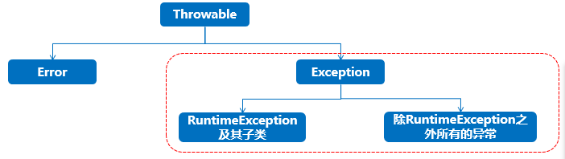
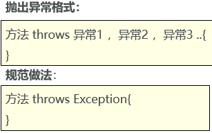
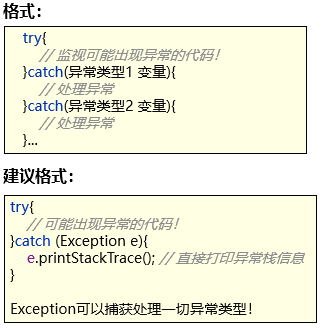
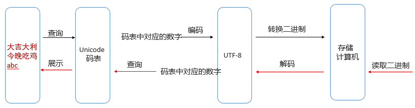
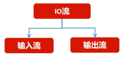
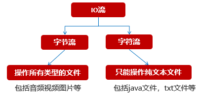

# JavaSE 加强篇 2

## 一、Stream 流

### 1.1 Stream 流概述

Stream 流

- 在 Java8 中，得益于 Lambda 所带来的函数式编程，引入了一个全新的 Stream 流概念。
- 目的：用于简化集合和数组操作的 API。

Stream 流核心思想

- 先把得到集合或数组的 Stream 流。（一根传送带或者说流水线）
- 把元素放上去
- 然后就用这个 Stream 流简化的 API 来方便的操作元素。

```java
import java.util.ArrayList;
import java.util.Collections;
import java.util.List;

public class StreamTest {
    public static void main(String[] args) {
        List<String> names = new ArrayList<>();
        Collections.addAll(names, "张三丰","张无忌","周芷若","赵敏","张强");
        System.out.println(names);
//
//        // 1、从集合中找出姓张的放到新集合
//        List<String> zhangList = new ArrayList<>();
//        for (String name : names) {
//            if(name.startsWith("张")){
//                zhangList.add(name);
//            }
//        }
//        System.out.println(zhangList);
//
//        // 2、找名称长度是3的姓名
//        List<String> zhangThreeList = new ArrayList<>();
//        for (String name : zhangList) {
//            if(name.length() == 3){
//                zhangThreeList.add(name);
//            }
//        }
//        System.out.println(zhangThreeList);

        // 3、使用Stream实现的
        names.stream().filter(s -> s.startsWith("张")).filter(s -> s.length() == 3).forEach(s -> System.out.println(s));
    }
}
```

### 1.2 生成 Stream 流

Stream 操作集合或者数组的第一步是先得到 Stream 流，然后才能使用流的功能。

集合获取 Stream 流的方式，可以使用 Collection 接口中的默认方法`steam`生成流。

数组获取 Stream 流有两种方式：

- `Array.stream(T[] array)`获取当前数组的 Stream 流。
- `Stream.of(T... values)`获取当前数组/可变数据的 Stream 流。

```java
import java.util.*;
import java.util.stream.Stream;

public class StreamDemo02 {
    public static void main(String[] args) {
        /** --------------------Collection集合获取流-------------------------------   */
        Collection<String> list = new ArrayList<>();
        Stream<String> s =  list.stream();

        /** --------------------Map集合获取流-------------------------------   */
        Map<String, Integer> maps = new HashMap<>();
        // 键流
        Stream<String> keyStream = maps.keySet().stream();
        // 值流
        Stream<Integer> valueStream = maps.values().stream();
        // 键值对流（拿整体）
        Stream<Map.Entry<String,Integer>> keyAndValueStream =  maps.entrySet().stream();

        /** ---------------------数组获取流------------------------------   */
        String[] names = {"赵敏","小昭","灭绝","周芷若"};
        Stream<String> nameStream = Arrays.stream(names);
        Stream<String> nameStream2 = Stream.of(names);
    }
}
```

### 1.3 Stream 流常用方法

Stream 流有三类方法：

- 获取 Stream 流：创建一条流水线，并把数据放到流水线上准备进行操作。
- 中间方法：流水线上的操作。一次操作完毕之后，还可以继续进行其他操作。
- 终结方法：一个 Stream 流只能有一个终结方法，是流水线上的最后一个操作。

Stream 流的常用中间操作方法

| 方法名称                                           | 说明                                              |
| -------------------------------------------------- | ------------------------------------------------- |
| `Stream<T> filter(Predicate<? super T> predicate)` | 用于对流中的数据进行过滤                          |
| `Stream<T> limit(long maxSize)`                    | 获取前几个元素                                    |
| `Sream<T> skip(long n)`                            | 跳过前几个元素                                    |
| `Stream<T> distinct()`                             | 去除流中重复的元素。依赖(hashCode 和 equals 方法) |
| `static <T> Steam<T> concat(Stream a, Stream b)`   | 合并 a 和 b 两个流为一个流                        |

注意：

- 中间方法也称为非终结方法，调用完成后返回新的 Stream 流可以继续使用，支持链式编程。
- 在 Stream 流中无法直接修改集合、数组中的数据。

Stream 流的常见终结操作方法

| 方法名称                        | 说明                         |
| ------------------------------- | ---------------------------- |
| `void forEach(Consumer action)` | 对比流的每个元素执行遍历操作 |
| `long count()`                  | 返回此流中的元素数           |

注意：终结操作方法，调用完成后流就无法继续使用了，原因是不会返回 Stream 了。

```java
import java.util.ArrayList;
import java.util.Arrays;
import java.util.List;
import java.util.function.Consumer;
import java.util.function.Function;
import java.util.function.Predicate;
import java.util.stream.Stream;

public class StreamDemo03 {
    public static void main(String[] args) {
        List<String> list = new ArrayList<>();
        list.add("张无忌");
        list.add("周芷若");
        list.add("赵敏");
        list.add("张强");
        list.add("张三丰");
        list.add("张三丰");

        // Stream<T> filter(Predicate<? super T> predicate)
        list.stream().filter(s -> s.startsWith("张")).forEach(s -> System.out.println(s));

        long size = list.stream().filter(s -> s.length() == 3).count();
        System.out.println(size);

       // list.stream().filter(s -> s.startsWith("张")).limit(2).forEach(s -> System.out.println(s));
        list.stream().filter(s -> s.startsWith("张")).limit(2).forEach(System.out::println);

        list.stream().filter(s -> s.startsWith("张")).skip(2).forEach(System.out::println);

        // map加工方法: 第一个参数原材料  -> 第二个参数是加工后的结果。
        // 给集合元素的前面都加上一个：黑马的：
        list.stream().map(s -> "黑马的：" + s).forEach(a -> System.out.println(a));

        // 需求：把所有的名称 都加工成一个学生对象。
         list.stream().map(s -> new Student(s)).forEach(s -> System.out.println(s));
//        list.stream().map(Student::new).forEach(System.out::println); // 构造器引用  方法引用

        // 合并流。
        Stream<String> s1 = list.stream().filter(s -> s.startsWith("张"));
        Stream<String> s2 = Stream.of("java1", "java2");
        // public static <T> Stream<T> concat(Stream<? extends T> a, Stream<? extends T> b)
        Stream<String> s3 = Stream.concat(s1 , s2);
        s3.distinct().forEach(s -> System.out.println(s));
    }
}
```

### 1.4 收集 Stream 流

Stream 流的收集操作：就是把 Stream 流操作后的结果数据转回到集合或者数组中去。

Stream 流的收集方法

| 名称                             | 说明                             |
| -------------------------------- | -------------------------------- |
| `R collect(Collector collector)` | 开始收集 Stream 流，指定收集容器 |

Collectors 工具类提供了具体的收集方式

| 名称                                                                      | 说明                     |
| ------------------------------------------------------------------------- | ------------------------ |
| `public static <T> Collector toList()`                                    | 把元素收集到 List 集合中 |
| `public static <T> Collector toSet()`                                     | 把元素收集到 Set 集合中  |
| `public static Collector toMap(Function keyMapper, Function valueMapper)` | 把元素收集到 Map 集合中  |

```java
import java.util.*;
import java.util.function.IntFunction;
import java.util.stream.Collectors;
import java.util.stream.Stream;

public class StreamDemo05 {
    public static void main(String[] args) {
        List<String> list = new ArrayList<>();
        list.add("张无忌");
        list.add("周芷若");
        list.add("赵敏");
        list.add("张强");
        list.add("张三丰");
        list.add("张三丰");

        Stream<String> s1 = list.stream().filter(s -> s.startsWith("张"));
        List<String> zhangList = s1.collect(Collectors.toList()); // 可变集合
        zhangList.add("java1");
        System.out.println(zhangList);

//       List<String> list1 = s1.toList(); // 得到不可变集合
//       list1.add("java");
//       System.out.println(list1);

        // 注意注意注意：“流只能使用一次”
        Stream<String> s2 = list.stream().filter(s -> s.startsWith("张"));
        Set<String> zhangSet = s2.collect(Collectors.toSet());
        System.out.println(zhangSet);

        Stream<String> s3 = list.stream().filter(s -> s.startsWith("张"));
//         Object[] arrs = s3.toArray();
        String[] arrs = s3.toArray(String[]::new); // 可以不管，拓展一下思维！！
        System.out.println("Arrays数组内容：" + Arrays.toString(arrs));
    }
}
```

## 二、异常

### 2.1 异常概述

异常是成语在“编译”或者“执行”的过程中可能出现的问题，注意：语法错误不算在异常体系中。

异常一旦出现了，如果没有提前处理，程序就会退出 JVM 虚拟机而终止。



- Error：
  - 系统级别问题、JVM 退出等，代码无法控制。
- Exception：`java.lang`包下，称为异常类，它表示程序本身可以处理的问题。
  - RuntimeException 及其子类：**运行时异常**，编译阶段不会报错。（空指针异常，数组索引越界异常等）
  - 除 RuntimeException 之外所有的异常：**编译时异常**，编译期必须处理的，否则程序不能通过编译。（日期格式化异常等）

### 2.2 常见异常

运行时异常示例（一般是程序业务没有考虑好或者编程逻辑不严谨导致的）：

- 数组索引越界异常：`ArrayIndexOutOfBoundsException`。
- 空指针异常：`NullPointerException`。
- 数学操作异常：`ArithmeticException`。
- 类型转换异常：`ClassCastException`。
- 数字转换异常：`NumberFormatException`。

```java
public class ExceptionDemo {
    public static void main(String[] args) {
        System.out.println("程序开始。。。。。。");
        /** 1.数组索引越界异常: ArrayIndexOutOfBoundsException。*/
        int[] arr = {1, 2, 3};
        System.out.println(arr[2]);
        // System.out.println(arr[3]); // 运行出错，程序终止

        /** 2.空指针异常 : NullPointerException。直接输出没有问题。但是调用空指针的变量的功能就会报错！！ */
        String name = null;
        System.out.println(name); // null
        // System.out.println(name.length()); // 运行出错，程序终止

        /** 3.类型转换异常：ClassCastException。 */
        Object o = 23;
        // String s = (String) o;  // 运行出错，程序终止

        /** 5.数学操作异常：ArithmeticException。 */
        //int c = 10 / 0;

        /** 6.数字转换异常： NumberFormatException。 */
        //String number = "23";
        String number = "23aabbc";
        Integer it = Integer.valueOf(number); // 运行出错，程序终止
        System.out.println(it + 1);

        System.out.println("程序结束。。。。。");
    }
}
```

编译时异常：

- 不是 RuntimeException 或者其子类的异常，编译阶段就报错，必须处理，否则代码不通过。
- 是但是程序员技术不行，在编译阶段就爆出一个错误，目的在于提醒不要出错。

```java
import java.text.ParseException;
import java.text.SimpleDateFormat;
import java.util.Date;

public class ExceptionDemo {
    public static void main(String[] args) { // throws ParseException {
        String date = "2015-01-12 10:23:21";
        // 创建一个简单日期格式化类：
        SimpleDateFormat sdf = new SimpleDateFormat("yyyy/MM-dd HH:mm:ss");
        // 解析字符串时间成为日期对象
        Date d = sdf.parse(date);
        System.out.println(d);
    }
}
```

### 2.3 异常处理

#### 2.3.1 默认处理

```java
public class ExceptionDemo {
    public static void main(String[] args) {
        System.out.println("程序开始。。。。。。。。。。");
        chu(10, 0);
        System.out.println("程序结束。。。。。。。。。。");
    }

    public static void chu(int a , int b){
        System.out.println(a);
        System.out.println(b);
        int c = a / b;
        System.out.println(c);
    }
}
```

默认处理

1. 默认会在出现异常的代码那里自动的创建一个异常对象：`ArithmeticException`。
2. 异常会从方法中出现的点这里抛出给调用者，调用者最终抛出给 JVM 虚拟机。
3. 虚拟机接收到异常对象后，先在控制台直接输出异常栈信息数据。
4. 直接从当前执行的异常点干掉当前程序。
5. 后续代码没有机会执行了，因为程序已经死亡。

#### 2.3.2 throws 一直外抛



- 出现异常直接抛出去给调用者，调用者也继续抛出去。
- throws：用在方法上，可以将方法内部出现的异常抛出去给本方法的调用者处理。
- 这种方式并不好，发生异常的方法自己不处理异常，如果异常最终抛出去给虚拟机将引起程序死亡。

```java
import java.io.FileInputStream;
import java.io.FileNotFoundException;
import java.io.InputStream;
import java.text.ParseException;
import java.text.SimpleDateFormat;
import java.util.Date;

public class ExceptionDemo01 {

//    public static void main(String[] args) throws ParseException, FileNotFoundException {
//        System.out.println("程序开始。。。。。");
//        parseTime("2011-11-11 11:11:11");
//        System.out.println("程序结束。。。。。");
//    }
//
//    public static void parseTime(String date) throws ParseException, FileNotFoundException {
//        SimpleDateFormat sdf = new SimpleDateFormat("yyyy/MM-dd HH:mm:ss");
//        Date d = sdf.parse(date);
//        System.out.println(d);
//
//        InputStream is = new FileInputStream("E:/meinv.jpg");
//    }
    // 只throws一个Exception即可
    public static void main(String[] args) throws Exception {
        System.out.println("程序开始。。。。。");
        parseTime("2011-11-11 11:11:11");
        System.out.println("程序结束。。。。。");
    }

    public static void parseTime(String date) throws Exception {
        SimpleDateFormat sdf = new SimpleDateFormat("yyyy-MM-dd HH:mm:ss");
        Date d = sdf.parse(date);
        System.out.println(d);

        InputStream is = new FileInputStream("E:/meinv.jpg");
    }
}
```

#### 2.3.3 自己捕获处理



- 监视捕获异常，用在方法内部，可以将方法内部出现的异常直接捕获处理。
- 这种方式还可以，发生异常的方法自己独立完成异常的处理，程序可以继续往下执行。

```java
import java.io.FileInputStream;
import java.io.FileNotFoundException;
import java.io.InputStream;
import java.text.ParseException;
import java.text.SimpleDateFormat;
import java.util.Date;

public class ExceptionDemo02 {
    public static void main(String[] args) {
        System.out.println("程序开始。。。。");
        parseTime("2011-11-11 11:11:11");
        System.out.println("程序结束。。。。");
    }

    public static void parseTime(String date) {
        try {
            SimpleDateFormat sdf = new SimpleDateFormat("yyyy/MM-dd HH:mm:ss");
            Date d = sdf.parse(date);
            System.out.println(d);

            InputStream is = new FileInputStream("E:/meinv.jpg");
            // 只catch一个Exception即可
        } catch (Exception e) {
            e.printStackTrace(); // 打印异常栈信息
        }
    }


//    public static void parseTime(String date) {
//        try {
//            SimpleDateFormat sdf = new SimpleDateFormat("yyyy/MM-dd HH:mm:ss");
//            Date d = sdf.parse(date);
//            System.out.println(d);
//
//            InputStream is = new FileInputStream("E:/meinv.jpg");
//        } catch (FileNotFoundException|ParseException e) {
//            e.printStackTrace(); // 打印异常栈信息
//        }
//    }

//    public static void parseTime(String date) {
//        try {
//            SimpleDateFormat sdf = new SimpleDateFormat("yyyy/MM-dd HH:mm:ss");
//            Date d = sdf.parse(date);
//            System.out.println(d);
//
//            InputStream is = new FileInputStream("E:/meinv.jpg");
//        } catch (FileNotFoundException e) {
//           e.printStackTrace(); // 打印异常栈信息
//        } catch (ParseException e) {
//           e.printStackTrace();
//        }
//    }

//    public static void parseTime(String date) {
//        try {
//            SimpleDateFormat sdf = new SimpleDateFormat("yyyy/MM-dd HH:mm:ss");
//            Date d = sdf.parse(date);
//            System.out.println(d);
//        } catch (ParseException e) {
//            // 解析出现问题
//            System.out.println("出现了解析时间异常哦，走点心！！");
//        }
//
//        try {
//            InputStream is = new FileInputStream("E:/meinv.jpg");
//        } catch (FileNotFoundException e) {
//            System.out.println("您的文件根本就没有啊，不要骗我哦！！");
//        }
//    }
}
```

#### 2.3.3 抛给调用者处理

- 方法直接将异通过 throws 抛出去给调用者
- 调用者收到异常后直接捕获处理。

```java
import java.io.FileInputStream;
import java.io.InputStream;
import java.text.ParseException;
import java.text.SimpleDateFormat;
import java.util.Date;

public class ExceptionDemo03 {
    public static void main(String[] args) {
        System.out.println("程序开始。。。。");
        try {
            parseTime("2011-11-11 11:11:11");
            System.out.println("功能操作成功~~~");
            // 调用者捕获
        } catch (Exception e) {
            e.printStackTrace();
            System.out.println("功能操作失败~~~");
        }
        System.out.println("程序结束。。。。");
    }
    // 用throws Exception抛给调用者main
    public static void parseTime(String date) throws Exception {
        SimpleDateFormat sdf = new SimpleDateFormat("yyyy、MM-dd HH:mm:ss");
        Date d = sdf.parse(date);
        System.out.println(d);

        InputStream is = new FileInputStream("D:/meinv.jpg");
    }

}
```

运行时异常的处理：只需要在最外层捕获处理即可。

```java
public class Test {
    public static void main(String[] args) {
        System.out.println("程序开始。。。。。。。。。。");
        try {
            chu(10, 0);
        } catch (Exception e) {
            e.printStackTrace();
        }
        System.out.println("程序结束。。。。。。。。。。");
    }

    public static void chu(int a , int b) { // throws RuntimeException{
        System.out.println(a);
        System.out.println(b);
        int c = a / b;
        System.out.println(c);
    }
}
```

### 2.4 自定义异常

自定义异常的必要

- Java 无法为这个世界上全部的问题提供异常类。
- 如果企业想通过异常的方式来管理自己的某个业务问题，就需要自定义异常类了。

自定义异常的好处

- 可以使用异常的机制管理业务问题，如提醒程序员注意。
- 同时一旦出现 BUG，可以用异常的形式清晰的之处出错的地方。

自定义异常的分类

1. 自定义编译时异常
   - 定义一个异常类继承 Exception
   - 重写构造器
   - 在出现异常的地方用`throw new`自定义对象抛出。
   - 作用：编译时异常是编译阶段就报错，提醒更加强烈，一定需要处理！
2. 定义运行时异常
   - 定义一个异常类继承 RuntimeException
   - 重写构造器
   - 在出现异常的地方用`throw new`自定义对象抛出。
   - 作用：提醒不强烈，编译阶段不报错！运行时才可能出现！

```java
// 自定义的编译时异常
public class ItheimaAgeIlleagalException extends Exception{
    public ItheimaAgeIlleagalException() {
    }

    public ItheimaAgeIlleagalException(String message) {
        super(message);
    }
}
// 自定义的编译时异常
public class ItheimaAgeIlleagalRuntimeException extends RuntimeException{
    public ItheimaAgeIlleagalRuntimeException() {
    }

    public ItheimaAgeIlleagalRuntimeException(String message) {
        super(message);
    }
}
public class ExceptionDemo {
    public static void main(String[] args) {
//        try {
//            checkAge(-34);
//        } catch (ItheimaAgeIlleagalException e) {
//            e.printStackTrace();
//        }

        try {
            checkAge2(-23);
        } catch (Exception e) {
            e.printStackTrace();
        }
    }

    public static void checkAge2(int age)  {
        if(age < 0 || age > 200){
            // 抛出去一个异常对象给调用者
            // throw ：在方法内部直接创建一个异常对象，并从此点抛出
            // throws : 用在方法申明上的，抛出方法内部的异常
            throw new ItheimaAgeIlleagalRuntimeException(age + " is illeagal!");
        }else {
            System.out.println("年龄合法：推荐商品给其购买~~");
        }
    }

    public static void checkAge(int age) throws ItheimaAgeIlleagalException {
        if(age < 0 || age > 200){
            // 抛出去一个异常对象给调用者
            // throw ：在方法内部直接创建一个异常对象，并从此点抛出
            // throws : 用在方法申明上的，抛出方法内部的异常
            throw new ItheimaAgeIlleagalException(age + " is illeagal!");
        }else {
            System.out.println("年龄合法：推荐商品给其购买~~");
        }
    }
}
```

## 三、File 类、IO 流

### 3.1 File 类

#### 3.1.1 File 类概述

File 类的对象代表操作系统的文件（文件、文件夹），File 类在`java.io.File`包下。

File 类提供了诸如：创建文件对象代表文件，获取文件信息（大小、修改时间）、删除文件、创建文件（文件夹）等功能。

File 类创建对象：

| 方法名称                                   | 说明                                             |
| ------------------------------------------ | ------------------------------------------------ |
| `public File(String pathname)`             | 根据文件路径创建文件对象                         |
| `public File(String parent, String child)` | 根据父路径名字符串和子路径字符串创建文件对象     |
| `public File(File parent, String child)`   | 根据父路径对应文件对象和子路径字符串创建文件对象 |

注意：

- File 对象可以定位文件和文件夹
- File 封装的对象仅仅是一个路径名，这个路径可以是存在的，也可以是不存在的。

路径：

- 绝对路径：从盘符开始`File file1 = new File("D:\\a.txt")`
- 相对路径：不带盘符，默认直接到当前工程下的目录寻找文件`File file2 = new File("模块名\\a.txt")`

```java
import java.io.File;

public class FileDemo {
    public static void main(String[] args) {
        // 1、创建File对象（指定了文件的路径）
        // 路径写法： D:\resources\xueshan.jpeg
        //          D:/resources/xueshan.jpeg
        //          File.separator
//        File f = new File("D:\\resources\\xueshan.jpeg");
//        File f = new File("D:/resources/xueshan.jpeg");
        File f = new File("D:" + File.separator+"resources"+ File.separator +"xueshan.jpeg");
        long size = f.length(); // 是文件的字节大小
        System.out.println(size);

        // 2、File创建对象，支持绝对路径 支持相对路径（重点）
        File f1 = new File("D:\\resources\\beauty.jpeg"); // 绝对路径
        System.out.println(f1.length());

        // 相对路径：一般定位模块中的文件的。 相对到工程下！！
        File f2 = new File("file-io-app/src/data.txt");
        System.out.println(f2.length());

        // 3、File创建对象 ，可以是文件也可以是文件夹
        File f3 = new File("D:\\resources");
        System.out.println(f3.exists()); // 判断这个路径是否存在，这个文件夹存在否
    }
}
```

#### 3.1.2 判断文件、获取文件信息

| 方法名称                          | 说明                                 |
| --------------------------------- | ------------------------------------ |
| `public boolean isDirectory()`    | 判断此路径名表示的 File 是否为文件夹 |
| `public boolean isFile()`         | 判断此路径名表示的 File 是否为文件   |
| `public boolean exists()`         | 判断此路径名表示的 File 是否存在     |
| `public long length()`            | 返回文件的大小（字节数量）           |
| `public String getAbsolutePath()` | 返回文件的绝对路径                   |
| `public String getPath()`         | 返回定义文件时使用的路径             |
| `public String getName()`         | 返回文件的名称，带后缀               |
| `public long lastModified()`      | 返回文件最后修改的时间毫秒值         |

```java
import java.io.File;
import java.text.SimpleDateFormat;

public class FileDemo02 {
    public static void main(String[] args) {
        // 1.绝对路径创建一个文件对象
        File f1 = new File("D:/resources/xueshan.jpeg");
        // a.获取它的绝对路径。
        System.out.println(f1.getAbsolutePath());
        // b.获取文件定义的时候使用的路径。
        System.out.println(f1.getPath());
        // c.获取文件的名称：带后缀。
        System.out.println(f1.getName());
        // d.获取文件的大小：字节个数。
        System.out.println(f1.length()); // 字节大小
        // e.获取文件的最后修改时间
        long time = f1.lastModified();
        System.out.println("最后修改时间：" + new SimpleDateFormat("yyyy/MM/dd HH:mm:ss").format(time));
        // f、判断文件是文件还是文件夹
        System.out.println(f1.isFile()); // true
        System.out.println(f1.isDirectory()); // false

        System.out.println("-------------------------");

        File f2 = new File("file-io-app\\src\\data.txt");
        // a.获取它的绝对路径。
        System.out.println(f2.getAbsolutePath());
        // b.获取文件定义的时候使用的路径。
        System.out.println(f2.getPath());
        // c.获取文件的名称：带后缀。
        System.out.println(f2.getName());
        // d.获取文件的大小：字节个数。
        System.out.println(f2.length()); // 字节大小
        // e.获取文件的最后修改时间
        long time1 = f2.lastModified();
        System.out.println("最后修改时间：" + new SimpleDateFormat("yyyy/MM/dd HH:mm:ss").format(time1));
        // f、判断文件是文件还是文件夹
        System.out.println(f2.isFile()); // true
        System.out.println(f2.isDirectory()); // false
        System.out.println(f2.exists()); // true

        File file = new File("D:/");
        System.out.println(file.isFile()); // false
        System.out.println(file.isDirectory()); // true
        System.out.println(file.exists()); // true

        File file1 = new File("D:/aaa");
        System.out.println(file1.isFile()); // false
        System.out.println(file1.isDirectory()); // false
        System.out.println(file1.exists()); // false
    }
}
```

#### 3.1.3 创建、删除文件

File 类创建文件的功能

| 方法名称                         | 说明                 |
| -------------------------------- | -------------------- |
| `public boolean createNewFile()` | 创建一个新的空的文件 |
| `public boolean mkdir()`         | 只能创建一级文件夹   |
| `public boolean mkdirs()`        | 可创建多级文件夹     |

File 类删除文件的功能

| 方法名称                  | 说明                                   |
| ------------------------- | -------------------------------------- |
| `public booelan delete()` | 删除由此抽象路径名表示的文件或空文件夹 |

注意：delete 方法默认只能删除文件和空文件夹(就算被占用也能删除)，delete 方法直接删除不走回收站。

```java
import java.io.File;
import java.io.IOException;

public class FileDemo03 {
    public static void main(String[] args) throws IOException {
        File f = new File("file-io-app\\src\\data.txt");
        // a.创建新文件，创建成功返回true ,反之 ,不需要这个，以后文件写出去的时候都会自动创建
        System.out.println(f.createNewFile());
        File f1 = new File("file-io-app\\src\\data02.txt");
        System.out.println(f1.createNewFile()); // （几乎不用的，因为以后文件都是自动创建的！）

        // b.mkdir创建一级目录
        File f2 = new File("D:/resources/aaa");
        System.out.println(f2.mkdir());

        // c.mkdirs创建多级目录(重点)
        File f3 = new File("D:/resources/ccc/ddd/eee/ffff");
//        System.out.println(f3.mkdir());
        System.out.println(f3.mkdirs()); // 支持多级创建

        // d.删除文件或者空文件夹
        System.out.println(f1.delete());
        File f4 = new File("D:/resources/xueshan.jpeg");
        System.out.println(f4.delete()); // 占用一样可以删除

        // 只能删除空文件夹,不能删除非空文件夹.
        File f5 = new File("D:/resources/aaa");
        System.out.println(f5.delete());
    }
}
```

#### 3.1.4 遍历文件夹

File 类的遍历功能

| 方法名称                    | 说明                                                         |
| --------------------------- | ------------------------------------------------------------ |
| `public String[] list()`    | 获取当前目录下所有的“一级文件名称”到一个字符串数组中去返回   |
| `public File[] listFiles()` | 获取当前目录下所有的“一级文件对象”到一个文件对象数组中去返回 |

listFiles 方法注意事项：

- 当文件不存在或者是一个文件时，返回 null；
- 当文件对象代表一个空文件夹时，返回一个长度为 0 的数组；
- 当文件对象是一个有内容的文件夹时，将里面所有文件和文件夹路径放在 File 数组中返回；
- 当文件对象是一个有隐藏文件的文件夹时，将里面所有文件和文件夹的路径放在 File 数组中返回，包含隐藏文件；
- 当没有权限访问该文件夹时，返回 null。

```java
import java.io.File;
import java.util.Arrays;

public class FileDemo04 {
    public static void main(String[] args) {
        // 1、定位一个目录
        File f1 = new File("D:/resources");
        String[] names = f1.list();
        for (String name : names) {
            System.out.println(name);
        }

        // 2.一级文件对象
        // 获取当前目录下所有的"一级文件对象"到一个文件对象数组中去返回（重点）
        File[] files = f1.listFiles();
        for (File f : files) {
            System.out.println(f.getAbsolutePath());
        }

        // 注意事项
        File dir = new File("D:/resources/ddd");
        File[] files1 = dir.listFiles();
        System.out.println(Arrays.toString(files1));
    }
}
```

#### 3.1.5 方法递归

方法直接调用自己或者间接调用自己的形式称为**方法递归**。直接调用自己是直接递归，间接调用自己是间接递归。

递归如果没有控制好终止，会出现递归死循环，导致栈内存溢出现象。那么就需要给递归添加边界条件，避免出现这样的问题。

```java
public class RecursionDemo02 {
    public static void main(String[] args) {
        System.out.println(f(5));
    }

    public static int f(int n){
        if(n == 1){
            return 1;
        }else {
            return f(n - 1) * n;
        }
    }
}
```

```java
import java.io.File;
import java.io.IOException;

/**
    目标：去D判断搜索 eDiary.exe文件
 */
public class RecursionDemo05 {
    public static void main(String[] args) {
        // 2、传入目录 和  文件名称
        searchFile(new File("D:/") , "eDiary.exe");
    }

    /**
     * 1、搜索某个目录下的全部文件，找到我们想要的文件。
     * @param dir  被搜索的源目录
     * @param fileName 被搜索的文件名称
     */
    public static void searchFile(File dir,String fileName){
        // 3、判断dir是否是目录
        if(dir != null && dir.isDirectory()){
            // 可以找了
            // 4、提取当前目录下的一级文件对象
            File[] files = dir.listFiles(); // null  []
            // 5、判断是否存在一级文件对象，存在才可以遍历
            if(files != null && files.length > 0) {
                for (File file : files) {
                    // 6、判断当前遍历的一级文件对象是文件 还是 目录
                    if(file.isFile()){
                        // 7、是不是咱们要找的，是把其路径输出即可
                        if(file.getName().contains(fileName)){
                            System.out.println("找到了：" + file.getAbsolutePath());
                            // 启动它。
                            try {
                                Runtime r = Runtime.getRuntime();
                                r.exec(file.getAbsolutePath());
                            } catch (IOException e) {
                                e.printStackTrace();
                            }
                        }
                    }else {
                        // 8、是文件夹，需要继续递归寻找
                        searchFile(file, fileName);
                    }
                }
            }
        }else {
            System.out.println("对不起，当前搜索的位置不是文件夹！");
        }
    }
}

```

```java
import java.io.File;

/**
    目标：删除非空文件夹
 */
public class RecursionDemo07 {
    public static void main(String[] args) {
        deleteDir(new File("D:/new"));
    }

    /**
       删除文件夹，无所谓里面是否有内容，都可以删除
     * @param dir
     */
    public static void deleteDir(File dir){
        // 1、判断dir存在且是文件夹
        if(dir != null && dir.exists() && dir.isDirectory()){
            // 2、提取一级文件对象。
            File[] files = dir.listFiles();
            // 3、判断是否存在一级文件对象，存在则遍历全部的一级文件对象去删除
            if(files != null && files.length > 0){
                // 里面有内容
                for (File file : files) {
                    // 4、判断file是文件还是文件夹，文件直接删除
                    if(file.isFile()){
                        file.delete();
                    }else {
                        // 递归删除
                        deleteDir(file);
                    }
                }
            }
            // 删除自己
            dir.delete();
        }
    }
}
```

### 3.2 字符集

计算机底层不可以直接存储字符的，它只能存储二级制（0、1），而二进制是可以转换成十进制等。那么可以用十进制数来代表人类生活中的字符（A，a，B），这样的一套编号规则就是字符集（多个字符的集合）。

字符集种类较多，每个字符集包含的字符个数不同，常见字符集有：

- ASCII 字符集
  - ASCII(American Standard Code for Information Interchange，美国信息交换标准代码)：包括了数字、英文、符号。
  - ASCII 使用 1 个字节存储一个字符，一个字节是 8 位，总共可以表示 128 个字符信息，对于表示英文、数字来说是够用的。
- GBK 字符集
  - window 系统默认的码表。兼容 ASCII 码表，也包含了几万个汉字，并支持繁体汉字以及部分日韩文字；
  - GBK 是中国的码表，一个中文字符一般以两个字节的形式存储。但不包含世界上所有国家的文字。
- Unicode 字符集
  - Unicode（又称统一码、万国码、单一码）是计算机科学领域里的一项业界标准。容纳世界上大多数国家的所有常见文字和符号。
  - 由于 Unicode 会先通过 UTF-8、UTF-16 以及 UTF-32 的编码成二进制后再存储到计算机，一种最为常见的就是 UTF-8。

注意

- UTF-8 编码后一个中文一般以三个字节的形式存储，同时也要兼容 ASCII 编码表。
- 技术人员都应该使用 UTF-8 的字符集编码。
- 字符解码时使用的字符集和编码时使用的字符集必须一致，否则会出现乱码。
- 英文和数字在任何国家的编码中都不会乱码。

汉字存储和展示过程解析



String 编码

| 方法名称                               | 说明                                                                         |
| -------------------------------------- | ---------------------------------------------------------------------------- |
| `byte[] getBytes​()`                   | 使用平台的默认字符集将该 String 编码为一系列字节，将结果存储到新的字节数组中 |
| `byte[] getBytes​(String charsetName)` | 使用指定的字符集将该 String 编码为一系列字节，将结果存储到新的字节数组中     |

String 解码

| 构造器                                      | 说明                                                        |
| ------------------------------------------- | ----------------------------------------------------------- |
| `String​(byte[] bytes)`                     | 通过使用平台的默认字符集解码指定的字节数组来构造新的 String |
| `String​(byte[] bytes, String charsetName)` | 通过指定的字符集解码指定的字节数组来构造新的 String         |

```java
import java.io.UnsupportedEncodingException;
import java.util.Arrays;

/**
     目标：学会自己进行文字的编码和解码，为以后可能用到的场景做准备。
 */
public class Test {
    public static void main(String[] args) throws Exception {
        // 1、编码：把文字转换成字节（使用指定的编码）
        String name = "abc我爱你中国";
        // byte[] bytes = name.getBytes(); // 以当前代码默认字符集进行编码 （UTF-8）
        byte[] bytes = name.getBytes("GBK"); // 指定编码
        System.out.println(bytes.length);
        System.out.println(Arrays.toString(bytes));

        // 2、解码：把字节转换成对应的中文形式（编码前 和 编码后的字符集必须一致，否则乱码 ）
        // String rs = new String(bytes); // 默认的UTF-8
        String rs = new String(bytes, "GBK"); // 指定GBK解码
        System.out.println(rs);
    }
}
```

### 3.3 IO 流

#### 3.3.1 IO 概述

IO 流也称为输入、输出流，就是用来读写数据的。

- I 表示 input，把硬盘文件中的数据读入到内存的过程，称之输入，负责读。
- O 表示 output，把内存中的数据写出到硬盘文件的过程，称之输出，负责写。

IO 流的分类

- 按流的方向分
  
- 按流中的数据最小单位分为
  

总结 IO 流的四大分类

- 字节输入流：以内存为基准，来自磁盘文件/网络中的数据**以字节的形式读入到内存中去**的流称为字节输入流。
- 字节输出流：以内存为基准，把内存中的数据**以字节写出到磁盘文件或者网络中去**的流称为字节输出流。
- 字符输入流：以内存为基准，来自磁盘文件/网络中的数据**以字符的形式读入到内存中去**的流称为字符输入流。
- 字符输出流：以内存为基准，把内存中的数据**以字符写出到磁盘文件或者网络介质中去**的流称为字符输出流。


#### 3.3.2 字节流的使用

##### 3.3.2.1 文件字节输入流

文件字节输入流：FileInputStream

作用：以内存为基准，把磁盘文件中的数据以字节的形式读取到内存中去。

| 构造器                                    | 说明                               |
| ----------------------------------------- | ---------------------------------- |
| `public FileInputStream(File file)`       | 创建字节输入流管道与源文件对象接通 |
| `public FileInputStream(String pathname)` | 创建字节输入流管道与源文件路径接通 |

文件字节输入流读数据的 API

| 方法名称                         | 说明                                                   |
| -------------------------------- | ------------------------------------------------------ |
| `public int read()`              | 每次读取一个字节返回，如果字节已经没有可读的返回-1     |
| `public int read(byte[] buffer)` | 每次读取一个字节数组返回，如果字节已经没有可读的返回-1 |

```java
import java.io.File;
import java.io.FileInputStream;
import java.io.InputStream;
/* 性能较慢，读取中文字符输出无法避免乱码问题 */
public class FileInputStreamDemo01 {
    public static void main(String[] args) throws Exception {
        // 创建一个文件字节输入流管道与源文件接通。
        // InputStream is = new FileInputStream(new File("file-io-app\\src\\data.txt"));
        // 简化写法
        InputStream is = new FileInputStream("file-io-app\\src\\data.txt");

        // 定义一个变量记录每次读取的字节    a  b  3   爱
        //                              o o  o   [ooo]
        // is.read()性能较慢，读取中文字符输出无法避免乱码问题
        int b;
        while (( b = is.read() ) != -1){
            System.out.print((char) b);
        }

        // 创建一个文件字节输入流管道与源文件接通。
        InputStream is2 = new FileInputStream("file-io-app/src/data02.txt");
        // 每次读取一个字节数组
        byte[] buffer = new byte[3];
        int len; // 记录每次读取的字节数。
        // is.read(buffer)读取的性能得到了提升，读取中文字符输出无法避免乱码问题
        while ((len = is.read(buffer)) != -1) {
            // 读取多少倒出多少
            System.out.print(new String(buffer, 0 , len));
        }
    }
}
```

“读取一个字节”和“读取一个字节数组”后，还有“读取文件的全部字节”场景。

- 方式一：自己定义一个字节数组与文件的大小一样大，然后使用读取字节数组的方法，一次性读取完成。能避免“读取字节数组”的中文乱码问题，但是文件过大，字节数组可能引起内存溢出
- 方式二：官方为字节输入流 InputStream 提供了如下 API 可以直接把文件的全部数据读取到一个字节数组中。

| 方法名称                                          | 说明                                                                          |
| ------------------------------------------------- | ----------------------------------------------------------------------------- |
| `public byte[] readAllBytes() throws IOException` | JDK9 的 API。直接将当前字节输入流对应的文件对象的字节数据装到一个字节数组返回 |

```java
import java.io.File;
import java.io.FileInputStream;
import java.io.InputStream;

/**
   目标：使用文件字节输入流一次读完文件的全部字节。可以解决乱码问题。
 */
public class FileInputStreamDemo03 {
    public static void main(String[] args) throws Exception {
        // 创建一个文件字节输入流管道与源文件接通
        File f = new File("file-io-app/src/data03.txt");
        InputStream is = new FileInputStream(f);

        // 定义一个字节数组与文件的大小刚刚一样大。
//        byte[] buffer = new byte[(int) f.length()];
//        int len = is.read(buffer);
//        System.out.println("读取了多少个字节：" + len);
//        System.out.println("文件大小：" + f.length());
//        System.out.println(new String(buffer));

        // 读取全部字节数组
        byte[] buffer = is.readAllBytes();
        System.out.println(new String(buffer));

    }
}
```

##### 3.3.2.2 文件字节输出流

文件字节输出流：FileOutputStream

作用：以内存为基准，把内存中的数据以字节的形式写出到磁盘文件中去的流。

| 构造器                                                     | 说明                                           |
| ---------------------------------------------------------- | ---------------------------------------------- |
| `public FileOutputStream(File file)`                       | 创建字节输出流管道与源文件对象接通             |
| `public FileOutputStream(File file, boolean append)`       | 创建字节输出流管道与源文件接通，可追加数据     |
| `public FileOutputStream(String filepath)`                 | 创建字节输出流管道与源文件路径接通             |
| `public FileOutputStream(String filepath, boolean append)` | 创建字节输出流管道与源文件路径接通，可追加数据 |

文件字节输出流写数据出去的 API

| 方法名称                                             | 说明                       |
| ---------------------------------------------------- | -------------------------- |
| `public void write(int a)`                           | 写一个字节出去             |
| `public void write(byte[] buffer)`                   | 写一个字节数组出去         |
| `public void write(byte[] buffer, int pos, int len)` | 写一个字节数组的一部分出去 |

流的关闭与刷新

|方法|说明|
|`flush()`|刷新流，还可以继续写数据|
|`close()`|关闭流，释放资源，但在关闭之前会先刷新流。一旦关闭，就不能再写数据|

#### 3.3.3 资源释放的方式

#### 3.3.4 字符流的使用

## 四、多线程

## 五、网络编程
