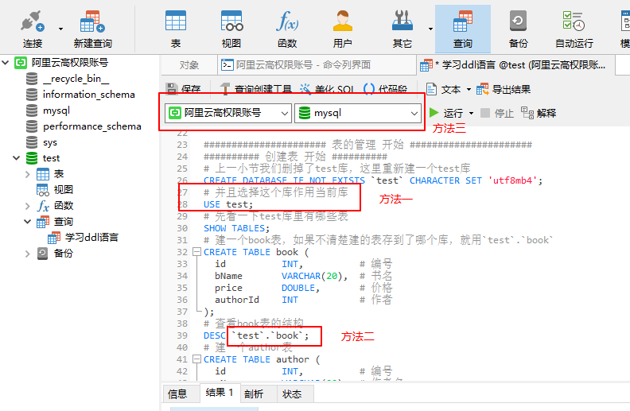

# 数据定义语言 DDL

## DDL 简介

数据定义语言(Data Definition Language, DDL)是 SQL 语言集中负责数据结构定义与数据库对象定义的语言。也就说是对**库**和**表**进行管理，具体就是**创建**(create)、**修改**(alter)、**删除**(drop)。常见的如下：

- CREATE DATABASE - 创建新数据库
- ALTER DATABASE - 修改数据库
- CREATE TABLE - 创建新表
- ALTER TABLE - 变更（改变）数据库表
- DROP TABLE - 删除表
- CREATE INDEX - 创建索引（搜索键）
- DROP INDEX - 删除索引

## 库的管理

1. 创建库

   语法：`create database [if not exists] 库名;`。`[if exists]`和`[if not exists]`只在库和表的创建和删除时才能使用。

   例如使用 navicat 创建一个 test 数据库，字符集是 utf8mb4，那 sql 语句对应如下：

   ```sql
   # 创建库，可以不加``
   CREATE DATABASE `test`;
   # 查看有哪些库
   SHOW DATABASES;
   ```

   如果你不清楚库是否存在，可以加上`if not exists`

   ```sql
   # 创建库可以带上了`if not exists`
   CREATE DATABASE IF NOT EXISTS `test`;
   ```

2. 修改库

   修改库的操作很少，容易引起一些问题，但一些影响不太大的库设置是可以修改的。

   ```sql
   # 默认字符集一般是utf8
   ALTER DATABASE `test` CHARACTER SET 'utf8mb4';
   # 其实字符集可以在创建库时就带上
   CREATE DATABASE IF NOT EXISTS `test` CHARACTER SET 'utf8mb4';
   ```

3. 删除库

   语法：`drop database [if exists] 库名`

   ```sql
   # 删除库
   DROP DATABASE IF EXISTS `test`;
   # 查看有哪些库
   SHOW DATABASES;
   ```

## 表的管理

### 创建表

语法：

```sql
create table 表名 (
  列名 列的类型 【列的约束】,
  ...
)
```

创建一个 book 表和一个 author 表

```sql
# 上一小节我们删掉了test库，这里重新建一个test库
CREATE DATABASE IF NOT EXISTS `test` CHARACTER SET 'utf8mb4';
# 并且选择这个库作用当前库，否则会有`No database selected`错误
USE test;
# 先看一下test库里有哪些表
SHOW TABLES;
# 建一个book表，如果不清楚建的表存到了哪个库，就用`test`.`book`
CREATE TABLE book (
  id          INT,          # 编号
  bName       VARCHAR(20),  # 书名
  price       DOUBLE,       # 价格
  authorId    INT           # 作者
);
# 查看book表的结构
DESC book;
# 建一个author表
CREATE TABLE author (
  id          INT,          # 编号
  aName       VARCHAR(20),  # 作者名
  nation      VARCHAR(20)   # 国籍
);
# 查看author表的结构
DESC author;
# 看一下test库里有哪些表
SHOW TABLES;
```

关于`No database selected`错误，它的原因是没有指定当前数据库，sql 运行时就不知道根据哪个数据来运行。

- 第一种方式是使用`USE test;`来指定当前数据库。
- 第二种方式是在 sql 语句中将表名改为`test`.`authore`，但是每次使用表名前都需要加上这个库名就很麻烦。
- 第三种方式是把数据库客户端当前查询框顶部里选定一个数据库。该方法最后重新连接一下云端数据库，保证指定数据库成功。



### 修改表

修改表的核心语法：`alter table 表名 add|drop|modify|change column 列名 [类型或约束]`

- 修改列名  
   `alter table 表名 change column 旧列名 新列名 列的类型;`
- 修改列的类型或约束  
   `alter table 表名 modify column 列名 新类型或新约束;`
- 添加新列  
   `alter table 表名 add column 新列的列名 新列的类型或约束;`
- 删除旧列  
   `alter table 表名 drop column 旧列的列名;`
- 修改表名  
   `alter table 表名 rename to 新表名;`

```sql
# 修改book表的bName列名为bookName，要带上类型
ALTER TABLE book CHANGE COLUMN  bName bookName VARCHAR(20);
DESC book;
# 修改author表的id列的新类型为MEDIUMINT
ALTER TABLE author MODIFY COLUMN id MEDIUMINT;
DESC author;
# 为book表添加publishDate新列，类型为DATETIME
ALTER TABLE book ADD COLUMN publishDate DATETIME;
DESC book;
# 删除book表的publishDate列
ALTER TABLE book DROP COLUMN publishDate;
DESC book;
# 修改author表的表名为book_author
ALTER TABLE author RENAME TO book_author;
DESC book_author;
```

### 删除表

语法：`drop table [if exists] 表名`。`[if exists]`和`[if not exists]`只在库和表的创建和删除时才能使用。

```sql
# 删除表book_author
DROP TABLE `test`.`book_author`;
# 查看当前库里有哪些表
SHOW TABLES;
```

### 复制表

- 只复制表结构：  
   `create table 表名 like 被复制的表名;`
- 复制表结构以及表里的全部数据：  
   `create table 表名 select * from 被复制的表名`
- 复制表的部分结构以及部分数据（如果只想把部分结构复制过去，可以将`where`后的条件设置成谁也不满足，例如`1=2`和`0`，而`1`是 true）  
   `create table 表名 select (列1, 列2) from 被复制的表名 where 数据限制条件`。
- 如果报`1786 - Statement violates GTID consistency: CREATE TABLE ... SELECT.`错误，是因为 MySQ 启用了 enforce_gtid_consistency 功能，只允许能够保障事务安全并且能够被日志记录的 SQL 语句被执行。`create table 表名 as select * from 被复制的表名`也会报同样的错误。  
   **解决方法一**：用命令修改`SET @@GLOBAL.ENFORCE_GTID_CONSISTENCY = off;`，但用命令我们需要用具有`SUPER`或者`SYSTEM_VARIABLES_ADMIN`权限的用户，这个权限自己去配。但是像本人使用的阿里云 RDS MySql8.0 版是不允许修改 enforce_gtid_consistency 参数的，这个可以去“云数据库 RDS/实例列表/参数设置”进行查询确定。后续它的 MySql 更新版本，可能就可以直接使用`create table ... select`。  
   **解决方法二**：因为第一种用不了，那只能将语句拆成`create table 表名 like 被复制的表名;`和`insert into 表名 select (列1, 列2) from 被复制的表名;`，但是这样的话，它就做不到复制部分结构了，它第一句就复制了完整的结构。

```sql
# 因为上一节已经删掉作者表，所以这里重新建author表
CREATE TABLE IF NOT EXISTS `test`.`author` (
  id          INT,          # 编号
  aName       VARCHAR(20),  # 作者名
  nation      VARCHAR(20)   # 国籍
);
# 插入数据
INSERT INTO author VALUES
(1, '村上春树', '日本'),
(2, '莫言', '中国'),
(3, '金庸', '中国'),
(4, '冯唐', '中国');
SELECT * FROM author;
# 只复制表结构
CREATE TABLE copy1 LIKE author;
# 查看是否复制成功
DESC copy1;
SELECT * FROM copy1;
# 复制表结构以及表里的全部数据，阿里云RDS MySql8.0版会报错，也不准修改enforce_gtid_consistency
CREATE TABLE copy2 SELECT * FROM author;
# 复制表的部分结构以及部分数据，阿里云RDS MySql8.0版会报错，也不准修改enforce_gtid_consistency
CREATE TABLE copy3 SELECT id,aName FROM author WHERE nation='中国';
# 只复制表部分结构，不携带数据，WHERE后面写0或者1=2
CREATE TABLE copy4 SELECT id,aName FROM author WHERE 0;
# 拆成两个部分，如果是在阿里云RDS MySql8.0版里
CREATE TABLE copy5 LIKE author;
INSERT INTO copy5 SELECT id,aName FROM author WHERE nation='中国';
```

## 常见数据类型

### 数值型

数值型分为以下几类

- 整型：
  - `Tinyint`：1 字节，有符号是`-128 ~ 127`，无符号是`0 ~ 255`。
  - `Smallint`：2 字节，有符号是`-32768 ~ 32767`，无符号是`0 ~ 65535`。
  - `Mediumint`：3 字节，有符号是`-8388608 ~ 8388607`，无符号是`0 ~ 1677215`。
  - `Int`、`integer`：4 字节，有符号是`-2147483648 ~ 2147483647`，无符号是`0 ~ 4294967295`。
  - `Bigint`：8 字节，有符号是`-2^63 ~ 2^63-1`，无符号是`0 ~ 2^64-1`。
- 浮点小数：
  - `float(M,D)`：4 字节，`±1.75494351E-38~±3.402823466E+38`
  - `double(M,D)`：8 字节，`±2.2250738585072014E-308~±1.7976931348623157E+308`
- 定点小数：
  - `DEC(M,D)`、`DECIMAL(M,D)`：M+2 字节，最大取值范围与 double 相同，给定 decimal 的有效取值范围由 M 和 D 决定

整型的特点：

- 都可以设置无符号和有符号，默认有符号，通过 unsigned 设置无符号。其实不推荐使用 unsigned，可以通过约束来实现的。
- 如果超出了范围，会报`out or range`异常，最终会自动插入临界值；（“严格模式”并不会插入，直接认为你这条插入语句无效）
- 长度可以不指定，默认会有一个长度；这个长度只是在数据库的显示长度，可以插入比这个“长度”长的数据。具体的插入范围是具体整型的范围了。
- 如果显示指定了，但实际插入长度比它小，则左边用 0 填充显示，要注意的是必须需要搭配 zerofill 才能实现；但是用了 zerofill，它会默认变为无符号整型（也就是说不用自己加 unsigned）。其实不推荐使用 zerofill，推荐使用 LPAD()函数。

```sql
DROP TABLE IF EXISTS tab_int;
CREATE TABLE tab_int ( t1 INT );
# 默认是有符号的，所以可以插入负数
INSERT INTO tab_int VALUES(-123456);
SELECT * FROM tab_int;
# 新增一列，类型为int的无符号型。其实不推荐使用unsigned，可以通过约束来实现的。
ALTER TABLE tab_int ADD COLUMN t2 INT UNSIGNED;
DESC tab_int;
# 报错Out of range value
INSERT INTO tab_int VALUES(-123456, -123456);
SELECT * FROM tab_int;
# 显示指定长度
ALTER TABLE tab_int ADD COLUMN t3 INT(6);
# 可以插入比“长度”长的数据，“长度”只是一个显示长度，具体插入范围由INT范围决定
INSERT INTO tab_int VALUES(-123456, 123456, 12345678);
# 加上ZEROFILL关键字，在实际长度小于设置长度时，左边用0填充显示
ALTER TABLE tab_int ADD COLUMN t4 INT(6) ZEROFILL;
DESC tab_int; # 其实不推荐使用zerofill，推荐使用LPAD()函数。
# 仍然可以插入比“长度”长的数据，“长度”只是一个显示长度，具体插入范围由INT范围决定
INSERT INTO tab_int VALUES(-123456, 123456, 12345678, 12345678);
# 左边会用0填充显示
INSERT INTO tab_int VALUES(-123456, 123456, 12345678, 123);
# 但是加了ZEROFILL会导致这一列也变成了UNSIGNED，也就是无符号
INSERT INTO tab_int VALUES(-123456, 123456, 12345678, -123);
SELECT * FROM tab_int;
```

浮点小数和定点小数的特点：

- M 代表整数部位+小数部位的个数，D 代表小数部位；
- 超出范围，如果是小数部位超出个数，会四舍五入舍弃多出的位数；如果是整数部位超出，会报`out or range`，直接自动插入四舍五入的临界值，例如 M 为 3 时它的临界值是 999，但“严格模式”会认为这条报错语句最终无效，不会插入临界值。
- M 和 D 都可以省略，但对于定点数，M 默认为 10，D 默认为 0；
- 如果精度要求较高，则优先考虑使用定点数；

```sql
DROP TABLE IF EXISTS tab_float;
CREATE TABLE tab_float (
  f1 FLOAT(5, 2),
  f2 DOUBLE(5, 2),
  f3 DECIMAL(5, 2)
);
DESC tab_float;
INSERT INTO tab_float VALUES(123.456, 123.45, 123.45);
INSERT INTO tab_float VALUES(123.45, 123.456, 123.45);
# 如果是小数部位超出个数，会四舍五入舍弃多出的位数
INSERT INTO tab_float VALUES(123.45, 123.45, 123.456);
# 如果是整数部位超出，会报`out or range`
INSERT INTO tab_float VALUES(1523.4, 1523.4, 1523.4);
SELECT * FROM tab_float;
DROP TABLE IF EXISTS tab_float2;
# 不加M和D，FLOAT和DOUBLE插入没有限制，而DECIMAL会让M默认为10，D为0
CREATE TABLE tab_float2 (
  f1 FLOAT,
  f2 DOUBLE,
  f3 DECIMAL
);
DESC tab_float2;
# 如果是整数部位超出，会报`out or range`
INSERT INTO tab_float2 VALUES(12.34, 12345678901.12, 12345678901);
# DECIMAL的默认值(10, 0)表示会将小数位全部舍弃，但还是会按照四舍五入进行舍弃
INSERT INTO tab_float2 VALUES(12.34, 12345678901.12, 1234567890.1);
SELECT * FROM tab_float2;
```

### 字符型

- 较短的文本：
  - `char(M)`，固定长度的字符串，最大长度不能超过 M，其中 M 可以省略，默认为 1。M 为`0~255`之间的整数。
  - `varchar(M)`，可变长度的字符串，最大长度不能超过 M，其中 M 不可以省略。M 为`0~65535`之间的整数。
  - `binary(M)`，只包含二进制字符，固定字节数的字符串，最大字节数不能超过 M，其中 M 可以省略，默认为 1。M 为`0~255`之间的整数。
  - `varbinary(M)`，只包含二进制字符，可变字节数的字符串，最大字节数不能超过 M，M 为`0~65535`之间的整数。
  - `enum`，枚举型，只能插入枚举列表里的其中一个字符。枚举列表最多有 65535 个成员。
  - `set`，集合型，和枚举型有些像，但它的列表最多 64 个成员，使用它的时候可以取多个成员进行插入。
- 较长的普通文本：
  - `Tinytext`，文本的字符长度是`0 ~ 255`。（`2^8-1`）
  - `Text`，文本的字符长度是`0 ~ 65535`。（`2^16-1`）
  - `Mediumtext`，文本的字符长度是`0 ~ 1677215`。（`2^24-1`）
  - `Longtext`，文本的字符长度是`0 ~ 4294967295`。（`2^32-1`）
- 较长的二进制文本：
  - `Tinyblob`，二进制文本的字节数是`0 ~ 255`。（`2^8-1`）
  - `Blob`，二进制文本的字节数是`0 ~ 65535`。（`2^16-1`）
  - `Mediumblob`，二进制文本的字节数是`0 ~ 1677215`。（`2^24-1`）
  - `Longblob`，二进制文本的字节数是`0 ~ 4294967295`。（`2^32-1`）

较短文本的特点：

- char 比较消耗存储空间，但是效率高。长度绝对固定的就用它。binary 与它类似。
- varchar 比较节省存储空间，但效率低。长度不确定的就用它。varbinary 于它类似。

```sql
DROP TABLE IF EXISTS tab_char;
CREATE TABLE tab_char (
  c1 CHAR(3)
);
DESC tab_char;
# 插入字符数超过了3，所以报错。这跟整型的显示长度是不一样的。
INSERT INTO tab_char VALUES('abcd');
INSERT INTO tab_char VALUES('abc');
SELECT * FROM tab_char;
# 新增c2列，类型为VARCHAR(5)
ALTER TABLE tab_char ADD COLUMN c2 VARCHAR(5);
# 插入字符数超过了5，所以报错。
INSERT INTO tab_char VALUES('abc', 'abcdef');
INSERT INTO tab_char VALUES('abc', 'abcde');
SELECT * FROM tab_char;
# 新增c3列，类型为BINARY，默认字节数为1
ALTER TABLE tab_char ADD COLUMN c3 BINARY;
# 字节数超过1，所以报错
INSERT INTO tab_char VALUES('abc', 'abcde', 'ab');
INSERT INTO tab_char VALUES('abc', 'abcde', 'a');
SELECT * FROM tab_char;
# 新增c4列，类型为VARBINARY(6)
ALTER TABLE tab_char ADD COLUMN c4 VARBINARY(6);
# 字节数超过6，所以报错
INSERT INTO tab_char VALUES('abc', 'abcde', 'a', 'abcdefg');
INSERT INTO tab_char VALUES('abc', 'abcde', 'a', 'abcdef');
SELECT * FROM tab_char;
# 新增c5列，类型为ENUM('a', 'c', 'd')
ALTER TABLE tab_char ADD COLUMN c5 ENUM('a', 'c', 'd');
# e不在枚举列表中，所以报错
INSERT INTO tab_char VALUES('abc', 'abcde', 'a', 'abcdef', 'e');
INSERT INTO tab_char VALUES('abc', 'abcde', 'a', 'abcdef', 'd');
SELECT * FROM tab_char;
# 新增c6列，类型为SET('a', 'b', 'c')
ALTER TABLE tab_char ADD COLUMN c6 SET('a', 'b', 'c');
# d不在集合列表中，所以报错
INSERT INTO tab_char VALUES('abc', 'abcde', 'a', 'abcdef', 'd', 'd');
INSERT INTO tab_char VALUES('abc', 'abcde', 'a', 'abcdef', 'd', 'a');
# 可以组合使用set列表中的值，用逗号隔开，但是不能有空格
INSERT INTO tab_char VALUES('abc', 'abcde', 'a', 'abcdef', 'd', 'b,c');
SELECT * FROM tab_char;
```

较长文本特点：可以将 blob 视为可以随心所欲扩大的 varbinary。同样，可以将 text 视为可以随心所欲扩大的 varchar。

### 日期型

日期型有如下几种：

- `date`：格式是`YYYY-MM-DD`，范围是`1000-01-01`到`9999-12-31`。
- `datetime`：格式是`YYYY-MM-DD hh:mm:ss`，范围是`1000-01-01 00:00:00`到`9999-12-31 23:59:59`。
- `timestamp`：格式是`YYYY-MM-DD hh:mm:ss`，范围是 UTC`1970-01-01 00:00:01`到 UTC`2038-01-19 03:14:07`。
- `time`：格式是`hh:mm:ss`，范围是`-838:59:59`，最大值`838:59:59`。带冒号的`11:12`意味着`11:12:00`，没带冒号的`1112`意味着`00:11:12`。
- `year`：格式是`YYYY`，范围是`1901`到`2155`。

日期型特点：

- `date`只保存日期，`time`只保存时间，`year`只保存年份，`datetime`和`timestamp`保存日期+时间。
- `datetime`的范围比`timestamp`要大，但是`timestamp`的保存和时区（`time_zone`）有关。

```sql
DROP TABLE IF EXISTS tab_date;
CREATE TABLE tab_date (
  d1 YEAR,
  d2 DATE,
  d3 TIME,
  d4 DATETIME,
  d5 TIMESTAMP
);
INSERT INTO tab_date VALUES (NOW(), NOW(), NOW(), NOW(), NOW());
SHOW VARIABLES LIKE 'time_zone';
SELECT * FROM tab_date;
```

## 常见约束和自增长列

### 一些概念

1. 超键(Super Key)：在关系中能唯一标识元组的属性集。“关系”是一张表；“元组”是表中的每行；“属性集”是单个属性或一组属性；每列就是一个属性。（超键包含主键和候选键）
2. 候选键(Candidate Key)：如果一个属性集能唯一标识元组，且有不包含多余属性，那么这个属性集称为候选键。（也称最小超键，所以说超键包含候选键）
3. 主键(Primary Key)：关系模式中**用户**正在使用的候选键称主键（真正被选来标识元组的候选键）。
   - 单主键：非空+唯一键值的一列做主键，优点是操作方便，缺点是可能没有具体含义。（没有含义的主键常称为逻辑主键，有含义的是业务主键）
   - 复合主键(Compound Primary Key)：也叫做联合主键。多个列并列作为主键，优点是键值大多都有含义并会提高查询速度，缺点就是使用不太方便并且会降低了插入、删除、更新表的速度。
4. 外键(Foreign Key)：将一个表的值放入第二个表来表示关联，所使用的值是第一个表的主键值（在必要时可包括复合主键值）。此时，第二个表中保存这些值的属性称为外键，第一个表称为主表，第二个表称为从表。外键不一定要与相应的主键同名，比如在学生（学号，姓名，性别，班长）关系中，“学号”是主键，“班长”属性表示该学生所在班级的班长的学号，它引用了本关系中“学号”属性，因此“班长”是外键。
5. 数据库完整性(Database Integrity)：是指数据库中数据在逻辑上的一致性、正确性、有效性和相容性。
   - 实体完整性(Entity Integrity)：指表中行的完整性。要求每个数据表都必须有主键，而作为主键的所有字段，其值必须是不重复且非空值。（实体是指一行数据或一条记录，表中不能存在完全相同的记录）
   - 参照完整性(Referential Integrity)：也叫做引用完整性，用来规定主从表的引用规则。外键列值要非空值，如果要删除被引用的对象，那么也要删除引用它的所有对象，或者把引用值设置为空(如果允许的话)。例如，学生和班级关系中，外键“班级编号”的值不能为空，并且删除班级表中某个班级元组之前，必须先删除学生表中对应引用该班级的学生元组。
   - 用户定义完整性(User-defined Integrity)：也叫做域完整性，是对数据表中字段属性的约束。包括字段的值域、字段的类型和字段的有效规则（如小数位数）等约束。
6. 约束：对数据表中某些列的进行按照约定（特定）条件作出限制，为了保证表中的数据的准确性和可靠性。
   - 主键约束(Primary Key constraint)：要求主键列数据唯一，并且不允许为空。
   - 外键约束(Foreign Key constraint)：用于在两个表之间建立关系，需要指定引用主表的哪一列。
   - 唯一约束(Unique constraint)：要求该列唯一，允许为空，但只能出现一个空值。
   - 检查约束(Check constraint)：某列取值范围限制，格式限制等，如有关年龄、邮箱（必须有@）的约束。
   - 默认约束(Default constraint)：某列的默认值，如在数据库里有一项数据很多重复，可以设为默认值。
   - 非空约束(NOT Null constraint)：某列的默认值，列数据的值不能为空，得是必填的。
7. MySQL8.0.16 之前是检查约束在语法上是支持的并且也会解析，但数据库引擎不会执行这个功能，MySQL8.0.16 之前是可以搭配“触发器”来实现的检查功能的。MySQL8.0.16 之后就能使用它，并且语法和数据库引擎都支持它。

### 主键约束

主键约束让表的某列作为一个**主要使用**的唯一标识（一个表只能有一个主键），让每一行的数据是独一无二的（不可能存在相同主键值的两行数据）。

**列级约束**是直接在列定义后面加上约束，而**表级约束**是在所有列定义完后加上约束。表级约束定义时可以使用多个候选键形成一个联合主键（复合主键），这适用于没引入无意义 id 时的场景。  
列级主键约束：`列名 列的类型 PRIMARY KEY`。  
表级主键约束：`[CONSTRAINT [约束名]] PRIMARY KEY (列名[,列名...])`，`[]`内容表示可以省略。

表创建时没有加上主键约束，那可以在创建后使用`ALTER TABLE 表名 ADD PRIMARY KEY(列名)`来添加，还可以使用`ALTER TABLE 表名 MODIFY COLUMN 列名 列的类型 PRIMARY KEY`，甚至使用`ALTER TABLE 表名 CHANGE COLUMN 旧列名 新列名 列的类型 PRIMARY KEY`。

删除主键就简单了，只需要`ALTER TABLE 表名 DROP PRIMARY KEY`即可。（`ALTER TABLE 表名 MODIFY COLUMN 列名 列的类型`和`ALTER TABLE 表名 CHANGE COLUMN 旧列名 新列名 列的类型`这两种删除方式是无效的）

```sql
DROP TABLE IF EXISTS tab_primary;
# 列级主键约束
CREATE TABLE tab_primary(
  id INT PRIMARY KEY,
  name VARCHAR(12)
);
DESC tab_primary;
SHOW CREATE TABLE tab_primary;
INSERT INTO tab_primary VALUES(1, '张三');
# 不允许出现相同的主键值
INSERT INTO tab_primary VALUES(1, '李四');
SELECT * FROM tab_primary;
DROP TABLE IF EXISTS tab_primary2;
# 表级主键约束，有三种写法
CREATE TABLE tab_primary2(
  id INT,
  name VARCHAR(12),
  PRIMARY KEY (id)                       # 省略了“CONSTRAINT 约束名”
  # CONSTRAINT PRIMARY KEY (id)         # 省略了约束名
  # CONSTRAINT pri_key PRIMARY KEY (id) # 完整写法
);
DESC tab_primary2;
SHOW CREATE TABLE tab_primary2;
INSERT INTO tab_primary2 VALUES(1, '张三');
INSERT INTO tab_primary2 VALUES(2, '李四');
SELECT * FROM tab_primary2;
DROP TABLE IF EXISTS tab_primary3;
# 搭配ALTER来使用主键约束
CREATE TABLE tab_primary3(
  id INT,
  name VARCHAR(12)
);
SHOW CREATE TABLE tab_primary3;
# 添加主键约束
ALTER TABLE tab_primary3 ADD PRIMARY KEY(id);
# 添加主键约束（要带上类型），MODIFY方式修改主键约束很少用
ALTER TABLE tab_primary3 MODIFY COLUMN id INT PRIMARY KEY;
# 添加主键约束（要带上类型），CHANGE式修改主键约束很少用
ALTER TABLE tab_primary3 CHANGE COLUMN id id INT PRIMARY KEY;
# 删除主键约束（无论表级还是列级），因为主键只有一个所以省略了列名
ALTER TABLE tab_primary3 DROP PRIMARY KEY;
# ALTER TABLE tab_primary3 MODIFY COLUMN id INT; # 该方法删除主键无效
# ALTER TABLE tab_primary3 CHANGE COLUMN id id INT; # 该方法删除主键无效
DESC tab_primary3;
DROP TABLE IF EXISTS tab_primary4;
# 联合主键
CREATE TABLE tab_primary4(
  name VARCHAR(12),
  boId INT,
  soId INT,
  PRIMARY KEY (boId, soId)
);
# 删除联合主键，这个和单主键一样的写法
ALTER TABLE tab_primary4 DROP PRIMARY KEY;
# 再次添加联合主键，这个和单主键一样的写法，只是括号里多了一个
ALTER TABLE tab_primary4 ADD PRIMARY KEY(boId, soId);
DESC tab_primary4;
```

主键约束与唯一约束**异同点**：

- 它们基本都能保证数据的唯一性。
- 主键约束所在列的值不能为空，而唯一约束所在列的值可以为空。（“空”不等于“空”，所以在一定意义上保证了唯一性）
- 主键约束至多有一个，即使是联合主键（复合主键）也只是联合在一起，形成一个主键；唯一约束可以有多个，也能联合。

### 外键约束

外键约束定义在从表里，用来关联主表的，在加外键约束时主表必须存在。它的写法只有表级外键约束：`[CONSTRAINT [约束名]] FOREIGN KEY (列名[,列名...]) REFERENCES 主表名(列名[,列名...])`，`[]`内容表示可以省略。

表创建时没有加上外键约束，那可以在创建后使用`ALTER TABLE 从表名 ADD FOREIGN KEY(列名) REFERENCES 主表名(列名)`来添加。

外键约束的删除是`ALTER TABLE 表名 DROP FOREIGN KEY 约束名`，约束名必须通过`SHOW CREATE TABLE 表名`进行查询。

```sql
# 主表必须存在
CREATE TABLE tab_parent(
  id INT PRIMARY KEY,
  name VARCHAR(10)
);
CREATE TABLE tab_child(
  id INT PRIMARY KEY,
  parentId INT,
  name VARCHAR(10),
  # 外键约束的简便写法
  FOREIGN KEY (parentId) REFERENCES tab_parent(id)
);
# 查看“Create Table”里的外键信息
SHOW CREATE TABLE tab_child;
DROP TABLE IF EXISTS tab_child2;
CREATE TABLE tab_child2(
  id INT PRIMARY KEY,
  parentId INT,
  name VARCHAR(10)
);
# 表创建后再加外键约束
ALTER TABLE tab_child2 ADD FOREIGN KEY (parentId) REFERENCES tab_parent(id);
SHOW CREATE TABLE tab_child2;
# 删除时必须先使用SHOW CREATE TABLE查到外键约束名，查到是tab_child2_ibfk_1
ALTER TABLE tab_child2 DROP FOREIGN KEY tab_child2_ibfk_1;
# 先删从表再删主表
DROP TABLE IF EXISTS tab_child;
DROP TABLE IF EXISTS tab_child2;
DROP TABLE IF EXISTS tab_parent;
```

### 唯一\检查\默认\非空约束

默认约束和非空约束只支持列级约束，唯一约束和检查约束是列级约束和表级约束都支持。

表创建时添加约束

```sql
CREATE TABLE 表名(
  列名1 列的类型 UNIQUE,          # 唯一约束
  列名2 列的类型 CHECK(exp),      # 检查约束，exp是检查表达式，表达式包含了列2
  列名3 列的类型 DEFAULT value,   # 默认约束，value就是默认值
  列名4 列的类型 NOT NULL         # 非空约束
);
CREATE TABLE 表名(
  列名1 列的类型,
  列名2 列的类型,
  列名3 列的类型 DEFAULT value,     # 默认约束，value就是默认值
  列名4 列的类型 NOT NULL,          # 非空约束
  UNIQUE(列名1),                   # 唯一约束
  CHECK(exp)                       # 检查约束，exp是检查表达式，表达式包含了列2
);
```

表创建后添加/删除这些约束：

- 非空约束和默认约束的添加：`ALTER TABLE 表名 MODIFY COLUMN 列名 列的类型 约束`或者`ALTER TABLE 表名 CHANGE COLUMN 旧列名 新列名 列的类型 约束`。
- 非空约束和默认约束的删除：`ALTER TABLE 表名 MODIFY COLUMN 列名 列的类型`或者`ALTER TABLE 表名 CHANGE COLUMN 旧列名 新列名 列的类型`。
- 检查约束的添加：`ALTER TABLE 表名 ADD CHECK约束`。
- 检查约束的删除：`ALTER TABLE 表名 DROP CHECK 约束名`，这个约束名得通过`SHOW CREATE TABLE 表名`进行查询。
- 唯一约束的添加：`ALTER TABLE 表名 ADD UNIQUE(列名)`。
- 唯一约束的删除：`ALTER TABLE 表名 DROP INDEX 列名`。

```sql
DROP TABLE IF EXISTS tab_constraint;
CREATE TABLE tab_constraint(
  id INT PRIMARY KEY,                              # 主键约束
  name VARCHAR(10) NOT NULL,                      # 非空约束
  gender CHAR CHECK(gender='男' or gender='女'),   # 检查约束
  seat INT UNIQUE,                                # 唯一约束
  age INT DEFAULT 18                              # 默认约束
  # CHECK(gender='男' or gender='女')             # 表级检查约束
);
# 验证age的默认约束是否生效
INSERT INTO tab_constraint (id,name,gender,seat) VALUES(0, '张三', '男', 1);
# 验证seat的唯一约束是否生效
INSERT INTO tab_constraint (id,name,gender,seat) VALUES(1, '李四', '男', 1);
INSERT INTO tab_constraint (id,name,gender,seat) VALUES(1, '李四', '男', 2);
# 验证gender的检查约束是否生效
INSERT INTO tab_constraint (id,name,gender,seat) VALUES(2, '王五', '无', 3);
INSERT INTO tab_constraint (id,name,gender,seat) VALUES(2, '王五', '女', 3);
# 验证name的非空约束是否生效
INSERT INTO tab_constraint (id,name,gender,seat) VALUES(3, NULL, '女', 4);
INSERT INTO tab_constraint (id,name,gender,seat) VALUES(3, '赵六', '女', 4);
SELECT * FROM tab_constraint;
DROP TABLE IF EXISTS tab_constraint2;
# 唯一约束和检查约束支持表级
CREATE TABLE tab_constraint2(
  id INT,
  name VARCHAR(10) NOT NULL,
  gender CHAR,
  seat INT,
  age INT DEFAULT 18,
  PRIMARY KEY(id),
  CHECK(gender='男' or gender='女'),
  UNIQUE(seat)
);
SHOW CREATE TABLE tab_constraint2;
# 删除name的非空约束（MODIFY方式删除非空约束）
ALTER TABLE tab_constraint2 MODIFY COLUMN name VARCHAR(10);
# 重新增加name的非空约束（MODIFY方式增加非空约束）
ALTER TABLE tab_constraint2 MODIFY COLUMN name VARCHAR(10) NOT NULL;
# 重新删除name的非空约束（CHANGE方式删除非空约束）
ALTER TABLE tab_constraint2 CHANGE COLUMN name name VARCHAR(10);
# 再重新增加name的非空约束（CHANGE方式增加非空约束）
ALTER TABLE tab_constraint2 CHANGE COLUMN name name VARCHAR(10) NOT NULL;
# 删除gender的检查约束，这里删除就别使用MODIFY或CHANGE方式了
ALTER TABLE tab_constraint2 DROP CHECK tab_constraint2_chk_1;
# 重新增加gender的检查约束，这里增加就别使用MODIFY或CHANGE方式了
ALTER TABLE tab_constraint2 ADD CHECK(gender='男' or gender='女');
# 删除seat的唯一约束，这里删除就别使用MODIFY或CHANGE方式了
ALTER TABLE tab_constraint2 DROP INDEX seat;
# 重新增加seat的唯一约束，这里增加就别使用MODIFY或CHANGE方式了
ALTER TABLE tab_constraint2 ADD UNIQUE(seat);
# 删除age的默认约束（MODIFY方式删除默认约束）
ALTER TABLE tab_constraint2 MODIFY COLUMN age INT;
# 重新增加age的默认约束（MODIFY方式增加默认约束）
ALTER TABLE tab_constraint2 MODIFY COLUMN age INT DEFAULT 18;
# 重新删除age的默认约束（CHANGE方式删除默认约束）
ALTER TABLE tab_constraint2 CHANGE COLUMN age age INT;
# 再重新增加age的默认约束（CHANGE方式增加默认约束）
ALTER TABLE tab_constraint2 CHANGE COLUMN age age INT DEFAULT 18;
```

### 自增长列

自增长列又称为标识列，它可以不手动的插入值，系统提供默认的序列值。写法：`列名 列的类型 列的约束 AUTO_INCREMENT`。

```sql
DROP TABLE IF EXISTS tab_increment;
CREATE TABLE tab_increment(
  id INT PRIMARY KEY AUTO_INCREMENT,
  name VARCHAR(20)
);
INSERT INTO tab_increment VALUES(NULL, '张三');
INSERT INTO tab_increment VALUES(NULL, '李四');
INSERT INTO tab_increment VALUES(NULL, '王五');
INSERT INTO tab_increment (name) VALUES('赵六');
SELECT * FROM tab_increment;
```

## 新建员工相关表的 sql

```sql
DROP TABLE IF EXISTS `employees`;
DROP TABLE IF EXISTS `departments`;
DROP TABLE IF EXISTS `locations`;
DROP TABLE IF EXISTS `jobs`;

# 建locations表
CREATE TABLE `locations` (
  `location_id` INT(11) NOT NULL AUTO_INCREMENT COMMENT '位置编号',
  `street_address` VARCHAR(40) COMMENT '街道',
  `postal_code` VARCHAR(12) COMMENT '邮编',
  `city` VARCHAR(30) COMMENT '城市',
  `state_province` VARCHAR(25) COMMENT '州/省',
  `country_id` VARCHAR(2) COMMENT '国家编号',
  PRIMARY KEY (`location_id`)
) COMMENT '位置表';

# 建departments表
CREATE TABLE `departments` (
  `department_id` INT(4) NOT NULL AUTO_INCREMENT COMMENT '部门编号',
  `department_name` VARCHAR(3) COMMENT '部门名称',
  `manager_id` INT(6) COMMENT '部门领导的员工编号',
  `location_id` INT(4) COMMENT '位置编号',
  PRIMARY KEY (`department_id`),
  CONSTRAINT `loc_id_fk` FOREIGN KEY (`location_id`) REFERENCES `locations` (`location_id`)
) COMMENT '部门表';

# 建jobs表
CREATE TABLE `jobs` (
  `job_id` VARCHAR(10) NOT NULL COMMENT '工种编号',
  `job_title` VARCHAR(35) COMMENT '工种名称',
  `min_salary` INT(6) COMMENT '最低薪酬',
  `max_salary` INT(6) COMMENT '最高薪酬',
  PRIMARY KEY (`job_id`)
) COMMENT '工种表';

# 建employees表
CREATE TABLE `employees` (
  `employee_id` INT(6) NOT NULL AUTO_INCREMENT COMMENT '员工编号',
  `first_name` VARCHAR(20) COMMENT '名',
  `last_name` VARCHAR(25) COMMENT '姓',
  `email` VARCHAR(25) COMMENT '邮箱',
  `phone_number` VARCHAR(20) COMMENT '电话号码',
  `job_id` VARCHAR(10) COMMENT '工种编号',
  `salary` DOUBLE(10,2) COMMENT '月薪',
  `commission_pct` DOUBLE(4,2) COMMENT '奖金率',
  `manager_id` INT(6) COMMENT '上级领导的员工编号',
  `department_id` INT(4) COMMENT '部门编号',
  `hiredate` DATETIME COMMENT '入职时间',
  PRIMARY KEY (`employee_id`),
  CONSTRAINT `dept_id_fk` FOREIGN KEY (`department_id`) REFERENCES `departments` (`department_id`),
  CONSTRAINT `job_id_fk` FOREIGN KEY (`job_id`) REFERENCES `jobs` (`job_id`)
) COMMENT '员工表';

# 向locations表插入数据
insert into `locations`(`location_id`,`street_address`,`postal_code`,`city`,`state_province`,`country_id`) values
(1000,'1297 Via Cola di Rie','00989','Roma',NULL,'IT'),
(1100,'93091 Calle della Testa','10934','Venice',NULL,'IT'),
(1200,'2017 Shinjuku-ku','1689','Tokyo','Tokyo Prefecture','JP'),
(1300,'9450 Kamiya-cho','6823','Hiroshima',NULL,'JP'),
(1400,'2014 Jabberwocky Rd','26192','Southlake','Texas','US'),
(1500,'2011 Interiors Blvd','99236','South San Francisco','California','US'),
(1600,'2007 Zagora St','50090','South Brunswick','New Jersey','US'),
(1700,'2004 Charade Rd','98199','Seattle','Washington','US'),
(1800,'147 Spadina Ave','M5V 2L7','Toronto','Ontario','CA'),
(1900,'6092 Boxwood St','YSW 9T2','Whitehorse','Yukon','CA'),
(2000,'40-5-12 Laogianggen','190518','Beijing',NULL,'CN'),
(2100,'1298 Vileparle (E)','490231','Bombay','Maharashtra','IN'),
(2200,'12-98 Victoria Street','2901','Sydney','New South Wales','AU'),
(2300,'198 Clementi North','540198','Singapore',NULL,'SG'),
(2400,'8204 Arthur St',NULL,'London',NULL,'UK'),
(2500,'Magdalen Centre, The Oxford Science Park','OX9 9ZB','Oxford','Oxford','UK'),
(2600,'9702 Chester Road','09629850293','Stretford','Manchester','UK'),
(2700,'Schwanthalerstr. 7031','80925','Munich','Bavaria','DE'),
(2800,'Rua Frei Caneca 1360 ','01307-002','Sao Paulo','Sao Paulo','BR'),
(2900,'20 Rue des Corps-Saints','1730','Geneva','Geneve','CH'),
(3000,'Murtenstrasse 921','3095','Bern','BE','CH'),
(3100,'Pieter Breughelstraat 837','3029SK','Utrecht','Utrecht','NL'),
(3200,'Mariano Escobedo 9991','11932','Mexico City','Distrito Federal,','MX');

# 向departments表插入数据
insert into `departments`(`department_id`,`department_name`,`manager_id`,`location_id`) values
(10,'Adm',200,1700),(20,'Mar',201,1800),(30,'Pur',114,1700),(40,'Hum',203,2400),
(50,'Shi',121,1500),(60,'IT',103,1400),(70,'Pub',204,2700),(80,'Sal',145,2500),
(90,'Exe',100,1700),(100,'Fin',108,1700),(110,'Acc',205,1700),(120,'Tre',NULL,1700),
(130,'Cor',NULL,1700),(140,'Con',NULL,1700),(150,'Sha',NULL,1700),(160,'Ben',NULL,1700),
(170,'Man',NULL,1700),(180,'Con',NULL,1700),(190,'Con',NULL,1700),(200,'Ope',NULL,1700),
(210,'IT ',NULL,1700),(220,'NOC',NULL,1700),(230,'IT ',NULL,1700),(240,'Gov',NULL,1700),
(250,'Ret',NULL,1700),(260,'Rec',NULL,1700),(270,'Pay',NULL,1700);

# 向jobs表插入数据
insert into `jobs`(`job_id`,`job_title`,`min_salary`,`max_salary`) values
('AC_ACCOUNT','Public Accountant',4200,9000),('AC_MGR','Accounting Manager',8200,16000),
('AD_ASST','Administration Assistant',3000,6000),('AD_PRES','President',20000,40000),
('AD_VP','Administration Vice President',15000,30000),('FI_ACCOUNT','Accountant',4200,9000),
('FI_MGR','Finance Manager',8200,16000),('HR_REP','Human Resources Representative',4000,9000),
('IT_PROG','Programmer',4000,10000),('MK_MAN','Marketing Manager',9000,15000),
('MK_REP','Marketing Representative',4000,9000),('PR_REP','Public Relations Representative',4500,10500),
('PU_CLERK','Purchasing Clerk',2500,5500),('PU_MAN','Purchasing Manager',8000,15000),
('SA_MAN','Sales Manager',10000,20000),('SA_REP','Sales Representative',6000,12000),
('SH_CLERK','Shipping Clerk',2500,5500),('ST_CLERK','Stock Clerk',2000,5000),
('ST_MAN','Stock Manager',5500,8500);

# 向employees表插入数据
insert into `employees`(`employee_id`,`first_name`,`last_name`,`email`,`phone_number`,`job_id`,`salary`,
`commission_pct`,`manager_id`,`department_id`,`hiredate`) values
(100,'Steven','K_ing','SKING','515.123.4567','AD_PRES',24000.00,NULL,NULL,90,'1992-04-03 00:00:00'),
(101,'Neena','Kochhar','NKOCHHAR','515.123.4568','AD_VP',17000.00,NULL,100,90,'1992-04-03 00:00:00'),
(102,'Lex','De Haan','LDEHAAN','515.123.4569','AD_VP',17000.00,NULL,100,90,'1992-04-03 00:00:00'),
(103,'Alexander','Hunold','AHUNOLD','590.423.4567','IT_PROG',9000.00,NULL,102,60,'1992-04-03 00:00:00'),
(104,'Bruce','Ernst','BERNST','590.423.4568','IT_PROG',6000.00,NULL,103,60,'1992-04-03 00:00:00'),
(105,'David','Austin','DAUSTIN','590.423.4569','IT_PROG',4800.00,NULL,103,60,'1998-03-03 00:00:00'),
(106,'Valli','Pataballa','VPATABAL','590.423.4560','IT_PROG',4800.00,NULL,103,60,'1998-03-03 00:00:00'),
(107,'Diana','Lorentz','DLORENTZ','590.423.5567','IT_PROG',4200.00,NULL,103,60,'1998-03-03 00:00:00'),
(108,'Nancy','Greenberg','NGREENBE','515.124.4569','FI_MGR',12000.00,NULL,101,100,'1998-03-03 00:00:00'),
(109,'Daniel','Faviet','DFAVIET','515.124.4169','FI_ACCOUNT',9000.00,NULL,108,100,'1998-03-03 00:00:00'),
(110,'John','Chen','JCHEN','515.124.4269','FI_ACCOUNT',8200.00,NULL,108,100,'2000-09-09 00:00:00'),
(111,'Ismael','Sciarra','ISCIARRA','515.124.4369','FI_ACCOUNT',7700.00,NULL,108,100,'2000-09-09 00:00:00'),
(112,'Jose Manuel','Urman','JMURMAN','515.124.4469','FI_ACCOUNT',7800.00,NULL,108,100,'2000-09-09 00:00:00'),
(113,'Luis','Popp','LPOPP','515.124.4567','FI_ACCOUNT',6900.00,NULL,108,100,'2000-09-09 00:00:00'),
(114,'Den','Raphaely','DRAPHEAL','515.127.4561','PU_MAN',11000.00,NULL,100,30,'2000-09-09 00:00:00'),
(115,'Alexander','Khoo','AKHOO','515.127.4562','PU_CLERK',3100.00,NULL,114,30,'2000-09-09 00:00:00'),
(116,'Shelli','Baida','SBAIDA','515.127.4563','PU_CLERK',2900.00,NULL,114,30,'2000-09-09 00:00:00'),
(117,'Sigal','Tobias','STOBIAS','515.127.4564','PU_CLERK',2800.00,NULL,114,30,'2000-09-09 00:00:00'),
(118,'Guy','Himuro','GHIMURO','515.127.4565','PU_CLERK',2600.00,NULL,114,30,'2000-09-09 00:00:00'),
(119,'Karen','Colmenares','KCOLMENA','515.127.4566','PU_CLERK',2500.00,NULL,114,30,'2000-09-09 00:00:00'),
(120,'Matthew','Weiss','MWEISS','650.123.1234','ST_MAN',8000.00,NULL,100,50,'2004-02-06 00:00:00'),
(121,'Adam','Fripp','AFRIPP','650.123.2234','ST_MAN',8200.00,NULL,100,50,'2004-02-06 00:00:00'),
(122,'Payam','Kaufling','PKAUFLIN','650.123.3234','ST_MAN',7900.00,NULL,100,50,'2004-02-06 00:00:00'),
(123,'Shanta','Vollman','SVOLLMAN','650.123.4234','ST_MAN',6500.00,NULL,100,50,'2004-02-06 00:00:00'),
(124,'Kevin','Mourgos','KMOURGOS','650.123.5234','ST_MAN',5800.00,NULL,100,50,'2004-02-06 00:00:00'),
(125,'Julia','Nayer','JNAYER','650.124.1214','ST_CLERK',3200.00,NULL,120,50,'2004-02-06 00:00:00'),
(126,'Irene','Mikkilineni','IMIKKILI','650.124.1224','ST_CLERK',2700.00,NULL,120,50,'2004-02-06 00:00:00'),
(127,'James','Landry','JLANDRY','650.124.1334','ST_CLERK',2400.00,NULL,120,50,'2004-02-06 00:00:00'),
(128,'Steven','Markle','SMARKLE','650.124.1434','ST_CLERK',2200.00,NULL,120,50,'2004-02-06 00:00:00'),
(129,'Laura','Bissot','LBISSOT','650.124.5234','ST_CLERK',3300.00,NULL,121,50,'2004-02-06 00:00:00'),
(130,'Mozhe','Atkinson','MATKINSO','650.124.6234','ST_CLERK',2800.00,NULL,121,50,'2004-02-06 00:00:00'),
(131,'James','Marlow','JAMRLOW','650.124.7234','ST_CLERK',2500.00,NULL,121,50,'2004-02-06 00:00:00'),
(132,'TJ','Olson','TJOLSON','650.124.8234','ST_CLERK',2100.00,NULL,121,50,'2004-02-06 00:00:00'),
(133,'Jason','Mallin','JMALLIN','650.127.1934','ST_CLERK',3300.00,NULL,122,50,'2004-02-06 00:00:00'),
(134,'Michael','Rogers','MROGERS','650.127.1834','ST_CLERK',2900.00,NULL,122,50,'2002-12-23 00:00:00'),
(135,'Ki','Gee','KGEE','650.127.1734','ST_CLERK',2400.00,NULL,122,50,'2002-12-23 00:00:00'),
(136,'Hazel','Philtanker','HPHILTAN','650.127.1634','ST_CLERK',2200.00,NULL,122,50,'2002-12-23 00:00:00'),
(137,'Renske','Ladwig','RLADWIG','650.121.1234','ST_CLERK',3600.00,NULL,123,50,'2002-12-23 00:00:00'),
(138,'Stephen','Stiles','SSTILES','650.121.2034','ST_CLERK',3200.00,NULL,123,50,'2002-12-23 00:00:00'),
(139,'John','Seo','JSEO','650.121.2019','ST_CLERK',2700.00,NULL,123,50,'2002-12-23 00:00:00'),
(140,'Joshua','Patel','JPATEL','650.121.1834','ST_CLERK',2500.00,NULL,123,50,'2002-12-23 00:00:00'),
(141,'Trenna','Rajs','TRAJS','650.121.8009','ST_CLERK',3500.00,NULL,124,50,'2002-12-23 00:00:00'),
(142,'Curtis','Davies','CDAVIES','650.121.2994','ST_CLERK',3100.00,NULL,124,50,'2002-12-23 00:00:00'),
(143,'Randall','Matos','RMATOS','650.121.2874','ST_CLERK',2600.00,NULL,124,50,'2002-12-23 00:00:00'),
(144,'Peter','Vargas','PVARGAS','650.121.2004','ST_CLERK',2500.00,NULL,124,50,'2002-12-23 00:00:00'),
(145,'John','Russell','JRUSSEL','011.44.1344.429268','SA_MAN',14000.00,0.40,100,80,'2002-12-23 00:00:00'),
(146,'Karen','Partners','KPARTNER','011.44.1344.467268','SA_MAN',13500.00,0.30,100,80,'2002-12-23 00:00:00'),
(147,'Alberto','Errazuriz','AERRAZUR','011.44.1344.429278','SA_MAN',12000.00,0.30,100,80,'2002-12-23 00:00:00'),
(148,'Gerald','Cambrault','GCAMBRAU','011.44.1344.619268','SA_MAN',11000.00,0.30,100,80,'2002-12-23 00:00:00'),
(149,'Eleni','Zlotkey','EZLOTKEY','011.44.1344.429018','SA_MAN',10500.00,0.20,100,80,'2002-12-23 00:00:00'),
(150,'Peter','Tucker','PTUCKER','011.44.1344.129268','SA_REP',10000.00,0.30,145,80,'2014-03-05 00:00:00'),
(151,'David','Bernstein','DBERNSTE','011.44.1344.345268','SA_REP',9500.00,0.25,145,80,'2014-03-05 00:00:00'),
(152,'Peter','Hall','PHALL','011.44.1344.478968','SA_REP',9000.00,0.25,145,80,'2014-03-05 00:00:00'),
(153,'Christopher','Olsen','COLSEN','011.44.1344.498718','SA_REP',8000.00,0.20,145,80,'2014-03-05 00:00:00'),
(154,'Nanette','Cambrault','NCAMBRAU','011.44.1344.987668','SA_REP',7500.00,0.20,145,80,'2014-03-05 00:00:00'),
(155,'Oliver','Tuvault','OTUVAULT','011.44.1344.486508','SA_REP',7000.00,0.15,145,80,'2014-03-05 00:00:00'),
(156,'Janette','K_ing','JKING','011.44.1345.429268','SA_REP',10000.00,0.35,146,80,'2014-03-05 00:00:00'),
(157,'Patrick','Sully','PSULLY','011.44.1345.929268','SA_REP',9500.00,0.35,146,80,'2014-03-05 00:00:00'),
(158,'Allan','McEwen','AMCEWEN','011.44.1345.829268','SA_REP',9000.00,0.35,146,80,'2014-03-05 00:00:00'),
(159,'Lindsey','Smith','LSMITH','011.44.1345.729268','SA_REP',8000.00,0.30,146,80,'2014-03-05 00:00:00'),
(160,'Louise','Doran','LDORAN','011.44.1345.629268','SA_REP',7500.00,0.30,146,80,'2014-03-05 00:00:00'),
(161,'Sarath','Sewall','SSEWALL','011.44.1345.529268','SA_REP',7000.00,0.25,146,80,'2014-03-05 00:00:00'),
(162,'Clara','Vishney','CVISHNEY','011.44.1346.129268','SA_REP',10500.00,0.25,147,80,'2014-03-05 00:00:00'),
(163,'Danielle','Greene','DGREENE','011.44.1346.229268','SA_REP',9500.00,0.15,147,80,'2014-03-05 00:00:00'),
(164,'Mattea','Marvins','MMARVINS','011.44.1346.329268','SA_REP',7200.00,0.10,147,80,'2014-03-05 00:00:00'),
(165,'David','Lee','DLEE','011.44.1346.529268','SA_REP',6800.00,0.10,147,80,'2014-03-05 00:00:00'),
(166,'Sundar','Ande','SANDE','011.44.1346.629268','SA_REP',6400.00,0.10,147,80,'2014-03-05 00:00:00'),
(167,'Amit','Banda','ABANDA','011.44.1346.729268','SA_REP',6200.00,0.10,147,80,'2014-03-05 00:00:00'),
(168,'Lisa','Ozer','LOZER','011.44.1343.929268','SA_REP',11500.00,0.25,148,80,'2014-03-05 00:00:00'),
(169,'Harrison','Bloom','HBLOOM','011.44.1343.829268','SA_REP',10000.00,0.20,148,80,'2014-03-05 00:00:00'),
(170,'Tayler','Fox','TFOX','011.44.1343.729268','SA_REP',9600.00,0.20,148,80,'2014-03-05 00:00:00'),
(171,'William','Smith','WSMITH','011.44.1343.629268','SA_REP',7400.00,0.15,148,80,'2014-03-05 00:00:00'),
(172,'Elizabeth','Bates','EBATES','011.44.1343.529268','SA_REP',7300.00,0.15,148,80,'2014-03-05 00:00:00'),
(173,'Sundita','Kumar','SKUMAR','011.44.1343.329268','SA_REP',6100.00,0.10,148,80,'2014-03-05 00:00:00'),
(174,'Ellen','Abel','EABEL','011.44.1644.429267','SA_REP',11000.00,0.30,149,80,'2014-03-05 00:00:00'),
(175,'Alyssa','Hutton','AHUTTON','011.44.1644.429266','SA_REP',8800.00,0.25,149,80,'2014-03-05 00:00:00'),
(176,'Jonathon','Taylor','JTAYLOR','011.44.1644.429265','SA_REP',8600.00,0.20,149,80,'2014-03-05 00:00:00'),
(177,'Jack','Livingston','JLIVINGS','011.44.1644.429264','SA_REP',8400.00,0.20,149,80,'2014-03-05 00:00:00'),
(178,'Kimberely','Grant','KGRANT','011.44.1644.429263','SA_REP',7000.00,0.15,149,NULL,'2014-03-05 00:00:00'),
(179,'Charles','Johnson','CJOHNSON','011.44.1644.429262','SA_REP',6200.00,0.10,149,80,'2014-03-05 00:00:00'),
(180,'Winston','Taylor','WTAYLOR','650.507.9876','SH_CLERK',3200.00,NULL,120,50,'2014-03-05 00:00:00'),
(181,'Jean','Fleaur','JFLEAUR','650.507.9877','SH_CLERK',3100.00,NULL,120,50,'2014-03-05 00:00:00'),
(182,'Martha','Sullivan','MSULLIVA','650.507.9878','SH_CLERK',2500.00,NULL,120,50,'2014-03-05 00:00:00'),
(183,'Girard','Geoni','GGEONI','650.507.9879','SH_CLERK',2800.00,NULL,120,50,'2014-03-05 00:00:00'),
(184,'Nandita','Sarchand','NSARCHAN','650.509.1876','SH_CLERK',4200.00,NULL,121,50,'2014-03-05 00:00:00'),
(185,'Alexis','Bull','ABULL','650.509.2876','SH_CLERK',4100.00,NULL,121,50,'2014-03-05 00:00:00'),
(186,'Julia','Dellinger','JDELLING','650.509.3876','SH_CLERK',3400.00,NULL,121,50,'2014-03-05 00:00:00'),
(187,'Anthony','Cabrio','ACABRIO','650.509.4876','SH_CLERK',3000.00,NULL,121,50,'2014-03-05 00:00:00'),
(188,'Kelly','Chung','KCHUNG','650.505.1876','SH_CLERK',3800.00,NULL,122,50,'2014-03-05 00:00:00'),
(189,'Jennifer','Dilly','JDILLY','650.505.2876','SH_CLERK',3600.00,NULL,122,50,'2014-03-05 00:00:00'),
(190,'Timothy','Gates','TGATES','650.505.3876','SH_CLERK',2900.00,NULL,122,50,'2014-03-05 00:00:00'),
(191,'Randall','Perkins','RPERKINS','650.505.4876','SH_CLERK',2500.00,NULL,122,50,'2014-03-05 00:00:00'),
(192,'Sarah','Bell','SBELL','650.501.1876','SH_CLERK',4000.00,NULL,123,50,'2014-03-05 00:00:00'),
(193,'Britney','Everett','BEVERETT','650.501.2876','SH_CLERK',3900.00,NULL,123,50,'2014-03-05 00:00:00'),
(194,'Samuel','McCain','SMCCAIN','650.501.3876','SH_CLERK',3200.00,NULL,123,50,'2014-03-05 00:00:00'),
(195,'Vance','Jones','VJONES','650.501.4876','SH_CLERK',2800.00,NULL,123,50,'2014-03-05 00:00:00'),
(196,'Alana','Walsh','AWALSH','650.507.9811','SH_CLERK',3100.00,NULL,124,50,'2014-03-05 00:00:00'),
(197,'Kevin','Feeney','KFEENEY','650.507.9822','SH_CLERK',3000.00,NULL,124,50,'2014-03-05 00:00:00'),
(198,'Donald','OConnell','DOCONNEL','650.507.9833','SH_CLERK',2600.00,NULL,124,50,'2014-03-05 00:00:00'),
(199,'Douglas','Grant','DGRANT','650.507.9844','SH_CLERK',2600.00,NULL,124,50,'2014-03-05 00:00:00'),
(200,'Jennifer','Whalen','JWHALEN','515.123.4444','AD_ASST',4400.00,NULL,101,10,'2016-03-03 00:00:00'),
(201,'Michael','Hartstein','MHARTSTE','515.123.5555','MK_MAN',13000.00,NULL,100,20,'2016-03-03 00:00:00'),
(202,'Pat','Fay','PFAY','603.123.6666','MK_REP',6000.00,NULL,201,20,'2016-03-03 00:00:00'),
(203,'Susan','Mavris','SMAVRIS','515.123.7777','HR_REP',6500.00,NULL,101,40,'2016-03-03 00:00:00'),
(204,'Hermann','Baer','HBAER','515.123.8888','PR_REP',10000.00,NULL,101,70,'2016-03-03 00:00:00'),
(205,'Shelley','Higgins','SHIGGINS','515.123.8080','AC_MGR',12000.00,NULL,101,110,'2016-03-03 00:00:00'),
(206,'William','Gietz','WGIETZ','515.123.8181','AC_ACCOUNT',8300.00,NULL,205,110,'2016-03-03 00:00:00');
```
