# 学习 mysql 的准备工作

## mysql 简介

MySql 是 web server 中最流行的**关系型数据库管理系统**（RDBMS）。[官网](https://www.mysql.com/)可免费下载，仅用于学习；它是轻量级的，易学易用。

为何使用 MySql 而不是 mogondb：

- MySql 是企业内最常用的存储工具，一般都有专人运维。
- MySql 也是社区最常用的存储工具，有问题随时可查。

## 一些概念

1. 关系：描述两个集合的元素，如何相互联系或者一一对应的数学概念。
2. 数据库：用于存放数据、访问数据和操作数据的存储仓库。
3. RDBMS：就是关系型数据库管理系统，比如 DB2、Oracle 和 MySQL。
4. 数据库实例：是数据库在服务器中实际运行的一个进程，用来加载数据库。
5. sql：英文全称是 Structured Query Language，中文名是结构化查询语言。是用于管理关系数据库管理系统的一种计算机语言。
6. sql 主要分为数据定义语言(DDL)和数据操作语言(DML)。在有些资料里会将查询操作从 DML 里分出来，叫做数据查询语言(DQL)。其实 sql 还有数据控制语言(DCL)，在有些资料里会将 Commit、Rollback（事务的提交和回滚）、SavePoint 设置保存点从 DCL 中分出来，叫做事务控制语言(TCL)。

## 本地安装 mysql

如果是使用云厂商的 mysql 数据库可以跳过本小节直接看下一节内容。

**mysql 下载**：

1. 我们打开[https://dev.mysql.com/downloads/mysql/](https://dev.mysql.com/downloads/mysql/)网址，可能需要代理上网。
2. 其中`Select Operating System`是选择你的操作系统类型。
3. 然后我们没有选择`Installer`类型的安装包，我们选择的是`Windows (x86, 64-bit), ZIP Archive`这种解压包。并且我们暂时也用不着`Debug Binaries & Test Suite`类型的解压包。
   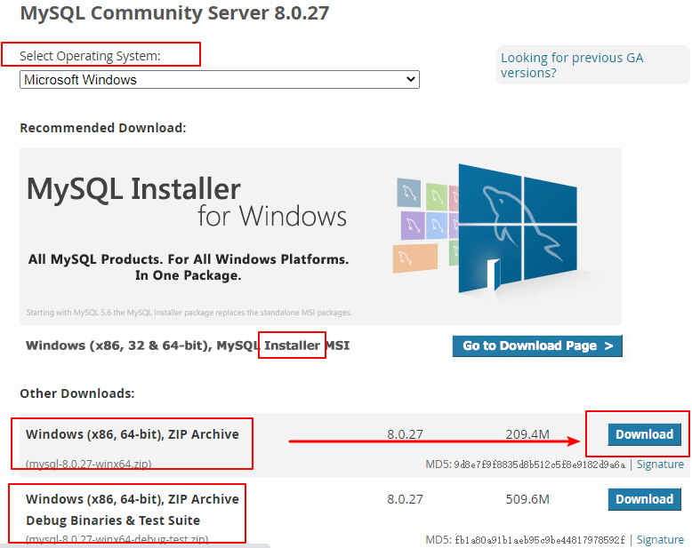
4. 点击`Download`然后会跳转到一个页面，我们选择最底部的`No thanks, just start my download.`也就是不使用登录用户下载。
   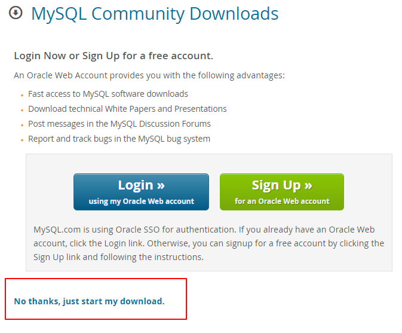

**mysql 安装**：

1. 解压下载后的 zip，如下图。
   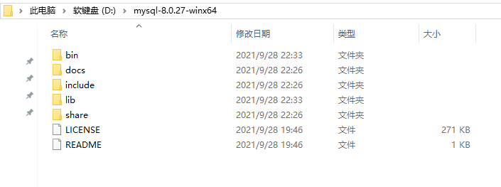
2. 配置环境变量，将 mysql 文件夹下的 bin 路径添加到变量值中，注意得用`;`分隔（win10 会智能一点）。右击“我的电脑”——选择“属性”——选择“高级系统设置”——选择“高级”——选择“环境变量”。在“系统变量”中选中“Path”进行编辑。
   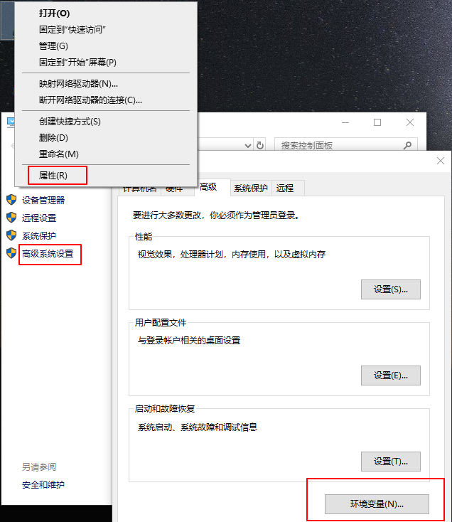  
   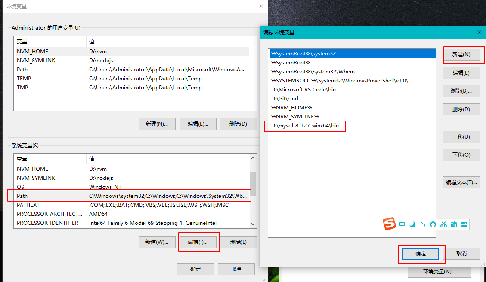
3. 配置初始化的 my.ini 文件，在 mysql 目录里新增 my.ini 文件

   ```txt
   [client]
   # 设置客户端的端口号
   port=3306
   # 设置客户端默认字符集
   default-character-set=utf8
   [mysql]
   # 设置mysql客户端默认字符集
   default-character-set=utf8
   [mysqld]
   # 设置mysql服务运行时的端口号
   port=3306
   # 设置mysql的安装目录，双斜杠
   basedir=D:\\mysql-8.0.27-winx64
   # 设置mysql的数据存放目录
   datadir=D:\\mysql-8.0.27-winx64\\data
   # 允许最大连接数，如果出现Too Many Connections的错误就需要增加最大连接数
   max_connections=200
   # 允许连接失败的次数。防止被攻击，超过会禁止host连接，重启mysql服务器或flush hosts命令可让host继续连接
   max_connect_errors=10
   # 数据库和数据库表的默认字符集(mysql服务端)，utf8是3字节的，utf8mb4是4字节的可以支持一些Emoji表情
   character-set-server=utf8mb4
   # 数据库字符集对应一些排序规则,要属于character-set-server对应值的集合内
   collation-server = utf8mb4_general_ci
   # 设置client连接mysql时的字符集,防止乱码
   init_connect='SET NAMES utf8mb4'
   # 创建新表时将使用的默认存储引擎
   default-storage-engine=INNODB
   # 默认使用mysql_native_password插件认证
   default_authentication_plugin=mysql_native_password
   # MySQL连接闲置超过一定时间后(单位：秒)将会被强行关闭
   wait_timeout = 1800
   # MySQL默认的wait_timeout 值为8个小时，interactive_timeout参数需要同时配置才能生效
   interactive_timeout = 1800
   # 大小写不敏感：1，大小写敏感0
   lower_case_table_names=0
   #限制单个文件大小,默认1G,太大了
   max_binlog_size = 100M
   # 数据库错误日志文件
   log_error=D:\\mysql-8.0.27-winx64\\log\\error.log
   # 设置临时表最大值，这是每次连接都会分配，不宜设置过大 max_heap_table_size 和 tmp_table_size 要设置一样大
   max_heap_table_size = 2048M
   tmp_table_size = 2048M
   # 每个连接都会分配的一些排序、连接等缓冲，一般设置为 2MB 就足够了
   sort_buffer_size = 2M
   join_buffer_size = 2M
   read_buffer_size = 2M
   read_rnd_buffer_size = 2M
   # 0,每秒写一次log,并flush到磁盘；1,每次事务提交时，写log,同时flush到磁盘；2,每次事务提交时写log,每秒flush一次到磁盘
   innodb_flush_log_at_trx_commit = 1
   ```

4. 安装 mysql，先以管理员身份运行 cmd。
   - 进入到 mysql 安装目录下，输入`mysqld --install`来安装 mysql 服务。
   - 然后输入`mysqld --initialize --console`来初始化 mysql，会出现`A temporary password is generated for root@localhost:`，它的后面就是 root 用户的初始密码，一定要记住。
   - 输入`net start mysql`开启 mysql 服务（如果失败了，那就输入`mysqld --remove`卸载 mysql 服务，再重新安装），如果输入`net stop mysql`这是停止 mysql 服务。
   - 输入`mysqladmin -u用户名 -p旧密码 password 新密码`来修改那个初识密码，例如`mysqladmin -uroot -p123456 password 123`。输入`mysql -u root -p`也可以修改密码。

## 云厂商 mysql

我们上线的项目是站库分离的，也就是后端代码与数据库不在同一台服务器上。这样的好处是减轻本地个人计算机的压力，云厂商的云数据库可以存放正开发的数据库，也可以存放已经上线的数据库，也就是它可以存放不同项目不同状态的数据库，更好的维护。况且云数据库也很便宜，新人优惠买 3 年也只要 60 元，双十一每年也只要 10 块钱。

我们以阿里云为例，进入[https://www.aliyun.com/product/rds/mysql](https://www.aliyun.com/product/rds/mysql)这个网站，新用户会有优惠活动。

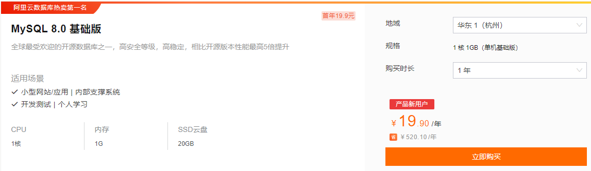

如果你不是新用户，那就只能点击页面顶部的“立即购买”按照原价来购买了。例如下面这种，买的一个月的，一核一 G，只有 20G 存储空间，我选的是在上海的 mysql 云数据库（选里你近的）。

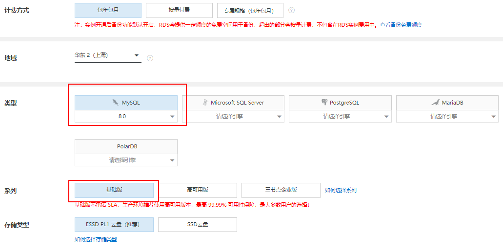  
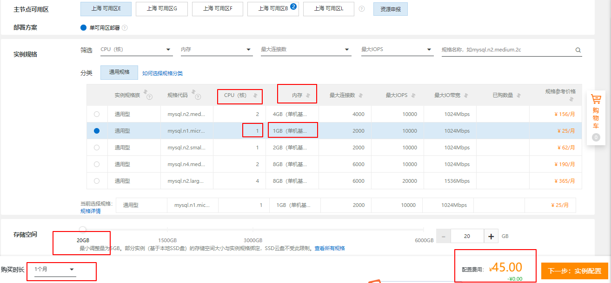

购买完成后进入[https://rdsnext.console.aliyun.com/dashboard](https://rdsnext.console.aliyun.com/dashboard)页面，然后按照下图可以完成创建账户和数据库以及连接数据库。（查询 MYSQL 数据库版本`SELECT VERSION()`）

  
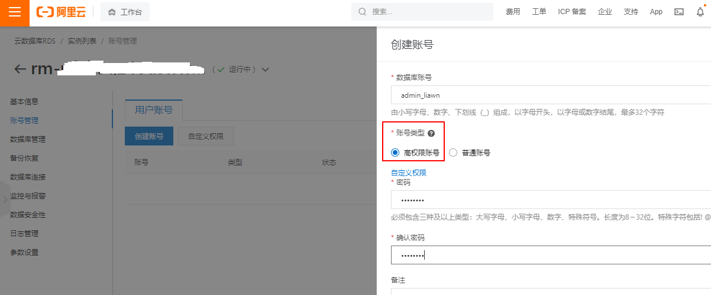  
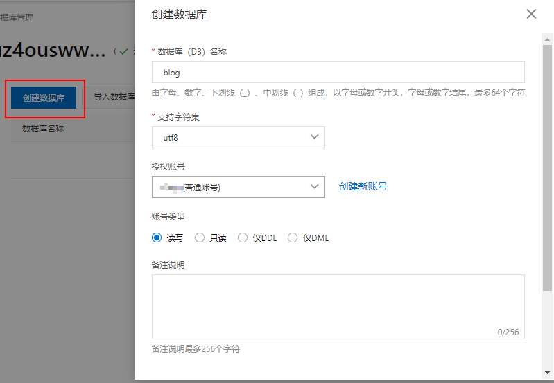  
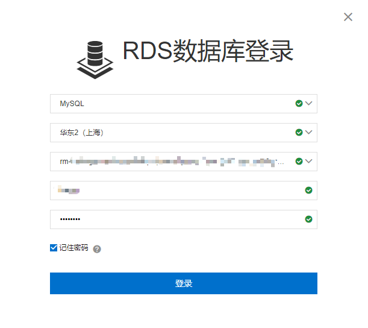

## 数据库客户端 navicat

我们使用的数据库客户端是[Navicat](https://www.navicat.com.cn)，**navicat**的下载安装可以去[navicat 官网](https://www.navicat.com.cn/products)下载 Navicat Premium 15 的试用版，破解的话可以看[知乎的这篇文章](https://zhuanlan.zhihu.com/p/384645315)。

navicat 破解：选择版本，选择 navicat.exe，补丁，注册码生成，复制请求码，激活码生成。

navicat 的基本设置在“工具-选项”里：

- 布景主题：深色
- 启动画面：从上次离开的画面继续
- 查询：在关闭前提示保存新建的查询或配置文件，自动保存间隔修改为 60s
- 常规颜色：`220,220,170`
- 关键字颜色：`86,156,214`
- 字符串颜色：`206,145,120`
- 数字颜色：`181,206,168`
- 注释颜色：`106,153,85`

## navicat 连接阿里云 mysql

在项目上线时，我们是将代码部署到云厂商的云服务器上的，然后云服务器也是可以安装 mysql 的（跟第一节内容差不多），也就是站库不分离的。使用数据库客户端连接数据库，要通过云服务器的**外网地址**与连接，具体就不展开，因为我们使用的是站库分离的方式。

站库分离，到时候云服务器要通过**内网地址**与云数据库进行连接，这个也不展开了。而在我们本地开发项目时（还未上线正在开发中），需要使用数据库客户端 navicat 连接云数据库的，这要通过云数据库的**外网地址**。

navicat 连接阿里云云数据库 mysql 步骤：

- 首先进入[阿里云工作台](https://homenew.console.aliyun.com/)的[资源实例视图](https://homenew.console.aliyun.com/home/dashboard/ResourceDashboard)，进入你的阿里云 mysql 的实例。
  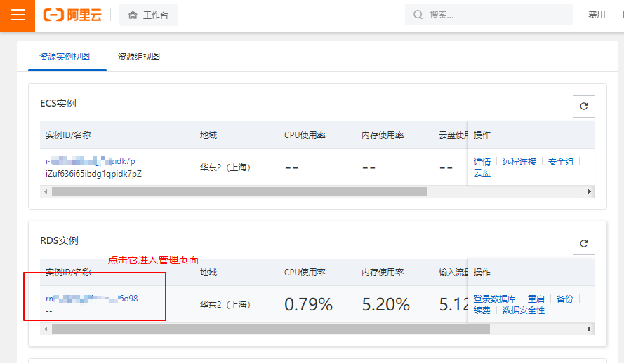
- 然后查看我们的 mysql 实例的连接详情，我们需要申请一下**外网地址**（点击“申请外网地址”按钮即可），然后还要设置一下白名单。
  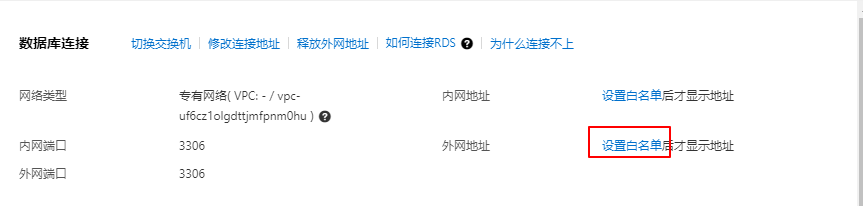
- 阿里云 mysql 白名单的设置，首先把 default 的`127.0.0.1`改为 ecs 私网地址（因为我们是站库分离的，如果没有 ecs 就改成其他的 IP，只要不是`127.0.0.1`就行），再设置一个自己电脑 IP 地址（该 IP 是你自己电脑的公网 IP，在百度上查询自己电脑的公网 IP，像我用的长城宽带，IP 几乎每天都不一样）。
  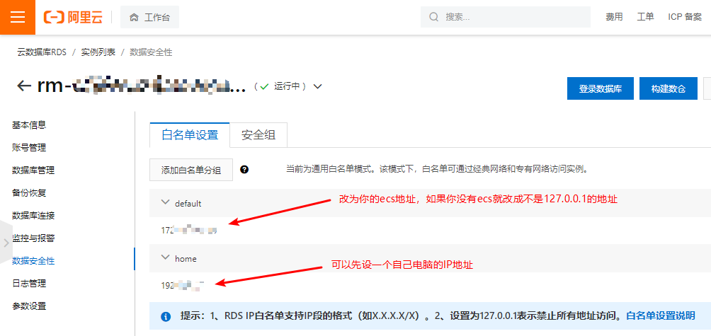
- 设置完白名单后再点击“查看连接详情”，就能看到阿里云 mysql 的**外网地址**了。
  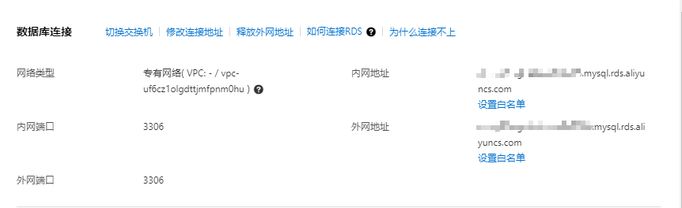
- 在 navicat 面板里找到“连接-阿里云-阿里云云数据库 MySql 版”
  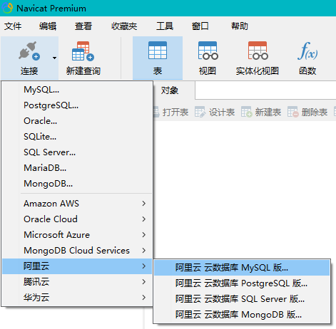
- 在“新建连接”里，连接名随意填，主机名就是阿里云 mysql 的**外网地址**，端口号一般是 3306（上一步也能看到端口号），用户名和密码在[云厂商 mysql](#云厂商-mysql)这一节的“创建账号”里说过了，最好用阿里云 mysql 的高权限账号，比如我的是`admin_liawn`。
  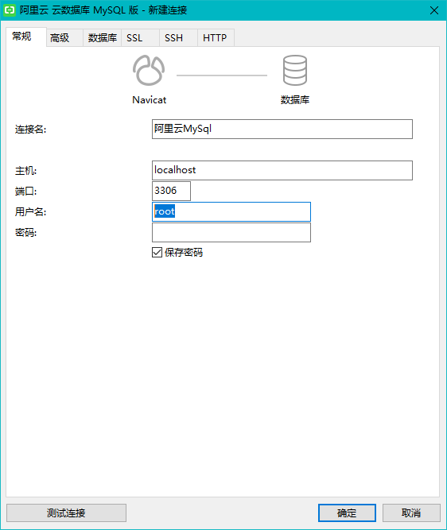
- 创建好连接后你可以点击一下“测试连接”按钮，如果不成功，很有可能是你的阿里云 mysql 白名单设置有问题，可以暂时把白名单设置成`0.0.0.0/0`，直到你真的弄清楚你本地的公网地址，再把`0.0.0.0/0`改为你的公网地址。如果成功，保存连接，在 navicat 面板右击连接名，然后选择“打开连接”。
  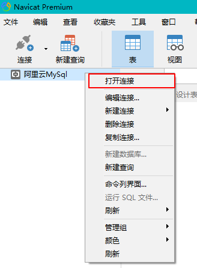
- 如果还有问题，可以查看[解决无法连接实例问题](https://help.aliyun.com/document_detail/127814.htm)。

## 建库建专用用户

可以直接在阿里云 mysql 里建库，也可以通过 navicat 连接阿里云 mysql 之后，在 navicat 上进行建库。这里讲第二种，我们右击“阿里云 MySql”（名字是在创建连接时随意取的），然后选择“新建数据库”。我们新建数据库`blog_dev`用于开发环境，字符集使用`utf8mb4`（支持复杂的 Unicode）。

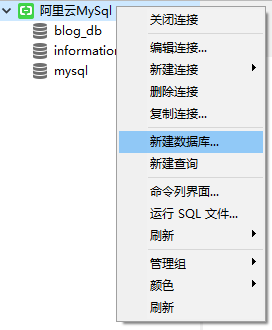  
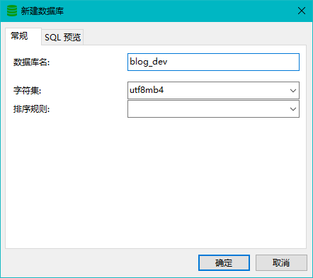

然后我们给新数据库`blog_dev`新建一个专用的“用户”，这个用户只能操作阿里云 mysql 里的这个`blog_dev`数据库，其他数据库没有权限。
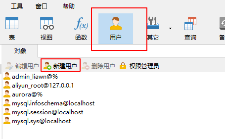  
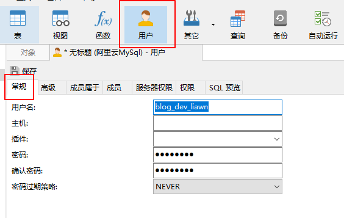  
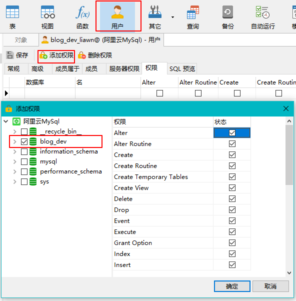

如果点击“用户”报`1142 - SELECT command denied to user`错误，那表示你没有权限，要将“阿里云 MySql”这个连接信息的用户名改为阿里云 mysql 的高权限账号，比如我的高权限账号是`admin_liawn`。
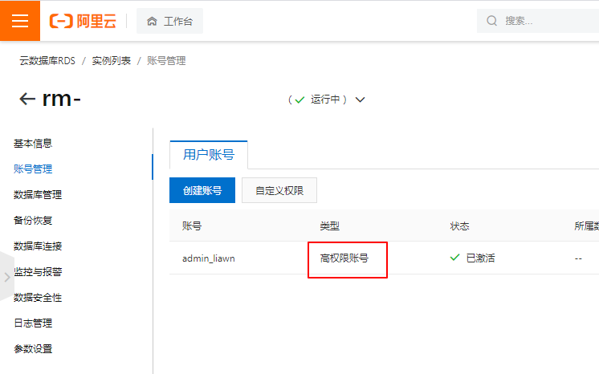  


等专用用户创建成功后，我们再将连接信息的用户改为这个专用用户。
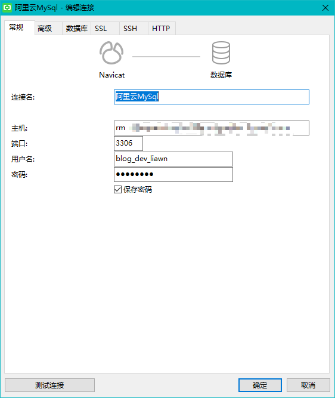

常用的系统类函数以及 sql

- `version()`：查看数据库版本号。`SELECT VERSION();`
- `database()`：查看当前库。`SELECT DATABASE();`
- `user()`：查看当前用户。`SELECT USER();`
- `SHOW DATABASES`：查看所有数据库。
- `SHOW TABLES`：查看当前库里的所有表。
