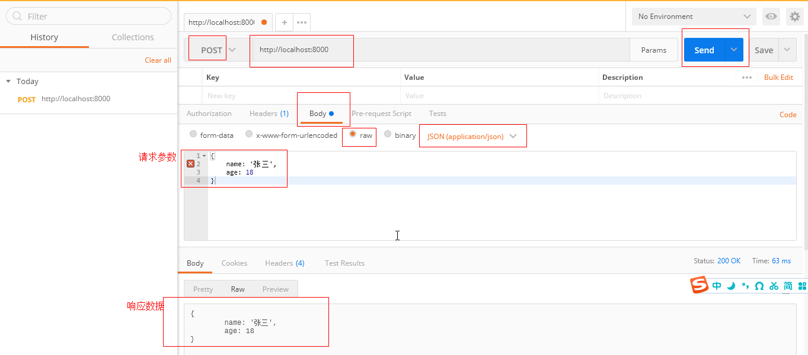

# http 传输相关

## 搭建 Http 服务

首先需要引入 http 模块，使用它的 createServer 方法来创建一个 http 服务。createServer 方法的形参是一个回调函数，在每次接收到请求时被执行。该回调函数有两个形参，第一个是请求对象，第二个是响应对象。在最后，需要使用 listen 方法来监听一个端口（第一个形参），服务就绪时会执行第二个形参（回调函数）。

```js
// 引入http模块
const http = require("http");
// 服务会部署在哪个端口
const port = 8000;
// 创建一个服务
const server = http.createServer((req, res) => {
  // 状态码
  res.statusCode = 200;
  // 数据形式
  res.setHeader("Content-Type", "text/plain");
  // 返回给客户端的信息
  res.end("你好世界\n");
});
// 服务就绪
server.listen(port, () => {
  console.log("服务已启动");
});
```

## 处理 get 请求

GET 请求是客户端向服务端请求查询一些数据，可以在 URL 带上查询参数。浏览器 URL 直接回车请求就是一个 GET 请求。请看下面这个例子，浏览器输入`http://localhost:8000/?key=1&name=2`并回车，req.method 的值是`GET`，`req.url`的值是`/?key=1&name=2`，经过 URLSearchParams 处理过后，返回到页面的值是一个 JSON 字符串`{"key":"1","name":"2"}`。

```js
// 引入http模块
const http = require("http");
const { URL } = require("url");
// 服务会部署在哪个端口
const port = 8000;
// 创建一个服务
const server = http.createServer((req, res) => {
  // 什么类型的请求，请求的地址
  console.log("req.method", req.method);
  console.log("req.url", req.url);
  // URL相关信息
  const url = new URL(req.url, `http://${req.headers.host}`);
  const resData = {};
  // 显示键/值对，处理成对象
  for (const item of url.searchParams) {
    resData[item[0]] = item[1];
  }
  // 状态码
  res.statusCode = 200;
  // 数据形式
  res.setHeader("Content-Type", "application/json");
  // 返回给客户端的信息
  res.end(JSON.stringify(resData));
});
// 服务就绪
server.listen(port, () => {
  console.log("服务已启动");
});
```

当 request.url 为 `'/status?name=ryan'` 且 request.headers.host 为 `'localhost:3000'` 时：

```js
$ node
> new URL(request.url, `http://${request.headers.host}`)
URL {
  href: 'http://localhost:3000/status?name=ryan',
  origin: 'http://localhost:3000',
  protocol: 'http:',
  username: '',
  password: '',
  host: 'localhost:3000',
  hostname: 'localhost',
  port: '3000',
  pathname: '/status',
  search: '?name=ryan',
  searchParams: URLSearchParams { 'name' => 'ryan' },
  hash: ''
}
```

## 处理 post 请求

POST 请求是客户端向服务端传递一些数据，这些数据大多数用于修改更新服务端存储数据。POST 请求可以使用 ajax/axios 来发送，如果不想写代码，可以使用谷歌应用商店里的[postman](https://chrome.google.com/webstore/detail/postman-interceptor/aicmkgpgakddgnaphhhpliifpcfhicfo/related?hl=zh)来模拟发送 POST 请求。

node 处理 POST 请求的处理与 GET 不一样，它的接收数据可能会很大，所以它使用了`req.on('data')`来一直接收数据，在数据接收完后有`req.on('end')`来收尾。

```js
// 引入http模块
const http = require("http");
// 服务会部署在哪个端口
const port = 8000;
// 创建一个服务
const server = http.createServer((req, res) => {
  if (req.method === "POST") {
    console.log("req Content-Type", req.headers["content-type"]);
    let postData = "";
    // 接收数据
    req.on("data", (chunk) => {
      postData += chunk;
    });
    // 数据接收完毕
    req.on("end", () => {
      console.log("postData", postData);
      // 状态码
      res.statusCode = 200;
      // 数据形式
      res.setHeader("Content-Type", "application/json");
      // 返回给客户端的信息
      res.end(JSON.stringify(postData));
    });
  }
});
// 服务就绪
server.listen(port, () => {
  console.log("服务已启动");
});
```

打开谷歌浏览器，进入`chrome://apps`，点击`Postman`，我们在以下界面填写相应的数据。地址栏里填写完整的地址，包括端口号；点击 Body，然后选择 raw，然后选择数据类型为`JSON(application/json)`；在 textArea 里输入请求数据例如`{name:'张三',age:18}`，最后点击 Send 就可以发送一个 POST 请求了。（下图的请求参数是“Bad String”，字符串得使用双引号，并且这个 key 也得用双引号包裹）



看一下同时处理 GET 和 POST 请求：

```js
// 引入http模块
const http = require("http");
const { URL } = require("url");
// 服务会部署在哪个端口
const port = 8000;
// 创建一个服务
const server = http.createServer((req, res) => {
  // 什么请求
  const method = req.method;
  // 数据形式
  res.setHeader("Content-Type", "application/json");
  // 状态码
  res.statusCode = 200;
  // URL相关信息
  const url = new URL(req.url, `http://${req.headers.host}`);

  if (method === "GET") {
    const resData = {};
    for (const item of url.searchParams) {
      resData[item[0]] = item[1];
    }
    // 返回给客户端的信息
    res.end(JSON.stringify(resData));
  } else if (method === "POST") {
    let postData = "";
    // 接收数据
    req.on("data", (chunk) => {
      postData += chunk;
    });
    // 数据接收完毕
    req.on("end", () => {
      // 返回给客户端的信息
      res.end(JSON.stringify(postData));
    });
  }
});
// 服务就绪
server.listen(port, () => {
  console.log("服务已启动");
});
```
