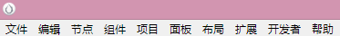

# 熟悉编辑器

## 基本界面

&nbsp;&nbsp;&nbsp;&nbsp;CocosCreator 编辑器主要由 **资源管理器、场景编辑器、层级管理器、属性检查器、控件库、动画编辑器、控制台** 等组成。

&nbsp;&nbsp;&nbsp;&nbsp;项目打开时，默认的界面布局如下图  

&nbsp;&nbsp;&nbsp;&nbsp;可以对这些面板进行移动、组合，以适应不同项目和开发者的需要。比如在边界处控制某个组件的大小，鼠标长按组件的名称标签可以拖动它去别的地方等等。如果你想将已改变的界面恢复，可以点击上方的 **“布局”-“恢复默认布局”**，当然你也可以选择 **“经典布局”** 和 **“竖屏游戏布局”**。

## 资源管理器

&nbsp;&nbsp;&nbsp;&nbsp;**资源管理器** 显示了项目资源文件夹（assets）中所有资源（图片、动画、声音等），在编辑中会自动同步在操作系统中对项目资源文件夹的修改。

&nbsp;&nbsp;&nbsp;&nbsp;**资源列表**：展示用的常见的树结构，也是代码编辑器（文件列表）常用的，所以 **资源列表的一些基本功能类似于操作文件列表（删除、复制、粘贴、拖拽、重命名等）**。文件夹形式的资源可以展开/折叠；非文件夹形式的就是资源文件了，会隐藏扩展名但会用图标显示，在下方还会显示资源路径。  
&nbsp;&nbsp;&nbsp;&nbsp;**导入资源**：可以直接将资源文件拖入资源管理器中，也可以选择“文件”-“资源导入...”。如果是创建新资源，可以使用左上角的“+”号。  
&nbsp;&nbsp;&nbsp;&nbsp;**搜索资源**：在搜索框里输入资源名称，再点击搜索按钮。当然也可以选择你要搜索的类型。
&nbsp;&nbsp;&nbsp;&nbsp;**.meta 文件**：在这个[链接](https://docs.cocos.com/creator/manual/zh/advanced-topics/meta.html)里有很详细的介绍，这里不展开了。

## 场景编辑器

&nbsp;&nbsp;&nbsp;&nbsp;**场景编辑器** 是内容创作的核心工作区域，可以将资源或 UI 组件拖入场景编辑中，对它们进行摆放来搭建一个游戏的具体场景。  

&nbsp;&nbsp;&nbsp;&nbsp;**视图移动和定位**：可以通过鼠标右键的拖拽来移动，鼠标滚轮是控制视图缩放的并且是以鼠标悬停的地方为参考点。

&nbsp;&nbsp;&nbsp;&nbsp;**坐标系和网格**：视图中有网格，用来表示世界坐标系中各个点的位置信息，单位是像素；左下角是(0, 0)点。

&nbsp;&nbsp;&nbsp;&nbsp;**设计分辨率指示框**：紫色线框里的是默认显示区域，这块区域是由设计分辨率决定的。

&nbsp;&nbsp;&nbsp;&nbsp;**节点的选取**：鼠标悬停到某个组件节点上，会出现灰色框（位置、大小）；单击它会出现蓝色框，并且可以进行变换。多选的话，可以用鼠标左键拉一个矩形出来，矩形里的就是你多选中的节点，还可以按住 ctrl 再去选节点，这样也是多选。当然你也可以通过层级管理器来选中它们（双击或按住 ctrl 再单击）。

&nbsp;&nbsp;&nbsp;&nbsp;**控制手柄**：场景编辑器中在特定编辑状态下显示出的可用鼠标进行交互操作的控制器。这些控制器只用来辅助编辑，不会在游戏运行时显示。

&nbsp;&nbsp;&nbsp;&nbsp;**变换工具**：  
&nbsp;&nbsp;&nbsp;&nbsp;&nbsp;&nbsp;&nbsp;&nbsp;1.移动变换工具（快捷键 W）：会出现红绿两个箭头和蓝色方块组成的移动控制手柄，可以沿着箭头方向移动，也可以用鼠标拖拽蓝色方块进行移动。  
&nbsp;&nbsp;&nbsp;&nbsp;&nbsp;&nbsp;&nbsp;&nbsp;2.旋转变换工具（快捷键 E）：会出现一个箭头和一个圆环组成的旋转控制手柄，可以拖拽箭头或圆环内任意一点就可以旋转节点。  
&nbsp;&nbsp;&nbsp;&nbsp;&nbsp;&nbsp;&nbsp;&nbsp;3.缩放变换工具（快捷键 R）：会出现红绿黄三个方块组成的缩放控制手柄，拖动红色是横向缩放、拖动绿色是纵向缩放、拖动黄色是按比例缩放。  
&nbsp;&nbsp;&nbsp;&nbsp;&nbsp;&nbsp;&nbsp;&nbsp;4.矩形变换工具（快捷键 T）：会出现一个矩形手柄，可以对矩形的边和顶点进行拖拽，以改变节点的大小和位置。

## 层级管理器

&nbsp;&nbsp;&nbsp;&nbsp;**场景编辑** 中打开的场景会在 **层级管理器** 中展示它的所有节点，可以在层级管理器里创建、删除、修改（层级或顺序）节点，其他功能同资源管理器一样（复制粘贴重命名等）。

&nbsp;&nbsp;&nbsp;&nbsp;**创建节点**：可以使用左上角的“+”号或者鼠标右键的“创建节点”，可以创建不同类型的节点，如果你想用一个资源来创建节点，就直接从 **资源管理器** 中将资源拖拽进 **层级管理器** 中。

&nbsp;&nbsp;&nbsp;&nbsp;**删除节点**：先选中一个节点，然后按下“Delete”或者“Ctrl+Backspace”，鼠标右键也可以。

&nbsp;&nbsp;&nbsp;&nbsp;**层级或顺序修改**：使用鼠标拖拽。

&nbsp;&nbsp;&nbsp;&nbsp;**锁定节点**：鼠标悬停在某个节点上，左侧会出现一把小锁，点击它就会让节点锁定然后不能被选中。

## 属性检查器

&nbsp;&nbsp;&nbsp;&nbsp;**属性检查器** 是用来查看并编辑节点或资源的属性的，也就是说 **场景编辑器** 或 **层级管理器** 中选中的节点会在属性检查器中显示该节点的大小、位置、缩放、旋转等， **资源管理器** 中选中的资源会在属性检查器中显示资源的类型、寻址模式、过滤模式等。

&nbsp;&nbsp;&nbsp;&nbsp;**激活开关**：属性检查器顶部是节点名称，旁边就是激活开关。隐藏 or 显示当前节点（包括子节点），可以理解为 visible。

&nbsp;&nbsp;&nbsp;&nbsp;**节点属性**：Node 便签下就是一些属性了，悬停到这些属性上会有提示信息。Node 标签右侧有个设置按钮，可以重置 Node 标签下的属性、复制这些属性、粘贴别处的属性。

&nbsp;&nbsp;&nbsp;&nbsp;**组件属性**：节点属性下面，会列出节点上挂载的所有组件和组件的属性。也有名称、激活开关、设置、一些属性，它额外有一个“帮助文档”，点击它可以直接跳到当前组件的帮助文档链接。

&nbsp;&nbsp;&nbsp;&nbsp;**编辑属性**：属性是组件脚本中声明的公开并可被序列化存储在场景和动画数据中的变量，在属性检查器中可以编辑它们的值，它们值的类型分为：  
&nbsp;&nbsp;&nbsp;&nbsp;&nbsp;&nbsp;&nbsp;&nbsp;**值类型属性**：数字、字符串、布尔值、向量、枚举等简单的占用很少内存的变量类型。  
&nbsp;&nbsp;&nbsp;&nbsp;&nbsp;&nbsp;&nbsp;&nbsp;**引用类型属性**：是比较复杂的对象，例如节点、组件、资源、脚本等，这种需要将其拖拽到属性栏中来完成引用类型属性的赋值。

&nbsp;&nbsp;&nbsp;&nbsp;**多批量设置属性**：在 **资源管理器** 中选中多个资源，然后 **属性检查器** 中会显示出选中的资源数量以及可编辑的资源属性。节点的多批量设置属性也是类似。

## 控件库

&nbsp;&nbsp;&nbsp;&nbsp;**控件库** 是一个可视化控件仓库，包含内置控件、自定义控件、云组件，可以将你需要的控件拖拽到层级管理器或资源管理器中。

&nbsp;&nbsp;&nbsp;&nbsp;**内置控件**：是编辑器内置的预设节点，有默认资源的精灵（Sprite）、包含背景图和文字标题的按钮（Button）以及已经配置好内容和滚动条的滚动视图（ScrollView）等。

&nbsp;&nbsp;&nbsp;&nbsp;**自定义控件**：用户自己制作的[预制资源（Prefab）](https://docs.cocos.com/creator/manual/zh/asset-workflow/prefab.html)，再将这些预制资源从 **资源管理器** 中拖拽到“自定义控件”这个标签下，以完成自己定义的控件，然后就可以像内置控件一样在一些场景中反复使用。

## 动画编辑器

&nbsp;&nbsp;&nbsp;&nbsp;**动画编辑器** 是用来编辑节点下的 Animation 组件的。

&nbsp;&nbsp;&nbsp;&nbsp;**常用按钮**：左上角有一排常用的按钮，分别是“打开/关闭编辑模式”、“跳到第一帧”、“跳到上一帧”、“播放动画”、“跳到下一帧”、“插入帧事件”、“新增 clips”。

&nbsp;&nbsp;&nbsp;&nbsp;**时间轴和关键帧**：左侧上方带有刻度的这部分是动画的时间轴，上面也会显示一些自定义事件（关键帧）。时间轴旁边还有一个“01-07”的字样，意思是当前处在 1 秒第 7 帧。  
&nbsp;&nbsp;&nbsp;&nbsp;&nbsp;&nbsp;&nbsp;&nbsp;同一刻度不同帧率：当帧率为 30 时，“01-07”表示动画开始后的第 1 + 7/30 = 1.2333 秒；当帧率为 10 时，“01-07”表示动画开始后的第 1 + 7/10 = 1.7 秒。  
&nbsp;&nbsp;&nbsp;&nbsp;&nbsp;&nbsp;&nbsp;&nbsp;事件所处的关键帧，它的的总帧数不受帧率改变而影响。例如当前帧率 30，向“01-07”刻度上添加了关键帧，该关键帧位于动画开始后总第 37 帧。之后把帧率修改为 10，该关键帧仍然处在动画开始后第 37 帧（总帧数 37 不变），而此时关键帧所在位置的刻度读数为“03-07”。

&nbsp;&nbsp;&nbsp;&nbsp;**其他**：“属性列表”上方是层级管理（节点树）和节点内关键帧的预览区域，下方则是属性和关键帧信息。

&nbsp;&nbsp;&nbsp;&nbsp;**快捷键**：

- left：向前移动一帧，如果已经在第 0 帧，则忽略当前操作
- right：向后移动一帧
- delete：删除当前所选中的关键帧
- k：正向的播放动画，抬起后停止
- j：反向播放动画，抬起后停止
- ctrl / cmd + left：跳转到第 0 帧
- ctrl / cmd + right：跳转到有效的最后一帧

## 控制台

&nbsp;&nbsp;&nbsp;&nbsp;**控制台** 会显示报错、警告、编辑器或引擎生成的日志信息。

&nbsp;&nbsp;&nbsp;&nbsp;**日志等级**：

- 日志(Log)：灰色文字，通常用来显示正在进行的操作。
- 提示(Info)：蓝色文字，用来显示重要提示信息。
- 成功(Success)：绿色文字，表示当前执行的操作已成功完成。
- 警告(Warn)：黄色文字，用来提示用户最好进行处理的异常情况，但不处理也不会影响运行。
- 报错(Error)：红色文字，表示出现了严重错误，必须解决才能进行下一步操作或运行游戏。

&nbsp;&nbsp;&nbsp;&nbsp;**设置以及功能**：  
&nbsp;&nbsp;&nbsp;&nbsp;&nbsp;&nbsp;&nbsp;&nbsp;1.合并：相同重复信息会被合并成一条，旁边会有黄色信息提示有多少条被合并了。  
&nbsp;&nbsp;&nbsp;&nbsp;&nbsp;&nbsp;&nbsp;&nbsp;2.清空：左上角有一个清空按钮，如果要每次运行前清空可以到“设置”里设置。
&nbsp;&nbsp;&nbsp;&nbsp;&nbsp;&nbsp;&nbsp;&nbsp;3.日志过滤：可是按照日志等级来过滤，也可以输入关键字来过滤，还提供了正则表达式来过滤。

## 主菜单

&nbsp;&nbsp;&nbsp;&nbsp;**主菜单** 包含有“文件”、“编辑”、“节点”、“组件”、“项目”、“面板”、“布局”、“扩展”、“开发者”和“帮助”。可以直接打开编辑器一一查看，都是字面上的意思，不再展开说明  

## 工具栏

&nbsp;&nbsp;&nbsp;&nbsp;**工具栏** 包含有“变换工具”、“预览工具”、“预览地址（二维码）”、“快捷打开项目文件夹”。

&nbsp;&nbsp;&nbsp;&nbsp;之前已经提过“变换工具”了，“预览工具”和“预览地址”也好理解，就是以模拟器还是浏览器去预览运行游戏，预览地址可以还是二维码用手机也可以预览。剩下的就是项目地址快捷打开、编辑器安装地址快捷打开。

## 编辑器设置

&nbsp;&nbsp;&nbsp;&nbsp;**编辑器设置** 包含有“常规”、“数据编辑”、“原生开发环境”、“预览运行”。

&nbsp;&nbsp;&nbsp;&nbsp;需要注意的几点：

- “构建日志是否在控制台显示”：这一项在选中状态时，构建发布原生项目的过程日志会直接显示在控制台面板里。非选中状态时，构建发布原生项目的日志会保存在 %USER/.CocosCreator/logs/native.log
- “meta 文件备份时显示确认”：在 meta 文件所属的资源丢失时，是否弹出对话框提示备份或删除 meta 文件。如果选择备份，可以在稍后手动恢复资源，并将 meta 文件手动拷贝回项目 assets 目录，防止资源相关的重要设置（如场景、prefab）丢失
- “默认开启 prefab 自动同步模式”：新建 prefab 时，是否自动开启 prefab 资源上的「自动同步」选项。开启自动同步后，保存 prefab 资源修改时会自动同步场景中所有该 prefab 的实例。

## 项目设置

&nbsp;&nbsp;&nbsp;&nbsp;**项目设置** 是打开的这个项目的设置，最后会保存到 settings/project.json 里。包含有“分组管理”、“模块设置”、“项目预览”、“自定义引擎”、“服务”。  

