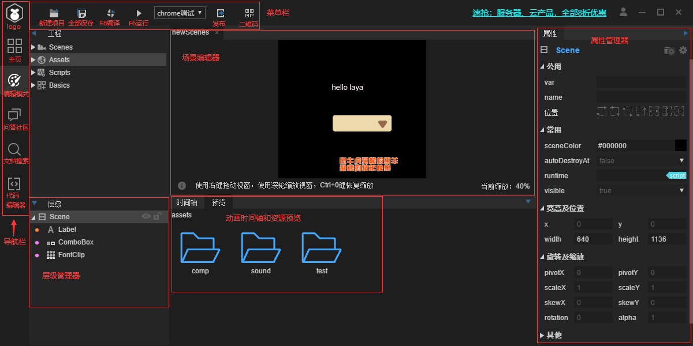
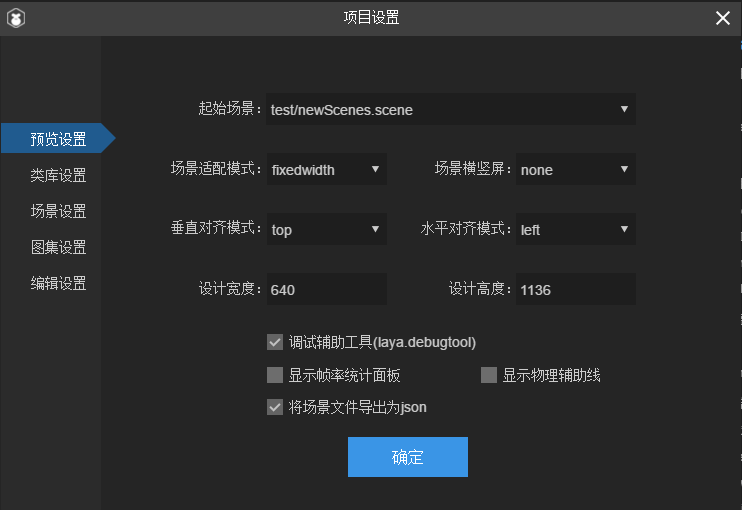
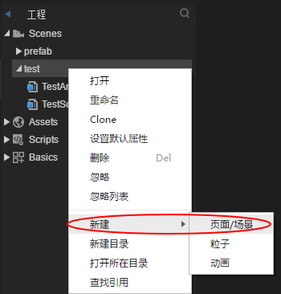
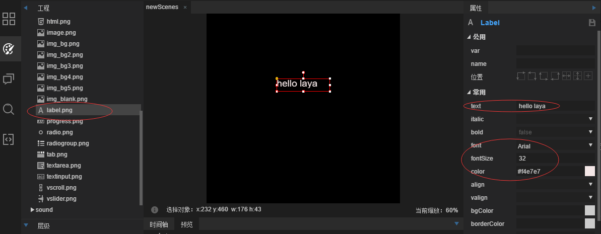

# IDE 的使用

## IDE 的基本布局

## 菜单栏和导航栏

- 菜单栏：
  - 新建项目：字面意思，新建一个新的项目
  - 全部保存：字面意思，保存全部文件
  - F8 编译：在 src 中的脚本修改后，需要使用它进行编译
  - F6 运行和 xx 调试：在 IDE 里调试还是启用 chrome 调试
  - 发布：发布微信、QQ、字节跳动等小游戏包
  - 二维码：经常使用的调试方式，可以在浏览器上或者手机上调试，带 IP 的会非常方便
- 导航栏
  - LOGO：单击会出现“文件、编辑、视图、工具、导出、项目、插件、帮助”
  - 主页：主要有“新建、打开、最近项目、新闻、学习”
  - 编辑模式：也叫设计模式，主要是项目的 UI 设计、资源管理、属性管理等
  - 问答社区：其实也就是[http://ask.layabox.com/](http://ask.layabox.com/)
  - 文档搜索：其实也就是[http://sou.layabox.com/](http://sou.layabox.com/)
  - 代码编辑器：以前 IDE 是将 VSCode 嵌在这里的，但由于 VSCode 更新后引擎方对新版本适配要做出大量工作，后面就将内置的 VSCode 移出了，直接外链了 VSCode

## 项目设置

&nbsp;&nbsp;&nbsp;&nbsp;项目设置在“LOGO-文件-项目设置 F9”，点击后如下图所示  

- 预览设置
  - 起始场景：也就是入口场景，一般都是设置的固定的入口场景，在 test 项目中是设置的当前场景
  - 适配横竖屏对齐方式后面会单独说
  - 设计宽高：这个是游戏画布的大小，与具体场景大小无关，可以试着改小一点看看效果
  - 调试辅助工具：比较好用的调试面板，可以查看节点和层级信息，配合着 chromeDevTool 使用更佳
  - 将场景文件导出为 json：一般是 scene 这样的后缀，但小游戏不支持这样的文件，所以这里默认导出为 json
- 类库设置：项目有特殊功能可能需要额外勾选一些类库，去掉不使用的类库
- 场景设置-发布模式
  - 内嵌模式：以前没有小游戏的时候使用的是内嵌模式，将 UI 放到了 js 代码里会很方便，这样 UI 也不会重复被加载，但是 js 代码包体比较大；
  - 加载模式：出现小游戏后需要考虑到 js 的大小了，所以将 UI 场景类都放到了一个 json 里，使用时加载这个大的 json；
  - 分离模式：将场景 UI 场景类都分开，使用哪个就加载哪个场景类，不会再加载那个大的 json 了，在 laya2.0 也有了优化会自动加载对应的场景类；
  - 文件模式：是开发小游戏独有的，它不生成场景类能进一步减少包大小，但是需要 Scene.load 来加载使用，在调用场景里的变量需要 getchild 获取之后进行操作。**推荐使用“分离模式”和“文件模式”，默认是“文件模式”**。
- 图集设置
  - 一般不修改里面的设置，低于 512 的碎图打到一个图集里，图集的好处就是减少提交渲染批次以提高 GPU 运算，也减少了资源占用空间。
- 编辑设置
  - 容器列表：可以自定义容器，将自定义容器添加进来
  - 场景类型：可以自定义场景类型，将自定义场景类型添加进来
  - 语言包路径：设置成某个多语言包的路径，会在 IDE 里替换成对应语言的 UI，但游戏中还是未替换只是用来预览的

## 帮助

- 开发人员工具：当 IDE 报错时，可以打开这个工具，将里面的信息保存上传到引擎官方进行反馈
- 打开编辑器本地缓存：点击后会跳转到 IDE 的本地缓存，如果编辑器显示错乱了或者报错了，可以删除里面的缓存（前提是“视图-重置面板”不起作用）

## 编辑

- 定位资源：选中组件后使用这个功能可以查看它的资源在哪里
- 原位粘贴：一般的粘贴都会偏移之前的位置，这个就在原位
- 重复复制：适合于几行几列的复制

## 工具

- 启用编译优化功能：默认是关闭的，打开后，在“F8 编译”时，如果代码没有改动过就不会再编译了；这个功能主要适用于只替换图片不修改代码的场景。
- SWF 转换：以前 flash 项目常使用的功能。
- JS 压缩：将 xx.js 压缩成 xx.min.js
- 龙骨动画转换：将龙骨动画转换成 Laya 可以识别的格式
- Spine 动画转换：将 Spine 动画转换成 Laya 可以识别的格式
- Psd2UI：如果美术提供的 PSD 已经按照规定格式命名好了，使用该功能就可以直接分解成对应的资源
- 图集打包：将很多图片打包成图集
- 运行器下载：native 打包使用的
- app 构建：将项目打包成 app
- 代码编辑器：之前提过的，外链到 VSCode
- 微信 web 开发者工具：外链微信 web 开发者工具

## 导出

每次运行时都会自动“导出”，如果运行的界面没有关，可以直接“导出”再刷新页面

- 导出 F12：只针对修改的 UI 进行导出，导出的是 UI 和资源等内容
- 清理并导出 Ctrl+F12：不管修改与否，将所有之前导出的内容都清理掉再导出所有
- 导出代码：没有修改资源只导出代码
- 发布：发布的时候用，平常不要点击，很慢
- 导出语言包：制作多语言 UI 时会用到
- 查找未使用的资源：可以清理掉没有使用到的资源

## IDE 可视化编辑模式的操作

### 创建场景并添加组件

&nbsp;&nbsp;&nbsp;&nbsp;打开编辑模式（设计模式），在左侧的“工程”里可以看到“Scenes”，在里面的目标文件夹里右击，选择“新建-页面/场景”

&nbsp;&nbsp;&nbsp;&nbsp;在左侧的“工程”里可以看到“Assets”，在里面选择你想要组件，将其拖入到新建的场景中，设置好相应的位置、大小、字体、字体大小、字体颜色等等。

&nbsp;&nbsp;&nbsp;&nbsp;也就是说在场景里的内容都会有各自的属性检查器，对应某个组件在场景里的属性。

### 资源预览和场景层级

- 当场景里添加了很多组件时，就会有一些层级关系，层级在左下角查看。
- 还可以在层级中添加 box 等容器，这些容器里也能存放组件。
- 将组件或者资源拖入到场景前，可以单击资源在“预览”中查看它的详细图。
