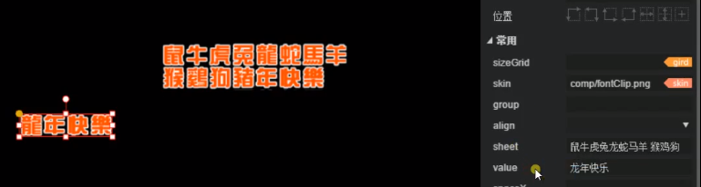

# 常用组件详解

## 图像组件

### Sprite

**Sprite** 的创建：在层级面板里右击，再选择“创建 Sprite 节点”；**不符合 Laya 基础组件命名规则的**，拖拽到场景里或者层级面板里，**都算作 Sprite 组件**。  
Sprite 相对于 image 要 **性能更好一些，但是无法进行相对布局，也不能设置九宫格，也没有数据源**。  
Sprite 属性介绍：

- 公用
  - var：在场景里声明一个唯一的名字（**直接 this.xxx 来调用**），方便在代码模式里调用组件；如果发布模式是“文件模式”，**由于没有场景类就不能使用 var 了**
  - name：也是组件的名字，但 **不是全局的**，只能通过父级的 **getChildByName 方法** 来调用
  - 位置布局：主要用于在场景里快捷布局
- 常用
  - runtime：运行时的逻辑类，也就是组件的脚本，将脚本代码拖拽到 runtime 处即可关联
  - texture：纹理地址（图片地址，皮肤 skin），将图片拖拽到 texture 处即可快速填写纹理地址
  - visible：是否显示，默认为 true
- 宽高及位置
  - x：x 轴坐标
  - y：y 轴坐标
  - width：宽度
  - height：高度
- 旋转及缩放
  - pivotX：X 轴心点，以像素为单位，影响缩放中心、旋转中心和显示位置；左上角的小黄点
  - pivotY：Y 轴心点，以像素为单位，影响缩放中心、旋转中心和显示位置
  - scaleX：水平缩放，默认为 1
  - scaleY：垂直缩放，默认为 1
  - skewX：水平倾斜角度
  - skewY：垂直倾斜角度
  - ration：旋转的角度
  - alpha：透明度（0-1）
- 其他
  - blendMode：混合模式；为 lighter 时，两张图片叠加，**上层的图会混合底层的颜色**
  - cacheAs：缓存组件，none 为不缓存（默认值），normal 只缓存命令（优化节点数），bitmap 缓存为位图（优化 DrawCall），**静态面板可以开启 cacheAs 优化**
  - drawCallOptimize：为 true 时开启 DrawCall 优化；引擎绘制时自动将所有文本提到显示最上层（相当于层级的最上层），**避免同一个图集内的图像绘制时被文本打断，可以减少 drawcall 数量**，如果存在 **文字遮挡的需求**，就不要开启 drawCallOptimize，因为 drawCallOptimize 开启后 **刚开始文本可能不会被遮挡了**
  - hitTestPrior：**指定鼠标事件监测是优先监测自身还是优先监测其子对象**。默认为 true，优先监测自身，如果 **没有监测到就中断监测，表示没有命中**。为 false 的话，优先监测其子对象，**监测到子对象就会中断监测，获得命中目标；如果没有命中任何子对象才会去监测对象本身**。
  - mouseEnabled：是否接受鼠标事件，关闭后 hitTestPrior 不会再监测这个节点
  - mouseThrough：**当 mouseEnabled 为 true 时，mouseThrough 才生效**，用于修正点击区域的属性；mouseThrough 默认为 **false**，节点设置的宽高为点击区域（**hitTestPrior 为 false 的话点击区域还会包含子对象**）并穿透不了，如果没有设置宽高那就直接穿透了；mouseThrough 为 **true** 时，不管设置宽高与否，**显示的内容（可见部分）** 就是点击区域并穿透不了，其他地方是穿透的（多个矢量图之间很特殊，是不穿透的）
  - renderType：渲染类型；mask 作为遮罩体渲染（子节点的形状会作为父节点的一个遮罩体），render 作为 list 渲染项渲染，instance 使用单例方式实例
  - zOrder：层级 z 方向的顺序，值越大越靠上

**Texture 一般会依托于 Sprite 来显示，也可以在 Image 上显示，但在 Sprite 上更好（性能好也轻便），多个 Texture 在 Sprite 上只会显示一个。**

### Image

**Image** 继承自 UIComponent 再继承自 Sprite，所以 Image 有 Sprite 的属性，也有自己单独的属性。  
可以相对布局，可以设置九宫格，有数据源。

- 常用
  - sizeGrid：九宫格，主要 **用于拉伸而又不影响边缘的情况，只拉伸中间无影响的部分**
  - skin：同 texture，是图片资源的地址
  - group：加载分组，设置后可以按照组管理资源
- 宽高及位置（与 Sprite 最主要的区别，可以 **相对布局**）
  - left：居父容器左边的距离
  - right：居父容器右边的距离
  - top：居父容器上边的距离
  - bottom：居父容器底边的距离
  - centerX：水平居中偏移位置
  - centerY：垂直居中偏移位置
- 其他
  - disabled：是否禁用，禁用后会置灰，同时不接收鼠标事件
  - gray：是否变灰，只变灰，接收鼠标事件

## 视图组件

视图组件的创建是在“工程-Scenes”里创建的，如下图  
  
  
会看到视图组件有三种：**Scene、View、Dialog**；它们的关系是 **Dialog 继承自 View，View 继承自 Scene**。

- 视图组件有个 **预加载功能**，这个功能按钮在右上角，你可以让一些资源 **不预加载**，对应资源的打包方式要改为 **“不打包”**
- **别名** 是在 IDE 里显示用的，实际没有什么意义
- 在属性里修改宽高，在场景设置里会自动对应修改

### Scene

**Scene** 是场景，用于游戏中的主场景、战斗场景、副本场景等等

- 常用
  - sceneColor：参考背景颜色（**实际运行中没有**）
  - autoDestroyAtClosed：场景被关闭后，**是否自动销毁（销毁节点和使用到的资源）**，默认为 false；更灵活地管理资源可以手动去销毁
- 其他
  - viewport：视口大小(格式:x,y,width,height)，**视口外的子对象，将不被渲染**；适用于 RPG 类游戏

**Scene 不能进行相对布局的**，所以没有 left、right、top、bottom、centerX、centerY 这些属性

### View

**View** 是一个常用的显示面板或者说是显示模块，比如游戏中底部的经验条、左上角的角色信息、侧边的功能区域等等  
因为 View 是继承自 Scene，所以 Scene 有的属性，它大部分都有，有个别不同的：

- 旋转及缩放
  - anchorX：X 轴锚点，值为 0-1（**用于相对定位；View 有 left、right、top、bottom、centerX、centerY 这些属性，可以相对定位**）
  - anchorY：Y 轴锚点，值为 0-1
  - pivotX：**View 没有该属性**
  - pivotY：**View 没有该属性**
  - skewX：**View 没有该属性**
  - skewY：**View 没有该属性**
  - ration：**View 没有该属性**
  - alpha：**View 没有该属性**

PS：**anchor 是相对于父节点的参考点，而 pivot 是相对于本身的旋转、缩放等参考点**

### Dialog

**Dialog** 是弹窗，也是游戏中常用的模块，**用于显示提示信息或者对话框等**  
因为 Dialog 是继承自 View，所以 View 有的属性，它大部分都有，它也有自己独有的：

- 常用
  - dragArea：拖动区域(格式:x, y, width, height)，**一般设置在弹窗的顶部区域，按住弹窗的顶部就可以就行拖动了**，比较适用于任务提示、线路提示等一些可以自定义拖动的弹窗
  - isModal：是否是模式窗口，**默认是 false 点击是穿透的，设置为 true 的话点击弹窗就不会穿透到后面**
  - isShowEffect：是否显示弹出效果，默认带了弹出效果
  - isPopupCenter：指定对话框是否居中弹出，默认是居中弹出的

## 切片组件

切片是对位图在一个方向上进行等比切割（裁剪）；FontClip 继承自 Clip

### Clip

- 常用
  - autoPlay：是否自动播放，默认 false
  - clipWidth：单切片宽度(优先级高于 clipX)
  - clipHeight：单切片高度(优先级高于 clipY)
  - clipX：切片 X 轴数量(通常使用这个)
  - clipY：切片 Y 轴数量(通常使用这个)
  - index：当前帧位置，也就是当前显示的是哪一个，从 0 开始
- 其他
  - interval：动画播放间隔(单位毫秒)，时钟、倒计时和计时器可以使用这个

### FontClip

推荐使用 **FontClip** ，非常常用的，特殊的文本和字体需要使用它
因为 FontClip 是继承自 Clip，所以 Clip 有的属性，它大部分都有，它也有自己独有的：

- 常用
  - align：水平对齐方式
  - sheet：位图内容范围（文字就直接写文字，如果是图片就使用索引）
  - value：位图数字内容（显示值，文字或索引）
  - spaceX：X 方向项间隔（字间距）
  - spaceY：Y 方向项间隔（字间距）
  - direction：排列方向（一般是横着显示 horizontal，也可以竖着显示 vertical）
    

## 文本组件

### FillText

**FillText 是一个 Graphics 绘制的文本**，**动态文本建议使用 FillText，静态文本用 Text 或 Label**；因为动态的文本在使用 Text 会创建新图集比较耗内存，而 FillText 是 **使用旧图集或一个字一个字提交（创建效率低一些），图集利用率和共享好**，但是复杂的“蝌蚪文”不建议使用 FillText（中英文可以），分割时可能会出错。

- 公用
  - renderType：渲染类型，空值就是作为文本显示在画布上；hit：只作为鼠标点击区域，不会显示在画布上；unHit：不可点击区域，也不会显示在画布上；
- 常用
  - text：文本内容（不换行）
  - font：字体（比较特殊，可以写字体、大小、斜体、粗体等等）
  - color：字体颜色（支持 16 进制、rgb 和颜色英文名）
  - textAlign：对齐方式（跟普通的也有区别，不是在整个文本区域里对齐的）

### Text

**Text** 最基础的 2D 文本组件

- 常用
  - text：文本内容（不换行）
  - font：字体（只是设置文本字体样式）
  - fontSize：字体大小
  - bold：是否粗体
  - color：文字颜色
  - italic：是否为斜体
  - align：水平对齐方式
  - valign：垂直对齐方式
  - wordWrap：文本是否自动换行，默认为 false，不可自动换行
  - leading：垂直 padding 行间距（以像素为单位）
  - padding：边距信息(上边距，右边距，下边距 , 左边距)
  - overflow：文本超出文本域后的行为（visible 不进行任何裁切，hidden 超出后隐藏，scroll 超出后可以滚动查看）
  - stroke：描边宽度
  - strokeColor：描边颜色

### Label

**Label** 是封装了 Text 的 UI 文本组件，Text 有的属性 Label 基本也有，介绍一下 Label 独有的属性：

- 常用
  - text：文本内容（可换行，加\n）
  - bgColor：背景颜色（文本域的背景颜色）
  - borderColor：文本边框颜色
  - underline：是否显示下划线
  - underlineColor：下划线颜色

如果 **没有相对布局、文字换行、下划线** 等这些需求，使用 Text 要比 Label **性能更好一些**

### TextInput

输入框 **TextInput** 继承自 label，有 label 的绝大部分属性，因为是输入框所以也有自己独有的属性：

- 常用
  - sizeGrid：九宫格信息(格式:上边距,右边距,下边距,左边距,是否平铺(0 或 1，可选))
  - skin：背景皮肤
  - type：输入框类型(text,password,email,url,number,range,date,month,week,time,datetime,datetime-local,searc)
  - maxChars：最大字符数
  - restrict：限制输入的字符，输入到这里的，是只能输入这些。不建议开启。适用于简单的文本。不支持反斜杠(中文在 PC 和手机情况不一样，也不建议)
  - prompt：输入前提示文本
  - promptColor：输入提示文本的颜色
  - editable：设置可编辑状态
  - multiline：是否是文本域。 值为 true 表示当前是文本域，可多行输入，否则不是文本域。（在简单情况下可以取代 textArea）

### TextArea

虽然 **TextInput** 使用 **multiline** 可以实现多行文本域的效果，但是可能会 **需要用到滚动条什么的**，这时候用到 **TextArea** 会比较好

- 常用
  - vScrollBarSkin：添加垂直滚动条皮肤
  - hScrollBarSkin：添加水平滚动条皮肤

### HTMLDivElement

**HTMLDivElement** 富文本，常用于 **聊天面板或者复杂图文混排** 里；引擎对 H5 标签进行解析，然后渲染绘制到画布上，它并不是标准的 H5 元素（Laya 支持常用的 H5 标签解析）；**可以派发 link 事件的富文本，如果有 href，可以在 href 里携带参数，后面接收 link 事件时也会接收该参数**。

- innerHTML：html 内容

## 滚动条与裁剪面板容器

### ScrollBar

水平滚动条 **HScrollBar** 和垂直滚动条 **VScrollBar** 都是继承自 **ScrollBar**

- 常用
  - max：最大滚动位置
  - min：最小滚动位置
  - scrollSize：点击按钮滚动量,每点击一次方向按钮，滚动条的值改变多大
  - value：滚动条当前进度值
  - mouseWheelEnable：是否滚轮滚动(PC)，默认为 true
  - touchScrollEnable：是否触摸滚动(触摸屏)，默认为 true
  - hide：是否隐藏滚动条，不显示滚动条，但是可以正常滚动，默认为 false
  - autoHide：是否自动隐藏滚动条，无需滚动时隐藏滚动条，内容需要滚动时显示滚动条。默认为 true
  - showButtons：是否显示按钮，默认为 true（移动端一般不需要）
  - scaleBar：是否自动缩放滑动条，默认值为 true，为 false 时，滑动条固定不变
  - rollRatio：滚动衰减系数，默认为 0.95（平滑过渡效果）
  - elasticDistance：橡皮筋效果极限距离，0 为没有橡皮筋效果（超过顶部或底部会回弹）
  - elasticBackTime：橡皮筋回弹时间，单位为毫秒

### Panel

**带滚动条的显示面板容器**，有固定宽高，给它设置滚动条后，超过 panel 宽高的内容可以通过滚动条来显示

- 常用
  - hScrollBarSkin：水平滚动条皮肤
  - vScrollBarSkin：垂直滚动条皮肤
  - elasticEnabled：是否使用橡皮筋效果，默认为 false

## 进度条与滑动条

### ProgressBar

**进度条 ProgressBar**，常用于场景切换之前的资源加载界面

- 常用
  - value：当前进度范围是 0 到 1

### Slider

水平滑动条 **HSlider** 和垂直滑动条 **VSlider** 都是继承自 **Slider**

- 常用
  - max：滑块上允许的最大值
  - min：滑块上允许的最小值
  - showLabel：是否显示标签，默认为 true，该标签的文字样式改不了
  - tick：刻度值的最小单位（在标签上显示比较明显）
  - value：当前所在刻度
  - allowClickBack：为 true 时，可以通过点击滑动条目标区域，快速跳转到当前所在刻度（改变 value 值），为 false 时禁止通过点击改变 value 值

## 按钮、多选框、单选框与单选框组

### Button

游戏中常见的按钮组件

- 常用
  - toggle：为 true 时，可以通过点击切换按钮显示状态。为 false 时，点击后会直接恢复初始状态
  - stateNum：皮肤的状态数，支持单态，两态和三态按钮（正常态、滑入、按下）（正常态、滑入）
  - selected：是否选中（按下或滑入）
  - label：按钮的文本标签
  - labelFont：标签字体
  - labelSize：标签大小
  - labelBold：标签加粗
  - labelColors：鼠标在元素释放时、鼠标移动到元素时、鼠标按下时各个状态下的标签颜色(格式:upColor 鼠标释放,overColor 处于上方,downColor 鼠标按下)
  - labelAlign：标签对齐模式，默认为居中对齐
  - labelPadding：按钮文本标签的边距。 格式：上边距,右边距,下边距,左边距
  - labelStroke：描边宽度（以像素为单位）。 默认值 0，表示不描边
  - labelStrokeColor：描边颜色，以字符串表示。 默认值为 #000000（黑色）strokeColors
  - strokeColors：鼠标在元素释放时(抬起移开)、鼠标移动到元素时、鼠标按下时各个状态下的描边颜色(格式:upColor,overColor,downColor)

### CheckBox

**多选框 CheckBox 是继承自 Button 的**，它相比于 Button 会 **少一个 labelAlign 属性**，可以使用 **labelPadding 来调整多选框的文本** 。

### Radio 和 RadioGroup

**单选框 Radio 是继承自 Button 的**，而单选框组 RadioGroup 是用于 **存放一组 Radio 的容器**；Radio 的属性跟 Button 一样，RadioGroup 跟 Button 有一部分属性是一样，还有一些自己独有的：

- 常用
  - labels：标签集合（该单选框组里有多少个单选框，就写他们的名字）
  - space：间隔（单选框之间的间隔）
  - direction：排列方向（横向 horizontal，纵向 vertical）
  - selectedIndex：选择索引，默认-1
  - bgColor：边线颜色

可以 **选中多个 Radio，然后转换为 RadioGroup**，这样自定义的 RadioGroup 有两个地方要注意，一是 **每个 item 要规范命名**，例如“item0、item1、item2、item3”；二是 **不能在 RadioGroup 的 labels 给每个单选框取名了，要到每个单选框自己的 label 上设置**。

## 切换标签与导航布局器

### Tab

**Tab 和 RadioGroup 都继承自 UIGroup，UIGroup 继承自 Box**；Tab 同样可以使用组件库里的 Tab，也可以选中一些组件然后转换为 Tab，同样也要注意命名的问题。  
Tab 跟 RadioGroup 有相同的属性，只是多了一个 **labelAlign 标签对齐模式**。

### ViewStack

**ViewStack 通常跟 Tab 配套使用**，导航栏对应面板来显示，ViewStack 里面会存放 Box 或者 Image 这样的显示内容（命名通常是 **item0、item1、item2、item3**），切换 Tab 时对应的 ViewStack 也要切换

- 常用
  - selectedIndex：选择索引

## 基础容器与排版容器

### Box

**Box 是整个容器组件的基础类**，所有的容器组件都是继承自 Box；Box 可以作为 **任何显示组件的容器**，可以相对布局，其子节点也能绝对布局，它还可以作为 List 或 tree 的渲染项。

### VBox

**VBox 比 Box 多了垂直布局**，最后显示出来的全是排列垂直的（从上到下排列），区别就是 align 是左对齐还是右对齐还是居中对齐

- 常用
  - space：子对象的间隔
  - align：布局元素的水平对齐

### HBox

**HBox 比 Box 多了水平布局**，最后显示出来的全是排列水平（从左到右排列），区别就是 align 是以顶部对齐还是以底部对齐还是居中对齐

- 常用
  - space：子对象的间隔
  - align：布局元素的水平对齐

## 列表组件

### List

List 列表组件常用于游戏中 **排行榜、商店等**，List 包含基础的渲染项，每一项的 UI 构成基本相同，只是 **渲染数据不同** 而已。  
通常的做法是 **先构建渲染项 Box，将它的 renderType 设置为 render，再选中渲染项 Box 将其转换成容器 Ctrl+B**，也就是转换成 List 容器。  
这样还不够，还需要设置 List 的大小还有 xy 方向的渲染数量等等属性：

- 常用
  - repeatX：X 方向项数量（不设置的话，将按照渲染项和 List 宽高关系进行渲染）
  - repeatY：Y 方向项数量（不设置的话，将按照渲染项和 List 宽高关系进行渲染）
  - elasticEnabled：是否使用橡皮筋效果，默认为 false
  - spaceX：X 方向项间隔（渲染项之间的间隔）
  - spaceY：Y 方向项间隔
  - vScrollBarSkin：垂直滚动条皮肤（不使用皮肤可以使用空格替代）
  - hScrollBarSkin：水平滚动条皮肤（不使用皮肤可以使用空格替代）
  - selectEnable：是否可以选中
  - selectedIndex：当前选择的项索引

**List 的渲染项也可以使用 View**，这样的好处是通用的渲染可以共用维护起来也方便，坏处就是 UI 多了可能会凌乱找不到对应的渲染项源文件。

**List 的渲染项赋值（array 字段）**：

```ts
export default class ListUI extends Laya.Dialog {
  constructor() {
    super();
  }
  onEnable(): void {
    //模拟数据结构
    let arr = [
      {
        top: { value: "1" },
        name: { text: "玩家名字1", fontSize: 30 },
        score: { text: "100" },
      },
      {
        top: { value: "2" },
        name: { text: "玩家名字2", fontSize: 30 },
        score: { text: "90" },
      },
      {
        top: { value: "3" },
        name: { text: "玩家名字3", fontSize: 30 },
        score: { text: "80" },
      },
    ];

    let _list = this.getChildByName("_list") as Laya.List;
    _list.array = arr;

    //刷新List
    _list.refresh();
  }
  onDisable(): void {}
}
```

## 下拉列表选项框

### ComboBox

下拉框组件 ComboBox 其实是 Button 组件和 List 组件组合而成的

- 常用
  - labels：下拉选项的标签文本集合
  - labelFont：选中的标签字体
  - labelSize：选中的标签文本大小
  - labelBold：选中的标签文本加粗
  - labelColors：鼠标在元素释放时(抬起移开)、鼠标移动到元素之上时、鼠标按下时选中的标签颜色(格式:upColor,overColor,downColor)
  - labelPadding：选中的标签文本边距。 格式：上边距,右边距,下边距,左边距
  - itemSize：项字体大小
  - itemColors：下拉选项列表的各种颜色(格式:鼠标滑过时的渲染项背景色 overBgColor,鼠标滑过的渲染项文本颜色 overLabelColor,鼠标滑出的默认文本颜色 outLableColor,边框颜色 borderColor,背景颜色 bgColor)
  - skin：下拉框按钮皮肤地址
  - stateNum：按钮的状态值
  - visibleNum：下拉列表中可显示的最大行数
  - scrollBarSkin：滚动条皮肤（想要滚动条但不想要皮肤，可以将值设置一个空格）
  - selectedIndex：按索引值设置显示默认值
  - selectedLabel：按标签文本设置显示默认值
  - sizeGrid：九宫格信息(格式:上边距,右边距,下边距,左边距,是否平铺(0 或 1，可选))

## 三种 UI 预设方法

**预设** 就是提前把组件、功能面板或页面设置好，可以达到重用复用的目的，提高开发效率。

1. 对资源的预设：在资源库里双击已经命名好的组件，在“默认全局属性”里添加你想要预设的属性（预设属性时不要加空格、引号）  
   
2. 对功能面板的预设：将 UI 里重复使用的面板（例如 List 中的渲染项）单独拿出来制作成 View，然后使用时直接将其拖拽到目的 UI 上即可  
   
3. “保存为预制体”：选中你的 UI，然后在属性管理面板的右上角找到“保存预设”按钮，点击它再设置好名称就可以保存为预制体了
   

**第 2 种和第 3 种的区别**：都可以在预设里面添加和修改内容，保存修改后的预设会在使用预设的地方会生效；不同的就是预制体使用的地方，是复制了一份预制体 UI 结构，可以 **单独修改它也不会影响预制体**，像第 2 种就不能在使用预设的地方修改。

## 树结构组件

### Tree

树结构组件 **Tree 常** 用于文件展示或者目录章节展示。  
Tree 的创建和 List 类似，它的渲染项一般是 Box 或者预设（renderType 也是 render），比较常见的属性有：

- 常用
  - scrollBarSkin：滚动条皮肤
  - selectedIndex：当前选择的项索引
  - spaceBottom：项间隔距离
  - spaceLeft：左侧缩进距离
  - keepStatus：数据源发生变化后，是否保持之前打开状态，默认为 true。
  - bgColor：背景颜色（整个 Tree 的背景颜色）

**Tree 的渲染项赋值（xml 字段）**：

```ts
export default class tree extends Laya.Tree {
  constructor() {
    super();
  }
  onEnable(): void {
    //组装tree的模拟数据
    let treeData = "<data>";
    for (let i = 0; i < 5; ++i) {
      treeData += "<item aaa='目录 " + (i + 1) + "' isOpen='false'>";
      for (let j = 0; j < 5; ++j) {
        treeData += "<leaf aaa='文件 " + (j + 1) + "'/>";
      }
      treeData += "</item>";
    }
    treeData += "</data>";
    // 将组装的字符串数据解决为xml
    let xml = Laya.Utils.parseXMLFromString(treeData);
    // this本身就是Tree，直接赋值给xml字段
    this.xml = xml;
  }
  onDisable(): void {}
}
```

Tree 展开有个坑点：**背景图的名字必须是 selectBox，折叠图标名字必须是 arrow，文件图标名字必须是 folder，而 label 名可以随意**  


## 数据源和节点属性赋值

组件在使用时有一个 **dataSource 字段，它就是组件的数据源，在这个数据源里可以修改组件的属性**，在运行时就会覆盖之前在 IDE 上设置的组件属性。注意：Sprite 和 UIComponent 这一脉才有 dataSource 字段，Scene 那一脉是没有的。

- 这里是将 btn 继承了 Laya.Button，然后将这个脚本放到组件的 runtime 里，当组件被启用执行后就会修改 DataSource：

```ts
export default class btn extends Laya.Button {
  constructor() {
    super();
  }
  onEnable(): void {
    // 数据源，对属性进行重新赋值
    this.dataSource = { labelSize: 50, label: "按钮" };
    // 获取子节点（子节点的name属性要设置了值才可以通过getChildByName获取到）
    let son = this.getChildByName("aaa") as Laya.Label;
    // 对子节点属性进行重新复制
    son.dataSource = { fontSize: 50, text: "按钮子节点文本", color: "#000fff" };
  }
  onDisable(): void {}
}
```

- dataSource 除了在 runtime 脚本里使用，也可以通过“添加组件”使用，但不是继承 Laya.Button 这样的 UI 了，是继承 Laya.Script 了：

```ts
export default class scriptDatasource extends Laya.Script {
  /** @prop {name:intType, tips:"整数类型示例", type:Int, default:1000}*/
  public intType: number = 1000;
  /** @prop {name:numType, tips:"数字类型示例", type:Number, default:1000}*/
  public numType: number = 1000;
  /** @prop {name:strType, tips:"字符串类型示例", type:String, default:"hello laya"}*/
  public strType: string = "hello laya";
  /** @prop {name:boolType, tips:"布尔类型示例", type:Bool, default:true}*/
  public boolType: boolean = true;
  // 更多参数说明请访问: https://ldc2.layabox.com/doc/?nav=zh-as-2-4-0

  constructor() {
    super();
  }

  onEnable(): void {
    (this.owner as Laya.UIComponent).dataSource = { text: "我是文本" };
  }

  onDisable(): void {}
}
```

- 然后如下图，直接将该脚本拖到 Label 节点下或者点击左侧属性管理面板中的“添加组件”  
  

## 修改 IDE 中属性的位置

先进入 Basics 所在目录  
  
再刚刚目录的上级目录也就是 layaEditor 目录然后进入 renders 目录，找到 laya.editorUI.xml 文件，修改里面属性位置即可
