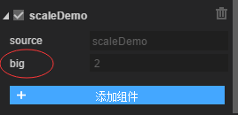

# 组件化开发

## 组件化开发的思想

很多项目的 **耦合性比较高**，后期改造、维护难度比较大，如果项目 **使用“组件化开发”** 这种模式，可以对项目进行很大程度上的 **解耦**，也就降低了维护项目的难度和成本。“组件化开发”的 **核心思想是尽可能将业务逻辑模块化**，将逻辑都写在脚本里，然后将脚本和组件关联起来，使用组件时对应的脚本就会运行。

## “组件化开发”中的组件

在[3.组件库的介绍](./3.组件库的介绍.md)这篇里介绍过组件库，也提到过功能类组件，这些都是“组件化开发”中的组件，可以整体的分为这样几类：  
  
该图片地址：[https://www.processon.com/mindmap/5f58fba0e401fd60bdeb855b](https://www.processon.com/mindmap/5f58fba0e401fd60bdeb855b)

- **节点类组件(Node)**：2D 基础组件（Animation\HTMLDivElement\Sprite\Text）、基础显示组件（Button\Image\Label 等）、容器组件（Box\List\Panel 等）、视图组件（Scene\View\Dialog）；
- **绘图类组件(Graphics)**：矢量图（Circle\Curves\Line 等）、纹理（Texture\FillTexture）和文本（FillText）；
- **功能类组件(Component)**：组件（脚本组件、物理组件等）、泛组件（滤镜组件，类似 Component）。

## 组件化开发的方式

组件有自己的 **生命周期**，在对应的生命周期函数里可以执行一些游戏逻辑，如果 **将一个脚本继承自组件**，然后在脚本里 **重写组件的生命周期函数并写上相应的游戏逻辑** ，这样的开发方式叫做 **runTime 脚本进行组件化开发**。

如果不使用 runtime 方式，可以 **给组件挂载一个 script 脚本（不继承自组件，是挂载的方式）**，该脚本 **也有自己的生命周期** 并与组件的生命周期是 **息息相关的**，这种开发方式叫做 **script 脚本进行组件化开发**。

两种方式的差异和应用会在最后一小节[“两种方式的区别和应用场景”](./5.组件化开发.md#两种方式的区别和应用场景)里讲述。

## script 脚本开发流程

### script 脚本挂载到组件上

其实在上一个章节就提到过怎么将 script 脚本添加到组件上了，这里梳理一下：

- 准备好 **目标组件** ，然后在项目的 src/script 目录下新建一个脚本，使用的是 ts 语言，那脚本就是 xxx.ts 之类的；
- 将脚本拖拽到层级面板中的 **目标组件节点下** 或者直接拖拽到 **目标组件的属性面板里**，这样 script 脚本就挂载到组件上了；
- 除了拖拽的方法外，还可以在目标组件的 **属性面板** 最下方点击 **“添加组件”**，选择“Code”再选择对应的脚本即可。


### 编写 script 脚本

比如在组件激活时（onEnable）将图片放大至两倍，最基本的脚本写法：

```ts
export default class scaleDemo extends Laya.Script {
  public img: Laya.Image;
  constructor() {
    super();
  }
  // UI组件的赋值最好在onEnable里编写，别在构造函数里写，因为组件可能还没有激活
  onEnable() {
    // script脚本化开发，获取本组件是通过this.owner来获取的
    this.img = this.owner as Laya.Image;
    this.img.scaleX = 2;
    this.img.scaleY = 2;
  }
  onDisable() {}
}
```

### script 脚本属性在 IDE 里可视化

1)可以将 script 脚本中的属性在 IDE 中显示出来，示例如下

```ts
/** @prop {name:big,tips:"放大",type:int,default:2} */
public big: number = 2;
```



2)定义属性常用的字段解释：

- **name**：属性在 IDE 中展示的名字；
- **tips**：在 IDE 里将鼠标悬浮到属性上时，会展示一个 tips 提示；
- **default**：属性在 IDE 中展示的默认值，在 **script 脚本中也要给变量赋值这个默认值**，否则可能会发生一些错误或者达不到效果；
- **type**：属性在 IDE 里的数据类型，**Number、Int（ts 对应 number）、String、Boolean（布尔类型，ts 对应 boolean）、Color（颜色，ts 对应 string）、Vec（数组，ts 对应 number\[]）、Vector（动态数组，ts 对应 any[]）、Option（下拉框，ts 对应 string）、EditOption（可编辑下拉框但不能定义默认值，ts 对应 string）、Ease（缓动类型，ts 对应 string）、sNumber（数字滑动条，ts 对应 number）、Prefab（预制体，代码对应 Laya.Prefab）、Node（节点，代码对应 Laya.xxx）、Nodes（对节点，代码是 Laya.xxx 的数组形式）** 等等；
- **accept 和 acceptTypes**：当 **type 为 string** 时，可以使用 **accept 和 acceptTypes** 来具体约束这个 string；比如 accept 可以是 **res、files**，意思是属性的类型要是 **资源路径、文件路径**，acceptTypes 可以是 **"png,jpg"**，意思是路径后缀必须是 **png、jpg**
- **option**：当 **type 为 Option** 时，option 用来存放 **下拉框所有选项**；
- **min 和 max**：当 **sNumber** 时，min 和 max 就是 **滑动条的上下限**；

PS：预制体在 script 脚本中使用，**this.prefab.create()或者 this.prefab.json.props.texture**

### 重写声明周期函数

Laya.Script 有自己的生命周期函数，script 脚本继承自 Laya.Script，重写对应的生命周期函数，并在其中编写控制组件的逻辑代码

```ts
export default class scaleDemo extends Laya.Script {
  /** @prop {name:big,tips:"放大",type:int,default:2} */
  public big: number = 2;
  /** @prop {name:small,tips:"缩小",type:number,default:0.5} */
  public small: number = 0.5;
  public img: Laya.Image;
  constructor() {
    super();
  }
  // UI组件的赋值最好在onEnable里编写，别在构造函数里写，因为组件可能还没有激活
  onEnable() {
    // script脚本化开发，获取本组件是通过this.owner来获取的
    this.img = this.owner as Laya.Image;
  }
  // 键盘按下
  onKeyDown() {
    this.img.scaleX = this.small;
    this.img.scaleY = this.small;
  }
  // 每帧更新
  onUpdate() {
    // 旋转
    this.img.rotation++;
  }
  // 鼠标按下
  onMouseDown() {
    // 按住拖住
    this.img.startDrag();
  }
  // 在舞台上点击
  onStageClick() {
    this.img.scaleX = this.big;
    this.img.scaleY = this.big;
  }
  onDisable() {}
}
```

### 了解整个生命周期

1)script 脚本的生命周期：  
  
script 脚本除了生命周期函数以外，还有一些鼠标点击、键盘和碰撞等事件，当然也不止这些事件，可以去[laya.components.Script](http://layaair2.ldc2.layabox.com/api2/Chinese/index.html?category=Core&class=laya.components.Script)这个 API 里查看事件。

2)runtime 脚本的生命周期，也是节点 or 组件的生命周期：  


- **创建节点**：会先创建节点的 **script 脚本（执行 script 脚本的构造函数）**，再创建节点的 **子节点（执行子节点的构造函数）**，这样就完成了一个节点的创建；
- **addToStage**：先激活 **script 脚本（执行 script 脚本的 onAwake 函数再执行 onEnable 函数）**，再激活 **子节点（执行子节点的 onAwake 函数再执行 onEnable 函数）**，完成这两步之后才激活 **节点本身（执行节点本身的 onAwake 函数再执行 onEnable 函数）**；
- **removeFromStage**：先禁用 **script 脚本（执行 script 脚本的 onDisable 函数）**，再禁用 **子节点（执行子节点的 onDisable 函数）**，完成这两步之后才禁用 **节点本身（执行节点本身的 onDisable 函数）**；
- **destroy**：会先判断节点是否已经禁用了，没有禁用的先禁用（removeFromStage）；然后会去销毁 **script 脚本（执行 script 脚本的 onDestroy 函数）**，再去销毁 **子节点（执行子节点的 onDestroy 函数）**，完成这两步之后才销毁 **节点本身（执行节点本身的 onDestroy 函数）**。

也就是说 **runtime 脚本的生命周期函数只有四个：onAwake（激活）、onEnable（启用）、onDisable（禁用）、onDestroy（销毁）**，而 **script 脚本不止四个并且还带有鼠标、键盘、碰撞事件**。

## runtime 脚本开发流程

### 关联 runtime 脚本

直接将 runtime 脚本拖拽到组件的 runtime 属性里，或者直接在 runtime 属性里输入 runtime 脚本的路径。  


### 编写 runtime 脚本

编写 runtime 脚本需要注意的是

- runtime 脚本生命周期函数只有四个：**onAwake（激活）、onEnable（启用）、onDisable（禁用）、onDestroy（销毁）**
- 没有 script 脚本的 **属性可视化**，因为本来就是继承自组件，不需要可视化

```ts
export default class ListUI extends Laya.Dialog {
  constructor() {
    super();
  }
  onEnable(): void {
    //模拟数据结构
    let arr = [
      {
        top: { value: "1" },
        name: { text: "玩家名字1", fontSize: 30 },
        score: { text: "100" },
      },
      {
        top: { value: "2" },
        name: { text: "玩家名字2", fontSize: 30 },
        score: { text: "90" },
      },
      {
        top: { value: "3" },
        name: { text: "玩家名字3", fontSize: 30 },
        score: { text: "80" },
      },
    ];

    let _list = this.getChildByName("_list") as Laya.List;
    _list.array = arr;

    //刷新List
    _list.refresh();
  }
  onDisable(): void {}
}
```

### 发布模式对 runtime 脚本的影响

之前在[2.IDE 的使用#项目设置](./2.IDE的使用.md#项目设置)里提到过“场景的发布模式”，这里简单做一个总结：

- **“内嵌模式”** 生成了场景类并将 UI 数据内嵌到类里，使用方便但是代码包体积大；
- **“加载模式”** 也生成场景类但将所有 UI 数据放到一个 UI.json 里（UI 数据从类里分离出来了），减少了代码包体积但需要提前加载大的 UI.json；
- 小游戏问世前常使用“内嵌模式”和“加载模式”，后来常使用“分离模式”和“文件模式”。
- **“分离模式”** 也生成场景类但每个场景的 UI 数据有单独的场景数据文件，并且引擎是自动加载场景对应的场景数据文件；
- **“文件模式”** 没有生成场景类（所以不能使用 var 要使用 getchild 操作子节点），只有场景数据文件并通过 Scene.load 来加载使用，大大减少了代码包体积。
- 建议是 **将项目设置的发布模式设置为“文件模式”**，如果某个场景的 **层级复杂、操作频繁并使用了 runtime 脚本**，getchild 会很麻烦且效率低，那么可以 **单独将这个场景的发布模式设置为“分离模式”**，这样就可以使用 var 了；也就是绝大多数的场景使用“文件模式”，个别使用“分离模式”。

## 两种方式的区别和应用场景

### 区别

- runtime 脚本是 **直接继承自组件** ，本组件直接就是 this，其子节点获取方式是 **getChildByName** 或者 **分离模式下搭配 var** ；
- script 脚本是 **继承自 Laya.Script**，本组件是 **this.owner** ，其子节点获取方式是 **getChildByName** 或者使用 **定义属性可视化来绑定子节点**（type 设置为 Node，将子节点拖拽到该自定义属性里）；
- 如果两种方式不考虑其他而都使用 getChildByName 来获取子节点，由于 script 脚本多一层 owner，会导致效率会低一些；
- 对比两种方式的生命周期图，会发现 **script 脚本的生命周期函数更多并且还自带鼠标、键盘和碰撞的方法**，而 **runtime 脚本的生命周期函数只有四个：onAwake（激活）、onEnable（启用）、onDisable（禁用）、onDestroy（销毁）**。

### 应用场景

- 像一些主场景、大的页面 UI 这样的，可能需要频繁地访问页面内多个元素（多为显示隐藏等类似简单逻辑），这样的应用场景下可以使用 runtime 脚本；
- 如果主场景、大的页面 UI 里涉及到的业务很多且很复杂，像 runtime 脚本的四个生命周期函数和 this.on 复杂绑定方式满足不了开发需求，可以使用 script 脚本；当然，UI 中具体的节点也会涉及到一些逻辑，这样的建议使用 script 脚本挂载。
- 也就是说，像控制显示隐藏这样的简单逻辑的使用 runtime 脚本就足够了，更多地是涉及到复杂业务逻辑就使用 script 脚本（例如游戏总控制、角色控制等）。


