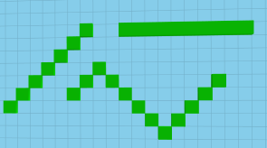
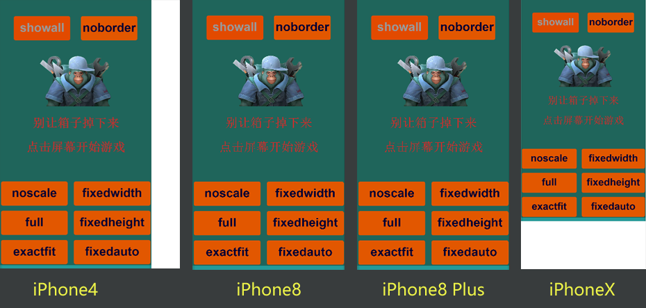

# 屏幕适配与抗锯齿

> 引擎官方讲解更为详细——[《一篇了解 LayaAir 的屏幕适配，及有效抗锯齿》](http://ldc2.layabox.com/doc/?nav=zh-ts-1-8-0)

## 屏幕分辨率

### 物理分辨率

**物理分辨率**：**硬件** 屏幕上实际拥有的像素(**物理像素、设备像素**)以行数乘以列数表示的一种参数，又叫做“设备分辨率”。  
例如手机售卖时标注的屏幕分辨率 1334 × 750 这种参数。

### 逻辑分辨率

**逻辑分辨率**：**软件** 里使用的分辨率（**逻辑像素、CSS 像素**），也是“行”乘以“列”的形式。  
不同的软件程序有不同的逻辑像素，例如在 web 里就是 CSS 像素。

### 缩放因子

早期一个逻辑像素对应一个物理像素，在后来屏幕显示技术得到提升，**同样尺寸屏幕** 其物理分辨率是以前的几倍，如果还是一个逻辑像素对应一个物理像素的话，显示出的图片会变小，要让显示的图片大小不变，那么一个逻辑像素要对应多个物理像素，也就是需要一个参数来维持物理分辨率和逻辑分辨率的转换关系，这个参数就是 **缩放因子**，写法：**@2X、@3X** ，转换关系： **物理分辨率=逻辑分辨率 × 缩放因子** 。

为什么不同样也提升逻辑分辨率，因为软件显示图片（绘制图片）的 API 使用的单位是不会随意变化的（因为有些屏幕还是老样子），也就是逻辑分辨率是不会改变的。


## 屏幕适配基本概念

### DPR

手机应用常使用 **缩放因子** ，对应在浏览器（Web 页面）里是 **设备像素比** (Device Pixel Ratio，简称 **DPR** )，也就是物理像素与逻辑像素之间的比率；LayaAir 引擎中通过 **Laya.Browser.pixelRatio** 可以获得浏览器的 DPR 值。

在浏览器里用户可以按住 Ctrl 然后使用鼠标滚轮来缩放页面（手机是双指扩张），这种并非是由 DPR 值来决定页面缩放，但在 H5 游戏中是不允许这样操作的并且还要通过逻辑分辨率来适配（获取当前机型的 DPR，决定一个逻辑像素占用几个物理像素），所以要给页面进行一个限制：  
  
通过上面这段 viewpot 的配置，那页面在禁止用户手动缩放的同时，也会按设备的 DPR 进行自动缩放。

### 物理宽高、逻辑宽高

**物理宽高**：物理分辨率的宽和高上各有多少个物理像素(px)，也叫设备宽高 or 屏幕宽高；引擎获取物理宽高 Laya.Browser.width、Laya.Browser.height

**逻辑宽高**：逻辑分辨的宽和高上各有多少个逻辑像素(pt)；引擎获取逻辑宽高 Laya.Browser.clientWidth、Laya.Browser.clientHeight


**说明**：引擎中的 **逻辑宽高** 其实是封装了浏览器的 **clientWidth 和 clientHeight**，然后 **物理宽高** 是通过 **逻辑宽高 ×DPR** 计算出来的；但是像 iPhone 8 Plus 这种机型比较特殊，算出来跟实际上的还是有区别的（实际是 2.6 的比率）。

### 设计宽高

**设计宽高**：开发者在设计产品时采用的宽高，常采用 750×1334，也就是 iPhone6 7 8 的物理分辨率

**怎么选择设计宽高**：

- 设计宽高 **采用的是物理分辨率**，因为 Web 最基础的像素单位还是物理像素点 px；
- 设计宽高 **常选择 750×1334**，首先要去掉 **过时** 的机型例如 iphone4 这种，然后再看 **分辨率宽高比**，大概分为 **1:1.78 的非全面屏机** 和 **1:2.17 全面屏机**，其他机型也比较接近这两种；其次看 **性能**，因为像素太多引擎性能会低一些，所以选择 1:1.78 的；最后去掉了 **Plus 特殊机型**，再选择 **稍流行** 的机型，那就是 750×1334 了。（目前推荐是 750×1334，如果 750×1334 完全过时了，估计就会选择设计宽高大一点的了）

设置设计宽高的方式：  


### 画布宽高、舞台宽高

**画布宽高**：画布（\<canvas\>）是 Laya 引擎绘制的基础，好比是画画的纸；画布有 width、heigth 两个属性，也就是 **画布宽高** 。

画布宽高的值对画面最终的 **清晰度以及性能** 都会产生影响，甚至 **边缘锯齿或画面模糊** 也与画布宽高值有关。  
在 noscale、exactfit、noborder 这几个适配模式下 **画布宽高会直接采用设计宽高值**，而其它适配模式下，会根据适配规则产生变化。

查看画布宽高的方式：  


**舞台宽高**：基于 Laya 引擎开发的所有可见元素都是 **添加到舞台(stage)上** 才能被显示的；舞台是显示列表的 **根节点**，也是最顶级的父容器；它也有 width、heigth 两个属性，也就是 **舞台宽高** 。

舞台宽高的变化 **并不会影响到画面显示的大小**，但 stage 范围内，可以控制 **显示**，可以进行 **事件监听**，**碰撞检测** 等。  
像 full、fixedwidth、fixedheight、fixedauto 这些适配模式可以做到 **Stage 全覆盖**。

**画布与舞台的关系**：
画布处于最底层，舞台一定是在画布内显示的，也就是说画布宽高必须 **大于或等于舞台的宽高**；  
如果舞台的宽高超出了画布的宽高，即使舞台上有显示内容也会 **被裁切掉无法显示**。

## 抗锯齿

### 锯齿产生的原因

图象是像素点按照行与列的矩阵这样的方式展示的，假如基于单个像素点画横着或竖着的直线，可以看到它比较平整，而画斜线或者曲线，会看到它并不平整像锯齿一样；在屏幕适配时难免不会进行缩放操作，这样会使得一些画面模糊也就是锯齿感比较强烈。  


### 引擎内置的抗锯齿

init()前，设置 **Config.isAntialias=true;** 这样就可以把一些边缘的锯齿模糊掉（弱化），在高分辨率的机器上基本就看不到这样的锯齿了，在低分辨率可能还会看到；  
在 2D 上是默认关闭这个设置的，除非使用了很多矢量图（尽量别用因为性能不好），可以开启这个设置，3D 是默认开启的。  


### 抗锯齿失效的原因

3D 虽然默认是开启 isAntialias 这样的抗锯齿功能，但有些情况下发现抗锯齿功能没有生效。通常有两个原因：

- Camera 从 Unity 导出时不小心勾选了 HDR，如果不想重新导出 Camera 可以在 Laya 引擎里关闭 HDR，如下图  
  
- 后期处理管线的 BloomEffect 泛光效果  
  

### 如何设置最佳画布

引擎的抗锯齿功能只是通过一些算法，让边缘过渡的更平滑，从而减轻锯齿现象，在一些像素密度比较大的屏幕上，让肉眼难以识别，并非真的让锯齿消失。

在屏幕适配时，总会有机型不满足，所以会拉伸缩放一些 UI，这就会导致 **锯齿感的加剧**，使得开启了抗锯齿功能也无法完全抵消这些锯齿，所以要考虑让画 **一直处于物理分辨率的大小**（画布 **最佳高清状态** ）。

1. 让画布处于最佳高清有两种方式：

   - **full 屏幕适配模式** ，该模式会无视设计宽高的配置，直接采用物理分辨率作为画布宽高；
   - 使用 **视网膜画布模式** ，视网膜画布模式开启后，无论采用什么适配模式，都会强制将画布设置为当前机型的物理分辨率大小。

2. 如何开启“视网膜画布模式”？有两种设置方式：

   - 在初始化舞台 init()前添加一行配置代码

   ```js
   Config.useRetinalCanvas = true;
   ```

   - 如果想动态控制视网膜画布模式的开和关，也可以用另一种设置模式，在 init()后添加配置代码

   ```js
   Laya.stage.useRetinalCanvas = true;
   ```

3. 动态控制“视网膜画布模式”的开启和关闭
   如果不是在 init()的同一帧内使用 useRetinalCanvas 模式配置的，要先修改 **scaleMode、width、height、alignH、alignV** 中任意一个的值，可以触发引擎的 **setScreenSize** 方法，这样才会 **让 Laya.stage.useRetinalCanvas 的修改生效**。

   ```js
   if (condition) {
     Laya.stage.useRetinalCanvas = false;
   } else {
     Laya.stage.useRetinalCanvas = true;
   }
   Laya.stage.alignH = "left";
   ```

4. 开启“视网膜画布模式”的利弊

   > 理论上讲，开启视网膜画布模式，在超出设计宽高的机型上，会产生更多的性能消耗。因为画布上的像素越多，性能消耗越大。所以很多 2D 游戏，都会采用相对小一些的分辨率作为游戏设计宽高。
   >
   > 但从实际应用来讲，物理宽高所带来的性能压力也并没有那么多风险。要知道，一些小游戏平台是强制要求必须物理分辨率的。因此，LayaAirIDE 在导出 QQ，vivo、OPPO、支付宝小游戏平台版本的时候，会强行开启视网膜画布模式（useRetinalCanvas）。在微信小游戏中，有的适配模式，如果不采用视网膜画布模式，那游戏画面布局效果将会与浏览器中表现不一样。
   >
   > 另外，开启视网膜画布模式，除了能解决一些小游戏平台中的问题，以及可以减轻锯齿现象外，其实还可以让适配变的更简单。因为不使用视网膜画布模式，还想避免锯齿现象，移动端只能使用 full 模式，而 full 模式除了让画布和舞台采用了物理分辨率之外，并没有作任何适配，所以对于 2D UI，全部需要开发者手工适配。
   >
   > 所以，建议开启视网膜画布模式，尤其是 3D 游戏。如果考虑某些机型的性能压力，开发者可以在存在压力的机型，或者有性能压力的功能上，通过逻辑控制，动态开启或关闭视网膜画布模式。

## 理解适配基础

### 对 UI 场景的设置

**UI 场景**：一个游戏在各种情况下显示的场景（主页大厅、战斗场景），一般使用视图类组件中的 Scene 组件来实现的。

游戏场景肯定是要铺满引擎画布或者舞台的（不铺满会留下黑边或白边等），那就在 **创建 UI 场景时让它的宽高与设计宽高（F9 项目设置）保持一致** 。

而设计宽高采用 750×1334 的物理分辨率，对其他不同物理分辨率机型肯定是要适配的，可以通过 Laya 引擎 **对画布或舞台** 进行 **缩放、对齐、旋转** 等一系列方式从而达到屏幕的全屏适配。

### 缩放画布和舞台

要想占满全屏最基本的策略就是 **缩放**，对画布或者舞台进行缩放；  
对画布的缩放，会改变整个场景 UI 中的 **所有可见内容的大小**，并会导致 **画面出现模糊的现象（拉伸式的缩放）**，所以对画布的缩放一般是将画布设置成 **最佳高清状态（视网膜画布模式）**，这样就不会使画面模糊了；  
而对舞台的缩放不会影响到画面显示大小，但会影响到可绘制区域和事件响应区域；屏幕适配主要考虑的是缩放舞台，因为画布一般都是开启了“视网膜画布模式”。

## 最容易理解的适配模式

### 默认的不缩放模式 noscale

引擎默认的适配模式是“**不缩放模式 noscale**”，该模式不会缩放画布和舞台（UI 场景当然也没有缩放），它们仍然是设计宽高的大小 750×1334，这种适配模式下的舞台在 iphone5 这样的机型上会被裁剪，而在 iphone6 7 8 这些机型上刚好占满，在全面屏 iphoneX 11 会多出 **白色** 底边来（屏幕的颜色）。  


如果使用 noscale 模式，在 iphone X 这个机型上屏幕大小是 1125×2436，此时画布和舞台没有缩放仍是 750×1334，并处于屏幕的左上角，如果需要让画布处于屏幕的正中央，可以在项目设置 F9 里让“垂直对齐模式”选择 middle，“水平对齐模式”选择 center，这种就叫做 **“画布对齐方式”**。

### 物理分辨率画布模式 full

“**物理分辨率画布模式 full**”也不缩放画布和舞台，但会让这两个始终等于当前机型的物理分辨率大小，也就是说屏幕、画布和舞台始终都一样大；但是 UI 场景还是按照设计宽高 750×1334 这样开发的，那么 UI 场景在 iphone5 这样的机型上会被裁剪，而在 iphone6 7 8 这些机型上刚好占满，在全面屏 iphoneX 11 会多出 **黑色** 底边来（画布的颜色）。  


如果使用 full 模式，可以对舞台里的 UI 场景进行 **相对布局** （这意味着放弃了设计宽高）；将 UI 场景 **由 Scene 改为 View（添加 Widget 组件也可）**，再让 UI 场景的 **left、right、top 和 bottom 设置为 0 或者合适的数值**，这样的话就可以在不同物理分辨的机型上达到 **占满全屏** 的效果。

**注意**：noscale 模式下开启“视网膜画布模式”，与 full 模式视觉效果上一样，不同的是 noscale 模式舞台没有那么大，所以 noscale 模式 **舞台外面的区域无法接受事件**，full 模式的舞台和画布一样大，事件一直能接受到。

### 强行拉伸全屏模式 exactfit

“**强行拉伸全屏模式 exactfit**”，对画布和舞台都进行了非等比缩放，显示前画布和舞台还是设计宽高的大小 750×1334，只是在显示出来的时候强行拉伸或者挤压至全屏（非等比缩放），在各种机型上都可以，不会留出底边。  


## 移动端推荐的屏幕适配模式

移动端里可以按照宽或者高来对画布舞台进行的等比缩放，不会像 exactfit 模式一样就是强制非等比的缩放。

### 保宽全屏模式 fixedwidth

“**保宽全屏模式 fixedwidth**”，首先保证画布和舞台的 **宽度不变**(750)，然后按照“**设备宽/画布宽**”算出 **比例**，再用“**设备高/比例**”算出画布 **最终** 高度，让画布和舞台的高度设置成这个值（例如 iphone X 算出来的是 1624，那就得让原先的 1334 变为 1624），在显示时将 **最终的画布宽高按照比例缩放**，刚好是占满全屏的；但是 UI 场景还是按照设计宽高 750×1334 这样开发的，那么 UI 场景在 iphone5 这样的机型上的 **上下两边** 会被裁剪，而在 iphone6 7 8 这些机型上刚好占满，在全面屏 iphoneX 11 的 **上下两边** 会多出 **黑色** 底边来（画布的颜色，**因为画布是加长了再等比缩放的**）。  


在 iPhone X 上使用 **fixedwidth** 模式：设备宽高是 1125×2436，画布和舞台宽 **保持 750 不变**，1125/750=1.5，2436/1.5=1624，那么画布和舞台 **最终** 宽高是 **750×1624** （其实 UI 的高没有跟着变化，但后面会跟着画布等比缩放），显示时按照 1.5 的比例将画布和舞台缩放至 1125×2436，但 UI 之前还是 750×1334，**UI 跟着画布等比缩放后**，在页面上明显会看到上下两边留出黑色底边了，那就需要对 UI 的上下进行相对布局了。

### 保高全屏模式 fixedheight

“**保高全屏模式 fixedheight**”，跟 fixedwidth 原理一样，就是要优先保证高度不变。

### 保宽高全屏模式 fixedauto

“**保宽高全屏模式 fixedauto**”，其实采用的就是 fixedwidth 或者 fixedheight，有一个选择规则，如果 **物理宽高比** 小于 **设计宽高比** 的话采用 fixedwidth 模式，否则就采用 fixedheight，其实就是 **永远不会** 让 UI 被裁剪会一直留出 **黑边（画布）**，然后让 UI 进行相对布局。

fixedxxx 模式下留出的黑边怎么解决？  
开发人员要 **尽可能** 将各种机型在 fixedxxx 模式下的 **最终** 的设计宽高（例如 750×1624 这种数据）计算出来，然后从中选择一个可以 **尽可能覆盖所有情况** 的宽高，将这个宽高提供给美术让他们设计一个背景图，这个背景图就可以遮住 fixedxxx 模式多出的 **黑边**，背景解决了再让 UI 进行一些适配（比如 **相对布局**），这样就完成了移动端的适配了。  
如果是纯色的背景直接动态改变它的大小或者用相同颜色的背景进行拼接。

## 其他适配模式

### 肯定不被裁切的等比缩放模式 showall

“**肯定不被裁切的等比缩放模式 showall**”，它会取“**设备高/设计高**”和“**设备宽/设计宽**”这两者中的 **最小值** 作为比例，让画布和舞台的当前宽高也就是 750×1334 按照这个比例进行等比缩放；缩放后与当前设备宽高比，肯定有一边会留出白边（屏幕），但肯定不会被裁切。  


showall 模式做不到手机全屏适配，所以通常不会被用到手机适配上， 在 PC 浏览器运行的横屏页游，可以使用该模式。  
showall 模式由于画布宽高已经进行了缩放改变，本身就是高清的适配模式，所以这种模式无需使用视网膜画布模式（useRetinalCanvas），用了之后画布采用了物理分辨率，反而不好。

### 肯定不留黑边的等比缩放模式 noborder

“**肯定不留黑边的等比缩放模式 noborder**”，它会取“**设备高/设计高**”和“**设备宽/设计宽**”这两者中的 **最大值** 作为比例，让画布和舞台的当前宽高也就是 750×1334 按照这个比例进行等比缩放；缩放后与当前设备宽高比，肯定有一边会被裁切，但肯定不会留黑边。  


虽然说该模式，通过相对布局二次适配，也可以让被裁剪的按钮等回归到屏幕内容之中，但二次适配的方式要更加复杂。所以不推荐使用该模式。

## 屏幕适配总结

屏幕的适配方案其实可以归结于这几种：不缩放的、非等比缩放的、等比缩放的（缩放前画布改不改变）

### 不缩放

noscale 和 full 对画布和舞台都没有进行缩放，要么是保持原样的(noscale)但是高清屏里会留 **巨大的白边**（小屏会被裁剪），要么是直接等于设备宽高(full)但是 UI 场景没有改变会留 **巨大的黑边**（小屏会被裁剪）。  
留出巨大的白边或者黑边就是因为 **UI 场景没有跟着** 画布和舞台进行缩放，所以适配都 **不会使用这两种模式** ，因为还需要自己对 UI 场景进行大量适配更改。

PS：一定要理解 full 的是直接设置画布的宽高，并 **不是缩放** 到设备宽高，UI 场景 **根本就没有变化**（单纯改变画布宽高影响不到 UI 场景，除非是对画布缩放）。

### 非等比缩放

exactfit 非等比缩放是一种 **粗暴** 的方式，直接将设计宽高 **缩放** 至设备宽高，它不会留边但是会 **拉伸页面**，因为 UI 也跟着非等比缩放了，画面已经 **变形** 了，所以适配也 **不会使用这种模式**（除非跟别的方案搭配使用）。

### 等比缩放前不对画布进行变换

在高清屏上，设计宽高和设备宽高是不成等比的，缩放前 **不对画布进行处理**，直接按照 **设备宽高比** 进行缩放，缩放后要么留出 **白边** 要么 **被裁剪**；具体就分为 showall“展示了全部画布但画布还是比屏幕小（留白边了）”、noborder“不会留白边因为画布超过屏幕区域了”，**这两种基本也不会用（PC 端可以用 showall）**。

### 等比缩放前对画布进行变换

在高清屏上，设计宽高和设备宽高是不成等比的，可以提前将画布宽高比 **强制改变成和设备宽高比一样的**，后面就可以进行等比缩放了；这样就需要对画布的宽或高进行 **增大** 或者 **减小**，具体就分为：fixedwidth“保宽去增大或减小画布高”、fixedheight“保高去增大或减小画布宽”、fixedauto“增大画布其中的一边”。**移动端比较适合使用 fixedxxx，UI 场景占不满画布或者被裁剪，可以使用相对布局解决**。

PS：这里的“增大”、“减小”是缩放前改变画布大小（UI 场景大小没变），“缩放”是通过 tansform 的 matrix 对画布舞台进行缩放变换的（UI 场景跟着缩放了）。

### 另类的 fixedauto

fixedauto 是“增大画布其中的一边”，那么可不可以使用“**减小画布其中的一边**”这种方式来处理缩放前的画布呢？
当然也是可以的，很多游戏采用 fixedauto 或者这种 **另类的 fixedauto** 来适配的。

**另类的 fixedauto** ：“物理宽高比” **大于** “设计宽高比”的话，采用 fixedwidth 模式，否则就采用 fixedheight。

像 fixedauto 这些模式的逻辑是 **在 Laya 内部实现的**，而另类的 fixedauto 就 **需要自己实现** 了，在 init()前先采用“**减小画布其中的一边**”来处理画布，让它的 **最终的宽高** 与设备宽高形成等比的关系，最后再搭配引擎的 **exactfit 适配模式** 就可以进行等比缩放了。

大概实现：
先设置“F9 项目设置”里的设计宽高，一般是 750×1334

```js
let desginW = GameConfig.width; // “F9项目设置”里的设计宽高
let desginH = GameConfig.height; // “F9项目设置”里的设计宽高
const bw = Browser.width; // 设备宽高
const bh = Browser.height; // 设备宽高
if (bw / bh > desginW / desginH) {
  desginH = bh * (desginW / bw); // 等比转换关系
} else {
  desginW = bw * (desginH / bh); // 等比转换关系
}
// 另类的fixedauto在如果正常流程下，最后UI肯定是被裁剪，那么这里提前算出UI该缩放的值，
// 最后手动让UI去缩放到这个值，就可以让UI都处于画布内，但是处理完后还是需要对UI进行相对布局（也可以不缩放UI直接相对布局）
const UIScale = Math.min(desginH / GameConfig.height, desginW / GameConfig.width);
// 引擎初始化
Laya.init(GameConfig.width, GameConfig.height, WebGL);
// 引擎使用exactfit适配模式
Laya.stage.scaleMode = "exactfit";
// 后续的onResize里最好也要重新计算一下desginH和desginW对GameConfig进行重新赋值，这是为了PC端
```

## 刘海屏的适配

使用 **Browser.clientHeight / Browser.clientWidth > 2** （逻辑高/逻辑宽）可以识别识别全面屏或刘海屏，然后对一些 UI 使用 **相对布局** 去处理

## 自动横竖屏

[横竖屏官方讲解](https://ldc2.layabox.com/doc/?nav=zh-ts-1-8-2)

### 检测手机屏幕状态

使用 **Laya.Browser.height / Laya.Browser.width > 1** （物理高/物理宽）可以监测手机屏幕状态，大于 1 是竖屏，小于 1 是横屏。

laya.display.Stage 中有个 screenMode 属性，有三个值："none"不更改屏幕、"horizontal" 自动横屏、"vertical" ：自动竖屏。

### 不更改屏幕 none

默认值 none 或者不设置 screenMode 属性时，游戏的水平方向一直跟浏览器水平方向保持一致（浏览器旋转游戏跟着旋转）（适合）。

### 自动横屏 horizontal

如果 screenMode 属性值设置为 horizontal 时，无论屏幕方向如何旋转，游戏的水平方向都会与屏幕最短的边始终保持垂直（适合传奇类横屏游戏）。

横屏游戏的输入法：屏幕是竖屏的时候，游戏是横屏的，但输入法是竖屏的那就建议给输入法到顶部的距离做一个 **竖屏的背景** ，不做背景也可以给提示。

### 自动竖屏 vertical

如果 screenMode 属性值设置为 vertical 时，无论屏幕方向如何旋转，游戏的水平方向都会与屏幕较长的边始终保持垂直（适合泡泡龙竖屏游戏）。
