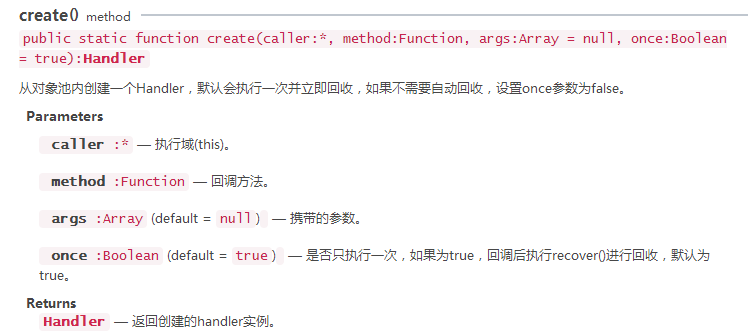

# 性能优化

## 性能统计面板

Laya 引擎内置有性能统计面板，可实时检测当前性能。在 init()后添加 **Laya.Stat.show(0,0);**代码即可以性能统计面板（参数是位置）。  


- **FPS**：每秒传输帧数(Frames Per Second)，有 FPS(Canvas)和 FPS(WebGL)两种显示，第一个值是 **FPS 帧速**，越高越好，第二个值是 **每帧渲染所消耗的时间（毫秒）**，越小越好；这两个值如果不能维持在满帧，一般是正在操作页面。
- **Sprite**：统计 **所有渲染节点（包括容器）数量**，反映了 **引擎节点遍历、数据组织和渲染的次数** 。数字 **越低越好**，在 UI 设计时尽可能减少不必要的节点以及嵌套。
- **DrawCall**：Canvas 模式下表示 **每帧的绘制次数**，包括图片、文字、矢量图；WebGL 模式下表示 **渲染提交批次**，每次准备数据并通知 GPU 渲染绘制的过程称为 1 次 DrawCall，在每 1 次 DrawCall 中除了在通知 GPU 的渲染上比较耗时之外，切换材质与 shader 也是非常耗时的操作。DrawCall 是 **越少越好**，建议开发者尽量限制在 100 之下。
- **CurMem**：WebGL 模式下表示 **内存与显存的占用**；Canvas 模式下（没显存概念）表示 **内存的占用情况**。值越低越好。
- **Shader**：WebGL 模式独有的性能指标，表示 **每帧 Shader 提交次数**，值越低越好。
- **Canvas**：只有设置[CacheAs](./7.性能优化.md#cacheas静态缓存优化)后，Canvas 才会有值，否则默认为 0/0/0。从左至右数值的意义分别为：**每帧重绘的画布数量 / 缓存类型为“normal”类型的画布数量 / 缓存类型为“bitmap”类型的画布数量**

## 内存优化

### 使用对象池优化

游戏中某类的对象 **不停创建和移除**，可以使用 **对象池** 让对象复用，这样可以减少 **新内存的分配** 还有 **垃圾回收器运行的机会（垃圾回收时也耗内存）**。

```js
// 参数1是这类对象的标识符，参数2是类；返回一个对象（没有就新建这一类的对象池，有就从对象池里取）
Laya.Pool.getItemByClass("img", Laya.Image);
// 参数1是这类对象的标识符，回收的对象
Laya.Pool.recover("img", img1);
```

如果自己实现一个对象池呢？可以使用 **Map**，key 使用类名，value 就是对象数组。

### 使用 Handler.create



分批加载资源，第一批资源加载完成，触发 Laya.Handler.create()创建的 complete 事件回调方法后 **被对象池回收**；需要加载第二批资源时，Laya.Handler.create()会首先 **在对象池中检索相同的** 回调方法处理器，这样节省了内存开销。

```js
Laya.loader.load(urls, Laya.Handler.create(this, this.onAssetLoaded));
```

但是如果要显示加载资源的进度这个时候需要格外注意，可能会这样写（只会显示一次加载进度）：

```js
Laya.loader.load(urls, Laya.Handler.create(this, this.onAssetLoaded), Laya.Handler.create(this, this.onLoading));
```

因为要持续显示加载进度，但是 Handler.create **默认执行一次就会收到对象**（只会显示一次加载进度），那么就需要 **关闭** Handler.create 的 **对象池回收**：

```js
Laya.loader.load(
  urls,
  Laya.Handler.create(this, this.onAssetLoaded),
  Laya.Handler.create(this, this.onLoading, null, false)
);

// 或者使用Handler的实例，它的实例里是没有对象回收池
Laya.loader.load(urls, Laya.Handler.create(this, this.onAssetLoaded), new Laya.Handler(this, this.onLoading));
```

### 内存释放

垃圾回收前，要确保对象所有的引用都被删除了：

```js
//创建一个Sprite实例
var sp: Laya.Sprite = new Laya.Sprite();
//将sp内部引用设置为null
sp.destroy();
```

js 垃圾回收机制只有在 **内存足够低** 时才运行，或者 **内存分配** 也会触发。

### 资源卸载

游戏会分批加载资源，有些资源就用那么一次后面就不会再用了，那么可以在使用后对其进行 **资源卸载**

```js
const assets: Array<any> = [];
assets.push("res/apes/monkey0.png");
assets.push("res/apes/monkey1.png");
for (let i = 0; i < assets.length; i++) {
  //查看log，清理前资源一直在内存中
  console.log(Laya.loader.getRes(assets[i]));
  //调用清理方法
  Laya.loader.clearRes(assets[i]);
}
```

### 关于滤镜、遮罩

如果不是动态使用滤镜、遮罩等，可以直接使用 **PS** 等工具制作图片的 **滤镜、遮罩效果**；
但是如果要在引擎中 **动态使用滤镜、遮罩，这样很耗性能**，因为它再引擎中会创建两个位图，一个用于原图的栅格化版本，一个用于生成滤镜或遮罩版本，在动态改变时两个位图会重新创建，占用内存也占用 CPU 的计算。

## 渲染优化

### 优化 Sprite

1. 减少不必要的 sprite 和层次嵌套；
2. 非可见区域对象尽量移除或设置 visible=false；
3. 可以考虑使用 panel，因为 panel 可视区域外的直接子节点不会进行渲染；
4. 尽量让 **动态内容和静态内容** 分开，容器内静态内容不会经常变化，可以对容器设置 cacheAs 属性来优化节点数或 DrawCall。

### 优化 DrawCall

1. 尽量保证同图集的图片渲染顺序是挨着的，如果不同图集交叉渲染，会增加 DrawCall 数量；
2. 尽量保证同一个面板中的所有资源用一个图集，这样能减少 DrawCall。

### 其他

1. 描边的文本会比没有描边的多调用一次绘图指令，动态的描边文本并且总字符少的可以使用[“切片组件”](./4.常用组件详解.md#切片组件)，静态的可以使用 cacheAs 降低性能消耗；
2. 文本始终只有一行，并且样式始终不变的，在内容改变时可以使用 Text.changeText

   ```js
   this.text.text = "text";
   Laya.stage.addChild(this.text);
   //后面只是更新文字内容，使用changeText能提高性能
   this.text.changeText("text changed.");
   ```

## CacheAs 静态缓存优化

### 什么是 CacheAs

设置 CacheAs 可以将显示对象 **缓存为静态图像**，当子对象发生变化时会自动重新缓存；  
建议把 **不经常变化的复杂内容** 设置 CacheAs，能极大提高渲染性能；  
设置 cacheAs 后，还可以设置 staticCache=true 以阻止自动更新缓存，同时可以手动调用 reCache 方法更新缓存。

### CacheAs 的几种缓存模式

- **“none”时**，不做任何缓存。
- **“normal”时**，Canvas 下进行画布缓存，webgl 模式下进行命令缓存；该模式性能优化中等，它能减少每帧渲染的节点数，但不会减少 DrawCall 数和 Shader 数。
- **“bitmap”时**，Canvas 下进行依然是画布缓存，webGL 模式下使用 renderTarget 缓存；renderTarget 缓存模式有 2048 大小限制，超出 2048 会额外增加内存开销；另外，不断重绘时开销也比较大，但是会减少 drawcall，渲染性能最高。

### 测试是否频繁重绘

Laya 提供的 DebugPanel 调试工具可以查看游戏重绘区，使用时在代码里增加 **DebugPanel.init();**。

[观察 UI 是否频繁重绘](./img/7.性能优化/观察UI是否频繁重绘.png)

勾选 **“显示当前 cache 重绘”** 选项或 **“显示所有重绘区域”** 选项，如果 UI 进行重绘了，重绘区域会显示出绿色框线，绿色框的左上角显示了重绘次数与重绘时间，性能统计工具的 Sprite、DrawCall 等也会发生改变。

### 如何选择缓存模式

CPU 方面：假如开启了 DebugPanel 调试工具，如果 **绿色线框频繁出现，说明 UI 在频繁的重绘**，那么 **最好不要** 用 bitmap 模式，normal 模式 **可以酌情考虑**。因为缓存位图时子对象一旦发生改变，那么引擎会自动重新缓存位图，缓存位图的过程会消耗 CPU。

可以把 UI 进行 **分层管理**，频繁更新的为一层（不使用 cacheAs），不频繁更新的为一层（使用 cacheAs），这种方法也能提高性能。

内存方面：bitmap 模式会比 normal 模式 **多占用一些内存**，但只要 UI 的宽高不是很大，bitmap 模式多占用的内存 **也不会太大**。

### 低端机型的配置因素

对于一些低端机来说，CPU 与内存不高，如果为了提高渲染性能使用了 cacheAs，有可能就会出现问题。如果还是选择适应更多的低端机型，那就需要反复去测试，是否使用 cacheAs，还要对比 normal 与 bitmap 模式哪种更适合，在优化性能的情况下尽量减少 CPU 和内存损耗。

### 什么情况下不能使用 cacheAs

1. 当对象 **非常简单时**，比如一个字或者一个图片，设置 cacheAs 不但不提高性能，反而会损失性能。
2. 容器内有经常变化的内容，比如容器内有一个动画或者倒计时，如果再对这个容器设置 cacheAs，会损失性能

总的来说就是 cacheAs **适合不经常变化的复杂内容**，如果容器里有部分经常变化另外一部分不经常变化，可以考虑 **分层管理**。

## 减少 CPU 使用量

### 减少动态属性查找

在对象的大量属性里查找一个属性会很耗时，如果后面频繁使用这个属性的话会更耗时，那就很有必要使用 **局部变量** 来保存它:

### 计时器

Laya.timer.frameLoop 按帧执行，Laya.timer.loop 按时间执行，使用 Laya.timer.clear(this, this.xxx)可以清除其内部的 Timer。

### 对象边界

sprite 默认没有宽高，可以给它设置 autoSize，也可以直接设置 size（会使 autoSize 失效）。

当 sprite 内很复杂时，也就是显示列表比较多时，getBounds 需要计算边界，**不是适合频繁调用（特别是设置 autoSize 时）**。

但 sprite 搭配 texture 展示图片时，必须在图片加载完的回调函数里设置 size；可以直接 **使用 Texture 的宽高赋予 sprite 的宽高**，这样会很高效；此时获取宽高可以使用 getGraphicsBounds（用于获取矢量绘图宽高）。

### 根据活动状态改变帧频

Laya.stage.frameRate=Laya.Stage.FRAME_FAST;

- **Stage.FRAME_FAST**：fast 模式，最高 FPS 为 **显示器的最大帧率**，如果显示器最大帧率是 60，则最大 FPS 为 60，显示器最大帧率是 120，则最大 FPS 为 120。
- **Stage.FRAME_SLOW**：slow 模式，最高 FPS 为 **显示器最大帧率的一半**，在游戏运行的过程中，引擎会隔帧丢弃。如果实际可以达到 40 帧，那游戏最终帧率只是 20，如果帧率能达到 100，那最终帧只能是 50。
- **Stage.FRAME_MOUSE**：mouse 模式则选择性在 fast 模式与 slow 模式之间 **切换**，有时并不需要让游戏以满帧速率执行，比如 60 帧满帧的时候，30FPS 已经能够满足多数情况下人类视觉的响应，但是鼠标交互时，30FPS 可能会造成画面的不连贯，于是 Stage.FRAME_MOUSE 应运而生。

### 分批加载资源

资源 **加载后** 引擎就会开始 **处理图片等资源**，如果加载的是一张图集，会处理每张子图片，如果一次性处理大量的图片，可能会 **卡顿**；  
所以可以在游戏中 **分批加载资源**，以减少 CPU 的计算；
在资源使用后并且后面也不会再使用了，那就可以予以[卸载](./7.性能优化.md#资源卸载)，释放内存。

### 使用 callLater

callLater 使代码块延迟至本帧渲染前执行。如果当前的操作频繁改变某对象的状态，此时可以考虑使用 callLater，以减少重复计算。

```js
var rotation = 0, scale = 1, position = 0;
private setRotation(value) {
    this.rotation=value;
    update();
    // update()改为Laya.timer.callLater(this, update);
}
private setScale(value) {
    this.scale = value;
    update();
    // update()改为Laya.timer.callLater(this, update);
}
private setPosition(value) {
    this.position = value;
    update();
    // update()改为Laya.timer.callLater(this, update);
}
public update() {
    console.log('rotation: ' + this.rotation + '\tscale: ' + this.scale + '\tposition: ' + this.position);
}
```

### 使用节流器

节流器常用于限制鼠标频繁点击、滚动条滑动时去频繁调用 change 函数等场景

```js
/**
 * 节流器1：先执行再延时，“相对实时”效果最好，但是最后一次关键点触发可能会被节流掉
 * fn：执行函数
 * wait：等待时间
 */
function throttle(fn, wait) {
  let timer = null;
  return function () {
    if (!timer) {
      fn && fn.apply(this, arguments);
      timer = setTimeout(() => {
        timer = null;
      }, wait);
    }
  };
}
/**
 * 节流器2：先延时再执行，有较好的“相对实时”的效果，并且最后一次触发不会被节流掉
 * fn：执行函数
 * wait：等待时间
 */
function throttle2(fn, wait) {
  let timer = null;
  return function () {
    if (!timer) {
      timer = setTimeout(() => {
        // 这里的this和arguments就是return function这个函数的this和arguments
        //（箭头函数没有自己的this，arguments，super或new.target）
        fn && fn.apply(this, arguments);
        timer = null;
      }, wait);
    }
  };
}
/**
 * 节流器3：先延时后执行，“相对实时”的效果很差（定时器一直会被覆盖），但最后一次触发不会被节流
 * fn：执行函数
 * wait：等待时间
 */
const throttle3 = function (fn, wait) {
  let timer = null;
  return function () {
    timer && clearTimeout(timer);
    timer = setTimeout(() => {
      fn && fn.apply(this, arguments);
    }, wait);
  };
};
```

## 其它优化策略

1. 粒子属于矢量绘制，大量使用粒子对 CPU 压力大，在移动平台 **Canvas** 模式下，**尽量不用粒子**；WebGL 模式下可以采用 **GPU 运算**，能减轻 CPU 压力，但也要尽量 **控制、减少使用量**。
2. **Canvas** 模式尽量减少 **旋转、缩放、alpha 等属性** 的使用，这些属性会对性能产生消耗；如要使用，建议在 **WebGL** 模式下使用；
3. 由于 Timer 的 loop()与 frameLoop()方法里会不断的循环执行，当创建对象及复杂计算时，会导致大量的性能消耗出现在循环里，因此， **尽可能不要在循环里创建对象及复杂计算**。
4. 项目中尽量减少 try catch 的使用，**被 try catch 的函数执行会变得非常慢**。
