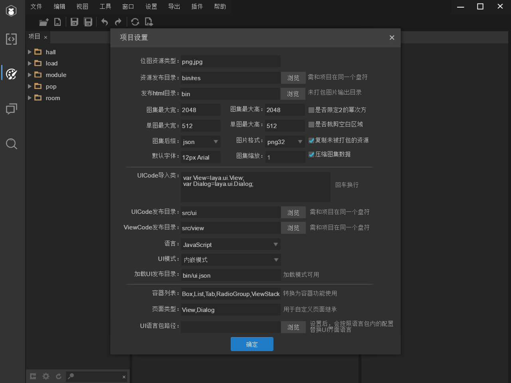

# Laya 游戏开发注意事项

## 用 LAYA 开发组件

1. 用 LayaAirIDE 打开 laya 项目，使用 UI 设计模式界面把 UI 都拼好，这些 UI 在“laya 项目/bin”里。
2. 使用“导出”“发布”将拼好的 UI 导出来，导出的东西在“laya 项目/bin”里。
3. 把“laya 项目/bin/images”里自己的文件夹放到“开发项目/build/images”里；把“laya 项目/bin/res/images”里自己的文件夹放到“开发项目/build/res/images”里。
4. 把“laya 项目/src/ui”里的 layaUI.max.all.js(要改名)放到“开发项目/build/js/ui”里。
5. (如果需要的话)在“开发项目/build/html”里的 paopao.html 和 staticHtml.html 文件里新增一行:

   ```html
   <script type="text/javascript" src="../js/ui/layaUI.max.all1.js"></script>
   ```

6. 在“开发项目/build/js/views/components”继承那些拼好的 UI，在 modules 使用这些组件。

## 代码上传到开发环境

1. 停止测试环境的运行，去 webpack.config.js 里将//filename:'../../index.html'注释放开
2. 在命令行里运行 npm run webpack-pro，进行项目的打包；如果只修改了 js，就把”开发项目/build/js/dist”里的 bundle.js 和 bundle.js.map 替换掉开发环境的对应文件
3. 如果修改了 UI，就把”开发项目/build”里的 images 和 res 替换掉开发环境的对应文件夹；还要把”开发项目/build/js/ui”里的文件替换掉开发环境的对应文件
4. 开发环境的目录是”\gameHall\www\files\game\bubble”
5. 记得把//filename:'../../index.html’注释还原

## 动画上传

1. 拿到动画资源，使用 DragonBones 打开
2. 使用快捷键 Command+E 导出
3. 导出的文件夹里会出现三个文件，xxx_ske.json、xxx_tex.json、xxx_tex.png
4. 使用 Laya IDE 打开刚刚这个导出的文件夹，使用工具“龙骨动画转换”
5. 会在这个文件夹里生成 xxx.png 和 xxx.sk
6. 将这两个文件拷贝到“开发项目/build/res/dragonBones”文件夹里
7. 代码里 createSkeleton 加载资源，再添加到 UI 里，然后定位，最后 play 播放

   ```js
   this.classicAni = Sail.Utils.createSkeleton("./res/dragonBones/classic");
   this.hallUI.btn_classic.addChild(this.classicAni);
   this.classicAni.pos(279, 147);
   this.classicAni.play("wait01", true);
   ```

## 环境上拉代码

```shell
ssh www@21.58.201.34
cd /data/httpd/wangguoxiang/wap
git branch
git pull
```

## chrome 的 devtool

微信调试工具（科学上网）chrome://inspect/#devices
如果没出现调试链接，可能是手机 USB 在电脑上的驱动有问题

## 手机端调试

本地代码使用手机浏览器打开，保证手机和电脑在同一网段（例如手机开热点给电脑），再把 package.json 改成下面这个，ip 地址自己更换一下例如 192.168.43.61
"webpack-dev-server --host 192.168.43.61 --config webpack.config.js"

## MD5 值问题

原因：后端文件编码为 UNIX，前端文件编码为 PC，生成的 MD5 不一样
根本原因：windows 下使用 git 拉取源码文件编码问题
解决方案：

1. 前端修改一下 GIT 配置 git config --global core.autocrlf false
2. gameHall 上的 index.html 有 7 个文件要单独生成 md5 值，这 7 个文件要先用 EditPlus 检查一下编码，如果编码为 PC 可以用 EditPlus 改为 UNIX 编码保存之后再生成 md5 值

## laya 项目设置



## 富文本多行下划线

```js
__proto.renderSelfToGraphic=function(graphic,gX,gY,recList){
    var cssStyle=this.style;
    var words=this._getWords();
    var i=0,len=0;
    if (words){
        len=words.length;
        var a;
        if (cssStyle){
            var font=cssStyle.font;
            var color=cssStyle.color;
            if (cssStyle.stroke){
                var stroke=cssStyle.stroke;
                stroke=parseInt(stroke);
                var strokeColor=cssStyle.strokeColor;
                graphic.fillBorderWords(words,gX,gY,font,color,strokeColor,stroke);
                }else {
                graphic.fillWords(words,gX,gY,font,color);
            }
            if (this.href){
                var lastIndex=words.length-1;
                var lastWords=words[lastIndex];
                var lineY=lastWords.y lastWords.height;
                const arr = []; // 存储每行最后一个字符的索引
                if(cssStyle.textDecoration!="none"){
                    // 超链接换行，考虑换多行的情况，开始字符和结束字符不在同一行就判定是超链接换行
                    if(words[0].y != words[words.length-1].y){
                        let index = 0;
                        let slsIndex;//secondLineStartIndex
                        while (true) {
                            while(true){
                                if (index == words.length - 1) {// 遍历到最后一个了
                                    slsIndex = index;
                                    arr.push(slsIndex);
                                    break;
                                }
                                // 每一行的最后一个字符的索引
                                if(words[index].y != words[index 1].y){
                                    slsIndex = index;
                                    arr.push(slsIndex);
                                    break;
                                }
                                index ;
                            }
                            // 它是最后一行吗
                            if (words[slsIndex].y == words[words.length - 1].y) {
                                break;
                            } else {
                                index = slsIndex 1;
                            }
                        }
                        for (let i = 0; i < arr.length; i ) {
                            let firstX = (i == 0) ? 0 : arr[i - 1] 1;// 每行最开始字符的索引
                            let firstlineY = words[firstX].y words[firstX].height;
                            graphic.drawLine(words[firstX].x,firstlineY,words[arr[i]].x words[arr[i]].width,firstlineY,color,1);
                        }
                    }else{
                        graphic.drawLine(words[0].x,lineY,lastWords.x lastWords.width,lineY,color,1);
                    }
                }
                const hitArr = [];
                var hitRec=HTMLHitRect.create();
                if (words[0].y != words[words.length - 1].y) {
                    for (let i = 0; i < arr.length; i ) {
                        let firstX = (i == 0) ? 0 : arr[i - 1] 1;// 每行最开始字符的索引
                        const hitRecNew = HTMLHitRect.create();
                        hitRecNew.rec.setTo(words[firstX].x,words[firstX].y,words[arr[i]].x words[arr[i]].width-words[firstX].x,words[firstX].height);
                        hitRecNew.href=this.href;// 每段点击区域都要加这个，否则Event.LINK解析不出参数
                        hitArr.push(hitRecNew);
                    }
                } else {
                    hitRec.rec.setTo(words[0].x,lastWords.y,lastWords.x lastWords.width-words[0].x,lastWords.height);
                }
                hitRec.href=this.href;
                recList.push(hitRec);
                for (let i = 0; i < hitArr.length; i ) {
                    recList.push(hitArr[i]);
                }
            }
        }
    }
}
```
