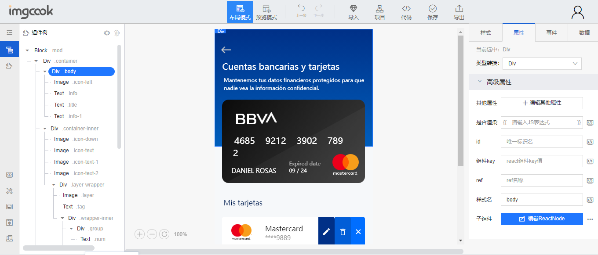

# 还原 UI 设计

UI 设计师给前端开发人员提供了 UI 设计图，前端开发人员拿这个 UI 设计图进行精细的**切图**操作。切图过程中有尺寸测量、颜色吸取、字体大小测量等，需要使用比较专业的**软件**来辅助前端开发人员进行切图操作。

## 一、Photoshop 还原 UI 设计

将一个 PSD 文件使用**Photoshop**打开，在**测量大小和距离**时，可以选择**矩形选框**和**信息面板**进行配合：

- **矩形选框**在 Photoshop 界面的左边工具栏第**二**个位置
  - 
- **信息面板**需要在**窗口-信息**里勾选上
  - 
- 然后查看**选项面板**是否使用的是**像素**。
  - 
  - 
- 我们使用**矩形选框**就可以测量距离了，距离数值会在**信息面板**里展示。如果需要微调选框，可以按住`Shift`键并点击目标就可**增大**选框，可以按住`Alt`键并点击目标就可**减小**选框。

另一种**测量大小和距离**的方式是使用**移动工具**：

- **移动工具**在 Photoshop 界面的左边工具栏第**一**个位置
  - 
- 选择了**移动工具**，我们点击一个目标（选中了图层），然后按住`Ctrl`键，移动鼠标悬停在另一个目标，就能测出它们之间的距离了。
  - 

除了测距和大小，我们可以**吸取**颜色，获得颜色的**数值**：

- **吸管**在 Photoshop 界面的左边工具栏第**七**个位置
  - 
- 使用`Ctrl`键+**鼠标滚轮**可以调整 PSD 的显示位置，`Alt`键+**鼠标滚轮**可以调整 PSD 的显示大小。便于吸取颜色。
- 使用**吸管**点击目标后，会弹出**拾色器**的窗口（如果没弹出就手动点击下图里的红色圈），里面就有目标颜色的相关数值。
  - 

文字相关信息可以在**字符面板**里进行查看：

- **字符面板**需要在**窗口-字符**里勾选上
  - 
- 先使用**移动工具**选中文字目标（选中它的图层），就可以在**字符面板**里查看文字信息
  - 

我们进行**切图**操作，需要先**启用生成器**，然后要勾选上**图像资源**，

- **启用生成器**在**编辑-首选项-增效工具**里，在**增效工具面板**里勾选**启用生成器**。
  - 
  - 
- 然后需要在**文件-生成-图像资源**勾上这个**图像资源**。
  - 
- 再选中目标，在图层里**编辑名字**改为`xxx.png`，就可以自动将目标图切下来。
  - 
- 最后的图在**当前 PSD 文件**的**同目录**下。如果想获取“倍图”，可以在**编辑名字**时改为`200% xxx.png`。
  - 

## 二、使用蓝湖快速标注信息

[蓝湖](https://lanhuapp.com/)是一款设计图的共享平台，帮助互联网团队更好地管理设计图。自动生成设计图的标注，与团队共享设计图，展示页面之间的跳转关系。蓝湖支持从`Sketch`、`Ps`、`Xd`一键共享，在线讨论，蓝湖已经成为新一代产品设计的工作方式。与**蓝湖**类似的还有**measure**和**zeplin**。

- 注册登录[蓝湖](https://lanhuapp.com/)，然后下载它在 PS 里的插件（目前只支持 pscc2017 以上版本）
  - 
- 安装好插件后，重启 Photoshop，然后在 Photoshop 的**窗口-扩展功能**就有刚刚安装好的插件
  - 
- 在这个插件上登录自己的账号，然后会显示以下样式
  - 
- 然后我们去蓝湖网站上新建一个项目
  - 
- 返回 Photoshop，打开蓝湖插件，选择刚刚新建的蓝湖项目（选不中就重启一下插件）。还有选择尺寸。
  - 
- 回到蓝湖网站，刷新一下页面就能看到 PSD 等资源就上传到这里了
  - 
- 在蓝湖里双击这个新传的资源，就进入到了详情页，可查看批注、也可直接保存切图、查看距离大小等信息，非常的方便。
  - 
- 在这个页面也能看到文字、色彩等信息，例如下图的文字信息
  - 
- 我们在详情页的右上角可以看到一个可以选择展示类型，web 端、IOS、Android 等。也能使用“像素”
  - 
  - 
- 如果我们要进行切图，首先要在 Photoshop 这边，选定一个目标，再使用蓝湖插件对它进行标记，然后重新将这个 PSD 上传到蓝湖。
  - 
- 然后返回蓝图网站，重新打开那个项目和那个文件，进入详情页，点击刚刚的目标，右侧面板就会出现“下载当前切图”，下载前能选择类型等。
  - 

## 三、PxCook 和 ImgCook

[PxCook](https://fancynode.com.cn/pxcook)中文名“像素大厨”，是一款适合设计师们使用的、免费的、交互流畅以及全平台支持的标注切图软件。功能多样化且非常实用，操作上也很简单，它能够支持对 Ps 和 Sketch 设计元素尺寸、元素距离、文本样式与颜色的智能标注，并且还支持智能切图。**像素大厨**与**蓝湖**区别是，**蓝湖**是在线 web 平台，**像素大厨**可以在本地使用。PxCook 与蓝湖在操作上大同小异，这里就不详细演示了。

[ImgCook](https://www.imgcook.com/)专注以 Sketch、PSD、静态图片等形式的视觉稿作为输入，通过智能化技术一键生成可维护的前端代码，包含视图代码、数据字段绑定、组件代码、部分业务逻辑代码等。目前此产品是阿里巴巴前端委员会智能化小组的服务化的内外落地产品，对 Sketch 支持挺好的，暂时对 PS 支持一般般。

- 我们进入[ImgCook](https://www.imgcook.com/)网站，点击最上方的“导入”，并选择将 sketch 页签，然后就可以导入 Sketch 文件了。
  - 
- 选择一个图生成代码，生成代码成功后，就可以看左侧是代码结构，中间是图，右侧是左侧某个结构的属性
  - 
- 设置完一些属性、数据、事件后，点击上方的“保存”（使用 GitHub 登录），再点击“代码”，就可以查看该图会生成一个什么形式的代码。
  - 
- 再点击上方的“导出”就可以下载到这个代码了。当然，导出的代码只是一个最最最简单的样子，还是需要自己修改，只是参考它的一个分层。
  - 
