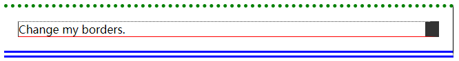
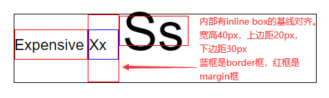

# 盒模型

## 一、盒子的构成与设置

### 1.1 盒子的构成

在 CSS 中，所有元素都是一个“盒子（box）”结构，这个盒子有一个**盒边框**，在这个边框内部有个**显示内容**区域，显示内容与边框之间还会有**填充**（内边距），边框与其他盒子之间也有**间距**（外边距）。可以看下面这个盒模型图：


解释：

- **content area**: 这个区域是用来显示内容，大小可以通过设置 width 和 height。
- **padding area**: 包围在内容区域外部的空白区域； 大小通过 padding 相关属性设置。
- **border area**: 边框盒包裹内容和内边距。大小通过 border 相关属性设置。
- **margin area**: 这是最外面的区域，是盒子和其他元素之间的空白区域。大小通过 margin 相关属性设置。

### 1.2 盒子的相关设置

**标准盒模型**的 width 和 height 其实就是 contentArea 的宽高，但是**IE 盒模型**的 width 和 height 是 contentArea、paddingArea 以及 borderArea 这三者的和值，通过改变`box-sizing: content-box`（W3C）和`box-sizing: border-box`（IE）就可以达到自由切换的效果。

**margin**可以统一设置**上下左右**的外边距，比如`margin: 0 10px 20px 30px`意思就是上外边距是 0、右外边距是 10px、下外边距是 20px、左外边距是 30px。也可以`margin: 0 10px`上下外边距是 0、左右外边距是 10px。单独设置一边也可以的，比如`margin-top:0; margin-right:10px; margin-bottom:20px; margin-left:30px;`，

**border**可以统一设置也可以单独设置一边。主要注意的是它还有其他样式可以设置，比如颜色 border-color、宽度 border-width、线条类型 border-style。

**padding**也可以统一设置也可以单独设置一边。padding 只能是**非负数**；而 margin 可以是**负数**，并且可能会影响到自身的位置以及大小，在[四、内外边距的影响](./2.盒模型.md#四、内外边距的影响)会详细说明。

```html
<html>
  <head>
    <style type="text/css">
      .container {
        border-top: 5px dotted green;
        border-right: 1px solid black;
        border-bottom: 10px double blue;
      }
      .box {
        border: 1px solid #333333;
        border-top-style: dotted;
        border-right-width: 20px;
        border-bottom-color: red;
        margin: 20px 20px;
      }
    </style>
  </head>
  <body>
    <div class="container">
      <div class="box">Change my borders.</div>
    </div>
  </body>
  <html></html>
</html>
```

上面代码的效果图：

## 二、块级盒子和内联盒子

在水平书写模式中，页面通常是**从左到右、从上到下**这样一个顺序来显示元素的（阿拉伯语言等除外），盒子也是基于这种**正常的元素排列顺序**来说的。

CSS 盒子最主要的两种盒子就是**块级**盒子（Block box）和**内联**盒子（Inline box），它们主要的区别就是在排列顺序上表现不一样。比如块级盒子主要是**垂直**排列（一个块级元素就默认占据一行），而内联盒子主要是**水平**排列（多个内联元素在一行里 inline）。

块级盒子会表现出以下行为:

- 块级盒子默认会与父容器一样宽；
- 每个块级盒子都会单独占一行，也就是说，**不会**有其他块级盒子和当前块级盒子在一行里；
- width 和 height 属性可以发挥作用；
- 内外边距和边框会将其他元素从当前盒子周围“推开”。

内联盒子会表现出以下行为:

- 内联盒子**不会**单独占一行，多个内联盒子可以在一行里（并且留了间隙，所以一般不用内联盒子）。
- width 和 height 属性将不起作用，原因是它是由内部撑起来的。
- 垂直方向的内外边距以及边框会被应用，虽然被应用了，但并**不会**推开**上下**的其他内联盒子（真要推开，也是靠行高来影响的）。
- 水平方向的内外边距以及边框会被应用，并且会把**左右**的内联盒子推开。

```html
<html>
  <head>
    <style type="text/css">
      p {
        width: 300px;
        height: 150px;
        border: 2px solid red;
      }
      span {
        margin: 20px; /* 外边距和边框虽然是生效的，垂直是推不开的其他内联元素的，而水平方向的可以 */
        padding: 10px; /* 生效 */
        width: 30px; /* 内联盒子忽略宽度 */
        height: 10px; /* 内联盒子忽略高度 */
        background-color: lightblue;
        border: 2px solid blue;
      }
    </style>
  </head>
  <body>
    <p>
      I am a paragraph and this is a <span>span</span> inside that paragraph. A span is an inline element and so does
      not respect width and height.
    </p>
  </body>
  <html></html>
</html>
```

上面代码的效果图：  


除非特殊指定，`<h1>`、`<p>`和`<div>`等在默认情况下都是块级盒子，`<span>`、`<a>`、`<em>`和`<strong>`等在默认情况下都是内联盒子。可以通过**display**来指定或者修改元素的盒子类型。

```html
<html>
  <head>
    <style type="text/css">
      div {
        display: inline;
        background-color: red;
      }
      span {
        display: block;
        background-color: green;
      }
    </style>
  </head>
  <body>
    <div>div元素</div>
    <!--变成在一行里排列的内联元素-->
    <div>div元素</div>
    <!--变成在一行里排列的内联元素-->
    <span>span元素</span
    ><!--变成占满一行的块级元素-->
    <span>span元素</span
    ><!--变成占满一行的块级元素-->
  </body>
  <html></html>
</html>
```

## 三、display 的其他值

### 3.1 none

`display: none`一般用于隐藏元素。它所在位置会被其他元素占领，不会留出空白。

```html
<html>
  <head>
    <style type="text/css">
      .none {
        display: none;
      }
    </style>
  </head>
  <body>
    <div>示例文本1</div>
    <div class="none">示例文本2</div>
    <div class="none">示例文本3</div>
    <div>示例文本4</div>
  </body>
  <html></html>
</html>
```

### 3.2 inline-block

希望元素在一行里排列，并且还能设置宽高（块级特点），但又不想它因为内外边距的原因导致与其他元素在垂直方向上重叠（上一节的 span 例子，内联特点），那么可以采用`display: inline-block`结合块级和内联两种方式的优点来使用。说简单点就是在一行里排列块级元素，并且垂直方向的内外边距能推开其他内容。

```html
<html>
  <head>
    <style type="text/css">
      p {
        width: 300px;
        height: 150px;
        border: 2px solid red;
      }
      span {
        display: inline-block;
        margin: 20px; /* 会推开文字 */
        padding: 10px;
        width: 30px; /* 生效 */
        height: 10px; /* 生效 */
        background-color: lightblue;
        border: 2px solid blue;
      }
    </style>
  </head>
  <body>
    <p>
      I am a paragraph and this is a <span>span</span> inside that paragraph. A span is an inline element and so does
      not respect width and height.
    </p>
  </body>
  <html></html>
</html>
```

上面代码的效果图：

### 3.3 inline-table

inline-table 与 inline-block 是类似的，只不过它是单独针对于`<table>`的。table 元素是属于 block 类型的，使用`display: inline-table`可以让 table 元素在行内排列。

```html
<html>
  <head>
    <style type="text/css">
      table {
        border: 2px solid blue;
        margin: 30px;
        display: inline-table;
      }
      td {
        border: 2px solid red;
      }
    </style>
  </head>
  <body>
    你好
    <table>
      <tr>
        <td>A</td>
        <td>A</td>
      </tr>
      <tr />
      <tr>
        <td>B</td>
        <td>C</td>
      </tr>
      <tr />
    </table>
    你好
  </body>
  <html></html>
</html>
```

### 3.4 list-item

**display: list-item**可以将多个元素作为列表来显示。

```html
<html>
  <head>
    <style type="text/css">
      div {
        display: list-item;
        list-style-type: circle;
        margin-left: 30px;
      }
    </style>
  </head>
  <body>
    <div>文本1</div>
    <div>文本2</div>
    <div>文本3</div>
  </body>
  <html></html>
</html>
```

### 3.5 run-in 和 compact

**display: run-in**的元素将被包含在后面的 block 类型元素的**内部**，而**display: compact**的元素将被放置在 block 类型元素的左边。在 css2.1 被删除了，在 css3 恢复了但是很多浏览器没有实现，了解一下就行了。

## 四、内外边距的影响

### 4.1 展示尺寸与布局尺寸

我们看待一个元素，要从两方面去分析它的，一个是**视觉**上，另一个就是**布局**上的。

首先在**视觉**上，元素给我们呈现的**视觉大小**是由**contentArea**、**paddingArea**和**borderArea**决定的。比如给元素加上`background-color`，这个颜色所占区域就是 contentArea、paddingArea、borderArea 加起来的总区域。

看下面这个例子，宽高其实都是 100px 的 div，第一个加了 margin，第二个加了 padding，第三个加了 padding 和 border，实际给我们呈现的效果除了 content 以外就只有 padding 和 border 还会影响视觉大小，而 margin 根本不会影响元素的视觉大小。我们暂且将元素在视觉上的展示大小称为元素的**展示尺寸**，它的值等于`border + padding + content`这个和值。（是不是想起 IE 盒的 width 和 height）

```html
<html>
  <head>
    <style type="text/css">
      div {
        width: 100px;
        height: 100px;
      }
      .div1 {
        background-color: green;
        margin: 20px;
      }
      .div2 {
        background-color: yellow;
        padding: 20px;
      }
      .div3 {
        background-color: blue;
        padding: 20px;
        border: 2px solid red;
      }
    </style>
  </head>
  <body>
    <div class="div1"></div>
    <div class="div2"></div>
    <div class="div3"></div>
  </body>
  <html></html>
</html>
```

然后在**布局**上，**contentArea**、**paddingArea**、**borderArea**和**marginArea**会决定元素在[正常布局流](./5.定位与浮动.md#一、正常布局流)中占据的**空间大小**。

还是上面这个例子。三个 div 左右的外边距都是顶着父容器左右边框的，那么内容加上左右填充再加上左右边框最后加上左右外边距，这个值就等于父容器内容的宽度，也就说三个 div 盒子占据的空间宽度相同（这是一个伏笔）。而他们的占据的空间高度呢？同样也是如此，内容加上上下填充再加上上下边框最后加上上下外边距，在数值上几乎是一样的（除了第三个 div 有上下边框，浏览器 F12 查看）。我们暂且将元素在布局流中占据的**空间大小**称为元素的**布局尺寸**，它的值等于`margin + border + padding + content`这个和值。

看下面这个例子，将第一个 div 的 margin-bottom 从`20px`慢慢改变到`-20px`。在改变过程中，你会发现后面两个 div 会慢慢往上挪动，形成一种步步紧逼的样子。这个现象其实就是因为第一个 div 占据的空间慢慢变小（**布局尺寸**减小），多出的空间被后面的 div 占据了。然后你还会发现**展示效果**一直是 102×102 的矩形区域，只不过会发生重叠，**布局尺寸**的减少并不会导致**展示效果**被压缩，也就说**展示尺寸**和**布局尺寸**之间没有强关联，只是数值上相差**margin**值而已。

```html
<html>
  <head>
    <style type="text/css">
      div {
        width: 100px;
        height: 100px;
        border: 1px solid red;
      }
      /* margin: 20px 20px 0 20px;中的第三个值从20px慢慢变到0再慢慢变到-20px */
      .div1 {
        background-color: green;
        margin: 20px 20px 0 20px;
      }
      .div2 {
        background-color: yellow;
        padding: 20px;
        opacity: 0.8;
      }
      .div3 {
        background-color: blue;
        padding: 20px;
      }
    </style>
  </head>
  <body>
    <div class="div1"></div>
    <div class="div2"></div>
    <div class="div3"></div>
  </body>
  <html></html>
</html>
```

还有一个比较有意思的点，改变**布局尺寸**，展示效果位移的可能是自己也可能是下一个元素。如果改变的是元素在**排列方向上**靠前的外边距，那展示效果位移的就是自己；如果改变的是**排列方向**上靠后的外边距，那展示效果位移的就是下一个元素。看下面这个例子，将第二个 div 的 margin-top 慢慢从`0`变为`-40px`，你会发现下面两个 div 在慢慢向上挪动。如果是 margin-bottom，那就只有最后一个 div 移动。

PS：**排列方向**，就是根据元素特性来排列（在正常布局流中），比如块级元素就是垂直方向（因为它们单独占一行，所以是进行上下的一个排列），内联元素就是水平方向。

```html
<html>
  <head>
    <style type="text/css">
      div {
        width: 100px;
        height: 100px;
        border: 1px solid red;
      }
      .div1 {
        background-color: green;
        margin: 20px;
      }
      .div2 {
        background-color: yellow;
        margin-top: -40px;
        padding: 20px;
        opacity: 0.8;
      }
      .div3 {
        background-color: blue;
        padding: 20px;
      }
    </style>
  </head>
  <body>
    <div class="div1"></div>
    <div class="div2"></div>
    <div class="div3"></div>
  </body>
  <html></html>
</html>
```

我们一直没说**内边距**对**布局尺寸**的影响，其实很简单，就是内边距只能增大布局尺寸而不能减小布局尺寸，原因就是 padding 只能是**正值**。那么可以下结论了，**内边距既能改变布局尺寸也能改变展示尺寸，而外边距一般只能改变布局尺寸**。

### 4.2 块级元素的隐藏等式

你会看到上面的结论有“**一般**”这个词，因为有一种情况比较特殊，也是之前埋下的伏笔。**块级**元素在**非**排列方向上（也就是块级元素是水平方向上）的外边距，可能会影响到**展示尺寸**。

因为块级元素有个特点，**水平占据一行**。什么意思呢？块级元素**布局尺寸**的宽度**必须等于**父元素内容的宽度，也就是这个等式`margin-left + border-left-width + padding-left + width + padding-right + border-right-width + margin-right = the width of the parent element`（准确来说是等于父容器**内容**的宽度，子元素水平方向的布局尺寸等于父元素的内容的宽度）。垂直方向是没有这个等式的，因为块级元素高度的`auto`是由本身内容决定的，块级元素宽度的`auto`是由父级宽度决定的。

上一节的那些例子，父级元素宽度不变，子级元素有显示设置宽度、内边距以及边框，只需要左右外边距来补齐**布局尺寸**宽度即可。再看下面这个例子，没有设置子元素宽度（那就默认`auto`），并且让左右外边距取**负值**，要维持那个等式，那得让**展示尺寸**的宽度增大才行。当然左右外边距取**正值**也会影响到**展示尺寸**宽度（减小）。

```html
<html>
  <head>
    <style type="text/css">
      .outer {
        width: 150px;
        height: 75px;
        border: 2px solid green;
        margin: 25px;
      }
      /* 宽度没有设置或者为auto，左右外边距取负值。 */
      .inner {
        height: 25px;
        border: 1px solid red;
        margin-left: -20px;
      }
    </style>
  </head>
  <body>
    <div class="outer">
      <div class="inner"></div>
    </div>
  </body>
  <html></html>
</html>
```

由于这个等式的关系，只要让子元素的左右内外边距**固定**不变，父元素宽度**变大**，那子元素宽度跟着**变大**（父变小那子也变小）；或者父元素宽度**固定**，让子元素的左右内外边距**变大**，那子元素的宽度反而会变小（边距变小那子就变大）。我们常把这种子元素叫做**自适应的盒子**。

```html
<html>
  <head>
    <style>
      .outer {
        width: 200px;
        height: 200px;
        background-color: red;
        margin: 50px 0 0 100px;
      }
      .inner {
        height: 100px;
        background-color: blue;
        /* 子元素宽度由margin来决定（父元素width固定），还应用了外边距取负数 */
        margin: 50px -150px 0 -50px;
      }
    </style>
  </head>
  <body>
    <div class="outer">
      <div class="inner"></div>
    </div>
  </body>
</html>
```

### 4.3 在内联元素上的表现

前面两小节基本上说的是块级元素，讨论了块级元素在**排列方向**以及**非排列方向**上**展示尺寸**和**布局尺寸**的效果和作用。那么内联元素呢？

内联元素在**排列方向上**（内联水平排列），跟块级元素在**排列方向上**（块级垂直排列）一样。**展示尺寸**和**布局尺寸**都是有效果作用也正常。

但是内联元素在非**排列方向上**（也就是垂直方向），跟块级元素在非**排列方向上**（也就是水平方向）同样是受到限制的。**展示尺寸**没问题，该怎么展示就怎么展示，和块级元素在水平方向一样。只是**布局尺寸**就不一样，块级元素水平方向有一个关于**布局尺寸**的**隐藏等式**，内联元素垂直方向是**没有**这样的等式，而是有一个`line box`的限制。

`line box`会限制**相邻两行**内联元素的内外边距影响，可以回想一下内联盒子的最后两条表现，上下左右的内外边距被应用，左右内外边距可以推开相邻内联盒子，而上下内外边距是**推不开**相邻内联盒子。

其实内联元素具体是**内联替换元素**或者**内联块级元素**的时候，那**布局尺寸**的功能都开始生效了，不过还是相对于`line box`来说的，通过影响`line box`来**间接**影响到相邻两行。

以上不明白的去看[内联元素的排列](./2.盒模型.md#五、内联元素的排列)，这里只是简单说一下。然后我们小节一下，在元素的“**排列方向**”上，**展示尺寸**和**布局尺寸**是正常工作的，在在元素的“**非排列方向**”上，**展示尺寸**仍正常工作，而**布局尺寸**会受到限制。

### 4.4 上下外边距折叠

在**正常布局流**中**相邻块级元素**的**上下外边距**有**折叠**。

解释说明：

- 正常布局流：块级盒子一般是垂直排列，内联盒子一般是水平排列，可以看后面的章节——[正常布局流](./5.定位与浮动.md#一、正常布局流)。
- 相邻块级元素：也就是上下紧挨着的块级盒子（跟盒子大小无关，也肯定是各占一行）。
- 上下外边距：其实是两个盒子之间相互靠近的外边距（各自出一个外边距）。
- 折叠：取两个值中最大的那个作为最终值（同号，并且绝对值最大），那个小值会被忽略掉（可以理解为重叠）。与折叠相反的就是“累积”，意思是两个值相加。

具体场景（第 4 个场景比较特殊）：

1. 两个相邻的**块级**盒子。它们之间的间隔当然只是**上下**的外边距起作用，如果两个相靠近的外边距**同号**（同时为正数或负数），那外边距是**折叠**的；而**异号**的话就是**累积**的。

   ```html
   <html>
     <head>
       <style type="text/css">
         .outer {
           display: inline-block;
           width: 150px;
           border: 2px solid green;
           padding: 25px;
         }
         .inner {
           display: block;
           width: 150px;
           height: 75px;
         }
         .left1 {
           margin-bottom: 10px;
           border: 1px solid red;
         } /* 可以试着改一下margin-bottom*/
         .right1 {
           margin-top: 10px;
           border: 1px solid blue;
         }
         .left2 {
           margin-bottom: -10px;
           border: 1px solid red;
         } /* 可以试着改一下margin-bottom*/
         .right2 {
           margin-top: 10px;
           border: 1px solid blue;
         }
         .left3 {
           margin-bottom: -10px;
           border: 1px solid red;
         } /* 可以试着改一下margin-bottom*/
         .right3 {
           margin-top: -10px;
           border: 1px solid blue;
         }
       </style>
     </head>
     <body>
       <div class="outer">
         <div class="inner left1"></div>
         <div class="inner right1"></div>
       </div>
       <div class="outer">
         <div class="inner left2"></div>
         <div class="inner right2"></div>
       </div>
       <div class="outer">
         <div class="inner left3"></div>
         <div class="inner right3"></div>
       </div>
     </body>
     <html></html>
   </html>
   ```

2. 两个相邻的**内联**盒子。它们之间的间隔当然只是**左右**的外边距起作用，两个相靠近的外边距不管正负，**都是累积的**，也就说不会发生折叠。其他的具有内联性质的比如 inline-block 也是如此。然后垂直方向就不要考虑了，因为他们有 line box 隔离了相邻两行。

   ```html
   <html>
     <head>
       <style type="text/css">
         .outer {
           width: 200px;
           border: 2px solid green;
           padding: 25px;
           margin-bottom: 25px;
         }
         .inner {
           display: inline;
         }
         .left1 {
           margin-right: 10px;
           border: 1px solid red;
         } /* 可以试着改一下margin-right*/
         .right1 {
           margin-left: 10px;
           border: 1px solid blue;
         }
         .left2 {
           margin-right: -10px;
           border: 1px solid red;
         } /* 可以试着改一下margin-right*/
         .right2 {
           margin-left: 10px;
           border: 1px solid blue;
         }
         .left3 {
           margin-right: -10px;
           border: 1px solid red;
         } /* 可以试着改一下margin-right*/
         .right3 {
           margin-left: -10px;
           border: 1px solid blue;
         }
       </style>
     </head>
     <body>
       <div class="outer">
         <div class="inner left1">ABCDEF</div>
         <div class="inner right1">GHIJKL</div>
       </div>
       <div class="outer">
         <div class="inner left2">ABCDEF</div>
         <div class="inner right2">GHIJKL</div>
       </div>
       <div class="outer">
         <div class="inner left3">ABCDEF</div>
         <div class="inner right3">GHIJKL</div>
       </div>
     </body>
     <html></html>
   </html>
   ```

3. 四个相邻的**浮动**元素。相靠近的左右外边距是**累积**的，相靠近的上下外边距也是**累积**的，但是它可以在浮动规则下尽可能的往上靠。什么意思呢？元素都左浮动，上一行在左边比较“低”，而在右边比较“高”（活动空间比左边多），那么浮动元素宁愿将左边位置空出来都要去右边位置高的地方。

   ```html
   <html>
     <head>
       <style type="text/css">
         /*设置224的原因，2个宽度就是200，左右外边距最大是20，有4个1px的边界*/
         .outer {
           display: flow-root;
           width: 224px;
           border: 2px solid green;
           padding: 25px;
         }
         .inner {
           float: left;
           width: 100px;
           height: 20px;
         }
         .cell1 {
           margin-right: 10px;
           margin-bottom: 10px;
           border: 1px solid red;
         }
         .cell2 {
           margin-left: 10px;
           margin-bottom: -5px;
           height: 25px;
           border: 1px solid blue;
         }
         .cell3 {
           margin-right: -10px;
           margin-top: -5px;
           margin-bottom: 0px;
           height: 25px;
           border: 1px solid red;
         }
         .cell4 {
           margin-left: -10px;
           margin-top: 0px;
           margin-bottom: 0px;
           border: 1px solid blue;
         }
       </style>
     </head>
     <body>
       <div class="outer">
         <div class="inner cell1">cell1</div>
         <div class="inner cell2">cell2</div>
         <div class="inner cell3">cell3</div>
         <div class="inner cell4">cell4</div>
       </div>
     </body>
     <html></html>
   </html>
   ```

4. 两个块级元素嵌套，如果父级元素**没有设置边框**或者**没有设置内边距**或者**没有其他内容将父子隔开**，那么子级元素设置的**上下外边距**就会与父级的**上下外边距**进行**折叠**。除了改变父级的盒子设置，还可以将子元素改为**内联块级元素**，或者使用 BFC，都可解决折叠问题。

   ```html
   <html>
     <head>
       <style type="text/css">
         .outer {
           width: 200px;
           margin: 5px;
           background-color: blue;
         }
         .inner {
           height: 25px;
           border: 1px solid red;
           margin: 30px;
         }
       </style>
     </head>
     <body>
       <div class="outer">
         <div class="inner">AAA</div>
       </div>
       <!--先看上面这一个outer，父子的上下外边距是否折叠。然后再打开下面的注释，看两个同样的outer是否也折叠上下外边距-->
       <!--<div class="outer">
            <div class="inner">AAA</div>
        </div>-->
     </body>
     <html></html>
   </html>
   ```

其实不止**相邻**元素的**上下**外边距会有折叠，其实**父子**元素的**上边距**也可能会折叠。如果父元素**没有边框**，那么它们与顶部的距离就是**父子**上外边距里的**最大值**，并且父子上下之间是**紧紧贴在一起**的（也就是子元素的外边距不起作用了，原因是父元素没有边框，效果直接传递到父元素了）。比如父元素的上外边距是`20px`，子上外边距是`50px`，那么它们与顶部的距离就是`50px`。

```html
<html>
  <head>
    <style>
      .outer {
        width: 200px;
        height: 200px;
        background-color: red;
        margin: 20px 0 0 0;
        /* 加上边框或者BFC就可以解决父子上外边距折叠问题 */
        /*border: 1px  green solid;*/
      }
      .inner {
        width: 100px;
        height: 100px;
        background-color: blue;
        /* 左右外边距是正常的 */
        margin: 50px 0 0 50px;
      }
    </style>
  </head>
  <body>
    <div class="outer">
      <div class="inner"></div>
    </div>
  </body>
</html>
```

## 五、内联元素的排列

**块级**元素的排列还是很简单的，**展示尺寸**控制水平和垂直的展示效果，**布局尺寸**直接占满父级内容的一行（margin 可取负数，情况稍微复杂点，上一节说过），而垂直方向上的**布局尺寸**就是正常表现了，没什么可说的，自己回顾上一节的内容。

而**内联**元素的排列，在水平方向上**展示尺寸**和**布局尺寸**是正常表现，但是在垂直方向上元素的**上下内外边距**并不会推开其他内联元素，**它有自己的一套展示规则**。

### 5.1 替换元素与非替换元素

**替换元素**（replaced element）：元素本身是不具有内容的，但是可以由它的一些属性决定它的最终展示内容（比如 src）。可以理解为元素本身的内容**被替换掉了**，或者说一些内容**嵌入**到了这个元素中。

**替换元素**的特点：最终的展示内容可以提前通过`width`和`height`来控制，如果你没有使用这两个来控制大小，它的内容是具有一个**原始尺寸**，这个原始尺寸会成为最终的展示效果大小。

**非替换元素**（nonreplaced element）：与替换元素相反，自己有内容也会成为最终的展示内容，不会被元素其他属性引来的内容所**替换**。

``、`<input>`、`<textarea>`、`<select>`、`<object>`等是 h5 以前常见的替换元素，h5 新增了`<video>`、`<canvas>`、`<menu>`等替换元素。其他大部分 HTML 元素是非替换元素。

绝大部分**替换元素**是具有**内联**性质的，而又因为替换元素的内容具有**原始尺寸**的特点（意思是你具有内联性质却还能用 width 和 height 来控制），所以在后面讨论**内联元素的排列**时会拿**内联非替换元素**来说，而不是**内联替换元素**（也不会拿内联块级来说）。那么其实剩下的内联元素基本就是和**文本**有关的，讨论**内联元素的排列**时可以与下一章的内容（[字体与文本属性](./3.字体与文本属性.md)）一起看。

### 5.2 inline box 和 line box

我们知道**内联非替换元素**在[正常布局流](./5.定位与浮动.md#一、正常布局流)上的排列，是从左到右（ltr），排满后换到下一行继续排列。如下概念图。


回想一下[内联元素的表现](./2.盒模型.md#二、块级盒子和内联盒子)，最后两条“表现”的内在意思是什么？其实就是，视觉效果依旧，布局在水平上依旧但垂直方向上无效了。四周的`contentArea + paddingArea + borderArea`仍旧影响到内联元素的**展示效果**，并且`contentArea + 左右paddingArea + 左右borderArea + 左右marginArea`可以**推开**（左右）相邻的内联元素（左右外边距取负值还能**拉近**），而`contentArea + 上下paddingArea + 上下borderArea + 上下marginArea`却**不会推开**（上下）相邻的内联元素（上下外边距取负值也不能**拉近**）。搞不明白的去看[展示尺寸与布局尺寸](./2.盒模型.md#_4-1-展示尺寸与布局尺寸)。

```html
<html>
  <head>
    <style type="text/css">
      .parent {
        font-size: 20px;
        line-height: 20px;
        width: 280px;
        border: 1px solid;
        margin: 0;
      }
      /* 上下视觉效果（contentAre+paddingArea+borderArea）还是有的，左右可以推开，上下却不行*/
      /* 然后padding改为margin，视觉效果回到了contentAre（因为padding没了），左右可以推开，上下却不行*/
      span {
        padding: 50px 30px;
        background-color: red;
        opacity: 0.7;
      }
    </style>
  </head>
  <body>
    <div class="parent">This is text, this is text, this is text, <span>this is text,</span> this is text.</div>
  </body>
</html>
```

上下推不开的原因是每一行都有一个**line box**，是一整行的实际渲染区域。如下概念图。因为不可能让一行所有内联非替换元素的 padding 和 margin 等，都去影响相邻行的内联非替换元素，引入 line box 可以让相邻行以**整行**的形式相互影响。line box 这个概念非常像块级元素，占据一行。区别还是蛮大的，相邻行的**line box**紧挨着的，并没有什么内外边距和边界；不能设置固定宽高，它的宽高是由内部所有的内联元素共同决定的。


line box 隔绝了相邻行里内联非替换元素之间的影响，内联非替换元素对 line box 也是不会使用**margin**进行什么推开和拉近的。因为内联非替换元素有自己的**inline box**，并且有**vertical-align**和**line-height**来决定内联非替换元素在垂直方向上的摆放。**inline box**是内联元素的渲染区域，inline box 的高度在大部分情况下就是该内联元素的**line-height**的值。（内联替换元素或者内联块级元素时，inline box 的高度是布局尺寸高度。）


**inline box**与**line box**的关系：line box 包含了一行所有的 inline box。一行中**最高**的 inline box 的**顶部**会构成 line box 的顶部，一行中**最低**的 inline box 的**底部**会构成 line box 的底部。如下图，稍微严谨一点的图了。


### 5.3 line-height 和 baseline

因为在前面说过“不可能让一行所有内联非替换元素的 padding 和 margin 等都去影响相邻行的内联非替换元素”，所以引进了**line box**。但是行与行之间，或者说文字之间的上下空隙总得有，不然会不美观。所以有了行高**line-height**，它主要是给内联非替换元素开辟**垂直**空间的，也就是决定了内联非替换元素的 inline box 高度（**然后间接影响到 line box 的高度**）。

内联非替换元素的**内容**常见的就是文字，**font-size**会决定文字的显示高度（它是一个影响因素），css 会让**line-height**减去**font-size**，再将得到的值也就是**leading**平分为两半，一半放在文字的**上方**，一半放在文字的**下方**。如果 line-height 没有显式设置，那浏览器会给个默认值（`1.2`或`1.4`等等，具体看浏览器了）。

```html
<html>
  <head>
    <style type="text/css">
      .parent {
        font-size: 20px;
        line-height: 20px; /* 值改为10px、20px、40px试试 */
        width: 200px;
        border: 1px solid;
      }
    </style>
  </head>
  <body>
    <div class="parent">This is text, this is text, this is text.</div>
  </body>
</html>
```

当遇到复杂场景时，比如一行的文字大小不一或者内联非替换元素内容高低不一，它们在垂直方向上应该是怎样摆放的？我们来介绍最基本也是 css 默认的一种方式——**baseline**对齐。**baseline**（基线）是用于在上面放置字符的一条假象的基准线，在英文字体中，baseline 通常是小写字母`x`的底部边缘（其他字符可能有下沉，比如`g`和`p`等等），如下图。其实汉字与另外一些文字是其实没有基线概念的，但在 css 中还是让它们按照英文的基线对齐的（也可以使用**vertical-align**其他值）。


我们看下面这个例子。`Xx`的 font-size 从`20px`增大到`80px`，`Xx`一直在基线上，而`Xx`的**inline box**上移了。原因是字体的中心（line-height 的中心）与`Xx`基线的距离越来越远。

```html
<html>
  <head>
    <style type="text/css">
      .parent {
        font-family: Arial;
        font-size: 20px;
        line-height: 40px;
        width: 600px;
        border: 1px solid;
      }
      /* 将font-size从20px变为80px */
      .text2 {
        font-size: 20px;
      }
      /* 以下是调试代码 */
      .parent {
        position: relative;
      }
      .parent span::after {
        content: "";
        position: absolute;
        border: 1px solid red;
        box-sizing: border-box;
      }
      .text1::after {
        bottom: 0;
        left: 0;
        width: 94px;
        height: 40px;
      }
      .text2::after {
        top: 0;
        left: 94px;
        width: 85px;
        height: 40px;
      }
    </style>
  </head>
  <body>
    <div class="parent"><span class="text1">Expensive</span> <span class="text2">Xx</span></div>
  </body>
</html>
```

### 5.4 vertical-align

**vertical-align**是内联非替换元素的垂直对齐方式，默认值是`baseline`也就是上一小节说的基线对齐。它还有其他值，`sub | super | top | text-top | middle | bottom | text-bottom | <length> | <percentage>`。

`vertical-align: baseline`：垂直对齐方式的默认值。让子元素的 baseline 与父元素内部的 baseline 对齐，更具体点是子元素的 baseline 会与它**当前所在行**的 baseline 对齐。

一行里所有使用 baseline 对齐方式的内联非替换元素，这些元素的 baseline 与`line box`顶部的距离，距离最大的那个元素的 baseline 就是**当前所在行**的 baseline 位置。绝大数情况下（排除内联替换元素和内联块级元素），一行里字体最大的文本，它的`line-height`所在的中心点与它的 baseline 的距离最大，那么它的 baseline 就成了这一行的 baseline。

上面这种是**对内**的，而父元素**对外**暴露的 baseline 会有两种情况，一是内部有`inline box`并且没有**溢出处理**（下一节会讲），那最后一个`inline box`的 baseline 就是父元素对外暴露的 baseline（简单来说就是最后一行的 baseline）；二是内部没有`inline box`或者有**溢出处理**，那对外暴露的 baseline 就是父元素的 margin-bottom 位置。

`vertical-align: top`：让元素的`inline box`顶部与当前行的`line box`顶部进行对齐。  
`vertical-align: bottom`：让元素的`inline box`底部与当前行的`line box`底部进行对齐。

```html
<html>
  <head>
    <style type="text/css">
      .parent {
        font-family: Arial;
        font-size: 20px;
        line-height: 40px;
        width: 400px;
        border: 1px solid;
      }
      /* 将font-size从20px变为80px */
      .text2 {
        font-size: 80px;
      }
      /* top可以改为bottom */
      .text3 {
        font-size: 60px;
        vertical-align: top;
      }
      /* 以下是调试代码 */
      .parent {
        position: relative;
      }
      .parent span::after {
        content: "";
        position: absolute;
        border: 1px solid red;
        box-sizing: border-box;
      }
      .text1::after {
        bottom: 0;
        left: 0;
        width: 94px;
        height: 40px;
      }
      .text2::after {
        top: 0;
        left: 94px;
        width: 100px;
        height: 40px;
      }
      /* 如果对齐模式由top改为bottom后，这里的top也要改为bottom */
      .text3::after {
        top: 0;
        left: 194px;
        width: 75px;
        height: 40px;
      }
    </style>
  </head>
  <body>
    <div class="parent">
      <span class="text1">Expensive</span> <span class="text2">Xx</span> <span class="text3">Ss</span>
    </div>
  </body>
</html>
```

上面代码的效果图：  


`vertical-align: text-top`：让元素的`inline box`顶部与父元素的字体顶部进行对齐。  
`vertical-align: text-bottom`：让元素的`inline box`底部与父元素的字体底部进行对齐。

“父元素的字体顶部”的解释：父元素里设置 font-size 大小的文字，放在父元素内部显示时，文字所占的区域（F12 鼠标悬浮在字体上时显现的字体框）。并不是文字的 inline-box 也不是 line-box。

```html
<html>
  <head>
    <style type="text/css">
      .parent {
        font-family: Arial;
        font-size: 20px;
        line-height: 40px;
        width: 400px;
        border: 1px solid;
      }
      .text3 {
        font-size: 15px;
        vertical-align: text-top;
      }
      .text4 {
        font-size: 15px;
        vertical-align: bottom;
      }
      /* 以下是调试代码 */
      .parent {
        position: relative;
      }
      .parent span::after {
        content: "";
        position: absolute;
        border: 1px solid red;
        box-sizing: border-box;
      }
      .text1::after {
        top: 0;
        left: 0;
        width: 95px;
        height: 40px;
      }
      .text2::after {
        bottom: 17px;
        left: 95px;
        width: 28px;
        height: 23px;
      }
      .text3::after {
        bottom: 0;
        left: 123px;
        width: 76px;
        height: 40px;
      }
      .text4::after {
        bottom: 0;
        left: 199px;
        width: 75px;
        height: 40px;
      }
    </style>
  </head>
  <body>
    <div class="parent">
      <span class="text1">Expensive</span> <span class="text2">Xx</span> <span class="text3">Expensive</span>
      <span class="text4">Expensive</span>
    </div>
  </body>
</html>
```

上面代码的效果图：  


上面例子分析：可以看到第二个框我们没有画 inline box，而是画的是文字的实际区域，第三个`<span>`设置的是**text-top 对齐**，那么第三个`<span>`设对应的 inline box 的顶部会与第二个框的顶部进行对齐。这样会导致整行的 line box 底部被顶下去，那么第四个`<span>`设置的**bottom**对齐就会在实际过程中与第三个`<span>`inline box 的底部对齐（因为第三个`<span>`inline box 是目前最低的 inline box）。

`vertical-align: middle`：让元素的中部与父元素内部 baseline 再加上`x-height/2`的位置进行对齐。`x-height/2`就是父元素使用字体里的小写字母`x`的一半。

```html
<html>
  <head>
    <style type="text/css">
      .parent {
        /*这种字体下的middle对齐，inline box以及最终的line-height高度都是line-height值*/
        /*其他字体可能因为x-height值不准确的缘故，会导致最后line box高度与line-height值有一点点误差*/
        font-family: Courier New;
        font-size: 20px;
        line-height: 40px;
        width: 400px;
        border: 1px solid;
      }
      .text3 {
        font-size: 40px;
        vertical-align: middle;
      }
      /* 以下是调试代码 */
      .parent {
        position: relative;
      }
      .parent span::after {
        content: "";
        position: absolute;
        border: 1px solid red;
        box-sizing: border-box;
      }
      .text1::after {
        bottom: 0;
        left: 0;
        width: 114px;
        height: 40px;
      }
      .text2::after {
        bottom: 9px;
        left: 114px;
        width: 36px;
        height: 23px;
      }
      .text3::after {
        bottom: 0;
        left: 150px;
        width: 59px;
        height: 40px;
      }
    </style>
  </head>
  <body>
    <div class="parent">
      <span class="text1">Expensive</span> <span class="text2">Xx</span> <span class="text3">Ss</span>
    </div>
  </body>
</html>
```

上面代码的效果图：  


`vertical-align: sub`：让元素的 baseline 与父元素内部下标基线（下标点符号）进行对齐。  
`vertical-align: super`：让元素的 baseline 与父元素内部上标基线（上标点符号）进行对齐。

```html
<html>
  <head>
    <style type="text/css">
      .parent {
        font-family: Arial;
        font-size: 20px;
        line-height: 40px;
        width: 400px;
        border: 1px solid;
      }
      .text3 {
        font-size: 40px;
        vertical-align: sub;
      }
      /* 以下是调试代码 */
      .parent {
        position: relative;
      }
      .parent span::after {
        content: "";
        position: absolute;
        border: 1px solid red;
        box-sizing: border-box;
      }
      .text1::after {
        bottom: 0;
        left: 0;
        width: 95px;
        height: 40px;
      }
      .text2::after {
        top: 11px;
        left: 95px;
        width: 66px;
        height: 23px;
      }
      .text3::after {
        top: 0;
        left: 107px;
        width: 54px;
        height: 40px;
      }
    </style>
  </head>
  <body>
    <div class="parent">
      <span class="text1">Expensive</span> <span class="text2">,</span> <span class="text3">Ss</span>
    </div>
  </body>
</html>
```

上面代码的效果图：  


`vertical-align`的另外两种取值:

- `<length>`使元素的 baseline 对齐到父元素内部 baseline 之上的给定长度。可以是负数。
- `<percentage>`使元素的 baseline 对齐到父元素内部 baseline 之上的给定百分比，该百分比是 line-height 属性的百分比。可以是负数。

### 5.5 替换元素和内联块级的影响

**内联非替换元素**的内外边距是不参与它的 inline box 高度的，而**替换元素**和**内联块级元素**的内外边距是参与它的 inline box 高度的。那么行高 line-height，就影响不到**替换元素**和**内联块级元素**，必须得考虑上下内外边距了。

**替换元素**和**内联块级元素**相似的点在于它们都具有内联性质，但又具有**宽高**设置。区别在于**替换元素**的内容是由属性决定或者被嵌入，而**内联块级元素**的内容就是自己的 contentArea 区域。

两者内容的区别也会导致两者对外暴露 baseline 的不同，**替换元素**没有子元素，自己的 contentArea 区域也不会生效，那么**替换元素**对外暴露的基线就是 margin-bottom 位置了。

**内联块级元素**因为有自己的 contentArea 区域，会根据内容来确定对外暴露的 baseline。当内部有 inline box 并且**没有溢出处理**（下一节会讲），那最后一个 inline box 对应的基线就是对外暴露的基线（简单来说就是最后一行的 baseline）；当内部没有 inline box 或者**有溢出处理**，那对外暴露的基线就是 margin-bottom 位置。

最后还有一个注意事项，line-height 对**替换元素**和**内联块级元素**的间接影响。即使 line-height 没有设置但还会有默认值（1.2 或 1.4 等），那么**替换元素**和**内联块级元素**在与文字进行类似于图文混排时，就会出现底边空白间隙的问题，这个就是 line-height 给文字加上下`half-leading`的影响。解决办法可以更改 line-height，或者换其他对齐方式，如果只有图片可以将 font-size 设为 0。

我们来看三个例子，前两个讲了两种基线情况，最后一个讲 text-top 对齐。

```html
<html>
  <head>
    <style type="text/css">
      .parent {
        font-family: Arial;
        font-size: 20px;
        line-height: 40px;
        width: 400px;
        border: 1px solid;
      }
      .text2 {
        display: inline-block;
        width: 40px;
        height: 40px;
        box-sizing: border-box;
        border: 1px solid blue;
        margin-top: 20px; /*现在的line box顶部就是由inline-block的margin-top决定的*/
        margin-bottom: 30px; /*这个margin-bottom要与父元素的baseline对齐*/
        vertical-align: baseline;
      }
      .text3 {
        font-size: 70px;
      }
      /* 以下是调试代码 */
      .parent {
        position: relative;
      }
      .parent span::after,
      .parent div::after {
        content: "";
        position: absolute;
        border: 1px solid red;
        box-sizing: border-box;
      }
      .text1::after {
        bottom: 0;
        left: 0;
        width: 97px;
        height: 40px;
      }
      .text2::after {
        top: 0;
        left: 97px;
        height: 90px;
        width: 42px;
      }
      .text3::after {
        bottom: 18px;
        left: 139px;
        width: 92px;
        height: 40px;
      }
    </style>
  </head>
  <body>
    <div class="parent">
      <span class="text1">Expensive</span>
      <div class="text2"></div>
      <span class="text3">Ss</span>
    </div>
  </body>
</html>
```

上面代码的效果图：  


```html
<html>
  <head>
    <style type="text/css">
      .parent {
        font-family: Arial;
        font-size: 20px;
        line-height: 40px;
        width: 400px;
        border: 1px solid;
      }
      .text2 {
        display: inline-block;
        width: 40px;
        height: 40px;
        box-sizing: border-box;
        border: 1px solid blue;
        margin-top: 20px; /*现在的line box顶部就是由inline-block的margin-top决定的*/
        margin-bottom: 30px; /*现在的line box底部就是由inline-block的margin-bottom决定的*/
        vertical-align: baseline;
      }
      .text3 {
        font-size: 70px;
      }
      /* 以下是调试代码 */
      .parent {
        position: relative;
      }
      .parent span::after,
      .parent div::after {
        content: "";
        position: absolute;
        border: 1px solid red;
        box-sizing: border-box;
      }
      .text1::after {
        bottom: 30px;
        left: 0;
        width: 97px;
        height: 40px;
      }
      .text2::after {
        top: 0;
        left: 97px;
        height: 90px;
        width: 42px;
      }
      .text3::after {
        top: 2px;
        left: 139px;
        width: 92px;
        height: 40px;
      }
    </style>
  </head>
  <body>
    <div class="parent">
      <span class="text1">Expensive</span>
      <div class="text2">Xx</div>
      <span class="text3">Ss</span>
    </div>
  </body>
</html>
```

上面代码的效果图：  


```html
<html>
  <head>
    <style type="text/css">
      .parent {
        font-family: Arial;
        font-size: 20px;
        line-height: 40px;
        width: 400px;
        border: 1px solid;
      }
      .text2 {
        display: inline-block;
        width: 40px;
        height: 40px;
        box-sizing: border-box;
        border: 1px solid blue;
        margin-top: 20px; /*这个margin-top要与父元素的文字元素顶部对齐*/
        margin-bottom: 30px; /*现在的line box底边就是由inline-block的margin-bottom决定的*/
        vertical-align: text-top;
      }
      .text3 {
        font-size: 70px;
      }
      /* 以下是调试代码 */
      .parent {
        position: relative;
      }
      .parent span::after,
      .parent div::after {
        content: "";
        position: absolute;
        border: 1px solid red;
        box-sizing: border-box;
      }
      .text1::after {
        top: 17px;
        left: 0;
        width: 97px;
        height: 40px;
      }
      .text2::after {
        bottom: 0;
        left: 97px;
        height: 90px;
        width: 42px;
      }
      .text3::after {
        top: 0;
        left: 139px;
        width: 92px;
        height: 40px;
      }
    </style>
  </head>
  <body>
    <div class="parent">
      <span class="text1">Expensive</span>
      <div class="text2"></div>
      <span class="text3">Ss</span>
    </div>
  </body>
</html>
```

上面代码的效果图：  


## 六、溢出 overflow

盒子无法容纳太多内容时会发生**溢出**（overflow），css 提供了几种解决溢出的方案，在元素上使用**overflow**属性，其值可以是`visible`、`hidden`、`scroll`、`auto`。如果只是单独对一个方向指定，那就是**overflow-x**或**overflow-y**属性了。

### 6.1 visible

overflow 属性默认是`visible`，也就是仍然显示溢出内容，因为 css 不会让内容自动消失或者做其他处理，这会方便开发者去发现问题并自由灵活地处理。

### 6.2 hidden

overflow 属性设置`hidden`，表示超出部分隐藏。父元素设置了`overflow: hidden`，如果子级元素的**边界**超过了父级元素的**边界**，就会截取掉超出的部分（超出部分隐藏）。其实就是子级元素的**展示效果**超出就会被截取。

```html
<html>
  <head>
    <style type="text/css">
      .outer {
        width: 100px;
        height: 100px;
        overflow: hidden;
        padding: 20px; /*并不会按照父级的padding来截取超过部分，而是按照border*/
        border: 1px solid;
      }
      .inner {
        /* 子元素显示设置宽高，父元素有20px内边距 */
        width: 100px;
        height: 100px;
        /* 子元素使用负值外边距，减少了布局尺寸，子元素向上位移20px，向左位移40px */
        /* 位移后，子元素的上边界与父元素的上边界重合，子元素的左边界超出父元素左边界20px */
        margin-top: -20px; /* 计算过程 20 - 20 = 0 */
        margin-left: -40px; /* 计算过程 20 - 40 = -20 */
        background-color: blue;
      }
    </style>
  </head>
  <body>
    <div class="outer">
      <div class="inner"></div>
    </div>
  </body>
  <html></html>
</html>
```

```html
<html>
  <head>
    <style type="text/css">
      .outer {
        width: 100px;
        height: 100px;
        overflow: visible;
        /*并不会按照父级的padding来截取超过部分，而是按照border*/
        padding: 20px;
        border: 1px solid;
      }
      .inner {
        /* 子元素显示设置宽高，父元素有20px内边距 */
        /* 子元素使用正值外边距，加大了布局尺寸 */
        margin: 20px 20px 20px 0;
        /* 子元素的下边界超出父元素的下边界2px，子元素的右边界超出父元素右边界2px */
        width: 122px; /* 父右边界-子右边界：(20+100+20) - (20+122) = -2 */
        height: 102px; /* 父下边界-子下边界：(20+100+20) - (20+20+102) = -2 */
        background-color: blue;
      }
    </style>
  </head>
  <body>
    <div class="outer">
      <div class="inner"></div>
    </div>
  </body>
  <html></html>
</html>
```

还有一个经典的例子，使用`overflow: hidden`配合**展示尺寸**与**布局尺寸**来实现[等高布局](./7.多列布局.md#五、等高布局)。

### 6.3 scroll

overflow 属性设置为`scroll`，表示该元素添加一个滚动条，用来滚动展示内部元素。父元素设置了`overflow: scroll`，如果子元素**布局尺寸**超过了父级的**contentArea**（块级水平方向得注意，下面会说），那就会为父元素添加滚动条。

滚动条是有**滚动底纹**的，这个底纹也会占据 contentArea 的空间，一般都是`17px`。使用`overflow: scroll`，会先给两个方向都加上滚动底纹（不管有没有溢出），单独使用**overflow-x**或**overflow-y**会只给一个方向加滚动底纹，但也是不管有没有溢出都会加上滚动底纹。

```html
<html>
  <head>
    <style type="text/css">
      .outer {
        width: 100px;
        height: 100px;
        overflow: scroll; /* 先加了两个滚动底纹，会占去17px的空间，溢出时再添加滚动条 */
        padding: 20px;
        border: 1px solid;
      }
      .inner {
        display: inline-block; /* 都是子元素布局尺寸超过父元素内容就能触发 */
        margin: 10px;
        width: 64px; /* 此时布局尺寸为64+10+10=84，再加上滚动条的17那就是101，比父级内容宽度100多出1px，所以会有滚动条 */
        height: 64px; /* 此时布局尺寸为64+10+10=84，再加上滚动条的17那就是101，比父级内容高度100多出1px，所以会有滚动条 */
        background-color: blue;
      }
    </style>
  </head>
  <body>
    <div class="outer">
      <div class="inner"></div>
    </div>
  </body>
  <html></html>
</html>
```

块级元素的**水平方向滚动条**触发比较特殊，因为[块级元素的隐藏等式](./2.盒模型.md#_4-2-块级元素的隐藏等式)导致**布局尺寸**就是父级内容宽度，那么水平方向滚动条的触发条件就得换成边框超过就算触发（展示效果超过就触发）。同样情况的有`display: table`。

```html
<html>
  <head>
    <style type="text/css">
      .outer {
        width: 100px;
        height: 100px;
        overflow: scroll; /* 先加了两个滚动底纹，会占去17px的空间，溢出时再添加滚动条 */
        padding: 20px;
        border: 1px solid;
      }
      .inner {
        display: block; /*块级元素的水平方向会特殊一些，不能用布局尺寸了，得是视觉效果 */
        margin: 10px;
        width: 94px; /* 父元素有效展示宽度是100+20*2=140，减去17为123就是垂直滚动底纹的左边界；子元素右边界目前距离父元素左边界是20+10+94=124，刚好比123大1，就出现了水平滚动条 */
        height: 64px; /* 此时布局尺寸为64+10+10=84，再加上滚动条的17那就是101，比父级内容高度100多出1px，所以会有滚动条 */
        background-color: blue;
      }
    </style>
  </head>
  <body>
    <div class="outer">
      <div class="inner"></div>
    </div>
  </body>
  <html></html>
</html>
```

### 6.4 auto

overflow 属性设置为`auto`，跟`scroll`意思差不多，也是在溢出时添加滚动条。区别就是`auto`在没有溢出时不会添加滚动底纹，溢出的时候再添加滚动底纹和滚动条，那么在触发溢出前也不会被白白占去`17px`的空间了（溢出后也不会）。

```html
<html>
  <head>
    <style type="text/css">
      .outer {
        width: 100px;
        height: 100px;
        overflow: auto; /* 触发溢出后才会加滚动底纹和滚动条，不会占去17px的空间 */
        padding: 20px;
        border: 1px solid;
      }
      .inner {
        display: inline-block;
        margin: 10px;
        width: 81px; /* 此时布局尺寸为81+10+10=101，比父级内容宽度100多出1px，所以会有滚动条 */
        height: 81px; /* 此时布局尺寸为81+10+10=101，比父级内容高度100多出1px，所以会有滚动条 */
        background-color: blue;
      }
    </style>
  </head>
  <body>
    <div class="outer">
      <div class="inner"></div>
    </div>
  </body>
  <html></html>
</html>
```

```html
<html>
  <head>
    <style type="text/css">
      .outer {
        width: 100px;
        height: 100px;
        overflow: auto; /* 触发溢出后才会加滚动底纹和滚动条，不会占去17px的空间 */
        padding: 20px;
        border: 1px solid;
      }
      .inner {
        display: block; /*块级元素的水平方向会特殊一些，不能用布局尺寸了，得是视觉效果 */
        margin: 10px;
        width: 111px; /* 父元素有效展示宽度是100+20*2=140；子元素右边界目前距离父元素左边界是20+10+111=141，刚好比140大1，就出现了水平滚动条 */
        height: 81px; /* 此时布局尺寸为81+10+10=101，比父级内容高度100多出1px，所以会有滚动条 */
        background-color: blue;
      }
    </style>
  </head>
  <body>
    <div class="outer">
      <div class="inner"></div>
    </div>
  </body>
  <html></html>
</html>
```

### 6.5 text-overflow

**text-overflow**是一个文字溢出的属性，经常和**overflow**搭配使用，比如你的文本只要显示一行，多出的用**省略号**替代，那么就可以让**overflow**设置为`hidden`，**text-overflow**设置为`ellipsis`，最后别忘了对文本设置不换行**white-space**设置为`nowrap`。

```html
<html>
  <head>
    <style type="text/css">
      div {
        border: 1px solid #333333;
        width: 200px;
        white-space: nowrap; /* 文本不换行 */
        overflow: hidden; /* 超出盒子时隐藏溢出内容 */
        text-overflow: ellipsis; /* 超出的文本末尾使用省略号替代 */
      }
    </style>
  </head>
  <body>
    <div class="box">This box has a height and a width.</div>
  </body>
  <html></html>
</html>
```
