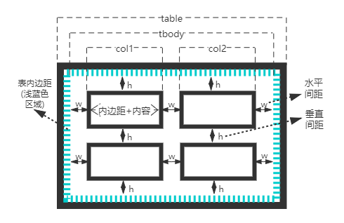

# 表格布局与居中布局

## 一、表格布局

很久以前是使用 html`<table>`标签给页面元素进行布局的，但由于不灵活、难以调试等缺点被其他布局方案所取代了。现在基本很少会用到表格布局，也只是用于兼容一些不支持 Flexbox 和 Grid 的浏览器，或者在一些小模块里使用它。

一个`<table>`标签之所以能够像表格那样展示，是由于 css 默认给`<table>`标签设置了一组 table 布局属性。当这些属性被应用于排列非`<table>`元素时，这种用法被称为“使用 CSS 表格”。

### 1.1 与表相关的 display 值

| 值                 | 意义                                                 |
| ------------------ | ---------------------------------------------------- |
| table              | 指定元素为块级表                                     |
| inline-table       | 指定元素为内联表                                     |
| table-row          | 指定元素为表的某行                                   |
| table-row-group    | 指定元素对一行或多行为表的行分组                     |
| table-header-group | 指定元素为标题行（表头），位于所有行和行分组之前     |
| table-footer-group | 指定元素为页脚行，位于所有行和行分组之后             |
| table-column       | 指定元素为表的某列，但不会被可视化呈现               |
| table-column-group | 指定元素对一列或多列为表的列分组，但不会被可视化呈现 |
| table-cell         | 指定元素为表的单元格                                 |
| table-caption      | 指定元素为表的标题，只有一个                         |

给下面加上 css 的表相关的 display 值

```html
<scores>
  <headers>
    <label>Team</label>
    <label>Score</label>
  </headers>
  <game sport="MLB" league="NL">
    <team>
      <name>Reds</name>
      <score>8</score>
    </team>
    <team>
      <name>Cubs</name>
      <score>5</score>
    </team>
  </game>
</scores>
```

```css
scores {
  display: table;
}
headers {
  display: table-header-group;
}
game {
  display: table-row-group;
}
team {
  display: table-row;
}
label,
name,
score {
  display: table-cell;
}
```

### 1.2 匿名补全表格

在使用表布局时，元素的结构可能不是完整的表形式的，那么 css 会为表插入缺少的部件（匿名对象的方式）。

1. 如果`table-cell`元素的父元素不是`table-row`元素，则在`table-cell`元素与其父元素之间插入一个匿名`table-row`对象。插入的对象将包括`table-cell`元素的所有连续兄弟元素。

   ```html
   <html>
     <head>
       <style type="text/css">
         system {
           display: table;
         }
         name,
         moons {
           display: table-cell;
         }
       </style>
     </head>
     <body>
       <system
         ><!--会在system内匿名插入一个table-row，新行会包含name和moons-->
         <name>Mercury</name>
         <moons>0</moons>
       </system>
     </body>
     <html></html>
   </html>
   ```

2. 如果`table-row`元素的父元素不是`table`、`inline-table`或`table-row-group`元素，则在`table-row`元素与其父元素之间插入一个匿名`table`元素。插入的对象将包括`table-row`元素的所有连续兄弟元素。

   ```html
   <html>
     <head>
       <style type="text/css">
         docbody {
           display: block;
         }
         planet {
           display: table-row;
         }
       </style>
     </head>
     <body>
       <docbody
         ><!--docbody和planet之间匿名插入一个table-->
         <planet>
           <name>Mercury</name>
           <moons>0</moons>
         </planet>
         <planet>
           <name>Venus</name>
           <moons>0</moons>
         </planet>
       </docbody>
     </body>
     <html></html>
   </html>
   ```

3. 如果`table-column`元素的父元素不是`table`、`inline-table`或`table-column-group`元素，则在`table-column`元素与其父元素之间插入一个匿名`table`元素。例子与上面类似。
4. 如果`table-row-group`、`table-header-group`、`table-footer-group`、`table-column-group`或`table-caption`元素的父元素不是`table`元素，则在元素与其父元素之间插入一个匿名`table`对象。例子与上面类似。
5. 如果`table`或`inline-table`元素的子元素不是`table-row-group`、`table-header-group`、`table-footer-group`、`table-row`或`table-caption`元素，则在`table`元素及其子元素之间插入一个匿名`table-row`对象。

   ```html
   <html>
     <head>
       <style type="text/css">
         system {
           display: table;
         }
         planet {
           display: table-row;
         }
         name,
         moons {
           display: table-cell;
         }
       </style>
     </head>
     <body>
       <system>
         <planet>
           <name>Mercury</name>
           <moons>0</moons>
         </planet>
         <name>Venus</name
         ><!--name和moons外面匿名插入一个table-row-->
         <moons>0</moons>
       </system>
     </body>
     <html></html>
   </html>
   ```

6. 如果`table-row-group`、`table-header-group`或`table-footer-group`元素的子元素不是`table-row`元素，则在元素及其子元素之间插入一个匿名`table-row`对象。

   ```html
   <html>
     <head>
       <style type="text/css">
         system {
           display: table;
         }
         planet {
           display: table-row-group;
         }
         name,
         moons {
           display: table-cell;
         }
       </style>
     </head>
     <body>
       <system>
         <planet>
           <name>Mercury</name
           ><!--name和moons外面匿名插入一个table-row-->
           <moons>0</moons>
         </planet>
         <name>Venus</name
         ><!--name和moons外面匿名插入一个table-row-->
         <moons>0</moons>
       </system>
     </body>
     <html></html>
   </html>
   ```

7. 如果`table-row`元素的子元素不是`table-cell`元素，则在元素及其子元素之间插入一个匿名`table-cell`对象。这个匿名对象包含了所有非`table-cell`元素的子元素的连续兄弟元素。

   ```html
   <html>
     <head>
       <style type="text/css">
         system {
           display: table;
         }
         planet {
           display: table-row;
         }
         name,
         moons {
           display: table-cell;
         }
       </style>
     </head>
     <body>
       <system>
         <planet>
           <name>Mercury</name>
           <num>0</num
           ><!--num没有display值，外面匿名插入一个table-cell-->
         </planet>
       </system>
     </body>
     <html></html>
   </html>
   ```

### 1.3 了解表分层

css 给表定义了六个单独的“层”：表——列组——列——行组——行——单元格  


要了解这个分层，上一层的样式会覆盖下一层的样式，这在对表进行样式书写时很重要。

### 1.4 边界模型

边界模型主要是用于描述单元格的边界 border，有两种：**分离边界模型**和**折叠边界模型**。可以使用`border-collapse`属性来选择表的边界模型，其值一般是`collapse`或`separate`。

#### 1.4.1 分离边界模型

**分离边界模型**：表本身以及表的单元格都有**各自的边界**border，表与单元格之间还有**内边距**，并且单元格与单元格之间也有**间距**。



**单元格与单元格之间**的间距是由`border-spacing`控制的，要注意的一点是，表内边距与这个间距是相加的（并不是折叠）。如果单元格**内容为空**，默认也会为它绘制 border 的（默认是`empty-cells:show`），如果设置`empty-cells:hide`那将不会为空的单元格绘制 border。

```html
<html>
  <head>
    <style type="text/css">
      table {
        border-collapse: separate; /*分离边界模型*/
        border: 1px solid black;
        padding: 5px; /*表与单元格之间的间距，其实就是表的内边距*/
        border-spacing: 5px 8px; /*单元格与单元格之间，水平间距5px，垂直间距8px*/
      }
      td {
        border: 3px double black; /*单元格里有各自的border，这里都是双实线*/
        padding: 3px;
        empty-cells: hide; /*单元格为空，此时根据empty-cells的值，不会为空单元格绘制border*/
      }
    </style>
  </head>
  <body>
    <table cellspacing="0">
      <tr>
        <td>cell one</td>
        <td>cell two</td>
      </tr>
      <tr>
        <td>cell three</td>
        <td></td>
      </tr>
    </table>
  </body>
  <html></html>
</html>
```

#### 1.4.2 折叠边界模型

**折叠边界模型**：表本身以及表的单元格，它们的边界都是折叠在一起的，表与单元格之间**没有内边距**（因为表与单元格边界折叠了），并且单元格与单元格之间也**没有间距**（因为单元格与单元格边界也折叠了）。


它们所有的边界都已经折叠在一起了，所以`border-spacing`的设置会被忽略，表的内边距也被忽略掉。`empty-cells:hide`其实也会被忽略，会强制给空单元格绘制 border。将上面例子里的`border-collapse: separate`改为`border-collapse: collapse`就可以查看**折叠边界模型**的效果。

```html
<html>
  <head>
    <style type="text/css">
      table {
        border-collapse: collapse; /*折叠边界模型*/
        border: 1px solid black;
        padding: 5px; /*表内边距失效*/
        border-spacing: 5px 8px; /*单元格之间的间距失效*/
      }
      td {
        border: 3px double black; /*单元格共享border，这里都是双实线*/
        padding: 3px; /*内容与单元格之间的内边距还是有效的*/
        empty-cells: hide; /*失效*/
      }
    </style>
  </head>
  <body>
    <table cellspacing="0">
      <tr>
        <td>cell one</td>
        <td>cell two</td>
      </tr>
      <tr>
        <td>cell three</td>
        <td>cell four</td>
      </tr>
    </table>
  </body>
  <html></html>
</html>
```

比较有趣的一点就是边界折叠后，**表分层**对边界没有太大的影响，它有自己的一套优先级顺序来决定边界的样式：

- `border-style`为`hidden`的边界会优先于其他规则；
- 宽的边界优先于窄的边界，也就是 width 值大的优先；
- 边界线条类型按照这个顺序优先：`double`、`solid`、`dashed`、`dotted`、`ridge`、`outset`、`groove`、`inset`、`none`；
- 如果线条类型和 width 都相同，但**颜色**不同，那颜色就由**表分层**的顺序来决定了。

### 1.5 表大小

#### 1.5.1 基本计算

上一节的两种边界模式会导致表的宽高计算不一样。


分离边界模型的宽：

- 假设表边界是 4px，表内边距是 3px，水平间距是 6px，单元格边界是 2px，单元格内容加上内边距是 20px；
- 那么表总宽就是 tbody 的宽加上表左右边界再加上表左右内边距，即`table = 4px + 3px + tbody + 3px + 4px`；
- 而 tbody 的宽是所有列加上所有水平间距，默认所有单元格相同，即`tbody = 6px * 3 + col * 2`；
- col 的宽是内容加上内边距再加上单元格左右边界，即`col = 2px + 20px + 2px`；
- 最后表总宽为`table = 4px + 3px + (6px * 3 + (2px + 20px + 2px) * 2) + 3px + 4px`，总共 80px。


折叠边界模型的宽：

- **没有表内边距，也没有水平垂直间距**；假设表边界和单元格边界都是 1px，单元格内容加上内边距是 20px；
- 那么表总宽就是 tbody 的宽加上表左右边界的**一半**，即`table = 0.5px + tbody + 0.5px`；
- 而 tbody 的宽是所有列的宽之和，默认所有单元格相同，即`tbody = col * 3`；
- col 的宽是内容加上内边距再加上单元格左右边界的**一半**，即`col = 0.5px + 20px + 0.5px`；
- 最后表总宽为`table = 0.5px + (0.5px + 20px + 0.5px) * 3 + 0.5px`，总共 64px。

#### 1.5.2 固定和自动

以上是最基础的宽度高度计算，但是表宽高在具体计算时有不同的表现，其中表宽有**固定宽度**布局和**自动宽度**布局两种表现方式，而表高就只有**自动高度**布局。可以使用`table-layout`属性来为表选择布局模式，其值为`auto | fixed`。

两种表现方式的区别：**固定宽度**布局主要是以第一行为基准，而**自动宽度**布局要“征询”所有行的“意见”。

**固定宽度**布局：

- 如果列设置了`width`值，那么这一列的宽度就是该`width`值。
- 如果列设置了`auto`值，但是该列**第一行**单元格设置了`width`值，那么这一列的宽度就是**第一行**单元格的`width`值。
- 如果列设置了`auto`值，但是该列**第一行**单元格设置了`width`值，并且这个单元格跨列了，那么会被划分到各自的列里。
- 算出了总列宽，但是表也单独设置了宽度并且还比总列宽的值大，多出部分会分配给列（也是第一行为基准）。如果有几列没有设置`width`值，多出部分会平分给这几列；如果所有列都有固定的`width`值，那就将多出的部分平分给所有列。
- 如果表设置的宽度小于算出的总列宽，那会忽略设置的表宽，而总列宽会作为最终的表宽。

```html
<html>
  <head>
    <style>
      table {
        table-layout: fixed; /*固定宽度布局*/
        width: 400px; /*表总宽*/
        border-collapse: collapse; /*表是折叠边界模型*/
      }
      td {
        padding: 0;
        border: 1px solid;
      } /*单元格内边距为0，边界为1包括表边界*/
      col#c1 {
        width: 200px;
      } /*第一列的宽为200px*/
      #r1c2 {
        width: 76px;
      } /*第二列第一行的单元格内容宽为76px*/
      #r2c3 {
        width: 500px;
      } /*不在第一行会被忽略*/
    </style>
  </head>
  <body>
    <table>
      <colgroup>
        <col id="c1" />
        <col id="c2" />
        <col id="c3" />
        <col id="c4" />
      </colgroup>
      <!-- 最后两列没有width，那就会被分配，(400 - 0.5 * 2 - 200 - 0.5 * 2 - 76) / 2 = 61px -->
      <!-- 在浏览器调试代码时，将鼠标悬浮至最后两列显示宽度就是61px，内容自然是61 - 0.5 * 2 = 60px -->
      <tr>
        <td id="r1c1">1-1</td>
        <td id="r1c2">1-2</td>
        <td id="r1c3">1-3</td>
        <td id="r1c4">1-4</td>
      </tr>
      <tr>
        <td id="r2c1">2-1</td>
        <td id="r2c2">2-2</td>
        <td id="r2c3">2-3</td>
        <td id="r2c4">2-4</td>
      </tr>
      <tr>
        <td id="r3c1">3-1</td>
        <td id="r3c2">3-2</td>
        <td id="r3c3">3-3</td>
        <td id="r3c4">3-4</td>
      </tr>
      <tr>
        <td id="r4c1">4-1</td>
        <td id="r4c2">4-2</td>
        <td id="r4c3">4-3</td>
        <td id="r4c4">4-4</td>
      </tr>
    </table>
  </body>
</html>
```

**自动宽度**布局：

- 对于列中的每个单元格，计算`最小单元格宽度`。
  - 确定显示内容所需的最小宽度（内容可在单元格内换行显示）；
  - 如果单元格设置了`width`值，并且大于内容所需的最小宽度，那么`最小单元格宽度`就是这个`width`值；
  - 如果单元格设置的`width`值为`auto`，那么`最小单元格宽度`就是内容所需的最小宽度。
- 对于列中的每个单元格，计算`最大单元格宽度`。
  - 确定显示内容所需的最大宽度，除了强制换行（`<br>`）以外，不会自动进行换行，此时内容最大宽度就是`最大单元格宽度`。
- 对于每个列，计算`最小列宽`。
  - 如果列设置了`width`值，并且大于列中所有`最小单元格宽度`，那么`最小列宽`就是这个`width`值。
  - 如果列没有设置`width`值，`最小列宽`就是列中所有`最小单元格宽度`里最大的那一个。
- 对于每个列，计算`最大列宽`。
  - 如果列设置了`width`值，并且大于列中所有`最大单元格宽度`，那么`最大列宽`就是这个`width`值。
  - 如果列没有设置`width`值，`最大列宽`就是列中所有`最大单元格宽度`里最大的那一个。
- 对于跨多个列的单元格
  - `最小列宽`的和必须等于该单元格的`最小单元格宽度`；
  - `最大列宽`的和必须等于该单元格的`最大单元格宽度`。
- 算出了总列宽（使用最大列宽来展示），但是表也单独设置了宽度并且还比总列宽的值大，多出部分会分配给列（也是第一行为基准）。如果有几列没有设置`width`值，多出部分会平分给这几列；如果所有列都有固定的`width`值，那就将多出的部分平分给所有列。
- 如果表设置的宽度小于算出的总列宽，那会忽略设置的表宽，而总列宽会作为最终的表宽。

```html
<html>
  <head>
    <style>
      table {
        table-layout: auto;
        width: auto;
        border-collapse: collapse;
      }
      td {
        border: 1px solid;
        padding: 0;
      }
      col#c3 {
        width: 25%;
      }
      #r1c2 {
        width: 40%;
      }
      #r2c2 {
        width: 50px;
      }
      #r2c3 {
        width: 35px;
      }
      #r4c1 {
        width: 100px;
      }
      #r4c4 {
        width: 1px;
      }
    </style>
  </head>
  <body>
    <table>
      <colgroup>
        <col id="c1" />
        <col id="c2" />
        <col id="c3" />
        <col id="c4" />
      </colgroup>
      <tr>
        <td id="r1c1">1-1</td>
        <td id="r1c2">1-2</td>
        <td id="r1c3">1-3</td>
        <td id="r1c4">1-4</td>
      </tr>
      <tr>
        <td id="r2c1">2-1</td>
        <td id="r2c2">2-2</td>
        <td id="r2c3">2-3</td>
        <td id="r2c4">2-4</td>
      </tr>
      <tr>
        <td id="r3c1">3-1</td>
        <td id="r3c2">3-2</td>
        <td id="r3c3">3-3</td>
        <td id="r3c4">3-4</td>
      </tr>
      <tr>
        <td id="r4c1">4-1</td>
        <td id="r4c2">4-2</td>
        <td id="r4c3">4-3</td>
        <td id="r4c4">4-4</td>
      </tr>
    </table>
  </body>
</html>
```

上面这个例子，第一列的最小和最大列宽都为 100px，第二列的最小列宽是 50px 而最大列宽是 40%，第三列的最小列宽是 35px 而最大列宽是 25%，第四列的最小和最大列宽都是单元格最小内容宽度。根据第二、三列反推出的表宽大概在一百多，而根据第一、四列反推出的表宽要更大，那就是第一、四列反推是正确的思路。`(100+24+4)/(1-25%-40%)=366px`，其中`24`是估算的第四列内容宽度，`4`是剩余 border 总和。注意：因为`百分比`还有表格宽度展示使用`整数`等原因，计算出的总宽度还有列宽度会有误差。

可能觉得**自动宽度**布局很复杂，那**自动高度**布局也会很复杂，其实高度取决于内容换行。如果表设置了高的值，它更像是`min-height`，也就说实际表高度可能比设置的高度要大。如果实际高度小于设置高度，那可能会扩展出新行也可能会留出空白。**建议尽可能避免设置表高度**。

### 1.6 单元格内的对齐

水平对齐方式：因为单元格被视为块级别的框（单独拿一个来看），那么使用`text-align`就可以完成单元格里内联内容的水平对齐了。`text-align`属性，其值`left | right | center | justify`，这个`justify`稍微注意一下是两端对齐，会调整单词和字母间的间隔，使各行的长度恰好相等。

垂直对齐方式：直接使用`vertical-align`属性，经常使用的值`top | bottom | middle | baseline`，而`sub | super | text-top | text-bottom`这几个被应用在单元格时会被忽略（内部内联元素使用`vertical-align`时，还是所有值都有效）。还有这个`baseline`复杂一些，它是基线对齐，会让一行里的所有单元格内容按照初始单元格基线对齐，初始单元格基线一般是内容第一行的文本底线。

参考：[text-align 水平对齐](./3.字体与文本属性.md#_2-2-水平对齐)和[vertical-align 垂直对齐](./3.字体与文本属性.md#_2-3-垂直对齐)

## 二、居中布局

### 2.1 水平居中

**水平居中**意思是让子元素在父容器内部水平方向上是居中显示的。

#### 2.1.1 使用 text-align

使用`text-align: center`是最简单的一种水平对齐方式，不过 text-align 属性是设置在具有**块级**特性的元素上的，然后对元素内部的**内联内容**进行水平居中对齐。可以回顾一下之前的[文字水平对齐](./3.字体与文本属性.md#_2-2-水平对齐)。那么子元素得是内联元素（文本也行）或者`display: inline-block`内联块级元素也可以。

该方法的优点是，`text-align`的兼容性很好，如果搭配`display: inline-block`还能对**多个**子元素在**一排**上进行水平居中布局的。有个小缺点就是，text-align 会影响到子元素文本内容对齐方式，需要在子元素上额外设置自己的 text-align 来屏蔽父容器的 text-align。


```html
<html>
  <head>
    <style type="text/css">
      .parent {
        width: 600px;
        border: 1px solid red;
        /*让元素内部的并具有内联性质的子元素进行水平居中对齐*/
        text-align: center;
      }
      .col1,
      .col2,
      .col3 {
        /*内联块级元素*/
        display: inline-block;
        width: 100px;
        height: 100px;
        text-align: left;
      }
      .col1 {
        background-color: red;
      }
      .col2 {
        background-color: yellow;
      }
      .col3 {
        background-color: blue;
      }
    </style>
  </head>
  <body>
    <div class="parent">
      <div class="col1"></div>
      <div class="col2"></div>
      <div class="col3"></div>
    </div>
  </body>
  <html></html>
</html>
```

如果熟悉浏览器兼容，`text-align: -moz-center`和`text-align: -webkit-center`是能对元素**内部**具有**块**性质的**子元素**进行水平居中对齐的。效果跟上面不一样，因为是块级元素，所以内容都单独占据一行，那么效果就是在**一列**上的元素都是水平居中对齐的。


```html
<html>
  <head>
    <style type="text/css">
      .parent {
        width: 600px;
        border: 1px solid red;
        text-align: center;
        /* 让元素内部的并具有块性质的子元素进行水平居中对齐 */
        text-align: -webkit-center;
      }
      .col1,
      .col2,
      .col3 {
        width: 100px;
        height: 100px;
        text-align: left;
      }
      .col1 {
        background-color: red;
      }
      .col2 {
        background-color: yellow;
      }
      .col3 {
        background-color: blue;
      }
    </style>
  </head>
  <body>
    <div class="parent">
      <div class="col1"></div>
      <div class="col2"></div>
      <div class="col3"></div>
    </div>
  </body>
  <html></html>
</html>
```

#### 2.1.2 使用 auto 外边距

如果一个块级元素**显式设置**了宽度，它的外边距设置为`auto`时，那么这个块级元素会水平居中（原因是[块级元素的隐藏等式](./2.盒模型.md#_4-2-块级元素的隐藏等式)）。其实这种方法跟上面的`text-align: -moz-center`和`text-align: -webkit-center`的效果是类似的，只是我们这种方法没有兼容性问题。

这种方法优点是，比较简单常用，缺点就是只能对**一个**元素进行水平居中布局，其他内容只能写到子元素内部了。相比于`text-align: center`+`display: inline-block`这种方法，会多套一层元素。

```html
<html>
  <head>
    <style type="text/css">
      .parent-fix {
        width: 600px;
        border: 1px solid red;
      }
      .parent {
        width: 310px;
        /* 让parent居中 */
        margin: 0 auto;
      }
      /* 其他内容只能写到parent内部了 */
      .col1,
      .col2,
      .col3 {
        display: inline-block;
        width: 100px;
        height: 100px;
      }
      .col1 {
        background-color: red;
      }
      .col2 {
        background-color: yellow;
      }
      .col3 {
        background-color: blue;
      }
    </style>
  </head>
  <body>
    <div class="parent-fix">
      <div class="parent">
        <div class="col1"></div>
        <div class="col2"></div>
        <div class="col3"></div>
      </div>
    </div>
  </body>
  <html></html>
</html>
```

还可以将子元素替换为**table**，因为 table 也是具有块级性质的。

```html
<html>
  <head>
    <style type="text/css">
      .parent-fix {
        width: 600px;
        border: 1px solid red;
      }
      .parent {
        /* 具有块级性质 */
        display: table;
        width: 300px;
        /* 让parent也就是表格居中 */
        margin: 0 auto;
      }
      /* 其他内容只能写到parent内部了，其他内容其实就是单元格了 */
      .col1,
      .col2,
      .col3 {
        display: table-cell;
        width: 100px;
        height: 100px;
      }
      .col1 {
        background-color: red;
      }
      .col2 {
        background-color: yellow;
      }
      .col3 {
        background-color: blue;
      }
    </style>
  </head>
  <body>
    <div class="parent-fix">
      <div class="parent">
        <div class="col1"></div>
        <div class="col2"></div>
        <div class="col3"></div>
      </div>
    </div>
  </body>
  <html></html>
</html>
```

#### 2.1.3 绝对定位+位移变换

该方法的核心就是使用**绝对定位**将子元素的位置居中，但不是子元素**中心点**居中了，那就需要使用`transform: translateX(-50%);`进行调整。

该方法优点是，还算比较简单，缺点就是开启了相对定位以及绝对定位，绝对定位脱离了文档流，也只能对**一个**元素进行水平居中布局。相比于`text-align: center`+`display: inline-block`这种方法，会多套一层元素。其实你要是知道各自的宽度和间隔，也不是不能减少一层元素，只是计算比较麻烦没有灵活性。

```html
<html>
  <head>
    <style type="text/css">
      .parent-fix {
        position: relative;
        width: 600px;
        height: 100px;
        border: 1px solid red;
      }
      .parent {
        position: absolute;
        width: 310px;
        /*从左往右偏移父元素宽度的50%*/
        left: 50%;
        /*左移调整，数值是自身宽度的50%*/
        transform: translateX(-50%);
      }
      /*其他内容只能写到parent内部了*/
      .col1,
      .col2,
      .col3 {
        display: inline-block;
        width: 100px;
        height: 100px;
      }
      .col1 {
        background-color: red;
      }
      .col2 {
        background-color: yellow;
      }
      .col3 {
        background-color: blue;
      }
    </style>
  </head>
  <body>
    <div class="parent-fix">
      <div class="parent">
        <div class="col1"></div>
        <div class="col2"></div>
        <div class="col3"></div>
      </div>
    </div>
  </body>
  <html></html>
</html>
```

### 2.2 垂直居中

**垂直居中**意思是让子元素在父容器内部垂直方向上是居中显示的。

#### 2.2.1 使用 vertical-align

使用`vertical-align`需要回顾一下[vertical-align](./2.盒模型.md#_5-4-vertical-align)和[文字垂直对齐](./3.字体与文本属性.md#_2-3-垂直对齐)。

`vertical-align`是直接设置在**内联元素或者单元格**上的，并且这两种情况还有区别。设置在内联元素上，是让内联元素本身相对于 line box 进行垂直对齐的。而设置在单元格上，是让单元格内部内容相对于单元格这个容器进行垂直对齐的。

这里我们使用“设置在单元格上”这个方式。优点就是能对**多个**子元素在**一列**上进行垂直居中布局的。缺点的话其实还好，子元素同级要使用文本时也是居中的，其实文本直接用 div 包裹起来就行了，不算是什么问题吧。

```html
<html>
  <head>
    <style type="text/css">
      .parent {
        display: table-cell;
        vertical-align: middle;
        width: 100px;
        height: 500px;
        border: 1px solid red;
      }
      .col1,
      .col2,
      .col3 {
        width: 100px;
        height: 100px;
      }
      .col1 {
        background-color: red;
      }
      .col2 {
        background-color: yellow;
      }
      .col3 {
        background-color: blue;
      }
    </style>
  </head>
  <body>
    <div class="parent">
      <div class="col1"></div>
      <div class="col2"></div>
      <div class="col3"></div>
    </div>
  </body>
  <html></html>
</html>
```

#### 2.2.2 绝对定位+位移变换

跟水平居中的第三种方案一样，使用**绝对定位**将子元素的位置居中，再使用`transform: translateY(-50%);`进行调整

该方法优点是，还算比较简单，子元素同级的文本不受到影响。缺点就是开启了相对定位以及绝对定位，绝对定位脱离了文档流，也只能对**一个**元素进行水平居中布局。

```html
<html>
  <head>
    <style type="text/css">
      .parent-fix {
        position: relative;
        width: 100px;
        height: 500px;
        border: 1px solid red;
      }
      .parent {
        position: absolute;
        width: 100px;
        /*从左往右偏移父元素宽度的50%*/
        top: 50%;
        /*左移调整，数值是自身宽度的50%*/
        transform: translateY(-50%);
      }
      /*其他内容只能写到parent内部了*/
      .col1,
      .col2,
      .col3 {
        width: 100px;
        height: 100px;
      }
      .col1 {
        background-color: red;
      }
      .col2 {
        background-color: yellow;
      }
      .col3 {
        background-color: blue;
      }
    </style>
  </head>
  <body>
    <div class="parent-fix">
      <div class="parent">
        <div class="col1"></div>
        <div class="col2"></div>
        <div class="col3"></div>
      </div>
    </div>
  </body>
  <html></html>
</html>
```

#### 2.2.3 绝对定位+auto 外边距

其实这各方案也能在水平居中里使用的，核心就是利用[定位元素的隐藏等式](./5.定位与浮动.md#_2-6-定位元素的隐藏等式)来让元素进行居中的，当然你还得熟悉 auto。

具体等式是这样的：  
`top + margin-top + border-top-height + padding-top + height + padding-bottom + border-bottom-height + margin-bottom + bottom = the height of the containing block`

因为包含块的高度就是父级元素的高度，让子元素高度显示设置，然后让 top 和 bottom 都设置为 0，内边距和边框可以不同设置，最后让上下外边距为 auto。css 就会按照上面的的等式以及刚刚设置的其他值，为外边距自动分配数值，这样就达到了一个垂直居中的效果。

```html
<html>
  <head>
    <style type="text/css">
      .parent-fix {
        position: relative;
        width: 100px;
        height: 500px;
        border: 1px solid red;
      }
      .parent {
        position: absolute;
        width: 100px;
        height: 300px;
        top: 0;
        bottom: 0;
        margin: auto 0;
      }
      /*其他内容只能写到parent内部了*/
      .col1,
      .col2,
      .col3 {
        width: 100px;
        height: 100px;
      }
      .col1 {
        background-color: red;
      }
      .col2 {
        background-color: yellow;
      }
      .col3 {
        background-color: blue;
      }
    </style>
  </head>
  <body>
    <div class="parent-fix">
      <div class="parent">
        <div class="col1"></div>
        <div class="col2"></div>
        <div class="col3"></div>
      </div>
    </div>
  </body>
  <html></html>
</html>
```

### 2.3 水平+垂直居中

#### 2.3.1 使用单元格

其实就是[单元格内的对齐](./6.表格与居中布局.md#_1-6-单元格内的对齐)，也就是使用 text-align 加上 vertical-align，可以同时设置在单元格上，因为单元格可以视为块级元素，所以可以使用 text-align，而 vertical-align 本来就有一个特殊场景使用在单元格上。当然子元素得是 inline-block，不然满足不了两者。

```html
<html>
  <head>
    <style type="text/css">
      .outer {
        display: table-cell;
        width: 400px;
        height: 400px;
        text-align: center;
        vertical-align: middle;
        border: 1px solid red;
      }
      .inner {
        display: inline-block;
        width: 200px;
        height: 200px;
        background-color: blue;
      }
    </style>
  </head>
  <body>
    <div class="outer">
      <div class="inner"></div>
    </div>
  </body>
  <html></html>
</html>
```

#### 2.3.2 vertical-align+auto 外边距

这个方法其实就是对上一种方案的改进，不使用 inline-block，直接让块级元素的外边距为`auto`。

```html
<html>
  <head>
    <style type="text/css">
      .outer {
        display: table-cell;
        width: 400px;
        height: 400px;
        text-align: center;
        vertical-align: middle;
        border: 1px solid red;
      }
      .inner {
        width: 200px;
        height: 200px;
        margin: 0 auto;
        background-color: blue;
      }
    </style>
  </head>
  <body>
    <div class="outer">
      <div class="inner"></div>
    </div>
  </body>
  <html></html>
</html>
```

以上两种方法都使用了单元格，如果.outer 的 width 设置为`100%`，水平居中就失效了。原因就是表宽计算问题，此时表就一个单元格，内容大概是`200px`，并且还设置单元格`width: 100%`。css 就会认为你这一列的列宽是`200 / 100% = 200px`，只有一列那么总列宽就是`200px`，又因为表没有显式设置宽度，那么总列宽会作为最终的表宽也就是`200px`，这样就导致水平居中失效了。

解决办法是，在单元格外加一个 div 并设置`display: table; width: 100%;`，代码如下

```html
<html>
  <head>
    <style type="text/css">
      .parent {
        display: table;
        width: 100%;
      }
      .outer {
        display: table-cell;
        width: 100%;
        height: 400px;
        text-align: center;
        vertical-align: middle;
        border: 1px solid red;
      }
      .inner {
        display: inline-block;
        width: 200px;
        height: 200px;
        background-color: blue;
      }
    </style>
  </head>
  <body>
    <div class="parent">
      <div class="outer">
        <div class="inner"></div>
      </div>
    </div>
  </body>
  <html></html>
</html>
```

#### 2.3.3 绝对定位+位移变换

利用绝对定位和 top、left 进行偏移，然后使用 transform 进行调整。

```html
<html>
  <head>
    <style type="text/css">
      .outer {
        position: relative;
        width: 400px;
        height: 400px;
        border: 1px solid red;
      }
      .inner {
        position: absolute;
        width: 200px;
        height: 200px;
        top: 50%;
        left: 50%;
        transform: translate(-50%, -50%);
        background-color: blue;
      }
    </style>
  </head>
  <body>
    <div class="outer">
      <div class="inner"></div>
    </div>
  </body>
  <html></html>
</html>
```

#### 2.3.4 绝对定位+auto 外边距

该方案核心就是利用[定位元素的隐藏等式](./5.定位与浮动.md#_2-6-定位元素的隐藏等式)来让元素进行居中的，当然你还得熟悉 auto。

定位元素的水平方向： `left + margin-left + border-left-width + padding-left + width + padding-right + border-right-width + margin-right + right = the width of the containing block`

定位元素的垂直方向： `top + margin-top + border-top-height + padding-top + height + padding-bottom + border-bottom-height + margin-bottom + bottom = the height of the containing block`

```html
<html>
  <head>
    <style type="text/css">
      .outer {
        position: relative;
        width: 400px;
        height: 400px;
        border: 1px solid red;
      }
      .inner {
        position: absolute;
        width: 200px;
        height: 200px;
        top: 0;
        left: 0;
        bottom: 0;
        right: 0;
        margin: auto;
        background-color: blue;
      }
    </style>
  </head>
  <body>
    <div class="outer">
      <div class="inner"></div>
    </div>
  </body>
  <html></html>
</html>
```
