# 弹性盒布局

## 一、弹性盒简介

弹性盒(Flexbox)布局是一种用于按行或按列布局元素的一维布局方法。元素可以膨胀以填充额外的空间，收缩以适应更小的空间，也就说这种布局可以适应不同屏幕尺寸或不同设备。

通过声明`display: flex`或`display: inline-flex`在元素上激活 Flexbox 布局。该元素会作为一个**flex 容器**，控制内部的子元素（**flex 项**）进行布局。这里需要说明的一点，是**flex 容器**的**直接子元素**作为**flex 项**，其他后代还是正常展示和布局。

在**flex 容器**中，**flex 项**就可以在主轴上排列，主轴可以是垂直或者水平，也就是说按照行或列来排列。然后可以让**flex 项**居左、居中或居右来显示，当然也可以分散开来。有对应的属性处理**flex 项**填不满时对出的的空间，也有对应的属性处理**flex 项**占用过多空间时**flex 项**应该要怎么调整。

弹性盒布局可以解决的哪些问题？之前的[圣杯布局](./7.多列布局.md#三、三列布局)，就使用了**浮动**让几个 div 形成列，再用**负值外边距**来让左右两列上移。还有[等分布局](./7.多列布局.md#四、等分布局)，也要使用**负值外边距**来处理多出的空白间隙。还有[等高布局](./7.多列布局.md#五、等高布局)，就使用了`padding-bottom: 9999px;`和`margin-bottom: -9999px;`这种奇怪样式。对于不太精通盒模型的人来说，真是丈二和尚摸不着头脑，那么**弹性盒布局**就可以解决这些问题。

## 二、flex 容器

**flex 容器**是一个“容器”，换句话说，它是一个“格式上下文”。在[BFC](./5.定位与浮动.md#四、bfc)就提到过这个概念，它是页面中一个独立的渲染区域，拥有自己的渲染规则，会隔离内部元素与外部元素。

了解完“容器”后，我们去学习关于 flex 容器的一些设置，学习怎么控制内部元素。

### 2.1 主轴和交叉轴

后面会经常提到“主轴”和“交叉轴”，让我们来看一下它们到底是什么。


- **主轴**（main axis）是沿着 flex 元素放置的方向延伸的轴。该轴的开始和结束被称为**main start**和**main end**。
- **交叉轴**（cross axis）是垂直于 flex 元素放置方向的轴。该轴的开始和结束被称为**cross start**和**cross end**。
- **main size**是内容沿主轴的长度，**cross size**是内容沿交叉轴的长度。

### 2.2 flex-direction

`flex-direction`是用来控制 flex 容器的主轴是水平还是垂直方向的。它的值有`row`（默认值）、`row-reverse`、`column`、`column-reverse`，在“自左到右”的语言下（比如英文中文），它们分别表示的“从左到右”、“从右到左”、“从上到下”以及“从下到上”的排列顺序。

准确来说，`row`应该是当前书写模式下**内联**元素排列的方向（`row-reverse`就是内联排列反方向），`column`是当前书写模式下**块级**元素排列的方向（`column-reverse`就是块级排列反方向）。比如日语是垂直的书写模式，那么`row`是垂直方向，而`column`对应的是水平方向了。

至于书写模式的调整，一般与`writing-mode`、`text-orientation`、`direction`以及 html 的`dir`有关，可以看一下之前的章节——[书写模式](./3.字体与文本属性.md#_2-10-书写模式)。

```html
<html>
  <head>
    <style contenteditable="">
      div {
        background-color: rgba(0, 0, 0, 0.1);
      }
      article > div {
        display: flex;
        border: 1px dashed;
        padding: 10px;
      }
      p {
        text-align: center;
      }
      div > div {
        border: 1px solid;
        height: 35px;
        padding: 0 5px;
        margin: 10px;
        line-height: 40px;
        text-align: center;
        flex: 1 1 auto;
      }
      article:nth-of-type(3) {
        width: 45%;
        float: left;
      }
      article:nth-of-type(4) {
        width: 45%;
        float: right;
      }
      div > div:nth-of-type(2) {
        background-color: rgba(0, 0, 0, 0.2);
      }
      div > div:nth-of-type(3) {
        background-color: rgba(0, 0, 0, 0.3);
      }
      div > div:nth-of-type(4) {
        background-color: rgba(0, 0, 0, 0.4);
      }
      div > div:nth-of-type(5) {
        background-color: rgba(0, 0, 0, 0.5);
      }
    </style>
  </head>
  <body>
    <article>
      <p>flex-direction: row;</p>
      <div style="flex-direction: row;">
        <div>1</div>
        <div>2</div>
        <div>3</div>
        <div>4</div>
        <div>5</div>
      </div>
    </article>
    <article>
      <p>flex-direction: row-reverse;</p>
      <div style="flex-direction: row-reverse;">
        <div>1</div>
        <div>2</div>
        <div>3</div>
        <div>4</div>
        <div>5</div>
      </div>
    </article>
    <article>
      <p>flex-direction: column;</p>
      <div style="flex-direction: column;">
        <div>1</div>
        <div>2</div>
        <div>3</div>
        <div>4</div>
        <div>5</div>
      </div>
    </article>
    <article>
      <p>flex-direction: column-reverse;</p>
      <div style="flex-direction: column-reverse;">
        <div>1</div>
        <div>2</div>
        <div>3</div>
        <div>4</div>
        <div>5</div>
      </div>
    </article>
  </body>
</html>
```

代码效果图：  
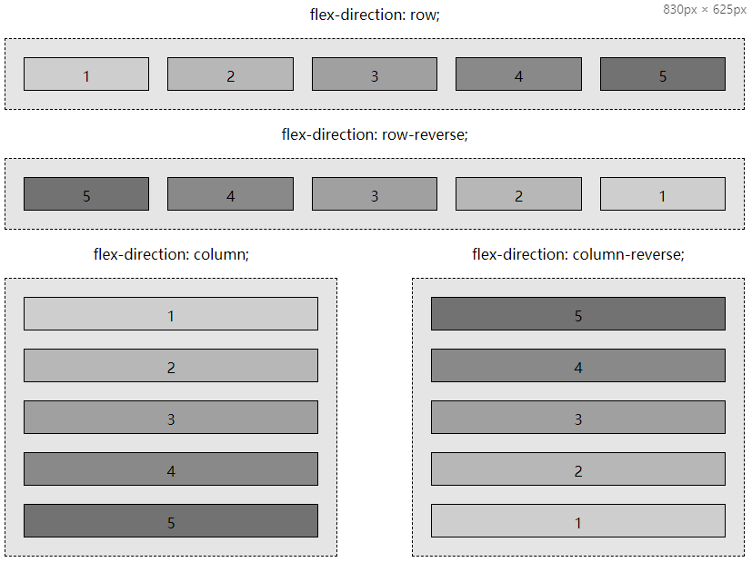

### 2.3 flex-wrap

如果 flex 项不能全部放入 flex 容器的主轴上，默认情况下 flex 项不会换行，flex 项会**溢出**或者**调整大小**。`flex-wrap`属性就可以让放不下的 flex 项进行换行，它的值有`nowrap`（默认值）、`wrap`、`wrap-reverse`。其中`wrap`是向交叉轴正方向进行换行，`wrap-reverse`是向交叉轴反方向进行换行。

要特别提一点，放不放得下是考虑的是[布局尺寸](./2.盒模型.md#_4-1-展示尺寸与布局尺寸)，这跟[浮动上跳](./5.定位与浮动.md#_3-5-边距对浮动的影响)是一样的基本规则。还有另外一点，flex 项不换行，flex 项不见得是**溢出**，可能是**调整大小**，可以看[flex-shrink](./8.弹性盒布局.md#_3-3-flex-shrink)这节。

```html
<html>
  <head>
    <style>
      article {
        width: 450px;
      }
      div {
        background-color: rgba(0, 0, 0, 0.1);
        font-family: monospace;
      }
      article > div {
        display: flex;
        border: 1px dashed;
        padding: 10px;
      }
      div > div {
        border: 1px solid;
        margin: 10px;
        padding: 0.5em 1em;
        text-align: center;
      }
      p {
        text-align: center;
      }
    </style>
  </head>
  <body>
    <article>
      <p>flex-wrap: nowrap;</p>
      <div style="flex-wrap: nowrap">
        <div>A</div>
        <div>BB</div>
        <div>CCC</div>
        <div>DDDD</div>
        <div>EEE<br />EE</div>
        <div>FFF<br />FFF</div>
        <div>GGGG<br />GGGG</div>
        <div>HHH<br />HHH<br />HHH</div>
      </div>
    </article>
    <article>
      <p>flex-wrap: wrap;</p>
      <div style="flex-wrap: wrap">
        <div>A</div>
        <div>BB</div>
        <div>CCC</div>
        <div>DDDD</div>
        <div>EEE<br />EE</div>
        <div>FFF<br />FFF</div>
        <div>GGGG<br />GGGG</div>
        <div>HHH<br />HHH<br />HHH</div>
      </div>
    </article>
    <article>
      <p>flex-wrap: wrap-reverse;</p>
      <div style="flex-wrap: wrap-reverse">
        <div>A</div>
        <div>BB</div>
        <div>CCC</div>
        <div>DDDD</div>
        <div>EEE<br />EE</div>
        <div>FFF<br />FFF</div>
        <div>GGGG<br />GGGG</div>
        <div>HHH<br />HHH<br />HHH</div>
      </div>
    </article>
  </body>
</html>
```

以上代码效果图：  
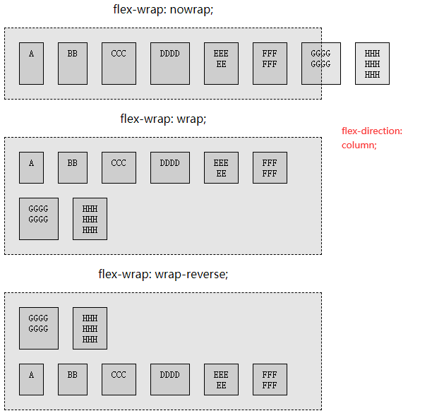

### 2.4 flex-flow

`flex-flow`属性其实就是`flex-direction`和`flex-wrap`的合并写法，比如`flex-flow: row wrap`、`flex-flow: wrap column`。我们强烈建议使用该属性替代那两种属性。

```html
<html>
  <head>
    <style>
      /* 为了让article的height: 70%生效 */
      body,
      html {
        height: 100%;
        margin: 0;
      }
      article {
        float: left;
        width: 30%;
        margin: 0 1.5%;
        height: 60%;
      }
      div {
        background-color: rgba(0, 0, 0, 0.1);
        font-family: monospace;
      }
      article > div {
        display: flex;
        height: 95%;
        border: 1px dashed;
        padding: 10px;
      }
      div > div {
        border: 1px solid;
        margin: 10px;
        padding: 0.5em;
        text-align: center;
      }
      p {
        text-align: center;
      }
    </style>
  </head>
  <body>
    <article>
      <p>flex-flow: column nowrap;</p>
      <div style="flex-flow: column nowrap">
        <div>A</div>
        <div>BB</div>
        <div>CCC</div>
        <div>DDDD</div>
        <div>EEE<br />EE</div>
        <div>FFF<br />FFF</div>
        <div>GGGG<br />GGGG</div>
        <div>HHH<br />HHH<br />HHH</div>
      </div>
    </article>
    <article>
      <p>flex-flow: column wrap;</p>
      <div style="flex-flow: column wrap">
        <div>A</div>
        <div>BB</div>
        <div>CCC</div>
        <div>DDDD</div>
        <div>EEE<br />EE</div>
        <div>FFF<br />FFF</div>
        <div>GGGG<br />GGGG</div>
        <div>HHH<br />HHH<br />HHH</div>
      </div>
    </article>
    <article>
      <p>flex-flow: column wrap-reverse;</p>
      <div style="flex-flow: column wrap-reverse">
        <div>A</div>
        <div>BB</div>
        <div>CCC</div>
        <div>DDDD</div>
        <div>EEE<br />EE</div>
        <div>FFF<br />FFF</div>
        <div>GGGG<br />GGGG</div>
        <div>HHH<br />HHH<br />HHH</div>
      </div>
    </article>
  </body>
</html>
```

以上代码效果图：  
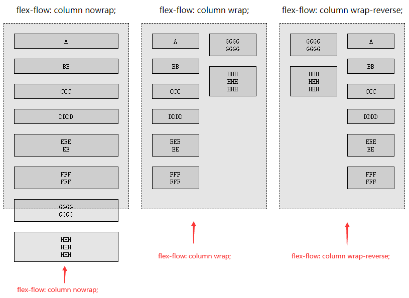

### 2.5 justify-content

`justify-content`属性设置在 flex 容器上，用于决定 flex 项在**主轴**上的对齐方式。它的值有`flex-start | flex-end | center | space-between | space-around | space-evenly`。

- `flex-start`：默认值，让所有 flex 项进行主轴 start 方向对齐，也就是让剩余空间全部放到主轴 end 方向。
- `flex-end`：让所有 flex 项进行主轴 end 方向对齐，也就是让剩余空间全部放到主轴 start 方向。
- `center`：让所有 flex 项在主轴中间对齐，也就是让剩余空间放到主轴两边，flex 项之间不留空隙。
- `space-between`：flex 项之间的空间会相同，第一个 flex 项与 start 之间不留空隙，最后一个 flex 项与 end 之间不留空隙。
- `space-around`：flex 项之间的空间会相同，第一个 flex 项与 start 有空隙而其数值是 flex 项之间空隙的一半，最后一个 flex 项与 end 有空隙而其数值是 flex 项之间空隙的一半。
- `space-evenly`：flex 项之间的空间会相同，第一个 flex 项与 start 有空隙而其数值就等于 flex 项之间的空隙，最后一个 flex 项与 end 有空隙而其数值就等于 flex 项之间的空隙。

```html
<html>
  <head>
    <style>
      div {
        background-color: rgba(0, 0, 0, 0.1);
        font-family: monospace;
      }
      article {
        margin: 15px auto;
      }
      article > div {
        display: flex;
        border: 1px dashed;
      }
      div > div {
        border: 1px solid;
        height: 30px;
        margin: 5px;
        padding: 5px;
        line-height: 30px;
        text-align: center;
      }
      p {
        text-align: center;
        margin-bottom: 3px;
      }
    </style>
  </head>
  <body>
    <article>
      <p>justify-content: flex-start;</p>
      <div style="justify-content: flex-start;">
        <div>A</div>
        <div>BBB</div>
        <div>CCCCCC</div>
      </div>
    </article>
    <article>
      <p>justify-content: flex-end;</p>
      <div style="justify-content: flex-end;">
        <div>A</div>
        <div>BBB</div>
        <div>CCCCCC</div>
      </div>
    </article>
    <article>
      <p>justify-content: center;</p>
      <div style="justify-content: center;">
        <div>A</div>
        <div>BBB</div>
        <div>CCCCCC</div>
      </div>
    </article>
    <article>
      <p>justify-content: space-between;</p>
      <div style="justify-content: space-between;">
        <div>A</div>
        <div>BBB</div>
        <div>CCCCCC</div>
      </div>
    </article>
    <article>
      <p>justify-content: space-around;</p>
      <div style="justify-content: space-around;">
        <div>A</div>
        <div>BBB</div>
        <div>CCCCCC</div>
      </div>
    </article>
    <article>
      <p>justify-content: space-evenly;</p>
      <div style="justify-content: space-evenly;">
        <div>A</div>
        <div>BBB</div>
        <div>CCCCCC</div>
      </div>
    </article>
  </body>
</html>
```

以上代码效果图：  
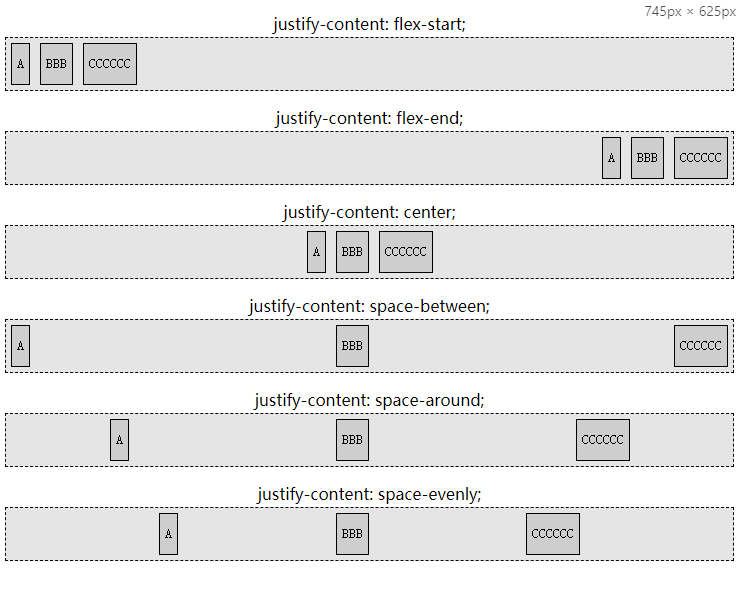

如果主轴上没有剩余空间，使用`justify-content`，**溢出**会是个什么情况？**换行**又会是个什么情况？

1. `justify-content：flex-start`就是默认情况，它的溢出表现还有换行表现也是默认情况就不赘述了。

2. `justify-content：flex-end`让元素在 end 端对齐，但是元素的顺序是从 start 到 end，那么溢出表现就是 start 这一端溢出了；换行表现的话与上一行一样，在 end 端对齐。可以看下面的示意图。

   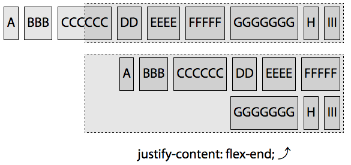

3. `justify-content：center`让元素在中间对齐，元素的顺序是从 start 到 end，那么溢出表现应该是 start 和 end 两端都会溢出；换行表现的话与上一行一样，在中间对齐。可以看下面的示意图。

   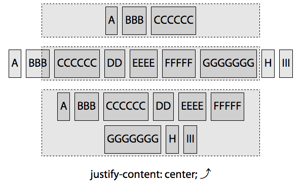

4. `justify-content：space-between`让首尾元素紧挨着 start 和 end，空间平分。感觉溢出从哪端都一样，其实就是采用的默认溢出也就是 end 这一端溢出；换行表现的话与上一行一样，让首尾元素紧挨着 start 和 end，空间平分。可以看下面的示意图。

   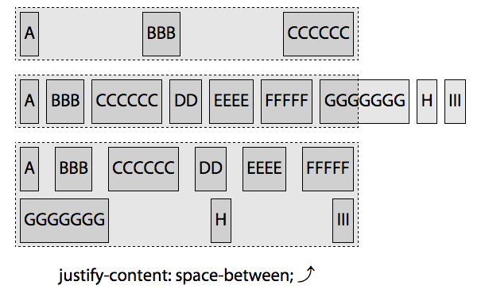

5. `justify-content：space-around`像是`center`对齐，只不过让剩余空间分布在了 flex 之间，最后靠近 start 和 end 的空间只有一半大小。溢出与`center`情况一样，也就是从 start 和 end 两端溢出的；换行表现的话与上一行一样，flex 项之间空间相同，靠近 start 和 end 的空间只有 flex 项之间空间一半大小。可以看下面的示意图。

   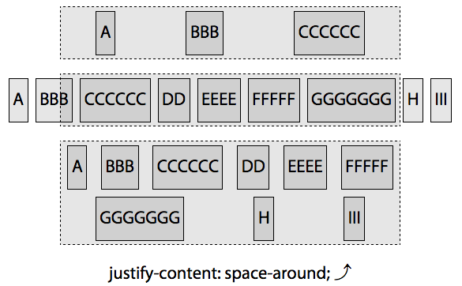

6. `justify-content：space-evenly`也像是`center`对齐，只不过让剩余空间分布在了 flex 之间，最后靠近 start 和 end 的空间也与 flex 项之间空间相等。溢出与`center`情况一样，也就是从 start 和 end 两端溢出的；换行表现的话与上一行一样，flex 项之间空间相同，靠近 start 和 end 的空间与 flex 项之间空间相等。可以看下面的示意图。

   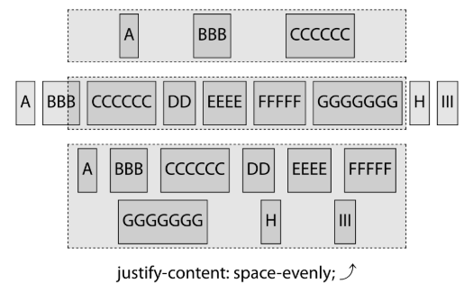

### 2.6 等分布局改造

在上一章的等分布局是使用浮动实现的，会有[空白间隔问题](./7.多列布局.md#_4-2-空白间隔问题)，虽然可以使用外边距来解决，然后为了让空白间隔与每列进行关联，还使用了稍微复杂点的计算。如果我们使用弹性盒布局，再配合`justify-content`属性控制剩余空间，就可以很好的解决这些问题。

```html
<html>
  <head>
    <style type="text/css">
      /* 少一个空隙的话可以将space-evenly换成space-between */
      .parent {
        display: flex;
        justify-content: space-evenly;
        border: 1px solid red;
        width: 500px;
      }
      .parent > div {
        width: 20%;
        height: 100px;
      }
      .parent > div:nth-of-type(1) {
        background-color: red;
      }
      .parent > div:nth-of-type(2) {
        background-color: yellow;
      }
      .parent > div:nth-of-type(3) {
        background-color: blue;
      }
      .parent > div:nth-of-type(4) {
        background-color: green;
      }
    </style>
  </head>
  <body>
    <div class="parent">
      <div class="col"></div>
      <div class="col"></div>
      <div class="col"></div>
      <div class="col"></div>
    </div>
  </body>
  <html></html>
</html>
```

### 2.7 align-items

`align-items`设置在 flex 容器上，用于决定**一行**中的 flex 项在**交叉轴**上的对齐方式。它的值有`flex-start | flex-end | center | baseline | stretch`。

与内联元素在垂直方向的对齐方式很像，`align-items`会控制一行中高低不齐的 flex 项进行某种“垂直”方向的对齐。

- `flex-start`：让 flex 项与交叉轴的 start 对齐。`flex-direction: row`的话，就是顶部对齐，是**布局尺寸**顶部。
- `flex-end`：让 flex 项与交叉轴的 end 对齐。`flex-direction: row`的话，就是底部对齐，是**布局尺寸**底部。
- `center`：让 flex 项的中心与交叉轴长度的中点对齐。注意是**布局尺寸**交叉轴方向上的中心点，也就是要算 margin（即使负值）。
- `baseline`：让 flex 项的 baseline 与这一行的 baseline 对齐。
- `stretch`：默认值，让可拉伸的 flex 项进行拉伸，拉伸到与这一行高度最大的 flex 项一样的高度。拉伸的参考者和被拉伸者，都作用于**布局尺寸**的。

```html
<html>
  <head>
    <style>
      article {
        width: 500px;
        display: flow-root;
        margin: 10px;
      }
      div {
        background-color: rgba(0, 0, 0, 0.1);
        font-family: monospace;
      }
      p {
        float: left;
        text-align: center;
        width: 200px;
        height: 100px;
        line-height: 100px;
        margin: 0px;
      }
      article > div {
        float: left;
        display: flex;
        flex-flow: row nowrap;
        border: 1px dashed;
        padding: 10px;
      }
      div > div {
        border: 1px solid;
        margin: 5px 10px;
        padding: 0.5em;
        text-align: center;
      }
    </style>
  </head>
  <body>
    <article>
      <p>align-items: flex-start;</p>
      <div style="align-items: flex-start;">
        <div>One</div>
        <div>Two<br />Two</div>
        <div>Three<br />Three<br />Three</div>
        <div>Four<br />Four<br />Four<br />Four</div>
      </div>
    </article>
    <article>
      <p>align-items: flex-end;</p>
      <div style="align-items: flex-end;">
        <div>One</div>
        <div>Two<br />Two</div>
        <div>Three<br />Three<br />Three</div>
        <div>Four<br />Four<br />Four<br />Four</div>
      </div>
    </article>
    <article>
      <p>align-items: center;</p>
      <div style="align-items: center;">
        <div>One</div>
        <div>Two<br />Two</div>
        <div>Three<br />Three<br />Three</div>
        <div>Four<br />Four<br />Four<br />Four</div>
      </div>
    </article>
    <article>
      <p>align-items: stretch;</p>
      <div style="align-items: stretch;">
        <div>One</div>
        <div>Two<br />Two</div>
        <div>Three<br />Three<br />Three</div>
        <div>Four<br />Four<br />Four<br />Four</div>
      </div>
    </article>
    <article>
      <p>align-items: baseline;</p>
      <div style="align-items: baseline;">
        <div>One</div>
        <div>Two<br />Two</div>
        <div>Three<br />Three<br />Three</div>
        <div>Four<br />Four<br />Four<br />Four</div>
      </div>
    </article>
  </body>
</html>
```

以上代码效果图：  
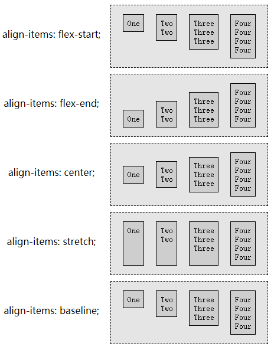

`align-items: flex-start`、`align-items: flex-end`以及`align-items: center`都还挺简单的。

`align-items: stretch`是有拉伸有**限制**的，设置`height`是不能拉伸了，设置`max-heigh`时拉伸不能超过这个高度。其他的压缩也类似的限制。然后需要注意的是，被作为拉伸参考对象的 flex 项以及被拉伸的 flex 项，它们都是拿**布局尺寸**来说的，并不是把 border 框拉伸到一样高度。

`align-items: baseline`和内联排列中的[baseline](./2.盒模型.md#_5-4-vertical-align)不是很相同。因为确定 flex 项的 baseline 时，是考虑 flex 项内部**第一行**文本的 baseline 位置的（内联排列一般是最后一行），当然，如果 flex 项内部没有内容，那 flex 项的 baseline 是 flex 项的 margin-bottom 位置（受 flex-direction 影响）。然后再去确定 flex 容器这一行的 baseline，所有 flex 项 baseline 距离这行顶部最远的，会作为这一行最终的 baseline。

```html
<html>
  <head>
    <style>
      div {
        background-color: rgba(0, 0, 0, 0.1);
      }
      article {
        position: relative;
        width: 350px;
      }
      article > div {
        display: flex;
        flex-flow: row wrap;
        border: 1px dashed;
      }
      article > div > div {
        border: 1px solid;
        margin: 0 10px;
        text-align: center;
      }
      .c,
      .h {
        margin-top: 10px;
      }
      .d,
      .i {
        margin-top: 20px;
      }
      .j {
        font-size: 3rem;
      }
      p {
        text-align: center;
      }
      .f:after,
      .j:after {
        content: "";
        position: absolute;
        left: 0;
        right: 0;
        border-top: 1px solid green;
      }
      .f:after {
        top: 4.72em;
      }
      .j:after {
        top: 4.95em;
      }
    </style>
  </head>
  <body>
    <article>
      <p>align-items: baseline;</p>
      <div style="align-items: baseline;">
        <div class="a">A</div>
        <div class="b">BB<br />BB</div>
        <div class="c">CCC<br />CCC<br />CCC</div>
        <div class="d">DDDD<br />DDDD<br />DDDD<br />DDDD</div>
        <div class="e">EEEEE<br />EEEEE<br />EEEEE<br />EEEEE<br />EEEEE</div>
        <div class="f">FFFFFF<br />FFFFFF<br />FFFFFF<br />FFFFFF<br />FFFFFF<br />FFFFFF</div>
        <div class="g">GGGGG<br />GGGGG<br />GGGGG<br />GGGGG<br />GGGGG</div>
        <div class="h">HHHH<br />HHHH<br />HHHH<br />HHHH</div>
        <div class="i">III<br />III<br />III</div>
        <div class="j">JJ<br />JJ</div>
      </div>
    </article>
  </body>
</html>
```

以上代码效果图：  
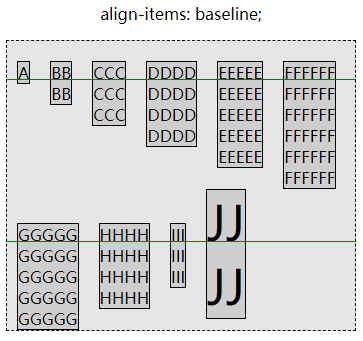

### 2.8 align-content

上一小节的`align-items`是让**一行里的 flex 项**在交叉轴方向上进行对齐，而这一小节要说的是`align-content`，让 flex 容器中**所有行**在交叉轴方向上进行对齐。

也就是说`align-content`是支持多行的，不支持`flex-wrap: nowrap`。它的取值`flex-start | flex-end | center | space-between | space-around | space-evenly | stretch`。

- `flex-start`：让所有行与交叉轴 start 进行对齐，也就是让剩余空间全部放到交叉轴 end 方向。
- `flex-end`：让所有行与交叉轴 end 进行对齐，也就是让剩余空间全部放到主轴 start 方向。
- `center`：让所有行在交叉轴中间对齐，也就是让剩余空间放到交叉轴两边，行与行之间不留空隙。
- `space-between`：行与行之间的空间会相同，第一行与 start 之间不留空隙，最后一行与 end 之间不留空隙。
- `space-around`：行与行之间的空间会相同，第一行与 start 有空隙而其数值是行与行之间空隙的一半，最后一行与 end 有空隙而其数值是行与行之间空隙的一半。
- `space-evenly`：行与行之间的空间会相同，第一行与 start 有空隙而其数值就等于行与行之间的空隙，最后一行与 end 有空隙而其数值就等于行与行之间的空隙。
- `stretch`：默认值，行与行之间没有空隙（与 start 和 end 也没有），会将剩余空间平分给每行（行内），让它们形成一种拉伸的效果。

```html
<html>
  <head>
    <style>
      body {
        font-size: 12px;
        text-align: center;
      }
      article {
        float: left;
        width: 250px;
        margin-left: 20px;
        margin-bottom: 10px;
      }
      article > div {
        display: flex;
        flex-direction: row;
        align-items: stretch;
        flex-wrap: wrap;
        border: 1px dashed;
        height: 280px;
        background-image: repeating-linear-gradient(
          to bottom,
          white 0px,
          white 5px,
          rgba(0, 0, 0, 0.075) 5px,
          rgba(0, 0, 0, 0.075) 10px
        );
      }
      div {
        background-color: rgba(0, 0, 0, 0.1);
      }
      div > div {
        border: 1px solid;
        flex: 1 0 auto;
        background-color: rgb(208, 208, 208);
        letter-spacing: 2px;
      }
      .k {
        flex: 1 0 95%;
      }
      p {
        margin: 0;
      }
    </style>
  </head>
  <body>
    <article>
      <p>align-content: stretch;</p>
      <div style="align-content: stretch;">
        <div>A</div>
        <div>BB<br />BB</div>
        <div>CCC<br />CCC<br />CCC</div>
        <div>DDDD<br />DDDD<br />DDDD<br />DDDD</div>
        <div>EEEEE<br />EEEEE<br />EEEEE<br />EEEEE<br />EEEEE</div>
        <div>FFFFFF<br />FFFFFF<br />FFFFFF<br />FFFFFF<br />FFFFFF<br />FFFFFF</div>
        <div>GGGGG<br />GGGGG<br />GGGGG<br />GGGGG</div>
        <div>HHHH<br />HHHH<br />HHHH</div>
        <div>III<br />III</div>
        <div>JJ</div>
        <div class="k">K</div>
      </div>
    </article>
    <article>
      <p>align-content: flex-start</p>
      <div style="align-content: flex-start">
        <div>A</div>
        <div>BB<br />BB</div>
        <div>CCC<br />CCC<br />CCC</div>
        <div>DDDD<br />DDDD<br />DDDD<br />DDDD</div>
        <div>EEEEE<br />EEEEE<br />EEEEE<br />EEEEE<br />EEEEE</div>
        <div>FFFFFF<br />FFFFFF<br />FFFFFF<br />FFFFFF<br />FFFFFF<br />FFFFFF</div>
        <div>GGGGG<br />GGGGG<br />GGGGG<br />GGGGG</div>
        <div>HHHH<br />HHHH<br />HHHH</div>
        <div>III<br />III</div>
        <div>JJ</div>
        <div class="k">K</div>
      </div>
    </article>
    <article>
      <p>align-content: flex-end</p>
      <div style="align-content: flex-end">
        <div>A</div>
        <div>BB<br />BB</div>
        <div>CCC<br />CCC<br />CCC</div>
        <div>DDDD<br />DDDD<br />DDDD<br />DDDD</div>
        <div>EEEEE<br />EEEEE<br />EEEEE<br />EEEEE<br />EEEEE</div>
        <div>FFFFFF<br />FFFFFF<br />FFFFFF<br />FFFFFF<br />FFFFFF<br />FFFFFF</div>
        <div>GGGGG<br />GGGGG<br />GGGGG<br />GGGGG</div>
        <div>HHHH<br />HHHH<br />HHHH</div>
        <div>III<br />III</div>
        <div>JJ</div>
        <div class="k">K</div>
      </div>
    </article>
    <article>
      <p>align-content: center;</p>
      <div style="align-content: center">
        <div>A</div>
        <div>BB<br />BB</div>
        <div>CCC<br />CCC<br />CCC</div>
        <div>DDDD<br />DDDD<br />DDDD<br />DDDD</div>
        <div>EEEEE<br />EEEEE<br />EEEEE<br />EEEEE<br />EEEEE</div>
        <div>FFFFFF<br />FFFFFF<br />FFFFFF<br />FFFFFF<br />FFFFFF<br />FFFFFF</div>
        <div>GGGGG<br />GGGGG<br />GGGGG<br />GGGGG</div>
        <div>HHHH<br />HHHH<br />HHHH</div>
        <div>III<br />III</div>
        <div>JJ</div>
        <div class="k">K</div>
      </div>
    </article>
    <article>
      <p>align-content: space-between;</p>
      <div style="align-content: space-between;">
        <div>A</div>
        <div>BB<br />BB</div>
        <div>CCC<br />CCC<br />CCC</div>
        <div>DDDD<br />DDDD<br />DDDD<br />DDDD</div>
        <div>EEEEE<br />EEEEE<br />EEEEE<br />EEEEE<br />EEEEE</div>
        <div>FFFFFF<br />FFFFFF<br />FFFFFF<br />FFFFFF<br />FFFFFF<br />FFFFFF</div>
        <div>GGGGG<br />GGGGG<br />GGGGG<br />GGGGG</div>
        <div>HHHH<br />HHHH<br />HHHH</div>
        <div>III<br />III</div>
        <div>JJ</div>
        <div class="k">K</div>
      </div>
    </article>
    <article>
      <p>align-content: space-around;</p>
      <div style="align-content: space-around;">
        <div>A</div>
        <div>BB<br />BB</div>
        <div>CCC<br />CCC<br />CCC</div>
        <div>DDDD<br />DDDD<br />DDDD<br />DDDD</div>
        <div>EEEEE<br />EEEEE<br />EEEEE<br />EEEEE<br />EEEEE</div>
        <div>FFFFFF<br />FFFFFF<br />FFFFFF<br />FFFFFF<br />FFFFFF<br />FFFFFF</div>
        <div>GGGGG<br />GGGGG<br />GGGGG<br />GGGGG</div>
        <div>HHHH<br />HHHH<br />HHHH</div>
        <div>III<br />III</div>
        <div>JJ</div>
        <div class="k">K</div>
      </div>
    </article>
    <article>
      <p>align-content: space-evenly;</p>
      <div style="align-content: space-evenly;">
        <div>A</div>
        <div>BB<br />BB</div>
        <div>CCC<br />CCC<br />CCC</div>
        <div>DDDD<br />DDDD<br />DDDD<br />DDDD</div>
        <div>EEEEE<br />EEEEE<br />EEEEE<br />EEEEE<br />EEEEE</div>
        <div>FFFFFF<br />FFFFFF<br />FFFFFF<br />FFFFFF<br />FFFFFF<br />FFFFFF</div>
        <div>GGGGG<br />GGGGG<br />GGGGG<br />GGGGG</div>
        <div>HHHH<br />HHHH<br />HHHH</div>
        <div>III<br />III</div>
        <div>JJ</div>
        <div class="k">K</div>
      </div>
    </article>
  </body>
</html>
```

以上代码效果图：  
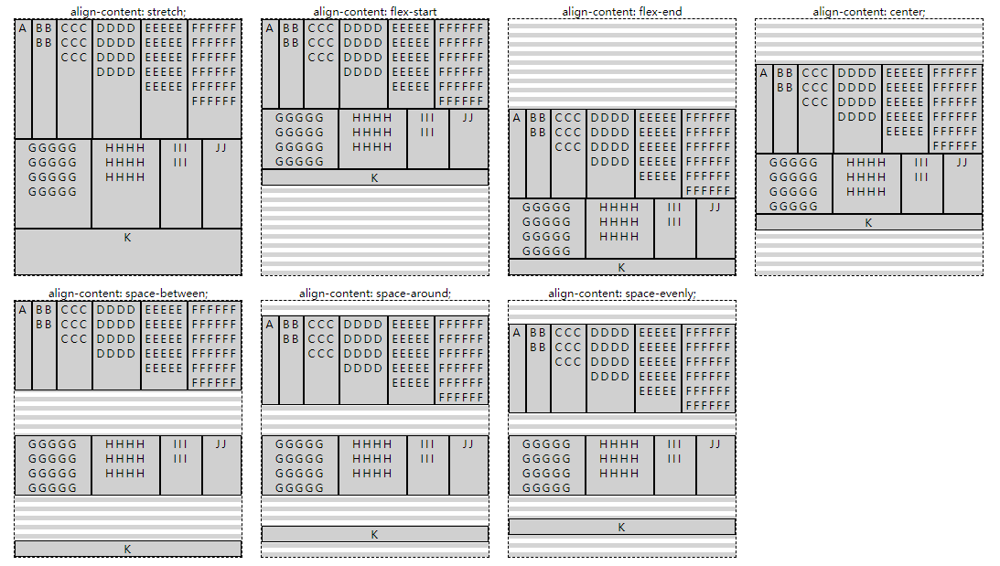

然后溢出的话与`justify-content`基本类似，`align-content: start`、`align-content: space-between`以及`align-content: stretch`都是在 end 端溢出，`align-content: center`、`align-content: space-around`以及`align-content: space-evenly`是两端溢出，`align-content: end`是 start 端溢出。

## 三、flex 项

**flex 容器**的**直接子元素**作为**flex 项**，就算直接子元素是文本也会作为一个**匿名 flex 项**，直接子元素使用`:: before`或`:: after`生成的元素也算作**flex 项**。

### 3.1 flex 项上的无效设置

1. 对 flex 项使用`float`和`clear`是没有效果的，会忽略这两个设置。

   ```html
   <html>
     <head>
       <style type="text/css">
         .parent {
           display: flex;
           border: 1px solid red;
           width: 500px;
         }
         .parent > div {
           width: 100px;
           height: 100px;
         }
         .parent > div:nth-of-type(1) {
           background-color: red;
         }
         .parent > div:nth-of-type(2) {
           float: right;
           background-color: yellow;
         }
         .parent > div:nth-of-type(3) {
           background-color: blue;
         }
       </style>
     </head>
     <body>
       <div class="parent">
         <div class="col"></div>
         <div class="col"></div>
         <div class="col"></div>
       </div>
     </body>
     <html></html>
   </html>
   ```

2. 内联级别的 flex 项会被“块状化”，也就是可以显示设置宽高，与其他的 flex 项没有什么差别。

   ```html
   <html>
     <head>
       <style type="text/css">
         .parent {
           display: flex;
           border: 1px solid red;
           width: 500px;
         }
         span {
           border: 1px solid green;
           width: 85px;
           height: 85px;
         }
         .div {
           width: 100px;
           height: 100px;
           border: 1px solid blue;
           margin: 10px;
         }
         a {
           border: 1px solid green;
           width: 30px;
           height: 30px;
         }
       </style>
     </head>
     <body>
       <div class="parent">
         <span>This is text.</span>
         <div class="div"></div>
         <a>link</a>
       </div>
     </body>
     <html></html>
   </html>
   ```

3. `vertical-align`也会对 flex 项无效，不过对 flex 项**内部**文本等内联元素有效

   ```html
   <html>
     <head>
       <style type="text/css">
         .parent {
           display: flex;
           border: 1px solid red;
           width: 500px;
         }
         span {
           border: 1px solid green;
           width: 85px;
           height: 85px;
           line-height: 85px;
           vertical-align: middle;
         }
         .div {
           width: 100px;
           height: 100px;
           border: 1px solid blue;
           margin: 10px;
         }
         a {
           border: 1px solid green;
           width: 30px;
           height: 30px;
           line-height: 30px;
           vertical-align: middle;
         }
       </style>
     </head>
     <body>
       <div class="parent">
         <span>This is text.</span>
         <div class="div"></div>
         <a>link</a>
       </div>
     </body>
     <html></html>
   </html>
   ```

4. 大部分与布局有关的属性都会在 flex 项上失效，但是除了绝对定位以外，它在 flex 容器中不参与 flex 布局，脱离文档流，但是会受到 flex 的一部分影响。

   ```html
   <html>
     <head>
       <style type="text/css">
         .parent {
           display: flex;
           border: 1px solid red;
           width: 500px;
         }
         span {
           border: 1px solid green;
           width: 85px;
           height: 85px;
           line-height: 85px;
           vertical-align: middle;
         }
         .div {
           position: absolute;
           align-self: center; /* 仍然有影响 */
           width: 100px;
           height: 100px;
           border: 1px solid blue;
           margin: 10px;
         }
         a {
           border: 1px solid green;
           width: 30px;
           height: 30px;
           line-height: 30px;
           vertical-align: middle;
         }
       </style>
     </head>
     <body>
       <div class="parent">
         <span>This is text.</span>
         <div class="div"></div>
         <a>link</a>
       </div>
     </body>
     <html></html>
   </html>
   ```

### 3.2 flex-grow

`flex-grow`属性设置在 flex 项上，指定 flex 项的增长因子，默认值是 0，也可以是小数，但是不能是负数。如果 flex 容器有剩余空间，那么会让这些空间按照各个 flex 项增长因子所占据的**比例**来分配。

```html
<html>
  <head>
    <style>
      div {
        background-color: rgba(0, 0, 0, 0.1);
      }
      article {
        font-size: 15px;
        text-align: center;
      }
      p {
        width: 750px;
      }
      article > div {
        display: flex;
        width: 750px;
        border: 1px dashed;
      }
      div > div {
        border: 1px solid;
        margin: 5px;
        padding: 30px 0;
        width: 90px;
        box-sizing: border-box;
      }
    </style>
  </head>
  <body>
    <article>
      <p>Flex container</p>
      <div>
        <div style="flex-grow: 0">flex-grow: 0</div>
        <div style="flex-grow: 0">flex-grow: 0</div>
        <div style="flex-grow: 0">flex-grow: 0</div>
      </div>
    </article>
    <article>
      <p>Flex container</p>
      <div>
        <div style="flex-grow: 0">flex-grow: 0</div>
        <div style="flex-grow: 0">flex-grow: 0</div>
        <div style="flex-grow: 1">flex-grow: 1</div>
      </div>
    </article>
    <article>
      <p>Flex container</p>
      <div>
        <div style="flex-grow: 1">flex-grow: 1</div>
        <div style="flex-grow: 1">flex-grow: 1</div>
        <div style="flex-grow: 3">flex-grow: 3</div>
      </div>
    </article>
    <article>
      <p>Flex container</p>
      <div>
        <div style="flex-grow: 0.5">flex-grow: 0.5</div>
        <div style="flex-grow: 0.5">flex-grow: 0.5</div>
        <div style="flex-grow: 1.5">flex-grow: 1.5</div>
      </div>
    </article>
  </body>
</html>
```

以上代码效果图：  
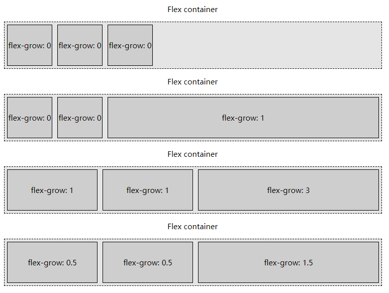

### 3.3 flex-shrink

`flex-shrink`属性也是设置在 flex 项上的，指定 flex 项的收缩因子，默认值是 1，可以是小数，但是不能是负数。如果 flex 容器一行的空间不够也没有进行换行，那么会让各个 flex 项按照各自的收缩因子所占据的**比例**来进行收缩。实在压缩不了就会溢出（前提是 nowrap）。

```html
<html>
  <head>
    <style>
      div {
        background-color: rgba(0, 0, 0, 0.1);
      }
      article {
        font-size: 15px;
        text-align: center;
      }
      p {
        width: 750px;
      }
      article > div {
        display: flex;
        width: 750px;
        border: 1px dashed;
      }
      div > div {
        border: 1px solid;
        margin: 5px;
        padding: 30px 0;
        width: 290px;
        box-sizing: border-box;
      }
    </style>
  </head>
  <body>
    <article>
      <p>Flex container</p>
      <div>
        <div style="flex-shrink: 0">flex-shrink: 0</div>
        <div style="flex-shrink: 0">flex-shrink: 0</div>
        <div style="flex-shrink: 0">flex-shrink: 0</div>
      </div>
    </article>
    <article>
      <p>Flex container</p>
      <div>
        <div style="flex-shrink: 0">flex-shrink: 0</div>
        <div style="flex-shrink: 0">flex-shrink: 0</div>
        <div style="flex-shrink: 1">flex-shrink: 1</div>
      </div>
    </article>
    <article>
      <p>Flex container</p>
      <div>
        <div style="flex-shrink: 1">flex-shrink: 1</div>
        <div style="flex-shrink: 1">flex-shrink: 1</div>
        <div style="flex-shrink: 3">flex-shrink: 3</div>
      </div>
    </article>
    <article>
      <p>Flex container</p>
      <div>
        <div style="flex-shrink: 0.5">flex-shrink: 0.5</div>
        <div style="flex-shrink: 0.5">flex-shrink: 0.5</div>
        <div style="flex-shrink: 1.5">flex-shrink: 1.5</div>
      </div>
    </article>
  </body>
</html>
```

以上代码效果图：  
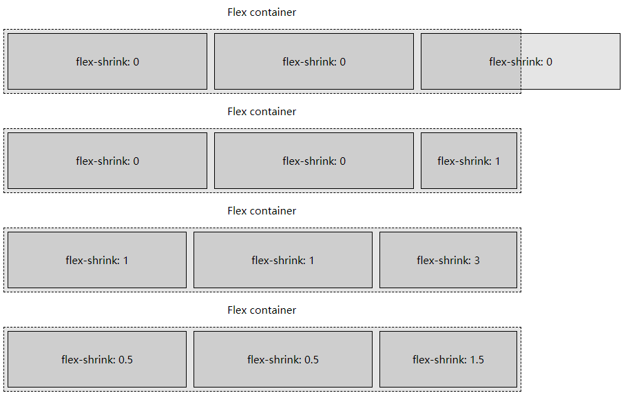

在[flex-wrap](./8.弹性盒布局.md#_2-3-flex-wrap)那节提过“flex 项不换行，flex 项不见得是**溢出**，可能是**调整大小**”，原因是 flex-shrink 默认值是 1，flex 容器宽度不够所有 flex 项的显式设置总宽时，就会压缩各自的宽度（在主轴上占用空间）。

```html
<html>
  <head>
    <style>
      /*没有溢出，调整了大小*/
      .outer {
        width: 300px;
        display: flex;
        background-color: skyblue;
        flex-wrap: nowrap;
      }
      .outer div {
        box-sizing: border-box;
        height: 100px;
        width: 100px;
      }
      .div1 {
        border: 1px solid red;
      }
      .div2 {
        border: 1px solid blue;
      }
      .div3 {
        border: 1px solid green;
      }
      .div4 {
        border: 1px solid yellow;
      }
    </style>
  </head>
  <body>
    <div class="outer">
      <div class="div1">1</div>
      <div class="div2">2</div>
      <div class="div3">3</div>
      <div class="div4">4</div>
    </div>
  </body>
</html>
```

### 3.4 flex-basis

`flex-basis`属性也是设置在 flex 项上的，用于决定 flex 项的初始大小或默认大小，这个大小是相对于“盒模型”而言（标准盒模型还是 IE 盒模型）。它的优先级会**高于**`width`设置（column 排列时就是`height`），可以使用具体**长度数值**或者**百分数**。但是它的优先级不会高于`min-width`、`min-height`、`max-width`、`max-height`。

```html
<html>
  <head>
    <style>
      body {
        font-size: 20px;
        text-align: center;
      }
      div {
        background-color: rgba(0, 0, 0, 0.1);
      }
      article {
        width: 520px;
        box-sizing: content-box;
      }
      article > div {
        display: flex;
        border: 1px dashed;
        padding: 2px;
        min-height: 100px;
      }
      div > div {
        border: 1px solid;
        margin: 2px;
        padding: 40px 0;
        font-size: 1rem;
      }
    </style>
  </head>
  <body>
    <article>
      <p>Flex container</p>
      <div>
        <div style="width: 100px">width: 100px</div>
        <div style="width: 200px">width: 200px</div>
        <div style="width: 300px">width: 300px</div>
      </div>
    </article>
    <article>
      <p>Flex container</p>
      <div>
        <div
          style="width: 100px;
    flex-basis: 200px;"
        >
          width: 100px;<br />
          flex-basis: 200px;
        </div>
        <div
          style="width: 200px;
    flex-basis: 300px;"
        >
          width: 200px;<br />
          flex-basis: 300px;
        </div>
        <div
          style="width: 300px;
    flex-basis: 100px;"
        >
          width: 300px;<br />
          flex-basis: 100px;
        </div>
      </div>
    </article>
  </body>
</html>
```

`flex-basis：content`中的`content`取值在很多浏览器中都没有实现，我们只是简单了解一下，它其实相当于`flex-basis: auto; width: auto;`，意思是 flex 项的大小完全取决于内容的大小。

`flex-basis：auto`比较常见，也是**默认设置**。表示 flex 项大小为“未成为 flex 项之前的大小”，也就是说会看`width`和`height`的值，如果`width`和`height`的值为`auto`，那么`flex-basis：auto`最后还是会取决于内容的大小。

```html
<html>
  <head>
    <style>
      body {
        font-size: 20px;
        text-align: center;
      }
      div {
        background-color: rgba(0, 0, 0, 0.1);
      }
      article {
        width: 540px;
        box-sizing: content-box;
      }
      article > div {
        display: flex;
        outline: 1px dashed;
        padding: 3px;
        min-height: 100px;
      }
      div > div {
        outline: 1px solid;
        margin: 3px;
        padding: 30px 0;
        font-size: 1rem;
      }
    </style>
  </head>
  <body>
    <article>
      <p>flex-basis: auto;没有显式设置宽度</p>
      <div>
        <div style="flex-basis: auto">
          flex-basis: auto<br />
          width: auto
        </div>
        <div style="flex-basis: auto">
          flex-basis: auto<br />
          width: auto
        </div>
        <div style="flex-basis: auto">
          flex-basis: auto<br />
          width: auto
        </div>
      </div>
    </article>
    <article>
      <p>flex-basis: auto;有显式设置宽度</p>
      <div>
        <div style="flex-basis: auto; width: 100px;">
          flex-basis: auto;<br />
          width: 100px;
        </div>
        <div style="flex-basis: auto; width: 150px">
          flex-basis: auto;<br />
          width: 150px;
        </div>
        <div style="flex-basis: auto; width: 200px">
          flex-basis: auto;<br />
          width: 200px;
        </div>
      </div>
    </article>
    <article>
      <p>flex-basis: auto;有显式设置宽度，但过大会自动收缩</p>
      <div>
        <div style="flex-basis: auto; width: 2000px">
          flex-basis: auto<br />
          width: 2000px
        </div>
        <div style="flex-basis: auto; width: 3000px">
          flex-basis: auto<br />
          width: 3000px
        </div>
        <div style="flex-basis: auto; width: 4000px">
          flex-basis: auto<br />
          width: 4000px
        </div>
      </div>
    </article>
  </body>
</html>
```

以上代码效果图：  
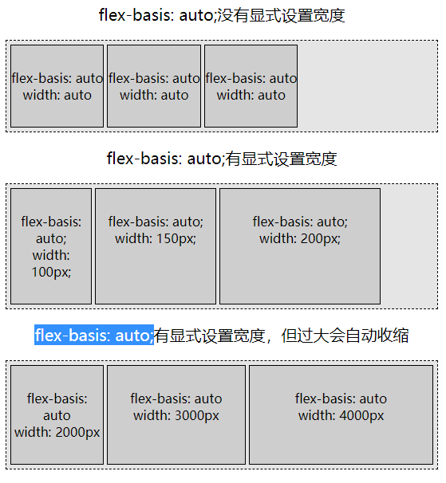

场景`flex-basis: auto; width: auto;`下，并且内容都是**文本**。如果所有 flex 项的收缩因子都为`0`，那么都不会换行；如果 flex 项的收缩因子都不为 0，那么按照各自的收缩因子进行收缩，收缩因子都一样大时，flex 项里的换行行数相似。

```html
<html>
  <head>
    <style>
      body {
        font-size: 20px;
        text-align: center;
      }
      div {
        background-color: rgba(0, 0, 0, 0.1);
      }
      article {
        width: 520px;
      }
      article > div {
        display: flex;
        border: 1px dashed;
        padding: 2px;
        min-height: 100px;
        flex-wrap: nowrap;
      }
      div > div {
        border: 1px solid;
        margin: 2px;
        padding: 10px 0;
        font-size: 1rem;
      }
      p {
        margin-bottom: 5px;
      }
      b {
        background-color: rgba(255, 255, 255, 0.3);
      }
    </style>
  </head>
  <body>
    <article>
      <p>same shrink factors</p>
      <div>
        <div style="flex-shrink: 1"><b>flex-shrink: 1</b> is set with a few words</div>
        <div style="flex-shrink: 1; background-color: rgba(0,0,0,0.2);">
          This has <b>flex-shrink: 1;</b> and <i>background-color: rgba(0, 0, 0, 0.2);</i> set with a lot of additional
          text, unlike other flex items across a few lines.
        </div>
        <div style="flex-shrink: 1">This too has <b>flex-shrink: 1</b> with a medium amount of extra content.</div>
      </div>
    </article>
    <article>
      <p>different shrink factors</p>
      <div>
        <div style="flex-shrink: .5"><b>flex-shrink: 0.5</b> is set with a few words</div>
        <div style="flex-shrink: 1; background-color: rgba(0,0,0,0.2);">
          This has <b>flex-shrink: 1;</b> and <i>background-color: rgba(0, 0, 0, 0.2);</i> set with a lot of additional
          text, unlike other flex items across a few lines.
        </div>
        <div style="flex-shrink: 1">This too has <b>flex-shrink: 1</b> with a medium amount of extra content.</div>
      </div>
    </article>
    <article>
      <p>null shrink factors</p>
      <div>
        <div style="flex-shrink: 0"><b>flex-shrink: 0</b> is set with a few words</div>
        <div style="flex-shrink: 0; background-color: rgba(0,0,0,0.2);">
          This has <b>flex-shrink: 0;</b> and <i>background-color: rgba(0, 0, 0, 0.2);</i> set with a lot of additional
          text, unlike other flex items across a few lines.
        </div>
        <div style="flex-shrink: 0">This too has <b>flex-shrink: 0</b> with a medium amount of extra content.</div>
      </div>
    </article>
  </body>
</html>
```

以上代码效果图：  
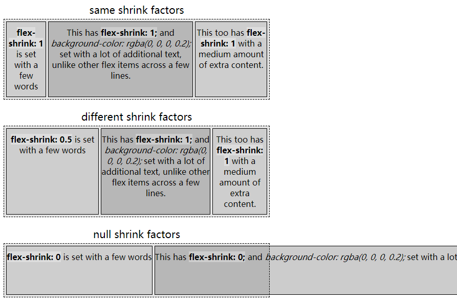

### 3.5 flex

`flex`属性是`flex-grow`、`flex-shrink`和`flex-basis`的缩写，我们强烈建议使用`flex`来替代那三个属性。

常用写法如下：

```css
/* 一个值, 无单位数字: flex-grow */
flex: 2;

/* 一个值, width/height: flex-basis */
flex: 10em;
flex: 30px;
flex: min-content;

/* 两个值: flex-grow | flex-basis */
flex: 1 30px;

/* 两个值: flex-grow | flex-shrink */
flex: 2 2;

/* 三个值: flex-grow | flex-shrink | flex-basis */
flex: 2 2 10%;
```

回顾一下默认值：

1. 如果没有声明`flex`，也没有声明`flex-grow`，那么增长因子默认为`0`。如果声明了`flex`但是省略了增长因子和收缩因子，那么增长因子默认为`1`。
2. 如果没有声明`flex`，也没有声明`flex-shrink`，那么收缩因子默认为`1`。如果声明了`flex`但是省略了收缩因子，其实收缩因子仍然是`1`。
3. 如果没有声明`flex`，也没有声明`flex-basis`，那么基础尺寸为`auto`。如果声明了`flex`但是省略了基础尺寸，那么基础尺寸默认为`0`。

`flex`属性还有几种取值：

- `flex: initial`：根据`width`属性来调整 flex 项的尺寸，同时允许收缩。其实就是`flex: 0 1 auto`。
- `flex: auto`：根据`width`属性来调整 flex 项的尺寸，同时允许收缩和增长。其实就是`flex: 1 1 auto`。
- `flex: none`：根据`width`属性来调整 flex 项的尺寸，不允许收缩和增长。其实就是`flex: 0 0 auto`。
- `flex: <number>`：增长因子设置为`<number>`，收缩因子和基础尺寸都为 0。

`flex: initial`的例子：

```html
<html>
  <head>
    <style>
      div {
        background-color: rgba(0, 0, 0, 0.1);
      }
      article > div {
        display: flex;
        outline: 1px dashed;
        padding: 3px;
      }
      article {
        width: 600px;
      }
      article:nth-of-type(odd) {
        width: 300px;
      }
      div > div {
        outline: 1px solid;
        margin: 3px;
        line-height: 1.5;
        min-height: 40px;
        text-align: center;
      }
      .initial div div {
        flex: 0 1 auto;
      }
      .hundred div > div {
        width: 50px;
      }
      p {
        text-align: left;
        padding-left: 100px;
      }
    </style>
  </head>
  <body>
    <article class="initial">
      <p>flex: initial;</p>
      <div>
        <div>A</div>
        <div>B B</div>
        <div>C C C</div>
        <div>D D D D</div>
        <div>E E E E E</div>
        <div>F F F F</div>
        <div>G G G</div>
        <div>H H</div>
        <div>I</div>
      </div>
    </article>
    <article class="initial">
      <p>flex: initial;</p>
      <div>
        <div>A</div>
        <div>B B</div>
        <div>C C C</div>
        <div>D D D D</div>
        <div>E E E E E</div>
        <div>F F F F</div>
        <div>G G G</div>
        <div>H H</div>
        <div>I</div>
      </div>
    </article>
    <article class="initial hundred">
      <p>flex: initial; width: 50px;</p>
      <div>
        <div>A</div>
        <div>B B</div>
        <div>C C C</div>
        <div>D D D D</div>
        <div>E E E E E</div>
        <div>F F F F</div>
        <div>G G G</div>
        <div>H H</div>
        <div>I</div>
      </div>
    </article>
    <article class="initial hundred">
      <p>flex: initial; width: 50px;</p>
      <div>
        <div>A</div>
        <div>B B</div>
        <div>C C C</div>
        <div>D D D D</div>
        <div>E E E E E</div>
        <div>F F F F</div>
        <div>G G G</div>
        <div>H H</div>
        <div>I</div>
      </div>
    </article>
  </body>
</html>
```

以上代码效果图：  
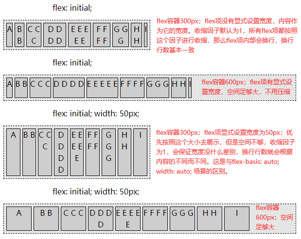

`flex: auto`的例子：

```html
<html>
  <head>
    <style>
      div {
        background-color: rgba(0, 0, 0, 0.1);
      }
      article > div {
        display: flex;
        outline: 1px dashed;
        padding: 3px;
      }
      article {
        width: 600px;
      }
      article:nth-of-type(odd) {
        width: 300px;
      }
      div > div {
        outline: 1px solid;
        margin: 3px;
        line-height: 1.5;
        min-height: 40px;
        text-align: center;
      }
      .auto div > div {
        flex: auto;
      }
      .hundred div > div {
        width: 50px;
      }
      p {
        text-align: left;
        padding-left: 100px;
      }
    </style>
  </head>
  <body>
    <article class="auto">
      <p>flex: auto;</p>
      <div>
        <div>A</div>
        <div>B B</div>
        <div>C C C</div>
        <div>D D D D</div>
        <div>E E E E E</div>
        <div>F F F F</div>
        <div>G G G</div>
        <div>H H</div>
        <div>I</div>
      </div>
    </article>
    <article class="auto">
      <p>flex: auto;</p>
      <div>
        <div>A</div>
        <div>B B</div>
        <div>C C C</div>
        <div>D D D D</div>
        <div>E E E E E</div>
        <div>F F F F</div>
        <div>G G G</div>
        <div>H H</div>
        <div>I</div>
      </div>
    </article>
    <article class="auto hundred">
      <p>flex: auto; width: 50px;</p>
      <div>
        <div>A</div>
        <div>B B</div>
        <div>C C C</div>
        <div>D D D D</div>
        <div>E E E E E</div>
        <div>F F F F</div>
        <div>G G G</div>
        <div>H H</div>
        <div>I</div>
      </div>
    </article>
    <article class="auto hundred">
      <p>flex: auto; width: 50px;</p>
      <div>
        <div>A</div>
        <div>B B</div>
        <div>C C C</div>
        <div>D D D D</div>
        <div>E E E E E</div>
        <div>F F F F</div>
        <div>G G G</div>
        <div>H H</div>
        <div>I</div>
      </div>
    </article>
  </body>
</html>
```

以上代码效果图：  
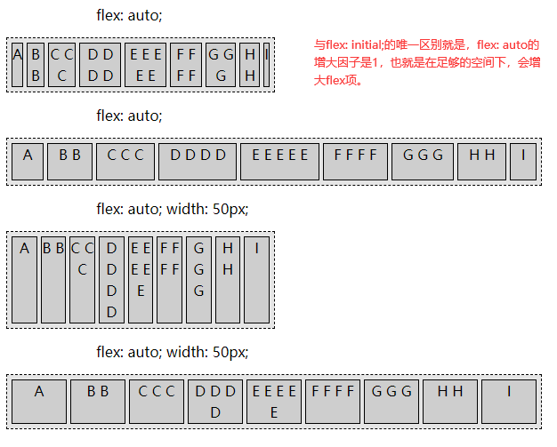

```html
<html>
  <head>
    <style>
      div {
        background-color: rgba(0, 0, 0, 0.1);
      }
      article > div {
        display: flex;
        outline: 1px dashed;
        padding: 3px;
      }
      article {
        width: 600px;
      }
      article:nth-of-type(odd) {
        width: 300px;
      }
      div > div {
        outline: 1px solid;
        margin: 3px;
        line-height: 1.5;
        min-height: 40px;
        text-align: center;
      }
      .none div > div {
        flex: none;
      }
      .hundred div > div {
        width: 50px;
      }
      p {
        text-align: left;
        padding-left: 100px;
      }
    </style>
  </head>
  <body>
    <article class="none">
      <p>flex: none;</p>
      <div>
        <div>A</div>
        <div>B B</div>
        <div>C C C</div>
        <div>D D D D</div>
        <div>E E E E E</div>
        <div>F F F F</div>
        <div>G G G</div>
        <div>H H</div>
        <div>I</div>
      </div>
    </article>
    <article class="none">
      <p>flex: none;</p>
      <div>
        <div>A</div>
        <div>B B</div>
        <div>C C C</div>
        <div>D D D D</div>
        <div>E E E E E</div>
        <div>F F F F</div>
        <div>G G G</div>
        <div>H H</div>
        <div>I</div>
      </div>
    </article>
    <article class="none hundred">
      <p>flex: none; width: 50px;</p>
      <div>
        <div>A</div>
        <div>B B</div>
        <div>C C C</div>
        <div>D D D D</div>
        <div>E E E E E</div>
        <div>F F F F</div>
        <div>G G G</div>
        <div>H H</div>
        <div>I</div>
      </div>
    </article>
    <article class="none hundred">
      <p>flex: none; width: 50px;</p>
      <div>
        <div>A</div>
        <div>B B</div>
        <div>C C C</div>
        <div>D D D D</div>
        <div>E E E E E</div>
        <div>F F F F</div>
        <div>G G G</div>
        <div>H H</div>
        <div>I</div>
      </div>
    </article>
  </body>
</html>
```

以上代码效果图：  
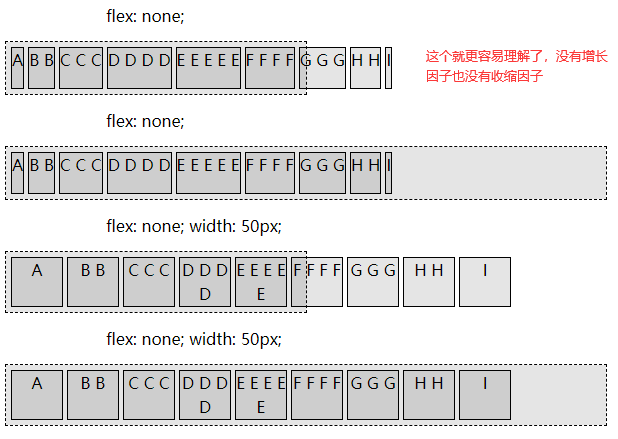

```html
<html>
  <head>
    <style>
      div {
        background-color: rgba(0, 0, 0, 0.1);
      }
      article > div {
        display: flex;
        outline: 1px dashed;
        padding: 3px;
      }
      article {
        width: 600px;
      }
      article:nth-of-type(odd) {
        width: 300px;
      }
      div > div {
        outline: 1px solid;
        margin: 3px;
        line-height: 1.5;
        min-height: 40px;
        text-align: center;
      }
      article.flex3 > div > div {
        flex: 3;
      }
      p {
        text-align: left;
        padding-left: 100px;
      }
    </style>
  </head>
  <body>
    <article class="flex3">
      <p>flex: 3;</p>
      <div>
        <div>A</div>
        <div>B B</div>
        <div>C C C</div>
        <div>D D D D</div>
        <div>E E E E E</div>
        <div>F F F F</div>
        <div>G G G</div>
        <div>H H</div>
        <div>I</div>
      </div>
    </article>
    <article class="flex3">
      <p>flex: 3;</p>
      <div>
        <div>A</div>
        <div>B B</div>
        <div>C C C</div>
        <div>D D D D</div>
        <div>E E E E E</div>
        <div>F F F F</div>
        <div>G G G</div>
        <div>H H</div>
        <div>I</div>
      </div>
    </article>
    <article>
      <p>flex: 0 - 5;</p>
      <div>
        <div style="flex: 0"></div>
        <div style="flex: 1"></div>
        <div style="flex: 2"></div>
        <div style="flex: 3"></div>
        <div style="flex: 4"></div>
        <div style="flex: 5"></div>
      </div>
    </article>
    <article></article>
    <article>
      <p>flex: 0 - 5;</p>
      <div>
        <div style="flex: 0">flex: 0</div>
        <div style="flex: 1">flex: 1</div>
        <div style="flex: 2">flex: 2</div>
        <div style="flex: 3">flex: 3</div>
        <div style="flex: 4">flex: 4</div>
        <div style="flex: 5">flex: 5</div>
      </div>
    </article>
    <article>
      <p>flex: 0 - 5;</p>
      <div>
        <div style="flex: 0">flex: 0</div>
        <div style="flex: 1">flex: 1</div>
        <div style="flex: 2">flex: 2</div>
        <div style="flex: 3">flex: 3</div>
        <div style="flex: 4">flex: 4</div>
        <div style="flex: 5">flex: 5</div>
      </div>
    </article>
  </body>
</html>
```

以上代码效果图：  
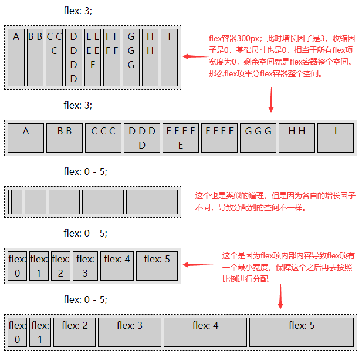

### 3.6 align-self

`align-self`属性设置在 flex 项上，用于屏蔽覆盖 flex 容器的`align-items`对 flex 项的影响。`align-self`具有`align-items`所有的属性值`flex-start | flex-end | center | baseline | stretch`，并且还单独有个`auto`值表示继承 flex 容器当前`align-items`的值。

### 3.7 order

`order`属性设置在 flex 项上，用于更改 flex 项的顺序。

默认情况下，所有 flex 项均被分配为“0”的顺序。flex 项的`order`为负值时，将会显示在默认值“0”之前；flex 项的`order`为正值时，将会显示在默认值“0”之后。如果一些 flex 项的`order`相同，则按照源顺序显示。

```html
<html>
  <head>
    <style type="text/css">
      .outer {
        display: flex;
        width: 300px;
        border: 1px dashed;
      }
      .outer div {
        width: 50px;
        height: 80px;
        box-sizing: border-box;
        text-align: center;
        margin: 5px;
        padding: 25px 5px;
        border: 1px solid;
        background-color: rgba(0, 0, 0, 0.1);
      }
      .inner2 {
        order: -1;
      }
      .inner3 {
        order: -2;
      }
      .inner4 {
        order: 1;
      }
    </style>
  </head>
  <body>
    <div class="outer">
      <div class="inner1">1</div>
      <div class="inner2">2</div>
      <div class="inner3">3</div>
      <div class="inner4">4</div>
      <div class="inner5">5</div>
    </div>
  </body>
  <html></html>
</html>
```

以上代码效果图：  

