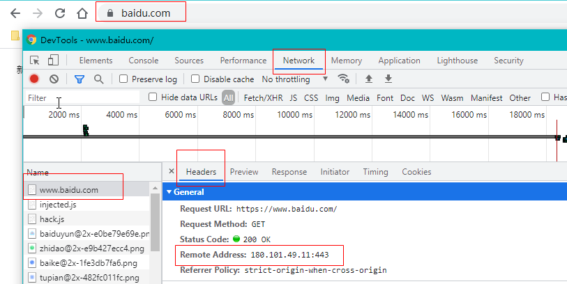
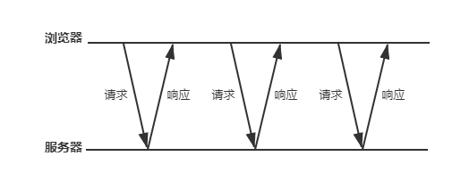
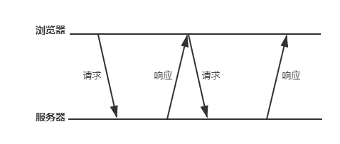

# Http、Ajax 和跨域

## 一、Http 请求概述

### 1.1 输入一个 URL 回车

在浏览器地址栏里输入一个 URL 然后按下回车，会发生以下事情：

- DNS 解析，建立 TCP 连接（三次握手），发送 Http 请求。
- server 接收 Http 请求，处理并返回。
- 客户端接收到返回数据后，处理数据（如渲染页面，执行 js）。

### 1.2 简单说明

打开浏览器，按下`F12`会打开浏览器控制台，查看控制台的`Network`页签。然后在浏览器地址栏里输入`www.baidu.com`并回车。

1. DNS 解析：DNS（域名系统）拿到`https://www.baidu.com`，将它解析成一个**IP 地址**，例如`180.101.49.11:443`。这个 IP 地址就是百度某个服务器的 IP 地址。`443`是 https 的默认端口，`80`是 http 默认端口。DNS 解析是 DNS 客户端向 DNS 服务器端发送一份查询报文也就是域名等，DNS 服务器端会返回一份报文也就是 IP 地址等。

   

2. 建立 TCP 连接：也就是三次握手。第一次握手，客户端询问服务端“你是否可用”；第二次握手，服务端告知客服端“我可用”；第三次握手，客户端告知服务端“我即将访问你”。
3. 发送 Http 请求：大多发送的是 GET 或者 POST 请求，可以是 URL 直链请求也可以使用 ajax 异步发送请求。
4. server 处理请求：确认访问权限，处理好业务逻辑之后会返回响应。

   ```js
   // node.js处理请求
   const http = require("http");
   const server = http.createServer((req, res) => {
     console.log("req.method", req.method);
     console.log("req.url", req.url);
     res.end("hello");
   });
   server.listen(8000);
   ```

5. 接收响应：客户端处理响应，比如加载返回的 js、css 文件并执行它们。

## 二、XMLHttpRequest 对象

### 2.1 XHR 的使用

**Ajax**是`Asynchronous JavaScript And XML`的缩写，表示**异步**的 JavaScript+XML。Ajax 是一门浏览器与服务器的**通信技术**，它的特点是**无需刷新页面**即可从服务器取得数据（请求然后响应最后修改 DOM，无需刷新页面），它的核心是**XMLHttpRequest 对象**（简称 XHR），前端人员可以使用这个对象进行服务器数据请求。需要注意的是，它名称虽然包含 XML，但其实与数据格式无关（可能是纯文本、XML、JSON）。

```js
// 先实例化它，原生XMLHttpRequest，没有参数
var xhr = new XMLHttpRequest();
```

实例化 XMLHttpRequest 之后，我们就可以准备发送一个**请求**了，先**配置**请求信息（仅配置），再**发送**请求（建立连接）。

- 使用`xhr.open()`进行**配置**。该方法接收三个参数，第一个参数是什么类型的请求，比如是`"GET"`还是`"POST"`（最好都大写）；第二个参数是请求地址，比如`http://localhost/test.txt`；第三个参数是是否异步发送请求，一般是`true`（可以不传，默认值就是`true`）。
- **发送**请求使用`xhr.send(param)`，GET 请求是没有`param`的，POST 是有`param`的，`param`是请求主体发送的数据（request body）。

```js
// 配置请求信息
xhr.open("GET", "http://localhost/test.txt", true);
// 发送请求。GET是没有param，POST是有param的，param是request body
xhr.send(param);
```

发送请求过后，因为一般是异步的，所以我们要知道请求/响应到了**什么阶段**，xhr 的`readyState`属性就**记录**这些信息：

- `0`：未初识化。尚未调用`open()`方法。常定义`UNSENT = 0; // 初始状态`。
- `1`：启动。已经调用`open()`方法，但尚未调用`send()`方法。常定义`OPENED = 1; // open被调用`。
- `2`：发送。已经调用`send()`方法，但尚未接收到响应。常定义`HEADERS_RECEIVED = 2; // 接收到response header`。
- `3`：接收。已经接收到部分响应数据。常定义`LOADING = 3; // 响应正在被加载`。
- `4`：完成。已经接收到全部响应数据。常定义`DONE = 4; // 请求完成`。

并且`readyState`的值**每次变化**时都会触发`readystatechange`事件。那前端人员就可以**监听**这个事件，再配合`readyState`的为`4`，就可以判断何时去**处理响应**。

```js
xhr.onreadystatechange = function () {
  // 已经接收到全部响应数据
  if (xhr.readyState == 4) {
    // 处理响应
  }
};
```

浏览器收到服务器的响应后，会**填充**XHR 对象的**属性**。相关属性如下：

- `responseText`（新脚本是`response`）：作为响应主体被返回的文本（不管什么数据类型）。
- `responseXML`（这是旧脚本）：如果响应的内容类型是`text/xml`或`application/xml`，这个属性中将保存包含着响应数据的`XML DOM`文档。
- `status`：响应额 HTTP 状态。
- `statusText`：HTTP 状态的说明，作为参考，一般不作为后续 js 判断。

前端人员需要在响应返回后，拿到这个 XHR 对象做校验和业务逻辑处理（**处理响应**）。校验就是判断**状态码**也就是`status`属性，是`[200, 300)`以及`304`都是这次请求成功的标志。

```js
// `[200, 300)`以及`304`是请求成功
if ((xhr.status >= 200 && xhr.status < 300) || xhr.status == 304) {
  alert(xhr.responseText);
} else {
  alert("Request was unsuccessful: " + xhr.status);
}
```

如果在接收响应前想取消异步请求（终止请求），可以使用`xhr.abort()`方法，来停止 XHR 对象的事件触发，并且不能访问到**与响应有关的属性**。

因为技术的进步，`responseText`和`responseXML`都比较老旧了，它们常被`response`替代，并且还常使用`xhr.responseType`来**设置响应格式**：

- `""`：同`"text"`。
- `"text"`：response 是 DOMString 对象中的文本。
- `"arraybuffer"`：response 是一个包含二进制数据的 ArrayBuffer。
- `"blob"`：response 是一个包含二进制数据的 Blob 对象。
- `"document"`：response 是一个 HTML Document 或 XML XMLDocument，根据接收到的数据的 MIME 类型而定。
- `"json"`：response 是通过将接收到的数据内容解析为 JSON，从而创建 js 对象。

这一节最后，我们写一个**比较完整**的例子：

```js
// 配置请求信息
var xhr = new XMLHttpRequest();
// 配置请求信息
xhr.open("GET", "/blog/xmlhttprequest/json", true);
// 设置响应格式，我们用常用的json格式
xhr.responseType = 'json';
// 发送请求。GET是没有param
xhr.send()
// 监听readystate的变化，readystate为4去处理响应
xhr.onreadystatechange = function() {
    // readystate为4，表示已经接收到全部响应数据，可以开始处理响应信息了
    if (xhr.readystate == 4) {
        // 响应状态码status为[200, 300)以及304是请求成功
        if ((xhr.status >= 200 && xhr.status <300 ) || xhr.status == 304) {
            // 写法一，这是旧脚本的写法
            console.log('xhr.responseText', xhr.responseText);
            // 写法二，这是新脚本的写法，返回的是json并且还转为了js对象
            console.log('xhr.response', xhr.response);
        } else {
            console.log(('Request was unsuccessful: ' + xhr.status);
        }
    }
}
```

### 2.2 进度事件

进度事件（Progress Events）定义了与客户端服务器通信有关的事件：

- `progress`：在接收响应期间持续不断地触发。例如下载进度。
- `error`：在请求发生错误时触发。例如网络中断或者无效的 URL。
- `load`：在接收到完整的响应数据时触发。即使`xhr.status`为`400`或`500`等。
- `abort`：在因为调用`abort()`方法而终止连接时触发。
- `loadstart`：在接收到响应数据的第一个字节时触发。
- `loadend`：在通信完成或触发`error`、`abort`或`load`事件后触发。
- `timeout`：请求超时。可以在请求发送前设置`xhr.timeout=30000`。

前三个用的比较多，也经常使用`load`事件来**替代**`readystatechange`事件，当然内部还是继续搭配`xhr.status`状态码判断返回结果。

`progress`常用作**进度指示器**，监听的回调函数有个 event 参数，他有三个参数，`lengthComputable`、`position`和`totalSize`，分别表示“进度信息是否可用”、“已接收的字节数”和“根据 Content-Length 响应头部确定的预期字节数”。**后两个参数**在现如今的 js 中应该是`loaded`和`total`了（意思还是一样的），`position`和`totalSize`可能或许还会存在。

```js
var xhr = new XMLHttpRequest();
// 下载一个文件
xhr.open("GET", "/blog/xmlhttprequest/load", true);
xhr.send();
// 请求收到了完整的响应
xhr.onload = function () {
  if ((xhr.status >= 200 && xhr.status < 300) || xhr.status == 304) {
    // 写法一，这是旧脚本的写法
    console.log("xhr.responseText", xhr.responseText);
    // 写法二，这是新脚本的写法
    console.log("xhr.response", xhr.response);
  } else {
    console.log("xhr.status", xhr.status);
    console.log("xhr.statusText", xhr.statusText);
  }
};
// 接收响应期间一直不断的触发该事件
xhr.onprogress = function (event) {
  if (event.lengthComputable) {
    // 写法一，这是旧脚本的写法
    console.log(`Received ${event.position} of ${event.totalSize} bytes`);
    // 写法二，这是新脚本的写法
    console.log(`Received ${event.loaded} of ${event.total} bytes`);
  }
};
// 请求失败，断网或者URL错误
xhr.onerror = function () {
  console.log("Request failed");
};
```

### 2.3 头部信息和 POST 请求

每个 HTTP 请求和响应都会带有一个**头部信息**（请求头部和响应头部），我们来**了解**一下**默认的**浏览器头部信息：

- `Accept`：浏览器能够处理的内容类型。
- `Accept-Charset`：浏览器能够显示的字符集。
- `Accept-Encoding`：浏览器能够处理的压缩编码。
- `Accept-Language`：浏览器当前设置的语言。
- `Connection`：留恋其与服务器之连接的类型。
- `Cookie`：当前页面设置的任何 Cookie。
- `Host`：发出请求的页面所在域。
- `Refere`：发出请求的页面的 URI。（HTTP 规范拼错了单词，本来应该是 referre，以规范为主）
- `User-Agent`：浏览器的用户代理字符串。

我们**不建议修改默认的浏览器头部信息**，但可以使用自定义的头部信息，`xhr.setRequestHeader(xxx, yyyy)`，xxx 是字段名，yyy 是值。要注意的是`setRequestHeader()`方法必须得在`open()`和`send()`之间使用。

```js
xhr.open("GET", "http://localhost/test.txt", true);
xhr.setRequestHeader("MyHeader", "MyValue");
xhr.send(null);
```

我们可以获取响应头部信息，使用`xhr.getResponseHeader(xxx)`获取单个，`xhr.getAllResponseHeader()`获取全部响应头部信息。

**GET 请求**，是将**简单传参数据**放到了 URL 的**末尾**，但必须经过`encodeURIComponent()`进行**编码**之后才能放到 URL 的末尾，所有的**键值对儿**都必须由`&`进行分隔。

```js
xhr.open('GET', 'example.php?name1=value1&name2=value2&name3=value3'， true);
// 向现有URL的末尾添加查询字符串参数
function addURLParam(url, name, value)() {
    // 含有?那就追加&，还不含有?那就加追?
    url += (url.indexOf('?') == -1 ? '?' : '&');
    // 添加?或&就可以添加键值对儿了
    url += encodeURIComponent(name) + '=' encodeURIComponent(value);
    return url;
}
```

**POST 请求**，是将**较为复杂数据**作为了**请求的主体**提交的，这些数据大概率会被服务器保存，属于**重要数据**。这些数据是放在`send()`的入参里，数据格式通常是`multipart/form-data`、`JSON`、`XML`。

特别注意，很久以前的**表单数据**传递要设置`xhr.setRequestHeader('Content-Type', 'application/x-www-form-urlencoded')`。而在后来，定义了一个新类型**FormData**，简化了表单数据序列化，也不用再**手动设置**`Content-Type`头部信息。

FormData 方式（其实就是`multipart/form-data`）：

```js
// FormData序列化表单，创建与表单格式相同的数据
var data = new FormData(document.forms[0]);
// 追加新的键值对
data.append("name", "JavaScript");
var xhr = new XMLHttpRequest();
xhr.open("POST", "example.php", true);
// 使用FormData后无需设置Content-Type头部信息
// xhr.setRequestHeader('Content-Type', 'application/x-www-form-urlencoded');
// 发送请求
xhr.send(data);
```

`JSON`形式：

```js
var xhr = new XMLHttpRequest();
// 转为json字符串
var json = JSON.stringify({ name: "Bob", age: 8 });
xhr.open("POST", "example.php", true);
// 这里不要忘了，这不同于FormData，这个得手动设置
xhr.setRequestHeader("Content-type", "application/json; charset=utf-8");
xhr.send(json);
```

### 2.4 上传

**上传**请求比较特殊，它的上传进度不是`xhr.onprogress`而是`xhr.upload.onprogress`，并且其他常用的事件都是在`xhr.upload`上。

```html
<!DOCTYPE html>
<html lang="en">
  <head>
    <meta charset="UTF-8" />
    <title>Document</title>
  </head>
  <body>
    <!-- 文件上传 -->
    <input type="file" onchange="upload(this.files[0])" />
    <script type="text/javascript">
      function upload(file) {
        var xhr = new XMLHttpRequest();
        // 上传进度
        xhr.upload.onprogress = function (event) {
          console.log(`Uploaded ${event.loaded} of ${event.total}`);
        };
        // 请求收到了完整的响应
        xhr.onload = function () {
          if ((xhr.status >= 200 && xhr.status < 300) || xhr.status == 304) {
            console.log("xhr.response", xhr.response);
          } else {
            console.log("xhr.status", xhr.status);
            console.log("xhr.statusText", xhr.statusText);
          }
        };
        // 请求失败
        xhr.onerror = function () {
          console.log("Request failed");
        };
        xhr.open("POST", "/blog/xmlhttprequest/upload");
        xhr.send(file);
      }
    </script>
  </body>
</html>
```

## 三、跨域资源共享

### 3.1 CORS

使用 Ajax 技术有个**限制**，那就是**不能跨域**进行请求（跨域也叫跨源），它只能访问相同**域名**、相同**端口**、相同**协议**的资源（同源）。

**CORS**（Cross-Origin Resource Sharing）是由 W3C 推出的一个**基于 HTTP 头部**的**跨域资源共享**技术。CORS 新增了一组的 HTTP 头部字段，存储着**预检请求信息**或**源信息**；CORS 也让服务器声明了哪些**源站**有权访问哪些资源（判断标准），接收请求时服务器会拿到**源信息**，并以这个标准作为**判断依据**；另外，对于非简单请求会先进行**预检**，拿到**预检请求信息**判断是否安全标准，在通过预检后才能进行**实际**的跨域请求。

### 3.2 简单请求

大多浏览器是通过**XMLHttpRequest 对象**实现了对 CORS 的**原生支持**。如果要检测浏览器的 XHR 是否支持 CORS，可以检测 XHR 对象上是否具有`withCredentials`属性（不支持 IE10 以及以前版本）。

**简单请求**：请求方法要较为**简单**，自定义的头部信息较为**安全**和**标准**。也就是大部分情况满足下面条件即可（少部分去 MDN 查）：

- 使用较为简单的请求方法，`GET`或`HEAD`或`POST`。
- 自定义头部字段`Accept`、`Accept-Language`、`Content-Language`、`Content-Type`，这些字段的值要**安全**和**标准**。
  - 其中`Content-Type`字段值**必须**是`text/plain`、`multipart/form-data`、`application/x-www-form-urlencoded`之一。
  - 至于`Accept`、`Accept-Language`和`Content-Language`是什么标准，可以查：[网站 1](https://bugs.webkit.org/show_bug.cgi?id=165178)、[网站 2](https://bugs.webkit.org/show_bug.cgi?id=165566)、[网站 3](https://bugs.webkit.org/show_bug.cgi?id=166363)。

**简单请求**的 HTTP 头部有个非常重要的**源信息**，它是存储在`Origin`字段里，它包含了**请求页面**的**域名**、**端口**和**协议**信息。如果服务器成功通过了这个请求，会在**响应头部**里使用`Access-Control-Allow-Origin`**回发**相同的**源信息**；如果访问的是公共资源，能被任意外域访问，那`Access-Control-Allow-Origin`得值就是`'*'`。

```js
function createCORSRequest(method, url, isAsyn) {
  var xhr = new XMLHttpRequest();
  // 检测XHR是否支持CORS，只需判断对象上是否有withCredentials属性
  if ("withCredentials" in xhr) {
    xhr.open(method, url, isAsyn);
    return xhr;
  }
  return null;
}
// 这是一个简单请求
var request = createCORSRequest("GET", "http://bar.other/resources/public-data/", true);
if (request) {
  request.onload = function () {};
  request.send();
}
```

上面这个例子的简单请求的请求/响应报文可能如下：

```html
// 请求报文 GET /resources/public-data/ HTTP/1.1 Host: bar.other User-Agent: Mozilla/5.0 (Macintosh; U; Intel Mac OS X
10.5; en-US; rv:1.9.1b3pre) Gecko/20081130 Minefield/3.1b3pre Accept:
text/html,application/xhtml+xml,application/xml;q=0.9,*/*;q=0.8 Accept-Language: en-us,en;q=0.5 Accept-Encoding:
gzip,deflate Accept-Charset: ISO-8859-1,utf-8;q=0.7,*;q=0.7 Connection: keep-alive Referer:
http://foo.example/examples/access-control/simpleXSInvocation.html Origin: http://foo.example // 请求的头部信息 //
响应报文 HTTP/1.1 200 OK Date: Mon, 01 Dec 2008 00:23:53 GMT Server: Apache/2.0.61 Access-Control-Allow-Origin: * //
访问的是公共资源 Keep-Alive: timeout=2, max=100 Connection: Keep-Alive Transfer-Encoding: chunked Content-Type:
application/xml [XML Data]
```

### 3.3 非简单请求

**非简单请求**就是除了上一节的**简单请求**以外的一些**特殊 HTTP 请求**，比如使用 PATCH 方法、DELETE 方法、MIME 类型的 POST 方法等。对于非简单请求，浏览器会先使用**OPTIONS 方法**对服务器发起一个**预检请求**，服务器对**预检请求信息**进行检查（因为这类请求比简单请求不安全不标准，所以要预检），预检通过后服务器才会允许**该源站**发送**实际**的跨源请求（那就可以继续进行**非简单请求**了），并且还告知该源站以后**是否**需要携带身份**凭证**（HTTP 认证相关数据和 cookie）。

**预检请求**的头部里依然有`Origin`，除了`Origin`还有两个重要字段`Access-Control-Request-Method`和`Access-Control-Request-Headers`。

- `Access-Control-Request-Method`是告知服务器之后的实际跨域请求将使用什么**方法**（PATCH？POST？）。
- `Access-Control-Request-Headers`是告知服务器之后的实际跨域请求将携带什么**自定义**请求**头部字段**。

同样，服务器成功通过预检请求后，返回给浏览器的**响应头部**除了有`Access-Control-Allow-Origin`之外，还有三个重要字段：

- `Access-Control-Allow-Methods`: 表明服务器允许客户端使用哪些方法。
- `Access-Control-Allow-Headers`: 表明服务器允许携带那些**自定义**请求**头部字段**。
- `Access-Control-Max-Age`: 是一个秒单位的数值，表明该**非简单请求**在这个时间内**不用**进行**第二次预检**了。

```js
function createCORSRequest(method, url, isAsyn) {
  var xhr = new XMLHttpRequest();
  // 检测XHR是否支持CORS，只需判断对象上是否有withCredentials属性
  if ("withCredentials" in xhr) {
    xhr.open(method, url, isAsyn);
    // 自定义了两个头部字段，并会体现在`Access-Control-Request-Headers`字段里
    xhr.setRequestHeader("X-PINGOTHER", "pingpong");
    xhr.setRequestHeader("Content-Type", "application/xml");
    return xhr;
  }
  return null;
}
// 这是一个非简单请求
var request = createCORSRequest("POST", "http://bar.other/resources/post-here/", true);
if (request) {
  request.onload = function () {};
  request.send('<?xml version="1.0"?><person><name>Arun</name></person>');
}
```

**预检**的请求/响应报文

```txt
// 请求报文
OPTIONS /resources/post-here/ HTTP/1.1
Host: bar.other
User-Agent: Mozilla/5.0 (Macintosh; U; Intel Mac OS X 10.5; en-US; rv:1.9.1b3pre) Gecko/20081130 Minefield/3.1b3pre
Accept: text/html,application/xhtml+xml,application/xml;q=0.9,*/*;q=0.8
Accept-Language: en-us,en;q=0.5
Accept-Encoding: gzip,deflate
Accept-Charset: ISO-8859-1,utf-8;q=0.7,*;q=0.7
Connection: keep-alive
// 源信息
Origin: http://foo.example
// 告知服务器，之后实际跨域请求，它使用的是POST方式
Access-Control-Request-Method: POST
// 告知服务器，之后实际跨域请求里，我会携带X-PINGOTHER和Content-Type这两个自定义头部字段
Access-Control-Request-Headers: X-PINGOTHER, Content-Type

// 响应报文
HTTP/1.1 200 OK
Date: Mon, 01 Dec 2008 01:15:39 GMT
Server: Apache/2.0.61 (Unix)
// 源信息
Access-Control-Allow-Origin: http://foo.example
// 告知客户端，之后实际跨域请求可使用POST、GET、OPTIONS方法
Access-Control-Allow-Methods: POST, GET, OPTIONS
// 告知客户端，之后实际跨域请求可携带X-PINGOTHER和Content-Type这两个自定义头部字段
Access-Control-Allow-Headers: X-PINGOTHER, Content-Type
// 告知客户端，该非简单请求在24小时内不用进行第二次预检了
Access-Control-Max-Age: 86400
Vary: Accept-Encoding, Origin
Content-Encoding: gzip
Content-Length: 0
Keep-Alive: timeout=2, max=100
Connection: Keep-Alive
Content-Type: text/plain
```

之后的实际**跨域**请求/响应报文：

```txt
POST /resources/post-here/ HTTP/1.1
Host: bar.other
User-Agent: Mozilla/5.0 (Macintosh; U; Intel Mac OS X 10.5; en-US; rv:1.9.1b3pre) Gecko/20081130 Minefield/3.1b3pre
Accept: text/html,application/xhtml+xml,application/xml;q=0.9,*/*;q=0.8
Accept-Language: en-us,en;q=0.5
Accept-Encoding: gzip,deflate
Accept-Charset: ISO-8859-1,utf-8;q=0.7,*;q=0.7
Connection: keep-alive
X-PINGOTHER: pingpong
Content-Type: text/xml; charset=UTF-8
Referer: http://foo.example/examples/preflightInvocation.html
Content-Length: 55
Origin: http://foo.example
Pragma: no-cache
Cache-Control: no-cache

<?xml version="1.0"?><person><name>Arun</name></person>


HTTP/1.1 200 OK
Date: Mon, 01 Dec 2008 01:15:40 GMT
Server: Apache/2.0.61 (Unix)
Access-Control-Allow-Origin: http://foo.example
Vary: Accept-Encoding, Origin
Content-Encoding: gzip
Content-Length: 235
Keep-Alive: timeout=2, max=99
Connection: Keep-Alive
Content-Type: text/plain

[Some GZIP'd payload]
```

### 3.4 带凭据的请求

默认情况下，对于跨域 XMLHttpRequest 请求，浏览器**不会**发送**身份凭证信息**。如果要发送（预检结果告诉你下次请求要带凭证），可以将`withCredentials`属性设置为 true，让请求携带凭证信息传给服务器。服务器也接收带凭证的请求，会将`Access-Control-Allow-Credentials:true`添加到响应头部信息里。

```js
function createCORSRequest(method, url, isAsyn) {
  var xhr = new XMLHttpRequest();
  // 检测XHR是否支持CORS，只需判断对象上是否有withCredentials属性
  if ("withCredentials" in xhr) {
    xhr.open(method, url, isAsyn);
    // 发送的请求里携带了身份凭证信息
    xhr.withCredentials = true;
    return xhr;
  }
  return null;
}
var request = createCORSRequest("GET", "http://bar.other/resources/credentialed-content/", true);
if (request) {
  request.onload = function () {};
  request.send();
}
```

而浏览器发的请求带了凭证，但服务器没有`Access-Control-Allow-Credentials`，那最终 js 会获取不到这个响应信息（response 为空），并会触发 onerror 事件。

## 四、其他跨域技术

### 4.1 图像 Ping

一个网页可以从**任何**网页中**加载图像**，不用担心跨域问题。**动态创建图像**，使用它们的 onload 和 onerror 事件处理程序是否接收到响应。

动态创建图像常使用**图像 Ping**，请求的数据是通过查询字符串形式发送的，而响应可以是任意内容（通常是像素图或 204 响应）。不过它**只能发送 GET 请求**，无法访问服务器的**响应文本**，也就是说它是**单向的数据传输**。

通过图像 Ping，浏览器得不到任何具体的数据，但通过侦听 load 和 error 事件，它能知道响应是什么时候接收到的。

```js
var img = new Image();
img.onload = img.onerror = function () {
  alert("Done!");
};
// 发送了一个name参数，图像Ping常用于跟踪用户点击次数
img.src = "http://www.example.com/test?name=Nicholas";
```

### 4.2 JSONP

**JSONP**（JSON with padding）是填充式 JSON 或参数式 JSON，讲一个回调函数追加到跨域访问的地址后面，再这个字符串放到`<scipt>`标签的`src`属性里，在页面加载这个`<script>`时（和**图像 Ping**类似，可从任何网址加载脚本），会对服务器发起请求，当响应达到时，回调函数会被触发，回调函数里的参数就是 response 响应数据。

```js
function handleResponse(response) {
  console.log("response.ip", response.ip);
  console.log("response.city", response.city);
  console.log("response.region_name", response.region_name);
}
var script = document.reateElement("script");
// 将jsonp放入到跨域地址后面
script.src = "http://freegeoip.net/json?callback=handleResponse";
document.body.insertBefore(script, document.body.firstChild);
```

**JSONP**相比于**图像 Ping**类，它能够直接访问响应文本（response），是**双向**的。但如果服务器不安全，响应中可能夹带恶意代码；还有确定 JSONP 请求**是否失败**并不容易，有可能需要定时器来监视。

### 4.3 Comet

Ajax 是页面向服务器**请求**数据，而**Comet**是一种服务器向页面**推送**数据的技术。**Comet**（服务器推送）有两种实现：**长轮询**和**流**。

**短轮询**（也叫常规轮询），浏览器定期发送**请求**给服务器，服务器会将**目前为止的数据**作为响应传递给浏览器（不管该数据是否有效）。服务器会一直被动接收请求，还得必须作出响应，尽管可能是无效的响应，这非常消耗服务器的性能。



而**长轮询**，浏览器发送一个请求，服务器虽然始终处于**连接打开**，但是没有新数据是不会推送数据给浏览器，直到有新数据可发送才会去**推送**。服务器掌握了主动权，只发送有效的数据，这很节省服务器资源。无论是短轮询还是长轮询，浏览器在接收数据之前，都会**先发起**对服务器的连接。



**流**就是 HTTP 流，它在页面的整个生命周期内**只**使用**一个**HTTP 连接。浏览器向服务器发送一个请求，服务器就会一直保持连接打开，并周期性向浏览器推送数据。（长轮询本质还是一个个 HTTP 连接，流就只有一个，且 readyState 大部分时间是`3`）。**流**常用于服务器将输出缓存内容一次性全部发送给客户端。

```js
function createStreamingClient(url, progress, finished) {
  var xhr = new XMLHttpRequest();
  var received = 0; // 处理了多少个字符
  xhr.open("GET", url, true);
  xhr.onreadystatechange = function () {
    var result;
    if (xhr.readyState == 3) {
      result = xhr.responseText.substring(received);
      received += result.length; // 每次递增
      progress(result);
    } else if (xhr.readyState == 4) {
      finished(xhr.responseText);
    }
  };
  xhr.send(null);
  return xhr;
}
var client = createStreamingClient(
  "streaming.php",
  function (data) {
    console.log("Received：" + data);
  },
  function () {
    console.log("Done!");
  }
);
```

管理 Comet 连接是很容易出错的，随着时间的推移，社区为 Comet 提供了两个新的 API 来完善以前的问题。

### 4.4 服务器发送事件

**SSE**（Serve-Sent Events，服务器发送事件）是用于创建服务器到浏览器的**单向连接**，服务器可以通过这个连接发送任意数量的数据。服务器响应的 MIME 类型必须是`text/event-strean`，而且数据输出要能被 js 的 API 解析。

使用**SSE**时要订阅新的事件流，实例化 EventSource，并将一个 URL 作为**第一个**参数，如果要**跨域**那**第二参数**应该是`{withCredentials: true}`。

EventSource 实例对象有个`readyState`属性，值为`0`表示正在连接，`1`表示连接成功，`2`表示连接关闭了。如果你非要**关闭连接**，可以使用`close()`方法，但是你想**重新使用**EventSource，只能**重新实例化**EventSource（订阅新的事件流）。

EventSource 还有三个事件：

- `open`：在建立连接时触发。
- `message`：在从服务器接收到新事件时触发，事件回调有个`event`参数，该参数有个`data`属性，该属性就是服务器返回的数据（字符串）。
- `eror`：在无法建立连接时触发。

```js
// 异步的EventSource
let eventSource = new EventSource("/events/subscribe", { withCredentials: true });
eventSource.onmessage = function (event) {
  // json形式的：{"user":"Bob","message":"First line\n Second line"}
  console.log("message", event.data);
};
```

响应格式可能是纯文本的，最简单的情况是**每个数据项**都带有前缀`data:`，例如：

```txt
data: foo

data: bar

data: foo
data: bar
```

上面这样的文本，在之前代码的`console.log("message", event.data)`，会输出三次，第一次是`foo`，第二次是`bar`，第三次是`foo\nbar`。`data:`是相邻两行，那么它们将作为一条 message 返回，中间会插入`\n`换行符（对应服务器生成流时也只用一个`\n`）。如果`data:`之间有空行，它们会作为两条 message 返回（对应服务器生成流时用两个`\n`）。

SSE**支持**短轮询、长轮询和 HTTP 流，而且能在断开连接时**自动确定**何时重新连接，服务器可设置延迟响应时间`retry: 3000`。

为了正确地重新连接，每一条消息都应设置一个 id，具体是通过前缀`id:`来给 message 添加 id 的，这个`id: 1`紧挨着`data:`上一行或下一行都可以。而浏览器收到带有 id 的 message 时，EventSource 实例对象会有个`lastEventId`属性，它就是 id 的具体值。

```txt
id: 1
data: foo

data: bar
id: 2

id: 3
data: foo
data: bar
```

如果断开连接，会向服务器发送一个包含`Last-Event-ID`字段的特殊头部的请求，以便服务器知道下一次该触发哪个事件（保证浏览器能接收到顺序正确的数据）。

### 4.5 Web Socket

**Web Socket**是在一个单独的**持久连接**上提供**全双工、双向通信**，http 协议升级到 web socket 协议（服务器要使用专门支持这种协议的服务器）。未加密的连接不再是`http://`而是`ws://`；加密连接也不再是`https://`而是`wss//`。

可以对比一下 WebSocket 和 EventSource：

| WebSocket                        | EventSource              |
| -------------------------------- | ------------------------ |
| 双向：客户端和服务端都能交换消息 | 单向：仅服务端能发送消息 |
| 二进制和文本数据                 | 仅文本数据               |
| WebSocket 协议                   | 常规 HTTP 协议           |

WebSocket 协议能让客户端与服务端之间发送非常少量的数据，而不用担心 HTTP 那样字节级的开销。由于 WebSocket 传递的**数据包很小**，所以它非常**适合移动应用**，可以最大程度解决宽带和网络延迟的问题。

使用 WebSocket，得先实例化 WebSocket，并传入连接的 URL。同源策略对 WebSocket 不适用（**没有跨域限制**），因此可以通过它打开任何站点的连接。

实例化 WebSocket 后，浏览器会立马尝试创建连接。WebSocket 实例对象也有一个`readyState`属性：

- `WebSocket.CONNECTING`，值是`0`：正在建立连接
- `WebSocket.OPEN`，值是`1`：已经建立连接
- `WebSocket.CLOSING`，值是`2`：正在关闭连接
- `WebSocket.CLOSED`，值是`3`：已经关闭连接

WebSocket 还有 4 个事件：

- `open`：在成功建立连接时触发。
- `message`：在接收到数据时触发。
- `error`：在发生错误时触发，连接不能持续了。
- `close`：在连接关闭时触发。

使用 WebSocket 发送数据是`send(param)`方法，param 就是要发送的数据，param 只能是**纯文本**，如果是**对象**就要使用`JSON.stringify(param)`进行转换（序列化）。使用 WebSocket 接收数据，在`message`事件的回调函数中，该函数的参数`event`，这个`event`的`data`属性就是返回数据，该数据是穿文本字符串，一般使用前要经过`JSON.parse()`进行转换。

一个较为完整的例子：

```js
var socket = new WebSocket("wss://www.example.com/server.php");

// 连接已建立
socket.onopen = function (e) {
  // 因为连接的建立是异步的，所以得保证连接建立了才发送请求。
  // 如果参数是对象，要转换为JSON字符串
  socket.send(JSON.stringify({ name: "Bob" }));
};
// 接收到数据
socket.onmessage = function (event) {
  // 返回的event.data是JSON字符串，需要转换为对象
  var data = JSON.parse(event.data);
  console.log(`接收到数据：${data}`);
};
// 连接关闭，当我们不再使用WebSocket可以关闭它：socket.close([code], [reason])
socket.onclose = function (event) {
  if (event.wasClean) {
    // 正常关闭，code一般为1000
    console.log(`WebSocket连接正常关闭， code=${event.code} reason=${event.reason}`);
  } else {
    // 服务器进程被杀死或网络中断，event.code 通常为 1006
    console.log(`WebSocket连接丢失， code=${event.code} reason=${event.reason}`);
  }
};
// 连接发生错误
socket.onerror = function (error) {
  console.log(`WebSocket发生了错误：${error.message}`);
};
```
