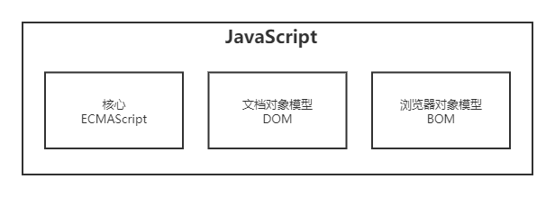

# JavaScript 简介和使用方法

## JavaScript 简史

上个世纪九十年代，人们普遍使用电话拨号上网，并且网页的大小、复杂性不断增加，提交一个表单请本需要等很久时间的响应，如果必填域没填或输入无效值那就更加费时。

为了处理这种简单的验证，布兰登·艾奇(Brendan Eich)在 1995 年与 Sun 公司合作开发出 Live Script 客户端脚本语言(服务器端也可使用，名叫 Live Wire)，发布前夕为搭上热炒 Java 的顺风车改名为 JavaScript。

因微软也推出名为 JScript 的 JavaScript 实现语言，两不同版本暴露出非标准化系列问题。1997 年，ECMA 的 TC39 以 JavaScript1.1 为蓝本完成了`ECMA-262`——定义一种名为`ECMAScript`的新脚本语言的标准。

第二年，ISO 和 IEC 也采用了 ECMAScript 作为标准，自此各浏觉器开发商将 ECMAScript 作为各自 JavaScript 实现的基础。

## JavaScript 实现

虽然 JavaScript 和 ECMAScript 通常被人们用来表达相同的含义，但 JavaScript 的含义却比 ECMA-262 中规定的要多得多，如下图。  


### ECMAScript

Web 浏览器是 ECMAScript 实现的宿主环境之一，不仅提供基本的 ECMAScript 实现，同时也会提供该语言的扩展(例如 DOM)以便语言与环境之间对接交互。其宿主环境还有 Node 和即将被淘汰的 Adobe Flash。

ECMAScript 就是对实现 ECMA-262 标准规定的各个方面内容的语言的称呼。ECMA-262 标准规定了 ECMAScript 语言的组成部分：语法、类型、语句、关键字、保留字、操作符、全局对象。

### 文档对象模型(DOM)

文档对象模型(DOM)是一个应用程序编程接口(API)，用于在 HTML 中使用扩展的 XML。DOM 将整个页面抽象为一组分层节点，开发人员可以借助 DOM 提供的 API 对网页的外观和内容进行修改。

DOM1 级由 DOM 核心(DOM Core)和 DOM HTML 组成，DOM 核心规定了如何映射基于 XML 的文档结构，DOM HTML 在 DOM 核心上扩展了针对 HTML 的对象和方法。

DOM2 级在原 DOM 上扩充了鼠标和用户界面事件、范围、遍历等细分模块，而且通过对象接口增加了对 CSS 的支持。

DOM3 级引入了以统一方式加载和保存文档的方法，新增了验证文挡的方法。支持了所有 XML1.0 的特性。

目前，W3C 不再按照 Level 来维护 DOM 了，而是作为 DOM Living Standard 来维护(DOM4)。

### 浏免器对象模型(BOM)

浏免器对象模型(BOM)也是一种接口，用来处理浏览器窗口和框架及扩展，HTML5 给了标准。

## HTML 中的 JavaScript

### \<script\>元素和放置

`<script>`有 8 个属性：`async`(异步脚本)、`charset`(用得少)、`crossorigin`(跨域)、`defer`(延迟脚本)、`integrity`(比对)、`language`(已废弃)、`src`(外部文件)、`type`(替代 language)

`<script>`的使用方式：

1. 直接在页面中嵌入 JavaScript 代码，在`<script>`和`</script>`之间写 JavaScript 代码，如果代码里的字符串中有`</script>`这样的标签记得要使用`\`进行转译。

   ```html
   <script type="text/javascript">
     function sayScript() {
       alert("<\/script>");
     }
   </script>
   ```

2. 在页面引入 JavaScript 文件，`<script type="text/javascript" src="xxx.js"></script>`
   - 在 HTML 不能简写`<script />`，但在 XHTML 里可以；
   - src 中可以引用外部域的 JavaScript 文件，但该 JavaScript 文件要安全可靠；
   - 一般推荐放在页面主要内容后，`</body>`标签前，因为放在`<head>`标签中的话会先下载 JavaScript 文件来解析页面就可能会出现空白的间隙；
   - 解决上面的问题可以用`defer`或`defer="defer"`，把`<script defer src="xxx.js"></script>`放在`<head>`标签里，代表立即下载但延迟执行；但是在 HTML5，defer 属性只对外部脚本文件有效，因此支持 HTML5 的浏览器会忽略行内脚本的 defer 属性。
   - HTML5 定义了`async`，也只对外部脚本文件有效。在`<head>`标签可放多个引用的 JavaScript 文件，立即下载这些 JavaScript 但执行顺序不保证，即多个文件要没关联。

### 扩展

- 引入型的`<script type="text/javascript" src="xxx.js"></script>`中，是不会再有嵌在`<script>`和`</script>`中的代码，有也不会执行只会执行 src 里的文件。
- 使用`<noscript>`元素可以指定在不支持脚本的浏览器中显示的替代内容，但在启用了脚本的情况下浏览器不会显示`<noscript>`元素中的任何内容。
