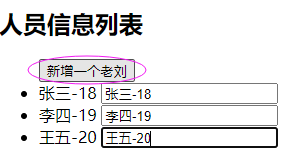
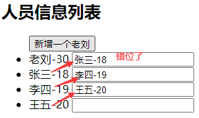
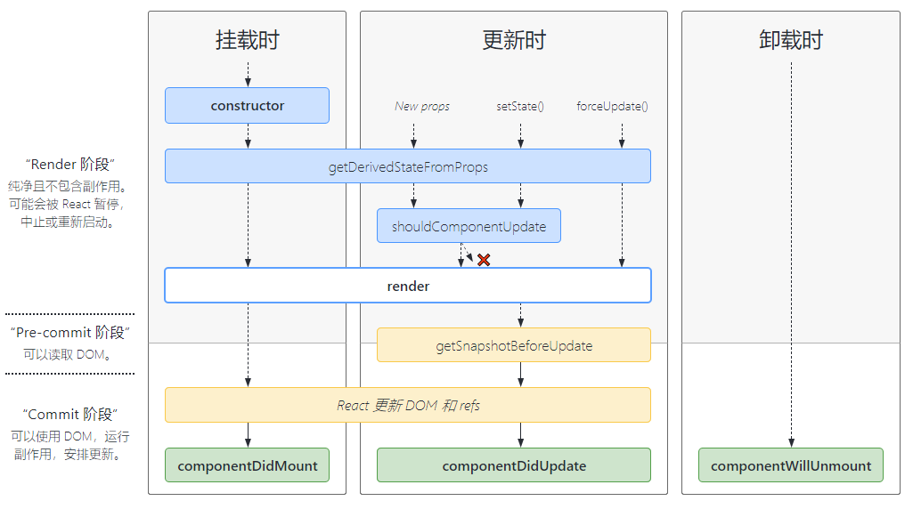

# React 基础

## 一、jsx

### 1.1 什么是 jsx

```jsx
const el = <h1 className="greet">Hello world!</h1>;
```

看到上面这个赋值语句，你可能会奇怪它为什么不是**字符串**包裹的？其实它是 React 中一种规定写法——**jsx**。使用 jsx 写出来的元素既不是字符串也不是 HTML 元素，比如上面的`h1`相当于`React.createElement('h1', {className: 'greet'}, 'Hello world!')`，生成了**React“元素”**这样的一个**对象**。

```jsx
// 另一种写法。你可以console.log('el', el)看一下el是否是一个Object，它的属性要比真实DOM要少很多
const el = { type: "h1", props: { className: "greet", children: "Hello world!" } };
// 相当于React.createElement('h1', {className: 'greet'}, 'Hello world!')
```

可以看一下 jsx 多行的写法：

```jsx
// 多行建议加上()，避免遇到自动插入分号的陷阱
const el = (
  <div>
    <h1>Hello!</h1>
    <h2>Good to see you here.</h2>
  </div>
);
```

为什么要使用 jsx？其实 react 并没有强制人们使用 jsx，它建议使用这种新的写法。这种写法的好处就是它非常接近 html 的书写方式，两者差别不大这在[下一节](./1.react基础.md#_1-2-jsx中的标签和属性)里会讲到，另一个好处就是它可以很容易地和 js 代码贴合在一起，比如后面会讲到的[条件渲染](./1.react基础.md#_1-5-条件、列表渲染)等等。要实现函数式编程或者组件化编写页面，将 UI 视图表现和渲染逻辑放在一起是很好的办法，不然按照传统的写法 html 和 js 基本是要进行分离的。当然，放在一起后要对组件做到更合适的拆分，不然组件就会显得很臃肿。

### 1.2 jsx 中的标签和属性

原生的 html 标签在 jsx 里还是原来的写法，但是在 jsx 里使用**自定义组件**时，这个组件的标签名要**首字母大写**。

然后 jsx 属性跟 html 的属性不一样，使用**首字母小写的驼峰命名法**，比如`className`其实就是 html 中的`class`，`tabIndex`则是`tabindex`等等。还有 jsx 属性可以是表达式，使用`{}`来承载表达式。

```jsx
// App是自定义组件的引用，用<>括起来作为标签来使用，并且<App />是首字母大写
ReactDOM.render(<App />, document.getElementById("root"));
// className和tabIndex要是首字母小写的驼峰命名
const el1 = <h1 className="greet">Hello world!</h1>;
const el2 = <div tabIndex="0"></div>;
// jsx属性可以是表达式
const el3 = </img>;
```

**PS**：想要在文件中写 jsx 这种语法，必须引入`React`，即`import React from 'react';`。只有引入了`React`，在文件中的那些 jsx 标签才**不会报错**。

### 1.3 jsx 与表达式

可以在 jsx 里嵌入变量引用、计算式、函数调用等这些**表达式**，具体是使用`{}`并在这个花括号里写上你想要的表达式。`{}`可以是标签的**显示内容**，也可以是标签**属性上的值**。

```jsx
// 嵌入变量引用
const str = "world!";
const el1 = <h1>Hello {str}</h1>;
// 嵌入函数调用
const user = { first: "Harper", last: "Perez" };
function func(user) {
  return user.first + " " + user.last;
}
const el2 = <h1>Hello {func()}</h1>;
// src属性值
const el3 = </img>;
```

上面的一些例子是将 jsx 作为值赋给一个常量，其实它也可以被赋值给**变量**，也可以作为**参数**传入函数，也可以作为函数的**返回值**被 return。

```jsx
function getGreeting(user) {
  if (user) {
    return <h1>Hello, {func(user)}!</h1>;
  }
  return <h1>Hello, Stranger.</h1>;
}
```

`{}`的使用跟 Vue 的模板语法不一样，特别是在`{}`里写对象时，React 就是`{{a:'a',b:'b'}}`这种，非常像 Vue 的`{{}}`，但在 React 里它表示一个具有属性 a 和 b 的字面量对象。比较常见的场景就是在 jsx 里写 style 样式。

```jsx
const data = "你好";
// {}里的{}是一个样式对象。样式对象的属性值要用引号引起来，属性名要首字母小写的驼峰写法。
const el = <span style={{ color: "white", fontSize: "15px" }}>{data}</span>;
```

### 1.4 jsx 中的子元素

jsx 标签里没有子元素时，可以直接使用`/>`来闭合（xml 语法）。如果有子元素，可以使用多个子元素。但是，最顶层的父元素只能有一个（和 Vue 模板语法一样只能有一个根节点）。

```jsx
const el = (
  <div>
    <h1>Hello!</h1>
    <h2>Good to see you here.</h2>
  </div>
  <h1>Hello!</h1> // 错误！！！只能有一个顶级父元素
);
```

但是有时候我们确实不想再多套一层标签，怎么办呢？可以使用`<Fragment>`来充当顶级父元素，最后渲染在页面时`<Fragment>`并不会显示在页面只会显示子元素的内容（Vue 模板语法是`<template>`）。

```jsx
const el = (
    <Fragment>
        <div>
            <h1>Hello!</h1>
            <h2>Good to see you here.</h2>
        </div>
        <h1>Hello!</h1>
    <Fragment/>
);
```

### 1.5 条件、列表渲染

我们可以根据不同的条件或者状态来选择渲染哪部分 UI，也就是在组件返回出参前根据需要来选择返回什么样的 jsx。

```jsx
render() {
  const isLoggedIn = this.state.isLoggedIn;
  if (isLoggedIn) {
    return <UserGreeting />;
  }
  return <GuestGreeting />;
}
```

除了上面这种使用`if`来控制最后返回的 jsx，我们也可以使用`&&`运算符来改变最后返回的 jsx，要主要这是一个表达式得使用`{}`来承载。

```jsx
render() {
  const unreadMessages = this.state.unreadMessages;
  // unreadMessages的长度决定h2是否显示
  return (
    <div>
      <h1>Hello!</h1>
      {unreadMessages.length > 0 &&
        <h2>
          You have {unreadMessages.length} unread messages.
        </h2>
      }
    </div>
  );
}
```

除了`if`和`&&`以外，还比较常见的就是`? :`三元运算符了，同样也是表达式也是需要`{}`来承载的。

```jsx
render() {
  const isLoggedIn = this.state.isLoggedIn;
  return (
    <div>
      {isLoggedIn
        ? <LogoutButton onClick={this.handleLogoutClick} />
        : <LoginButton onClick={this.handleLoginClick} />
      }
    </div>
  );
}
```

在极少数情况下，你可能希望能**隐藏组件**，即使它已经被其他组件渲染。若要完成此操作，你可以让 render 方法直接返回 null，而不进行任何渲染。

```jsx
render() {
  if (!this.state.warn) {
    return null;
  }
  return (
    <div className="warning">
      Warning!
    </div>
  );
}
```

**条件渲染**在上面可以用 if 语句，可以用`&&`运算符，可以用三元运算符。而**列表渲染**，可以用 for 语句，也可以用`map()`等遍历函数（表达式）。

```jsx
// for语句提前处理
render() {
  const array = ['张三', '李四', '王五'];
  const newArr = [];
  for (let i = 0; i < array.length; i ++) {
      newArr.push(<li key={i}>{array[i]}</li>)
  }
  return (
    <ul>
        {newArr}
    </ul>
  );
}
// map的方式（表达式）
render() {
  const array = ['张三', '李四', '王五'];
  return (
    <ul>
        {
          array.map((item, index) =>{
              return <li key={index}>{item}</li>
          })
        }
    </ul>
  );
}
```

以上示例就是 jsx 的灵活之处了，jsx 外部可以用**js 语句**处理好交给 render 函数里的 jsx 使用，像 ul 就会遍历数组（不会遍历对象），jsx 内部的`{}`只能使用**js 表达式**。Vue 的模板语法里面就不能使用 js 语句（当然 Vue 是支持 jsx 的），模板语法来实现**条件渲染**和**列表渲染**一般是通过`v-if`和`v-for`这样的 Vue 内置指令，指令的值必须得是**js 表达式**。

说了这么多，你应该明白 jsx 和模板语法大概的相同和不同之处了吧，它们内部只能使用 js 表达式（三元运算、函数调用、变量赋值等），不同就是 js 语句可配合 jsx 使用，而模板语法不可以。**jsx 灵活贴近原生 js，模板语法需要特殊指令但运行性能更好**。

### 1.6 渲染 React 元素

在项目的显示入口文件`index.html`里有一个`<div id="root"></div>`，这个就是**根节点**。React 会通过`ReactDOM.render()`函数来**管理挂载到根节点的 React 元素**，并且会渲染这个 React 元素。

```jsx
const element = <h1>Hello, world</h1>;
ReactDOM.render(element, document.getElementById("root"));
```

但是 React 元素是[不可变对象](https://en.wikipedia.org/wiki/Immutable_object)，它一旦被创建，就无法更改它的子元素或者属性。那么想改变 UI 的效果，必须创建一个全新的 React 元素再传入`ReactDOM.render()`。

```jsx
// 尽管每一秒我们都会新建一个描述整个 UI 树的元素，其实React DOM 只会更新实际改变了的内容。
function tick() {
  const element = (
    <div>
      <h1>Hello, world!</h1>
      <h2>It is {new Date().toLocaleTimeString()}.</h2>
    </div>
  );
  ReactDOM.render(element, document.getElementById("root"));
}
setInterval(tick, 1000); // 每隔一秒会重新创建React元素并传到ReactDOM.render()里渲染
```

**注意**：一般`ReactDOM.render()`只会使用一次，**尽量不要使用**上面的这种方式来改变页面的显示。后面会学习[state](./1.react基础.md#_2-3-组件的state)，可以使用`setState()`来触发组件进行**重新渲染**。

## 二、组件化开发

### 2.1 组件化以及组件的结构

前端开发常用方式是对一个页面进行拆分，可以拆分成多个独立可复用的**组件**，组件之间可以是父子关系可以是兄弟关系也可以没有关系。

**组件**在概念上类似于 js 的**函数**（入参 props，出参是 React 元素），可以用 es6 的形式来使用它，即通过`import`和`export`来引入和使用。引入一个新组件并将其**嵌入**到自身组件的 UI 上，嵌入时是不会**显式地**实例化这个新组件（意思不会`new Xx()`而会`<Xx />`）。当然，组件也不会刻意去**继承**另一个组件（除了继承`React.Component`）。

App.jsx

```jsx
import React from "react";

function App() {
  return <div>Hello world!</div>;
}
// 将自定义组件App导出去供别人使用
export default App;
```

index.jsx

```jsx
import React from "react";
import ReactDOM from "react-dom";
import App from "./App";
// 导入App，并以<App />的形式使用（不要使用new App()的形式），自定义组件使用时必须首字母大写
ReactDOM.render(<App />, document.getElementById("root"));
```

组件的两种写法：

```jsx
// 第一种：函数组件，必须要return，一般返回的是一个jsx
function Welcome() {
  // 该函数组件里面的this一般是undefined
  return <h1>Hello world!</h1>;
}
// 第二种：class组件(两种组件是等效的)，必须要有render函数，该函数必须return，一般返回的是一个jsx
class Welcome extends React.Component {
  render() {
    // 该类组件的render函数里面的this一般是本组件实例对象。这个对象使用调用者帮忙实例化的
    return <h1>Hello world!</h1>;
  }
}
```

像前面的一些例子都是单纯返回一个 React 元素，其实组件内部还能写 React 元素对应的**处理逻辑**，也就是说组件内部包含了**UI**和**处理逻辑**，这是一种**松散耦合**的结构。下面这个例子可以先不看代码细节，只需看代码结构中有 UI（render 方法）和处理逻辑（事件处理）两部分。这样对开发人员在视觉上有较好的辅助作用。还有就是组件比较容易维护，组件可以复用在很多页面，也比较符合传统开发人员的开发习惯（函数式）。

```jsx
// Toggle组件
class Toggle extends React.Component {
  constructor(props) {
    // 父组件传递的数据props
    super(props);
    this.state = { isToggleOn: true }; // 组件内部数据state
    this.handleClick = this.handleClick.bind(this); // 绑定this
  }
  // 本组件渲染内容（UI）
  render() {
    return (
      // 包裹()的原因是避免自动加;符号
      // jsx语法，属性名onClick必须是首字母小写的驼峰写法
      // 属性值是{表达式}形式，元素内容也是{表达式}形式
      <button onClick={this.handleClick}>{this.state.isToggleOn ? "ON" : "OFF"}</button>
    );
  }
  // 处理点击事件的逻辑
  handleClick() {
    // 改变state的值，setState的实参可以是对象也可以是函数，state就是原来的state
    this.setState((state) => ({
      isToggleOn: !state.isToggleOn,
    }));
  }
}
ReactDOM.render(<Toggle />, document.getElementById("root"));
```

### 2.2 组件的 props

在上一小节里构造函数的入参使用了**props**，它就是当前组件的入参。用来接收调用处标签上的**属性**以及该标签的**子元素**。需要注意的是 props 是**只读**的，**不允许被修改**。

index.tsx

```jsx
import React from "react";
import ReactDOM from "react-dom";
import App from "./App";
// 显示结果：Hello world!!!
ReactDOM.render(
  <App str="Hello">!!!</App>, // 调用处
  document.getElementById("root")
);
```

App.tsx

```jsx
import React, { Fragment, ReactElement } from "react";
// str是调用App时传入的属性，children是调用App时App的子元素也就是文本，其实子元素也可以是标签
function App(props: { str: string, children: ReactElement | string }) {
  return (
    <Fragment>
      {props.str} world{props.children}
    </Fragment>
  );
}

export default App;
```

上面的例子我们使用 ts 编写的，传进来的 props 对象必须与调用 App 时的**属性**和**子元素**对应，不然 ts 会报错。

如果通过 props 传递的参数很多，例如`xxa={params.xxa} xxb={params.xxb} xxc={params.xxc}`，你是可以通过 props 将 params 这个对象传递过去，子组件那边使用就是`props.params`。其实可以通过`{...params}`**批量传输参数**，而子组件接收就不涉及到 params 这个名字，而直接是`props.xxa`、`props.xxb`、`props.xxc`。例子如下。

```jsx
const person = {
  name: "张三",
  age: 18,
};
const a = "a";
// 其实就是将name={person.name}和age={person.age}放到<App/>属性位置上了
ReactDOM.render(
  <React.StrictMode>
    <App {...person} a={a} />
  </React.StrictMode>,
  document.getElementById("root")
);
function App(props) {
  // 页面显示的是 张三18a
  return (
    <div className="App">
      <span>{props.name}</span>
      <span>{props.age}</span>
      <span>{props.a}</span>
    </div>
  );
}
```

上面这种方式非常像**js 展开运算符**（剩余运算符），可以看一下[展开语法(Spread syntax)](https://developer.mozilla.org/zh-CN/docs/Web/JavaScript/Reference/Operators/Spread_syntax)。展开运算符**可以单独**用在数组上，例如`const arr=[1,2];console.log(...arr)`，也可以搭配`[]`使用，例如`const arr=[1,2];console.log([...arr])`，生成了一个新数组。而展开运算符**不可以单独**用在对象上，用在对象只能搭配`{}`来用，例如`const obj={a:'a'};console.log({...obj})`（生成新对象），去掉这个`{}`就会报错。况且 React 的`{...params}`中的`{}`是 jsx 里的分隔符用于承载**js 表达式**，至于`...params`表达式是 React 提供的**语法糖**，**将 params 的每个属性以及属性值按照组件 props 方式传递过去了**，放到了子组件的 props 对应**同名属性**上了。

我们可以为子组件的 props 属性加上“类型”、“必要性”和“默认值”等设置。用到的是`import PropTypes from 'prop-types'`这个包，具体写法如下

```jsx
const person = {
  name: "张三",
  speak: () => {
    console.log("speak");
  },
};
function App(props) {
  return (
    <div className="App">
      <span>{props.name}</span>
      <span>{props.age}</span>
      <span>{props.sex}</span>
      <span>{props.speak()}</span>
    </div>
  );
}
App.propTypes = {
  name: PropTypes.string.isRequired, // 类型和必要性
  age: PropTypes.number,
  sex: PropTypes.string,
  speak: PropTypes.func, // 函数就要特别注意，是func
};
App.defaultProps = {
  // 设置默认值
  sex: "男",
  age: 18,
};
ReactDOM.render(
  <React.StrictMode>
    <App {...person} />
  </React.StrictMode>,
  document.getElementById("root")
);
```

上面用的是函数式组件，如果用类组件，可以将 propTypes 和 defaultProps 移到 class**内部**（函数式组件只能放在 function 外部），使用`static`关键字即可。

```jsx
class App extends React.Component {
  constructor(props) {
    super(props);
  }
  // 固定的属性名propTypes
  static propTypes = {
    name: PropTypes.string.isRequired, // 类型和必要性
    age: PropTypes.number,
    sex: PropTypes.string,
    speak: PropTypes.func, // 函数就要特别注意，是func
  };
  // 固定的属性名defaultProps
  static defaultProps = {
    // 设置默认值
    sex: "男",
    age: 18,
  };
  render() {
    return (
      <div className="App">
        <span>{props.name}</span>
        <span>{props.age}</span>
        <span>{props.sex}</span>
        <span>{props.speak()}</span>
      </div>
    );
  }
}
```

### 2.3 组件的 state

可以回过头再看一下[渲染 React 元素](./1.react基础.md#_1-6-渲染react元素)中那个时钟例子，其实可以使用**props**进行改造，只要每秒更改传入组件的 props，把 props 里的秒值显示在组件上就可以了，但是它并没有解决`ReactDOM.render()`多次调用的问题，每秒重新调用这个函数是比较夸张的。

其实呢，使用**state**来改造是最恰当的，因为 state 是组件**内部状态**存储的变量，组件内部的变化优先使用内部的 state，除非组件确实受**外部控制**才使用 props。（state 是类组件实例上的，函数组件的 this 是 undefined，函数组件可以通过 hooks 来使用 state）

使用 state 时要**注意**的点，state 是不能随意改变的，比如`this.state.xxx = ''`这样是不允许的（可在构造函数中赋值），只能使用`this.setState({xxx: ''})`来改变 state 上属性的值（浅合并），而且使用`setState()`这个方法还会**重新触发组件的渲染**，其实就是告诉浏览器我的组件**内部状态改变了**需要重新渲染。

index.tsx

```jsx
import React from "react";
import ReactDOM from "react-dom";
import App from "./App";

ReactDOM.render(<App />, document.getElementById("root"));
```

App.tsx

```jsx
import React, { Fragment, Component } from "react";

class App extends Component<any, { date: Date }> {
  constructor(props: any) {
    super(props);
    this.state = { date: new Date() };
    setInterval(() => {
      this.setState({
        date: new Date(),
      });
    }, 1000);
  }
  render() {
    return <Fragment>{this.state.date.toLocaleString()}</Fragment>;
  }
}

export default App;
```

上面这个改造后的例子是用 ts 编写的，要注意的是`constructor()`函数的入参**props**是外部传来的也要**传给**`React.Component`也就是`super(props)`，还有就是`constructor()`函数是**唯一一个**可以给 state 赋值（初始化）的地方（其他地方只能使用`setState()`来更改）。

`setState()`是**浅合并**（不是完全覆盖），意思是`this.state`里有多个属性时，调用`setState()`去更改一个属性，其他属性还会保持原有的值。

```jsx
constructor(props) {
  super(props);
  this.state = {
    posts: [],
    comments: []
  };
}

xxx(response) {
  // 调用时，只会更改posts的值并不会影响comments的值
  this.setState({
    posts: response.posts
  });
}
```

state 的更新是**异步**的。React 会优化 state 更新执行的时机，也就是说会将多个`setState()`合并成一个。如果你在一个`setState()`中要读取**上一**state 的值，直接使用`this.state`的话可能拿不到正确的值。React 为我们解决了这个问题，`setState()`的入参可以是一个**函数**（前面例子都是一个对象），这个函数的入参是**真正上一个 state**（还有另一个入参 props）。

```jsx
// 有问题，因为 this.props 和 this.state 可能会异步更新
this.setState({
  counter: this.state.counter + this.props.increment,
});

// 使用函数，state就是之前的this.state对象
this.setState(function (state, props) {
  return {
    counter: state.counter + props.increment,
  };
});
```

虽然解决了多个`setState()`的问题，但是我就是要在某个`setState()`后面获取当前处理后的`this.state`的值（不是获取上一个了），也是有办法的，`setState()`的第二个参数就是**回调函数**。

```jsx
this.setState(
  function (state, props) {
    // 上一个state的值（当前这个setState()处理前的state）
    return {
      counter: state.counter + props.increment,
    };
  },
  () => {
    // 回调函数里可以获取当前处理后的this.state（当前这个setState()处理后的state）
    console.log("this.state", this.state);
  }
);
```

最后明确一点，上面的 state 的使用都依托于类组件，意思要通过`this.`的形式来访问。函数式组件的`this`是`undefined`，所以它没法正常使用 state，但不用担心，在后面的 hooks 章节里可以通过钩子手段来使用 stata。

### 2.4 数据流是单向的

可以看下面这个例子，FormattedDate 组件**调用处**的`data`属性值可以是的父组件的 state 部分值或者 props 部分值或者自定义的`new Date()`，而 FormattedDate 组件**定义处**的（子组件内部）props 只知道有`data`这个属性，并不知道数据是属于调用处的 state 还是 props 还是自定义的。反过来子组件的数据并不会影响父组件，所以说它们的数据流向都是从上到下这样的一种**单向**的方式（不允许在子组件里修改 props）。

```jsx
// date的值可以是自身的state里的值，也可以是props，也可以new Date()
<FormattedDate date={this.state.date} />;

// 定义处
function FormattedDate(props) {
  return <h2>It is {props.date.toLocaleTimeString()}.</h2>;
}
```

### 2.5 事件处理

react 中事件名属于 jsx 属性，需要使用**首字母小写的驼峰命名法**，事件的值一般都是表达式，所以和 jsx 属性的表达式方式一样使用`{}`来承载。在处理**默认行为**时，react 不能通过`return false`来阻止，只能通过`e.preventDefault()`来阻止

```jsx
function ActionLink() {
  function handleClick(e) {
    // react只能通过它来阻止默认行为
    e.preventDefault();
    console.log("The link was clicked.");
  }
  return (
    // onClick是首字母小写的驼峰命名法，{handleClick}是jsx属性常见的表达式方式
    <a href="#" onClick={handleClick}>
      Click me
    </a>
  );
}
```

上面例子中的`e`是 React 按照 W3C 规范合成的一个事件，与原生的几乎没有什么差别（可以通过`e.nativeEvent`访问原生的事件），不必担心浏览器兼容问题。可以不用在 js 中单独使用`addEventListener`来添加监听，直接在使用组件时在属性位置上添加事件名和对应的回调即可。说点题外话，`e.currentTarget`是事件绑定所在的元素，`e.target`是触发事件的元素（可以是前者的子元素）。

如果使用 React 组件是**类组件**，事件的回调函数一般需要**事先绑定一下组件的 this**。如果不这样处理，事件的回调函数的 this 会指向`undefined`，因为事件回调函数是被**系统事件处理机制**调用的，this 预期会指向`Window`，但由于 class 内部是严格模式不允许直接指向`Window`所以就指向了`undefined`。

像上面例子中的`handleClick`里面没有用到 this，所以没有遇到这些问题。可一旦我们需要使用到类组件中的`stata`或者`setState`等，它就需要处理 this 了，具体处理方式如下。

- **方式一**（不推荐），`onClick={() => this.handleClick()}`，不太推荐用额外的箭头函数包裹的这种方法，这种会在每次调用时都会创建**不同的回调函数**比较耗性能（以前是原型上的函数，大家共用一个，现在每次都新建了箭头函数）。
- **方式二**（常用），声明一个**箭头函数**，然后赋给成员变量`handleClick`，因为箭头函数本身没有 this，那么在箭头函数里面使用的 this 其实是它所在的 Class 的 this，也就指向了类组件实例。
- **方式三**（常用），在`constructor()`里使用`bind`让回调函数绑定 React 组件的 this，并将回调函数进行重新赋值（`bind`绑定了 this 会返回绑定后的新函数，后面要用`()`进行调用执行；而`call`和`apply`并不会返回新函数，它两是立即执行）。

```jsx
// 方式一，不推荐，每次回调都会生成新的箭头函数，性能不好
class Toggle extends React.Component {
  constructor(props) {
    super(props);
    this.state = { isToggleOn: true };
  }
  handleClick() {
    this.setState((state) => ({
      isToggleOn: !state.isToggleOn,
    }));
  }
  render() {
    // 点击事件回调时，是先调用的箭头函数，而箭头函数本身没有this，在箭头函数内部使用this，其实是它外部
    // 的this，也就是render的this指向类组件实例。然后继续执行handleClick，它内部this也指向了类组件实例
    return <button onClick={() => this.handleClick()}>{this.state.isToggleOn ? "ON" : "OFF"}</button>;
  }
}
// 方式二，常用
class Toggle extends React.Component {
  constructor(props) {
    super(props);
    this.state = { isToggleOn: true };
  }
  // 方式二和方式一很像运用原理是一样的，方式一是handleClick本身是箭头函数，而方式二是用新箭头函数包裹了handleClick
  handleClick = () => {
    // 箭头函数虽然本身没有this，但如果在它内部使用了this，那么这个this实际它外部的this，也就指向了类组件实例
    this.setState((state) => ({
      isToggleOn: !state.isToggleOn,
    }));
  };
  render() {
    return <button onClick={this.handleClick}>{this.state.isToggleOn ? "ON" : "OFF"}</button>;
  }
}
// 方式三，常用
class Toggle extends React.Component {
  constructor(props) {
    super(props);
    this.state = { isToggleOn: true };
    // 为this.handleClick函数绑定了this（指向类实例），并生成新函数，最后赋值给了this.handleClick
    this.handleClick = this.handleClick.bind(this);
  }
  handleClick() {
    this.setState((state) => ({
      isToggleOn: !state.isToggleOn,
    }));
  }
  render() {
    return <button onClick={this.handleClick}>{this.state.isToggleOn ? "ON" : "OFF"}</button>;
  }
}
ReactDOM.render(<Toggle />, document.getElementById("root"));
```

处理事件事件时可能需要**传递参数**：

- **方式一**（不推荐），多了 event 和那个自定传参，这个 event 必须**显式**传到真正的回调函数里。
- **方式二**，在 jsx 里直接 bind，同时将参数放在后面传过去；
- **方式三**，在 jsx 标签里新增一个属性，将要传递的参数放在这个属性里，在回调函数里直接使用`e.target.xxx`就可以获取这个参数了。

```jsx
// 方式一，绑定this同上面的方式一，那么也就是不常用，每次调用都会创建新箭头函数，影响性能
<button onClick={(e) => this.deleteRow(id, e)}>Delete Row</button>

// 方式二，常用。可以考虑方式二或者下面的方式三
<button onClick={this.deleteRow.bind(this, id)}>Delete Row</button>


// 方式三，绑定this同上面的方式三，只是传值是使用了节点的额外自定义属性，再通过e.target去拿这个自定义属性
constructor() {
  // 为了在回调中使用 `this`，这个绑定是必不可少的
  this.handleClick = this.handleClick.bind(this);
}
handleClick(e) {
  // `e.currentTarget`是事件绑定所在的元素，`e.target`是触发事件的元素（可以是前者的子元素）
  const id = e.target.id;
}
render() {
  return <button onClick={this.deleteRow} id={id}>Delete Row</button>
}
```

### 2.6 组件的 refs

有些场景需要获取到某个节点，在原生 js 里通常是`document.getElementById`等。在 React 里是通过组件的 refs 来获取某个节点的，但事先通过 ref 给那个节点打上“标记”。（如果是点击事件获取到点击本身的节点，用 event 就足够了，没必要用 ref，像下面这个场景是获取兄弟节点确实就需要用到 ref。原则是能不用 ref 就不用 ref）

```jsx
class App extends React.Component {
  handleClick = () => {
    // 使用时通过this.refs.xxx来读取
    console.log(this.refs.myMyput.value);
  };
  render() {
    // 使用ref="xxx"给<input>打上标记
    return (
      <div className="App">
        <input ref="myMyput" />
        <button onClick={this.handleClick}>点击</button>
      </div>
    );
  }
}
```

上面的**ref 字符串写法已经被弃用了**，推荐使用给 ref 绑定函数或者`React.createRef()`的方式来创建 ref。

```jsx
class App extends React.Component {
  handleClick = () => {
    console.log(this.myMyputEl.value);
  };
  // 提供给<input>的ref，在创建输入框时会调用这个函数，并将输入框以参数形式传递给该函数
  myMyput = (el) => {
    this.myMyputEl = el; // 用一个属性接收
  };
  render() {
    // 绑定ref绑定一个函数
    return (
      <div className="App">
        <input ref={this.myMyput} />
        <button onClick={this.handleClick}>点击</button>
      </div>
    );
  }
}
```

最为推荐的是`React.createRef()`，创建一个 ref 容器。

```jsx
class App extends React.Component {
  // 相比于上一种方式，它少了一个myMyputEl。这种方式下，这个element是放在了myMyput的current属性上了
  myMyput = React.createRef();
  handleClick = () => {
    // 所以用的时候，就得是this.myMyput.current
    console.log(this.myMyput.current.value);
  };
  render() {
    return (
      <div className="App">
        <input ref={this.myMyput} />
        <button onClick={this.handleClick}>点击</button>
      </div>
    );
  }
}
```

说点题外话，看上面的代码，类组件没有用到`constructor`，如果在构造函数里没有用到`this.props`是可以省略掉`constructor`以及它的`super`，props 照样能接受到值的。至于 state 和事件回调函数是可以写成 class 的成员属性的。但是，如果你没有省略构造函数，那么`constructor(props){}`函数体里的`super(props)`就不能省略 props，如果`super(props)`省略成`super()`这个样子，会出现一个 bug，那就是你的`this.props`可能是个`undefined`（意味着没有构造 props 这个属性）。总的来说就是，要省略就把`constructor`和`super`都省略，要么都保留。

## 四、key 的作用/表单的使用

### 4.1 key 怎么用以及为什么用

在前面的【条件、列表渲染】那节里说个列表渲染了。如果不加上**key 属性**，在运行后会报错`a key should be provided for list items`，意思是当你创建一个元素时，必须包括一个特殊的**key 属性**。key 可以取 item 的`toString`之后的值，也可以取索引值`index`，但最正确做法应该是取**唯一的 id 值**。

```jsx
function NumberList(props) {
  const numbers = props.numbers;
  const listItems = numbers.map((number) => <li key={number.toString()}>{number}</li>);
  return <ul>{listItems}</ul>;
}

const numbers = [1, 2, 3, 4, 5];
ReactDOM.render(<NumberList numbers={numbers} />, document.getElementById("root"));
```

如果你对 li 进行了一次提取，将`<li>`提取成`ListItem`，那么这个 key 是放在提取的`ListItem`上还是放在原本的`<li>`上？答案就是放在**靠近数组的上下文组件**里，也就是放在`ListItem`调用处的标签上。

```jsx
// 从li提取新组件ListItem
function ListItem(props) {
  // 这里不需要指定 key：
  return <li>{props.value}</li>;
}
// NumberList组件
function NumberList(props) {
  const numbers = props.numbers;
  const listItems = numbers.map((number) => (
    // 正确！key 应该在数组的上下文中被指定
    <ListItem key={number.toString()} value={number} />
  ));
  return <ul>{listItems}</ul>;
}

const numbers = [1, 2, 3, 4, 5];
ReactDOM.render(<NumberList numbers={numbers} />, document.getElementById("root"));
```

在上面例子中`<ListItem key={number.toString()} value={number} />`，这个 key**只是传给 React 使用的**，ListItem 定义处的 props 只能读取到`value`，是**读取不到**`key`值的，这点要注意。如果你实在想用这些 key 值，那就使用**其他属性名**将 key 赋给这个新属性传过去即可。

前面只是说了怎么用 key，那**为什么用 key**呢？原因是 React 要进行 diff 比较，让元素进行合适的局部更新，谁与谁比呢？那就是**前后相同 key 的元素**去比，帮助 React 识别哪些元素改变了。比如添加一项时，直接根据它的虚拟元素去渲染真实 DOM，因为它拥有一个**新 key**，以前就没有这个 key，肯定得重新生成虚拟元素以及真实 DOM。（删除也是同样的道理，key 都完全没有了，直接删除）

那么不建议用索引作为 key 你应该好理解了。在添加和删除的时候，列表的索引只是看起来改变了尾上那个，比如索引`[0,1,2]`变为了`[0,1,2,3]`，但你能肯定一定是在尾上添加的项吗？这样会导致什么问题呢，那就是一一对应大部分**失效了**（在添加删除时），大部分项都会重新渲染。**比如**是在 0 位置上添加的新项，那么后面的项整体**往后挪一个位置**，那么它们就**每人获得了一个新索引**，key 自然也是跟着变动了，那么 diff 比较时是不是每一项都会认为变动了，它们都会重新渲染了，非常浪费性能。总的来说就是索引作为 key，添加或删除导致有些项挪动位置从而获得了新 key，就导致了没必要的重新渲染。

其实上面还不是很严重的问题，最严重的是**渲染错误**，比如每项都包含自己的文本节点以及**一个 Input 节点**。Input 会输入一些值，而在 diff 时反而**不会检测输入的具体值**，这会认为**Input 子节点可以被复用**。但是这项本身以及它的文本节点**会重新渲染**（上面的添加删除场景，因为获得了新索引），这样就导致一些文字好像更新了 Input 好像是上一项留下来的，效果图如下（新增一项在 0 位置，正确的是 0 位置的 input 应该没有值，其他也不能错位），这种场景的 diff 与 Vue 是一样的。




用唯一的 id 值作为 key 就不一样，不管你位置怎么变动，我只找 key 对应的元素进行前后比较，diff 出结果不同才重新渲染（修改场景）。至于添加和删除前面也说过了，新的 key 以前没有就直接渲染，以前有现在没有就直接删除。

### 4.2 表单

在 react 中，表单的数据源通常保存在组件的**state**中，再让表单元素的**value**属性和**state**关联起来，这样一来表单的显示效果始终由 React 的**state**驱动（“唯一数据源”）。再对表单做事件处理，在事件回调函数中使用`setState()`来更改表单组件的数据源，那么表单显示的值将随着用户输入而更新。

```jsx
class NameForm extends React.Component {
  state = { value: "" };
  handleChange = (event) => {
    this.setState({ value: event.target.value });
  };
  handleSubmit = (event) => {
    alert("提交的名字: " + this.state.value);
    event.preventDefault();
  };
  render() {
    // 受控组件，意思是输入框里的值更新了，也会同步更新到状态state里
    return (
      <form onSubmit={this.handleSubmit}>
        <label>
          名字:
          <input type="text" value={this.state.value} onChange={this.handleChange} />
        </label>
        <input type="submit" value="提交" />
      </form>
    );
  }
}
```

`<input>`、`<textarea>`和`select`基本一样，都是`value`控制着显示效果，事件控制着数据更新。

```jsx
class FlavorForm extends React.Component {
  state = { value: "coconut" };
  handleChange = (event) => {
    this.setState({ value: event.target.value });
  };
  handleSubmit = (event) => {
    alert("你喜欢的风味是: " + this.state.value);
    event.preventDefault();
  };
  render() {
    // 多选的话可以使用value={['grapefruit', 'lime']}这种字符串数组格式
    return (
      <form onSubmit={this.handleSubmit}>
        <label>
          选择你喜欢的风味:
          <select value={this.state.value} onChange={this.handleChange}>
            <option value="grapefruit">葡萄柚</option>
            <option value="lime">酸橙</option>
            <option value="coconut">椰子</option>
            <option value="mango">芒果</option>
          </select>
        </label>
        <input type="submit" value="提交" />
      </form>
    );
  }
}
```

如果有**多个同类型**的表单（不同类型可以通过 nodeName 等来判断），区分的话要在表单元素上使用`name`这个属性，并在回调函数中使用`event.target.name`来区分。例如下方的`name="isGoing"`和`name="numberOfGuests"`，在`handleInputChange`函数中就用`event.target.name`来区分是哪个 input。当然，你也可以用函数柯里化（调用函数，然后返回一个函数，本质是个闭包）来实现多个同类型表单接受各自的值。

```jsx
render() {
  return (
    // 让多个控件使用同一个handleInputChange，用event.target.name来区分
    <form>
      <label>
        参与:
        <input
          name="isGoing"
          type="checkbox"
          checked={this.state.isGoing}
          onChange={this.handleInputChange} />
      </label>
      <br />
      <label>
        来宾人数:
        <input
          name="numberOfGuests"
          type="number"
          value={this.state.numberOfGuests}
          onChange={this.handleInputChange} />
      </label>
    </form>
  );
}
```

## 五、状态提升

当兄弟组件有**联动关系**时，它们所用的数据来源**不会**是各自的 state（修改自身的 state 不会影响别的组件），而是存储在**父组件的 state**中。

具体就是，先把数据源存储在**父组件的 state**中，准备渲染时以一定的条件或转换关系分别处理子组件所需的**数据**和**回调函数**，再将处理好的内容通过**props**这种单向通道**传递给子组件**；在某个子组件变化时，调用父组件传递过来的**回调函数**，并将**新的值**通过这个回调函数**传递回父组件**，然后父组件通过`setState()`来修改 state 数据源，最后就是重新渲染所有子组件，这样就达到了子组件间的联动的目的。

多个组件需要反映相同的变化数据，要将共享状态提升到最近的共同父组件中去，我们称这种方式为“**状态提升**”。下面是**状态提升**的一个样例，App.tsx 和 NumberInput.tsx：

App.tsx

```jsx
import React, { Component } from "react";
import NumberInput from "./NumberInput";

interface IData {
  type: string;
  value: number | string;
}

class App extends Component<any, IData> {
  constructor(props: any) {
    super(props);
    this.handleValue = this.handleValue.bind(this);
    this.state = { type: "a", value: 0 };
  }
  handleValue(data: IData) {
    this.setState({ type: data.type, value: data.value });
  }
  tryConvert(): number | string {
    // 为了解决NaN的问题
    if (typeof this.state.value === "string") {
      return "";
    }
    switch (this.state.type) {
      case "a": // 传进来是a，返回是b类型的值
        return this.state.value + 12;
      case "b":
        return this.state.value - 12;
      default:
        return "";
    }
  }

  render() {
    const type = this.state.type;
    const value = this.state.value;
    const aValue = type === "a" ? value : this.tryConvert();
    const bValue = type === "b" ? value : this.tryConvert();

    return (
      <div>
        <NumberInput inputType="a" inputValue={aValue} inputHandle={this.handleValue} />
        <NumberInput inputType="b" inputValue={bValue} inputHandle={this.handleValue} />
      </div>
    );
  }
}

export default App;
```

NumberInput.tsx

```jsx
import React, { Component } from "react";

interface IData {
  type: string;
  value: number | string;
}
interface IProps {
  inputType: string;
  inputValue: number | string;
  inputHandle: (data: IData) => void;
}

class NumberInput extends Component<IProps, any> {
  constructor(props: IProps) {
    super(props);
    this.handleValue = this.handleValue.bind(this);
  }
  handleValue(e: any) {
    let value: number | string = parseInt(e.target.value);
    value = isNaN(value) ? "" : value;
    // 状态提升，使用父组件传过来的value和处理事件，不用自身的state
    this.props.inputHandle({ type: this.props.inputType, value });
  }
  render() {
    // 状态提升，使用父组件传过来的value和处理事件，不用自身的state
    return <input value={this.props.inputValue} onChange={this.handleValue} />;
  }
}
export default NumberInput;
```

## 六、Context

前面所用到 props 一般就用到 2-3 层，一旦层比较深，就会通过中间元素传递 props，这样会不容易维护组件，复用性也会变差。

先在在顶层组件**附近**使用`const MyContext = React.createContext(obj)`，给 obj 对象关联一个 Context，然后在顶部组件 jsx 中使用`<MyContext.Provider value={xxx}>`对值进行传递，深层的组件不是立即就能用的，需要先导入那个 Context 对象，然后使用`contextType`方式或者`<MyContext.Consumer>`方式进行接收（消费）。

```jsx
const defaultContextValue = { userName: '张三'};
// 这个MyContext不能放在顶层组件内部，必须放在外面，还要export出去供孙组件使用
export const MyContext = React.createContext(defaultContextValue);
export default class App extends React.Component {
  render() {
    // MyContext名字是上面createContext时自定义的，Provider的是固定写法
    return (
      <MyContext.Provider value={defaultContextValue}>
        <TodoComponent/>
      <MyContext.Provider/>
    );
  }
}
```

在**类组件**中接受（消费）Context，是通过类的静态属性`contextType`实现的。

```jsx
// 这里一定要先导入之前的context对象
import { MyContext } from "../TodoItem";
export default class TodoItem extends Component {
  // 静态属性contextType接收MyContext，就能使用this.context了
  static contextType = MyContext;
  render() {
    return (
      <li>
        <label>
          <input type="checkbox" />
          <span>名称：{this.context.userName}</span>
        </label>
        <button className="btn btn-danger" style={{ display: "none" }}>
          删除
        </button>
      </li>
    );
  }
}
```

如果是函数式组件，那就需要使用`<MyContext.Consumer>`，其实该方法同样也能用在类组件中，但是类组件`contextType`方式更方便，但如果是函数组件其实用`useContext`会更方便，这在后面 hooks 章节会讲。

```jsx
// 这里一定要先导入之前的context对象
import { MyContext } from '../TodoItem'
export default class TodoItem extends Component {
    render() {
        // MyContext名字是上面createContext时自定义的，Consumer的是固定写法。
        // value就是Provider里的value，要写成函数形式再return
        return (
          <li>
              <label>
                  <input type="checkbox"/>
                  <MyContext.Consumer>
                    {value => {
                      return (
                        <span>名称：{value.userName}</span>
                        )
                    }}
                  <MyContext.Consumer>
              </label>
              <button className="btn btn-danger" style={{display:'none'}}>删除</button>
          </li>
        )
    }
}
```

## 七、组件的生命周期

组件的生命周期分为三个阶段：

- **挂载时(Mounting)**：组件第一次绘制，将会创建虚拟 DOM、渲染 UI，完成组件的初始化和挂载。
- **更新时(Updating)**：组件运行交互的阶段，可以处理用户的交互、收集监听事件、重新渲染 UI。
- **卸载时(Unmounting)**：组件卸载消亡的阶段，会对组件做一些清理工作，删除虚拟 DOM、移除 UI。

这三个阶段的细节以及常用的**生命周期函数**[如下图](https://projects.wojtekmaj.pl/react-lifecycle-methods-diagram/)：



### constructor()和 render()

`constructor()`是组件的**构造函数**，用于初始化组件的数据。一般就是为了给`this.state`赋值（**唯一赋值**的地方了），然后就是给处理事件**绑定 this**。还要记得在第一行要加上`super(props)`，然后不要调用`setState()`。既然可以赋值给`this.state`干嘛还要调用`setState()`。

`render()`是 React 组件必须实现的函数（**准备组件渲染所需的 UI**），它一般返回的就是组件的**jsx 形式的 UI**（不渲染就返回`null`）。我们常常在这个函数里构建组件的模板，返回 jsx 前也会稍微处理一下数据以方便放入 jsx 中。但是这个函数里不允许与浏览器进行交互，交互的逻辑放到其他生命周期函数里（事件处理函数最好定义成组件的成员）。

### componentDidMount()和 componentWillUnmount()

`componentDidMount()`这个生命周期函数会在**挂载时**的最后一步被调用（其实就是告诉开发已经挂载完了），一些比较依赖挂载后的 DOM 结构的处理工作会在这个生命周期函数里进行。例如添加订阅和网络请求等。还有比如想知道添加了组件后它所在位置大小等等。

`componentWillUnmount()`这个生命周期函数会在**卸载时**被调用（在销毁前被调用），一般在这里做一些必要的清理操作。例如取消订阅和网络请求等。

在`componentDidMount()`中是可以调用`setState()`的，会触发一次额外的渲染，请谨慎使用因为会用性能问题，请在`constructor()`里就做好 state 初始工作。在`componentWillUnmount()`是不允许调用`setState()`的，都要卸载销毁了。

我们对[组件的 state](./1.react基础.md#_2-3-组件的state)这节的第一个例子进行改造，将定时器的注册放到`componentDidMount()`，将定时器的注销放到`componentWillUnmount()`。

```jsx
import React, { Fragment, Component } from "react";

class App extends Component<any, { date: Date }> {
  constructor(props: any) {
    super(props);
    this.state = { date: new Date() };
  }
  componentDidMount() {
    this.interval = setInterval(() => {
      this.setState({
        date: new Date(),
      });
    }, 1000);
  }
  componentWillUnmount() {
    clearInterval(this.interval);
  }
  render() {
    return <Fragment>{this.state.date.toLocaleString()}</Fragment>;
  }
}

export default App;
```

### componentDidUpdate()和 getSnapshotBeforeUpdate()

`getSnapshotBeforeUpdate()`这个生命周期函数（不常用的生命周期函数）在**更新时**的**渲染输出**之前被调用的，它使得组件能在发生更改之前从 DOM 中捕获一些信息（例如，滚动位置），它的返回值将作为`componentDidUpdate()`的第三个参数“**snapshot**”。

`componentDidUpdate()`这个生命周期函数是在**更新时**的最后一步被调用的（其实就是告诉开发已经更新完了）。值得注意的是，首次渲染不会调用它，而是调用`componentDidMount()`（首次渲染在**挂载时**）。可以在该生命周期函数里进行 DOM 操作（UI 处理），也可以在一定条件下（对比了前后 props）进行网络请求。虽然可以在该生命周期函数使用`setState()`，但一定要加条件，否则容易死循环，要谨慎。

```jsx
class ScrollingList extends React.Component {
  constructor(props) {
    super(props);
    this.listRef = React.createRef();
  }

  getSnapshotBeforeUpdate(prevProps, prevState) {
    // 我们是否在 list 中添加新的 items ？
    // 捕获滚动​​位置以便我们稍后调整滚动位置。
    if (prevProps.list.length < this.props.list.length) {
      const list = this.listRef.current;
      return list.scrollHeight - list.scrollTop;
    }
    return null;
  }

  componentDidUpdate(prevProps, prevState, snapshot) {
    // 如果我们 snapshot 有值，说明我们刚刚添加了新的 items，
    // 调整滚动位置使得这些新 items 不会将旧的 items 推出视图。
    //（这里的 snapshot 是 getSnapshotBeforeUpdate 的返回值）
    if (snapshot !== null) {
      const list = this.listRef.current;
      list.scrollTop = list.scrollHeight - snapshot;
    }
  }

  render() {
    return <div ref={this.listRef}>{/* ...contents... */}</div>;
  }
}
```

### shouldComponentUpdate()

`shouldComponentUpdate()`这个生命周期函数（不常用的生命周期函数）在**更新时**的`getDerivedStateFromProps()`之后而`render()`之前被调用。

```jsx
shouldComponentUpdate(nextProps, nextState) {
  return true;
}
```

当一个组件的 props 或 state 变更，React 会将最新返回的元素与之前渲染的元素进行对比，只更新改变了的 DOM 节点。即便如此也要花费一些时间，大部分情况下是没有问题的，一旦它慢到让然怀疑的程度了，那么使用`shouldComponentUpdate()`[来优化它们是一个很好的选择](https://zh-hans.reactjs.org/docs/optimizing-performance.html#avoid-reconciliation)。该生命周期函数默认返回`true`表示让组件进行渲染，如果返回`false`则跳过整个渲染过程（包括子组件）。

```jsx
class CounterButton extends React.Component {
  constructor(props) {
    super(props);
    this.state = { count: 1 };
  }
  // 当 props.color 或者 state.count 的值改变才需要更新
  shouldComponentUpdate(nextProps, nextState) {
    if (this.props.color !== nextProps.color) {
      return true;
    }
    if (this.state.count !== nextState.count) {
      return true;
    }
    return false;
  }

  render() {
    return (
      <button color={this.props.color} onClick={() => this.setState((state) => ({ count: state.count + 1 }))}>
        Count: {this.state.count}
      </button>
    );
  }
}
```

### getDerivedStateFromProps()

在讲`getDerivedStateFromProps()`之前先介绍几个概念：

- **派生 state**：组件中的 state 中有部分数据来自于外部（一般是 props），这样的 state 就是派生 state。
- **受控**：用 props 传入数据的话，组件可以被认为是受控（因为组件被父级传入的 props 控制）。 -**非受控**：数据只保存在组件内部的 state 的话，是非受控组件（因为外部没办法直接控制 state）。

**派生 state 最常见的问题**就是将**受控**和**非受控**混在一起使用。例如，将父组件传来的 props 的值复制给了 state，而子组件内部使用 state 作为渲染数据源。父组件可以通过 props 影响到 state 值（甚至毫无影响），用户操作通过`setState()`也会影响到 state 的值，这导致要么 state 完全不受父组件源头的影响要么父组件的源数据一直覆盖子组件本身的`setState()`。

`getDerivedStateFromProps()`这个生命周期函数（不常用的生命周期函数）会在**挂载时**的`constructor()`和`render()`之间被调用，以及后续**更新时**的第一步被调用。该生命周期函数主要是为了解决派生 state 最常见的问题。

```jsx
// 它是静态方法，必须使用`static`关键字
// 有两个入参“当前最新的props”和“上一个state”。
// 返回一个对象来更新state，如果返回null则不更新任何内容
static getDerivedStateFromProps(props, state) {}
```

下面这个例子，父组件每隔 5 秒进行**重新渲染**并且**改变了传给子组件的 props 值**，而子组件的显示内容是依赖 props 里的 email 值并且还能用户输入改变这个值，这样就形成了一个“**受控**和**非受控**混在一起使用”的场景。那就可以使用`getDerivedStateFromProps()`了，**使用前一定要明白两点！**一是，不管父组件**是否**改变了传给子组件的 props 值，只要父组件进行了**重新渲染**，就会触发子组件的`getDerivedStateFromProps()`；二是，子组件的`setState()`也会触发`getDerivedStateFromProps()`，而`getDerivedStateFromProps()`本身又会更新子组件的 state。带着这两点后去读下面的例子，特别是**那段多行注释**。

Timer.tsx

```jsx
import React, { Component } from "react";
import EmailInput from "./components/EmailInput";

class Timer extends Component<any, { count: number, email: string }> {
  interval;
  state = { count: 0, email: "example@google.com" };
  componentDidMount() {
    // 每5秒就调用setState，进而重新渲染父元素
    this.interval = setInterval(
      () =>
        this.setState((prevState) => ({
          count: prevState.count + 1,
          email: prevState.email + "1",
        })),
      5000
    );
  }
  componentWillUnmount() {
    clearInterval(this.interval);
  }
  render() {
    return <EmailInput email={this.state.email} />;
  }
}

export default Timer;
```

EmailInput.tsx

```jsx
import React, { Component } from "react";

class EmailInput extends Component<{ email: string }> {
  state = {
    email: this.props.email,
    prevPropsEmail: this.props.email,
  };
  static getDerivedStateFromProps(props, state) {
    /*
            这个判断非常重要。首先只看子组件，假设父组件不重新渲染传给子组件的props也不变，
            子组件的事件回调handleChange里使用setState()后，会更新一次state，
            而setState()会触发重新渲染，从而触发getDerivedStateFromProps()和render()，
            又由于getDerivedStateFromProps()的return语句，又会更新一次state。
            第二次的state更新数据来源于props，props是假设不变的，那state会被重置成初始值，
            现象就是输入框删除或修改值时，输入框没有变化，change事件相当于失效了。
            然后再看父组件，父组件只要重新渲染就会触发子组件的getDerivedStateFromProps()，
            不管传给子组件的props变不变。父组件重新渲染，子组件的state就会被重置。
            综合看上面两点，就需要给getDerivedStateFromProps()内部加上这样的判断条件，
            加上后不会因为父组件的随意重新渲染从而让子组件重置state，除非props也改变了，
            子组件的setState()结果也不会被覆盖了，只有当来自父组件的数据源改变才更新state。
        */
    if (props.email !== state.prevPropsEmail) {
      // 该生命周期函数是static的，无法使用this，得事先存储props相关的值prevPropsEmail
      return {
        email: props.email,
        prevPropsEmail: props.email,
      };
    }
    return null;
  }
  render() {
    return <input onChange={this.handleChange} value={this.state.email} />;
  }
  handleChange = (event) => {
    this.setState({ email: event.target.value });
  };
}
export default EmailInput;
```

我们建议除了“**受控**和**非受控**混在一起使用”这个场景下使用`getDerivedStateFromProps()`生命周期函数以外，其他场景下尽量不要使用它（可能会带来意想不到的问题）。

像前面的那个例子，是可以把组件变为**完全受控**组件的，**把数据和处理逻辑都放到父组件中去**，那子组件的展示数据从 props 里读取，并且事件处理使用 props 里的回调函数，这种做法就是上一节的[状态提升](./1.react基础.md#五、状态提升)。这样可以避免使用`getDerivedStateFromProps()`，改造例子就不写了就参考[状态提升](./1.react基础.md#五、状态提升)那节的例子。

当然，还有两种方法。给父组件加上`key`这个属性，先重置子组件的某些字段时，我们就改变父组件的 key 值让子组件直接重新初始化。

```jsx
class EmailInput extends Component {
  state = { email: this.props.defaultEmail };

  handleChange = (event) => {
    this.setState({ email: event.target.value });
  };

  render() {
    return <input onChange={this.handleChange} value={this.state.email} />;
  }
}
// 当 key 变化时， React 会创建一个新的而不是更新一个既有的组件
<EmailInput defaultEmail={this.props.user.email} key={this.props.user.id} />;
```

另一个方法就是，我们不直接判断 email 是否变化，我们直接认为它是改变了一个 user，那么判断条件就会跟**userId**有关了。只要**userId**改变了，就直接更新子组件中所有跟 user 有关的信息。

```jsx
class EmailInput extends Component {
  state = {
    email: this.props.defaultEmail,
    prevPropsUserID: this.props.userID,
  };

  static getDerivedStateFromProps(props, state) {
    // 只要当前 user 变化，
    // 重置所有跟 user 相关的状态。
    // 这个例子中，只有 email 和 user 相关。
    if (props.userID !== state.prevPropsUserID) {
      return {
        prevPropsUserID: props.userID,
        email: props.defaultEmail,
      };
    }
    return null;
  }

  // ...
}
```

### 说说 scrollHeight

其实这一小节不应该放这里，主要是上面用到了 scrollHeight，这里就说点关于 scrollHeight 的东西。我们现在以“滚动容器”为主视觉，它会有一些和滚动有关的属性，如下。但要明确它们都是**滚动容器的本身属性**（生活中的例子，将“陀螺手柄”和“拉条”看作为一个整体，拉条在陀螺内部的部分我们看不见，拉动的距离其实就是手里拉条这端距离靠近手柄这边外壳的距离）。

- clientHeight：它的值为容器的 content 高度+上下内边距-水平滚动条宽度，没有水平滚动条就不用减。就理解为衡量**容器**的“总高度”。
- offsetHeight：它的值为容器的 content 高度+上下内边距+上下边框，其实常用的是 clientHeight。
- scrollHeight：一般是**容器里的总内容**撑开高度最后加上容器的上下内边距。就理解为衡量**总内容**的“总高度”，MDN 的概念有点难以理解，抓住关键字“填充所有内容”即可。
- scrollTop：其实就是滚动的距离，这个距离是容器的“顶部” 与 容器里的总内容“顶部”的一个距离。

你可以想象一下，滚动条在最顶端时的情况，此时容器的**顶部**与总内容的**顶部**是“**重合的**”，它们之间此时没有距离，那么 scrollTop 就为 0 了。

而当滚动条在最底端时，容器的**底部**与总内容的**底部**是“**重合的**”，那么它们的“顶部”的距离此时是**最大的**，那么此时的距离值到底是多少呢？那就是容器的 scrollHeight 减去 clientHeight，也就是减去重合的这部分高度。所以经常用`element.scrollHeight - element.scrollTop === element.clientHeight`来判断内容或者说滚动条**是否滚动到了底部**。

其实还有一些细节问题，这个`scrollHeight`为什么**额外算上了“容器的上下内边距”**，其实这个与**触发滚动的条件**有关了。比如 CSS 中怎么触发滚动？先设置`overflow: auto`或者`overflow: scroll`，当总内容的“布局尺寸”超过容器的 content 区域就会**触发滚动**。布局尺寸你可以先理解为所有盒子属性加起来（包括 margin）（还可以理解为撑开的高度），容器的 content 你可以理解为就是元素的 height 和 width（正常盒模型）。

那么 js 这边呢？其实就是上面 css 条件的“**两侧**”都加上了“**容器的上下内边距**”，例如容器的 content 加上“容器的上下内边距”不就是刚刚说的`clientHeight`嘛，内容的**布局尺寸**加上“容器的上下内边距”不就是刚刚说的`scrollHeight`，也就是**一旦 scrollHeight 超过 clientHeight**就会触发滚动。这样加也是 js 为了用 clientHeight**整体描述容器**，以及用 scrollHeight**整体描述它的总内容**。

## 八、React 中的 CSS 模块化

### 8.1 原生 css 的问题

原生 css 在项目中使用时经常会出现**全局污染**、**命名混乱**和**无法共享变量**等问题。

**全局污染**：原生 css 在使用时没有本地作用域，它声明的样式都是**全局的**。也就是说页面上的元素可以使用项目中任何 css 文件中的样式，当然前提是能**访问**上并**匹配**上，并且 css 样式还能覆盖前面的**部分**样式。这就导致在修改 BUG 和重构项目时，分不清哪些 css 作用于哪些 html，修改 css 要瞻前顾后怕影响到其他组件。

**命名混乱**：原生 css 的选择器命名在项目过大时会变得过于困难和混乱。选择器的名称会考虑根据它所处的页面和组件等结构来书写前缀，不然很容易和其他元素的选择器重名。又或者是多人开发一个大型项目，并且多分支进行，这样的命名冲突会源源不同，而命名风格还各不相同。

**无法共享变量**：像 color 这样的样式变量，在一个页面的很多选择器上是共用的，又或者一段样式要在很多页面上是共用的，原生的 css 也没有非常好的解决办法。

### 8.2 CSS 模块化

**CSS 模块化**可以将 css 样式变成一个个**独立存在的模块**，css 模块内部的内容当然也是独立的不会影响到其他 css 模块，在需要使用 css 时就将需要的 css 模块导入到对应的 react 组件中。这样就可以解决原生 CSS 的全局污染和命名混乱的问题，不好的地方是需要一点点配置，然后它在 debug 时显示的 className 会比较奇怪（css 样式动态注入的，属于 css in js 的范畴了）调试会麻烦一些。

在一般的 react 项目中，css 文件初始导入方式是这样的：`import './xxx.css'`，其实这还是原生的 css 用法，只不过将 css 分割成小小的几部分，还是不具有独立性。真正做到 CSS 模块化，需要这样写：`import styles from './xxx.css'`，将 css 样式以一个对象的形式导入到 react 组件中。

而`import styles from './xxx.css'`这样的 css 导入写法可能会报错，这个就是因为 css 缺少**ts 声明文件**（[\*.d.ts](/front-end/html、css、js、ts/学习TypeScript/2.typescript进阶.md#es6模块的声明文件)），解决的方法就是在项目的 src 目录下创建一个 css 的 ts 声明文件 custom.d.ts：

```ts
// 声明一个es6模块，导入文件通常是*.css这样的，这个模块以一个对象形式暴露
declare module "*.css" {
  const css: { readonly [key: string]: string };
  export = css;
}
```

然后就是 css 文件的命名规范，头部名称基本和 tsx/jsx 文件一致，`.css`后缀的前面必须得添加一个`.module`，以免出现不必要的问题（其实目前添加`.module`后就不用自己写 ts 声明文件了，上一步 custom.d.ts 可以省略）。别忘了将 css 文件和 tsx/jsx 文件放在同一个文件夹（例如某个 component）下。

接下来我们只需要将 UI 元素与这个`styles`对象关联来就可以让样式生效了，具体就是在元素 jsx 上使用`className`绑定`styles`里对应的字段，看清楚不是`style`字段哦！

```jsx
// 原生CSS
import "./NumberInput.css";

return <input className="inputDiv" value={this.props.inputValue} onChange={this.handleValue} />;

// CSS模块化，文件名中间是module
import styles from "./NumberInput.module.css";

return <input className={styles.inputDiv} value={this.props.inputValue} onChange={this.handleValue} />;
```

### 8.3 CSS 模块智能提示

因为我们使用 ts，`styles`这个对象里的字段提示是非常有必要的，那么就得安装一个插件`npm install typescript-plugin-css-modules --save-dev`。

然后打开项目的`tsconfig.json`文件，在`compilerOptions`项中注册上面这个插件：

```json
"compilerOptions": {
    "plugins": [{ "name": "typescript-plugin-css-modules" }]
}
```

如果使用的 VSCode 编辑器，需要开启 settings.json 中的`"typescript.enablePromptUseWorkspaceTsdk": true`这个选项（VSCode 须得 1.45 版本以上才有这个选项）就能让`styles`后面拥有智能提示。

```json
{
  "typescript.tsdk": "node_modules/typescript/lib", // 根据项目的实际typescript所在填写
  "typescript.enablePromptWorkspaceTsdk": true
}
```

### 8.4 用类似方式加载资源

像 png、svg、jpg 等资源文件，都可以通过上面的方式来加载，也不需要自己写 ts 声明文件，因为 react 项目基本上都已经准备好了。

```jsx
import styles from "./NumberInput.module.css";
import logo from "./assets/images/logo.svg";

;
```

如果是加载字体，就用原生 css 加载字体方式（`@font-face`加载字体，`font-family`使用字体）具体可以看这篇——[字体](/front-end/html、css、js、ts/学习CSS/3.字体与文本属性.md#一、字体)。
