# Vue 进阶

## 一、Vue 实例生命周期

### 1.1 这个定时器要放哪

我们经常使用**定时器**来**控制**页面展示效果，那么这个定时器应该放到哪里呢？我们可以看下面这个例子。

```html
<!DOCTYPE html>
<html lang="en">
  <head>
    <meta charset="UTF-8" />
    <title>Document</title>
    <script src="https://cdn.jsdelivr.net/npm/vue@2.6.14/dist/vue.js"></script>
  </head>
  <body>
    <div id="root">
      <h2 :style="{opacity}">你好，{{name}}</h2>
    </div>
    <script type="text/javascript">
      Vue.config.productionTip = false;
      const vm = new Vue({
        el: "#root",
        data: { name: "张三", opacity: 1 },
      });
      setInterval(() => {
        vm.opacity -= 0.1;
        if (vm.opacity <= 0) vm.opacity = 1;
      }, 100);
    </script>
  </body>
</html>
```

上面例子里的定时器放在了 vm 实例创建完之后，这会有什么问题呢？定时器与 vm 实例在**代码层面**是**割裂开的**，但是功能是**有联系**的，这符合一般的开发规范。那我们得考虑将**定时器**放到 vm 实例里，那放在`methods`里吗？`methods`里的方法一般是充当**事件回调函数**的，如果你非要新建一个方法包裹`setInterval`定时器，那还得对应在**模板**里主动调用这个新方法，代码如下，运行效果不符合预期。

```html
<!DOCTYPE html>
<html lang="en">
  <head>
    <meta charset="UTF-8" />
    <title>Document</title>
    <script src="https://cdn.jsdelivr.net/npm/vue@2.6.14/dist/vue.js"></script>
  </head>
  <body>
    <div id="root">
      <h2 :style="{opacity}">你好，{{name}}</h2>
      <h2>{{change()}}</h2>
    </div>
    <script type="text/javascript">
      Vue.config.productionTip = false;
      const vm = new Vue({
        el: "#root",
        data: {
          name: "张三",
          opacity: 1,
        },
        methods: {
          change() {
            setInterval(() => {
              console.log("定时器");
              this.opacity -= 0.1;
              if (this.opacity <= 0) this.opacity = 1;
            }, 100);
          },
        },
      });
    </script>
  </body>
</html>
```

上面例子的运行效果不符合预期，这是因为定时器里做了`data`存储数据的修改（`vm.opacity = xxx`），会导致模板**一直重新解析**，那就**一直会调用**`change`。

我们的期望是只让`change`始终值只调用一次，在真实 DOM**第一次**被放到页面时调用它，在**之后的**模板重新解析时**不再**调用它，那这就不得不用到 Vue 的**声明周期函数**。`mounted`就是 Vue 生命周期函数中的一个，在 Vue 完成模板解析并真实 DOM 元素**放入页面后**回调`mounted`，也就说`mounted`只在**挂载后**调用**一次**，在后面**每次更新**都**不会再被调用了**。

```html
<!DOCTYPE html>
<html lang="en">
  <head>
    <meta charset="UTF-8" />
    <title>Document</title>
    <script src="https://cdn.jsdelivr.net/npm/vue@2.6.14/dist/vue.js"></script>
  </head>
  <body>
    <div id="root">
      <h2 :style="{opacity}">你好，{{name}}</h2>
    </div>
    <script type="text/javascript">
      Vue.config.productionTip = false;
      const vm = new Vue({
        el: "#root",
        data: {
          name: "张三",
          opacity: 1,
        },
        // mounted生命周期函数，在Vue完成模板解析并真实DOM元素放入页面后被调用（挂载后）
        mounted() {
          setInterval(() => {
            console.log("定时器");
            this.opacity -= 0.1;
            if (this.opacity <= 0) this.opacity = 1;
          }, 100);
        },
      });
    </script>
  </body>
</html>
```

---

**总结拓展**：

1. **生命周期函数**：Vue 在**关键时刻**帮我们调用的一些特殊名称的函数。
2. **生命周期函数**又名**生命周期回调函数**或**生命周期钩子**。
3. **生命周期函数**的方法名是固定的不可更改的，方法体内容根据开发需求自行修改。
4. **生命周期函数**中的**this**指向是**vm**或**组件实例对象**。

---

### 1.2 挂载流程

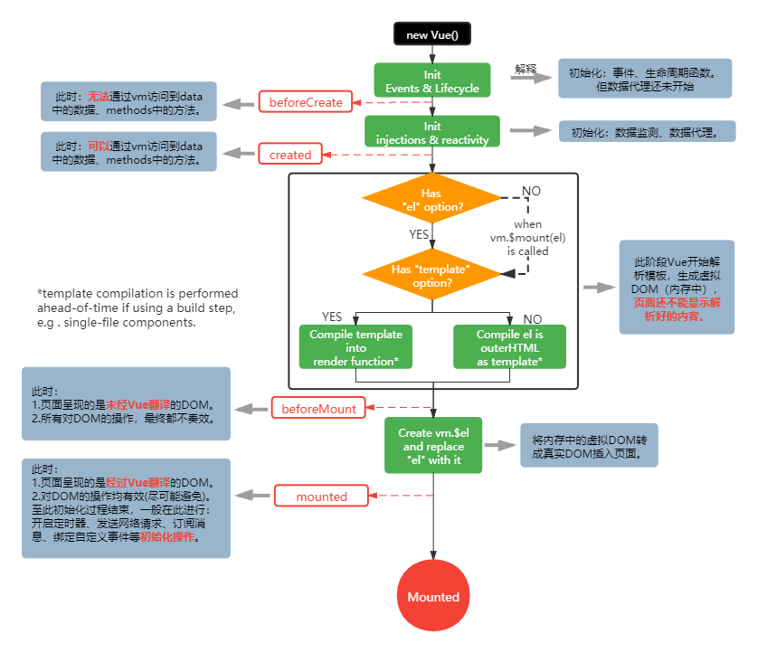

**挂载流程**：

1. `Init Events & Lifecycle`**阶段**：规定 Vue 的**生命周期函数**有多少个、在什么时候调用，还规定了**事件与事件修饰符**的怎么运行。该阶段**还未**进行**数据处理**。该阶段**紧跟其后**的一个**生命周期函数**是`beforeCreate()`，该生命周期函数中还无法通过 vm 访问到**data 中的数据**、**methods 中的方法**。

   ```html
   <!DOCTYPE html>
   <html lang="en">
     <head>
       <meta charset="UTF-8" />
       <title>Document</title>
       <script src="https://cdn.jsdelivr.net/npm/vue@2.6.14/dist/vue.js"></script>
     </head>
     <body>
       <div id="root">
         <h2>你好，{{name}}</h2>
         <button @click="change">点击我</button>
       </div>
       <script type="text/javascript">
         Vue.config.productionTip = false;
         const vm = new Vue({
           el: "#root",
           data: {
             name: "张三",
           },
           // beforeCreate生命钩子：无法通过vm访问到data中的数据、methods中的方法。
           beforeCreate() {
             console.log("尝试访问data数据", this.name, this._data);
             console.log("尝试访问methods方法", this.add);
             debugger;
           },
           methods: {
             change() {
               this.name = "李四";
             },
           },
         });
       </script>
     </body>
   </html>
   ```

2. `Init injections & reactivity`**阶段**：处理了**依赖注入**等，并对存储数据做了**数据监视**和**数据代理**。该阶段**紧跟其后**的一个**生命周期函数**是`created()`，该生命周期函数中**可以**通过 vm 访问到 data 中的数据、methods 中的方法。

   ```html
   <!DOCTYPE html>
   <html lang="en">
     <head>
       <meta charset="UTF-8" />
       <title>Document</title>
       <script src="https://cdn.jsdelivr.net/npm/vue@2.6.14/dist/vue.js"></script>
     </head>
     <body>
       <div id="root">
         <h2>你好，{{name}}</h2>
         <button @click="change">点击我</button>
       </div>
       <script type="text/javascript">
         Vue.config.productionTip = false;
         const vm = new Vue({
           el: "#root",
           data: {
             name: "张三",
           },
           // created生命钩子：可以通过vm访问到data中的数据、methods中的方法。
           created() {
             console.log("尝试访问data数据", this.name, this._data);
             console.log("尝试访问methods方法", this.add);
             debugger;
           },
           methods: {
             change() {
               this.name = "李四";
             },
           },
         });
       </script>
     </body>
   </html>
   ```

3. **模板解析阶段**：开始解析模板生成**虚拟 DOM**存储在内存中，**还未**生成对应的**真实 DOM**。该阶段**紧跟其后**的一个**生命周期函数**是`beforeMount()`，在此生命钩子中对应页面的展示还是**模板内容**，虽然虚拟 DOM 生成了，但真实 DOM**还未**加到页面中，所以**不要**在此生命钩子中**操作**真实 DOM。  
   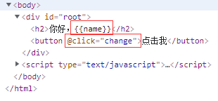
4. `Create vm.$el and replace "el" with it`**阶段**：将虚拟 DOM 转换成真实 DOM，并将真实 DOM 存储在`vm.$el`，然后将真实 DOM**插入了**页面。该阶段**紧跟其后**的一个**生命周期函数**是`mounted()`，在此生命钩子中对应页面的展示**已经是**真实 DOM 了，可以进行真实 DOM 操作（不建议），也可以**开启定时器**、**发送网络请求**、**订阅消息**、**绑定自定义事件**等**初始化操作**。  
   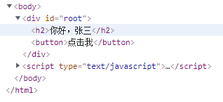

### 1.3 更新流程

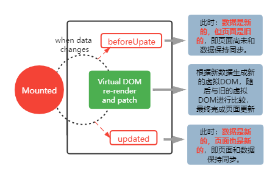

**更新流程**比较简单，当 data 存储数据**改变**时就去更新页面。`Virtual DOM re-renderand patch`阶段：生成**新的**虚拟 DOM，再与**旧的**虚拟 DOM 进行比较，根据比较结果更新页面。该阶段**前**有个**生命周期函数**是`beforeUpdate()`，data 存储数据是新的，但页面还是旧的。该阶段**后**有个**生命周期函数**是`updated()`，data 存储数据是新的，页面也是新的。

```html
<!DOCTYPE html>
<html lang="en">
  <head>
    <meta charset="UTF-8" />
    <title>Document</title>
    <script src="https://cdn.jsdelivr.net/npm/vue@2.6.14/dist/vue.js"></script>
  </head>
  <body>
    <div id="root">
      <h2>你好，{{name}}</h2>
      <button @click="change">点击我</button>
    </div>
    <script type="text/javascript">
      Vue.config.productionTip = false;
      const vm = new Vue({
        el: "#root",
        data: {
          name: "张三",
        },
        // beforeUpdate生命钩子：数据是新的，但页面是旧的，即页面尚未和数据保持同步。
        beforeUpdate() {
          console.log("data数据是新的：", this.name);
          console.log("页面是旧的", document.getElementsByTagName("h2")[0].innerText);
          debugger;
        },
        // updated生命钩子：数据是新的，页面也是新的，即页面和数据保持同步。
        updated() {
          console.log("data数据是新的：", this.name);
          console.log("页面也是新的", document.getElementsByTagName("h2")[0].innerText);
          debugger;
        },
        methods: {
          change() {
            this.name = "李四";
          },
        },
      });
    </script>
  </body>
</html>
```

### 1.4 销毁流程

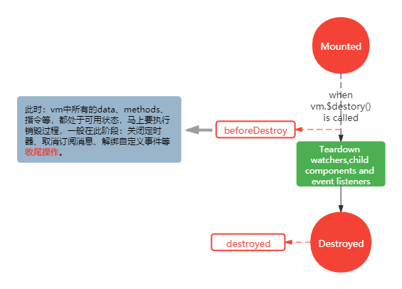

**销毁流程**比较简单，当`vm`被销毁时（调用`vm.$destroy()`）就执行销毁操作。`Teardown watchers, child components and event listeners`阶段，移除数据监听、子组件和事件监听器（不影响原生事件），但是页面的 DOM**显示**还是正常的。该阶段**前**有个**生命周期函数**是`beforeDestroy()`，此时还能使用 vm 中所有的 data、methods、指令等（但改动 data 存储数据是**不会触发更新**，因为要销毁了），但主要是为了进行**关闭定时器**、**取消订阅消息**、**解绑自定义事件**等**收尾操作**。该阶段**后**有个**生命周期函数**是`destroyed()`，**几乎不在**该生命周期函数里处理事情。

```html
<!DOCTYPE html>
<html lang="en">
  <head>
    <meta charset="UTF-8" />
    <title>Document</title>
    <script src="https://cdn.jsdelivr.net/npm/vue@2.6.14/dist/vue.js"></script>
  </head>
  <body>
    <div id="root">
      <h2>你好，{{name}}</h2>
      <h2>数值，{{num}}</h2>
      <button @click="change">点击我，改变name，并销毁vm</button>
    </div>
    <script type="text/javascript">
      Vue.config.productionTip = false;
      const vm = new Vue({
        el: "#root",
        data: {
          name: "张三",
          num: 1,
        },
        // beforeDestroy生命钩子：vm中所有的data、methods、指令等，都处于可用状态，马上要执行销毁过程，
        // 一般在此阶段：关闭定时器、取消订阅消息、解绑自定义事件等收尾操作。
        beforeDestroy() {
          console.log("尝试访问data数据", this.name, this._data);
          console.log("尝试访问methods方法", this.add);
          this.num = this.num + 1;
          console.log("让num+1：", this.num, "再观察页面是否更新");
          debugger;
        },
        // destroyed生命钩子：几乎不在该生命周期函数里处理事情
        destroyed() {},
        methods: {
          change() {
            this.name = "李四";
            // 销毁vm
            // this.$destroy();
          },
        },
      });
    </script>
  </body>
</html>
```

**注意**：最好不要使用`vm.$destroy()`，最好使用`v-if`

### 1.5 整个生命周期图示

总共有 4 对生命周期函数：

- `beforeCreate()`和`created()`，数据处理前后
- `beforeMount()`和`mounted()`，真实 DOM 插入页面前后
- `beforeUpdate()`和`updated()`，虚拟和真实 DOM 更新前后
- `beforeDestroy()`和`destroyed()`，vm 或组件实例销毁前后

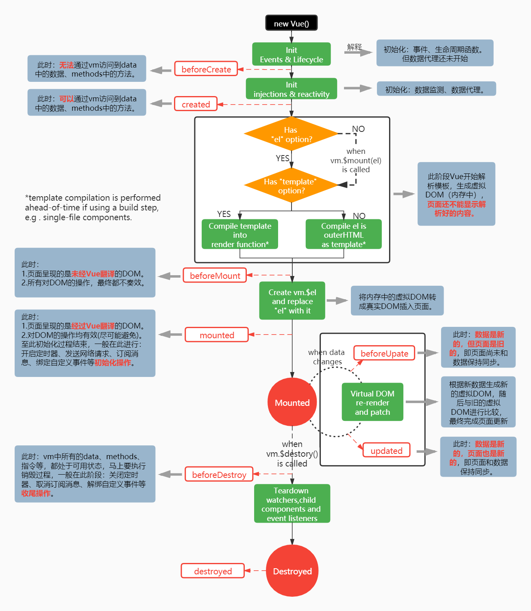

---

**总结拓展**：

1. 常用的生命周期钩子：
   1. `mounted()`：发送 ajax 请求、启动定时器、绑定自定义事件、订阅消息等**初始化操作**。
   2. `beforeDestroyed()`：清除定时器、解绑自定义事件、取消订阅消息等**收尾操作**。
2. 关于销毁 Vue 实例：
   1. 销毁后借助 Vue 开发者工具看不到任何信息。
   2. 销毁后自定义事件会失效，但原生 DOM 事件依然有效。
   3. 一般不会在`beforeDestroyed()`里操作数据，即使操作了数据，也不会触发重新渲染。

---

## 二、Vue 组件化编程

### 2.1 什么是组件化编程

用**传统方式**来开发 web 项目，会出现多个 html、多个 js、多个 css 文件，它们之间的关系会很**混乱**，维护起来非常不方便。一旦出现功能和展示**几乎相同**的部分，就会**难以复用**。当然，随着前端技术的进步可以解决一部分问题，js 可以使用**es6 模块**（拆分 js，以模块形式导入导出），css 也能使用**css in js**等技术（以模块导入）。

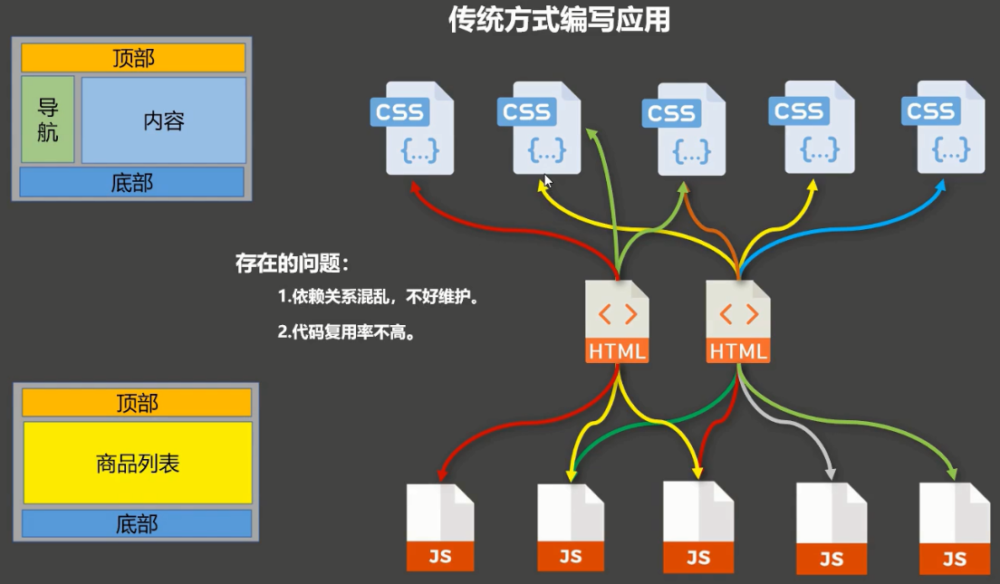

现代前端技术，UI 框架基本推荐使用**组件化编程**的方式。首先，“**组件**”的**定义**是，实现应用中**局部**功能**代码**和**资源**的**集合**。

那么**组件化编程**是什么意思呢？是将页面**拆分**成一个个**组件**，单个组件会**封装**所需要的**代码**和**资源**（局部功能）。虽然组件是一个**独立的个体**，但是多个组件是可以进行**互相交流**的，将**开发好了**的组件**组合在一起**，形成一个**功能完善**的页面（完整功能），这就是**组件化编程**。当然，**组件**的高度封装具有**独立性**，是可以被拿到其他地方进行**复用**的。

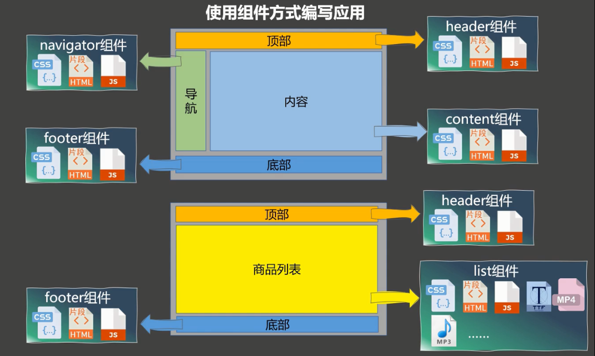

### 2.2 如何运用组件

在这几节里为了代码演示，暂时使用**非单文件组件**，至于**单文件组件**在实际开发中使用的更多，会在后面讲解。**非单文件组件**的意思是一个文件包含了**多个**组件，那**单文件组件**自然就是一个文件**只包含**了一个组件。

在开发中到底**怎么运用**组件呢？分为三步：1. **创建**组件；2. **注册**组件；3. **使用**组件。

- **创建组件**：

  1.  使用`Vue.extend(xxx)`进行创建组件，其中 xxx 是一个**配置对象**，该配置对象和**Vue 实例化**时传入的配置对象**几乎**是**相同**的（比如配置对象中的`el`只在 Vue 实例化时才能用）。
  2.  组件的**配置对象**的 data，一定得使用**函数形式**。假设**组件 A**会在**组件 B**和**组件 C**里被调用（被复用），组件 B 去**修改了**A 的 data 数据，因为 data 是**对象**的缘故，在组件 C 中看到自己调用的 A 的 data 数据**也变了**，这就导致**各个**调用处**共用**了一套数据。那就需要使用 data 的**函数形式**，data 函数**return**一个**新对象**，**组件 B**使用 A 的 data 数据是**独一份**的，**组件 C**使用 A 的 data 数据也是**独一份**的。

      ```js
      // data返回一个对象，各自调用处用的data数据就不会是同一个对象了
      function data() {
        return { a: 1, b: 2 };
      }
      const x1 = data();
      const x2 = data();
      x1.a = 3; // 影响不到x2的a
      console.log("x2.a:", x2.a);
      ```

  3.  可以将组件的**模板**写在组件的**配置对象**里，使用的是`template`，它与`data`平级，`template`的**值**是一个**字符串**。

      ```js
      Vue.config.productionTip = false;
      const school = Vue.extend({
        template: `
              <div>
                  <h2>学校：{{schoolName}}</h2>
                  <h2>地址：{{schoolAddress}}</h2>
              </div>`,
        data() {
          return { schoolName: "武汉大学", schoolAddress: "武汉市武昌区珞珈山路" };
        },
      });
      const person = Vue.extend({
        template: `
              <div>
                  <h2>姓名：{{name}}</h2>
                  <h2>年龄：{{age}}</h2>
              </div>`,
        data() {
          return { name: "张三", age: 18 };
        },
      });
      ```

- **注册组件**：

  1.  要在调用处**注册**你**将要使用**的组件。需要在**调用处**的配置对象中使用一个新的配置`components`，`components`与`methods`平级。组件注册在`components`对象里，属性名也就是组件名（自己取的，将来会在模板里使用），属性值就是组件引用（组件创建后留下的组件引用）。

      ```js
      Vue.config.productionTip = false;
      const school = Vue.extend({
        template: `
              <div>
                  <h2>学校：{{schoolName}}</h2>
                  <h2>地址：{{schoolAddress}}</h2>
              </div>`,
        data() {
          return { schoolName: "武汉大学", schoolAddress: "武汉市武昌区珞珈山路" };
        },
      });
      const person = Vue.extend({
        template: `
              <div>
                  <h2>姓名：{{name}}</h2>
                  <h2>年龄：{{age}}</h2>
              </div>`,
        data() {
          return { name: "张三", age: 18 };
        },
      });
      const vm = new Vue({
        el: "#root",
        // 局部注册组件（在调用处的配置对象的components里），属性名和组件引用的名相同，就用简写
        components: {
          school,
          person,
        },
      });
      ```

  2.  上一点是**局部**注册，还有一个**全局**注册，使用得是`Vue.component('xxx', xxx)`，第一个参数是组件名（自己取的，将来会在调用处的**模板**里使用），第二个参数是组件引用（组件创建后留下的组件引用）。

      ```js
      Vue.config.productionTip = false;
      const school = Vue.extend({
        template: `
              <div>
                  <h2>学校：{{schoolName}}</h2>
                  <h2>地址：{{schoolAddress}}</h2>
              </div>`,
        data() {
          return { schoolName: "武汉大学", schoolAddress: "武汉市武昌区珞珈山路" };
        },
      });
      const person = Vue.extend({
        template: `
              <div>
                  <h2>姓名：{{name}}</h2>
                  <h2>年龄：{{age}}</h2>
              </div>`,
        data() {
          return { name: "张三", age: 18 };
        },
      });
      // 全局注册组件，school和person能被所有组件使用，这种情况用的少
      Vue.component("school", school);
      Vue.component("person", person);
      const vm = new Vue({
        el: "#root",
      });
      ```

- **使用组件**：在**模板**中使用组件的时候，先找到**组件**在配置对象中`components`里对应的**属性名**，再将这个**属性名**使用`<>`包裹成**标签**就可以到模板里使用了。

  ```html
  <!DOCTYPE html>
  <html lang="en">
    <head>
      <meta charset="UTF-8" />
      <title>Document</title>
      <script src="https://cdn.jsdelivr.net/npm/vue@2.6.14/dist/vue.js"></script>
    </head>
    <body>
      <div id="root">
        <!-- 使用组件，编写组件标签 -->
        <school></school>
        <hr />
        <person></person>
      </div>
      <script type="text/javascript">
        Vue.config.productionTip = false;
        // 创建组件
        const school = Vue.extend({
          template: `
                  <div>
                      <h2>学校：{{schoolName}}</h2>
                      <h2>地址：{{schoolAddress}}</h2>
                  </div>`,
          data() {
            return { schoolName: "武汉大学", schoolAddress: "武汉市武昌区珞珈山路" };
          },
        });
        const person = Vue.extend({
          template: `
                  <div>
                      <h2>姓名：{{name}}</h2>
                      <h2>年龄：{{age}}</h2>
                  </div>`,
          data() {
            return { name: "张三", age: 18 };
          },
        });
        const vm = new Vue({
          el: "#root",
          // 注册组件
          components: {
            school,
            person,
          },
        });
      </script>
    </body>
  </html>
  ```

---

**总结拓展**：

1. Vue 中使用组件的三大步骤：
   1. 定义组件（创建组件）
   2. 注册组件
   3. 使用组件（编写组件标签）
2. 如何定义一个组件：
   1. 使用`Vue.extend(options)`创建（注意`extend`没有带`s`），其中 options 和`new Vue(options)`时传入的那个 options 几乎一样，但也有区别：
      - `el`不要写，为什么？——最终所有的组件都要经过 Vue 的管理，由 vm 中的 el 决定服务于哪个容器。
      - `data`必须写成**函数**，为什么？——避免组件被复用时，数据存在引用关系（被共用了）。
   2. 备注：使用`template`可以配置组件结构（模板）。
3. 如何注册组件：
   1. 局部注册：`new Vue(options)`时，options 的`components`配置。
   2. 全局注册：`Vue.component('组件名', 组件)`，注意`component`没有带`s`。
4. 编写组件标签：`<school></school>`

---

### 2.3 组件的几个注意点

在上面一小节里的**注册组件**里，`components`的属性名也就是**组件名**，这个是“**自己取的**”。这个组件名**将来**会被用到**模板**里去使用，它有**两种命名**情况：

- **一个**单词组成：1) 可以字母全部小写，例如`school`；2) 可以只有首字母大写，例如`School`。
- **多个**单词组成：2) 使用短横线`-`连接，例如`my-school`；2) 让每个单词的首字母大写，例如`MySchool`。在一般的 html 页面，`MySchool`其实会出现问题，但是在 Vue**脚手架**里却是正常的。

```html
<!DOCTYPE html>
<html lang="en">
  <head>
    <meta charset="UTF-8" />
    <title>Document</title>
    <script src="https://cdn.jsdelivr.net/npm/vue@2.6.14/dist/vue.js"></script>
  </head>
  <body>
    <div id="root">
      <!-- 使用组件，编写组件标签 -->
      <my-school></my-school>
      <hr />
      <person></person>
    </div>
    <script type="text/javascript">
      Vue.config.productionTip = false;
      // 创建组件
      const sch = Vue.extend({
        template: `
                    <div>
                        <h2>学校：{{schoolName}}</h2>
                        <h2>地址：{{schoolAddress}}</h2>
                    </div>`,
        data() {
          return { schoolName: "武汉大学", schoolAddress: "武汉市武昌区珞珈山路" };
        },
      });
      const person = Vue.extend({
        template: `
                    <div>
                        <h2>姓名：{{name}}</h2>
                        <h2>年龄：{{age}}</h2>
                    </div>`,
        data() {
          return { name: "张三", age: 18 };
        },
      });
      const vm = new Vue({
        el: "#root",
        // 注册组件
        components: {
          // 属性名，是多个单词，那用短横线连接`my-school`；也可每个单词首字母大写`MySchool`，但只能出现在脚手架里
          "my-school": sch, // sch是创建组件后留下的组件引用名，`my-school`是注册时的组件名，注意区分两者
          // 属性名，是单个单词，可以全部小写`person`，也可以只有首字母大写`Person`
          Person: person,
        },
      });
    </script>
  </body>
</html>
```

在**模板**里使用组件，可以是`<person></person>`也可以是`<person/>`。第二种的`<person/>`在**非脚手架**环境中会出现渲染问题，它后面的组件不会被渲染。

```html
<!DOCTYPE html>
<html lang="en">
  <head>
    <meta charset="UTF-8" />
    <title>Document</title>
    <script src="https://cdn.jsdelivr.net/npm/vue@2.6.14/dist/vue.js"></script>
  </head>
  <body>
    <div id="root">
      <!-- 使用组件，在非脚手架环境中，只渲染了第一个person组件 -->
      <school />
      <school />
      <school />
    </div>
    <script type="text/javascript">
      Vue.config.productionTip = false;
      // 创建组件
      const school = Vue.extend({
        template: `
                <div>
                    <h2>学校：{{schoolName}}</h2>
                    <h2>地址：{{schoolAddress}}</h2>
                </div>`,
        data() {
          return { schoolName: "武汉大学", schoolAddress: "武汉市武昌区珞珈山路" };
        },
      });
      const vm = new Vue({
        el: "#root",
        // 注册组件
        components: { school },
      });
    </script>
  </body>
</html>
```

创建组件时，可以将`Vue.extend`**省略**，直接将`options`赋给引用。表面省略了实际底层还是调用了`Vue.extend`。

```html
<!DOCTYPE html>
<html lang="en">
  <head>
    <meta charset="UTF-8" />
    <title>Document</title>
    <script src="https://cdn.jsdelivr.net/npm/vue@2.6.14/dist/vue.js"></script>
  </head>
  <body>
    <div id="root">
      <!-- 使用组件 -->
      <school></school>
    </div>
    <script type="text/javascript">
      Vue.config.productionTip = false;
      // 创建组件，省略了Vue.extend()，实际底层调用了Vue.extend()
      const school = {
        template: `
                <div>
                    <h2>学校：{{schoolName}}</h2>
                    <h2>地址：{{schoolAddress}}</h2>
                </div>`,
        data() {
          return { schoolName: "武汉大学", schoolAddress: "武汉市武昌区珞珈山路" };
        },
      };
      const vm = new Vue({
        el: "#root",
        // 注册组件
        components: { school },
      });
    </script>
  </body>
</html>
```

---

**总结拓展**：

1. 关于组件名：
   1. 一个单词组成：1) 字母全小写；2) 只首字母大写。
   2. 多个单词组成：1) 使用短横线分隔； 2) 每个单词首字母大写（需要脚手架支持）。
   3. 备注：1) 尽可能避开**html**中**已有的**标签名；2) 可以使用`name`配置指定组件在开发者工具中呈现的名字。
2. 关于组件标签：
   1. 可以是`<school></school>`。
   2. 可以是`<school/>`，在不使用脚手架时，`<school/>`会导致后续组件不能渲染。
3. 一个简写方式：`const school = Vue.extend(options)`可简写为`const school = options`

---

### 2.4 组件的嵌套

在第一小节里说过可以将页面**拆分**成一个个组件，其实**组件**也能被**拆分**成一个个组件。这就涉及到**组件的嵌套**了，很简单，只需要在组件里**注册**另外一个组件，然后在**模板**中**使用**注册好的那个组件，这样就完成了一个简单的**组件嵌套**。

```html
<!DOCTYPE html>
<html lang="en">
  <head>
    <meta charset="UTF-8" />
    <title>Document</title>
    <script src="https://cdn.jsdelivr.net/npm/vue@2.6.14/dist/vue.js"></script>
  </head>
  <body>
    <div id="root">
      <!-- 使用school组件 -->
      <school></school>
    </div>
    <script type="text/javascript">
      Vue.config.productionTip = false;
      // 创建student组件
      const student = Vue.extend({
        template: `
                <div>
                    <h2>学生姓名：{{name}}</h2>
                    <h2>学生年龄：{{age}}</h2>
                </div>`,
        data() {
          return { name: "张三", age: 18 };
        },
      });
      // 创建school组件
      const school = Vue.extend({
        template: `
                <div>
                    <h2>学校：{{schoolName}}</h2>
                    <h2>地址：{{schoolAddress}}</h2>
                    <!-- 使用school组件，注册在哪个组件里，就使用在哪个组件的模板中 -->
                    <student></student>
                </div>`,
        data() {
          return { schoolName: "武汉大学", schoolAddress: "武汉市武昌区珞珈山路" };
        },
        // 在组件中注册另一个组件，完成组件嵌套
        components: { student },
      });
      const vm = new Vue({
        el: "#root",
        // 注册school组件
        components: { school },
      });
    </script>
  </body>
</html>
```

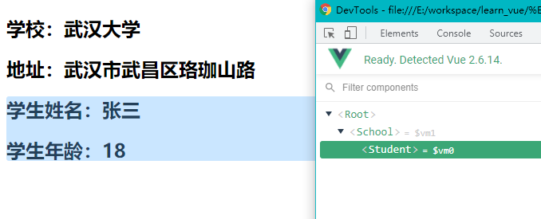

### 2.5 VueComponent

**创建组件**其本质是生成了一个**函数**对象，这个函数是一个**VueComponent 构造函数**（等待实例化），我们看一下`Vue.extend`的**简化源码**。

```js
Vue.extend = function (extendOptions) {
  // ... 其他逻辑暂时省略
  var Sub = function VueComponent(options) {
    this._init(options);
  };
  // ... 其他逻辑暂时省略
  // 生成VueComponent构造函数并返回
  return Sub;
};
```

创建了多个组件，那每个组件拥有的**VueComponent 构造函数**是**不相同的**（上面 return 的是新对象），虽然 VueComponent 实际代码一样，但是它们的**执行环境**、**变量对象**、**this**都是不一样的。你可以简单测试一下。

```html
<!DOCTYPE html>
<html lang="en">
  <head>
    <meta charset="UTF-8" />
    <title>Document</title>
    <script src="https://cdn.jsdelivr.net/npm/vue@2.6.14/dist/vue.js"></script>
  </head>
  <body>
    <div id="root">
      <!-- 使用组件 -->
      <school></school>
      <student></student>
    </div>
    <script type="text/javascript">
      Vue.config.productionTip = false;
      // 创建student组件
      const student = Vue.extend({
        template: `
                <div>
                    <h2>学生姓名：{{name}}</h2>
                    <h2>学生年龄：{{age}}</h2>
                </div>`,
        data() {
          return { name: "张三", age: 18 };
        },
      });
      // 创建school组件
      const school = Vue.extend({
        template: `
                <div>
                    <h2>学校：{{schoolName}}</h2>
                    <h2>地址：{{schoolAddress}}</h2>
                </div>`,
        data() {
          return { schoolName: "武汉大学", schoolAddress: "武汉市武昌区珞珈山路" };
        },
      });
      // 首先验证school和student是个什么东西？其实是个VueComponent构造函数
      console.log("school是什么？", school);
      console.log("student是什么？", student);
      // 再验证不同组件的VueComponent构造函数是否一样，其实不一样，每次Vue.extend都会生成新的
      console.log("student是否与school相同？", school === student);
      school.a = 11;
      console.log("school.a是11，那student.a是多少？", student.a);
      const vm = new Vue({
        el: "#root",
        // 注册组件
        components: { school, student },
      });
    </script>
  </body>
</html>
```

在**模板**中使用组件，其底层是使用`new`关键字调用**VueComponent 构造函数**，将它实例化，生成的实例就是**组件实例**，通常简称为`vc`。`vc`与`vm`的结构**非常类似**，因为**VueComponent 构造函数**和**Vue 构造函数**都会走`this._init(options)`逻辑，区别就是各自的`options`有些不一样，也就是前面说过`el`和`data`有些不一样。`options`里的这些配置`methods`、`watch`、`computed`，在这些配置里面定义**方法**，方法的**this 指向**就是生成的实例，组件就是**组件实例**`vc`。

```js
// 组件实例化时调用
var Sub = function VueComponent(options) {
  this._init(options);
};
// new Vue()时调用
function Vue(options) {
  this._init(options);
}
```

`vm`可以通过**原型**使用一些特殊的属性和方法（公共的），比如`$watch()`，其实`vc`**也能使用**`$watch()`。这涉及到一个**重要的内置关系**，`vc`的**原型**继承了`vm`的**原型**，稍微直白点的说法是，`vc`的**原型对象**可以通过`__proto__`访问到`vm`的**原型对象**。可以看一下`Vue.extend`的简化源码。

```js
// Vue框架中关于VueComponent构造函数
Vue.extend = function (extendOptions) {
  // ... 其他逻辑暂时省略
  // 这里的Super实际上是Vue构造函数
  var Super = this;
  // 都走_init，所以vm有的实例属性和方法，vc几乎都有
  var Sub = function VueComponent(options) {
    this._init(options);
  };
  // 原型式继承，Sub.prototype的__proto__指向了Super.prototype
  Sub.prototype = Object.create(Super.prototype);
  // 让原型上的构造函数引用，重新指向Sub
  Sub.prototype.constructor = Sub;
  // ... 其他逻辑暂时省略
  return Sub; // 返回VueComponent构造函数
};
// js中关于Object.create()的本质，它返回了一个新对象，新对象的__proto__指向了o
function object(o) {
  function F() {} // 定义临时引用类型F的构造函数
  F.prototype = o; // 普通函数的入参对象o作为这个临时引用类型F的原型
  return new F(); // 最后临时引用类型F的实例
}
```

---

**总结拓展**：

1. 组件本质是一个名为**VueComponent**的**构造函数**，且不是程序员自定义的，是`Vue.extend()`新生成的函数对象。
2. 在模板中使用组件，例如`<school></school>`，Vue 解析时会帮我们创建组件的实例对象（school 组件的实例对象）。
3. 特别注意：每次调用`Vue.extend()`，返回的都是一个**全新的**VueComponent 构造函数。
4. 关于 this 的指向：
   1. 组件配置对象中，`methods`、`watch`、`computed`里定义的方法，它们的 this 指向均是 VueComponent 实例(vc)。
   2. `new Vue()`配置对象中，`methods`、`watch`、`computed`里定义的方法，它们的 this 指向均是 Vue 实例对象(vm)。
5. 想要在控制台查看组件的嵌套，可以在`vm.$children`或者`vc.$children`进行查看。
6. 一个重要的内置关系：`VueComponent.prototype.__proto__ === Vue.prototype`。让实例组件`vc`能访问到 Vue 原型上的属性和方法。

---

### 2.6 单文件组件

**单文件组件**就是一个文件**只包含**了一个组件。这个单文件，一般存在于**Vue 脚手架**里，**Vue 脚手架**在[学习 vue 的准备工作](./index.md)里介绍安装过。

单文件的命名方式与[2.3 组件的几个注意点](./2.vue进阶.md#_2-3-组件的几个注意点)这节里组件命名方式一样，在脚手架里常使用**每个单词首字母大写**的方式。单文件的样子就是下面例子`Xxx.vue`，它只有三种标签`<template>`组件的模板、`<script>`脚本、`<style>`样式，比较方便复用。

```vue
<template>
  <!-- 模板，组件的结构 -->
</template>
<script>
// 组件交互相关的代码（数据、方法等）
</script>
<style>
/* 组件的样式 */
</style>
```

我们将前面几节的例子**修改**单文件组件形式（可以先将脚手架的`src/main.js`和`public/index.html`删除），首先准备`School.vue`和`Student.vue`，这两个文件我们放在了一个`src/components`文件夹下。

<!-- tabs:start -->

<!-- tab:School.vue -->

```vue
<template>
  <div>
    <h2>学校：{{ schoolName }}</h2>
    <h2>地址：{{ schoolAddress }}</h2>
  </div>
</template>

<script>
// 将创建的组件，以模块的方式导出去，Vue.extend()省略了
export default {
  name: "School",
  data() {
    return { schoolName: "武汉大学", schoolAddress: "武汉市武昌区珞珈山路" };
  },
};
</script>

<style></style>
```

<!-- tab:Student.vue -->

```vue
<template>
  <div>
    <h2>学生姓名：{{ name }}</h2>
    <h2>学生年龄：{{ age }}</h2>
  </div>
</template>

<script>
// 将组件导出去，省略了Vue.extend()的方式
export default {
  name: "Student",
  data() {
    return { name: "张三", age: 18 };
  },
};
</script>

<style></style>
```

<!-- tab:App.vue -->

然后准备一个`App.vue`，它是一个应用中最大的组件，管理所有的组件，它就放在`src`目录里。

```vue
<template>
  <div>
    <School></School>
    <Student></Student>
  </div>
</template>

<script>
import School from "./components/School.vue";
import Student from "./components/Student.vue";

export default {
  name: "App",
  components: {
    School,
    Student,
  },
};
</script>

<style></style>
```

<!-- tab:main.js -->

此时`vm`实例还没有准备，那就新建一个文件`main.js`，这个`main.js`是 js 入口文件，它放在`src`目录里。

```js
import Vue from "vue";
import App from "./App.vue";

Vue.config.productionTip = false;

/*
    在脚手架里默认不能使用`template`字段，下一章节会解释。可以在项目根目录新建vue.config.js，
    并在里面加上`module.exports={runtimeCompiler: true}`，然后重启项目即可消除限制。
*/
new Vue({
  el: "#app",
  name: "App",
  template: `<App></App>`,
  components: {
    App,
  },
});
```

<!-- tab:index.html -->

最后就是准备一个浏览器**能识别**的 html 入口文件`index.html`，它其实是在`public`目录里。

```html
<!DOCTYPE html>
<html lang="en">
  <head>
    <meta charset="UTF-8" />
    <!-- 针对IE浏览器的一个特殊配置，含义是让IE浏览器以最高的渲染级别渲染页面 -->
    <meta http-equiv="X-UA-Compatible" content="IE=edge" />
    <!-- 开启移动端的理想视口 -->
    <meta name="viewport" content="width=device-width, initial-scale=1.0" />
    <title>Document</title>
  </head>
  <body>
    <div id="app"></div>
    <!-- 在脚手架里，会自动注入这些js，无需手动引入 -->
    <script src="https://cdn.jsdelivr.net/npm/vue@2.6.14/dist/vue.js"></script>
    <script src="./main.js"></script>
  </body>
</html>
```

<!-- tabs:end -->

你可以将上面的几个文件拿到**Vue 脚手架**里对应目录下，**稍加修改**就可以运行使用了。

## 三、组件相关零碎知识

### 3.1 解析成虚拟 DOM 的方式

渲染页面解析成虚拟 DOM 有三种方式：解析**模板标签**、使用**render 函数**、解析配置对象的**template 字段**。前两者用得较多，最后一个**很少使用**了。

- **解析模板标签**需要专用的编译器，这个在项目的`package.json`中可以找到，叫做`vue-template-compiler`。
- **render 函数**使用了`createElement`。
- **解析 template 字段**也是用了一个编译器（要与**模板标签**的区分开），在项目中它是**默认不开启**的。

因为**解析 template 字段**的编译功能默认在脚手架项目中**不开启**，所以在上一章[最后一节](./2.vue进阶.md#_2-6-单文件组件)的`main.js`里，遇到了问题。问题是得到了解决，在项目的**根**目录下新建**vue.config.js**文件，然后在里面写上如下配置（添加 webpack 有关配置），这样就开启了**解析 template 字段**的编译器了。（注意改完重启项目）

```js
module.exports = {
  // 开启Compiler模式，让配置对象可以使用`template`字段
  runtimeCompiler: true,
};
```

但是我们不建议开启**解析 template 字段**的编译功能，原因是与该编译功能的`vue.esm.js`比较大，比默认使用的`vue.runtime.esm.js`**大了 30%**的体积。

### 3.2 render 函数

上一章[最后一节](./2.vue进阶.md#_2-6-单文件组件)的`main.js`，是可以将`template: '<App></App>'`替换成`render()`（**render 函数**），这样就无需添加`runtimeCompiler`有关配置，减小打包后的包体积。

在**配置对象**中`render()`是与`data()`平级的，Vue 在**渲染**时会**调用**这个`render()`，并且会传一个 xxx 参数给`render(xxx)`。要注意，xxx 的**实参**是 Vue 提供给我们的一个**函数**，它是一个用来生成**虚拟 DOM 元素**的函数。生成虚拟 DOM 以后，会`return`给 Vue，Vue 会拿这个虚拟 DOM 去生成**真实 DOM**，完成当前页面或组件的渲染。

xxx**形参名**可以是`createElement`也可以是`h`（自定义名字），使用`createElement()`时，它的入参可以是**原生元素**相关，也可以是**子组件**。

```js
import Vue from "vue";
import App from "./App.vue";
Vue.config.productionTip = false;
new Vue({
  el: "#app",
  /*
    render函数替代了`template`字段。createElement指向的是一个函数，
    该函数是由Vue提供的，用来生成虚拟DOM。生成的虚拟DOM最后要return给Vue的。
    createElement的入参可以是原生元素相关，也可以子组件。createElement
    这个名是自定义的，也可以是h。
  */
  render(createElement) {
    // 如果使用原生元素，第一个参数是标签名，第二个是标签体
    // return createElement('h1', '你好');
    // 注册子组件后，在这里使用子组件，然后就可以展示到当前组件里
    return createElement(App);
  },
  // 在当前组件里注册子组件
  components: {
    App,
  },
});
```

---

**总结拓展**：

1. 渲染页面解析成虚拟 DOM 有三种方式：解析**模板标签**、使用**render 函数**、解析配置对象的**template 字段**。
2. 脚手架项目**默认不开启**解析 template 字段的编译功能，因为前两种基本够用，还能减小打包的包体积。
3. 如果存 js 文件（非 vue 文件）可以使用**render 函数**来渲染组件或页面，render 函数的**形参**指向一个**函数**。该形参就是具体用于生成虚拟 DOM 的函数，接收的参数可以是**原生元素相关**或者**子组件**。

---

### 3.3 ref 特殊属性

我们在[列表渲染](./1.vue基础.md#_6-2-列表渲染)相关章节里介绍过`key`，它是一个特殊的 attribute。这一小节要介绍另外一个特殊的 attribute，`ref`常用来**替代**`id`，用于获取**真实 DOM 元素**或者**子组件的实例**。在模板中使用`ref="xxx"`来给原生元素或子组件进行**注册引用信息**，然后在某个方法中使用`this.$refs.sch`来获取对应的**真实 DOM**或**子组件实例**。

```vue
<template>
  <div>
    <!-- 使用的id，获取时使用document.getElementById -->
    <!-- <h2 id="sch">学校：{{ schoolName }}</h2> -->
    <!-- 使用的ref，获取时使用this.$refs.xxx -->
    <h2 ref="sch">学校：{{ schoolName }}</h2>
    <h2>地址：{{ schoolAddress }}</h2>
    <button @click="getEl">点击获取学校名的元素</button>
    <!-- 在子组件上使用ref，获取时this.$refs.xxx，得到的是子组件的实例对象 -->
    <Student ref="stud"></Student>
  </div>
</template>

<script>
import Student from "./Student.vue";
export default {
  name: "School",
  components: {
    Student,
  },
  data() {
    return { schoolName: "武汉大学", schoolAddress: "武汉市武昌区珞珈山路" };
  },
  methods: {
    getEl() {
      // 返回的是学校名有关的那个h2元素
      console.log("通过ref获取的元素1：", this.$refs.sch);
      // 返回的是Student组件的实例
      console.log("通过ref获取的元素2：", this.$refs.stud);
    },
  },
};
</script>

<style></style>
```

### 3.4 props 数据流向

在**父**组件中调用**子**组件，有时候需要**传递**给**子**组件一些**初始化数据**，子组件拿这些数据进行**渲染**。

我们使用**props 方式传参**：在子组件**被调用**时的**标签里**（编写标签时），把**传参**作为该标签的**属性**；那么对应的，在**子**组件**内部**要使用**props 配置项**进行参数的**接收**。如下代码，我们将`School`作为`Student`的**父**组件，在子组件被调用处的`<Student>`标签里加上`name`和`age`**属性形式**的传参，子组件 Student 内部使用`props: ["name", "age"]`配置项进行接收。

<!-- tabs:start -->

<!-- tab:父组件School.vue -->

**父组件 School.vue**：

```vue
<template>
  <div>
    <h2>学校：{{ schoolName }}</h2>
    <h2>地址：{{ schoolAddress }}</h2>
    <Student name="张三" :age="18"></Student>
    <Student name="李四" :age="20"></Student>
  </div>
</template>

<script>
import Student from "./Student.vue";
export default {
  name: "School",
  components: {
    Student,
  },
  data() {
    return { schoolName: "武汉大学", schoolAddress: "武汉市武昌区珞珈山路" };
  },
};
</script>
```

<!-- tab:子组件Student.vue -->

**子组件 Student.vue**：

```vue
<template>
  <div>
    <h1>{{ msg }}</h1>
    <h2>学生姓名：{{ name }}</h2>
    <h2>学生年龄：{{ age }}</h2>
  </div>
</template>

<script>
export default {
  name: "Student",
  // 使用字符串数组来接收父组件传来的数据
  props: ["name", "age"],
  data() {
    return { msg: "我是一个学生" };
  },
};
</script>
```

<!-- tabs:end -->

- 在使用**props 方式**进行传参有几个**注意点**：

  1. 如果传参数据是**静态字符串**，就直接使用**属性**；如果是**动态的**或者**非字符串**，那就使用`v-bind`进行**动态绑定**（js 表达式）。
  2. 如果你想将一个**对象的所有属性**都传过去，那使用`v-bind="obj"`，子组件内部使用对象**属性名**来接收；如果是将整个对象传过去就`v-bind:param="obj"`，子组件内部使用一个对象比如`param`来接收。

     ```vue
     // 将某个对象的所有属性通过props方式传过去 post: { id: 1, title: 'My Journey with Vue'} //
     父组件模板里编写子组件标签，添上v-bind="post"
     <blog-post v-bind="post"></blog-post>
     // 与上面的写法效果完全一样，这个写法更麻烦
     <blog-post v-bind:id="post.id" v-bind:title="post.title"></blog-post>
     // 接收时就使用属性名来接收 props: ['id', 'title']
     ```

  3. 子组件内部的`props`配置项是与`data`和`methods`是**平级**的，`props`配置项用得最多的形式是**字符串数组**，Vue 初始化时会对这个数组进行解析，并将数组里解析好的**字段**放到`this`上（组件实例），也就是可以通过`this`直接访问这些字段（先于 data 解析）。

- 另外，我们必须记住父子组件间的 props 是由父到子的**单向数据流动**（父通过 props 传数据给子，但子不能修改 props）：
  1. 父组件里的 data 数据变化时，会引起父组件模板重新解析。如果父组件模板里的子组件使用了**props 方式传参**，并且这个参数**跟着**父组件的 data**变化了**，那么子组件内部的**props 配置项**也会变化，子组件的**模板也会重新解析**。如果只是单纯的 props 方式传参，**但是**这个参数**并没有随着**父组件 data 的变化而变化，那子组件的**props 配置项**以及**模板**都不会有变化，**这一点非常重要！！！**不是父组件变动了子组件就一定会变，只有**props 数据变了**才会重新解析**子组件的模板**。
  2. 子组件内部自己对 props 配置项**进行修改**，并不会引发父组件的数据以及模板的变化。如果要在子组件内部**修改 props**应该怎么办？正确做法是使用**data**的变量**转存一份**props（用 computed 的变量来转存也可以），但是**不能同名**，控制台会报错；即使同名，也只会生效 props 的，这意味着 props 的解析**先于**data（data 的同名并不会覆盖 props 里的）。**要记住**，props 配置项是**只读**的，你不能修改它，否则会**报错**！
  3. **但是有一个漏洞**，如果 props 传过来的是一个完整的**对象**时（不是`v-bind="obj"`而是`v-bind:param="obj"`），直接修改对象的引用会**报错**（相当于重新赋一个新对象给引用，所以会报错），去修改**对象上的某个属性**就能修改**成功**的。**不过不建议这么做！**

```vue
<template>
  <div>
    <h1>{{ msg }}</h1>
    <h2>学生姓名：{{ name }}</h2>
    <h2>学生年龄：{{ myAge }}</h2>
    <!-- 不要妄想直接修改age，props是只读数据，这种数据流是单向的 -->
    <button @click="myAge++">我想改一下年龄</button>
  </div>
</template>

<script>
export default {
  name: "Student",
  // 使用字符串数组来接收父组件传来的数据
  props: ["name", "age"],
  data() {
    // 想改props里的age数据，那就使用data里的变量进行转存，但不能同名
    // props先于data解析，所以这里能访问this.age也就是props里的age
    return { msg: "我是一个学生", myAge: this.age };
  },
};
</script>
```

**props**还有**另外两种写法**，是为了对 props 进行验证，用的比较少。**一种方式**是只限制数据**类型**，**另一种方式**是限制数据**类型**、限制**必要性**、指定**默认值**。

```vue
<template>
  <div>
    <h1>{{ msg }}</h1>
    <h2>学生姓名：{{ name }}</h2>
    <h2>学生年龄：{{ age }}</h2>
  </div>
</template>

<script>
export default {
  name: "Student",
  // 限制属性的类型
  /* props: {
    name: String,
    age: Number,
  }, */
  // 限制类型、限制必要性、指定默认值。只有在非必要时才指定默认值。
  props: {
    name: {
      type: String,
      require: true, // 必要的
    },
    age: {
      type: Number,
      require: false, // 非必要的，父组件那里就可以不用传了
      default: 50, // 默认值，如果父组件那里没有传就是用默认值
    },
  },
  data() {
    return { msg: "我是一个学生" };
  },
};
</script>
```

---

**总结拓展**：

1. props 配置项：让组件接收外部传来的数据。
2. 三种写法：
   1. `props: ['name', 'age']`只用于接收；
   2. `props: { name: String, age: Number }`，接收并限制类型；
   3. `props: { age: { type: Number, require: false, default: 50 }}`，接收并限制类型、限制必要性、指定默认值。
3. 父组件到子组件的 props 是**单向**的数据流动。
   1. 父组件的 data 变化，会让父组件模板重新解析，然后子组件的 props 数据如果**随着父组件 data 变化了**，那子组件的模板也会重新解析，否则就算用了 props 方式传值，只要**props 数据不变**就不会让子组件模板重新解析。
   2. 子组件里的 props 配置项是**只读的**，修改就会报错。若想要修改 props 配置项里的数据，请将 props 数据复制到 data 里（computed 也可），但**不能同名**。
   3. 其实还能总结一条：子组件重新渲染只依赖于 data 和 props 的变化。

---

### 3.5 mixin 混入

在使用**不同组件**时，你可能会遇到他们的某些**配置**（`data`、`methods`等）是完全相同的或者一部分相同），这其实是可以进行**代码复用**的，Vue 给我们提供了**配置共用**的功能——**mixin 混入**。

首先是将**\*共用**的配置**提取**到一个单独的 js 文件里，这个 js 文件用于存放**混入对象**，混入对象的各个属性就是**共用**的`data`、`methods`、`mounted`等，最后 export 出去。然后在组件里使用，先将**混入对象**import 进来，再将**混入对象**里存的共用配置与**组件本地**的配置进行**混合**或者说**合并**，具体会涉及到一个新配置项`mixins: [xxx]`（数组形式），xxx 就是**混入对象**。

注意**不是**`data`整体覆盖了`data`（也**不是**`methods`覆盖了`methods`），是`data`中的**属性**进行**合并**（是`methods`中的**方法**进行**合并**），当然，不止是`data`、`methods`，还有`computed`、`watch`等。

比如下面这个例子，我们将`School`和`Student`调成**平级的**，并让他们的`methods`配置一样。我们在`components`目录下新建一个`mixin.js`（名字自定义），在这里放的是被复用的配置（代码完全相同）。

```js
// 分别导出 混入对象m1
export const m1 = {
    // School和Student的methods配置一样，所以被单独抽到这里
    methods: {
        showName() { alert(this.name); },
    },
}
// 分别导出 混入对象m2
export const m2 = { // ... }
```

<!-- tabs:start -->

<!-- tab:School.vue -->

**School.vue**：

```vue
<template>
  <div>
    <h2 @click="showName">学校：{{ name }}</h2>
    <h2 @click="showMsg">地址：{{ address }}</h2>
  </div>
</template>

<script>
// 导入混入对象m1
import { m1 } from "./mixin";
export default {
  name: "School",
  data() {
    return { name: "武汉大学", address: "武汉市武昌区珞珈山路" };
  },
  // 使用mixins配置项，将公用的methods和组件本地的methods混在一起
  mixins: [m1],
  methods: {
    // 与Student的showMsg代码不一样，所以它不能提取到mixin.js
    showMsg() {
      alert(this.address);
    },
  },
};
</script>
```

<!-- tab:Student.vue -->

**Student.vue**：

```vue
<template>
  <div>
    <h2 @click="showName">学生姓名：{{ name }}</h2>
    <h2 @click="showMsg">学生年龄：{{ age }}</h2>
  </div>
</template>

<script>
// 导入混入对象m1
import { m1 } from "./mixin";
export default {
  name: "Student",
  data() {
    return { name: "张三", age: 20 };
  },
  // 使用mixins配置项，将公用的methods和组件本地的methods混在一起
  mixins: [m1],
  methods: {
    // 与School的showMsg代码不一样，所以它不能提取到mixin.js
    showMsg() {
      alert(this.age);
    },
  },
};
</script>
```

<!-- tabs:end -->

像`data`、`methods`等配置项，如果**混合对象**与**组件本地**有**同名**的属性或方法，那么合并的时候**以组件本地为主**。而`mounted`这种生命周期钩子被提取到**混合对象**里，并且组件本地也写了`mounted`生命钩子，那两个地方的生命周期都会运行（mixin 运行一遍，组件本地运行一遍），并不像`data`、`methods`等的合并。

---

**总结拓展**：

1. mixin 混入：可以把多个组件**共用的**配置提取成一个**混入对象**。
2. 使用方法：
   1. 定义混入对象：`const m1 = {methods: {}}`。
   2. 使用混入对象：在配置对象中加入`mixins: [m1]`，前提是 import 导入进来了。
3. 以上是**局部混入**，其实也能**全局混入**，使用得很少。全局混入定义时`Vue.mixin(xxx)`，会给每个`vc`以及`vm`混入配置。全局混入在使用时不再需要`mixins:[m1, m2]`配置项了。

---

### 3.6 插件

**插件**是用于**增强**Vue 的功能，比如[过滤器](./1.vue基础.md#_8-2-过滤器)、[自定义指令](./1.vue基础.md#_9-2-自定义指令)、[mixin 混入](./2.vue进阶.md#_3-5-mixin混入)都可以放到`Vue`上进行**全局**使用。

**插件**是定义在一个单独的 js 里，它具有一个重要的方法叫做`install`，在这个方法中进行过滤器、自定义指令、minxin 混入等全局注册。`install(Vue, a, b, c)`的第一个入参就是**Vue 构造函数**，后面的入参是使用处`Vue.use(plugins, a, b c)`中出传的 a、b、c。

<!-- tabs:start -->

<!-- tab:新建一个plugins.js -->

新建一个**plugins.js**：

```js
// 定义一个插件
export default {
  install(Vue) {
    // 全局配置
    Vue.config.productionTip = false;
    // 全局过滤器
    Vue.filter("addStr", function (value) {
      return value + "测试结果成功";
    });
    // 全局自定义指令
    Vue.directive("big", function (element, binding) {
      element.innerText = binding.value + "测试结果成功";
    });
    // 全局mixin混入
    Vue.mixin({
      data() {
        return {
          test1: "测试全局过滤器：",
          test2: "测试全局自定义指令：",
        };
      },
      methods: {
        showName() {
          alert(this.name);
        },
      },
    });
  },
};
```

<!-- tab:在main.js中使用插件 -->

在**main.js**中使用插件：

```js
import Vue from "vue";
import App from "./App.vue";
import plugins from "./plugins";

// 使用插件
Vue.use(plugins);

new Vue({
  el: "#app",
  render: (h) => h(App),
  components: { App },
});
```

<!-- tab:School.vue -->

在**School.vue**中使用全局过滤器、全局自定义指令、全局混入：

```vue
<template>
  <div>
    <!-- showName是全局混入的一个方法，name是组件本地data中的数据 -->
    <h2 @click="showName">学校：{{ name }}</h2>
    <!-- address是组件本地data数据 -->
    <h2>地址：{{ address }}</h2>
    <!-- test1是全局混入的data数据，addStr是全局过滤器 -->
    <h2>{{ test1 | addStr }}</h2>
    <!-- test2是全局混入的data数据，v-big是全局自定义指令 -->
    <h2 v-big="test2"></h2>
  </div>
</template>

<script>
export default {
  name: "School",
  data() {
    return { name: "武汉大学", address: "武汉市武昌区珞珈山路" };
  },
};
</script>
```

<!-- tab:Student.vue -->

在**Student.vue**中使用全局过滤器、全局自定义指令、全局混入：

```vue
<template>
  <div>
    <!-- showName是全局混入的一个方法，name是组件本地data中的数据 -->
    <h2 @click="showName">学生姓名：{{ name }}</h2>
    <!-- age是组件本地data数据 -->
    <h2>学生年龄：{{ age }}</h2>
    <!-- test1是全局混入的data数据，addStr是全局过滤器 -->
    <h2>测试全局过滤器：{{ test1 | addStr }}</h2>
    <!-- test2是全局混入的data数据，v-big是全局自定义指令 -->
    <h2 v-big="test2"></h2>
  </div>
</template>

<script>
export default {
  name: "Student",
  data() {
    return { name: "张三", age: 20 };
  },
};
</script>
```

<!-- tabs:end -->

---

**总结拓展**：

1. 插件功能：用于增强 Vue。
2. 插件本质：包含 install 方法的一个**对象**，install 第一个参数是 Vue，之后的参数是插件使用者传入的。
3. 定义插件：`对象.install = function(Vue, a, b, c) {}`，install 方法中加`Vue.filter(...)`、`Vue.directive()`等。
4. 使用插件：`Vue.use(对象, a, b, c)`，这个对象就是上面那个“对象”，abc 是多余可以自己传的参数。

---

### 3.7 scoped 样式

两个平级的组件，在使用样式的时候，遇到**同名 class**，它们 class 对应的样式各不相同，但是只生效后引用的**同名 class**样式。Vue 其实给我们解决了**不同**组件的**同名 class**样式冲突的问题，只需要在将`scoped`加到`<style>`上就可以解决，即`<style scoped></style>`。

需要注意的是`App.vue`里经常加**公用样式**，所以`App.vue`的`<style>`里很少加上`scoped`。

<!-- tabs:start -->

<!-- tab:School.vue -->

**School.vue**：

```vue
<template>
  <div class="test">
    <h2 class="title">学校：{{ name }}</h2>
    <h2>地址：{{ address }}</h2>
  </div>
</template>

<script>
export default {
  name: "School",
  data() {
    return { name: "武汉大学", address: "武汉市武昌区珞珈山路" };
  },
};
</script>
<!-- 加上scoped解决class同名问题 -->
<style scoped>
.test {
  background-color: blue;
}
</style>
```

<!-- tab:Student.vue -->

**Student.vue**：

```vue
<template>
  <div class="test">
    <h2 class="title">学生姓名：{{ name }}</h2>
    <h2>学生年龄：{{ age }}</h2>
  </div>
</template>

<script>
export default {
  name: "Student",
  data() {
    return { name: "张三", age: 20 };
  },
};
</script>
<!-- 加上scoped解决class同名问题 -->
<style scoped>
.test {
  background-color: green;
}
</style>
```

<!-- tab:main.js -->

**main.js**：

```js
import Vue from "vue";
import App from "./App.vue";

new Vue({
  el: "#app",
  render: (h) => h(App),
  components: { App },
});
```

<!-- tabs:end -->

## 四、TodoList 案例

### 4.1 将页面拆分成组件

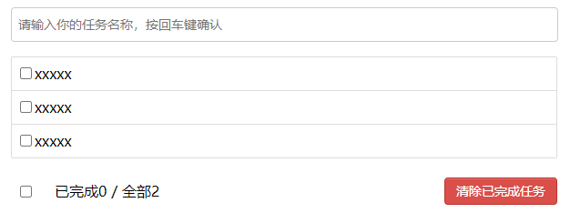

TodoList 静态图如下，这一节是将 TodoList**拆分**成一个个**组件**，要注意的是按照**功能点**来拆分。将**顶部**的输入框作为`AddTodo`**组件**，将**中间**的 Todo 展示列表作为`TodoMain`**组件**，将**底部**的删除、清空等按钮取作为`TotalTodo`**组件**；`TodoMain`**组件**是可以**进一步**拆分成一个个`TodoItem`**组件**的。最后将`AddTodo`、`TodoMain`、`TotalTodo`放入`App.vue`里。

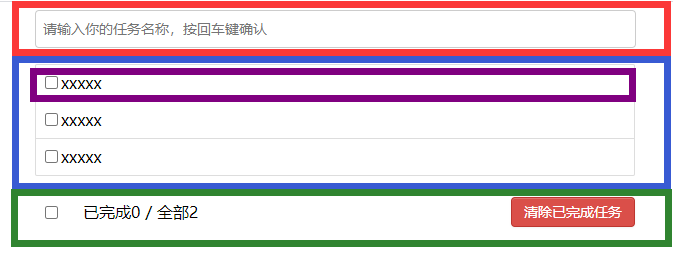

<!-- tabs:start -->

<!-- tab:App.vue -->

容器**App.vue**：

```vue
<template>
  <div class="todo-container">
    <AddTodo></AddTodo>
    <TodoMain></TodoMain>
    <TotalTodo></TotalTodo>
  </div>
</template>

<script>
import AddTodo from "./components/AddTodo.vue";
import TodoMain from "./components/TodoMain.vue";
import TotalTodo from "./components/TotalTodo.vue";

export default {
  name: "App",
  components: {
    AddTodo,
    TodoMain,
    TotalTodo,
  },
};
</script>

<style>
/*base*/
body {
  background: #fff;
}
.btn {
  display: inline-block;
  padding: 4px 12px;
  margin-bottom: 0;
  font-size: 14px;
  line-height: 20px;
  text-align: center;
  vertical-align: middle;
  cursor: pointer;
  box-shadow: inset 0 1px 0 rgba(255, 255, 255, 0.2), 0 1px 2px rgba(0, 0, 0, 0.05);
  border-radius: 4px;
}
.btn-danger {
  color: #fff;
  background-color: #da4f49;
  border: 1px solid #bd362f;
}
.btn-danger:hover {
  color: #fff;
  background-color: #bd362f;
}
.btn:focus {
  outline: none;
}
.todo-container {
  width: 600px;
  margin: 0 auto;
}
.todo-container .todo-wrap {
  padding: 10px;
  border: 1px solid #ddd;
  border-radius: 5px;
}
</style>
```

<!-- tab:AddTodo.vue -->

**顶部**的输入框**AddTodo.vue**：

```vue
<template>
  <div class="todo-header">
    <input type="text" placeholder="请输入你的任务名称，按回车键确认" />
  </div>
</template>

<script>
export default {
  name: "AddTodo",
};
</script>

<style scoped>
/*header*/
.todo-header input {
  width: 585px;
  height: 28px;
  font-size: 14px;
  border: 1px solid #ccc;
  border-radius: 4px;
  padding: 4px 7px;
}
.todo-header input:focus {
  outline: none;
  border-color: rgba(82, 168, 236, 0.8);
  box-shadow: inset 0 1px 1px rgba(0, 0, 0, 0.075), 0 0 8px rgba(82, 168, 236, 0.6);
}
</style>
```

<!-- tab:TodoMain.vue -->

**中间**的 Todo 展示区域**TodoMain.vue**：

```vue
<template>
  <ul class="todo-main">
    <TodoItem></TodoItem>
    <TodoItem></TodoItem>
    <TodoItem></TodoItem>
  </ul>
</template>

<script>
import TodoItem from "./TodoItem.vue";
export default {
  name: "TodoMain",
  components: { TodoItem },
};
</script>

<style scoped>
/*main*/
.todo-main {
  margin-left: 0px;
  border: 1px solid #ddd;
  border-radius: 2px;
  padding: 0px;
}
.todo-empty {
  height: 40px;
  line-height: 40px;
  border: 1px solid #ddd;
  border-radius: 2px;
  padding-left: 5px;
  margin-top: 10px;
}
</style>
```

<!-- tab:TotalTodo.vue -->

**底部**的删除清空按钮区域**TotalTodo.vue**：

```vue
<template>
  <div class="todo-footer">
    <label>
      <input type="checkbox" />
    </label>
    <span> <span>已完成0</span> / 全部2 </span>
    <button class="btn btn-danger">清除已完成任务</button>
  </div>
</template>

<script>
export default {
  name: "TotalTodo",
};
</script>

<style scoped>
/*footer*/
.todo-footer {
  height: 40px;
  line-height: 40px;
  padding-left: 6px;
  margin-top: 5px;
}
.todo-footer label {
  display: inline-block;
  margin-right: 20px;
  cursor: pointer;
}
.todo-footer label input {
  position: relative;
  top: -1px;
  vertical-align: middle;
  margin-right: 5px;
}
.todo-footer button {
  float: right;
  margin-top: 5px;
}
</style>
```

<!-- tab:TodoItem.vue -->

**TodoMain**里的**TodoItem**：

```vue
<template>
  <li>
    <label>
      <input type="checkbox" />
      <span>xxxxx</span>
    </label>
    <button class="btn btn-danger">删除</button>
  </li>
</template>

<script>
export default {
  name: "TodoItem",
};
</script>

<style scoped>
/*item*/
li {
  list-style: none;
  height: 36px;
  line-height: 36px;
  padding: 0 5px;
  border-bottom: 1px solid #ddd;
}
li label {
  float: left;
  cursor: pointer;
}
li label li input {
  vertical-align: middle;
  margin-right: 6px;
  position: relative;
  top: -1px;
}
li button {
  float: right;
  display: none;
  margin-top: 3px;
}
li:before {
  content: initial;
}
li:last-child {
  border-bottom: none;
}
li:hover {
  background-color: #ddd;
}
li:hover button {
  display: block;
}
</style>
```

<!-- tabs:end -->

### 4.2 初始化操作-列表渲染

**初始化列表**，首先在 data 里构造一个**数组**`todos`，每一项存储`id`编号、`title`名称、`done`是否完成；然后使用`v-for`对`todos`进行**遍历**来构造展示 todo 列表，在`<TodoItem>`里使用`v-for="todo in todos"`，不要忘记加上`:key="todo.id"`；再就是要给`TodoItem`子组件进行**传参**，准备一个属性`todoItem`，并动态绑定单项数据，即`:todoItem="todo"`；最后`TodoItem`要接收父组件传来的数据，使用`props: ['todoItem']`。

<!-- tabs:start -->

<!-- tab:TodoMain.vue -->

**TodoMain.vue**：

```vue
<template>
  <ul class="todo-main">
    <TodoItem v-for="todo in todos" :key="todo.id" :todoItem="todo"></TodoItem>
  </ul>
</template>

<script>
import TodoItem from "./TodoItem.vue";
export default {
  name: "TodoMain",
  components: { TodoItem },
  data() {
    return {
      todos: [
        { id: "001", title: "吃饭", done: true },
        { id: "002", title: "学习", done: false },
        { id: "003", title: "游戏", done: false },
      ],
    };
  },
};
</script>
```

<!-- tab:TodoItem.vue -->

**TodoItem.vue**接收数据，并可以对`checkbox`和`span`绑定值：

```vue
<template>
  <li>
    <label>
      <input type="checkbox" :checked="todoItem.done" />
      <span>{{ todoItem.title }}</span>
    </label>
    <button class="btn btn-danger">删除</button>
  </li>
</template>

<script>
export default {
  name: "TodoItem",
  props: ["todoItem"],
};
</script>
```

<!-- tabs:end -->

### 4.3 添加操作-状态提升

前一小节**todos 数据**是存放在`TodoMain`里进行列表渲染，而这一小节要开发`AddTodo`组件的**添加 item 功能**，这样就会用到**todos 数据**。这两个平级的组件**都会读取或修改**todos 数据，那就涉及到**组件间通信**了。

在前面**章节**里只说过父组件向子组件传参使用**props 方式**，这是一种父到子的**单向通信**。而这一小节主要讲一个**最简单**的**组件间通信**（双向），它就是**状态提升**。其实在后面章节里会讲**全局事件总线**和**vuex**等**高级**的**组件间通信**技术，但这是后话了。

所谓的**状态提升**，就是将多个**子**组件的共用数据**提升**到**父**组件里。如果哪个**子**组件想**读取**数据了（为了展示渲染），就通过**props 方式**将**需要的数据**传递给**子**组件（父===>子）；**重点来了**，如果哪个**子**组件想**操作**数据了（为了修改父组件里的原始数据），就将**定义**在父组件里的“**操作数据的方法**”，通过**props 方式**将该方法的**引用**来传递给**子**组件，那么子组件手握**该方法引用**并可以调用它去修改父组件里的原始数据了（子===>父）。

按照**状态提升**，我们假设`A`组件修改了父组件里的存储数据，并且该数据在之前就通过**porps 方式**传给了`B`组件，那么该数据被`A`修改`B`就会**重新读取**（至于`B`为什么重新读取，可以看[3.4 props 数据流向](./2.vue进阶.md#_3-4-props数据流向)这一节内容）。这样的情景反过来，`B`修改数据那`A`也会重新读取，这就达到了`A`与`B`进行了**双向通信**的目的。**父组件**充当了**子组件双向通信**的一个**桥梁**。

我们要对上一小节的代码做简单的修改，将`todos`数据存到`App`这个父组件里，子组件`TodoMain`通过 props 配置接收传来的`todos`数据。还有，父组件`App`要**提前**将**修改数据**的**方法**通过 props 传递给`AddTodo`。

<!-- tabs:start -->

<!-- tab:App.vue -->

**App.vue**：

```vue
<template>
  <div class="todo-container">
    <!-- 要给AddTodo提供修改todos数据的方法 -->
    <AddTodo :addTodo="addTodo"></AddTodo>
    <!-- 要将todos数据传给TodoMain进行展示 -->
    <TodoMain :todos="todos"></TodoMain>
    <TotalTodo></TotalTodo>
  </div>
</template>

<script>
import AddTodo from "./components/AddTodo.vue";
import TodoMain from "./components/TodoMain.vue";
import TotalTodo from "./components/TotalTodo.vue";

export default {
  name: "App",
  components: {
    AddTodo,
    TodoMain,
    TotalTodo,
  },
  data() {
    return {
      // 初始化todos数组，状态提升，将数据放到两个组件的父组件里，通过父组件这个桥梁进行通信
      todos: [
        { id: "001", title: "吃饭", done: true },
        { id: "002", title: "学习", done: false },
        { id: "003", title: "游戏", done: false },
      ],
    };
  },
  methods: {
    // 通过props的方式将addTodo方法暴露给AddTodo去使用，是为了修改todos数据
    addTodo(item) {
      // unshift方法可以触发模板重新解析
      this.todos.unshift(item);
    },
  },
};
</script>
```

<!-- tab:TodoMain.vue -->

**TodoMain.vue**：

```vue
<template>
  <ul class="todo-main">
    <!-- 使用App传来的todos数组 -->
    <TodoItem v-for="todo in todos" :key="todo.id" :todoItem="todo"></TodoItem>
  </ul>
</template>

<script>
import TodoItem from "./TodoItem.vue";
export default {
  name: "TodoMain",
  components: { TodoItem },
  // 接收App传来的todos数组
  props: ["todos"],
};
</script>
```

<!-- tab:AddTodo.vue -->

**AddTodo.vue**：

```vue
<template>
  <div class="todo-header">
    <input type="text" placeholder="请输入你的任务名称，按回车键确认" v-model.trim="title" @keyup.enter="addItem" />
  </div>
</template>

<script>
import { nanoid } from "nanoid";
export default {
  name: "AddTodo",
  // 接收App传来的addTodo，用于修改App里的todos数组
  props: ["addTodo"],
  data() {
    return {
      title: "",
    };
  },
  methods: {
    addItem() {
      if (!this.title) return;
      // 使用nanoid库生成一个唯一id
      const item = { id: nanoid(), title: this.title, done: false };
      // 使用App传来的addTodo，用于修改App里的todos数组（新增一项）
      this.addTodo(item);
      this.title = "";
    },
  },
};
</script>
```

<!-- tabs:end -->

### 4.4 勾选和删除

在[3.4 props 数据流向](./2.vue进阶.md#_3-4-props数据流向)这节里，说过 props 是**只读**的，但它是**对象**时，其实能成功修改它的**属性值**。我们可以利用`props`这个漏洞搭配`v-model`，快速实现`TodoItem`组件里的 checkbox**动态响应**（勾上 or 取消，对应数据也改变）。

```vue
<template>
  <li>
    <label>
      <!-- 利用`props`和v-model实现勾选框与数据之间的动态响应 -->
      <input type="checkbox" v-model="todoItem.done" />
      <span>{{ todoItem.title }}</span>
    </label>
    <button class="btn btn-danger">删除</button>
  </li>
</template>

<script>
export default {
  name: "TodoItem",
  props: ["todoItem"],
};
</script>
```

可以看到上面就用了**一行代码**就达到了勾选框与数据之间的**动态响应**，确实是非常**方便**。但这违背了 props**只读**的原则，那么就只能用上一小节的**状态提升**来实现了。在使用**状态提升**实现 item 的**勾选**时我们顺带实现一下**删除**。

<!-- tabs:start -->

<!-- tab:App.vue -->

**App.vue**：

```vue
<template>
  <div class="todo-container">
    <AddTodo :addTodo="addTodo"></AddTodo>
    <!-- 通过props将方法传递给子组件 -->
    <TodoMain :todos="todos" :checkTodo="checkTodo" :deleteTodo="deleteTodo"></TodoMain>
    <TotalTodo></TotalTodo>
  </div>
</template>

<script>
import AddTodo from "./components/AddTodo.vue";
import TodoMain from "./components/TodoMain.vue";
import TotalTodo from "./components/TotalTodo.vue";

export default {
  name: "App",
  components: {
    AddTodo,
    TodoMain,
    TotalTodo,
  },
  data() {
    return {
      todos: [
        { id: "001", title: "吃饭", done: true },
        { id: "002", title: "学习", done: false },
        { id: "003", title: "游戏", done: false },
      ],
    };
  },
  methods: {
    addTodo(item) {
      this.todos.unshift(item);
    },
    // 给TodoItem提供的方法，用于修改done字段
    checkTodo(id) {
      if (!id) return;
      for (let i = 0; i < this.todos.length; i++) {
        const item = this.todos[i];
        if (item.id === id) {
          item.done = !item.done;
          break;
        }
      }
    },
    // 给TodoItem提供的方法，用于删除一项
    deleteTodo(id) {
      if (!id) return;
      this.todos = this.todos.filter((item) => item.id !== id);
    },
  },
};
</script>
```

<!-- tab:TodoMain.vue -->

**TodoMain.vue**：

```vue
<template>
  <ul class="todo-main">
    <TodoItem
      v-for="todo in todos"
      :key="todo.id"
      :todoItem="todo"
      :checkTodo="checkTodo"
      :deleteTodo="deleteTodo"
    ></TodoItem>
  </ul>
</template>

<script>
import TodoItem from "./TodoItem.vue";
export default {
  name: "TodoMain",
  components: { TodoItem },
  props: ["todos", "checkTodo", "deleteTodo"],
};
</script>
```

<!-- tab:TodoItem.vue -->

**TodoItem.vue**：

```vue
<template>
  <li>
    <label>
      <input type="checkbox" :checked="todoItem.done" @change="handleCheck(todoItem.id)" />
      <span>{{ todoItem.title }}</span>
    </label>
    <button class="btn btn-danger" @click="handleDelete(todoItem.id)">删除</button>
  </li>
</template>

<script>
export default {
  name: "TodoItem",
  props: ["todoItem", "checkTodo", "deleteTodo"],
  methods: {
    handleCheck(id) {
      if (!id) return;
      // 调用App传来的方法，勾选某一项
      this.checkTodo(id);
    },
    handleDelete(id) {
      if (!id) return;
      if (confirm("确实删除吗？")) {
        // 调用App传来的方法，删除某一项
        this.deleteTodo(id);
      }
    },
  },
};
</script>
```

<!-- tabs:end -->

### 4.5 底部统计

这一节要完成“全部 todo 数量统计”、“已完成 todo 数量统计”、“全部或取消全部勾选 todo”、“清除已完成的 todo”。前两个需求可以使用**计算属性**，第三个需求可以使用`:checked`和`@change`来完成，最后一个需求更简单直接让父组件的数据过滤。

<!-- tabs:start -->

<!-- tab:App.vue -->

**App.vue**：

```vue
<template>
  <div class="todo-container">
    <AddTodo :addTodo="addTodo"></AddTodo>
    <TodoMain :todos="todos" :checkTodo="checkTodo" :deleteTodo="deleteTodo"></TodoMain>
    <!-- 将checkAllTodo和clearAllTodo传递给TotalTodo使用 -->
    <TotalTodo :todos="todos" :checkAllTodo="checkAllTodo" :clearAllTodo="clearAllTodo"></TotalTodo>
  </div>
</template>

<script>
import AddTodo from "./components/AddTodo.vue";
import TodoMain from "./components/TodoMain.vue";
import TotalTodo from "./components/TotalTodo.vue";

export default {
  name: "App",
  components: {
    AddTodo,
    TodoMain,
    TotalTodo,
  },
  data() {
    return {
      todos: [
        { id: "001", title: "吃饭", done: true },
        { id: "002", title: "学习", done: false },
        { id: "003", title: "游戏", done: false },
      ],
    };
  },
  methods: {
    // 上两节内容
    addTodo(item) {
      this.todos.unshift(item);
    },
    // 上一节内容
    checkTodo(id) {
      if (!id) return;
      for (let i = 0; i < this.todos.length; i++) {
        const item = this.todos[i];
        if (item.id === id) {
          item.done = !item.done;
          break;
        }
      }
    },
    // 上一节内容
    deleteTodo(id) {
      if (!id) return;
      this.todos = this.todos.filter((item) => item.id !== id);
    },
    // 这一节内容，勾选全部todo或者取消勾选全部todo
    checkAllTodo(done) {
      this.todos.forEach((item) => (item.done = done));
    },
    // 这一节内容，清除已完成的todo
    clearAllTodo() {
      this.todos = this.todos.filter((item) => !item.done);
    },
  },
};
</script>
```

<!-- tab:TotalTodo.vue -->

**TotalTodo.vue**：

```vue
<template>
  <div class="todo-footer" v-show="total">
    <label>
      <input type="checkbox" :checked="isAll" @change="checkAll" />
    </label>
    <span>
      <span>已完成{{ doneTotal }}</span> / 全部{{ total }}
    </span>
    <button class="btn btn-danger" @click="clearAll">清除已完成任务</button>
  </div>
</template>

<script>
export default {
  name: "TotalTodo",
  props: ["todos", "checkAllTodo", "clearAllTodo"],
  computed: {
    // 计算出全部todo的数量
    total() {
      return this.todos.length;
    },
    // 计算出已完成的todo的数量
    doneTotal() {
      // 使用reduce进行统计，accumulator是累计器，currItem是当前操作的项
      const count = this.todos.reduce((accumulator, currItem) => {
        // 只要当前操作的项是已完成的todo，将让累计器加1
        return accumulator + (currItem.done ? 1 : 0);
      }, 0);
      return count;
    },
    // 判断是否全部勾选
    isAll() {
      return this.total > 0 && this.total === this.doneTotal;
    },
  },
  methods: {
    checkAll(e) {
      // 去修改App里的todos所有项的done字段，全部勾选or全部取消
      this.checkAllTodo(e.target.checked);
    },
    clearAll() {
      // 清空App里的todos已完成的todo
      this.clearAllTodo();
    },
  },
};
</script>
```

<!-- tabs:end -->

其实上面**TotalTodo.vue**的`checkbox`还有**优化**的余地，让它勾选的**初识化**状态与**change**事件进行合并，也就是让`v-model`搭配**计算属性**的 getter/setter。在`checkbox`**初始化**时，走计算属性`isAll`的**getter**；当`checkbox`勾选或取消勾选时，走计算属性`isAll`的**setter**。

```vue
<template>
  <div class="todo-footer" v-show="total">
    <label>
      <input type="checkbox" v-model="isAll" />
    </label>
    <span>
      <span>已完成{{ doneTotal }}</span> / 全部{{ total }}
    </span>
    <button class="btn btn-danger" @click="clearAll">清除已完成任务</button>
  </div>
</template>

<script>
export default {
  name: "TotalTodo",
  props: ["todos", "checkAllTodo", "clearAllTodo"],
  computed: {
    total() {
      return this.todos.length;
    },
    doneTotal() {
      const count = this.todos.reduce((accumulator, currItem) => {
        return accumulator + (currItem.done ? 1 : 0);
      }, 0);
      return count;
    },
    // 计算属性isAll搭配v-model，让checkbox初始化时走getter，值变化时让App里的所有todo都勾选or取消勾选上
    isAll: {
      get() {
        return this.total > 0 && this.total === this.doneTotal;
      },
      set(val) {
        this.checkAllTodo(val);
      },
    },
  },
  methods: {
    clearAll() {
      this.clearAllTodo();
    },
  },
};
</script>
```

---

**总结拓展**：

1. 组件化编码流程：
   1. 拆分静态组件：组件要按照**功能点**拆分，命名不要与 html 元素冲突。
   2. 实现动态组件：考虑好数据的**存放位置**，数据是**一个**组件在用，还是**一些**组件在用。
      - 一个组件在用：放在组件自身即可。
      - 一些组件在用：放在它们共同的父组件上。（**状态提升**）
   3. 实现交互：从绑定事件开始。
2. props 适用于：
   1. 父组件===>子组件 通信
   2. 子组件===>父组件 通信（要求父组件先给子组件传一个函数，修改数据）
3. 使用`v-model`时要切记：`v-model`绑定的值不能是 props 传递过来的值，因为 props 是只读的。
4. props 传过来的若是**对象**类型的值，修改对象中的**属性**时 Vue**不会报错**，但不推荐这样做。

---

### 4.6 TodoList 本地缓存

浏览器缓存有`localStorage`和`sessionStorage`，它们大概支持`5M`大小的内容。一直**存在**的缓存是 localStorage，浏览器**关闭后清除**缓存的是 sessionStorage。它们的 API 是一样的：`setItem()`新增或修改一条、`getItem()`读取一条、`removeItem()`删除一条、`clear()`清空所有。特别注意，`setItem()`在存储**非字符串**数据时，会自动将它转为字符串，如果要存对象类型的数据，先手动使用`JSON.stringify(obj)`进行转换。

**关于 localStorage**：

```html
<!DOCTYPE html>
<html lang="en">
  <head>
    <meta charset="UTF-8" />
    <title>Document</title>
  </head>
  <body>
    <h2>localStorage</h2>
    <button onclick="saveData()">保存一份localStorage</button>
    <button onclick="readData()">读取一份localStorage</button>
    <button onclick="deleteData()">删除一份localStorage</button>
    <button onclick="deleteAllData()">清空所有localStorage</button>
    <script type="text/javascript">
      function saveData() {
        // 添加or修改一条localStorage
        localStorage.setItem("name", "张三");
        localStorage.setItem("age", 18);
        const person = { name: "李四", age: 20 };
        // 对象要先转成json字符串，因为setItem会将非字符串的值转为字符串
        localStorage.setItem("person", JSON.stringify(person));
      }
      function readData() {
        // 读取一条localStorage
        console.log("name：", localStorage.getItem("name"));
        console.log("age：", localStorage.getItem("age"));
        const result = localStorage.getItem("person");
        // 将json字符串转为对象
        console.log("person：", JSON.parse(result));
      }
      function deleteData() {
        // 移除一条localStorage
        localStorage.removeItem("name");
      }
      function deleteAllData() {
        // 清空所有localStorage
        localStorage.clear();
      }
    </script>
  </body>
</html>
```

在前面几节的 todolist，每次刷新页面，数据都是固定写死的。我们可以使用`localStorage`或`sessionStorage`进行浏览器缓存，在 todolist 我们需要使用**监视属性**对`todos`进行监视。

```vue
<template>
  <div class="todo-container">
    <AddTodo :addTodo="addTodo"></AddTodo>
    <TodoMain :todos="todos" :checkTodo="checkTodo" :deleteTodo="deleteTodo"></TodoMain>
    <TotalTodo :todos="todos" :checkAllTodo="checkAllTodo" :clearAllTodo="clearAllTodo"></TotalTodo>
  </div>
</template>

<script>
import AddTodo from "./components/AddTodo.vue";
import TodoMain from "./components/TodoMain.vue";
import TotalTodo from "./components/TotalTodo.vue";

export default {
  name: "App",
  components: {
    AddTodo,
    TodoMain,
    TotalTodo,
  },
  data() {
    return {
      // 初始化时读取localStorage，没读取到就用[]
      todos: JSON.parse(localStorage.getItem("todos")) || [],
    };
  },
  watch: {
    todos: {
      // 开启深度监视，能监视到done字段
      deep: true,
      handler(value) {
        // todos数据变化时，将新数据存储到localStorage里
        const jsonStr = JSON.stringify(value);
        localStorage.setItem("todos", jsonStr);
      },
    },
  },
  methods: {
    addTodo(item) {
      this.todos.unshift(item);
    },
    checkTodo(id) {
      if (!id) return;
      for (let i = 0; i < this.todos.length; i++) {
        const item = this.todos[i];
        if (item.id === id) {
          item.done = !item.done;
          break;
        }
      }
    },
    deleteTodo(id) {
      if (!id) return;
      this.todos = this.todos.filter((item) => item.id !== id);
    },
    checkAllTodo(done) {
      this.todos.forEach((item) => (item.done = done));
    },
    clearAllTodo() {
      this.todos = this.todos.filter((item) => !item.done);
    },
  },
};
</script>
```

## 五、自定义事件和全局事件总线

### 5.1 绑定自定义事件

在上一章里，我们使用了**状态提升**来让**平级**的组件进行**通信**。其中有一个**重要环节**，那就是**子组件访问父组件**。具体的，**父组件**通过**props**传递给**子组件**一个**函数**（传的是引用，**函数本身**还存在于父组件），在需要进行**子**组件访问**父**组件时，子组件**内部**就**调用**该**函数**（携带新数据），以达到**子**组件访问**父**组件的目的（子组件调用该函数时，将新数据传递给了该**函数本身**所在的父组件）。

这个**重要环节**最核心的就是那个**传递**的“**函数**”，其实我们可以用“**自定义事件**”来替代这一步骤。**不用**传递**函数**，只需要在绑定自定义事件时**把事件回调函数留给父组件**，然后让子组件**内部**去**触发**事件（触发后，底层会调用**回调函数**），这就能达到**子**组件访问**父**组件的目的（触发时携带新数据，通过事件回调函数传递给父组件）。

具体的，我们在**父组件中**给子组件**标签**里，使用`v-on`来**绑定自定义事件**，该事件的**回调函数**写在**父**组件的`methods`里，在**子**组件想访问（修改）**父**组件的**存储数据**时，让**子**组件**内部**使用`$emit`去**触发**那个**自定义事件**，那么父组件里的那个**回调函数**就会被调用（达到子访问父的目的）。

<!-- tabs:start -->

<!-- tab:App.vue -->

**App.vue**：

```vue
<template>
  <div class="outer">
    <h2>父组件展示信息：{{ info }}</h2>
    <!-- School组件仍然使用状态提升 -->
    <School :schoolChange="schoolChange" />
    <!-- Student组件使用绑定自定义事件 -->
    <Student @changeInfo="studentChange" />
  </div>
</template>

<script>
import School from "./components/School.vue";
import Student from "./components/Student.vue";
export default {
  name: "App",
  components: {
    School,
    Student,
  },
  data() {
    return { info: "还未有人修改这里" };
  },
  methods: {
    // 回调函数，给School使用
    schoolChange(info) {
      this.info = info;
    },
    // 回调函数，给Student使用
    studentChange(info) {
      this.info = info;
    },
  },
};
</script>

<style>
.outer {
  padding: 10px;
  background-color: dimgray;
}
</style>
```

<!-- tab:School.vue -->

**School.vue**：

```vue
<template>
  <div class="school">
    <h2>学校：{{ name }}</h2>
    <h2>地址：{{ address }}</h2>
    <button @click="showInfo">点击我，修改父组件展示信息</button>
  </div>
</template>

<script>
export default {
  name: "School",
  // 状态提升，props需要接收schoolChange回调函数
  props: ["schoolChange"],
  data() {
    return {
      name: "武汉大学",
      address: "武汉市武昌区珞珈山路",
    };
  },
  methods: {
    showInfo() {
      // 调用schoolChange这个回调函数
      this.schoolChange("这里被School子组件修改了");
    },
  },
};
</script>

<style scoped>
.school {
  padding: 20px;
  margin: 20px;
  background-color: forestgreen;
}
</style>
```

<!-- tab:Student.vue -->

**Student.vue**：

```vue
<template>
  <div class="student">
    <h2>姓名：{{ name }}</h2>
    <h2>年龄：{{ age }}</h2>
    <button @click="showInfo">点击我，修改父组件展示信息</button>
  </div>
</template>

<script>
export default {
  name: "Student",
  data() {
    return {
      name: "张三",
      age: 18,
    };
  },
  methods: {
    showInfo() {
      // 并没有使用props接收函数。只是在这里触发自定义事件，父组件那边的回调函数会被调用，还能携带新数据
      this.$emit("changeInfo", "这里被Student子组件修改了");
    },
  },
};
</script>

<style scoped>
.student {
  padding: 20px;
  margin: 20px;
  background-color: hotpink;
}
</style>
```

<!-- tabs:end -->

这种方式简单来说就是，外部绑定事件，内部触发事件；触发时是携带了新数据，将新数据传递给了定义在外部的回调函数（事件内部运行机制）。这种方式不需要通过`props`进行**函数**的**传递**（即子组件也无需使用`props`接收），这比之前的方式更简便。

**绑定自定义事件**除了上面这种`@xxx`**写法**，其实还有**另一种写法**，使用`ref`特殊属性**标记**子组件，然后在**父**组件`mounted`生命钩子里获取这个**子组件实例**，再使用`子组件实例.$on(事件名, 回调函数)`来**绑定自定义事件**。**第二种写法**会比较**灵活**，可以在**异步操作**之后绑定自定义事件。

```vue
<template>
  <div class="outer">
    <h2>父组件展示信息：{{ info }}</h2>
    <School :schoolChange="schoolChange" />
    <!-- 使用ref特殊属性进行标记，对子组件使用ref，获取的就是子组件实例vc -->
    <Student ref="student" />
  </div>
</template>

<script>
import School from "./components/School.vue";
import Student from "./components/Student.vue";
export default {
  name: "App",
  components: {
    School,
    Student,
  },
  data() {
    return { info: "还未有人修改这里" };
  },
  methods: {
    schoolChange(info) {
      this.info = info;
    },
    studentChange(info) {
      this.info = info;
    },
  },
  mounted() {
    // 先通过ref获取到子组件的实例对象，再给子组件实例对象绑定自定义事件
    this.$refs.student.$on("changeInfo", this.studentChange);
  },
};
</script>

<style>
.outer {
  padding: 10px;
  background-color: dimgray;
}
</style>
```

### 5.2 解绑自定义事件

在组件进行**销毁**（`this.$destroy()`）或者它的**父**组件进行**销毁**时，其组件里绑定的自定义事件会**被删除**，尽管这样有时候还是需要进行**手动解绑自定义事件**。

```vue
<template>
  <div class="outer">
    <h2>父组件展示信息：{{ info }}</h2>
    <School ref="school" />
    <Student ref="student" />
    <button @click="offInfoSchEvent">解绑changeInfoSch自定义事件</button><br /><br />
    <button @click="offInfoStuEvent">解绑changeInfoStu自定义事件</button>
  </div>
</template>

<script>
import School from "./components/School.vue";
import Student from "./components/Student.vue";
export default {
  name: "App",
  components: {
    School,
    Student,
  },
  data() {
    return { info: "还未有人修改这里" };
  },
  methods: {
    schoolChange(info) {
      this.info = info;
    },
    studentChange(info) {
      this.info = info;
    },
    offInfoSchEvent() {
      // 解绑自定义事件changeInfoSch
      this.$refs.school.$off("changeInfoSch");
      // 同时解绑多个，解绑school里的xxx事件和yyy事件
      // this.$refs.school.$off(['xxx', 'yyy']);
      // 同时解绑所有的，解绑school里的所有自定义事件
      // this.$refs.school.$off();
    },
    offInfoStuEvent() {
      // 解绑自定义事件changeInfoStu
      this.$refs.student.$off("changeInfoStu");
      // 同时解绑多个，解绑student里的xxx事件和yyy事件
      // this.$refs.student.$off(['xxx', 'yyy']);
      // 同时解绑所有的，解绑student里的所有自定义事件
      // this.$refs.student.$off();
    },
  },
  mounted() {
    // 给school绑定changeInfoSch自定义事件
    this.$refs.school.$on("changeInfoSch", this.schoolChange);
    // 给student绑定changeInfoStu自定义事件
    this.$refs.student.$on("changeInfoStu", this.studentChange);
  },
};
</script>
```

### 5.3 自定义事件注意点

对**子**组件进行自定义事件的**绑定**，那自定义事件的回调函数**一般**写在**父**组件的`methods`里。如果使用`this.$refs.xxx.$on('yyy', function(){})`，也就是将**回调函数**直接**定义**在了**第二个参数**里，那这个回调函数的`this`会指向**子组件实例**，因为**是子组件触发**的自定义事件。想要与`methods`方式一样，让**this**指向**父组件实例**，那么可以让第二个参数使用**箭头函数**。

```js
  mounted() {
    // 给school绑定changeInfoSch自定义事件
    this.$refs.school.$on("changeInfoSch", (info) => {
      this.info = info;
    });
    // 给student绑定changeInfoStu自定义事件
    this.$refs.student.$on("changeInfoStu", (info) => {
      this.info = info;
    });
  },
```

如果在父组件里给子组件标签里使用`v-on`来绑定**原生事件**（前面都是绑定自定义事件），Vue 会认为你绑定的就是**自定义事件**。要解决这个问题，需要加上事件修饰符`.native`，让 Vue 将这个事件绑定到**子**组件模板里的那个**根元素**上。

```vue
<template>
  <div class="outer">
    <h2>父组件展示信息：{{ info }}</h2>
    <!-- 绑定一个原生事件。要达到原生的效果，必须加上.native事件修饰符 -->
    <Student @click.native="showMsg" />
  </div>
</template>

<script>
import Student from "./components/Student.vue";
export default {
  name: "App",
  components: {
    Student,
  },
  data() {
    return { info: "还未有人修改这里" };
  },
  methods: {
    showMsg() {
      console.log("绑定了原生的点击事件");
    },
  },
};
</script>
```

---

**总结拓展**：

1. **自定义事件**是一种组件间通信的方式，适用于 子组件===>父组件。
2. 使用场景：A 是父组件，B 是子组件，B 想给 A 传数据，那么就要在 A 中给 B 绑定自定义事件（事件的回调在 A 中）。
3. 绑定自定义事件：
   1. 第一种方式，在父组件中：`<Student @xxx="yyy" />`，xxx 是自定义事件的名称，yyy 是回调函数。
   2. 第二种方式，在`mounted`生命钩子中：`this.$refs.zzz.$on('xxx', yyy)`，xxx 是自定义事件的名称，yyy 是回调函数，zzz 是子组件上的 ref 属性值。
   3. 若想让自定义事件只触发一次，可以使用`.once`事件修饰符，或`this.$refs.zzz.$once('xxx', yyy)`。
4. 触发自定义事件：`this.$emit('xxx', 数据)`，xxx 是自定义事件的名称。这个触发一般写在子组件里，从子组件传递数据给父组件 。
5. 解绑自定义事件：`this.$off('xxx')`或`this.$refs.zzz.$off('xxx', yyy)`，在子组件或者父组件里解绑。
6. 在父组件中可以为子组件绑定**原生事件**，但需要`.native`事件修饰符。
7. 注意：通过`this.$refs.zzz.$on('xxx', yyy)`绑定自定义事件时，yyy 回调函数要么配置在`methods`里（this 自然指向父组件实例），要么直接定义在此处但要使用箭头函数（否则 this 会指向子组件实例，一般我们期望它指向父组件实例）。

---

### 5.4 TodoList 使用自定义事件

在 TodoList 案例中，**父**组件`App`、**子**组件`AddTodo`、**子**组件`TodoMain`、**子**组件`TotalTodo`、**孙**组件`TodoItem`，我们在这一节要对`App`、`AddTodo`和`TotalTodo`进行改造，将“通过 props 传递函数”的方式改为“**自定义事件**”的方式，涉及**孙**组件这条线的旧方式我们暂时**不动**（在下一节会讲）。

<!-- tabs:start -->

<!-- tab:App.vue -->

**App.vue**：

```vue
<template>
  <div class="todo-container">
    <!-- 将`:addTodo="addTodo"`改为自定义事件 -->
    <AddTodo @addTodoEvent="addTodo"></AddTodo>
    <!-- 涉及到孙组件就不改动了 -->
    <TodoMain :todos="todos" :checkTodo="checkTodo" :deleteTodo="deleteTodo"></TodoMain>
    <!-- 将`:checkAllTodo="checkAllTodo"`和`:clearAllTodo="clearAllTodo"`改为自定义事件 -->
    <TotalTodo :todos="todos" @checkAllEvent="checkAllTodo" @clearAllEvent="clearAllTodo"></TotalTodo>
  </div>
</template>

<script>
import AddTodo from "./components/AddTodo.vue";
import TodoMain from "./components/TodoMain.vue";
import TotalTodo from "./components/TotalTodo.vue";

export default {
  name: "App",
  components: {
    AddTodo,
    TodoMain,
    TotalTodo,
  },
  data() {
    return {
      todos: JSON.parse(localStorage.getItem("todos")) || [],
    };
  },
  watch: {
    todos: {
      deep: true,
      handler(value) {
        const jsonStr = JSON.stringify(value);
        localStorage.setItem("todos", jsonStr);
      },
    },
  },
  methods: {
    addTodo(item) {
      this.todos.unshift(item);
    },
    checkTodo(id) {
      if (!id) return;
      for (let i = 0; i < this.todos.length; i++) {
        const item = this.todos[i];
        if (item.id === id) {
          item.done = !item.done;
          break;
        }
      }
    },
    deleteTodo(id) {
      if (!id) return;
      this.todos = this.todos.filter((item) => item.id !== id);
    },
    checkAllTodo(done) {
      this.todos.forEach((item) => (item.done = done));
    },
    clearAllTodo() {
      this.todos = this.todos.filter((item) => !item.done);
    },
  },
};
</script>
```

<!-- tab:AddTodo.vue -->

**AddTodo.vue**：

```vue
<template>
  <div class="todo-header">
    <input type="text" placeholder="请输入你的任务名称，按回车键确认" v-model.trim="title" @keyup.enter="addItem" />
  </div>
</template>

<script>
import { nanoid } from "nanoid";
export default {
  name: "AddTodo",
  data() {
    return {
      title: "",
    };
  },
  methods: {
    addItem() {
      if (!this.title) return;
      const item = { id: nanoid(), title: this.title, done: false };
      // 删除props里的addTodo，然后在这里改为$emit触发自定义事件addTodoEvent
      this.$emit("addTodoEvent", item);
      this.title = "";
    },
  },
};
</script>
```

<!-- tab:TotalTodo.vue -->

**TotalTodo.vue**：

```vue
<template>
  <div class="todo-footer" v-show="total">
    <label>
      <input type="checkbox" v-model="isAll" />
    </label>
    <span>
      <span>已完成{{ doneTotal }}</span> / 全部{{ total }}
    </span>
    <button class="btn btn-danger" @click="clearAll">清除已完成任务</button>
  </div>
</template>

<script>
export default {
  name: "TotalTodo",
  props: ["todos"],
  computed: {
    total() {
      return this.todos.length;
    },
    doneTotal() {
      const count = this.todos.reduce((accumulator, currItem) => {
        return accumulator + (currItem.done ? 1 : 0);
      }, 0);
      return count;
    },
    isAll: {
      get() {
        return this.total > 0 && this.total === this.doneTotal;
      },
      set(val) {
        // 删除props里的checkAllTodo，然后在这里改为$emit触发自定义事件checkAllEvent
        this.$emit("checkAllEvent", val);
      },
    },
  },
  methods: {
    clearAll() {
      // 删除props里的clearAllTodo，然后在这里改为$emit触发自定义事件clearAllEvent
      this.$emit("clearAllEvent");
    },
  },
};
</script>
```

<!-- tabs:end -->

### 5.5 全局事件总线

给一个组件**绑定**和**触发**自定义事件，是可以在组件的**外部**或**内部**进行的。这是因为，在内部可以通过`this`获取组件实例，在外部可以通过`this.$refs.xxx`来获取组件实例，又因为组件实例可以通过`__proto__`访问**原型**上的`$on()`和`$emit()`，所以不管是在组件的**外部**或**内部**都能进行**绑定**和**触发**自定义事件。这一点非常重要，基本是这一章的**核心思想**了。

那如果我们准备一个**所有**组件**都能访问**到的**公共组件**，那**其他组件**是不是都可以**使用**这个公共组件的`$on()`和`$emit()`了。

我们让`A`组件访问公共组件的`$on()`，给这个公共组件**绑定**一个自定义事件，回调函数留给`A`组件；再让`B`组件去访问公共组件的`$emit()`，**触发**之前的**同名**自定义事件（携带新数据），这样`B`组件与`A`组件进行了**单方面通信**。**反之亦然**，`A`也能与`B`进行通信，那么实际上就是**双方通信**。那么再把范围扩大，那**所有**的组件之间都能进行**互相通信**了（任意组件间的通信）。

但现在要考虑这个**公共组件**是谁，要存在于哪：

- 我们明确一点，组件实例的`__proto__`指向的原型对象，是继承自`Vue.prototype`的，这个在[2.5 VueComponent](./2.vue进阶.md#_2-5-vuecomponent)这节说过。那么组件实例通过`__proto__`访问到原型对象，该原型对象又通过**继承关系**访问到`Vue.prototype`，就可以拿到`$on()`和`$emit()`。
- 不要妄想直接通过`Vue.prototype.$on()`和`Vue.prototype.$emit()`来绑定自定义事件，你绑定给谁？还得是一个实例。那是 Vue 实例`vm`还是某个组件实例`vc`呢？
- 其实**公共组件**是 Vue 实例`vm`。使用`$on()`和`$emit()`时，直接通过`vm`的`__proto__`拿就可以了；如果是一个单独的新组件实例，链路会长一点。
- 公共组件是谁搞清楚了，那这个`vm`存在哪了？以前是用`const vm=`来接收它，在脚手架项目是没有这样的，可以在`main.js`给 Vue 进行实例化时使用`beforeCreate`生命钩子，将`this`存到`Vue.prototype`，即`Vue.prototype.$bus = this`。这个`$bus`就是这一节的**全局事件总线**。

```js
import Vue from "vue";
import App from "./App.vue";

new Vue({
  el: "#app",
  render: (h) => h(App),
  components: {
    App,
  },
  beforeCreate() {
    // 安装全局事件总线，所有组件都能访问到$bus，并且所有组件都能使
    // 用到$bus的`$on()`和`$emit()`将自定义事件绑定到$bus身上
    Vue.prototype.$bus = this;
  },
});
```

我们用`School`和`Student`来演示**平级组件**间使用**全局事件总线**进行**互相通信**。

<!-- tabs:start -->

<!-- tab:App.vue -->

**App.vue**：

```vue
<template>
  <div class="outer">
    <h2>这里是父组件，本例不会涉及到父组件</h2>
    <School />
    <Student />
  </div>
</template>

<script>
import School from "./components/School.vue";
import Student from "./components/Student.vue";
export default {
  name: "App",
  components: {
    School,
    Student,
  },
};
</script>
```

<!-- tab:School.vue -->

**School.vue**：

```vue
<template>
  <div class="school">
    <h2>School-Info：{{ info }}</h2>
    <h3>学校：{{ name }}</h3>
    <h3>地址：{{ address }}</h3>
    <button @click.stop="changeInfo">修改Student组件展示信息</button>
  </div>
</template>

<script>
export default {
  name: "School",
  data() {
    return {
      info: "School这里还未被修改",
      name: "武汉大学",
      address: "武汉市武昌区珞珈山路",
    };
  },
  mounted() {
    // 给$bus绑定一个自定义事件changeSchoolEvent，将回调函数updateInfo留在了School组件本地
    this.$bus.$on("changeSchoolEvent", this.updateInfo);
  },
  beforeDestroy() {
    // 在本组件销毁前解绑之前绑定的自定义事件，否则当前组件销毁了，该事件一直存在
    this.$bus.$off("changeSchoolEvent");
  },
  methods: {
    updateInfo(info) {
      this.info = info;
    },
    changeInfo() {
      // 触发$bus上的changeStudentEvent事件，用以School对Student的通信
      this.$bus.$emit("changeStudentEvent", "由School组件修改了Student组件的展示信息");
    },
  },
};
</script>
```

<!-- tab:Student.vue -->

**Student.vue**：

```vue
<template>
  <div class="student">
    <h2>Student-Info：{{ info }}</h2>
    <h3>姓名：{{ name }}</h3>
    <h3>年龄：{{ age }}</h3>
    <button @click.stop="changeInfo">修改School组件展示信息</button>
  </div>
</template>

<script>
export default {
  name: "Student",
  data() {
    return {
      info: "Student这里还未被修改",
      name: "张三",
      age: 18,
    };
  },
  mounted() {
    // 给$bus绑定一个自定义事件changeStudentEvent，将回调函数updateInfo留在了Student组件本地
    this.$bus.$on("changeStudentEvent", this.updateInfo);
  },
  beforeDestroy() {
    // 在本组件销毁前解绑之前绑定的自定义事件，否则当前组件销毁了，该事件一直存在
    this.$bus.$off("changeStudentEvent");
  },
  methods: {
    updateInfo(info) {
      this.info = info;
    },
    changeInfo() {
      // 触发$bus上的changeSchoolEvent事件，用以Student对School的通信
      this.$bus.$emit("changeSchoolEvent", "由Student组件修改了School组件的展示信息");
    },
  },
};
</script>
```

<!-- tabs:end -->

---

**总结拓展**：

1. **全局事件总线**是一种组件间通信的方式，适用于任意组件间的通信。
2. 安装全局事件总线，在`new Vue()`时，使用`beforeCreate`生命钩子，在里面写上`Vue.prototype.$bus = this`。
3. 使用全局事件总线：
   1. 接收数据（绑定事件）：A 组件想要接收数据，则在 A 组件中给`$bus`绑定自定义事件，事件的回调函数留在 A 组件自身。`this.$bus.$on(事件名, 回调函数)`
   2. 提供数据（触发事件）：在其他组件使用`this.$bus.$emit(事件名, 数据)`进行传递数据。
4. 最好在当前组件的`beforeDestroy`生命钩子中，用`$off`去解绑当前组件之前绑定的自定义事件。

---

### 5.6 TodoList 使用全局事件总线

在[5.4 TodoList 使用自定义事件](./2.vue进阶.md#_5-4-todolist使用自定义事件)这节里我们留下了孙组件这条线没有修改，我们可以让孙组件`TodoItem`与祖父组件`App`之间使用全局事件总线。当然，其他组件之间也是可以使用全局事件总线的，但是没有必要。

<!-- tabs:start -->

<!-- tab:App.vue -->

**App.vue**：

```vue
<template>
  <div class="todo-container">
    <!-- 将`:addTodo="addTodo"`改为自定义事件 -->
    <AddTodo @addTodoEvent="addTodo"></AddTodo>
    <!-- 涉及到孙组件就不改动了 -->
    <TodoMain :todos="todos"></TodoMain>
    <!-- 将`:checkAllTodo="checkAllTodo"`和`:clearAllTodo="clearAllTodo"`改为自定义事件 -->
    <TotalTodo :todos="todos" @checkAllEvent="checkAllTodo" @clearAllEvent="clearAllTodo"></TotalTodo>
  </div>
</template>

<script>
import AddTodo from "./components/AddTodo.vue";
import TodoMain from "./components/TodoMain.vue";
import TotalTodo from "./components/TotalTodo.vue";

export default {
  name: "App",
  components: {
    AddTodo,
    TodoMain,
    TotalTodo,
  },
  mounted() {
    // 在全局事件总线上注册自定义事件，方便孙组件TodoItem进行触发事件，回调函数留在本组件
    this.$bus.$on("checkTodoEvent", this.checkTodo);
    this.$bus.$on("deleteTodoEvent", this.deleteTodo);
  },
  beforeDestroy() {
    // 绑定在全局事件总线上的自定义事件，记得在本组件销毁前要解绑自定义事件
    this.$bus.$off("checkTodoEvent");
    this.$bus.$off("deleteTodoEvent");
  },
  data() {
    return {
      todos: JSON.parse(localStorage.getItem("todos")) || [],
    };
  },
  watch: {
    todos: {
      deep: true,
      handler(value) {
        const jsonStr = JSON.stringify(value);
        localStorage.setItem("todos", jsonStr);
      },
    },
  },
  methods: {
    addTodo(item) {
      this.todos.unshift(item);
    },
    // 提供给孙组件TodoItem来触发的自定义事件的回调函数checkTodo
    checkTodo(id) {
      if (!id) return;
      for (let i = 0; i < this.todos.length; i++) {
        const item = this.todos[i];
        if (item.id === id) {
          item.done = !item.done;
          break;
        }
      }
    },
    // 提供给孙组件TodoItem来触发的自定义事件的回调函数deleteTodo
    deleteTodo(id) {
      if (!id) return;
      this.todos = this.todos.filter((item) => item.id !== id);
    },
    checkAllTodo(done) {
      this.todos.forEach((item) => (item.done = done));
    },
    clearAllTodo() {
      this.todos = this.todos.filter((item) => !item.done);
    },
  },
};
</script>
```

<!-- tab:TodoItem.vue -->

**TodoItem.vue**：

```vue
<template>
  <li>
    <label>
      <input type="checkbox" :checked="todoItem.done" @change="handleCheck(todoItem.id)" />
      <span>{{ todoItem.title }}</span>
    </label>
    <button class="btn btn-danger" @click="handleDelete(todoItem.id)">删除</button>
  </li>
</template>

<script>
export default {
  name: "TodoItem",
  props: ["todoItem"],
  methods: {
    handleCheck(id) {
      if (!id) return;
      // 触发祖父组件App绑定在全局事件总线上的自定义事件checkTodoEvent，并传递数据给父组件
      this.$bus.$emit("checkTodoEvent", id);
    },
    handleDelete(id) {
      if (!id) return;
      if (confirm("确实删除吗？")) {
        // 触发祖父组件App绑定在全局事件总线上的自定义事件checkTodoEvent，并传递数据给父组件
        this.$bus.$emit("deleteTodoEvent", id);
      }
    },
  },
};
</script>
```

<!-- tabs:end -->

### 5.7 给 TodoList 追加编辑功能

这一节要给已有的 TodoList 追加编辑功能，让每一项可以进行单独的编辑，实现该功能有这些注意点：

- 每一项的**删除按钮**旁要新增一个编辑按钮，还要加上一个输入框，在编辑状态下隐藏“编辑按钮”，并让输入框覆盖原来的文本。
- 给`TodoItem`组件新增一个 data 数据，名为`isEdit`。
- 按下编辑按钮修改`isEdit`；输入完**失去焦点**也得修改`isEdit`，输入完得修改 todos 数据，得使用全局事件总线。
- 按下编辑按钮得让输入框立即获得焦点，但是修改`isEdit`**不会立马**让页面更新，原因是浏览器要等**修改数据这一轮 task**执行完，才能去执行**更新页面这一轮 task**，那么`focus`必须得延迟到“更新页面这一轮 task\*”之后再执行。Vue 给我们提供了`$nextTick(callback)`，让 callback 在下一次更新完之后调用（下一轮 task 执行完之后调用 callback）。

<!-- tabs:start -->

<!-- tab:App.vue -->

**App.vue**：

```vue
<template>
  <div class="todo-container">
    <AddTodo @addTodoEvent="addTodo"></AddTodo>
    <TodoMain :todos="todos"></TodoMain>
    <TotalTodo :todos="todos" @checkAllEvent="checkAllTodo" @clearAllEvent="clearAllTodo"></TotalTodo>
  </div>
</template>

<script>
import AddTodo from "./components/AddTodo.vue";
import TodoMain from "./components/TodoMain.vue";
import TotalTodo from "./components/TotalTodo.vue";

export default {
  name: "App",
  components: {
    AddTodo,
    TodoMain,
    TotalTodo,
  },
  mounted() {
    this.$bus.$on("checkTodoEvent", this.checkTodo);
    this.$bus.$on("deleteTodoEvent", this.deleteTodo);
    // 编辑后更新title
    this.$bus.$on("updateTodoEvent", this.updateTodo);
  },
  beforeDestroy() {
    this.$bus.$off("checkTodoEvent");
    this.$bus.$off("deleteTodoEvent");
    this.$bus.$off("updateTodoEvent");
  },
  data() {
    return {
      todos: JSON.parse(localStorage.getItem("todos")) || [],
    };
  },
  watch: {
    todos: {
      deep: true,
      handler(value) {
        const jsonStr = JSON.stringify(value);
        localStorage.setItem("todos", jsonStr);
      },
    },
  },
  methods: {
    addTodo(item) {
      this.todos.unshift(item);
    },
    checkTodo(id) {
      if (!id) return;
      for (let i = 0; i < this.todos.length; i++) {
        const item = this.todos[i];
        if (item.id === id) {
          item.done = !item.done;
          break;
        }
      }
    },
    deleteTodo(id) {
      if (!id) return;
      this.todos = this.todos.filter((item) => item.id !== id);
    },
    checkAllTodo(done) {
      this.todos.forEach((item) => (item.done = done));
    },
    clearAllTodo() {
      this.todos = this.todos.filter((item) => !item.done);
    },
    // 编辑后更新title
    updateTodo(id, title) {
      if (!id) return;
      for (let i = 0; i < this.todos.length; i++) {
        const item = this.todos[i];
        if (item.id === id) {
          item.title = title;
          break;
        }
      }
    },
  },
};
</script>
```

<!-- tab:TodoItem.vue -->

**TodoItem.vue**：

```vue
<template>
  <li>
    <label>
      <input type="checkbox" :checked="todoItem.done" @change="handleCheck(todoItem.id)" />
      <span v-show="!isEdit">{{ todoItem.title }}</span>
      <input
        type="text"
        v-show="isEdit"
        :value="todoItem.title"
        ref="inputTodo"
        @blur="inputBlur(todoItem.id, $event)"
      />
    </label>
    <button class="btn btn-danger" @click="handleDelete(todoItem.id)">删除</button>
    <button class="btn btn-edit" @click="handleEdit" v-show="!isEdit">编辑</button>
  </li>
</template>

<script>
export default {
  name: "TodoItem",
  props: ["todoItem"],
  data() {
    return {
      isEdit: false,
    };
  },
  methods: {
    handleCheck(id) {
      if (!id) return;
      this.$bus.$emit("checkTodoEvent", id);
    },
    handleDelete(id) {
      if (!id) return;
      if (confirm("确实删除吗？")) {
        this.$bus.$emit("deleteTodoEvent", id);
      }
    },
    // 处理编辑操作
    handleEdit() {
      // 这一轮走完都是只是修改了data数据，下一轮才是更新页面
      this.isEdit = true;
      // 如果不使用$nextTick，这一轮的input还未展示到页面，所以必须等到下一轮页面更新完，再让input获得焦点
      this.$nextTick(() => {
        this.$refs.inputTodo.focus();
      });
    },
    // 失去焦点
    inputBlur(id, e) {
      if (!id) return;
      this.isEdit = false;
      // 更新todos里的title
      this.$bus.$emit("updateTodoEvent", id, e.target.value);
    },
  },
};
</script>
```

<!-- tabs:end -->

## 六、Vue 中的动画与过渡

### 6.1 动画

回顾一下 css 中**原生**的动画，`animation: duration timing-function delay iteration-count direction fill-mode play-state name`：

- `duration`：动画总时间
- `timing-function`：动效方式
- `delay`：延时触发时间
- `iteration-count`：播放次数，可以带小数位
- `direction`：播放方向，其值`normal`正向播放，`reverse`方向播放，`alternate`正向交替播放，`alternate-reverse`方向交替播放。
- `fill-mode`：确定开始前或结束后是什么样式，其值`none`默认样式，`forwards`采用遇到的最后的一个关键帧，`backwards`采用遇到的第一个关键帧，`both`同时应用`forwards`和`backwards`。
- `play-state`：动画是运行或暂停，`running`和`paused`。
- `name`：@keyframes 动画名字。

我们使用`animation`搭配`:class`来实现动画的切换（就是修改 className），代码如下

```vue
<template>
  <div>
    <button @click="switchDisplay">显示/隐藏</button>
    <h2 :class="displayNow">你好啊啊啊啊啊</h2>
  </div>
</template>

<script>
export default {
  name: "AnimationTest",
  data() {
    return { displayNow: "display-enter" };
  },
  methods: {
    switchDisplay() {
      this.displayNow = this.displayNow === "display-leave" ? "display-enter" : "display-leave";
    },
  },
};
</script>

<style>
h2 {
  background-color: tomato;
}
/* 进入时的class */
.display-enter {
  animation: 3s ease 0.2s 1 normal both running aniEnter;
}
/* 出去时的class，注意切换动画不要用reverse，最好新建单独的离开@keyframes动画 */
.display-leave {
  animation: 3s ease 0.2s 1 normal both running aniLeave;
}
@keyframes aniEnter {
  from {
    transform: translateX(-100%);
  }
  to {
    transform: translateX(0);
  }
}
@keyframes aniLeave {
  from {
    transform: translateX(0);
  }
  to {
    transform: translateX(-100%);
  }
}
</style>
```

上面这种方式在**没有遇到**`v-show`或`v-if`之前还是挺好用的，一旦遇到`v-show`或`v-if`，上面这种方式就无法奏效了。因为在元素被移除或者`display:none`，动画不会被执行。其实 Vue 给我们**封装好了过渡和动画**，只需要我们使用简单的 css 样式搭配类名就可以使用了。


`<trnsition>`标签用于包裹一个想要执行动画的元素或组件：

- transition 只是一个标签，不占位置不会形成一个真正的元素，这个同 template 一样。
- transition 标签可用`name`属性区分是哪个组件用什么动画样式，不至于混淆。
  - 如果**没有**`name`属性，那 css 中关联的动画样式**类名**就是**默认**的`.v-enter-active`和`.v-leave-active`。
  - 如果**有**`name`属性，比如 name 属性值是`hello`，那 css 中关联的动画样式名就`.hello-enter-active`和`.hello-leave-active`。
- `.v-enter-active {animation:xxx}`是**进入时**执行动画的样式，`.v-leave-active {animation:xxx}`是**离开时**执行动画的样式。
- 如果想在**初始化**就进行动画的执行，可以在 transition 标签里加上`:appear="true"`

```vue
<template>
  <div>
    <button @click="displayNow = !displayNow">显示/隐藏</button>
    <!-- Vue提供的transition，能让v-if和v-show加上animation动画 -->
    <transition name="hello" :appear="true">
      <h2 v-if="displayNow">你好啊啊啊啊啊</h2>
    </transition>
  </div>
</template>

<script>
export default {
  name: "AnimationTest",
  data() {
    return { displayNow: true };
  },
};
</script>

<style>
h2 {
  background-color: tomato;
}
/* 如果transition标签没有name属性，那它默认是.v-enter-active，如果有name那就是.name值-enter-active */
.hello-enter-active {
  animation: 3s ease 0.2s 1 normal both running aniEnter;
}
/* 如果transition标签没有name属性，那它默认是.v-leave-active，如果有name那就是.name值-leave-active */
.hello-leave-active {
  animation: 3s ease 0.2s 1 normal both running aniLeave;
}
@keyframes aniEnter {
  from {
    transform: translateX(-100%);
  }
  to {
    transform: translateX(0);
  }
}
@keyframes aniLeave {
  from {
    transform: translateX(0);
  }
  to {
    transform: translateX(-100%);
  }
}
</style>
```

### 6.2 过渡

因为`animation`有`@keyframes`，可以在`@keyframes`里决定**开始**和**结束**的**状态**，那么**动画的类名**也只涉及到`.v-enter-active`和`.v-leave-active`。而这个`transition`没有`@keyframes`，那就需要**单独**定义**开始**和**结束**的**状态**。

`transition`的类名除了需要`.v-enter-active`和`.v-leave-active`以外（甚至一些情况下不需要这两个类名，直接将**过渡信息**写在元素本身上），还需要`v-enter`、`v-enter-to`、`v-leave-to`、`v-leave-to`，分别表示“进入过程的开始状态”、“进入过程的结束状态”、“离开过程的开始状态”“离开过程的结束状态”。

```vue
<template>
  <div>
    <button @click="displayNow = !displayNow">显示/隐藏</button>
    <!-- Vue提供的transition，能让v-if和v-show加上animation动画 -->
    <transition name="hello" :appear="true">
      <h2 v-show="displayNow">你好啊啊啊啊啊</h2>
    </transition>
  </div>
</template>

<script>
export default {
  name: "AnimationTest",
  data() {
    return { displayNow: true };
  },
};
</script>

<style>
h2 {
  background-color: tomato;
}
/* 过渡信息写在这两个类名里，甚至可以直接放到h2元素里 */
.hello-enter-active,
.hello-leave-active {
  transition: 3s ease;
}
/* 进入过程的开始状态就是-100%，并且离开过程的结束状态也是-100% */
.hello-enter,
.hello-leave-to {
  transform: translateX(-100%);
}
/* 进入过程的结束状态就是0，并且离开过程的开始状态也是0 */
.hello-enter-to,
.hello-leave {
  transform: translateX(0);
}
</style>
```

### 6.3 多元素动画/过渡

多个元素进行动画/过渡，可以使用`v-if`控制只显示一个，也可以使用单独的**容器**将多个元素进行**包裹**再使用`<transition>`标签。还有一种是使用`<transition-group>`。**注意**：同名元素 or 组件，得使用`key`来区分彼此。

`v-if`方式：

```vue
<template>
  <transition>
    <button v-if="isEditing" key="save">Save</button>
    <button v-else key="edit">Edit</button>
  </transition>
</template>
```

`<transition-group>`方式：

```vue
<template>
  <div>
    <button @click="displayNow = !displayNow">显示/隐藏</button>
    <!-- 简单修改了上一节的模板即可 -->
    <transition-group name="hello" :appear="true">
      <!-- 使用key来区分 -->
      <h2 v-show="displayNow" key="1">你好啊啊啊啊啊</h2>
      <h2 v-show="!displayNow" key="2">我不好啊啊啊啊</h2>
    </transition-group>
  </div>
</template>
```

### 6.4 集成第三方动画库

推荐[Animate.css`](https://animate.style/)， 使用`npm i animate.css`进行安装，安装之后引入到项目里`import "animate.css"`。

然后选择一个要**使用动画**的`<transition>`或`<transition-group>`，在标签里添加`name="animate__animated animate__bounce"`，如果不是 Vue 项目，这个`name`换成`class`。

再就是使用 Vue 给我们提供的 6 个**自定义过渡的类名**，是专门用来配合第三方动画库来使用的。这 6 个和[6.2 过渡](./2.vue进阶.md#_6-2-过渡)这节里的类名极其相似，只是将`v-`换成`class`放到了末尾。

- `enter-active-class`：进入过程的动效
- `leave-active-class`：离开过程的动效
- `enter-class`：进入过程的开始状态
- `enter-to-class`：进入过程的结束状态
- `leave-class`：离开过程的开始状态
- `leave-to-class`：离开过程的结束状态

```vue
<template>
  <div>
    <button @click="displayNow = !displayNow">显示/隐藏</button>
    <!-- 引入第三方动画库 -->
    <transition
      :appear="true"
      name="animate__animated animate__bounce"
      enter-active-class="animate__backInDown"
      leave-active-class="animate__backOutRight"
    >
      <h2 v-show="displayNow">你好啊啊啊啊啊</h2>
    </transition>
  </div>
</template>

<script>
import "animate.css";
export default {
  name: "AnimationTest",
  data() {
    return { displayNow: true };
  },
};
</script>

<style>
h2 {
  background-color: tomato;
}
</style>
```

我们给 TodoList 案例加上第三方动画库，在新增和删除时，让每一项的进入和离开都具有动画。

```vue
<template>
  <ul class="todo-main">
    <!-- 要记得引入import "animate.css"，每一项本就有key了   -->
    <transition-group
      name="animate__animated animate__bounce"
      enter-active-class="animate__backInRight"
      leave-active-class="animate__backOutLeft"
    >
      <TodoItem v-for="todo in todos" :key="todo.id" :todoItem="todo"></TodoItem>
    </transition-group>
  </ul>
</template>
```

---

**总结拓展**：

1. Vue 给我们**封装**好了**过渡与动画**，因为原生的 css 过渡和动画你不好掌握在 Vue 项目中什么情况下能使用。
2. 在插入、更新和移除 DOM 元素时，在合适的时候给元素加样式类名。
3. 准备好样式：
   1. 元素进入时的样式：
      - `v-enter`：进入的起点（进入过程的开始状态）
      - `v-enter-to`：进入的终点（进入过程的结束状态）
      - `v-enter-active`：进入中（进入过程中使用动效 animation 或 transition）
   2. 元素离开时的样式：
      - `v-leave`：离开的起点（离开过程的开始状态）
      - `v-leave-to`：离开的终点（离开过程的结束状态）
      - `v-leave-active`：离开中（离开过程中使用动效 animation 或 transition）
4. 使用`<transition>`包裹需要过渡/动画的元素，并配置 name 属性。
5. 若多个元素需要过渡/动画，则需要使用`<transition-group>`，且同名元素要指定一个`key="xxx"`。

---

## 七、内容分发——插槽

### 7.1 默认插槽

复用组件时，我们可能需要使用**相同的数据**来呈现**不同的页面展示形式**，你可能会使用 type 搭配`v-if`、`v-else-if`和`v-else`来实现，例如下面这个例子：

<!-- tabs:start -->

<!-- tab:App4.vue -->

**App4.vue**：

```vue
<template>
  <div class="outer">
    <!-- listData数据相同，传入不同的type来展示不同形状的的页面结构 -->
    <Category title="美食" :listData="foods" :type="1"></Category>
    <Category title="美食" :listData="foods" :type="2"></Category>
    <Category title="美食" :listData="foods" :type="3"></Category>
  </div>
</template>

<script>
import Category from "./components/Category.vue";
export default {
  name: "App4",
  components: { Category },
  data() {
    return {
      foods: ["火锅", "烧烤", "麻辣烫"],
    };
  },
};
</script>
<style scoped>
.outer {
  display: flex;
  justify-content: space-around;
}
</style>
```

<!-- tab:Category.vue -->

**Category.vue**：

```vue
<template>
  <div class="inner">
    <h2 class="title">{{ title }}</h2>
    <!-- type搭配v-if、v-else-if和v-else来决定展示什么样的自定义内容 -->
    <ul v-if="type === 1">
      <li v-for="(item, index) in listData" :key="index">{{ item }}</li>
    </ul>
    <ol v-else-if="type === 2">
      <li v-for="(item, index) in listData" :key="index">{{ item }}</li>
    </ol>
    <div v-else>
      <h4 v-for="(item, index) in listData" :key="index">{{ item }}</h4>
    </div>
  </div>
</template>

<script>
export default {
  name: "Category",
  props: ["title", "listData", "type"],
};
</script>

<style scoped>
.inner {
  width: 25%;
  height: 350px;
  background-color: darkcyan;
}
.title {
  text-align: center;
  background-color: darkorange;
}
h4 {
  text-align: center;
}
</style>
```

<!-- tabs:end -->

我们可以使用**默认插槽**来优化修改上面的代码。**插槽的作用**就是将父组件**传来**的**自定义内容**（自定义结构）插入到子组件的`<slot>`里（内容分发）。“**自定义内容**”，可以有普通文本，也可以有自己编写的**散乱的模板代码**，也可以有`<template>`**包裹的模板代码**，也可以有自定义**组件**。

```html
<!-- 在子组件调用标签里（不是子组件定义处），写上自定义内容，
最后内容会被分发到子组件内部（子组件定义处）里面的插槽处（插到插槽里） -->
<navigation-link>
  <!-- 自定义内容开始 -->
  <!-- span元素和“hello”形成的是散乱的模板代码 -->
  <span class="fa">{{name，}}</span>
  hello
  <!-- 自定义内容结束 -->
</navigation-link>
<navigation-link>
  <!-- 自定义内容开始 -->
  <!-- 自定义组件font-awesome-icon，它也会被分发到navigation-link组件内部 -->
  <font-awesome-icon name="user"></font-awesome-icon>
  hello
  <!-- 自定义内容结束 -->
</navigation-link>
```

修改开头的例子：

- 先将**子组件内部**的 type 和`v-if`适配代码**全部去掉**，然后使用**插槽**`<slot></slot>`来**占住**之前适配代码所在**位置**，最后就**等待**父组件传来自定义内容的**插入**。相当于在**子**组件内部**挖了一个坑**，等着父组件根据**不同**的情况将自定义内容**传过来填坑**。
- 处理好子组件内部后，在父组件这边，需要将自定义内容（自定义结构），放到**父**组件里的子组件**调用标签**内。具体是先将`<TodoList/>`打开成`<TodoList>`和`</TodoList>`，再把自定义内容放入`<TodoList>`和`</TodoList>`**之间**。

以上两步过后，Vue 在解析**父**组件模板时，也会将`<TodoList>`和`</TodoList>`之间的自定义结构进行**解析**；到了**子**组件模板开始解析时，会把刚刚解析好的内容放到`<slot></slot>`。这就是使用不同的自定义内容，展示到子组件里，也叫做**内容分发**。上面例子经过**插槽**优化修改后的代码如下：

<!-- tabs:start -->

<!-- tab:App4.vue -->

**App4.vue**：

```vue
<template>
  <div class="outer">
    <Category title="美食">
      <!--将不同的自定义结构（ul-li）插入到子组件的插槽里，其实数据都是一样的 -->
      <ul>
        <li v-for="(item, index) in foods" :key="index">{{ item }}</li>
      </ul>
    </Category>
    <Category title="美食">
      <!--将不同的自定义结构（ol-li）插入到子组件的插槽里，其实数据都是一样的 -->
      <ol>
        <li v-for="(item, index) in foods" :key="index">{{ item }}</li>
      </ol>
    </Category>
    <Category title="美食">
      <!--将不同的自定义结构（ul-h4）插入到子组件的插槽里，其实数据都是一样的 -->
      <div>
        <h4 v-for="(item, index) in foods" :key="index">{{ item }}</h4>
      </div>
    </Category>
  </div>
</template>

<script>
import Category from "./components/Category.vue";
export default {
  name: "App4",
  components: { Category },
  data() {
    return {
      foods: ["火锅", "烧烤", "麻辣烫"],
    };
  },
};
</script>
<style scoped>
.outer {
  display: flex;
  justify-content: space-around;
}
</style>
```

<!-- tab:Category.vue -->

**Category.vue**：

```vue
<template>
  <div class="inner">
    <h2 class="title">{{ title }}</h2>
    <!-- 承接父组件传来的自定义内容。它属于默认插槽，也就是没有name -->
    <slot>我是插槽的后备内容，如果有自定义内容传过来，此处就会被它替代</slot>
  </div>
</template>

<script>
export default {
  name: "Category",
  props: ["title"],
};
</script>

<style scoped>
.inner {
  width: 25%;
  height: 350px;
  background-color: darkcyan;
}
.title {
  text-align: center;
  background-color: darkorange;
}
h4 {
  text-align: center;
}
</style>
```

<!-- tabs:end -->

看完上面例子，是**父**组件将**不同的自定义结构**传递给了**子**组件，只是**不是**通过以往的 props 传参方式，而是通过**在子组件设置插槽**的方式进行插入**自定义结构**的。只要区分一个是传**值**，一个是传**自定义结构**（非值，一般是**模板代码**或者**组件**）。

还有两个注意点：

- 如果**没有**在子组件里使用 slot 标签，也就是**没有**设置插槽地点，父组件的自定义内容就会**被抛弃**。
- 如果在子组件里使用了 slot 标签，但是**没有**在父组件自定义内容，那么 slot**标签体的内容**会显示在子组件里，它是一个**后备内容**（与函数的形参默认值类似）。

### 7.2 具名插槽

**默认插槽**没有带`name`属性（其实默认带了，即`name="default"`），一般都**默认**将自定义 html 内容插入到这个默认插槽里。其实是可以**使用多个插槽**的，需要在`<slot>`里使用`name="xxx"`属性进行区分（定义插槽名），这种插槽叫做**具名插槽**。**具名插槽**主要是为了在**子**组件内部**使用多个插槽**，将不同的内容分发到子组件内不同的位置。

在子组件里的插槽使用`name="xxx"`进行区分，而在父组件的自定义内容这边：

1. 如果自定义内容**没有**使用`<template>`进行包裹**也不是**自定义组件（普通元素），那就使用`slot="xxx"`加到普通元素上，xxx 是插槽名。
2. 如果自定义内容使用了`<template>`进行包裹，或者是一个组件定组件，那就使用`v-slot:xxx`加到`<template>`标签或者自定义组件标签里，xxx 是插槽名。
3. **注意**，`v-slot`**只能**添加在`<template>`或者自定义组件标签里，**不能用在普通的元素上**。
4. `v-slot:xxx`，是**可以进行缩写的**，即`v-slot:xxx`缩写为`#xxx`，这个 xxx 是插槽名。
5. 那默认插槽呢？你都没名字，再用`slot="xxx"`或`v-slot:xxx`就没有意义了。如果你非要加`slot="default"`或`v-slot:default`或`#default`，就可以加到**子组件调用标签**里（子组件也是组件，所以可用`v-slot`）。就不是加到自定义内容本身了，这容易引起歧义，最好不要这么做！！！

<!-- tabs:start -->

<!-- tab:App4.vue -->

**App4.vue**：

```vue
<template>
  <div class="outer">
    <!-- 这里还可以是#default，其实没什么必要加。因为Category内部自定义内容如果不
    加slot="xxx"或#xxx，就表示Category内部整个自定义内容都插入到默认插槽了 -->
    <Category title="美食" slot="default">
      <!-- 普通元素就加slot="xxx"，比如这里可以是slot="content" -->
      
      <!-- 普通元素就加slot="xxx"，比如这里可以是slot="footer" -->
      <a href="http://">更多美食</a>
    </Category>

    <Category title="游戏">
      <!-- 使用了模板标签，那就用v-slot: content，还可缩写为#content。将它插入到名为content的插槽里 -->
      <template #content>
        <ul>
          <li v-for="(item, index) in games" :key="index">{{ item }}</li>
        </ul>
        <div class="foot">
          <a href="http://">单机游戏</a>
          <a href="http://">网络游戏</a>
        </div>
      </template>
    </Category>

    <Category title="电影">
      <!-- 没有用模板语法也不是自定义组件，而是普通元素，那就加slot="content"。将它插入到名为content的插槽里 -->
      <video
        slot="content"
        controls
        src="http://pgc.qcdn.xiaodutv.com/1491690018_136852136_2021022300080220210223005108.mp4"
      ></video>
      <!-- 没有用模板语法也不是自定义组件，而是普通元素，那就加slot="foot"。将它插入到名为foot的插槽里 -->
      <div class="foot" slot="footer">
        <a href="http://">经典</a>
        <a href="http://">热门</a>
        <a href="http://">推荐</a>
      </div>
      <!-- 没有用模板语法也不是自定义组件，而是普通元素，那就加slot="foot"。将它插入到名为foot的插槽里 -->
      <!-- 可以将多个内容放到同一个插槽里，不会被覆盖，只会进行追加。追加到footer插槽里了。 -->
      <h4 slot="footer">欢迎来到影院</h4>
    </Category>
  </div>
</template>

<script>
import Category from "./components/Category.vue";
export default {
  name: "App4",
  components: { Category },
  data() {
    return {
      foods: ["火锅", "烧烤", "麻辣烫"],
      games: ["王者荣耀", "英雄联盟", "绝地求生"],
      movies: ["头文字D", "不能说的秘密", "我不是药神"],
    };
  },
};
</script>
<style scoped>
.outer,
.foot {
  display: flex;
  justify-content: space-around;
}
img,
video {
  width: 100%;
}
h4 {
  text-align: center;
}
</style>
```

<!-- tab:Category.vue -->

**Category.vue**：

```vue
<template>
  <div class="inner">
    <h2 class="title">{{ title }}</h2>
    <!-- 多个插槽使用name进行区分，这叫做具名插槽 -->
    <slot name="default">我是content插槽的后备内容</slot>
    <slot name="content">我是content插槽的后备内容</slot>
    <slot name="footer">我是footer插槽的后备内容</slot>
  </div>
</template>

<script>
export default {
  name: "Category",
  props: ["title", "listData"],
};
</script>

<style>
.inner {
  width: 25%;
  height: 350px;
  background-color: darkcyan;
}
.title {
  text-align: center;
  background-color: darkorange;
}
</style>
```

<!-- tabs:end -->

父组件可以使用多个**同插槽名的**自定义内容，最终会将这些同名的自定义内容放到了同一个插槽里面（比如上例里的第三个`Category`组件）。如果想把多个自定义内容放一起但又**不想多包一层 div**，可以使用`<template #xxx>`模板进行包裹（（比如上例里的第二个`Category`组件））。

### 7.3 作用域插槽

我们可以继续观察[默认插槽](./2.vue进阶.md#_7-1-默认插槽)里的例子，那个**listData 数据**是在**父**组件里的，如果实际开发中数据就存在于**子**组件里，并且因为历史原因还**不容易**移到父组件上去的话，这该如何进行优化修改呢？

插槽还有一种**作用于插槽**，可以从**子**组件插槽这里将数据**传递**给**父**组件的自定义内容处，这个就比较奇特了。父组件将“**结构**”传给子组件**之前**反而子组件将你需要的**数据**反传过来了。这种方式称为**插槽 prop**，这和父子 props 方式类似，但插槽 prop 最后**并没有**将数据添加到**父**组件实例上，它的**作用域**仅限于那个自定义内容那块范围（name 那块的`<template>`内部），这点得与 props 区分开。

**作用域插槽**的具体使用：

1. 在`<slot>`标签里使用**类似 props 的传参方式**，也就是使用**属性**（静态传递或**动态绑定**后传递都可）。
2. 父组件里自定义内容处（）：
   1. 无论是**默认插槽**还是具名插槽，只要自定义内容是`<template>`包裹或者是自定义组件，那就可以在`<template>`**标签**或者**自定义组件调用标签**里，加上`#xxx="yyy"`，xxx 是插槽名（`name`值），yyy 是**传参对象**（通过**插槽 prop**传来的所有参数集中在该对象上）。
   2. 如果只是默认插槽，自定义内容也没有用`<template>`包裹也不是自定义组件，那么可以将`#default="yyy"`直接加到**子组件调用标签**里，yyy 是**传参对象**。
   3. **没有普通元素的场景**，无法将`#xxx="yyy"`加到普通元素上，这是作用域插槽这不是具名插槽（加作用域和加名字不一样）。这是因为**作用域插槽**除了刚刚**第二种场景以外**，就只能用在`<template>`这种场景下了。
   4. 我们并没有介绍`name="xxx" scope="yyy"`的写法，这是**2.6 版本以前**的写法，除非遇到老项目要维护，不推荐使用老写法了。这种老写法**也不能**加到普通元素上了，老老实实使用`<template>`方式吧！！！
3. 子组件插槽传参的话，比如这边是`<slot :foods="foods" name="xxx">`，那边得是`<template #xxx="yyy">`。注意，yyy 并不就是 foods 了，这个 foods 传过来后它只是 yyy 上的一个属性，也就是说使用`yyy.foods`才能取到想要值。这个`yyy`**传参对象**，是**包含了所有**的插槽传参属性，所以你还能使用**对象的解构**。

将第一节的例子进行修改，把**listData 数据**放到 Category 组件内，使用**插槽 prop**将数据传给自定义内容，自定义内容使用`#xxx="yyy"`进行接收。

<!-- tabs:start -->

<!-- tab:App4.vue -->

**App4.vue**：

```vue
<template>
  <div class="outer">
    <Category title="美食">
      <!-- 一般场景，而且一般都是具名插槽。在template标签里加上了`#default="param"` -->
      <template #default="param">
        <ul>
          <!-- foods只是param对象里的一个属性 -->
          <li v-for="(item, index) in param.foods" :key="index">{{ item }}</li>
        </ul>
      </template>
    </Category>
    <!-- 该场景仅限于默认插槽。在子组件Category标签里加上了`#default="param"`，这是个特例，域插槽几乎只用在template上 -->
    <Category title="美食" #default="param">
      <!-- 千万不在ol标签里加上`#default="param"`，一是因为v-slot之能用在template上，二是因为就算你使
      用老写法`slot="default" scope="param"`也不行，因为作用域插槽几乎只用在template上，不会用在普通元素上 -->
      <ol>
        <!-- foods只是param对象里的一个属性 -->
        <li v-for="(item, index) in param.foods" :key="index">{{ item }}</li>
      </ol>
    </Category>
    <Category title="美食">
      <!-- 一般场景，而且一般都是具名插槽。在template标签里加上了`#default="param"` -->
      <template #default="param">
        <div>
          <!-- foods只是param对象里的一个属性 -->
          <h4 v-for="(item, index) in param.foods" :key="index">{{ item }}</h4>
        </div>
      </template>
    </Category>
  </div>
</template>

<script>
import Category from "./components/Category.vue";
export default {
  name: "App4",
  components: { Category },
};
</script>
<style scoped>
.outer {
  display: flex;
  justify-content: space-around;
}
</style>
```

<!-- tab:Category.vue -->

**Category.vue**：

```vue
<template>
  <div class="inner">
    <h2 class="title">{{ title }}</h2>
    <!-- 这是默认的作用域插槽，将数据传给了各个自定义内容处 -->
    <slot :foods="foods"></slot>
  </div>
</template>

<script>
export default {
  name: "Category",
  props: ["title"],
  // 对比默认插槽，数据从父组件移到了子组件内部
  // 如果外界想用，就通过类似props方式传出去
  data() {
    return {
      foods: ["火锅", "烧烤", "麻辣烫"],
    };
  },
};
</script>

<style scoped>
.inner {
  width: 25%;
  height: 350px;
  background-color: darkcyan;
}
.title {
  text-align: center;
  background-color: darkorange;
}
h4 {
  text-align: center;
}
</style>
```

<!-- tabs:end -->

---

**总结拓展**：

1. 插槽的作用：让父组件可以向子组件指定位置插入**自定义内容**（将自定义结构传到子组件内部），也是一种组件间通信的方式，适用于父===>子。
2. 插槽分类：默认插槽、具名插槽、作用于插槽。
3. 默认插槽的使用：

   ```html
   <!-- 父组件，将自定义内容传递给子组件，也就是插入到子组件插槽处 -->
   <Category>
     <div>这个div就是一个自定义内容（自定义结构）</div>
   </Category>
   <!-- 子组件，使用插槽<slot>来承接自定义内容 -->
   <template>
     <div>
       <div>子组件其他内容</div>
       <!-- 默认插槽没有名字，其实有name="default"的默认名字 -->
       <slot>这是一个默认插槽</slot>
     </div>
   </template>
   ```

4. 具名插槽的使用：

   ```html
   <!-- 父组件里的自定义内容，使用slot="xxx"区分 -->
   <Category>
     <!-- 普通元素的场景，使用slot="center" -->
     <div slot="center">这个div就是一个自定义内容（自定义结构）</div>
     <!-- 用<template>进行了包裹的场景，那就在template标签里使用#footer（全写是v-slot:footer） -->
     <template #footer>
       <div>这个div就是一个自定义内容（自定义结构）</div>
     </template>
   </Category>
   <!-- 子组件，使用name="xxx"，主要是为了分区 -->
   <template>
     <div>
       <div>子组件其他内容</div>
       <!-- 具名插槽，名字是"center" -->
       <slot name="center">这是一个具名插槽</slot>
       <!-- 具名插槽，名字是"footer" -->
       <slot name="footer">这是一个具名插槽</slot>
     </div>
   </template>
   ```

5. 作用域插槽的使用（关键数据在子组件中）：

   ```html
   <!-- 父组件里的自定义内容，如果在具名插槽下就必须使用template进行包裹 -->
   <Category>
     <template #footer="param">
       <ul>
         <!-- param是参数对象，foods只是它其中的一个属性 -->
         <li v-for="(item, index) in param.foods" :key="index">{{ item }}</li>
       </ul>
     </template>
   </Category>
   <!-- 父组件里的自定义内容，如果是默认插槽可以将#default="param"写到子组件标签里 -->
   <Category #default="param">
     <!-- 可以改成上面那种，使用默认插槽式的作用域插槽很容易让人犯糊涂 -->
     <ol>
       <!-- param是参数对象，games只是它其中的一个属性 -->
       <li v-for="(item, index) in param.games" :key="index">{{ item }}</li>
     </ol>
   </Category>
   <!-- 子组件，使用了插槽porps对父组件的自定义内容进行了传参 -->
   <template>
     <div>
       <div>子组件其他内容</div>
       <slot :games="games">这是一个作用域插槽插槽</slot>
       <slot name="footer" :foods="foods">这是一个作用域插槽插槽</slot>
     </div>
   </template>
   ```

---
