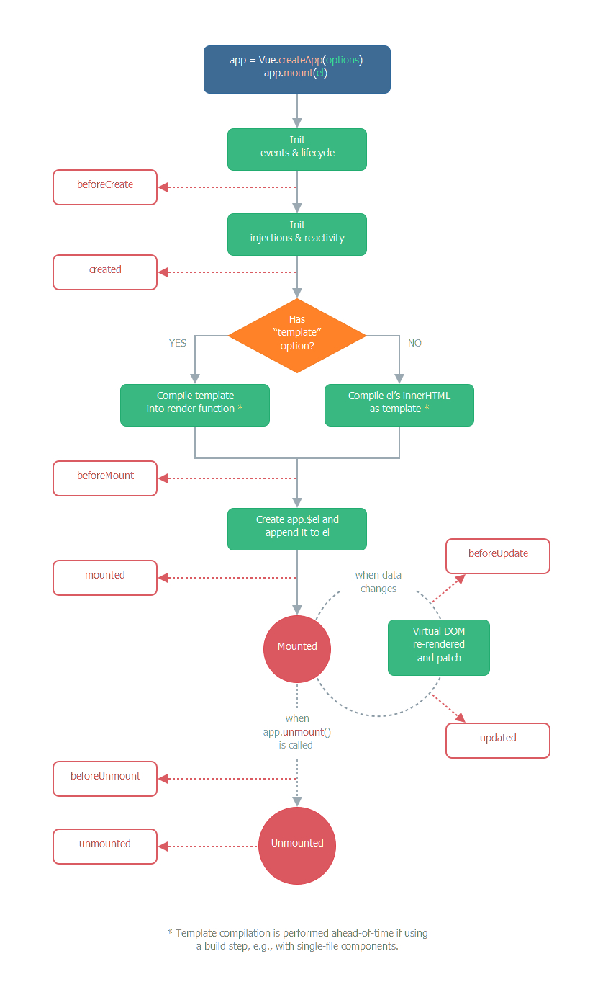

# Vue3

## 用 Vite 初始化项目

先创建项目

```js
// 全局安装yarn（有就跳过，或者你想用npm）
npm install --global yarn
// 使用yarn和vite创建项目my-vue-app
yarn create vite my-vue-app --template vue
// npm方式
npm init vite@latest my-vue-app -- --template vue
```

然后使用`npm install`或者`yarn`下载项目的依赖包，最后可以看一下`package.json`里的`scripts`，运行`npm run dev`启动项目。

```js
{
  "scripts": {
    "dev": "vite", // 启动开发服务器，别名：`vite dev`，`vite serve`
    "build": "vite build", // 为生产环境构建产物
    "preview": "vite preview" // 本地预览生产构建产物
  }
}
```

到[谷歌网上应用商店](https://chrome.google.com/webstore/category/extensions?hl=zh)安装`Vue.js devtools`，图标里带个“beta”的是 Vue3 的开发者工具。右击“管理扩展程序”，选择“允许访问文件网址”。

走读一些文件：

- `index.html`放在了根目录了，这个是由 Vite 决定的，本地开发时`index.html`作为入口，根据它里面的`<script type="module" src="...">`来动态解析模块。他是**先启动服务后动态解析模块**，而 webpack 是先解析模块后启动服务。
- `main.js`里最大改变是`createApp`，而 Vue2 是`new Vue()`（而且`Vue`已经引不进来了，只能使用`createApp`）。这个`createApp`是个工厂函数，用于**创建应用实例**。它的入参和`new Vue()`的入参一样是**组件选项对象**，但是它创建出来的实例很“轻”，你可以`console.log`打印一下实例。
- `App.vue`，这`<template>`里**不再约束只能有一个根节点**，现在可以看到它有同级的``和`<HelloWorld>`。

## 常用的 Composition API

### setup()和 script setup

Composition API 意思是**组合式 API**，以前 Vue2 是 Options API**配置化 API**，在 Vue3 初期版本还是存在配置项+Composition API 写法的，这是为了让开发者能平稳过渡。

setup 是一个函数，在**组件选项对象**属于一个新的配置项，与`name`等配置是**同级**的。它用于承载其他的 Composition API，组件中所用到的数据、方法、计算属性、监视属性、生命周期等都可以配置在`setup`里面。

```vue
<!-- MyBook.vue -->
<template>
  <div>{{ msg }}: {{ readersNumber }} || {{ book.title }}</div>
  <button type="button" @click="hello">点我</button>
</template>

<script>
import { ref, reactive } from "vue";
export default {
  props: {
    msg: String,
  },
  setup(props) {
    // data里的一些响应式数据
    const readersNumber = ref(0);
    const book = reactive({ title: "Vue 3 Guide" });
    // methods里的方法
    function hello() {
      alert("hello");
    }
    // 给<template>用的数据，必须return出去
    return { readersNumber, book, hello };
  },
};
</script>
```

**不过**，我本人并不推荐这种**半 Options API 半 Composition API**的写法。这些个 data、methods 要放在 setup 函数内部，最后还有个`return`返回一大串数据供`template`使用（代码过长你可能忘记 return 了）。它同级还有`components`、`props`等，如果你初次接触就会有些迷惑，到底哪些是**配置式**写法哪些要放到 setup 里**组合**起来写（可以两种方法混用，但`setup`里的更优先），这到底是在写 Vue2 还是在写 Vue3 呢？

我推荐`<script setup>`的写法（`setup`作为`<script>`一个属性），它是在 Vue3.2 时推出的，它的样板代码会少很多，没有了`return`等（这个 return 有点像 React 返回 jsx）。但是它需要你额外使用`defineProps`、`computed`、`useContext`等钩子。如果你学习过 React，就会发现它和函数式组件+hooks 的方案非常像。

```vue
<template>
  <div>{{ msg }}: {{ readersNumber }} || {{ book.title }}</div>
  <button type="button" @click="hello">点我</button>
</template>

<script setup>
import { ref, reactive } from "vue";

// 父组件传来的props数据
defineProps({ msg: String });
// data里的一些响应式数据
const readersNumber = ref(0);
const book = reactive({ title: "Vue 3 Guide" });
// methods里的方法
const hello = () => {
  alert("hello");
};
</script>
```

### ref()

上面例子中的`readersNumber`它是一个**响应式数据**。它使用了`ref()`这个新函数（这可不是节点中的 ref 属性），该函数返回的是一个**对象**（响应式引用）。这个对象有个`value`属性，是响应式数据的**值**，可以在 js 代码中拿到这个`value`进行修改，就能通知用到该数据的模板去 diff。

例如`readersNumber.value = 1`，这个有点像 React 中的`setState()`了。如果是在模板中就直接用该数据，不用`.value`。

```vue
<template>
  <!-- 不用.value，直接用 -->
  <div>姓名：{{ name }}</div>
  <button type="button" @click="handleClick">点我</button>
</template>

<script setup>
import { ref } from "vue";

const name = ref("张三");
// 需要.value
const handleClick = () => (name.value = "李四");
</script>
```

如果这**响应式数据**是个**对象**呢，在 js 中用的时候对象是有`value`的，它的属性就不需要使用`value`了

```vue
<template>
  <div>姓名：{{ obj.name }}</div>
  <button type="button" @click="handleClick">点我</button>
</template>

<script setup>
import { ref } from "vue";

const obj = ref({
  name: "张三",
  age: 18,
});
const handleClick = () => (obj.value.name = "李四");
</script>
```

如果你在控制台打印`name`和`obj`会发现，它们的 value 有些不一样，`obj`的`value`是个`Proxy`类型的对象，其实是通过 Vue3 提供的`reactive()`处理成`Proxy`对象的。

里传对象.png>)

### reactive()

`reactive()`新函数一般用于声明一个**对象类型**（准确说是复杂类型）的响应式数据，而`ref()`**大多**声明一个**基本类型**的响应式数据。

`reactive()`新函数返回的是一个`Proxy`类型的**对象**，它如果在 js 中修改值就不需要`value`，因为它其实是个**代理对象**，通过`代理对象.属性名`就能拿到对应的**属性值**，具体下一节会讲 Proxy 代理，我们看一下`reactive()`使用的例子。

```vue
<template>
  <!-- 不用.value，直接用 -->
  <div>姓名：{{ obj.name }}</div>
  <div>{{ obj.a.b }} || {{ obj.a.c.d }}</div>
  <button type="button" @click="handleClick">点我</button>
</template>

<script setup>
import { reactive } from "vue";

const obj = reactive({
  name: "张三",
  a: {
    b: 1,
    c: {
      d: 2,
    },
  },
});
// 不用.value了，直接取这个属性
const handleClick = () => {
  obj.name = "李四";
  obj.a.b = 3; // 深层次的也能被监测到
  obj.a.c.d = 4; // 深层次的也能被监测到
};
</script>
```

我们再看一下`reactive()`里使用**数组**，返回的这个对象可以用索引修改某项，不再局限于“Vue2 中数组类型响应式数据只能使用 8 个方法来维持响应式”，也不用额外使用`this.$set`或者`Vue.set`了。

```vue
<template>
  <ul>
    <li v-for="item in arr" :key="item.id">名字：{{ item.name }}</li>
  </ul>
  <button type="button" @click="handleClick">点我</button>
</template>

<script setup>
import { reactive } from "vue";

const arr = reactive([
  { id: "1", name: "张三" },
  { id: "2", name: "李四" },
  { id: "3", name: "王五" },
]);
// 可以直接通过索引修改数组某项了，不用再通过this.$set了
const handleClick = () => {
  arr[0] = { id: "4", name: "赵六" };
};
</script>
```

### 简单说说 Vue3 的响应式

我们回顾一下 Vue2 的响应式，可以在 Vue.js 搜一下`proxy`或者`initData`，可以看到如下代码，源对象是`this._data.xxx`和`this._props.yyy`，而使用的代理对象是`this.xxx`和`this.yyy`，也就可以在 methods 等地方使用代理对象`this.xxx`和`this.yyy`，模板中使用就去掉了 this。而真正的响应式处理是下面第二段代码，用了一个 observer 观察者，在设置数据时会通知（`dep.notify()`）模板去 diff。

```js
/**
 * target是this也就是vm，sourceKey这里是_data（或者_props），key是xxx某个属性
 * 意思是让this.xxx作为this._data.xxx的代理对象。读取this.xxx的属性其实就是
 * 读取this._data.xxx的属性，设置this.xxx的属性其实就是设置this._data.xxx的属性
 */
function proxy(target, sourceKey, key) {
  // getter
  sharedPropertyDefinition.get = function proxyGetter() {
    return this[sourceKey][key];
  };
  // setter
  sharedPropertyDefinition.set = function proxySetter(val) {
    this[sourceKey][key] = val;
  };
  // 添加key，并设置特性
  Object.defineProperty(target, key, sharedPropertyDefinition);
}
// 上面这段代码是1.vue基础的“二、Vue的MVVM和数据代理”内容，下面这段代码是1.vue基础的“七、Vue的数据监视”内容

/**
 *  obj是this._data，key就是this._data.xxx，重点就是setter里的dep.notify()
 *  当开发人员修改this.xxx是也会让this._data.xxx修改（上面的代码试想的），又由于下面的
 *  代码，在this._data.xxx修改时会dep.notify()通知模板去diff根据结果来是否重新渲染页面
 */
function defineReactive$$1(obj, key, val, customSetter, shallow) {
  // 读取obj对象里key属性的特性
  var property = Object.getOwnPropertyDescriptor(obj, key);
  if (property && property.configurable === false) return;
  var getter = property && property.get;
  var setter = property && property.set;
  // val是重点，下面的getter和setter最后都是访问的val，它是中间量
  if ((!getter || setter) && arguments.length === 2) {
    val = obj[key];
  }
  // 多层级的对象暂时不考虑，这个会用到递归
  // var childOb = !shallow && observe(val);
  // 修改obj对象里key属性的特性
  Object.defineProperty(obj, key, {
    enumerable: true,
    configurable: true,
    get: function reactiveGetter() {
      return getter ? getter.call(obj) : val;
    },
    set: function reactiveSetter(newVal) {
      setter ? setter.call(obj, newVal) : (val = newVal);
      // 触发更新
      dep.notify();
    },
  });
}
```

看上面的代码你还可以明确一点，一切都是围绕着对象的**属性**来做文章的（而且只能 get 和 set，删除属性和追加属性就不行了），这也是数组类型的响应式对象使用索引去修改为什么不行，并且 Vue2 还重写了数组的那 8 个方法来实现响应式。

简单复习一下 Proxy 和 Reflect。`const proxy = new Proxy(target, handler)`，target 是源对象，proxy 是代理对象，handler 是处理器对象。如果这个处理器对象是个`{}`**空字面量对象**的话，那就和上面`function proxy(target, sourceKey, key)`自定义函数一样，只是**单纯的“数据转发”**。这个 es6 提供的 Proxy 的优势在于，它是 es6 原生提供的函数，功能强大稳定（意思是不止能监视 get 和 set，还有 delete 等等方法），然后 target 可以是任何类型的对象（包括原生数组、函数，甚至另一个代理），`Object.defineProperty`其实只针对于对象的属性对于数组就爱莫能助了。

```js
const arr = [
  { id: "1", name: "张三" },
  { id: "2", name: "李四" },
  { id: "3", name: "王五" },
];
const proxy = new Proxy(arr, {
  set(target, prop, val) {
    target[prop] = val;
    console.log("通知模板去diff");
    return true;
  },
});
proxy[0] = { id: "4", name: "赵六" };
console.log("arr", arr);
```

那么 Reflect 又是什么呢？它是一个反射，可以很方便对对象进行“增删改查”，其中对象本身的“查”和“改”很容易，而“增”和“删”就不是那么方便了，例如删除一个属性要使用`delete obj.xxx`，追加一个属性要`Object.defineProperty(obj, 'xxx', { ... })`。而 Reflect 比较统一：

```js
const obj = { name: "张三" };
console.log("读取name属性值: ", Reflect.get(obj, "name"));
Reflect.set(obj, "name", "李四");
console.log("修改name属性值: ", obj.name);
console.log("删除name属性是否成功: ", Reflect.deleteProperty(obj, "name"));
console.log("name属性值: ", obj.name);
console.log(
  "新增age属性是否成功: ",
  Reflect.defineProperty(obj, "age", {
    get: () => 18,
  })
);
console.log("age属性值: ", obj.age);
```

Reflect 的第一个好处是多次`Reflect.defineProperty`不会报错并且返回结果，而`Object.defineProperty(obj, 'xxx', { ... })`多次就会报错得使用`try catch`进行异常捕获。Reflect 的第二个好处是，能用`receiver`处理`this`。

```js
let user = {
  _name: "Guest",
  get name() {
    return this._name;
  },
};

let userProxy = new Proxy(user, {
  get(target, prop, receiver) {
    // return Reflect.get(target, prop, receiver)
    return target[prop]; // (*) target = user
  },
});

let admin = {
  __proto__: userProxy,
  _name: "Admin",
};

// 期望输出：Admin
console.log(admin.name); // 输出：Guest (?!?)
```

上面这个代码，`admin.name`通过原型找到 userProxy，通过代理找到 user 上的`get name`，而这个`get name`里的 this 自然就是上下文对象 user，那么就会输出`user._name`的值`Guest`。如果要 Reflect 进行代码修改\*号那行就改为`return Reflect.get(target, prop, receiver)`，这个`receiver`就会让实际的`get name`方法的`this`指向代理对象`userProxy`所在的上下文对象也就是`admin`，那么最后就会输出`Admin`。

Vue3 的相关源码可以搜`function reactive`

```js
// 我们只看get/set
const set = /*#__PURE__*/ createSetter();
const get = /*#__PURE__*/ createGetter();
const mutableHandlers = {
  get,
  set,
  /* 省略... */
};
// 响应式数据
function reactive(target) {
  if (target && target["__v_isReadonly" /* IS_READONLY */]) {
    return target;
  }
  return createReactiveObject(target, false, mutableHandlers, mutableCollectionHandlers, reactiveMap);
}
// 生成响应式数据，看baseHandlers也就是上面的mutableHandlers
function createReactiveObject(target, isReadonly, baseHandlers, collectionHandlers, proxyMap) {
  /* 省略... */
  // 我们看targetType为1（Object和Array的场景），也就是baseHandlers
  const proxy = new Proxy(target, targetType === 2 /* COLLECTION */ ? collectionHandlers : baseHandlers);
  proxyMap.set(target, proxy);
  return proxy;
}
// 修改响应式数据时
function createSetter(shallow = false) {
  return function set(target, key, value, receiver) {
    /* 省略... */
    const result = Reflect.set(target, key, value, receiver);
    // 触发effect（通知模板等）
    trigger(target, "set" /* SET */, key, value, oldValue);
    return result;
  };
}
// 读取响应式数据时
function createGetter(isReadonly = false, shallow = false) {
  return function get(target, key, receiver) {
    /* 省略... */
    const res = Reflect.get(target, key, receiver);
    if (!isReadonly) {
      // 添加effect
      track(target, "get" /* GET */, key);
    }
    if (isRef(res)) {
      const shouldUnwrap = !targetIsArray || !isIntegerKey(key);
      return shouldUnwrap ? res.value : res;
    }
    if (isObject(res)) {
      return isReadonly ? readonly(res) : reactive(res);
    }
    return res;
  };
}
```

Proxy 不支持对**基本类型**数据进行代理，所以基本类型数据还是简单的 getter 和 setter，也就能解释之前的说的 ref 里传入对象，它的 value 是个 Proxy 类型，而基本类型的不是 Proxy 类型了。

最后解释一下：

- `trigger`是触发 effect，`track`是添加 effect，这个`effect`的意思是**副作用**，这里是用于通知模板重新渲染等一些功能。
- 至于**副作用**，是“函数外部环境发生的交互”，例如网络请求、DOM 操作、订阅数据来源、写入文件系统、获取用户输入等。
- 提到**副作用**就不得不提到**纯函数**，它有两个特点：
  - 1)该函数不会对入参本身进行修改，必须得有 return 返回值；在相同的入参时，需产生相同的返回值。
  - 2)该函数得没有**副作用**；返回值可以与入参无关（有关也可以），但是不能与入参以外的变量或者其他影响有关。

### computed()

计算属性用了`computed()`这个新函数，如果只有`getter`那就传递一个函数，使用这个计算属性时也需要`.value`（模板中不需要）。它是惰性的，意思是只在数据源发生改变时才执行里面的函数（多次访问计算属性，只要数据源没变就直接返回之前计算的值）。

```vue
<template>
  <div>counter: {{ counter }}</div>
  <div>newCounter: {{ newCounter }}</div>
  <button type="button" @click="handleClick">点我</button>
</template>

<script setup>
import { ref, computed } from "vue";

const counter = ref(0);
// 传递一个函数（getter）
const newCounter = computed(() => counter.value * 2);
const handleClick = () => {
  counter.value++;
};
</script>
```

如果还有`setter`那么就得传递一个对象，具体看下面这个例子

```vue
<template>
  <div>姓: {{ lastName }}</div>
  <div>名: {{ firstName }}</div>
  <div>全名: {{ fullName }}</div>
  <button type="button" @click="handleClick">点我</button>
</template>

<script setup>
import { ref, computed } from "vue";

const firstName = ref("三");
const lastName = ref("张");
// 传递一个对象（要包含getter和setter）
const fullName = computed({
  get: () => lastName.value + "|" + firstName.value,
  set: (value) => {
    const arr = value.split("|");
    if (arr.length === 2) {
      lastName.value = arr[0];
      firstName.value = arr[1];
    }
  },
});
const handleClick = () => {
  fullName.value = "李|四";
};
</script>
```

### watch()的十一种情况

说实话 Vue3 的`watch()`比较难玩，它在功效上和 Vue2 的`watch`几乎一样，只是在用法上变化很大，情况会比较复杂。原因一是`ref`和`reactive`，原因二是`watch()`扩展了参数的写法。

我们看一下`watch()`扩展参数的写法，`wathc(数据, 回调函数)`，这个“数据”有三种写法

- 直接写**ref 对象**或者**reactive 对象**；
- `() => state.xxx`，例如这种 getter 函数（getter/effect）；
- `[xxx, yyy]`，例如这种**数据列表**（数组）。

我们看下面演示的例子：

```vue
<template>
  <div>
    <span>数值: {{ count }}</span> || <button type="button" @click="handleClick1">点我</button>
  </div>
  <div>
    <span>名字: {{ lastName + firstName }}</span> || <button type="button" @click="handleClick2">点我</button>
  </div>
</template>

<script setup>
import { ref, watch } from "vue";

// 情况一：直接侦听ref
const count = ref(0);
watch(count, (count, prevCount) => {
  console.log("直接侦听ref。 count", count, ", prevCount: ", prevCount);
});

// 情况二：侦听一个getter（ref），注意count此时要带上.value
watch(
  () => count.value,
  (count, prevCount) => {
    console.log("侦听一个getter。 count: ", count, ", prevCount: ", prevCount);
  }
);
// 情况三：侦听一组ref
const firstName = ref("三");
const lastName = ref("张");
watch([firstName, lastName], (newValues, prevValue) => {
  console.log("名字改变了, newValues: ", newValues, ", prevValue: ", prevValue);
});
const handleClick1 = () => {
  count.value++;
};
const handleClick2 = () => {
  firstName.value += "?";
  lastName.value += "!";
};
</script>
```

- **情况一**，直接侦听一个 ref，常用于侦听基本类型的响应式数据，不用带上`.value`。
- **情况二**，侦听一个 getter（ref），一般用于侦听**ref 的 value**。不太常用，一般**直接用情况一**就行了，不要多此一举。
- **情况三**，侦听一组 ref，它们都不用带上`.value`，多个同时被修改，也只触发一次回调。

以上三种情况还只是**基本类型**，也就是 ref 对象。如果涉及到**复杂类型**，又要分为 ref 对象和 reactive 对象，虽然不太推荐用`ref()`为对象创建响应式数据，但官方并没有对此做出约束。看一下演示例子。

```vue
<template>
  <div>
    <span>person1: {{ person1.name }} - {{ person1.age }} - {{ person1.mother.name }} - {{ person1.mother.age }}</span>
    || <button type="button" @click="handleClick1">点我1</button> ||
    <button type="button" @click="handleClick2">点我2</button>
  </div>
  <div>
    <span>person2: {{ person2.name }} - {{ person2.age }} - {{ person2.mother.name }} - {{ person2.mother.age }}</span>
    || <button type="button" @click="handleClick3">点我3</button> ||
    <button type="button" @click="handleClick4">点我4</button>
  </div>
  <div>
    <span>obj1.a: {{ obj1.a }} - obj1.b.c: {{ obj1.b.c }}</span> ||
    <button type="button" @click="handleClick5">点我5</button> ||
    <button type="button" @click="handleClick6">点我6</button>
  </div>
  <div>
    <span>obj2.d: {{ obj2.d }} - obj2.e.f: {{ obj2.e.f }}</span> ||
    <button type="button" @click="handleClick7">点我7</button> ||
    <button type="button" @click="handleClick8">点我8</button>
  </div>
</template>

<script setup>
import { reactive, watch } from "vue";

const person1 = reactive({
  name: "张三",
  age: 18,
  mother: { name: "李梅", age: 42 },
});
// 情况四：侦听一个reactive
watch(person1, (newValues, prevValue) => {
  console.log("侦听一个reactive。 newValues: ", newValues, ", prevValue: ", prevValue);
});
const person2 = reactive({
  name: "李四",
  age: 19,
  mother: { name: "王雪", age: 39 },
});
// 情况五：侦听一个getter（reactive）
watch(
  () => person2.age,
  (newValues, prevValue) => {
    console.log("侦听一个getter（reactive）。 newValues: ", newValues, ", prevValue: ", prevValue);
  }
);
const obj1 = reactive({ a: "a", b: { c: "c" } });
const obj2 = reactive({ d: "d", e: { f: "f" } });
// 情况六：侦听一组reactive
watch([obj1, obj2], (newValues, prevValue) => {
  console.log("侦听一组reactive。 newValues: ", newValues, ", prevValue: ", prevValue);
});
const handleClick1 = () => {
  person1.age++;
};
const handleClick2 = () => {
  person1.mother.age++;
};
const handleClick3 = () => {
  person2.age++;
};
const handleClick4 = () => {
  person2.mother.age++;
};
const handleClick5 = () => {
  obj1.a += "a";
};
const handleClick6 = () => {
  obj1.b.c += "c";
};
const handleClick7 = () => {
  obj2.d += "d";
};
const handleClick8 = () => {
  obj2.e.f += "f";
};
</script>
```

- **情况四**，直接侦听一个 reactive，**不管修改层次有多深的属性**，它都能侦听到。
- **情况五**，侦听一个 getter（reactive），一般用于侦听 reactive 对象的**某个属性**，这种很常见了。
- **情况六**，侦听一组 reactive，类似情况四，它们其实有一个小问题。

情况四和情况六有个小问题，那就是回调函数里的`newValues, prevValue`两对象**一直是同一个**，你想要**前一份状态值**需要做一下优化。需要先深克隆一下源响应式对象，然后用 getter 返回这个新对象，**情况七**如下。

```vue
<template>
  <div>
    <span>obj1.a: {{ obj1.a }} - obj1.b.c: {{ obj1.b.c }}</span> ||
    <button type="button" @click="handleClick5">点我5</button> ||
    <button type="button" @click="handleClick6">点我6</button>
  </div>
  <div>
    <span>obj2.d: {{ obj2.d }} - obj2.e.f: {{ obj2.e.f }}</span> ||
    <button type="button" @click="handleClick7">点我7</button> ||
    <button type="button" @click="handleClick8">点我8</button>
  </div>
</template>

<script setup>
import { reactive, watch } from "vue";
// yarn add lodash@4
import cloneDeep from "lodash/cloneDeep";

const obj1 = reactive({ a: "a", b: { c: "c" } });
const obj2 = reactive({ d: "d", e: { f: "f" } });
// 情况七：侦听一组reactive，如果是person的话就是 () => cloneDeep(person)
watch(
  () => [cloneDeep(obj1), cloneDeep(obj2)],
  (newValues, prevValue) => {
    console.log("侦听一组reactive。 newValues: ", newValues, ", prevValue: ", prevValue);
  }
);
const handleClick5 = () => {
  obj1.a += "a";
};
const handleClick6 = () => {
  obj1.b.c += "c";
};
const handleClick7 = () => {
  obj2.d += "d";
};
const handleClick8 = () => {
  obj2.e.f += "f";
};
</script>
```

然后就是用`ref()`为对象创建响应式数据，在侦听它时，要么使用`.value`，要么就配上`{ deep: true }`，**情况八**如下。

```vue
<template>
  <div>
    <span>person: {{ person.name }} - {{ person.age }} - {{ person.mother.name }} - {{ person.mother.age }}</span> ||
    <button type="button" @click="handleClick1">点我1</button> ||
    <button type="button" @click="handleClick2">点我2</button>
  </div>
</template>

<script setup>
import { ref, watch } from "vue";

const person = ref({
  name: "张三",
  age: 18,
  mother: { name: "李梅", age: 42 },
});
// 情况八：侦听一个“用ref()为对象创建响应式数据”。要么person.value，要么person + { deep: true }
watch(
  person,
  (newValues, prevValue) => {
    console.log("侦听。 newValues: ", newValues, ", prevValue: ", prevValue);
  },
  { deep: true }
);
const handleClick1 = () => {
  person.value.age++;
};
const handleClick2 = () => {
  person.value.mother.age++;
};
</script>
```

**getter 的注意事项**，其实看到这里可以跳过了，下面的情况很少见。上面的情况二里的 getter 是用于 ref 的**value**上的，上面的情况五里的 getter 是用于 reactive 的**某层里某个属性**的，上面的情况七里的 getter 是用于**cloneDeep 后的对象**。而如果 getter 直接用于 ref 或 reactive 对象**本身**的话，必须得配合`{ deep: true }`，这与上面的**情况八**是同样的道理，**情况九、十、十一**演示如下。

```vue
<template>
  <div>
    <span>数值: {{ count }}</span> || <button type="button" @click="handleClick1">点我1</button>
  </div>
  <div>
    <span>person1: {{ person1.name }} - {{ person1.age }} - {{ person1.mother.name }} - {{ person1.mother.age }}</span>
    || <button type="button" @click="handleClick2">点我2</button> ||
    <button type="button" @click="handleClick3">点我3</button>
  </div>
  <div>
    <span>person2: {{ person2.name }} - {{ person2.age }} - {{ person2.mother.name }} - {{ person2.mother.age }}</span>
    || <button type="button" @click="handleClick4">点我4</button> ||
    <button type="button" @click="handleClick5">点我5</button>
  </div>
</template>

<script setup>
import { ref, reactive, watch } from "vue";

const count = ref(0);
// 情况九：侦听一个getter（ref），count没有带上.value，并且使用了deep: true
watch(
  () => count,
  (count, prevCount) => {
    console.log("侦听一个getter（ref）。 count: ", count, ", prevCount: ", prevCount);
  },
  { deep: true }
);
const person1 = reactive({
  name: "张三",
  age: 18,
  mother: { name: "李梅", age: 42 },
});
// 情况十：侦听一个getter（reactive），count没有带上.value，并且使用了deep: true
watch(
  () => person1,
  (newValues, prevValue) => {
    console.log("侦听一个getter（reactive）。 newValues: ", newValues, ", prevValue: ", prevValue);
  },
  { deep: true }
);
const person2 = ref({
  name: "李四",
  age: 19,
  mother: { name: "王雪", age: 39 },
});
// 情况十一：侦听一个getter（ref-对象），count没有带上.value，并且使用了deep: true
watch(
  () => person2,
  (newValues, prevValue) => {
    console.log("侦听一个getter（reactive）。 newValues: ", newValues, ", prevValue: ", prevValue);
  },
  { deep: true }
);
const handleClick1 = () => {
  count.value++;
};
const handleClick2 = () => {
  person1.age++;
};
const handleClick3 = () => {
  person1.mother.age++;
};
const handleClick4 = () => {
  person2.value.age++;
};
const handleClick5 = () => {
  person2.value.mother.age++;
};
</script>
```

**情况九、十、十一**，getter 里直接返回一个 ref 对象或者 reactive 本身，一般是需要开启`{deep: true}`。这三种情况比较少见，因为用前面的情况可以替代，这里只是作为陷阱来讲的。

**总结**一下`watch()`的用法：

- 如果侦听的**响应式数据是基本类型**，那么`watch()`的第一个形参直接用**ref 对象本身**就可以了，也就是**情况一**。（如果你非要`.value`那就搭配 getter 用法，也就是**情况二**）。
- 如果侦听的**响应式数据是复杂类型整体**，那么`watch()`的第一个形参直接用**reactive 对象本身**就可以了（它相当于自动开启了`{deep:true}`，如果你尝试手动用`{deep:false}`这是关闭不了的），也就是**情况四**。
- 如果侦听的**响应式数据是复杂类型的某个属性**，那么`watch()`的第一个形参用 getter 配合 reactive 对象即可，也就是**情况五**。
- 如果侦听的**响应式数据是复杂类型整体**并且还想知道它前一次的状态值，那么就需要 getter 配合 reactive 对象的**深克隆对象**，也就是**情况七**。
- 如果想一次性侦听多个，那么`watch()`的第一个形参是一个**数组**，数组每一项最好是 ref 对象或者 reactive 对象或者 reactive 对象的克隆对象，具体情况看前面的描述。这一条是**情况三**和**情况六**
- 至于其他情况，也就是**情况八、九、十、十一**或者其他衍生出来的情况，它们都能用前面的方式进行替代或者优化。

### watchEffect()

其实上一节的`watch()`更像 React 的`useEffect()`。

`watchEffect()`和`watch()`是**同一个功能的两种不同形态**，底层的实现是一样的，大致区别如下

- `watch()`：
  - 显式指定依赖源（手动指定），依赖源更新时执行回调函数。
  - 不过它是惰性的，多个依赖源修改时，一般只触发一次回调函数（用 nextTick 可以多次）。
  - 可以立即执行回调函数，但必须手动加上`{immediate: true}`。
- `watchEffect()`：
  - **自动收集**依赖源（不用手动指定依赖项），依赖源更新时重新执行自身。
  - 多个依赖源修改时，有几次修改就调用几次。
  - 并且回调函数是立即执行，相当于`{immediate: true}`（不用手动加）。
  - 在组件**卸载时**自动停止侦听，不仅如此还能手动停止。
  - 还能使用清除函数（失效回调），在卸载时执行一次清除函数，也在副作用即将重新执行时调用一次清除函数（这个和 React 的`useEffect`返回一个清除函数很像，只不过 Vue3 不是**返回**，而是**形参**）。
  - 最后还能将回调函数调整到**组件更新后**再执行，需要在`watchEffect()`的第二个参数上写`{flush: 'post'}`（默认是`{flush: 'pre'}`也就是 update 前执行的），像 React 就不能调整，它是默认 updated 后执行。

具体讲解如下（就理解为`watch`和`watchEffect`是 React 的`useEffect`拆分出来的两个功能把）：

1. `watchEffect()`依赖源的收集，以及回调函数的立即执行代码如下。

   ```js
   watchEffect(
     // 回调函数默认立即执行一次
     () => console.log(counter.value) // 这里就是依赖项counter，但是是Vue3自动帮你收集的
   );
   // 与上面的基本等价
   watch(
     () => counter.value, // 这里手动指定依赖是counter
     () => console.log(counter.value),
     { immediate: true } // 如果要立即执行一次，必须手动指定{ immediate: true }
   );
   ```

2. 多个依赖源修改时，`watchEffect()`与`watch()`的区别。推荐在**大部分时候**用`watch()`显式的指定依赖以避免不必要的重复触发，也避免在后续代码修改或重构时不小心引入新的依赖。

   ```js
   const counter = ref(0);
   const enabled = ref(false);

   watchEffect(() => {
     if (enabled.value) console.log(counter.value);
   });

   // (以下忽略 nextTick)

   // watchEffect 会被立即执行，因为 “enabled“ 为 false, 此时仅收集到 “enabled“ 依赖
   counter.value += 1; // 无反应

   enabled.value = true; // Effect 触发，控制台出 "1"
   counter.value += 1; // “counter“ 被作为新的依赖被收集，控制台出 "2"

   enabled.value = false; // 函数被重新执行，无输出
   counter.value += 1; // 函数被重新执行，无输出 (虽然 counter 已经没有用了，但是作为依赖还是会触发函数）
   ```

3. `watchEffect()`组件**卸载时**自动停止侦听，也能手动停止。`watch()`做不到手动停止，`watchEffect()`的**这种场景用的比较少**。

   ```js
   const stop = watchEffect(() => {
     /* ... */
   });

   // later
   stop();
   ```

4. `watchEffect()`清除函数（失效回调）的使用场景。`onInvalidate`是`watchEffect()`的形参，而`onInvalidate`的入参就是我们声明的一个**清除函数（失效回调）**，它会在组件**卸载前**执行一次，也会在**副作用每次执行前**调用一次，这就能保证先取消订阅后更新订阅。（这个和 React 的`useEffect`return 一个清除函数很像，只不过 Vue3 里不是 return，而是**形参**）

```js
import { reactive, watch, watchEffect } from "vue";
const friend = reactive({ id: 1 });
let prevFriendId = friend.id;
watch(
  () => friend.id,
  (newValue, prevValue) => {
    prevFriendId = prevValue;
  }
);
// 唯一不方便的就是旧值得额外用prevFriendId存储。如果只用watch()，那就还需要onUnmounted()钩子（vue2的beforeDestroy）
watchEffect((onInvalidate) => {
  ChatAPI.subscribeToFriendStatus(friend.id, handleStatusChange);
  // 除了这种场景，也可用来清除（中断）上一次请求，source.cancel('trigger')
  onInvalidate(() => {
    ChatAPI.unsubscribeFromFriendStatus(prevFriendId, handleStatusChange);
  });
});
```

### Vue3 的生命周期钩子



| 选项式 API      | Hook inside setup |
| --------------- | ----------------- |
| beforeCreate    | Not needed\*      |
| created         | Not needed\*      |
| beforeMount     | onBeforeMount     |
| mounted         | onMounted         |
| beforeUpdate    | onBeforeUpdate    |
| updated         | onUpdated         |
| beforeUnmount   | onBeforeUnmount   |
| unmounted       | onUnmounted       |
| errorCaptured   | onErrorCaptured   |
| renderTracked   | onRenderTracked   |
| renderTriggered | onRenderTriggered |
| activated       | onActivated       |
| deactivated     | onDeactivated     |

Not newded\*：因为`setup`是围绕`beforeCreate`和`created`生命周期钩子运行的，所以不需要显式地定义它们。换句话说，在这些钩子中编写的任何代码都应该直接在`setup`函数中编写。

### toRef()和 toRefs()

`toRef()`创建一个 ref 对象，它的 value 值是另一个响应式对象的某个 property 属性。这个创建出来的 re 对象会保持对其源 property 的响应式连接。`toRef()`用的最多的是，将某个属性单独传递给外部，自定义 Hooks 中用的多。

```js
const state = reactive({
  foo: 1,
  bar: 2,
});
// 第一个参数是源响应式对象，第二个参数是属性名
const fooRef = toRef(state, "foo");

// fooRef和state.foo的响应式连接一直存在
fooRef.value++;
console.log(state.foo); // 2

// fooRef和state.foo的响应式连接一直存在
state.foo++;
console.log(fooRef.value); // 3
```

`toRef()`是处理单个，而`toRefs()`是处理源响应式对象所有的第一层属性。

```js
const state = reactive({
  foo: 1,
  bar: 2,
});
const { foo, bar } = toRefs(state); // 在自定义hooks中用的特别多，可以只返回一部分响应式的数据

// ref 和原始 property 已经“链接”起来了
state.foo++;
console.log(foo.value); // 2

foo.value++;
console.log(state.foo); // 3
```

### 自定义 hook

自定义 hook 在 React 中非常常见，Vue3 中初次使用会比较陌生，但其实很简单，看下面这个例子。

```js
import { reactive, onMounted, onUnmounted } from "vue";
// 自定义hook，点击时获取坐标
export const usePoint = () => {
  const point = reactive({
    x: 0,
    y: 0,
  });
  const savePoint = (e) => {
    point.x = e.pageX;
    point.y = e.pageY;
    console.log("point:", point.x, point.y);
  };
  onMounted(() => {
    window.addEventListener("click", savePoint);
  });
  onUnmounted(() => {
    window.removeEventListener("click", savePoint);
  });
  // 最后返回有效数据
  return point;
};
```

```vue
<template>
  <div>
    <span>{{ point.x }}, {{ point.y }}</span>
  </div>
</template>

<script setup>
import { ref, watchEffect } from "vue";
import { usePoint } from "./hook.js";
// 使用自定义钩子
const point = usePoint();
</script>
```

## 其他 Composition API

### shallowReactive()和 shallowRef()

shallow 的意思是“浅的”，`shallowReactive()`和`shallowRef()`会生成**浅**响应式数据。对于`shallowReactive()`，它的“浅”表示只让 reactive 对象的**第一层属性具有响应式**。

```vue
<template>
  <div>
    <span>person: {{ person.name }} - {{ person.age }} - {{ person.mother.name }} - {{ person.mother.age }}</span> ||
    <button type="button" @click="handleClick1">点我1</button> ||
    <button type="button" @click="handleClick2">点我2</button>
  </div>
</template>

<script setup>
import { shallowReactive } from "vue";

const person = shallowReactive({
  name: "张三",
  age: 18,
  mother: { name: "李梅", age: 42 },
});
const handleClick1 = () => {
  person.age++;
}; // 页面正常更新
const handleClick2 = () => {
  person.mother.age++;
}; // 页面没反应
</script>
```

对于`shallowRef()`，它的“浅”表示只让 ref 对象的**value 本身这个值具有响应式**。基本类型的场景，`.value`就是基本类型的**值**（数值、布尔值、字符串）；而复杂类型场景，`.value`是一个指向对象的**地址值**，指向的这个对象**并不是 Proxy 类型**，也就是说`.value`它指向的对象不再具有响应式。

```vue
<template>
  <div>
    <span>person: {{ person.name }} - {{ person.age }} - {{ person.mother.name }} - {{ person.mother.age }}</span> ||
    <button type="button" @click="handleClick1">点我1</button> ||
    <button type="button" @click="handleClick2">点我2</button>
  </div>
</template>

<script setup>
import { shallowRef } from "vue";

const person = shallowRef({
  name: "张三",
  age: 18,
  mother: { name: "李梅", age: 42 },
});
const handleClick1 = () => {
  person.value.age++;
}; // 修改对象里面的某些属性，页面没反应
const handleClick2 = () => {
  // 将value指向的对象完全替换成新的，页面响应了
  person.value = {
    name: "李四",
    age: 19,
    mother: { name: "王雪", age: 39 },
  };
};
</script>
```

最后说一下，`shallowRef()`，ref 对象的`.value`一直是一个值，可以是基本类型数据的值，也可以是一个对象的地址值，**只要修改值那就是响应式的**，如果是修改`.value`**指向的对象里的某些属性那就不会响应**。修改对象地址值就是替换一个新对象，这与修改对象的某些属性并不一样，也就是“浅”的表现之处。`shallowRef()`与`ref()`的区别就是`.value`指向的对象一个是普通对象类型，另一个是 Proxy 类型的。

### readonly()和 shallowReadonly()

`readonly()`返回原始对象的只读代理，这个原始对象可以是普通对象、ref 对象或 reactive 对象。不允许修改对象里的属性值。而`shallowReadonly()`是**只限制对象第一层属性**不允许被修改，其他深层次的是可以被修改的。经常用于做**数据隔离**，如果强制修改会在控制台还有警告提示，比如拖拽表格并且表格里有 input 等输入表单项。

```js
const original = reactive({ count: 0 });

const copy = readonly(original);

watchEffect(() => {
  // 用于响应性追踪
  console.log(copy.count);
});

// 变更 original 会触发依赖于副本的侦听器
original.count++;

// 变更副本将失败并导致警告
copy.count++; // 警告!
```

### toRaw()和 markRaw()

`toRaw()`返回`reactive()`或`readonly()`代理的**原始对象**。请谨慎使用`toRaw()`，它直接操作原始对象，虽然在一定程度上避开了“响应”，但意外修改它可能会引起 BUG。

```js
const foo = {};
const reactiveFoo = reactive(foo);
console.log(toRaw(reactiveFoo) === foo); // true
```

`markRaw()`标记一个对象，使其永远不会转换为 proxy（不会被用于响应式），最后返回对象本身。`markRaw()`常用于标记一些第三方类库引用对象，或者用于**不可变数据的大列表**，也就说一些对象是没必要进行响应式 proxy 处理的，可防止开发人员意外设置它们为响应式。

```js
const foo = markRaw({});
// isReactive()：检查对象是否是由reactive()创建的响应式数据
console.log(isReactive(reactive(foo))); // false

// 嵌套在其他响应式对象中
const bar = reactive({ foo });
console.log(isReactive(bar.foo)); // false
```

### customRef()

`customRef()`用于创建一个自定义的 ref 对象，可以在 ref.value 设置值（setter）和读取值（getter）时加入自定义逻辑。`customRef()`的入参是一个函数，该函数有两个形参，第一个形参`track`在 getter 内部用于“放行”（其实是添加 effect），第二形参`trigger`在 setter 内部用于“放行”（其实是触发 effect），函数返回一个对象，该对象有`get`和`set`属性（getter 和 setter）。一个延迟显示的例子如下：

```vue
<template>
  <div>
    <input v-model="inputValue" /><span>{{ delayShow }}</span>
  </div>
</template>

<script setup>
import { ref, watchEffect } from "vue";

// 输入框里的值
const inputValue = ref(0);

// 输入框后面的span展示值，要求是隔一秒再更新，这个防抖函数可以封装成一个自定义hook
const delayShow = useDebouncedRef(inputValue.value, 1000);

watchEffect(() => {
  delayShow.value = inputValue.value;
});
</script>

<script>
import { customRef } from "vue";
// 自定义hook
function useDebouncedRef(value, delay = 200) {
  let timeout;
  return customRef((track, trigger) => {
    return {
      get() {
        track();
        return value;
      },
      set(newValue) {
        clearTimeout(timeout);
        timeout = setTimeout(() => {
          value = newValue;
          trigger();
        }, delay);
      },
    };
  });
}
</script>
```

### triggerRef()

手动执行与`shallowRef`关联的任何作用 (effect)。

```vue
const shallow = shallowRef({ greet: 'Hello, world' }) // 第一次运行时记录一次 "Hello, world" watchEffect(() => {
console.log(shallow.value.greet) }) // 这不会触发作用 (effect)，因为 ref 是浅层的 shallow.value.greet = 'Hello,
universe' // 记录 "Hello, universe"，意思是会执行watchEffect里的回调函数 triggerRef(shallow)
```

### provide()和 inject()

和 vue2 的 provide/inject 功效差不多，可以传响应式数据并且数据更安全了，比如可以用`readonly()`对数据进行限制（或者`shallowRef`等）。

```vue
<template>
  <MyMarker />
</template>

<script setup>
import { ref, reactive, readonly, provide } from "vue";
import MyMarker from "./MyMarker.vue";
const location = ref("North Pole");
const geolocation = reactive({
  longitude: 90,
  latitude: 135,
});
// 修改location的方法
const updateLocation = () => {
  location.value = "South Pole";
};
// 将孙组件想要的location和geolocation传递过去，传递是我们用readonly做
// 限制，不允许直接修改数据源，只允许使用传递的updateLocation方法进行修改
provide("location", readonly(location));
provide("geolocation", readonly(geolocation));
provide("updateLocation", updateLocation);
</script>
```

```vue
<template>
  <div>
    <div>location: {{ userLocation }}</div>
    <div>longitude: {{ userGeolocation.longitude }}</div>
    <div>latitude: {{ userGeolocation.latitude }}</div>
    <button @click="updateUserLocation">点我</button>
  </div>
</template>

<script>
import { inject } from "vue";

export default {
  setup() {
    // 接收祖先节点的provide，第二个参数是默认值
    const userLocation = inject("location", "The Universe");
    const userGeolocation = inject("geolocation");
    const updateUserLocation = inject("updateLocation");

    return {
      userLocation,
      userGeolocation,
      updateUserLocation,
    };
  },
};
</script>
```

### isRef、isReactive、isReadonly、isProxy、unref

**响应式数据判断**：

- `isRef()`：检查一个值是否是一个 ref 对象。
- `isReactive()`：检查一个对象是否由`reactive()`创建的代理。
- `isReadonly()`：检查一个对象是否由`readonly()`创建的只读代理。
- `isProxy()`：检查一个对象是否由`reactive`或者`readonly`创建的代理。
- `unref()`：是`val = isRef(val) ? val.value : val`的语法糖函数。`unref`中的 r 确实是小写。
