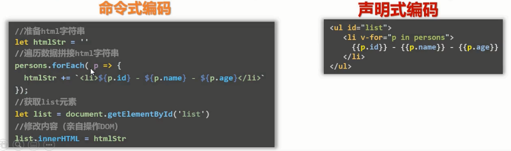

# 学习 vue 的准备工作

## 介绍

> Vue 是一套用于构建用户界面的渐进式框架。——Vue 官网

[Vue 框架](https://cn.vuejs.org/)可以数据为驱动来构建界面，它只关注**视图层**。“渐进式”表示**自底向上逐层应用**，简单项目使用轻量小巧的 Vue 核心库即可，而复杂项目可以在核心库的基础上引入一些 Vue 插件或第三方插件。

Vue 框架特点：

1. 采用**组件化模式**，提高代码复用率，更好地维护项目。新的文件类型`vue`，相当于一个组件，里面包含 html、js 和 css 代码。
   
2. **声明式编码**，让程序员无需直接操作 DOM，提高开发效率。命令式编码需要写每一步的程序，而声明式编码（采用简洁的模板语法）可以简化编程步骤，最大限度减少 DOM 操作次数。
   
3. 使用**虚拟 DOM**+优秀的**Diff 算法**，尽量复用 DOM 节点。当新数据完全覆盖旧数据时，体现在页面上，原生开发模式是直接覆盖页面渲染，将原来的 DOM 完全改变为新的；而 Vue 不会这么粗暴，它采用了虚拟 DOM，再使用 Diff 算法去比较**新**虚拟 DOM 和**旧**虚拟 DOM，局部变更 DOM，极大提高了渲染效率。

## 环境准备

1. 可以使用`<script>`方式引入。开发版本的是**vue.js**，生产版本的是**vue.min.js**，开发版本有提示和警报等功能，而生产版本没有这些提示并且体积更小。

   ```html
   // 引用本地的下载好的
   <script src="../js/vue.js"></script>
   // cdn 的方式
   <script src="https://cdn.jsdelivr.net/npm/vue@2.6.14/dist/vue.js"></script>
   ```

2. 使用**Vue 脚手架**（标准化开发工具），英文名是`Vue Command Line Interface`，简称[Vue CLI](https://cli.vuejs.org/zh/)。

   - 使用[npm](/front-end/常用工具/Npm的使用.md)运行`npm install -g @vue/cli`命令，全局安装脚手架。
   - 在一个空目录或者你的前端 workspace 下运行`vue create learn_vue`，这其中的`learn_vue`就是**项目名**。安装完后可以运行`npm run serve`查看项目的运行展示效果。
   - 简单了解一下**项目结构**：
     - `.gitignore`是 git 忽略文件，配置哪些文件类型不需要被 git 识别。
     - `babel.config.js`是 babel 的配置工程文件，一般不需要添加自己的配置，不动就行了。
     - `package.json`里有项目的基本信息、依赖插件列表和项目运行命令等。`serve`命令就是在**本地**运行展示，`build`命令就是项目最后一次打包编译，将打包编译后的文件给服务器进行**线上**运行，`lint`命令几乎不用是对项目进行语法检查（一般编辑器就可以替代了）。
     - `package-lock.json`是 npm 包版本管理相关的文件，保证下载不错。
     - `src`文件夹：`assets`是项目媒体资源文件夹，`components`是**组件**文件夹，`main.js`是 js 入口文件，`App.vue`是页面**最大**的组件（管理所有它下面的组件）。
     - `public`文件夹：本地运行项目时浏览器使用的目录，`index.html`就是 html 的入口文件，本地浏览器展示的就是它，`favicon.ico`就是页面最顶部的页签图标。

3. 安装**Vue 开发调试工具**，打开[chrome 网上应用店](https://chrome.google.com/webstore/category/extensions)，在搜索栏里搜索“Vue.js devtools”，确认一下提供方是[https://vuejs.org]，安装它之后，点开这个扩展程序，将“允许访问文件网址”打开。

4. 周边库：`nanoid`生成唯一 id，使用`npm i nanoid-js`进行局部安装；`pubsub`消息订阅与发布，使用`npm i pubsub-js`进行局部安装；`animate.css`第三方动画库，使用`npm i animate.css`；`axios`用于发送 HTTP 请求，`npm i axios`。
