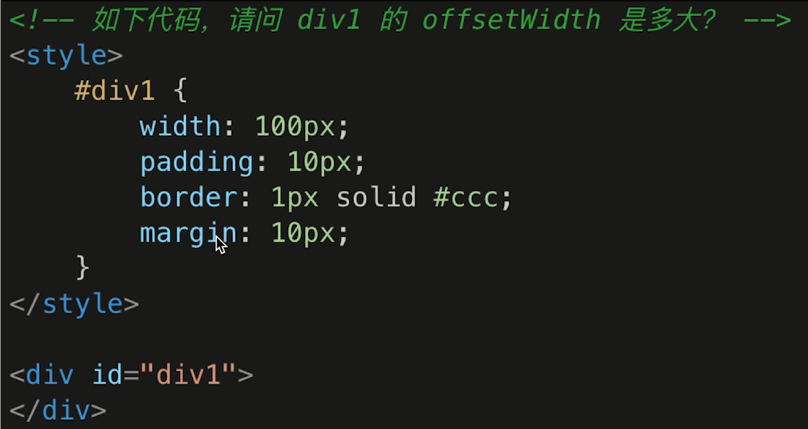
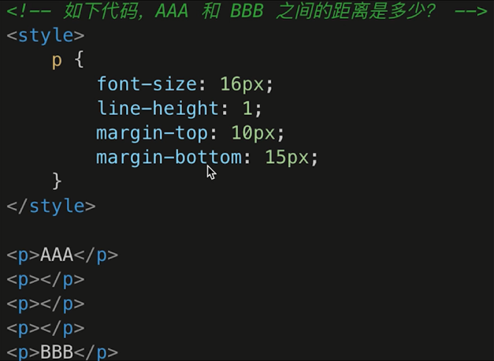

# html、css 知识

## html

### 语义化标签

- 非语义化标签有`div`、`span`等，而语义化标签有`button`、`header`、`section`等
- 可读性强，结构性强。根据标签字面意思就能知道一段 html 是干什么的，利于开发人员开发和维护，也利于 SEO。
- 在没 CSS 样式的情况下，页面整体也会呈现很好的结构效果

### 默认的块级元素和内联元素

- 块级是独占一行并且能设置宽高，内联是多个元素在一行（有些 inline-block 是能设置高度的）。
- 默认块级元素：div、p、ul、li、table 等。
- 默认内联元素：span、a、br、input、button 等。

## css

### 盒子模型的宽度计算



`offsetWidth = 内容宽度 + 内边距 + 边框`，它并不包含外边距，所以答案是`122px`。

如何快速修改上述代码让 offsetWidth 等于`100px`？默认情况下，width 就是内容宽度；但如果设置`box-sizing: border-box`，width 就会变成`内容宽度 + 内边距 + 边框`的值，那么 offsetWidth 就等于 width 的值`100px`了。

### margin 纵向重叠问题



margin 在纵向上是重叠的，并且空内容的 p 标签也会重叠，那么最终答案是`15px`（10 和 15 之间取最大值）。

### margin 负值问题

- 块级元素，`margin-top`为负值，它自身向上移动，`margin-bottom`为负值，它下方的元素会向上移动。
- 内联元素，`margin-left`为负值，它自身向左移动，`margin-right`为负值，它右边的元素向左移动。
- 总结，如果改变的是元素在**排列方向上**靠前的外边距，那位移的就是**自己**；如果改变的是**排列方向**上靠后的外边距，那位移的就是**下一个元素**。默认的，块级元素的排列方向是**从上到下**，内联元素的排列方向是**从左到右**。

### 什么是 BFC？如何应用？

BFC 是**块级格式上下文**(`Block Formatting Context`)，表示页面上的某个元素是一个隔离的独立容器，容器内部的布局影响不到外部的，外部也不会影响到内部的。

比较常见的 BFC

- 根元素：`<html>`；
- 溢出：除了`overflow: visible`；
- 浮动元素：除了`float: none`；
- 绝对定位元素：position 为`absolute | fixed`；
- display 为`inline-block | flex | grid | flow-root | table | inline-table | table-row | table-cell`。

BFC 的作用

- 避免高度塌陷（父元素设置`display: flow-root`，它成了一个独立隔离容器，那么它内部元素**浮动与否**，都不能影响外部的布局，那么高度**始终不会塌陷**）
- 规避块级盒子的上下外边距折叠（上下两个紧挨着的块级盒子设置`display: flow-root`，由于都是独立的容器，互相不能影响，那么上下外边距就不会重叠了）
- 避免被浮动元素遮盖（BFC 的区域不会与 float box 重叠，因为浮动盒子也是 BFC，两个 BFC 是不会互相遮挡的）

### 圣杯布局和双飞翼布局

圣杯布局，left、center、right 都浮动，center 设置左右内边距为 left 和 right 的宽度。然后利用“margin 为负值”将左右两个 div 上跳，再利用相对定位将左 div 移到最左侧，左侧 div 核心样式是`position: relative; margin-left: -100%; right:100px;`。

这样会有一个问题，当 center 区域比 left 区域宽度小的话，left 这个浮动元素就跳不到上一行了。那么可以将左侧 div 核心样式优化为`position: relative; margin-left: -100px; right: 100%;`。

```html
<html>
  <head>
    <style type="text/css">
      body,
      html {
        margin: 0;
      }
      .header {
        height: 100px;
        background-color: skyblue;
      }
      .footer {
        height: 100px;
        background-color: lightblue;
      }
      .content {
        display: flow-root;
        height: 200px;
        padding: 0 100px;
        background-color: red;
      }
      .center {
        float: left;
        width: 100%;
        height: 100%;
        background-color: #ccc;
      }
      .left {
        float: left;
        width: 100px;
        height: 100%;
        position: relative;
        margin-left: -100px;
        right: 100%;
        background-color: yellow;
      }
      .right {
        float: left;
        width: 100px;
        height: 100%;
        margin-right: -100px;
        background-color: green;
      }
    </style>
  </head>
  <body>
    <div class="header">header</div>
    <div class="content">
      <div class="center">center</div>
      <div class="left">left</div>
      <div class="right">right</div>
    </div>
    <div class="footer">footer</div>
  </body>
</html>
```

双飞翼布局是对经典圣杯布局的一种优化，最主要的优化就是去掉了左侧 div 的相对定位，去掉了父级元素的 padding，让 contentArea 宽度为 100%，这样也能避免 center 宽度小于左 div 的宽度时左 div 无法上跳的问题，所以双飞翼能直接使用`margin-left: -100%`来对左列设置位置

```html
<html>
  <head>
    <style type="text/css">
      body,
      html {
        margin: 0;
      }
      .header {
        height: 100px;
        background-color: skyblue;
      }
      .footer {
        height: 100px;
        background-color: lightblue;
      }
      .content {
        display: flow-root;
        height: 200px;
        background-color: red;
      }
      .center {
        float: left;
        width: 100%;
        height: 100%;
      }
      .inner {
        height: 100%;
        margin: 0 100px;
        background-color: #ccc;
      }
      .left {
        float: left;
        width: 100px;
        height: 100%;
        margin-left: -100%;
        background-color: yellow;
      }
      .right {
        float: left;
        width: 100px;
        height: 100%;
        margin-left: -100px;
        background-color: green;
      }
    </style>
  </head>
  <body>
    <div class="header">header</div>
    <div class="content">
      <div class="center">
        <div class="inner">center</div>
      </div>
      <div class="left">left</div>
      <div class="right">right</div>
    </div>
    <div class="footer">footer</div>
  </body>
</html>
```

### flex 实现一个三点色子

```html
<html>
  <head>
    <style type="text/css">
      .box {
        display: flex;
        flex-flow: row nowrap;
        justify-content: space-between;
        width: 200px;
        height: 200px;
        border: 2px solid #ccc;
        border-radius: 10px;
        padding: 20px;
      }
      .item {
        display: block;
        width: 40px;
        height: 40px;
        border-radius: 50%;
        background-color: #666;
      }
      .item:nth-child(2) {
        align-self: center;
      }
      .item:nth-child(3) {
        align-self: flex-end;
      }
    </style>
  </head>
  <body>
    <div class="box">
      <div class="item" style="align-self:flex-start"></div>
      <div class="item"></div>
      <div class="item" style="align-self:flex-end"></div>
    </div>
  </body>
  <html></html>
</html>
```

### absolute 和 relative 分别依据什么定位

- relative 依据自身定位，并没有脱离文档流。
- absolute 依据最近一层的定位元素去定位，脱离了文档流。

### 居中对齐有哪些实现方式

- 水平居中
  - 父元素使用`text-align: center`，子元素得是内联元素（文本也行）或者`display: inline-block`内联块级元素。
  - 如果一个块级元素显式设置了宽度，它的**外边距**设置为`auto`时，那么这个块级元素会水平居中。
  - 父元素相对定位，子元素绝对定位并设置`left: 50%; transform: translateX(-50%);`。
- 垂直居中
  - 父元素使用`vertical-align: center`，子元素是内联元素或者单元格。
  - 父元素相对定位，子元素绝对定位并设置`top: 50%; transform: translateY(-50%);`。
  - 父元素相对定位，子元素绝对定位并设置`top: 0; bottom: 0; margin: auto 0;`。

### line-height 如何继承

- 写具体数值，如`30px`，则继承该值。
- 写比例，如`2`或者`5`，则继承该**比例**。
- 写百分比，如`200%`，则继承计算出来的值。

### rem 是什么

- px，绝对长度单位，最常用。
- em，相对长度单位，相对父元素，不常用。
- rem，相对长度单位，相对于根元素，常用。

### 响应式布局的常用方案

- media-query，根据不同的屏幕宽度设置根元素 font-size；
- rem，基于根元素的相对单位。

```css
@media only screen and (max-width: 374px) {
  html {
    font-size: 86px;
  }
}
@media only screen and (min-width: 375px) and (max-width: 413px) {
  html {
    font-size: 100px;
  }
}
@media only screen and (min-width: 414px) {
  html {
    font-size: 110px;
  }
}
body {
  font-size: 0.16rem;
}
#div1 {
  width: 1rem;
}
```

rem 弊端：具有阶梯型，不是很平滑。

### vw/vh

网页视口尺寸

```js
window.screen.height; // 屏幕宽度
window.innerHeight; // 网页视口高度，等于100vh
document.body.clientHeight; // body高度
```

- `vh`：网页视口高度的`1/100`。
- `vw`：网页视口宽度的`1/100`。
- `vmax`：取`vh`和`vw`中的最大值。
- `vmin`：取`vh`和`vw`中的最小值。
