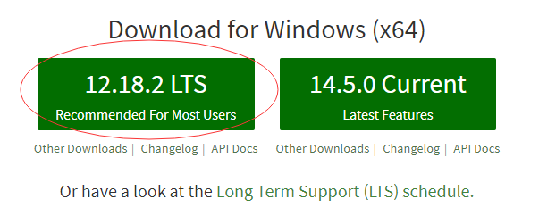
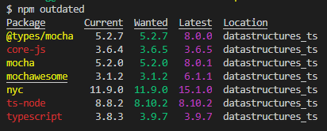

# Npm 的使用

## Node.js、Npm 是什么

- [Node.js](https://nodejs.org/en/)是 JavaScript 的一种运行环境，开源、跨平台、可用于众多流行工具里。
- 也就是说 Node.js 可以作为 JavaScript 在服务器上运行的一种形式，在其标准库中提供了一组异步的 I/O 原生功能（用以防止 JavaScript 代码被阻塞），并且 Node.js 中的库通常是使用非阻塞的范式编写的（从而使阻塞行为成为例外而不是规范）。
- Node.js 是一个底层的平台，社区在 Node.js 上构建了数千个库，例如：Express、NestJS、Koa、Socket.io 等。
- Npm 是 Node.js 标准的软件包管理器，解决 Node.js 部署的很多问题；可以下载别人写好的程序（包、命令行等），也可以自己写程序发布到 Npm 上。

## Node.js、Npm 的安装

- 打开[Node.js 官网](https://nodejs.org/en/)，如果很慢就使用[Node.js 中文网](http://nodejs.cn/)，选择“Recommended For Most Users（推荐给大多数用户）”，也就是稳定版本。
  
- npm 包管理工具是同 node.js 一并安装的，意思是 node.js 安装好后 npm 也随之安装到电脑上了。
- 打开“Git Bash”，没有装 Git 的可以看一下[Git 的使用](Git的使用.md)；或者打开 cmd，输入`node --version`可以查看安装的 node 是什么版本的，输入`npm --version`可以查看安装的 npm 是什么版本的。

## Npm 的基础命令

### 创建 package.json

&nbsp;&nbsp;&nbsp;&nbsp;`npm init`其实是给项目生成 package.json，也就是依赖配置文件，里面包含一些项目中的软件包的信息（名称、版本、脚本等）。

### package.json 的常用字段

| 字段            | 说明                                                           |
| --------------- | -------------------------------------------------------------- |
| name            | 设置了应用程序/软件包的名称。                                  |
| version         | 表明了当前的版本。                                             |
| description     | 是应用程序/软件包的简短描述。                                  |
| homepage        | 是应用程序/软件包的官方网站。                                  |
| author          | 是应用程序/软件包的作者。                                      |
| contributors    | 是应用程序/软件包的其他贡献者。                                |
| main            | 设置了应用程序的入口点。                                       |
| repository      | 应用程序/软件包的存放地方。                                    |
| keywords        | 关键字。                                                       |
| private         | 如果设置为 true，则可以防止应用程序/软件包被意外地发布到 npm。 |
| scripts         | 定义了一组可以运行的 node 脚本。                               |
| dependencies    | 设置了作为依赖安装的 npm 软件包的列表。                        |
| devDependencies | 设置了作为开发依赖安装的 npm 软件包的列表。                    |
| engines         | 设置了此软件包/应用程序在哪个版本的 Node.js 上运行。           |
| browserslist    | 用于告知要支持哪些浏览器（及其版本）。                         |

### 统一安装所有包

如果你的 package.json 是已经全部配好的那种（你是新加入别人的项目），你就可以直接`npm install”，会将项目所有的依赖自动下载装到 node_modules 文件夹下。

如果遇到`npm resource busy or locked.....”报错，可以先清空NPM本地缓存，具体命令就是`npm cache clean`。

### 局部安装单个包

- 在项目中开发很久了，突然需要某个功能或插件，就可以使用`npm install --save-dev xxx`（可简写成“-D”）安装单个软件包（省略“--save-dev”也是局部安装），例如：`npm install --save-dev typescript`。
- 如果你只是开发环境中使用其实上--save-dev 就行，但是如果生产环境也需要某个包，那使用`npm install --save xxx`（可简写成`-S`），例如，`npm install --save core-js`。
- 在 package.json 中的体现就是 devDependencies 和 dependencies，可以找个 package.json 看一下。
- 如果之前没有区分 devDependencies 和 dependencies，后面加上了 devDependencies 和 dependencies 但又上了生产环境，并只想安装 dependencies 里的包，可以试着加上`--production`。

### 全局安装单个包

像 typescript 是所有项目都可以用的，可以全局安装，将`--save-dev`换成`--global`就行了（可简写成“-g”），例如：`npm install -g typescript`。

全局包的位置大概在：C:\Users\YOU\AppData\Roaming\npm\node_modules

### 包安装后的使用

软件包安装完后可以通过`require`或`import`进行使用，如果软件包是可执行文件，可以使用`npx xxx`来运行。

### package-lock.json 是什么

package-lock.json 是在 npm 5 版本时引入的，为了解决“同一项目不同机器上安装的软件包不一致”的问题。引入后用以保证安装的每个包都有确切版本，可以百分百一致复制到另一台机器上。

package-lock.json 会固化当前安装的每个软件包的版本，npm install 时，npm 会使用这些确切的版本，`npm update`时，会更新 package-lock.json 文件中软件包的版本。

### 查看包的版本

查看本地安装的包的版本：

- `npm list`：查看局部安装的所有包（包括它们的软件包）的版本。
- `npm list -g`：查看全局安装的所有包（包括它们的软件包）的版本。
- `npm list --depth=0`：查看局部顶层的软件包，也就是 package.json 中列出的软件包的版本。
- `npm list -g --depth 0`：查看全局安装的软件包。
- `npm list xxx`：查看 xxx 软件包安装的版本。

查看远程仓库上包的版本：

- `npm view xxx version`：查看 xxx 软件包在 Npm 远程仓库上最新可用的版本。
- `npm view xxx versions`：查看 xxx 软件包在 Npm 远程仓库上以前的旧版本
- `npm outdated`：查看 package.json 中列出的软件包在本地和远程的版本信息，列出了一个表进行对比。  
   

### 安装旧版本的包

在安装命令的包名后加@再加版本号，例如：`npm install cowsay@1.2.0`

全局的软件包也可以：`npm install -g webpack@4.16.4`

### 更新包

semver 表示法设置要升级到的版本，例如：

- 〜1.13.0：只更新补丁版本，可以更新到 1.13.1，但 1.14.0 不行；主要用于修复 BUG。
- ^1.13.0：更新补丁版本和次版本，可以更新到 1.13.1、1.14.0 等；修改的东西要向下兼容。
- 1.13.0：不更新，一直使用这个版本。
- \>1.13.0：大于这个版本的任何版本都可以；>=、<=、<、||同理。
- 1.13.0 - 1.15.0：这个范围内的任何版本都可以。

说明：1.13.0，1 是主版本（不兼容），13 是次版本（向下兼容），0 是补丁版本（修复 BUG）。

使用`npm update`来更新所有软件包，使用`npm update xxx`来更新单个软件包。

有些软件包的主版本使用`npm update`更新不了，因为可能会引入较大的更改。要强制更新到最新可以使用`npm install -g npm-check-updates`和`ncu -u`，再去`npm update`。

### 卸载包

这个很简单，在“安装包”的命令上将`install`改为`uninstall`即可。

### 发布包

发布`npm publish`，撤销发布`npm unpublish <package>@<version>`
