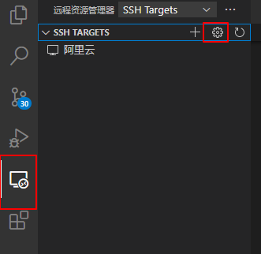
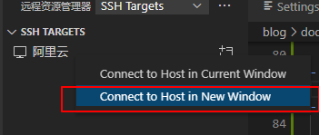
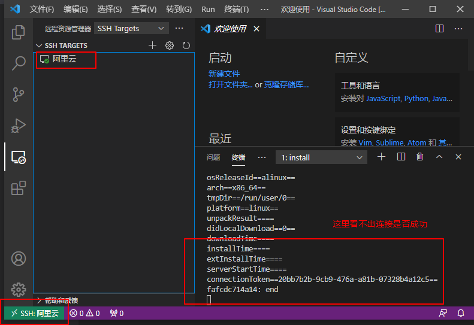
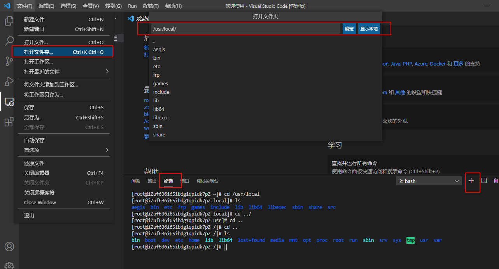
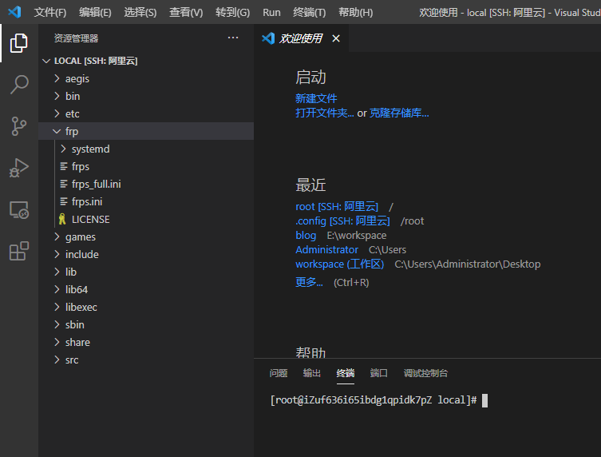

# VSCode 的使用

## 强力推荐 Settings Sync 插件

[Settings Sync 插件教程](https://www.jianshu.com/p/b4f9e4826fd1)，这个插件可以同步 VSCode 里所有的配置，包括你安装的插件，在一台新电脑里安装 VSCode，只要我们使用“Settings Sync 插件”就可以将以前旧电脑里的 VSCode 所有配置同步过来。具体怎么使用可以点链接进去学习，下面的章节是我个人的 VSCode 配置。

## 基础配置

- Auto Save：自动保存，设置的是 off，可与 Auto Save Delay 一起使用。
- Auto Save Delay：在多少毫秒后自动保存。
- Tab Size：默认是 4，但如果 Editor:Detect Indentation 启用时，它可能会被覆盖；同样的 Insert Spaces 也一样。
- Auto Closing Brackets：自动补全右括号；这个我不喜欢使用，置为了 never。
- Auto Closing Quotes：自动补全右引号；这个我不喜欢使用，置为了 never。
- Column Seletcion：使用鼠标和键进行行列的选择，例如：选择一些行的首部信息，将它们粘贴在其他行的首部。
- Hover:Enabled：是否进行悬浮提示
- Hover:Delay：悬停提示前的等待时间。
- Hover:Sticky：悬浮提示展示时，鼠标移动到它上面是否显示。
- editor.formatOnSave：保存时自动格式化，开启了。
- editor.minimap.enabled：是否显示缩略图，我不喜欢使用这个。
- editor.suggest.statusBar.visible：建议小部件底部的状态栏，开启了。
- Eol：行尾字符，LF 是 Unix 系统的，CRLF 是 Windows 系统的，我在设置 Git 时是统一的 LF，这里同样选用 LF，理由可以看[Git 的使用](./Git的使用.md)那一节。
- workbench.commandPalette.preserveInput：再次打开命令面板时，是否恢复上一次的输入内容，有兴趣的可以开启。
- workbench.tree.indent：文件树缩进大小，由 8 改为了 6，其实也随意了。
- workbench.tree.renderIndentGuides：文件树缩进参考线的显示，置为了 always。
- workbench.view.alwaysShowHeaderActions：操作区域的一些按钮是否总是显示，开启了。
- terminal.integrated.automationShell.windows：在下面有介绍。
- css.lint.duplicateProperties：不要使用重复的样式定义，置为 warning。
- update.mode：值置为 none，禁止更新。
- update.enableWindowsBackgroundUpdates：关闭了，不启用在 windows 后台更新 vscode
- extensions.autoCheckUpdates：自动检查扩展更新，关闭了
- extensions.autoUpdate：自动安装扩展更新，关闭了
- typescript.enablePromptUseWorkspaceTsdk：开启了
- typescript.tsdk: ""
- typescript.updateImportsOnFileMove.enabled：always

## Git 在 VSCode 中的配置

- terminal.integrated.automationShell.windows：将 windows 命令行换成 Git Bash，在 settings.json 中编辑，例如："terminal.integrated.shell.windows": "D:/Git/bin/bash.exe"
- git.path: "D:/Git/bin/git.exe"
- git.showPushSuccessNotification：Git 推送成功后显示通知，开启了。
- git.supportCancellation：同步操作时出现通知，可以取消，开启了。
- 安装 GitLens 插件

## VSCode 中使用 Markdown

- 安装“Markdown All in One”、“Markdown Preview Enhanced”和“markdownlint”这三个插件
- [Markdown 教程](https://shd101wyy.github.io/markdown-preview-enhanced/#/zh-cn/markdown-basics)
- [Markdown Preview Enhanced 的使用](https://shd101wyy.github.io/markdown-preview-enhanced/#/zh-cn/)
- [Markdown All in One 的使用](https://github.com/yzhang-gh/vscode-markdown)
- [markdownlint 规则](https://github.com/DavidAnson/markdownlint/blob/master/doc/Rules.md)

  ```json
  "markdownlint.config": {
      "default": true, // 允许某个规则中几项可以使用
        "MD033": {
            "allowed_elements": [
                "details",
                "summary",
                "a",
                "ul",
                "li",
                "br",
                "code",
                "pre",
            ]
        },
        "MD041": false,
  }
  ```

- markdown-preview-enhanced.enableHTML5Embed：允许将多媒体链接转换成 H5 标签。
- Toggle Break On Single Newline：开启了，无需再打两个空格然后回车进行换行。

## Remote Development 插件

- 可以不用 Remote Development 插件，直接用 XShell 或者 FinalShell 等工具。
- 在 VSCODE 扩展商店里安装“Remote Development 插件”，左侧会出现一个新图标（类似我的电脑），点击它。
  
- 再点击齿轮形状的设置按钮，选择`C:\Users\Administrator\.ssh\config`，然后在里面配置好连接信息

  ```txt
  Host 阿里云
    HostName 47.102.155.125
    User root
  ```

- 配置好这个连接信息后，左侧列表就会出现刚刚配置的 target，右击这个 target，我们选择在新窗口进行 ssh 连接。
  
- 如果出现`An SSH installation couldn’t be found`错误，表示没有找到 ssh 连接工具，我们打开 VSCODE 的设置，搜索`remote.SSH.path`，将 Git 的 ssh 工具的路径填进去，例如`D:\Git\usr\bin\ssh.exe`。（我们并没有使用 Windows OpenSSH 客户端）
- 如果出现`could not establish connection to`错误，首先点“重试”按钮。如果不行，很有可能是选择的服务器类型不对，我们打开 VSCODE 的设置，搜索`remote.SSH.remotePlatform`，如果阿里云 ecs 是 linux 的，我们就对应选择 linux 的，记得要确认保存。（还有一种原因是密码没输，直接回车了。然后还可以尝试删除`C:\Users\Administrator\.ssh\known_hosts`文件）
- 至于`The authenticity of host xxx can't be established`问题，可以暂时忽略，它在第一次连接远程服务器会出现。
- 如何才算连接成功了？点开那个新窗口的 Remote Development 图标，如果 target 有个绿色的勾就表示连接成功了。如果还能操作远程服务器能更加表明连接成功了。
  
- 连接成功后，有两种方式操作远程服务器。
  1. 在“终端”里点击“+”，也就是新建一个终端窗口，这个新的终端窗口就是一个远程终端，用来操作阿里云服务器的。
  2. 直接使用 VSCODE 的“文件-打开文件夹”来操作远程服务器里的文件夹，因为此时的 VSCODE 窗口相当于远程服务器的可视化工具了。这种方式更方便，可以看下面第二张图打开后的目录结构。
       
     
- 如果还有问题，可以查看[解决无法连接实例问题](https://help.aliyun.com/document_detail/127814.htm)。
