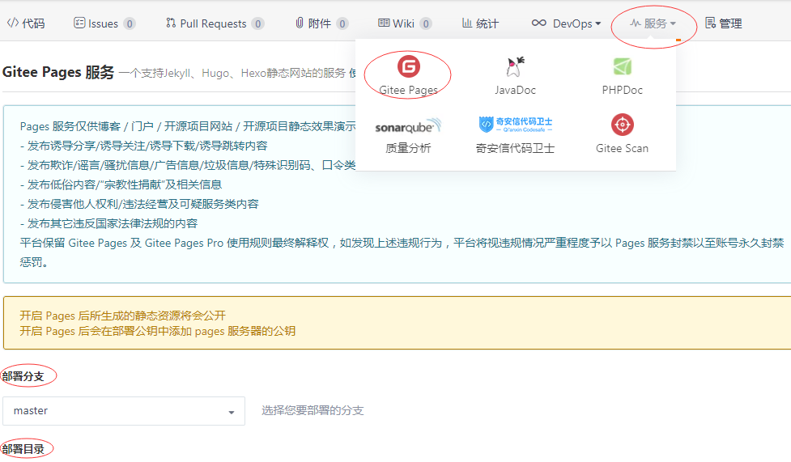

# 使用 docsify 写 blog

## 为什么使用 docsify

- [docsify](https://docsify.js.org)只需要一个 index.html 静态文件，不会再生成多余的静态文件，非常简便。
- 插件可以直接使用 cdn，也可以将插件相关的 js、css、images 直接放到项目下，无需 npm 下载。
- 配置简单，也足以支撑最简单的文档网页，自己操作空间很大。

## docsify 的使用

- 在一个完全新的项目里使用[docsify](https://docsify.js.org)，比如是个空的 blog 项目：

  1. **使用 npm**：首先得会使用 npm，查看之前写的[“Npm 的使用”](Npm的使用.md)。
  2. **初始化新项目**：使用`git init`和`npm init`来初始化新项目，会生成`.git`和`package.json`。
  3. **局部安装 docsify**：运行`npm i docsify-cli`局部安装 docsify，再编辑`package.json`里的`scripts`如下。

     ```json
     {
       // 添加npm运行脚本
       "scripts": {
         "init": "docsify init ./docs",
         "dev": "docsify serve ./docs"
       }
     }
     ```

  4. **使用 docsify 初始化 docs**：运行`npm run init`，docsify 就会在新项目里生成`docs`文件夹，该文件夹里有`index.html`、`.nojekyll`和`README.md`。
  5. **使用 docsify 预览 docs 内容**：运行`npm run dev`，就能看到`docs`文件夹里的内容（最初是`docs/README.md`）显示在了`http://localhost:3000`里。
  6. **新增.gitignore**：给这个新项目新增`.gitignore`文件，在里面添加`node_modules`、`.git`、`.vscode`等。

- 如果是在**现有项目**里使用 docsify，也就是给现有项目**新增 docs**说明文档，或者**改造**docs 说明文档：

  1. 因为是现有项目，新建一个分支，**不用**使用`git init`和`npm init`来初始化现有项目了。如果是**改造**docs 说明文档，那就将现有项目这个新分支里的`docs`文件夹**剪切**到外面进行一个**备份**。
  2. **局部安装 docsify**：运行`npm i docsify-cli`会在现有项目新分支下局部安装 docsify，再编辑`package.json`里的`scripts`如下。

     ```json
     {
       // 添加npm运行脚本，除了npm和git以外，所有的blog相关的都在docs目录下
       "scripts": {
         "init": "docsify init ./docs",
         "dev": "docsify serve ./docs"
       }
     }
     ```

  3. **使用 docsify 初始化 docs**：运行`npm run init`，docsify 会在现有项目新分支下生成`docs`文件夹，该文件夹里有`index.html`、`.nojekyll`和`README.md`。
  4. **使用 docsify 预览 docs 内容**：运行`npm run dev`，就能看到`docs`文件夹里的内容（最初是`docs/README.md`）显示在了`http://localhost:3000`里。
  5. **修改.gitignore**：修改现有项目的`.gitignore`文件，在里面添加`node_modules`、`.git`、`.vscode`等。
  6. 准备在这个项目的`docs`里写项目说明，或者是将之前备份的 docs 里的内容移到现在的新 docs 里。

## 期望的项目目录结构

```txt
ProjectName（例如blog，也可以是xxx-react，只要保证docs是真正的文档入口目录即可）
  ├──docs （docsify作用于这个文件夹，也是部署在GitHub Pages上的目录）
  │   ├──book-sketches （自定义博客内容，例如生活部分）
  │   │       └──_sidebar.md （book-sketches里所有md文件组成的目录）
  │   ├──front-end （自定义博客内容，例如web部分）
  │   │       └──_sidebar.md （front-end里所有md文件组成的目录）
  │   ├──public （存放博客系统的公共资源，也可以放本地插件）
  │   │   ├──image （博客系统的公共图片资源）
  │   │   │   ├──bg.png （封面背景图）
  │   │   │   └──favicon.ico （网站页签图标icon）
  │   │   └──library （插件虽然是cdn形式，以防万一，在本地存一份）
  │   ├──_coverpage.md （博客系统的封面）
  │   ├──_navbar.md （博客系统的导航栏）
  │   ├──.nojekyll （解决名字为下划线开头的文件在GitHub上的报错）
  │   ├──index.html （博客系统的入口文件，存放一些配置，引入一些插件等）
  │   ├──README.md （博客系统的HomePage主页）
  │   └──sw.js （博客系统的离线功能）
  ├──node_modules （npm包安装所在）
  ├──.gitignore （git忽略文件）
  ├──package-lock.json （npm包管理文件）
  ├──package.json （npm包管理文件）
  └──README.md （本项目说明文件）
```

## docsify 的基本配置

- 配置都在`docs`的 index.html 中的 window.$docsify 对象里，添加字段就可以了，具体用什么可以去官网的[“定制化-配置项”](https://docsify.js.org/#/zh-cn/configuration)里进行查看。
- 我使用的基本配置都在下面了，还有些配置可以外联 script 文件，为 window.$docsify 添加属性即可。

```html
<!DOCTYPE html>
<html lang="en">
  <head>
    <meta charset="UTF-8" />
    <title>Document</title>
    <meta http-equiv="X-UA-Compatible" content="IE=edge,chrome=1" />
    <meta name="description" content="Description" />
    <meta name="viewport" content="width=device-width, initial-scale=1.0, minimum-scale=1.0" />
    <!-- 网站页签图标 -->
    <link rel="shortcut icon" href="public/image/favicon.ico" type="image/x-icon" />
  </head>

  <body>
    <div id="app">亲，正在加载中，请稍等~</div>
    <script>
      window.$docsify = {
        name: "Liawn's blog", // 左侧侧边栏最顶部的文字
        repo: "", // 右上角的挂件（跳转链接）
        el: "#app", // 欢迎页
        coverpage: true, // 开启封面功能
        loadSidebar: true, // 开启侧边栏功能
        loadNavbar: true, // 开启导航栏功能
        // 解决控制台404问题
        alias: {
          /* 使用自定义的侧边栏 */
          "/_sidebar.md": "/front-end/_sidebar.md",
          "/front-end/.*/_sidebar.md": "/front-end/_sidebar.md",
          "/book-sketches/.*/_sidebar.md": "/book-sketches/_sidebar.md",
          /* 使用自定义的侧边栏 */
          "/.*/_navbar.md": "/_navbar.md",
        },
        relativePath: true, // 启用相对路径
        topMargin: 55, // 让你的内容页在滚动到指定的锚点时，距离页面顶部有一定空间
        mergeNavbar: true, // 小屏设备下合并导航栏到侧边栏
        auto2top: true, // 切换页面后是否自动跳转到页面顶部
        onlyCover: true, // 让封面单独出现，封面滑动在移动端效果并不好，所有固定onlyCover为true
        // search.min.js插件
        search: {
          maxAge: 86400000, // 过期时间，单位毫秒，默认一天
          paths: "auto", // or 'auto'
          placeholder: "搜索",
          noData: "没有搜索到相应的结果",
          // 搜索标题的最大层级, 1 - 6
          depth: 6,
        },
        // docsify-tabs插件
        tabs: {
          persist: true,
          sync: true,
          theme: "material",
          tabComments: true,
          tabHeadings: true,
        },
      };
      // 离线也能查看
      if (typeof navigator.serviceWorker !== "undefined") {
        navigator.serviceWorker.register("sw.js");
      }
    </script>
    <!-- Docsify v4 -->
    <script src="//cdn.jsdelivr.net/npm/docsify@4"></script>
    <!-- 解析xxx类型的code展示面板，至于样式还是得自己加 -->
    <script src=" //cdn.jsdelivr.net/npm/prismjs@1/components/prism-typescript.min.js"></script>
    <script src="//cdn.jsdelivr.net/npm/prismjs@1/components/prism-jsx.min.js"></script>
    <script src="//cdn.jsdelivr.net/npm/prismjs@1/components/prism-json.min.js"></script>
    <!-- 全文搜索 -->
    <script src="//cdn.jsdelivr.net/npm/docsify/lib/plugins/search.min.js"></script>
    <!-- 代码复制 -->
    <script src="//cdn.jsdelivr.net/npm/docsify-copy-code/dist/docsify-copy-code.min.js"></script>
    <!-- 底部分页 -->
    <script src="//cdn.jsdelivr.net/npm/docsify-pagination/dist/docsify-pagination.min.js"></script>
    <!-- 标签展示 -->
    <script src="//cdn.jsdelivr.net/npm/docsify-tabs@1"></script>
    <!-- theme-liawn主题 //cdn.jsdelivr.net/gh/用户名/仓库名@版本/文件夹/文件名 -->
    <script src="//cdn.jsdelivr.net/gh/liawnliu/docsify-theme-liawn@v1.2.0/dist/theme-liawn.min.js"></script>
  </body>
</html>
```

## 封面的使用

- 封面就是跳转到你博客/书籍的链接，它在“加载中”提示完后的第一个展示的模块，[docsify](https://docsify.js.org)官网一开始那个可爱 LOG 和绿色背景就是封面。
- 使用封面首先将配置项`coverpage`置为 true，或者将 coverpage 改为你“封面.md”的链接位置，例如：`coverpage: '_coverpage.md'`。
- 在`docs`目录下新建一个`_coverpage.md`，docsify 会解析它生成封面；里面有博客名、大 LOGO、两个按钮、背景图或背景色。
- `_coverpage.md`示例：

  ```txt
  # xxx\'s blog

  > xxxxxxxxxxxx.

  - 目前xxxxxx
  - 本博客由Docsify和Gitee Pages搭建而成

  [Gitee](https://gitee.com/xxx)
  [Get Started](/book-xxx/?id=功能说明)

  
  ```

## 导航栏的使用

- 导航栏就是博客顶部的模块，会显示“入门”、“指南”、“了解更多”等按钮，目前是跟着文档的滚动而滚动的，也可以自己调整一下。
- 使用导航栏首先将配置`loadNavbar`置为 true，或者将 loadNavbar 改为你“导航栏.md”的链接位置，例如：`loadNavbar: '_navbar.md'`。
- 在`docs`目录下创建一个`_navbar.md`，docsify 会解析它生成导航栏；当然也可以直接在 index.html 的 body 中添加 nav 或者 div 标签，给它在添加 a 便签用以跳转你的“入门”之类的。
- `_navbar.md`示例：

  ```txt
  * [Web部分](/front-end/)
  * [生活](/book-sketches/)
  ```

## 侧边栏的使用

- 左侧侧边栏就是整个书籍或者文档的目录，顶部可以是搜索栏和博客总标题“xxx 的博客”，底部是侧边栏收缩按钮。
- 侧边栏的使用首先是 loadSidebar 配置项置为 true，然后在根目录下创建\_sidebar.md 文件，文件内容例如：

  ```txt
    * 常用工具
        * [Git的使用](/front-end/常用工具/Git的使用.md)
        * [使用gitbook写blog](/front-end/常用工具/使用gitbook写blog.md)
        * [使用docsify写blog](/front-end/常用工具/使用docsify写blog.md)
  ```

- docsify 会根据\_sidebar.md 生成侧边栏里的目录，多级目录就是 ul-li 的写法，也就是在\_sidebar.md 里将内容（标题）多使用一个 tab 缩进。
- 左侧侧边栏没有章节折叠功能，自己写了一个折叠功能在`theme-liawn.js`里，其实就是根据 docsify 现有的折叠功能`class="collapse"`和`class="app-sub-sidebar"`来实现的。

## 插件的使用

- docsify 基本功能其实够用了，使用插件可以更方便的阅读博客/书籍。插件可以直接使用 cdn 引进到 index.html 里，非常便捷，但是可能影响到你的博客/书籍加载速度，当然你也直接将插件下载到你的项目里再部署到网站上。
- 目前使用的插件：
  - 全文搜索插件 search，用在左侧侧边栏顶部
  - 复制代码插件[docsify-copy-code](https://github.com/jperasmus/docsify-copy-code)，用在文章正文中。
  - 分页导航插件[docsify-pagination](https://github.com/imyelo/docsify-pagination)，用在文章底部。
  - 页签插件[docsify-tabs](https://jhildenbiddle.github.io/docsify-tabs/#/)。
  - 自己做了一个主题[docsify-theme-liawn](https://github.com/liawnliu/docsify-theme-liawn)，增加了一个固定的 header 在顶部，将博客名、搜索栏、导航栏都放到了 header 里；给左侧侧边栏增加了折叠功能；新增右侧侧边栏，作为当前文章的目录（不显示在左侧侧边栏了）。
- 其他插件可以去这个网站上查看：[https://github.com/docsifyjs/awesome-docsify](https://github.com/docsifyjs/awesome-docsify)

## 部署博客/书籍

&nbsp;&nbsp;&nbsp;&nbsp;因为有静态的 index.html，直接上传到 Gitee 或 GitHub 上，在该项目的“服务”或“设置”里找到“Pages”，选择好你的分支和目录（index.html 所在目录）就可以部署了，一键部署非常便捷。


## 常见问题

1. **文件 404 问题**：Git 是默认忽略大小写问题的，修改文件夹的大小写上传到 Git 远程代码库，将这个远程代码库的 build 部分部署到服务器上，在访问修改文件夹下的文件时会出现 404 问题。**解决方案：打开本地项目的.git 目录下的 config 文件，修改里面的 ignorecase 选项为 false。**
2. Markdown All in One 插件创建的目录，如果标题是以数字开头的，在 docsify 上点击时会报错，两方不兼容，所以隐藏了 Markdown All in One 生成的目录，只用我们的右侧侧边栏作为当前文章的目录。
