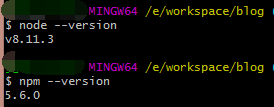
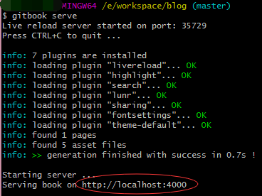

# 使用 gitbook 写 blog

## 了解 GitBook

&nbsp;&nbsp;&nbsp;&nbsp;[GitBook](http://gitbook.hushuang.me/)是一款基于 Node.js 的文档编写工具，支持[Markdown](http://gitbook.hushuang.me/syntax/markdown.html)和[AsciiDoc](http://gitbook.hushuang.me/syntax/asciidoc.html)文档格式，并且可以将这些文档组织成一本书的形式。与 Git 搭配更容易管理文档，当然也可以使用 GitHub 的 Pages 来部署你的“书”。这样就可以尽情的使用这一套流程来充实你的个人博客啦！

## 环境搭建

1. 之前有写过[Npm 的使用](Npm的使用.md)，简单来说就是先下载安装[Node.js](https://nodejs.org/zh-cn/)，已安装 Node.js 的就直接安装[GitBook](http://gitbook.hushuang.me/)，Node.js 安装完后使用两条命令检查一下：**node --version** 和 **npm --version**  
   
2. 全局安装 GitBook，命令是 **npm install gitbook-cli -g**
3. 然后在当前目录下创建一本书，命令是 **gitbook init**，会生成 README 和 SUMMARY，一个是说明文档，一个是书的目录。

## 配置 book.json

- 常规设置：

| 变量        | 说明                                                                    |
| ----------- | ----------------------------------------------------------------------- |
| root        | 包含所有图书文件的根文件夹的路径，除了 book.json                        |
| structure   | 指定自述，摘要，词汇表等的路径。                                        |
| title       | 书的标题，默认值从 README 中提取。在 GitBook.com 上，此字段已预填。     |
| description | 您的图书说明，默认值从自述文件中提取。在 GitBook.com 上，此字段已预填。 |
| author      | 作者姓名。在 GitBook.com 上，此字段已预填。                             |
| isbn        | 书的国际码 ISBN                                                         |
| language    | 语言 ISO 规范的书的语言，默认值是 en                                    |
| direction   | 文本的方向。可以是 rtl 或 ltr，默认值取决于 language 的值               |
| gitbook     | GitBook 的版本。使用 SemVer 规范并接受诸如“> = 3.0.0”的条件             |

- 常用插件：
  - "chapter-fold"：左侧目录折叠。
  - "code"：代码块的行数和复制按钮。
  - "search-pro"：高级搜索（含中文），需要去掉默认插件即"-lunr"和"-search"。
  - "splitter"：侧边栏宽度可调节。
  - "sharing-plus"：分享。
  - "pageview-count"：阅读量计数。
  - "lightbox"：当前页将图打开放大显示。
  - "theme-fexa": 定制化主题。
  - "anchor-navigation-ex"：悬浮的“目录”和“返回顶部”。

&nbsp;&nbsp;&nbsp;&nbsp;配置好后使用 **gitbook install** 命令进行插件安装。参考链接[https://www.cnblogs.com/mingyue5826/p/10307051.html](https://www.cnblogs.com/mingyue5826/p/10307051.html)

## 使用 GitBook

1. 预览这本书可以使用 **gitbook serve** 先本地编译，再通过日志里它给的地址去预览这本书  
   
2. 在项目中编写你的 md 文档，如果想要将它添加到书里并显示，那么在 SUMMARY.md 文档中合适的位置新增一个“标题”（使用 md 的链接语法），再使用 **gitbook serve** 命令进行编译（只要修改了就要重新编译），并打开地址去预览新的内容。
3. 部署到线上作为自己的个人博客。先使用 **gitbook build** 对书进行打包，会生成\_book 文件夹。可以使用 GitHub 和 Gitee 的 Pages 进行部署。例如使用 Gitee，进入线上仓库（部署的位置），依次点击“服务”-“Gitee Pages”，然后选择好你要部署的分支和目录（\_book 文件夹）。
   

## 常见问题

1. **文件 404 问题**：Git 是默认忽略大小写问题的，修改文件夹的大小写上传到 Git 远程代码库，将这个远程代码库的 build 部分部署到服务器上，在访问修改文件夹下的文件时会出现 404 问题。**解决方案：打开本地项目的.git 目录下的 config 文件，修改里面的 ignorecase 选项为 false。**
2. 其他问题可以通过服务器上的文件与本地文件对比找出解决方案。
