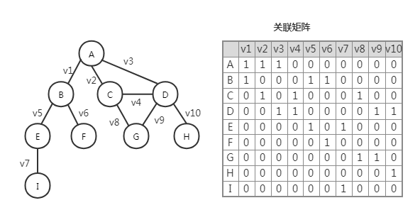

# 图

## 图的相关术语

&nbsp;&nbsp;&nbsp;&nbsp;图(Graph)是一组由边连接的节点（顶点）。是网络结构的抽象模型，可以表示任何二元关系。  
&nbsp;&nbsp;&nbsp;&nbsp;数学表达：G = (V, E)，其中 V 是一组顶点，E 是一组边连接 V 中顶点的边。  


**术语**：  
&nbsp;&nbsp;&nbsp;&nbsp;相邻顶点：一条边连接在一起的顶点。例如上面的“无向图”中的 A 和 B 相邻，A 和 C 相邻，A 和 D 相邻，A 和 E 不相邻。  
&nbsp;&nbsp;&nbsp;&nbsp;度：一个顶点的相邻顶点数量。例如上面的“无向图”中，A 的度是 3，E 的度是 2，D 的度是 4。  
&nbsp;&nbsp;&nbsp;&nbsp;路径：一些相邻顶点与边一起构成的路径，顶点 v1、v2、v3、v4...vn 的一个连续序列，其中 vi 和 vi+1 是相邻顶点，也就是路径上连续的点都是相邻的。例如上面的“无向图”中，A-C-G-D-H。  
&nbsp;&nbsp;&nbsp;&nbsp;简单路径：路径上不包含重复的顶点。  
&nbsp;&nbsp;&nbsp;&nbsp;环：除了第一个顶点和最后一个顶点以外，没有重复顶点的简单路径。例如上面的“无向图”中：A-C-G-D-A。  
&nbsp;&nbsp;&nbsp;&nbsp;连通的：两个顶点间存在边，那么这两个点是相通的。如果一个图中任意两个顶点都是连通的，那么这个图就是连通图。例如上面的“有向图”中：A 和 C 是连通的，F 和 G 是不连通的，该图不是连通图。  
&nbsp;&nbsp;&nbsp;&nbsp;无向的：两个顶点间的边是没有方向的。反之就是有向的。例如上图中的“无向图”和“有向图”。  
&nbsp;&nbsp;&nbsp;&nbsp;强连通：双向的连通就是强连通，单向的连通是普通连通。例如上面的“有向图”中：A 和 C 是普通连通的，C 和 D 是强连通的。  
&nbsp;&nbsp;&nbsp;&nbsp;出度：该顶点的指向相邻顶点的数量。入度：相邻顶点的指向该顶点的数量。例如上面的“有向图”中，A 的出度是 3 而入度是 0。  
&nbsp;&nbsp;&nbsp;&nbsp;权：边被赋予了权值。例如上面的“加权图”。

## 图的表示

&nbsp;&nbsp;&nbsp;&nbsp;邻接矩阵：用一个矩阵（二维数组）来表示每两个顶点之间的关系。如果索引 i 所在顶点与索引 j 所在顶点是相邻的，那么 array[i][j] = 1，否则就为 0。  
  
&nbsp;&nbsp;&nbsp;&nbsp;邻接表：由图中每个顶点的相邻顶点列表组成。可以用数组、链表、字典、散列表来表示相邻顶点列表。  
  
&nbsp;&nbsp;&nbsp;&nbsp;关联矩阵：矩阵的行表示顶点，列表示边。使用二维数组来表示顶点与边的关系，如果顶点是边的入射点就是为 1，否则为 0。  


## 图的实现

&nbsp;&nbsp;&nbsp;&nbsp;图的实现代码细节：[graph.ts](https://gitee.com/liawnliu/datastructures_ts/blob/master/src/ts/data-structures/graph.ts)

&nbsp;&nbsp;&nbsp;&nbsp;声明一个私有变量\_isDirected 代表图是否是有向图，声明一个私有变量\_vertices 来存储图的顶点，声明一个私有变量\_adjList 存储某个顶点的邻接顶点。

&nbsp;&nbsp;&nbsp;&nbsp;addVertex 方法：给图添加顶点。

```js
public addVertex(vertex: string | number) {
    // 顶点不存在才添加，includes是ES2016方法
    if (!this._vertices.includes(vertex)) {
        this._vertices.push(vertex);
        // 邻接顶点的存放采用map结构
        this._adjList.set(vertex, []);
    }
}
```

&nbsp;&nbsp;&nbsp;&nbsp;addEdge 方法：添加边。

```js
public addEdge(v: string | number, w: string | number) {
    // v没有加进顶点数组里就会新添加进去
    if (!this._adjList.get(v)) {
        this.addVertex(v);
    }
    // w没有加进顶点数组里就会新添加进去
    if (!this._adjList.get(w)) {
        this.addVertex(w);
    }
    this._adjList.get(v).push(w);
    // 无向图才会认为两者彼此相邻。
    // 如果是单向的就调用一次addEdge，双向就调用两次addEdge
    if (!this._isDirected) {
        this._adjList.get(w).push(v); // 无向
    }
}
```

## 图的遍历

&nbsp;&nbsp;&nbsp;&nbsp;**图遍历算法的思想**：追踪一个顶点，然后访问它的邻接顶点；如果它的邻接顶点还没有被访问过，那么将它的邻接顶点加到待访问列表中；然后从待访问列表中取下一个顶点去追踪，再使用相同的处理方法。当图中所有顶点被完全探索了，该图就遍历完了。  
&nbsp;&nbsp;&nbsp;&nbsp;**完全探索**：某顶点的所有邻接顶点被访问了一次后（或没有邻接顶点），该顶点就被完全探索完了。（完全探索完的顶点至多被访问两次）

&nbsp;&nbsp;&nbsp;&nbsp;图的遍历有两种：**广度优先搜索(BFS)** 和 **深度优先搜索(DFS)**。他们拥有相同的图遍历思想，不同之处：BFS 会把顶点所有的邻接顶点先遍历完；而 DFS 是沿一条路径深入遍历。  
&nbsp;&nbsp;&nbsp;&nbsp;数据结构层面上，广度优先搜索采用的是 **队列**，深度优先搜索采用的是 **栈**。

### 广度优先搜索

&nbsp;&nbsp;&nbsp;&nbsp;广度优先搜索的实现代码细节：[breadth-first-search.ts](https://gitee.com/liawnliu/datastructures_ts/blob/master/src/ts/algorithms/graph/breadth-first-search.ts)

&nbsp;&nbsp;&nbsp;&nbsp;遍历时，顶点至多被访问两次，也就是三种状态：未被访问过（**白色**）、待第二次访问（**灰色**）、完全探索完（**黑色**）。所以在图数据初始化后，还需要给图构造对应的颜色信息。  
&nbsp;&nbsp;&nbsp;&nbsp;选一个开始点开始遍历，广度优先搜索的待访问列表用 **队列** 来实现，将这个开始点先置为灰色，再加入 **队列尾部**。  
&nbsp;&nbsp;&nbsp;&nbsp;从 **队列的首部** 取出顶点，如果这个顶点有 **白色** 的邻接顶点，就将这些白色的邻接顶点一一加入 **队列尾部**，并置为 **灰色**；当该顶点的 **所有邻接顶点** 处理完毕后，将该顶点置为 **黑色**。  
&nbsp;&nbsp;&nbsp;&nbsp;**队列不为空** 就继续上一步操作，否则结束操作，遍历完成。  


&nbsp;&nbsp;&nbsp;&nbsp;我们可以在使用 BFS 求出每个点到开始点的距离和它们之间的回溯点。在初始化定义一个距离变量和回溯点遍历，同颜色信息一样。在加入待访问列表（队列）时，就将距离信息和回溯点更新。当遍历完，就可得出所有顶点与开始点的距离和回溯点。

### 深度优先搜索

&nbsp;&nbsp;&nbsp;&nbsp;深度优先搜索的实现代码细节：[depth-first-search.ts](https://gitee.com/liawnliu/datastructures_ts/blob/master/src/ts/algorithms/graph/depth-first-search.ts)

&nbsp;&nbsp;&nbsp;&nbsp;跟广度优先搜索一样，也是三种状态：**白色、灰色、黑色**。在图数据初始化后，还需要给图构造对应的颜色信息。  
&nbsp;&nbsp;&nbsp;&nbsp;选一个开始点开始遍历，深度优先搜索的待访问列表用 **栈** 来实现，将这个开始点先置为灰色，再加入 **栈顶部**。  
&nbsp;&nbsp;&nbsp;&nbsp;查看 **栈顶** 顶点，如果这个顶点有 **白色** 的邻接顶点，就将第一个白色邻接顶点加到 **栈顶**，并置为 **灰色**；如果这个顶点 **没有白色邻接顶点了**，则将该顶点置为 **黑色**。  
&nbsp;&nbsp;&nbsp;&nbsp;**栈不为空** 就继续上一步操作，否则结束操作，遍历完成。  


&nbsp;&nbsp;&nbsp;&nbsp;我们可以在使用 DFS 求出每个点距离开始点的发现时间和完全探索完的时间还有它们之间的回溯点（用时和拓扑排序）。在初始化定义三个变量分别存储那三个信息，同颜色信息一样。在加入待访问列表（队列）时，就将发现时间和回溯点更新；在该顶点探索完毕就更新完全探索时间。当遍历完，就可得出所有顶点与开始点的之间发现时间和完全探索完的时间还有回溯点。  
&nbsp;&nbsp;&nbsp;&nbsp;拓扑排序就是对任务或步骤进行排序，允许其中有步骤可以对换。比如一本书的章节，整体章节有顺序，但其中别个章节其实可以提前并不影响整体。而拓扑排序主要在有向无环图中并搭配深度优先遍历使用的。  


## 最短路径算法

### 迪杰斯特拉(Dijkstra)算法

&nbsp;&nbsp;&nbsp;&nbsp;迪杰斯特拉(Dijkstra)算法的实现代码细节：[dijkstra.ts](https://gitee.com/liawnliu/datastructures_ts/blob/master/src/ts/algorithms/graph/dijkstra.ts)

&nbsp;&nbsp;&nbsp;&nbsp;迪杰斯特拉(Dijkstra)是图里每个顶点到单个源顶点的最短距离的 **贪心算法**。因为有权重的原因，我们选择的是邻接矩阵，更容易计算。核心就是，记录每个顶点到源顶点的距离，每次找出里源顶点最近并可访问的顶点，进而算出它所有的邻接顶点里源顶点的距离，如果算出来的更小就覆盖原邻接顶点的最短距离（**局部最优**），然后该顶点再置为不可访问的，重复之前的步骤直至所有顶点都访问完。
  
&nbsp;&nbsp;&nbsp;&nbsp;与 BFS 的 **区别一** ：BFS 使用队列存储待访问列表，而迪杰斯特拉(Dijkstra)是使用“包含所有顶点的数组（顶点要可访问）”存储待访问列表；  
&nbsp;&nbsp;&nbsp;&nbsp;**区别二** ：BFS 拿的队列首部顶点去处理的，迪杰斯特拉(Dijkstra)算法中拿的是数组中距离源顶点距离最短并可访问的顶点；  
&nbsp;&nbsp;&nbsp;&nbsp;**区别三** ：迪杰斯特拉(Dijkstra)算法中的最短距离并非只有一次计算他是可覆盖的，而 BFS 是一次计算后不变，它非常依赖于当时构造边信息的先后顺序或者算法细节。

### 弗洛伊德(Floyd)算法

&nbsp;&nbsp;&nbsp;&nbsp;弗洛伊德(Floyd)算法的实现代码细节：[floyd-warshall.ts](https://gitee.com/liawnliu/datastructures_ts/blob/master/src/ts/algorithms/graph/floyd-warshall.ts)

&nbsp;&nbsp;&nbsp;&nbsp;弗洛伊德(Floyd)算法是图里每个顶点到多个源顶点的最短距离的 **动态规划算法**。采用一个中间点，如果开始点到中间点的距离加上中间点到结束点的距离，要小于 开始点到结束点的距离，就将更新“开始点到结束点的距离”的值为那个小的值。

## 最小生成树

&nbsp;&nbsp;&nbsp;&nbsp;例如：在一群岛屿之间架桥，实现它们的相互连通，怎样建造会造价最小呢？  
&nbsp;&nbsp;&nbsp;&nbsp;用加权无向图来描述原问题，然后求它的最小生成树。最小生成树(MST)的特点：有 n 个顶点对应有 n-1 条边连接它们，这些边的总权值在原图中是最小的。  


### 普里姆(Prim)算法

&nbsp;&nbsp;&nbsp;&nbsp;普里姆(Prim)算法的实现代码细节：[prim.ts](https://gitee.com/liawnliu/datastructures_ts/blob/master/src/ts/algorithms/graph/prim.ts)

&nbsp;&nbsp;&nbsp;&nbsp;普里姆(Prim)算法是求解加权无向图问题的 **贪心算法**。它跟迪杰斯特拉(Dijkstra)算法非常相似，最主要的区别就是 prim 无需加上回溯点的代价再去比较。因为我们只需要求出最小代价的树，无需管当前顶点和源顶点是什么关系。（最小生成树的最小代价和最短路径的区别）

### 克鲁斯卡尔(Kruskal)算法

&nbsp;&nbsp;&nbsp;&nbsp;克鲁斯卡尔(Kruskal)算法的实现代码细节：[kruskal.ts](https://gitee.com/liawnliu/datastructures_ts/blob/master/src/ts/algorithms/graph/kruskal.ts)

&nbsp;&nbsp;&nbsp;&nbsp;普里姆(Prim)算法是以顶点为视角，它适合边很稠密的场景，如果边分布很稀疏的话，我们可以以边为视角，也就是克鲁斯卡尔(Kruskal)算法（也是一种 **贪心算法**）。  
&nbsp;&nbsp;&nbsp;&nbsp;值得注意的是，在实现算法过程中，多个边连在一起很容易形成环，所以在算法中一定要主要判断边加进来的预期效果是否会形成环。在普里姆(Prim)算法中无需担心，因为在实现的时候，以三个相邻顶点的某个顶点为视角，其两条边只取一个权值最小的。
