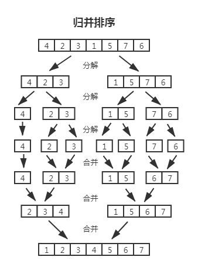

# 排序和搜索算法

## 排序算法

### 冒泡排序

&nbsp;&nbsp;&nbsp;&nbsp;冒泡排序代码细节：[bubble-sort.ts](https://gitee.com/liawnliu/datastructures_ts/blob/master/src/ts/algorithms/sorting/bubble-sort.ts)

&nbsp;&nbsp;&nbsp;&nbsp;**冒泡排序(bubble-sort)**：每轮都比较数组里相邻两项，如果左项大于右项就交换彼此，目的是每轮都让最大的移到数组末尾，所有轮结束后数组就是升序排序的了（降序是将最小移到末尾）。

&nbsp;&nbsp;&nbsp;&nbsp;值得注意的是，在每轮都将最大的冒泡到末尾后，在下一轮时是无需再处理末尾项了，所以在内部循环时要记得减去 i 。还有就是如果某轮里，没有交换过左右项，那么可以提前退出算法，因为上一轮排完凑巧就排完了。

&nbsp;&nbsp;&nbsp;&nbsp;平均、最差场景的时间复杂度是 O(n^2)，最好情况是 O(n)；空间复杂度是 O(1)，相邻项交换是常量级的临时空间。  

### 选择排序

&nbsp;&nbsp;&nbsp;&nbsp;选择排序代码细节：[selection-sort.ts](https://gitee.com/liawnliu/datastructures_ts/blob/master/src/ts/algorithms/sorting/selection-sort.ts)

&nbsp;&nbsp;&nbsp;&nbsp;**选择排序(selection-sort)**：每轮从数组里选一个比目标项小并且是最小的项（剩余项里最小的），记住它的下标，在每轮结束时交换目标项与该项的值，所有轮结束后数组就是升序的了。

&nbsp;&nbsp;&nbsp;&nbsp;值得注意的是，在每轮都找出比目标项小的项，这个项还要在剩余项里最小，所以每轮的 j 都是从 i+1 开始的，还要记住最小项的索引。

&nbsp;&nbsp;&nbsp;&nbsp;选择排序与冒泡排序的相同点：都是比较当前项和目标项的大小，并且每轮都让最大或最小项移到数组的一边。其实就是从剩余项中找出最大或最小项，然后排到数组的一端。  
&nbsp;&nbsp;&nbsp;&nbsp;选择排序与冒泡排序的不同点：冒泡排序是一直交换当前项和目标项以达到目的；选择排序是记住最大或最小项的位置，到一轮快结束时才交换以达到目的。  
&nbsp;&nbsp;&nbsp;&nbsp;两者核心思想相似，但处理手段不同，这也决定它们的最差、平均时间复杂度都是 O(n^2)，空间复杂度都是 O(1)。而选择排序的最好时间复杂度还是 O(n^2)不能提前退出，因为它减少了交换次数。  

### 插入排序

&nbsp;&nbsp;&nbsp;&nbsp;插入排序代码细节：[insertion-sort.ts](https://gitee.com/liawnliu/datastructures_ts/blob/master/src/ts/algorithms/sorting/insertion-sort.ts)

&nbsp;&nbsp;&nbsp;&nbsp;与冒泡和选择两种排序不同的是，**插入排序(insertion-sort)** 不会从剩余项中找最大或最小项放入数组一端，它是每轮从剩余项中随意取一项（默认取第一个），将它与排好序的项进行比较，然后放入适当的位置；一直到剩余项都处理完。

&nbsp;&nbsp;&nbsp;&nbsp;可以说插入排序是反其道而行，随意从剩余项中取一项然后按顺序插入已排序列表里，例如插扑克牌。最差、平均时间复杂度是 O(n^2)，最好情况是 O(n)；空间复杂度是 O(1)。  

### 希尔排序

&nbsp;&nbsp;&nbsp;&nbsp;希尔排序代码细节：[shell-sort.ts](https://gitee.com/liawnliu/datastructures_ts/blob/master/src/ts/algorithms/sorting/shell-sort.ts)

&nbsp;&nbsp;&nbsp;&nbsp;**希尔排序(shell-sort)**：先取一个增量 k（可以是数组长度的一半，也可以是更好的增量取法），对数组里所有互相隔 k 距离的元素进行插入排序；下一轮将增量折半（或者更好增量取法），重复之前的步骤，直到增量为 1（最后一个增量必须为 1）并执行完插入排序后结束整个算法。

&nbsp;&nbsp;&nbsp;&nbsp;折半式增量是最先提出来的，其最好情况下的时间复杂度为 O(n)，平均时间复杂度为 O(n^(1.3))，最坏时间复杂度是 O(n^2)。

&nbsp;&nbsp;&nbsp;&nbsp;Hibbard 在 1963 年提出的[1, 3, 7, ..., 2^n-1]这样的增量序列，特点是没有公因子。其最坏时间复杂度是 O(n^(3/2))，其平均时间复杂度被模拟出来是 O(n^(5/4))。

&nbsp;&nbsp;&nbsp;&nbsp;Sedgewick 在 1982 年提出[1, 8, 23, 77, 281, 1073, 4193, 16577...]，除了第一项的通项公式：4 \* 2^(2 \* i) + 3 \* 2^i + 1（其中 i 为 0,1,2,3,4...）；又在 1986 年提出[1, 5, 19, 41, 109, ...]（偶数项的通项公式：9 \* 2^i - 9 \* 2^(i/2) + 1，奇数项的通项公式：8 \* 2^i - 6 \* 2^((i+1)/2) + 1）。Sedgewick 提出的几种，最坏情形时间复杂度是 O(n^(4/3))，平均时间复杂度猜测在 O(n^(7/6))，要比 Hibbard 好很多

&nbsp;&nbsp;&nbsp;&nbsp;希尔排序是基于插入排序的，它没有快速排序快（如果有合适的增量序列，在小规模数组中将会比堆排序、快速排序快），但在中等规模表现良好，涉及到大规模数据将不如快速排序。有一个在大规模数据中表现优异的增量序列是（斐波那契数列除去 0 和 1 将剩余的数以黄金分割比的两倍的幂进行运算得到的数列）：(1, 9, 34, 182, 836, 4025, 19001, 90358, 428481, 2034035, 9651787, 45806244, 217378076, 1031612713,…)  

### 归并排序

&nbsp;&nbsp;&nbsp;&nbsp;归并排序代码细节：[merge-sort.ts](https://gitee.com/liawnliu/datastructures_ts/blob/master/src/ts/algorithms/sorting/merge-sort.ts)

&nbsp;&nbsp;&nbsp;&nbsp;**归并排序(merge-sort)** 跟冒泡、选择、插入三种排序方式区别很大，它运用了分而治之的思想。一直将数组分割成长度近似的两段，直到长度为 1 不可分割；再将其一一合并，归并的过程中会将左右两边的元素进行依次排序（从左右分别拿一项进行比较，排好序放入新数组，直到左右其中一个里元素被取完，而剩余的也会被连接到新数组），最后合并得到的新数组就是排好序的数组。

&nbsp;&nbsp;&nbsp;&nbsp;最差、平均、最好时间复杂度都是 O(nlogn)；空间复杂度是 O(n)，因为在每次合并的过程中都使用了一个临时数组存储。  

### 快速排序

&nbsp;&nbsp;&nbsp;&nbsp;快速排序代码细节：[quick-sort.ts](https://gitee.com/liawnliu/datastructures_ts/blob/master/src/ts/algorithms/sorting/quick-sort.ts)

&nbsp;&nbsp;&nbsp;&nbsp;**快速排序(quick-sort)**：将数组分隔成两段，分隔时会对数组进行简单排序，将较小项移到分隔点左边，对应右边是较大项。但由于左右两边里面也没顺序，那将左右两边也进行分隔处理，直到不能再分隔，这样使得每个小段都有了顺序，进而整段也是有了顺序。  
&nbsp;&nbsp;&nbsp;&nbsp;这样看来快速排序也是分而治之的一种应用，跟归并排序很像，两者区别就是：一个是分开时简单分类（大致顺序）后面直接合并， 另一个是分开时不处理后面合并时再排序。

&nbsp;&nbsp;&nbsp;&nbsp;快速排序的空间复杂度都是 O(1)，没有每轮借助临时数组；快速排序的最好、平均时间复杂度都是 O(nlogn)；最差时间复杂度是 O(n^2)，因为当数组原本是降序的，要求排成升序的，并且基准点取的是最左边时，算出的下一轮的基准点还是最左边（一般返回给下一轮的应该是中间点），这就导致它没有了左右两边数组的递归了，而是就是它本身去排序了，退化成 n^2 这样的排序了。  

### 计数排序

&nbsp;&nbsp;&nbsp;&nbsp;计数排序代码细节：[counting-sort.ts](https://gitee.com/liawnliu/datastructures_ts/blob/master/src/ts/algorithms/sorting/counting-sort.ts)

&nbsp;&nbsp;&nbsp;&nbsp;**计数排序(counting-sort)**：目标数组有 n 个元素，其中最大值为 k；先构造一个长度为 k+1 的统计数组，这个统计数组的索引对应着目标数组里的元素值；然后去统计目标数组里每个元素出现的次数，存储到统计数组对应索引上（次数分布到统计数组里）；最后遍历统计数组，将其索引当作新项加到新数组里，而“次数”是有几次就给新数组加同样的项几次。

&nbsp;&nbsp;&nbsp;&nbsp;值得注意的是，此方法很局限，它适合对小范围的非负整数的数组进行排序；当 n 不大而 k 很大时，是不适合使用计数排序的，因为会导致统计数组的长度过长。

&nbsp;&nbsp;&nbsp;&nbsp;计数排序的空间复杂度是 O(n+k)，因为它额外使用了一个 k+1 长的统计数组。平均的时间复杂度是 O(n+k)，最后由统计数组到新数组时，先遍历了 k 次，再此基础上还总共遍历了 n 次插入重复值；当 k=n 时也就是最好时间复杂度是 O(n)；当 k 远大于 n，而 n 很小，主要依赖于 k，所以最差时间复杂度是 O(k)。  

### 桶排序

&nbsp;&nbsp;&nbsp;&nbsp;桶排序代码细节：[bucket-sort.ts](https://gitee.com/liawnliu/datastructures_ts/blob/master/src/ts/algorithms/sorting/bucket-sort.ts)

&nbsp;&nbsp;&nbsp;&nbsp;**桶排序(bucket-sort)**：跟计数排序类似，只是我们准备的不是统计数组，而是桶这样的二维数组；遍历目标数组，将每个元素按照大小分配到对应的桶里（将元素分布到桶里）；所有元素遍历完后，桶之间是有顺序的但桶内部是没有顺序的，这里我们就需要对桶内部进行排序，一般选择快速排序或插入排序；每个桶都排完序后，将桶合并就会得到排好序的数组。

&nbsp;&nbsp;&nbsp;&nbsp;尽量将 n 个数据平均分配到 k 个桶中，这样每个桶就有 n/k 个数据量；尽量的增大桶的数量，极限情况下每个桶只能得到一个数据，这样就完全避开了桶内数据的排序操作。当然，做到这一点很不容易，数据量巨大的情况下，会使得桶的数量巨大，空间浪费严重。这就是一个时间代价和空间代价的权衡问题了。

&nbsp;&nbsp;&nbsp;&nbsp;对于 n 个待排数据，k 个桶，平均每个桶 n/k 个数据这样情景的平均时间复杂度为：O(n)+O(k\*(n/k)\*log(n/k))=O(n+nlog(n/k))。当 k=n 时，是最好效率的排序，也就是最好时间复杂度是 O(n)。空间复杂度是 O(n+k)  

### 基数排序

&nbsp;&nbsp;&nbsp;&nbsp;基数排序代码细节：[radix-sort.ts](https://gitee.com/liawnliu/datastructures_ts/blob/master/src/ts/algorithms/sorting/radix-sort.ts)

&nbsp;&nbsp;&nbsp;&nbsp;**基数排序(radix-sort)**：一种特殊的桶排序，主要是对整数或字符串的每一位进行排序，可以从低位开始也可以从高位开始；桶的数量（基数）就是一个数的进制数。例如数组是十进制整数的，那么桶数（基数）就是 10，分别是从 0 到 9 这样的 10 个桶；然后依次从个位、十位、百位、千位这样从低到高进行每一轮排序，结束后每位上都是相对有序的，整体上也是有序的。

&nbsp;&nbsp;&nbsp;&nbsp;如果数组里的元素是位数比较多的整数，那么就适合从高位开始排，位数比较低的就适合从低位开始排；时间空间复杂度都是 O(n\*k)，k 是元素的位数。  

### 堆排序

&nbsp;&nbsp;&nbsp;&nbsp;在前面章节已经说过了：[堆排序](/front-end/数据结构与算法/9.二叉堆和堆排序.md)

## 搜索算法

### 顺序搜索（线性搜索）

&nbsp;&nbsp;&nbsp;&nbsp;顺序搜索（线性搜索）代码细节：[sequential-search.ts](https://gitee.com/liawnliu/datastructures_ts/blob/master/src/ts/algorithms/search/sequential-search.ts)

&nbsp;&nbsp;&nbsp;&nbsp;**顺序搜索（线性搜索）**：遍历该线性数据结构，将每个元素和要找的元素一一进行对比，如果相同就立即返回结果，不同就继续查找。

### 二分搜索

&nbsp;&nbsp;&nbsp;&nbsp;二分搜索代码细节：[binary-search.ts](https://gitee.com/liawnliu/datastructures_ts/blob/master/src/ts/algorithms/search/binary-search.ts)

&nbsp;&nbsp;&nbsp;&nbsp;**二分搜索**：  
&nbsp;&nbsp;&nbsp;&nbsp;&nbsp;&nbsp;&nbsp;&nbsp;1.在待选区间里选择中间值，如果中间值就是待搜索值，就直接返回；  
&nbsp;&nbsp;&nbsp;&nbsp;&nbsp;&nbsp;&nbsp;&nbsp;2.如果待搜索值比中间值要小，就将目前区间的左区间（较小区间）作为待选区间，然后重复步骤 1；  
&nbsp;&nbsp;&nbsp;&nbsp;&nbsp;&nbsp;&nbsp;&nbsp;3.如果待搜索值比中间值要大，就将目前区间的右区间（较大区间）作为待选区间，然后重复步骤 1。

### 内插搜索

&nbsp;&nbsp;&nbsp;&nbsp;内插搜索代码细节：[interpolation-search.ts](https://gitee.com/liawnliu/datastructures_ts/blob/master/src/ts/algorithms/search/interpolation-search.ts)

&nbsp;&nbsp;&nbsp;&nbsp;**内插搜索**：改良版的二分搜索，要在步骤 1 中使用一个特殊公式去选定一个值。  
&nbsp;&nbsp;&nbsp;&nbsp;&nbsp;&nbsp;&nbsp;&nbsp;1.在待选区间里利用公式选定一个值，如果选定值就是待搜索值，就直接返回；  
&nbsp;&nbsp;&nbsp;&nbsp;&nbsp;&nbsp;&nbsp;&nbsp;2.如果待搜索值比选定值要小，就将目前区间的左区间（较小区间）作为待选区间，然后重复之前步骤；  
&nbsp;&nbsp;&nbsp;&nbsp;&nbsp;&nbsp;&nbsp;&nbsp;3.如果待搜索值比选定值要大，就将目前区间的右区间（较大区间）作为待选区间，然后重复之前步骤。

&nbsp;&nbsp;&nbsp;&nbsp;公式是这样的，先算出搜索值在“max 和 min 的差值”的“占比”，再将“max 的索引和 min 的索引的差值”乘以这个“占比”，就可以大致推断出搜索值的索引。

## 随机算法

### Fisher-Yates 随机

&nbsp;&nbsp;&nbsp;&nbsp;Fisher-Yates 随机代码细节：[fisher–yates.ts](https://gitee.com/liawnliu/datastructures_ts/blob/master/src/ts/algorithms/shuffle/fisher–yates.ts)

&nbsp;&nbsp;&nbsp;&nbsp;**Fisher-Yates 随机**：从最后一项开始并将当前位置和一个随机位置进行交换，这个随机位置要比当前位置小。
