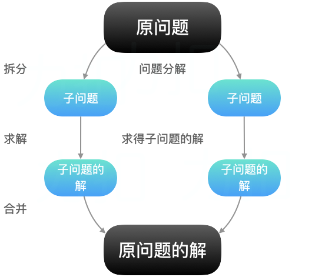

# 算法设计与技巧

## 分而治之

&nbsp;&nbsp;&nbsp;&nbsp;分而治之(divide and conquer)：将一个复杂问题分解成多个与原问题相似的子问题，这些子问题互无关联（相互独立）并且可以简单求解（不然再继续分解），原问题的解即子问题的解的合并。  

&nbsp;&nbsp;&nbsp;&nbsp;例如前面学习到的：  
&nbsp;&nbsp;&nbsp;&nbsp;[树的遍历、树节点的查找](https://gitee.com/liawnliu/datastructures_ts/blob/master/src/ts/data-structures/sorting/binary-search-tree.ts)  
&nbsp;&nbsp;&nbsp;&nbsp;[归并排序](https://gitee.com/liawnliu/datastructures_ts/blob/master/src/ts/algorithms/sorting/merge-sort.ts)  
&nbsp;&nbsp;&nbsp;&nbsp;[快速排序](https://gitee.com/liawnliu/datastructures_ts/blob/master/src/ts/algorithms/sorting/quick-sort.ts)  
&nbsp;&nbsp;&nbsp;&nbsp;[二分搜索的递归实现](https://gitee.com/liawnliu/datastructures_ts/blob/master/src/ts/algorithms/search/binary-search.ts)  
&nbsp;&nbsp;&nbsp;&nbsp;[汉诺塔](https://gitee.com/liawnliu/datastructures_ts/blob/master/src/ts/others/hanoi.ts)

## 动态规划

&nbsp;&nbsp;&nbsp;&nbsp;动态规划(dynamic programming)：跟分而治之一样，也是将复杂问题分解成相似的简单子问题，不同的是动态规划里的子问题是互相依赖的。这些子问题只解决一次并会记忆化储存（减少重复计算），在解决另外一个子问题时，可直接在记忆化表中查找它依赖的子问题的解，然后再来解决自身的问题。

&nbsp;&nbsp;&nbsp;&nbsp;例如前面学习到的：  
&nbsp;&nbsp;&nbsp;&nbsp;[斐波那契递归](https://gitee.com/liawnliu/datastructures_ts/blob/master/src/ts/others/fibonacci.ts)  
&nbsp;&nbsp;&nbsp;&nbsp;[弗洛伊德算法](https://gitee.com/liawnliu/datastructures_ts/blob/master/src/ts/algorithms/graph/floyd-warshall.ts)

### 最少硬币找零问题

&nbsp;&nbsp;&nbsp;&nbsp;最少硬币找零问题实现代码细节：[min-coin-change.ts](https://gitee.com/liawnliu/datastructures_ts/blob/master/src/ts/algorithms/dynamic-programing/min-coin-change.ts)

&nbsp;&nbsp;&nbsp;&nbsp;**硬币找零问题**：给出要找零的钱数，以及一些面额和对应限制数量，问有多少种找零方法。

&nbsp;&nbsp;&nbsp;&nbsp;**最少硬币找零问题**：在硬币找零问题基础上，问哪种找零方法所需硬币个数最少。

&nbsp;&nbsp;&nbsp;&nbsp;例如：美元的硬币面额：1, 5, 10, 25 （单位：分）。要找零 36 分，只需一个 1 分、一个 10 分、一个 25 分即可，也就是 3 个硬币就可以了。

&nbsp;&nbsp;&nbsp;&nbsp;该算法最重要的几点：  
&nbsp;&nbsp;&nbsp;&nbsp;&nbsp;&nbsp;&nbsp;&nbsp;1.目标找零金额，需要一步步分割，使用什么分割呢？那就是面额，也就是要循环这个面额数组，让当前金额减去面额，得到的是一个依赖金额，用递归去求解这个依赖金额的结果（依然是减去面额，直到能简单求解）。  
&nbsp;&nbsp;&nbsp;&nbsp;&nbsp;&nbsp;&nbsp;&nbsp;2.简单求解的程度，其实就是当前的依赖金额正好等于面额数组中的某一个。  
&nbsp;&nbsp;&nbsp;&nbsp;&nbsp;&nbsp;&nbsp;&nbsp;3.合并子问题的结果，在合并过程中，我们会逐渐得到每个子问题的结果（互相依赖的）。
&nbsp;&nbsp;&nbsp;&nbsp;&nbsp;&nbsp;&nbsp;&nbsp;4.记忆化中的每项都只计算了一次，不会覆盖。不会覆盖的原因就是之前就已经遍历了面额并且用临时变量存储了最好的情况，在遍历结束会将最好的结果存在记忆化中。

&nbsp;&nbsp;&nbsp;&nbsp;最少硬币找零问题也有贪心算法的解法，请看“贪心算法”那节。

### 背包问题

&nbsp;&nbsp;&nbsp;&nbsp;背包问题实现代码细节：[knapsack.ts](https://gitee.com/liawnliu/datastructures_ts/blob/master/src/ts/algorithms/dynamic-programing/knapsack.ts)

&nbsp;&nbsp;&nbsp;&nbsp;**背包问题**：有一个容量为 W 的背包，还有一些带有各自重量和价值的物品，这些物品可重复并且有数量限制；求出将物品装入背包的最佳方案，使得总重量不超过 W 且总价值最大。

&nbsp;&nbsp;&nbsp;&nbsp;算法与“最少硬币找零问题”一样，细微差别就是：  
&nbsp;&nbsp;&nbsp;&nbsp;&nbsp;&nbsp;&nbsp;&nbsp;1.“背包问题”是不超过那个容量就可以，也就是依赖的子问题有解无解都可以参与最优判断；但是“最少硬币找零问题”是必须找零到那个金额，所以必须要求依赖的子问题是有解再去判断当前视角是否是最优的。  
&nbsp;&nbsp;&nbsp;&nbsp;&nbsp;&nbsp;&nbsp;&nbsp;2.“背包问题”多了一个数量限制在“判断当前视角是否是最优的”时要加上这个数量限制的判断。

&nbsp;&nbsp;&nbsp;&nbsp;**0-1 背包问题**：有一个容量为 W 的背包，还有一些带有各自重量和价值的物品，这些物品不可重复放入；求出将物品装入背包的最佳方案，使得总重量不超过 W 且总价值最大。

&nbsp;&nbsp;&nbsp;&nbsp;0-1 背包的算法可以使用迭代也可以用递归，其递归写法跟普通背包问题是一样只是细微上的差别。  
&nbsp;&nbsp;&nbsp;&nbsp;而迭代的写法是用的比较多的，采用一个二维数组作为记忆化，维度是“物品”和“容量”，而这个容量是从 0 每次加 1 达到最大容量的，这点与迭代写法有差别；然后就是它有一个动态方程：  
&nbsp;&nbsp;&nbsp;&nbsp;1) j<w(i)，V(i,j)=V(i-1,j)  
&nbsp;&nbsp;&nbsp;&nbsp;2) j>=w(i)，V(i,j)=max｛ V(i-1,j)，V(i-1,j-w(i))+v(i) ｝  
&nbsp;&nbsp;&nbsp;&nbsp;（j 是当前容量，w(i)是物品 i 的重量，V 是价值）当该物品重量小于当前容量时，其价值与前 i-1 个的价值是一样的；当该物品重量大于等于当前容量时，它能放入，其剩余容量也可能放入其他物品，价值得从“前 i-1 个”和“当前物品价值加上剩余容量价值”中取最大的。

### 最长公共子序列

&nbsp;&nbsp;&nbsp;&nbsp;最长公共子序列实现代码细节：[longest-common-subsequence.ts](https://gitee.com/liawnliu/datastructures_ts/blob/master/src/ts/algorithms/dynamic-programing/longest-common-subsequence.ts)

&nbsp;&nbsp;&nbsp;&nbsp;**最长公共子序列**：在两个字符串序列中以相同顺序出现，但不要求连续（非字符串子串）的字符串序列。  
&nbsp;&nbsp;&nbsp;&nbsp;例如：'acbaed'和'abcadf'的最长公共子序列是'acad'（'acbaed'为主视角，否则就是'abad'）

&nbsp;&nbsp;&nbsp;&nbsp;其算法跟 0-1 背包问题类似，采用迭代写法，使用一个二维数组作为记忆化，维度分别是两个字符串的具体字符。也有一个动态方程：  
&nbsp;&nbsp;&nbsp;&nbsp;1) s(i)=s(j)，L(i,j)=L(i-1,j-1)+1  
&nbsp;&nbsp;&nbsp;&nbsp;2) s(i)!=s(j)，L(i,j)=max｛ L(i-1,j)，L(i,j-1) ｝  
&nbsp;&nbsp;&nbsp;&nbsp;（s(i)是第一个字符串某位置上的字符、s(j)是第二个字符串某位置上的字符，L 就是最长公共子序列的当前长度）其两个位置的字符相同时，最长公共子序列的长度要在前一个相同字符的解上加一；当不同时，要在“左侧”和“上方”中选择一个最优解。

## 贪心算法

&nbsp;&nbsp;&nbsp;&nbsp;**贪心算法**：期盼通过每个阶段的局部最优选择（当前最好的解），从而达到全局的最优。

&nbsp;&nbsp;&nbsp;&nbsp;要跟动态规划里的“最优解”区分开来，动态规划中的最优解是子问题的最优解或者是依赖问题的最优解，而贪心算法中的最优解是整个问题当前阶段的最优解，比较好的区分方法就动态规划有问题的“分解”解的“合并”的过程，而贪心算法是“分阶段”并且阶段之间没有依赖。

&nbsp;&nbsp;&nbsp;&nbsp;例如前面学习到的：  
&nbsp;&nbsp;&nbsp;&nbsp;&nbsp;&nbsp;&nbsp;&nbsp;[迪杰斯特拉(Dijkstra)算法](https://gitee.com/liawnliu/datastructures_ts/blob/master/src/ts/algorithms/graph/dijkstra.ts)  
&nbsp;&nbsp;&nbsp;&nbsp;&nbsp;&nbsp;&nbsp;&nbsp;[克鲁斯卡尔(Kruskal)算法](https://gitee.com/liawnliu/datastructures_ts/blob/master/src/ts/algorithms/graph/kruskal.ts)  
&nbsp;&nbsp;&nbsp;&nbsp;&nbsp;&nbsp;&nbsp;&nbsp;[普里姆(Prim)算法](https://gitee.com/liawnliu/datastructures_ts/blob/master/src/ts/algorithms/graph/prim.ts)

### 最少硬币找零问题（贪心算法）

&nbsp;&nbsp;&nbsp;&nbsp;最少硬币找零问题实现代码细节：[min-coin-change.ts](https://gitee.com/liawnliu/datastructures_ts/blob/master/src/ts/algorithms/greedy/min-coin-change.ts)

&nbsp;&nbsp;&nbsp;&nbsp;**最少硬币找零问题**：给出要找零的钱数，以及一些面额和对应限制数量，问哪种找零方法所需硬币个数最少。

&nbsp;&nbsp;&nbsp;&nbsp;例如：美元的硬币面额：1, 5, 10, 25 （单位：分）
&nbsp;&nbsp;&nbsp;&nbsp;要找零 36 分，先找最大的面额 25，再找剩余面额最大的 10，最后只能找 1。

### 分数背包问题

&nbsp;&nbsp;&nbsp;&nbsp;分数背包问题实现代码细节：[knapsack.ts](https://gitee.com/liawnliu/datastructures_ts/blob/master/src/ts/algorithms/greedy/knapsack.ts)

&nbsp;&nbsp;&nbsp;&nbsp;**分数背包问题**：0-1 背包只能向背包里装入完整的物品，而分数背包问题是可以装入分数的物品。

### 最长公共子序列（贪心算法）

&nbsp;&nbsp;&nbsp;&nbsp;最长公共子序列实现代码细节：[longest-common-subsequence.ts](https://gitee.com/liawnliu/datastructures_ts/blob/master/src/ts/algorithms/greedy/longest-common-subsequence.ts)

## 回溯算法

&nbsp;&nbsp;&nbsp;&nbsp;**回溯算法**：从一个可能的动作开始并试着用这个动作解决问题，如果不能解决，就回溯并选择另一个动作直到将问题解决。根据这种行为，回溯算法会尝试所有可能的动作（如果更快找到了解决办法就尝试较少的次数）来解决问题。例如：骑士巡逻问题、N 皇后问题、迷宫老鼠问题、数独解题器。

### 迷宫老鼠问题

&nbsp;&nbsp;&nbsp;&nbsp;迷宫老鼠问题实现代码细节：[rat-in-maze.ts](https://gitee.com/liawnliu/datastructures_ts/blob/master/src/ts/algorithms/backtracking/rat-in-maze.ts)

&nbsp;&nbsp;&nbsp;&nbsp;**迷宫老鼠问题**：有一个 N \* N 的矩阵，矩阵的每个位置是一个方块，每个位置可以是空闲的（值为 1）也可以是被阻挡的（值为 0），假设(0, 0)是起点，(n-1, n-1)是终点，找出起始点到终点的具体路径。

### 数独解题器

&nbsp;&nbsp;&nbsp;&nbsp;数独解题器实现代码细节：[sudoku-solver.ts](https://gitee.com/liawnliu/datastructures_ts/blob/master/src/ts/algorithms/backtracking/sudoku-solver.ts)

&nbsp;&nbsp;&nbsp;&nbsp;**数独解题器**：目标是用数值 1-9 填满一个 9\*9 的矩阵，要求每行和每列都由这九个数字构成。矩阵还包含了小方块（3\*3 矩阵），它们同样需要分别用这九个数字填满。谜题在开始给出一个已经填了一部分数字的矩阵。

&nbsp;&nbsp;&nbsp;&nbsp;数独规则：将某个数填入到矩阵的这个位置是否满足数独规则
&nbsp;&nbsp;&nbsp;&nbsp;&nbsp;&nbsp;&nbsp;&nbsp;1.这一行还没有放入这个数  
&nbsp;&nbsp;&nbsp;&nbsp;&nbsp;&nbsp;&nbsp;&nbsp;2.这一列还也没有放入这个数  
&nbsp;&nbsp;&nbsp;&nbsp;&nbsp;&nbsp;&nbsp;&nbsp;3.这个 3\*3 矩阵里也还没有放入这个数  
&nbsp;&nbsp;&nbsp;&nbsp;那么这个位置就可以放入该数。
