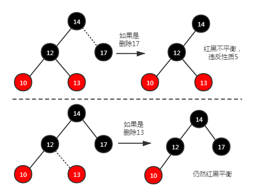
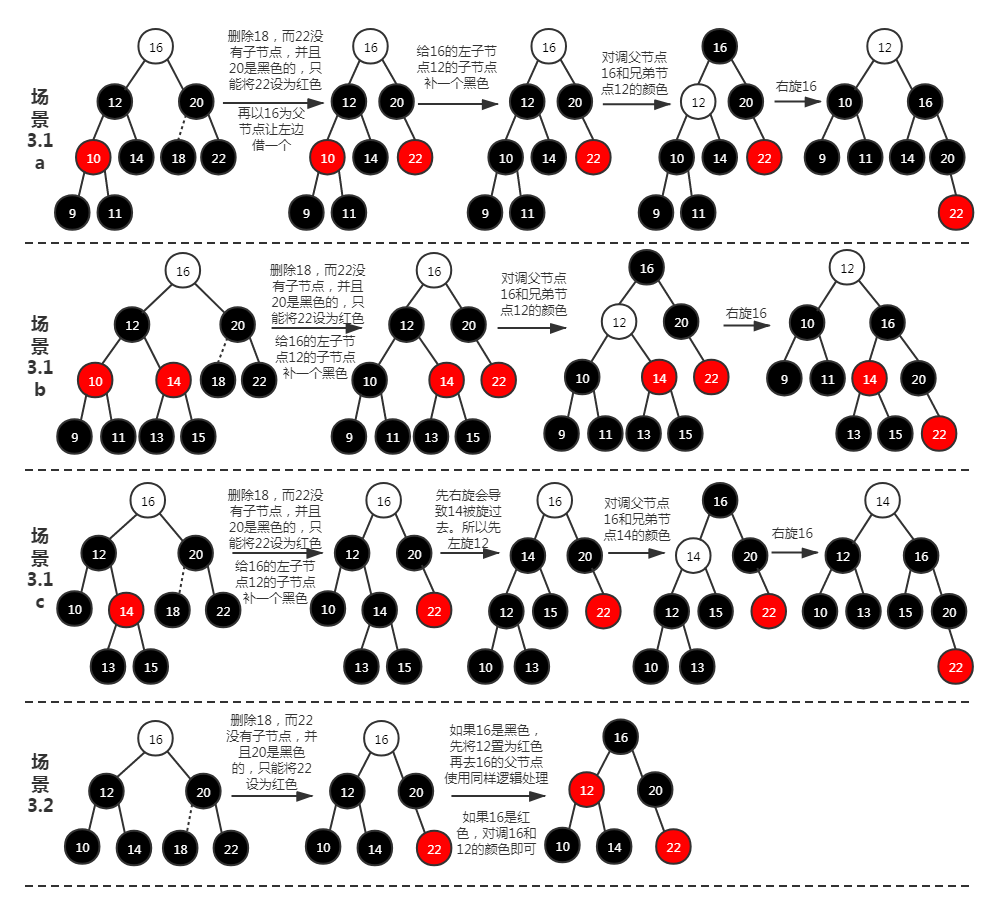

# 树

## 树数据结构

&nbsp;&nbsp;&nbsp;&nbsp;树(Tree)是一种分层数据的抽象模型。一个树结构包含一系列存在父子关系的节点，每个节点都有一个父子节点（除了树顶部的根节点）以及零个或多个子节点。

&nbsp;&nbsp;&nbsp;&nbsp;树中的每个元素都叫作节点，节点分为内部节点和外部节点。至少有一个子节点的节点称为内部节点，没有子节点的节点称为外部节点或叶节点。

&nbsp;&nbsp;&nbsp;&nbsp;一个节点的祖先包括父节点、祖父节点、曾祖父节点等。一个节点的后代包括子节点、孙子节点、曾孙节点等。

&nbsp;&nbsp;&nbsp;&nbsp;子树是树中非根节点和它的后代构成的。节点有个属性叫深度，节点的深度取决于它祖先节点的数量。树的高度取决于所有节点深度的最大值。

## 二叉树

&nbsp;&nbsp;&nbsp;&nbsp;二叉树是一种一个节点最多有两个子节点的树，这两个子节点分别叫作：左侧子节点和右侧子节点。

&nbsp;&nbsp;&nbsp;&nbsp;二叉搜索树(BST)是二叉树中的一种，它的左侧子节点存储比父节点小的值，而右侧子节点存储比父节点大的值。

&nbsp;&nbsp;&nbsp;&nbsp;平衡二叉树(AVL)是特殊的二叉搜索树，特殊之处在于树中任何一个节点的左子树和右子树高度最多相差 1。这样能避免树的某一分支出现很多层而其它分支却只有几层的现象（避免操作性能问题）。AVL 树在添加或移除节点时会尽可能尝试转换为完全二叉树。

&nbsp;&nbsp;&nbsp;&nbsp;红黑树(RBT)是平衡二叉树的一种变体，它的左右子树高差有可能大于 1（不一定要达到 AVL 式的平衡），所以它不是严格意义上的自平衡树。红黑树进行平衡的代价较低，其平均统计性能要强于 AVL。（多增删少搜索用 RBT，反之用 AVL）

## 二叉搜索树的实现

&nbsp;&nbsp;&nbsp;&nbsp;二叉搜索树的实现代码细节：[binary-search-tree.ts](https://gitee.com/liawnliu/datastructures_ts/blob/master/src/ts/data-structures/binary-search-tree.ts)

### 实现二叉搜索树的准备工作

&nbsp;&nbsp;&nbsp;&nbsp;需要准备一个助手类[Node](https://gitee.com/liawnliu/datastructures_ts/blob/master/src/ts/models/node.ts)，它有三个属性 key、right、left，分别存储的是节点的值、节点的左侧子节点引用、节点的右侧子节点引用。

&nbsp;&nbsp;&nbsp;&nbsp;给 BinarySearchTree 声明一个变量\_root，代表根节点，类型就是之前的 Node。再声明一个变量\_compareFn，用于存储比较函数。

### 二叉搜索树的插入元素

&nbsp;&nbsp;&nbsp;&nbsp;insert 向树中插入一个新的键。如果\_root 为 null，证明此树为空，那么将新元素插入\_root；否则，会与\_root 的值用\_compareFn 比较大小，比\_root 小的话再看\_root 的左侧子节点是否为空，为空就插入这个位置，不然又重复之前的逻辑比较大小...比\_root 大的话再看\_root 的右侧子节点是否为空，为空就插入这个位置，不然又重复之前的逻辑比较大小...这一样以来，完全可以用递归来实现它。

```js
/**
 * 向树中插入一个新的键
 */
public insert(key: T) {
    if (this._root == null) { // 根节点为空
        this._root = new Node<T>(key);
    } else { // 插入到非根节点处需要比较大小才能插入
        this.insertNode(this._root, key);
    }
}
/**
 * 插入一个节点的左侧还是右侧，用比较函数来比较
 */
private insertNode(node: Node<T>, key: T) {
    if (this._compareFn(key, node.key) === Compare.LESS_THAN) { // 第一个参数小于第二个参数
        if (node.left == null) {
            node.left = new Node<T>(key);
        } else {
            this.insertNode(node.left, key);
        }
    } else {
        if (node.right == null) {
            node.right = new Node<T>(key);
        } else {
            this.insertNode(node.right, key);
        }
    }
}
```

### 二叉搜索树的遍历

#### 中序遍历

&nbsp;&nbsp;&nbsp;&nbsp;中序遍历是一种上行顺序访问 BST 所有节点，也就是以“左侧子节点——父节点——右侧子节点”这样的形式遍历。

```js
/**
 * 通过中序遍历方式遍历所有节点
 */
public inOrderTraverse(callBack: Function) {
    this.inOrderTraverseNode(this._root, callBack);
}
/**
 * 中序遍历
 */
private inOrderTraverseNode(node: Node<T>, callBack: Function) {
    if (node != null) {
        this.inOrderTraverseNode(node.left, callBack);
        callBack(node); // 在父节点就调用
        this.inOrderTraverseNode(node.right, callBack);
    }
}
```

#### 先序遍历

&nbsp;&nbsp;&nbsp;&nbsp;先序遍历是先访问该节点再访问其后代节点的顺序来遍历 BST 所有节点，也就是以“父节点——左侧子节点——右侧子节点”这样的形式遍历。

```js
/**
 * 通过先序遍历方式遍历所有节点
 */
public preOrderTraverse(callBack: Function) {
    this.preOrderTraverseNode(this._root, callBack);
}
/**
 * 先序遍历
 */
private preOrderTraverseNode(node: Node<T>, callBack: Function) {
    if (node != null) {
        callBack(node); // 在左节点之前就调用
        this.preOrderTraverseNode(node.left, callBack);
        this.preOrderTraverseNode(node.right, callBack);
    }
}
```

#### 后序遍历

&nbsp;&nbsp;&nbsp;&nbsp;后序遍历是先访问后代节点再访问该节点的顺序来遍历 BST 所有节点，也就是以“左侧子节点——右侧子节点——父节点”这样的形式遍历。

```js
/**
 * 通过后序遍历方式遍历所有节点
 */
public postOrderTraverse(callBack: Function) {
    this.postOrderTraverseNode(this._root, callBack);
}
/**
 * 后序遍历
 */
private postOrderTraverseNode(node: Node<T>, callBack: Function) {
    if (node != null) {
        this.postOrderTraverseNode(node.left, callBack);
        this.postOrderTraverseNode(node.right, callBack);
        callBack(node); // 在右节点之后就调用
    }
}
```

### 二叉搜索树的最大值和最小值

#### 最大值

&nbsp;&nbsp;&nbsp;&nbsp;二叉搜索树的最大值就是树的最右侧的叶节点。其实就是从\_root 开始向右搜索，找到他们最右侧的子节点。

```js
/**
 * 二叉搜索树的最大值
 */
public max(): Node<T> {
    return this.maxNode(this._root);
}
/**
 * 一直往右搜索找最大值
 */
private maxNode(node: Node<T>): Node<T> {
    let current: Node<T> = node;
    while (current != null && current.right != null) {
        current = current.right;
    }
    return current;
}
```

#### 最小值

&nbsp;&nbsp;&nbsp;&nbsp;二叉搜索树的最小值就是树的最左侧的叶节点。其实就是从\_root 开始向左搜索，找到他们最左侧的子节点。

```js
/**
 * 二叉搜索树的最小值
 */
public min(): Node<T> {
    return this.minNode(this._root);
}
/**
 *  一直往左搜索找最小值
 */
private minNode(node: Node<T>): Node<T> {
    let current: Node<T> = node;
    while (current != null && current.left != null) {
        current = current.left;
    }
    return current;
}
```

### 二叉搜索树的查找元素

&nbsp;&nbsp;&nbsp;&nbsp;search，在树中查找一个键。如果节点存在，则返回 true，否则返回 false。从\_root 开始，使用\_compareFn 来比较大小，相等就返回 true；比\_root 小的话，从左边搜索，比\_root 大的话，从右边搜索。又可以使用递归来解决这个问题。

```js
/**
 * 在树中查找一个键。如果节点存在，则返回true，否则返回false
 */
public search(key: T): boolean {
    return this.searchNode(this._root, key);
}
/**
 * 判断当前节点是否与key相等，如果key小于node.key就向左边迭代查找，大于就向右边查找，相等就返回
 */
private searchNode(node: Node<T>, key: T): boolean {
    if (node == null) {
        return false;
    }
    if (this._compareFn(key, node.key) === Compare.LESS_THAN) { // key比这个node的key小就往左边走
        this.searchNode(node.left, key);
    } else if (this._compareFn(key, node.key) === Compare.BIGGER_THAN) { // key比这个node的key大就往右边走
        this.searchNode(node.right, key);
    }
    return true; // 直到相同就会返回true
}
```

### 二叉搜索树的移除元素

&nbsp;&nbsp;&nbsp;&nbsp;二叉搜索树中最复杂的方法 remove，因为我们删除树中的某个节点时，可能还存留有它的子节点和子树，我们要考虑用哪个节点来替代它的位置。  
&nbsp;&nbsp;&nbsp;&nbsp;当这个节点没有节点或者单纯只有一个子节点时，很好操作，没有子节点就不用管谁来替代它，只有一个子节点时就用这个子节点（包括子树）来替代它。  
&nbsp;&nbsp;&nbsp;&nbsp;当它同时拥有左侧子节点和右侧子节点时，我们需要找出它右侧子树中最小的节点替代它（也就是值最接近它的节点来替代它）。但问题来了，这个替代的节点可能还有子树，所以我们不能单纯的移过去，需要从这个替代节点的父节点开始往下遍历删除这个替代的节点（也就是再调一次删除方法，来删除这个替代的节点）。
&nbsp;&nbsp;&nbsp;&nbsp;还有一点需要考虑，删除的这个节点，它的父节点里指向子节点的引用（指针）需要更新，因为你用新元素替代了它的子节点而引用还没更新。实现这点的方式就是，每次在替代完后都需要放回这个新节点，在迭代之前就用父节点里对应的引用来接收这个返回。

```js
/**
 * 从移除二叉搜索树中的删除一项
 */
public remove(key: T) {
    this._root = this.removeNode(this._root, key); // 更新根节点
}
/**
 * 删除的这项，要考虑它的子节点
 * 如果它的左侧和右侧子节点同时存在就要考虑用谁来替代它原来的位置
 * 目前按照常理，找它后方最接近它的项来替代它的位置，并把“被用来替代的项”也要用removeNode删除
 */
private removeNode(node: Node<T>, key: T): Node<T> {
    if (node == null) {
        return null;
    }
    if (this._compareFn(key, node.key) === Compare.LESS_THAN) { // key比这个node的key小就往左边走
        node.left = this.removeNode(node.left, key); // 左侧子节点可能会变化，更新左侧子节点的引用（指针）
        return node; // 更新父节点的引用（指针）
    } else if (this._compareFn(key, node.key) === Compare.BIGGER_THAN) { // key比这个node的key大就往右边走
        node.right = this.removeNode(node.right, key); // 右侧子节点可能会变化，更新右侧子节点的引用（指针）
        return node; // 更新父节点的引用（指针）
    } else { // 相等
        // 没有左右侧子节点，直接删除
        if (node.right == null && node.left == null) {
            node = null;
            return node; // 更新父节点的引用（指针）
        }
        if (node.right == null) { // 没有右侧子节点，而有左侧子节点，那么将左侧子节点替代它
            node = node.left;
            return node; // 更新父节点的引用（指针）
        } else if (node.left == null) { // 没有左侧子节点，而有右侧子节点，那么将右侧子节点替代它
            node = node.right;
            return node; // 更新父节点的引用（指针）
        }
        /*
            * 最特殊的情况，它有左侧子节点也有右侧子节点，删除它的话要选择合适的值替代它
            * 删除一个值一般都是从后面寻找最接近它的项，在二叉搜索树中最接近节点的项就是它右侧节点中最小的那个
            * 替代时，那个“被用来替代的项”也要删除，相当于用removeNode来迭代删除“被用来替代的项”
            */
        const aux: Node<T> = this.minNode(node.right);
        node.key = aux.key; // 先替换这个值，下一步去删除引用
        node.right = this.removeNode(node.right, aux.key); // 从右侧子节点开始删除那个“被用来替代的项”，并更新
        return node; // 更新父节点的引用（指针）
    }
}
```

## 平衡二叉树的实现

&nbsp;&nbsp;&nbsp;&nbsp;平衡二叉树的实现代码细节：[avl-tree.ts](https://gitee.com/liawnliu/datastructures_ts/blob/master/src/ts/data-structures/avl-tree.ts)

### 节点的高度和平衡因子

&nbsp;&nbsp;&nbsp;&nbsp;节点的高度其实是该节点所形成的子树的高度（而子树的高度是子树上所有节点的深度最大值），一定要与节点的深度区分开来。节点的深度是向上遍历，看有多少层祖先，而节点的高度是向下遍历，看有多少层后代。

&nbsp;&nbsp;&nbsp;&nbsp;平衡因子是某个节点的左侧子树的高度（左侧子节点的高度）和右侧子树（右侧子节点的高度）的差值，在 AVL 中平衡因子只能是-1, 0, 1 超过这些值的话需要旋转平衡。（最快的判断方法就是谁的左右两侧的层数超过了 1）

```js
/**
 * 计算节点所在树的高度（从上往下计算）
 */
private getNodeHeight(node: Node<T>): number {
    if (node == null) {
        return -1;
    }
    return Math.max(this.getNodeHeight(node.left), this.getNodeHeight(node.right)) + 1;
}
/**
 * 计算某个节点的平衡因子
 */
private getBalanceFactor(node: Node<T>) {
    // 左侧子树高度减去右侧子树高度
    const heightDifference = this.getNodeHeight(node.left) - this.getNodeHeight(node.right);
    switch (heightDifference) {
        case -1:
            return BalanceFactor.SLIGHTLY_UNBALANCED_RIGHT; // 平衡因子为1，右侧略微不平衡多1层
        case 1:
            return BalanceFactor.SLIGHTLY_UNBALANCED_LEFT; // 平衡因子为1，左侧略微不平衡多1层
        case -2:
            return BalanceFactor.UNBALANCED_RIGHT; // 平衡因子为-2，代表节点的右侧比左侧多2层
        case 2:
            return BalanceFactor.UNBALANCED_LEFT; // 平衡因子为2，代表节点的左侧比右侧多2层
        default:
            return BalanceFactor.BALANCED; // 左右完全平衡
    }
}
```

### 平衡二叉树的平衡操作

&nbsp;&nbsp;&nbsp;&nbsp;向 AVL 树添加或移除节点后，需要计算出节点平衡因子，然后根据平衡因子来确定是否需要进行平衡操作。

&nbsp;&nbsp;&nbsp;&nbsp;新节点插入后，导致某个节点不平衡（平衡因子的绝对值达到了 2），会形成了四种情况：  
&nbsp;&nbsp;&nbsp;&nbsp;&nbsp;&nbsp;&nbsp;&nbsp;1.左-左(LL)：这个新节点是那个不平衡节点的左子树的左子树的叶节点。需要将不平衡节点进行右旋转就可以达到平衡。  
&nbsp;&nbsp;&nbsp;&nbsp;&nbsp;&nbsp;&nbsp;&nbsp;2.右-右(RR)：这个新节点是那个不平衡节点的右子树的右子树的叶节点。需要将不平衡节点进行左旋转就可以达到平衡。  
&nbsp;&nbsp;&nbsp;&nbsp;&nbsp;&nbsp;&nbsp;&nbsp;3.右-左(RL)：这个新节点是那个不平衡节点的右子树的左子树的叶节点。需要将不平衡节点的右节点进行右旋转然后将不平衡节点进行左旋转就可以达到平衡。  
&nbsp;&nbsp;&nbsp;&nbsp;&nbsp;&nbsp;&nbsp;&nbsp;4.左-右(LR)：这个新节点是那个不平衡节点的左子树的右子树的叶节点。需要将不平衡节点的左节点进行左旋转然后将不平衡节点进行右旋转就可以达到平衡。

```js
/**
 * 左-左形式：需要右旋转
 * 将2插到5的左侧子节点，20那个节点将会不平衡，需要将20那
 * 个节点进行右旋转。15那个节点会挡住20那个节点，那么就需
 * 要先将15那个节点放到20那个节点的左侧子节点上，最后将20
 * 这个节点放到10这个节点的右侧子节点上，这样就完成了右旋
 * 转。
 * --------------------------------------------------
 *        20               10
 *       /  \             /  \
 *      10   25          5    20
 *     / \       ——>    /     / \
 *    5   15           2     15  25
 *   ^
 *  2
 * --------------------------------------------------
 */
private rotationLL(node: Node<T>): Node<T> {
    // 临时保存不平衡节点的左侧子树
    const temp = node.left;
    // node准备右旋转，而temp的right上有多余的节点
    // 这个多余的节点可以移到node的left上
    node.left = temp.right;
    // 完成旋转也就是node会旋转到temp的right上
    temp.right = node;
    return temp;
}
/**
 * 右-右形式：需要左旋转
 * 将28插到25的右侧子节点，10那个节点将会不平衡，需要将10
 * 那个节点进行左旋转。15那个节点会挡住10那个节点，那么就
 * 需要先将15那个节点放到10那个节点的右侧子节点上，最后将
 * 10这个节点放到20这个节点的左侧子节点上，这样就完成了左
 * 旋转。
 * --------------------------------------------------
 *    10                    20
 *   /  \                  /  \
 *  5   20                10   25
 *      / \       ——>    /  \    \
 *     15  25           5   15    28
 *          ^
 *           28
 * --------------------------------------------------
 */
private rotationRR(node: Node<T>): Node<T> {
    // 临时保存右侧子树（node.right）
    const temp = node.right;
    // node准备左旋转，而temp的left上有多余的节点
    // 这个多余的节点可以移到node的right上
    node.right = temp.left;
    // 完成旋转也就是node会旋转到temp的left上
    temp.left = node;
    return temp;
}
/**
 * 左-右形式：先需要左旋转最后需要右旋转
 * 将18插到15的右侧子节点，20那个节点将会不平衡，需要将10
 * 那个节点进行左旋转，最后对20那个节点进行右旋转。
 * --------------------------------------------------
 *      20               20              15
 *     /  \             /  \            /  \
 *    10   25          15   25         10   20
 *   / \       ——>    /  \      ——>   /    /  \
 *  5   15           10  18          5    18   25
 *       ^          /
 *        18       5
 * --------------------------------------------------
 */
private rotationLR(node: Node<T>): Node<T> {
    // 对不平衡节点的左侧子节点进行左旋转
    node.left = this.rotationRR(node.left);
    // 对不平衡节点进行右旋转
    return this.rotationLL(node);
}
/**
 * 右-左形式：先需要右旋转最后需要左旋转
 * 将13插到15的左侧子节点，10那个节点将会不平衡，需要将20
 * 那个节点进行右旋转，最后对10那个节点进行左旋转。
 * --------------------------------------------------
 *   10               10                  15
 *  /  \             /  \                /  \
 * 5   20           5   15              10   20
 *     / \     ——>      / \     ——>    /  \    \
 *    15  25           13  20         5   13   25
 *    ^                     \
 *   13                      25
 * --------------------------------------------------
 */
private rotationRL(node: Node<T>): Node<T> {
    // 对不平衡节点的右侧子节点进行右旋转
    node.right = this.rotationLL(node.right);
    // 对不平衡节点进行左旋转
    return this.rotationRR(node);
}
```

&nbsp;&nbsp;&nbsp;&nbsp;可以思考一下，左-右形式的能不能先右旋转再左旋转？右-左形式的能不能先左旋转再右旋转？

```js
/**
 * 左-右形式：先特殊右旋转最后正常左旋转
 * --------------------------------------------------
 *      20            10                 15
 *     /  \          /  \               /  \
 *    10   25       5   15             10   20
 *   / \       ——>     /  \    ——>    /    /  \
 *  5   15            13  20         5    18   25
 *      ^                   \
 *     13                   25
 * --------------------------------------------------
 */
private specialRotationLR(node: Node<T>): Node<T> {
    // 进行特殊右旋转
    node = this.specialRotationLL(node);
    // 进行正常左旋转
    return this.rotationRR(node);
}
private specialRotationRL(node: Node<T>): Node<T> {
    // 进行特殊左旋转
    node = this.specialRotationRR(node);
    // 进行正常右旋转
    return this.rotationLL(node);
}
/**
 * 使用temp.left.left的原因就是，新添的叶节点就在这一层
 * 而且左-右或右-左能保证temp.left不为空，而左-左或右-右
 * 就不能保证temp.left不为空，所以左-左和右-右还是使用的
 * 正常的旋转
 */
private specialRotationRR(node: Node<T>): Node<T> {
    const temp = node.right;
    node.right = temp.left.left;
    temp.left.left = node;
    return temp;
}
private specialRotationLL(node: Node<T>): Node<T> {
    const temp = node.left;
    node.left = temp.right.right;
    temp.right.right = node;
    return temp;
}
```

&nbsp;&nbsp;&nbsp;&nbsp;左-右形式的能先右旋转再左旋转；右-左形式的能先左旋转再右旋转。但是没必要，因为这四种情景上有时还得使用正常的旋转，不然它可能会有不平衡的子树。

### 自平衡树的插入节点

&nbsp;&nbsp;&nbsp;&nbsp;依然采用递归方法，去找寻适合的位置去插入，插入后新元素刚好在最底端，利用递归+return 形式可以反过来检测元素是否平衡，不平衡再进行平衡操作。

```js
/**
 * 向树中插入一个新的键
 */
public insert(key: T) {
    this._root = this.insertNode(this._root, key);
}
/**
 * 插入一个节点的左侧还是右侧，用比较函数来比较
 * 插入后还需要反过来对node进行平衡检查
 */
protected insertNode(node: Node<T>, key: T) {
    if (node == null) {
        return new Node<T>(key); // 直接return，新键也不需要对这个键作平衡操作
    }
    if (this._compareFn(key, node.key) === Compare.LESS_THAN) { // key小于node.key
        node.left = this.insertNode(node.left, key); // 插左边
    } else if (this._compareFn(key, node.key) === Compare.BIGGER_THAN) { // key大于node.key
        node.right = this.insertNode(node.right, key); // 插右边
    } else { // 键重复，无需插入
        return node; // 直接return，键重复也不需要对这个键作平衡操作
    }
    const balanceFactor = this.getBalanceFactor(node); // node的平衡因子
    if (balanceFactor === BalanceFactor.UNBALANCED_LEFT) { // node不平衡并且属于左边高
        if (this._compareFn(key, node.left.key) === Compare.LESS_THAN) { // 新键在node的左子树的左子树上
            node = this.rotationLL(node);
        } else { // 新键在node的左子树的右子树上
            node = this.rotationLR(node);
        }
    } else if (balanceFactor === BalanceFactor.UNBALANCED_RIGHT) { // node不平衡并且属于右边高
        if (this._compareFn(key, node.right.key) === Compare.BIGGER_THAN) { // 新键在node的右子树的右子树上
            node = this.rotationRR(node);
        } else {
            node = this.rotationRL(node);
        }
    }
    return node; // 迭代结合return，反过来对每次的node进行平衡检查
}
```

### 自平衡树的移除节点

&nbsp;&nbsp;&nbsp;&nbsp;在父类的删除基础上添加平衡操作的逻辑。其实跟添加的逻辑也很类似，区别比较大的是在判断是单旋双旋上，新增可以拿新增元素和 node 的子节点比较，而删除需要判断 node 的子节点平衡因子来作判断。

```js
/**
 * 删除元素，重写父类的同名方法，会用到父类的逻辑再新增平衡操作的逻辑
 * 特殊之处：子类super调用父类同名方法，并且父类的那个方法递归调用自身。
 * 调用顺序就是子类removeNode方法——>父类removeNode方法——>递归调用子类
 * removeNode方法——>父类removeNode方法——>递归调用子类的removeNode方法，
 * 循环调用至边界条件。
 */
protected removeNode(node: Node<T>, key: T) {
    node = super.removeNode(node, key);
    if (node == null) {
        return node; // 空的null不需要平衡
    }
    const balanceFactor = this.getBalanceFactor(node);
    if (balanceFactor === BalanceFactor.UNBALANCED_LEFT) { // 左子树不平衡
        // 左子树的左节点的平衡因子，如果这个平衡因子是0或者1，代表左子树是左-左型
        const balanceFactorLeft = this.getBalanceFactor(node.left);
        if (balanceFactorLeft === BalanceFactor.BALANCED ||
            balanceFactorLeft === BalanceFactor.SLIGHTLY_UNBALANCED_LEFT) {
            node = this.rotationLL(node);
        } else if (balanceFactorLeft === BalanceFactor.SLIGHTLY_UNBALANCED_RIGHT) {
            node = this.rotationLR(node);
        }
    } else if (balanceFactor === BalanceFactor.UNBALANCED_RIGHT) { // 右子树不平衡
        // 右子树的右节点的平衡因子，如果这个平衡因子是0或者1，代表右子树是右-右型
        const balanceFactorRight = this.getBalanceFactor(node.right);
        if (balanceFactorRight === BalanceFactor.BALANCED ||
            balanceFactorRight === BalanceFactor.SLIGHTLY_UNBALANCED_RIGHT) {
            node = this.rotationRR(node);
        } else if (balanceFactorRight === BalanceFactor.SLIGHTLY_UNBALANCED_LEFT) {
            node = this.rotationRL(node);
        }
    }
    return node;
}
```

**非常推荐去看一下 AVL 树的测试代码[avl-tree.spec.ts](https://gitee.com/liawnliu/datastructures_ts/blob/master/test/ts/data-structures/avl-tree.spec.ts)，就算不运行它，也可以看一下里面的注释，包含 AVL 插入删除元素的实际例子推算！**

## 红黑树的实现

&nbsp;&nbsp;&nbsp;&nbsp;红黑树的实现代码细节：[red-black-tree.ts](https://gitee.com/liawnliu/datastructures_ts/blob/master/src/ts/data-structures/red-black-tree.ts)

&nbsp;&nbsp;&nbsp;&nbsp;首先我们要明确红黑树的性质：  
&nbsp;&nbsp;&nbsp;&nbsp;&nbsp;&nbsp;&nbsp;&nbsp;**1.每个节点非黑即红**  
&nbsp;&nbsp;&nbsp;&nbsp;&nbsp;&nbsp;&nbsp;&nbsp;**2.根节点是黑色的**  
&nbsp;&nbsp;&nbsp;&nbsp;&nbsp;&nbsp;&nbsp;&nbsp;**3.空的叶节点都是黑色的**  
&nbsp;&nbsp;&nbsp;&nbsp;&nbsp;&nbsp;&nbsp;&nbsp;**4.如果一个节点是红色的，那么它的父节点和子节点就只能是黑色的，也就是不能有连续的红色节点。**  
&nbsp;&nbsp;&nbsp;&nbsp;&nbsp;&nbsp;&nbsp;&nbsp;**5.任意节点到它后代的叶节点的所有路径上，拥有相同数量的黑色节点。**

&nbsp;&nbsp;&nbsp;&nbsp;&nbsp;&nbsp;&nbsp;&nbsp;对第 3 点解释一下，例如某个值为 9 的节点没有左子节点，其实 9 这个节点的左子节点就是个空节点也就是 null（有些语言用 nil 描述的）；那么这个空节点相对于树来说就是空的叶节点。

### 红黑树的插入节点

&nbsp;&nbsp;&nbsp;&nbsp;首先先规定新插入的元素是 **红色** ，插入时可分为以下几个场景：  
**场景 1：红黑树是空树，新元素放到 root 上，其颜色置为黑色。**  
**场景 2：插入的元素已经存在于红黑树了，不用插入该元素。**  
**场景 3：新插入元素的父节点是黑色的，那么直接插入，无需进行红黑平衡。** 违反性质 5 吗？没有，因为新插入的红色节点根本就不影响路径上黑色的数量。例如下图：新添元素 9  
  
**场景 4：新插入元素的父节点是红色，违反性质 4，需要进行红黑平衡。**

> **场景 4.1：叔节点不存在。** 先明确一下，新元素是红色，父节点是红色，那么祖父节点就是黑色，相应的这棵子树对外暴露的是黑色。例如下图：新添元素 4，并且没有叔节点  
>   
> &nbsp;&nbsp;&nbsp;&nbsp;&nbsp;方法一：采用对换颜色的方法，将父节点和祖父节点的颜色对调，那新子树对外暴露的是红色节点，这样可能会违反性质 4，如果继续对换新的父节点和新的祖父节点的颜色，又违反性质 5。例如下图：6 和 8 颜色对换，但是 8 和 10 是连续的红色，违反性质 4；10 和 12 继续对换，又潍坊性质 5.  
>   
> &nbsp;&nbsp;&nbsp;&nbsp;&nbsp;**方法二：** 其实叔节点为空就类似 AVL 不平衡场景，那么需要根据对应的情景进行对应的旋转，还要保证旋转前后的顶点颜色要不变（对调父节点和祖父节点的颜色）。这样得到的子树对外暴露的依然是黑色节点，不违反性质 4 和性质 5。例如下面 4 个图：分别是左-左、左-右、右-右、右-左  
> 
> 
> 
>   
> **场景 4.2：叔节点存在并且为红色。** 按照以往的经验，直接去旋转再变换颜色。例如下图：最终不管是变色还是 10 和 12 都置为黑色，都无法同时满足性质 4 和性质 5  
>   
> **所以直接将叔节点这一代与祖父节点对调颜色**  
>   
> **场景 4.3：叔节点存在并且为黑色。** 这个情况比较特殊，它在进行一次平衡后要进行第二次平衡时才可能出现。而解决这种场景的方法，单纯要调换颜色不行还需要旋转才可以，例如下图：  
>   
> 不要认为就一种，其实跟 4.1 场景的第二种方法一样有四种也就是左-左、左-右、右-右、右-左情形。

纵观这几个场景，其实可以整合一下。  
&nbsp;&nbsp;&nbsp;&nbsp;**叔节点存在并且为红色**，直接对调父节点这一代和祖父节点的颜色。这课子树是平衡了，但祖父节点相对于其他子树可能还不平衡，需要将视角调到祖父节点上，然后继续检查是否平衡。  
&nbsp;&nbsp;&nbsp;&nbsp;**叔节点不存在或者叔节点存在并且为黑色**，这两种场景的处理逻辑是一样的，先对调颜色，再进行旋转。这课子树是平衡了，并且相对于其他子树也是平衡的，不需要再继续检查平衡了。

&nbsp;&nbsp;&nbsp;&nbsp;文字和图可能还不懂，需要阅读实现代码[red-black-tree.ts](https://gitee.com/liawnliu/datastructures_ts/blob/master/src/ts/data-structures/red-black-tree.ts)的 insert 方法，并且配上测试代码[red-black-tree.spec.ts](https://gitee.com/liawnliu/datastructures_ts/blob/master/test/ts/data-structures/red-black-tree.spec.ts)一起阅读最好。

### 红黑树的移除节点

&nbsp;&nbsp;&nbsp;&nbsp;先不忙讨论黑红树的移除，先回顾一下 **二叉树的移除** 。二叉树的移除最后归结为三种情形：  
&nbsp;&nbsp;&nbsp;&nbsp;**情形 1：** 待删除节点下没有子节点，那么删除它以后，没有节点可以补上它的位置。  
&nbsp;&nbsp;&nbsp;&nbsp;**情形 2：** 待删除节点下只有一个子节点，那么删除它以后，那个子节点会补上它的位置。  
&nbsp;&nbsp;&nbsp;&nbsp;**情形 3：** 待删除节点下同时拥有左右子节点，那么删除它以后，会从右子树中找最小值节点补上它的位置，并会从右子树中删除那个最小值节点，这又会是新一轮删除（**递归**），但它有边界条件，它最终还是会落到前两种情形里。

---

&nbsp;&nbsp;&nbsp;&nbsp;红黑树既然是继承自二叉树，那么它移除节点时也是上述三种情形，只是我们需要结合 **红黑树的性质** 来讨论。

> &nbsp;&nbsp;&nbsp;&nbsp;**情形 1：** 待删除节点下没有子节点，那么删除它以后，没有节点可以补上它的位置。
>
> > &nbsp;&nbsp;&nbsp;&nbsp;**待删除节点可以是黑色也可以是红色。**  
> > &nbsp;&nbsp;&nbsp;&nbsp;**如果是红色，删除时不会导致红黑树失衡；如果是黑色，删除时会导致红黑树失衡。**  
> > 如下图：17、13 被删除  
> > 
>
> &nbsp;&nbsp;&nbsp;&nbsp;**情形 2：** 待删除节点下只有一个子节点，那么删除它以后，那个子节点会补上它的位置。
>
> > &nbsp;&nbsp;&nbsp;&nbsp;由于只有一个子节点，根据红黑树性质 5，**这个子节点必然是红色的**；又结合性质 4，**待删除节点必然是黑色的，并且那个红色子节点也必然没有后代。**  
> > &nbsp;&nbsp;&nbsp;&nbsp;**删除时，红色子节点会补到被删除位置，颜色不变只替换数值，也不会影响平衡。最后再删除那个红色节点，相当于回到了情形 1。**  
> > 如图：17 被删除  
> > 
>
> &nbsp;&nbsp;&nbsp;&nbsp;**情形 3：** 待删除节点下同时拥有左右子节点，那么删除它以后，会从右子树中找最小值节点补上它的位置（**颜色不变只替换数值**），并会从右子树中删除那个最小值节点，这又会是新一轮删除（**递归**），但它有边界条件，**它最终还是会落到前两种情形里。**  
> 如下图：删除 17，18 会补上来，最后一轮删除其实就是情形 1  
> 

&nbsp;&nbsp;&nbsp;&nbsp;初步结论：红黑树的情形 3 和情形 2 最终都会变成情形 1，所以只需要研究情形 1 即可。而情形 1 中只需要对“**待删除节点是黑色**”这种情况进行讨论，要怎样处理才能让它恢复红黑平衡。

---

&nbsp;&nbsp;&nbsp;&nbsp;我们需要对兄弟节点颜色进行分情况讨论，如下图：  


> **大致思路：**  
> &nbsp;&nbsp;&nbsp;&nbsp;节点删除后，兄弟节点这边会 **多一层黑色**，正常情况下，我们会先将兄弟节点这边的子节点这一层的 **红色节点变为黑色节点**，那么就 **多出两层黑色的**；那么再 **将多出的其中一层黑色通过旋转借给删除节点那边**，一般就会达到平衡了（**新旧顶点颜色要一致**）。  
> &nbsp;&nbsp;&nbsp;&nbsp;但是 **如果借过去的是一层红色（兄弟节点是红色）怎么办**？不能再用“多出两层黑色”这种办法了，红色的借过去的同时其实兄弟节点的子节点也被借过去了，并且也是比删除节点那边多一层黑色，其实又回到这个问题了！**用递归，直到借过去的是黑色就可以平衡了。**
>
> **看图理解：**  
>   
>   
>   
> **归纳总结：**
>
> > **场景 1：红黑树是空树或者找不到要删除的元素，那就无需删除**。  
> > **场景 2：删除的节点是根节点或者是红色节点，那就直接删除它，无需作红黑平衡**。  
> > **场景 3：删除的节点是黑色节点，需要作红黑平衡**。  
> > &nbsp;&nbsp;&nbsp;&nbsp;**场景 3.1：其兄弟节点为黑色，并且兄弟节点有至少一个红色子节点**。将其中一个红色子节点变为黑色，对调兄弟节点和父节点的颜色，再旋转黑色借给“轻”的那一边。  
> > &nbsp;&nbsp;&nbsp;&nbsp;**场景 3.2：其兄弟节点为黑色，并且兄弟节点下没有子节点或者有两个黑色子节点**。如果父节点为红色，直接对调兄弟节点和父节点的颜色。如果父节点为黑色，将兄弟节点变为红色，再以父节点为视角，重复“场景 3”的处理。  
> > &nbsp;&nbsp;&nbsp;&nbsp;**场景 3.3：其兄弟节点为红色**。先旋转，再以新的子树作为视角，重复“场景 3”的处理。

---

&nbsp;&nbsp;&nbsp;&nbsp;文字和图可能还不懂，需要阅读实现代码[red-black-tree.ts](https://gitee.com/liawnliu/datastructures_ts/blob/master/src/ts/data-structures/red-black-tree.ts)的 remove 方法，并且配上测试代码[red-black-tree.spec.ts](https://gitee.com/liawnliu/datastructures_ts/blob/master/test/ts/data-structures/red-black-tree.spec.ts)一起阅读最好。

---
