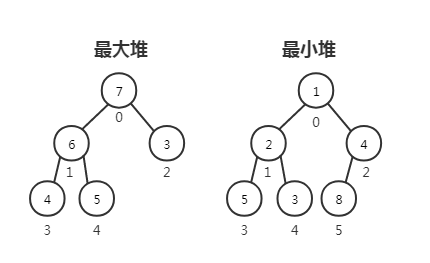
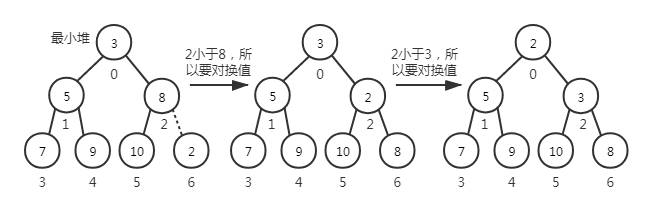
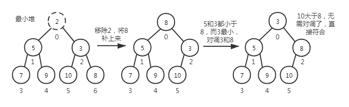
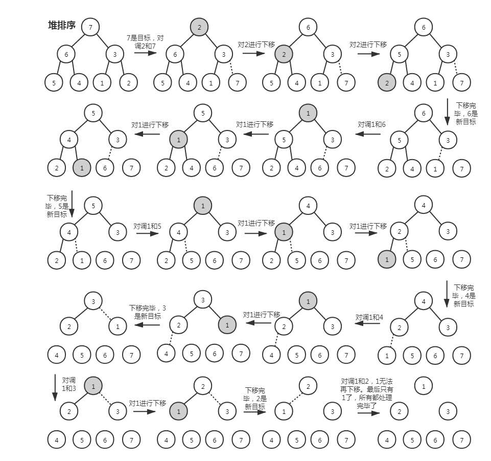

# 二叉堆和堆排序

## 二叉堆数据结构

&nbsp;&nbsp;&nbsp;&nbsp;堆(heap)也就叫二叉堆，是一种完全二叉树。树的每一层（除了最后一层）都有左右子节点，最后一层的叶节点尽可能都是左节点；它要么是最小堆要么是最大堆，最小堆的意思是父节点小于等于左右子节点，最大堆的意思是父节点大于等于左右子节点。  
&nbsp;&nbsp;&nbsp;&nbsp;二叉堆可以快速找出最大值或最小值，所以常被用于优先队列，也用于堆排序算法。二叉堆同层的大小是不明确的，取决于同层元素插入的先后顺序。  

## 二叉堆实现

&nbsp;&nbsp;&nbsp;&nbsp;二叉堆实现代码细节：[heap.ts](https://gitee.com/liawnliu/datastructures_ts/blob/master/src/ts/data-structures/heap.ts)

&nbsp;&nbsp;&nbsp;&nbsp;1.声明一个受保护的变量 heap 用于存储元素，类型是数组；再声明一个受保护的变量 compareFn 用于存储比较函数。如果在初始化时，传进来的比较函数是升序，代表这将是一个最小堆，反之比较函数是降序，代表这将是一个最大堆。还有，使用的数组实现的，使用链表比较耗内存。

&nbsp;&nbsp;&nbsp;&nbsp;2.当前节点与父节点、左右子节点在数组中的关系。左节点：index \* 2 + 1；右节点：index \* 2 + 2；父节点：Math.floor((index - 1) / 2)。

&nbsp;&nbsp;&nbsp;&nbsp;3.insert 方法，先放在数组最后面，再对它进行上移处理，即与它的父节点比较大小，符合 compareFn 要求的不会处理，否则就要将父节点与当前节点的值对换。  

&nbsp;&nbsp;&nbsp;&nbsp;3.extract 方法，移除二叉堆的根节点，也就是最大堆的最大值，最小堆的最小值。用数组末尾的值补上根节点的值，然后进行下移处理，重新梳理二叉树。  

## 堆排序

&nbsp;&nbsp;&nbsp;&nbsp;堆排序实现代码细节：[heap.ts](https://gitee.com/liawnliu/datastructures_ts/blob/master/src/ts/data-structures/heap.ts)和[heap.ts](https://gitee.com/liawnliu/datastructures_ts/blob/master/src/ts/algorithms/sorting/heap-sort.ts)

&nbsp;&nbsp;&nbsp;&nbsp;1.有一个未经排序的数组，将它构造成一个二叉堆形式的数组。  
&nbsp;&nbsp;&nbsp;&nbsp;2.将二叉堆的根节点与“末尾”对调，将新的根节点的值进行下移操作，一直对这个值进行下移，直到这个值最终会落到合适的位置；再将二叉堆新的根节点与“末尾减一”对调，重复之前的操作......直到根节点与“末尾减 N”重合，最后得出的数组就是一个堆排序后的新数组。  
&nbsp;&nbsp;&nbsp;&nbsp;最简单的理解其实就是一直调用 extract，直到数组为空，真正去实现的时候有细微差别。  

