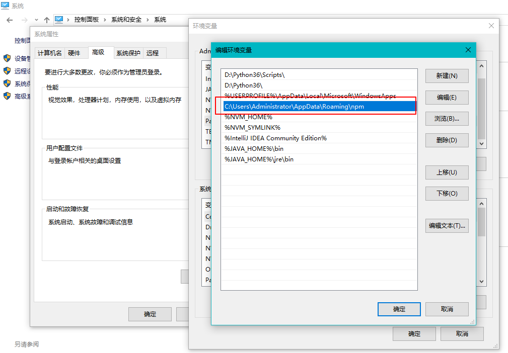
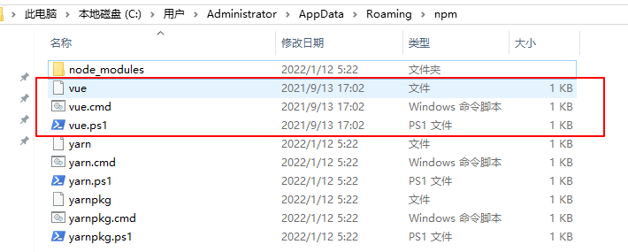
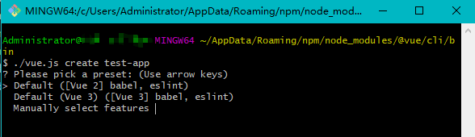

# 脚手架框架搭建和架构设计

## 脚手架开发入门

### 脚手架简介

脚手架本质是一个“操作系统”的客户端，它通过命令行执行，例如

```txt
vue create vue-test-app
```

上面这条命令由 3 个部分组成：

- 主命令：vue
- command：create
- command 的 param：vue-test-app

它表示创建一个 vue 项目，项目的名称为`vue-test-app`，以上是一个较为简单的脚手架命令，但实际场景往往更加复杂，比如：

当前目录已经有文件了，我们需要覆盖当前目录下的文件，强制进行安装`vue`项目，此时我们就可以输入：

```txt
vue create vue-test-app --force
```

这里的`--force`叫做`option`，用来辅助脚手架确认在特定场景下用户的选择（可以理解为配置）。还有一种场景：

通过`vue create`创建项目时，会自动执行`npm install`帮用户安装依赖，如果我们希望使用淘宝源来安装，可以输入命令：

```txt
vue create vue-test-app --force -r http://registry.npm.taobao.org
```

这里的`-r`也叫做`option`，它与`--force`不同的是它使用`-`，并且使用简写，这里的`-r`也可以替换成`--registry`。其实可以输入以下命令来查看`vue create`支持的所有`options`

```txt
vue create --help
```

`-r http://registry.npm.taobao.org`后面的路径是`option`的`param`，其实`--force`可以理解为`--force true`，简写为`--force`或`-f`。

### 脚手架的执行原理

那么输入完`vue create vue-test-app`，终端是如何处理的呢？



终端会通过**npm 环境变量**（如上图）来找到`vue`这个主命令。我们可以在终端中输入`which vue`来找到这个`vue`指令存储在哪。输入输出如下：

```bash
$ which vue
/c/Users/Administrator/AppData/Roaming/npm/vue
```

根据这个`/c/Users/Administrator/AppData/Roaming/npm/vue`输出（也有可能是`/d/nodejs/vue`），我们可以打开我们电脑本地这个目录，目录内容如下。



有三个同名`vue`文件，是操作系统里的**可执行脚本**，表示可以用`minTTY`(Git Bash)、`winpty`(cmd)、`PowerShell`分别打开这三个文件，它们似乎都在用`node`来**运行**同目录下的`node_modules/@vue/cli/bin/vue.js`。

题外话，如果用到的是 yarn 安装的 v-cli，那么它的目录是`C:\Users\liawn\AppData\Local\Yarn\Data\global\node_modules`，至于命令则是在`C:\Users\liawn\AppData\Local\Yarn\Data\global\node_modules\.bin`。

这里的`node_modules`是全局依赖包安装的地方，你可以回想一下当时安装`v-cli`脚手架的命令是不是`npm install -g @vue/cli`。我们继续找到并打开`node_modules/@vue/cli/bin/vue.js`，会发现里面有我们非常熟悉的`create`、`serve`、`build`等命令（方法），以下是抽取了部分代码块。

```js
#!/usr/bin/env node
const { chalk, semver } = require("@vue/cli-shared-utils");
const requiredVersion = require("../package.json").engines.node;
const leven = require("leven");
function checkNodeVersion(wanted, id) {
  if (!semver.satisfies(process.version, wanted, { includePrerelease: true })) {
    // 省略...
    process.exit(1);
  }
}
checkNodeVersion(requiredVersion, "@vue/cli");
const EOL_NODE_MAJORS = ["8.x", "9.x", "11.x", "13.x"];
for (const major of EOL_NODE_MAJORS) {
  if (semver.satisfies(process.version, major)) {
    // 省略...
  }
}
const fs = require("fs");
const path = require("path");
const slash = require("slash");
const minimist = require("minimist");
if (
  slash(process.cwd()).indexOf("/packages/test") > 0 &&
  (fs.existsSync(path.resolve(process.cwd(), "../@vue")) || fs.existsSync(path.resolve(process.cwd(), "../../@vue")))
) {
  process.env.VUE_CLI_DEBUG = true;
}
const program = require("commander");
const loadCommand = require("../lib/util/loadCommand");
program.version(`@vue/cli ${require("../package").version}`).usage("<command> [options]");

program
  .command("create <app-name>")
  .option("-r, --registry <url>", "Use specified npm registry when installing dependencies (only for npm)")
  .option("-f, --force", "Overwrite target directory if it exists")
  .action((name, cmd) => {
    const options = cleanArgs(cmd);
    if (minimist(process.argv.slice(3))._.length > 1) {
      console.log(
        chalk.yellow(
          "\n Info: You provided more than one argument. The first one will be used as the app's name, the rest are ignored."
        )
      );
    }
    if (process.argv.includes("-g") || process.argv.includes("--git")) {
      options.forceGit = true;
    }
    require("../lib/create")(name, options);
  });
program
  .command("serve [entry]")
  .option("-o, --open", "Open browser")
  .action((entry, cmd) => {
    loadCommand("serve", "@vue/cli-service-global").serve(entry, cleanArgs(cmd));
  });
program
  .command("build [entry]")
  .option("-t, --target <target>", "Build target (app | lib | wc | wc-async, default: app)")
  .action((entry, cmd) => {
    loadCommand("build", "@vue/cli-service-global").build(entry, cleanArgs(cmd));
  });

// 省略...
```

在总结“脚手架执行原理”之前先说一个细节，`bin/vue.js`的最顶部有一行`#!/usr/bin/env node`代码，它的作用是什么呢？`#!/usr/bin/env node`可以帮助`bin/vue.js`找到**系统变量**里的 node.exe，那么就可以直接用`./vue.js create test-app`来创建一个 vue 项目。



这是因为在 Linux 等系统下用`ln -s vue bin/vue.js`类似的命令给`bin/vue.js`生成了一个**软链接**，将这个软链接放到了**npm 环境变量**中，供其他人直接使用`vue`指令，而 Windows 系统下的软链接其实是“**快捷方式**”，但是你也看到上面的三个`vue`指令并不是快捷方式而是系统可执行文件。也就是说在**不同的系统**里，在**不同的终端**里，**最终**都是要去执行`node_modules/@vue/cli/bin/vue.js`。

**脚手架执行原理**总的来说就是：

- `v-cli`脚手架在**npm 环境变量**对应的目录下存放了**软链接**或者**可执行脚本**，那么就可以在操作系统各处都可以运行`vue`指令了。
- `vue`指令的功能是运行 npm 全局依赖包`v-cli`里的`bin/vue.js`，具体是通过调用本地的**node**执行 js 的。
- 最后根据`vue command param`里携带的`command`和`param`来运行`bin/vue.js`里对应的程序块。

### 脚手架开发流程及难点

开发流程：

- 创建 npm 项目
- 创建脚手架入口文件，最上方添加：`#!/usr/bin/env node`
- 配置 package.json，添加 bin 属性
- 编写脚手架代码
- 将脚手架发布到 npm

开发难点：

- 分包：将复杂的系统拆分成若干个模块
- 命令注册：例

  ```txt
  vue create
  vue add
  vue invoke
  ```

- 参数解析：`vue command [options] <params>`

  - options 全称：`--version`、`--help`
  - options 简写：`-V`、`-h`
  - 带 params 的 options：`--path /Users/caimengxin/Desktop/vue-test`
  - 帮助文档：

    - global help
      - Usage
      - Options
      - Commands
    - 示例，vue 的帮助信息：

      ```txt
      Usage: vue <command> [options]

      Options:
      -V, --version                              output the version number
      -h, --help                                 output usage information

      Commands:
      create [options] <app-name>                create a new project powered by vue-cli-service
      add [options] <plugin> [pluginOptions]     install a plugin and invoke its generator in an already created project
      // ...省略
      ```

- 命令行交互
- 日志打印
- 命令行文字变色
- 网络通信：HTTP、WebSocket
- 文件处理

### 开发一个脚手架 demo
