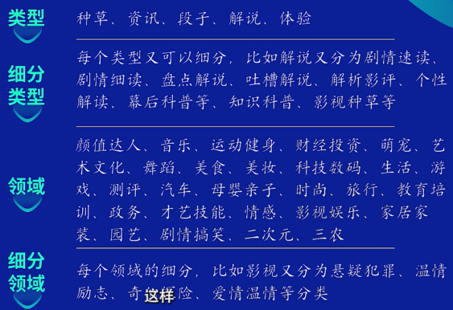
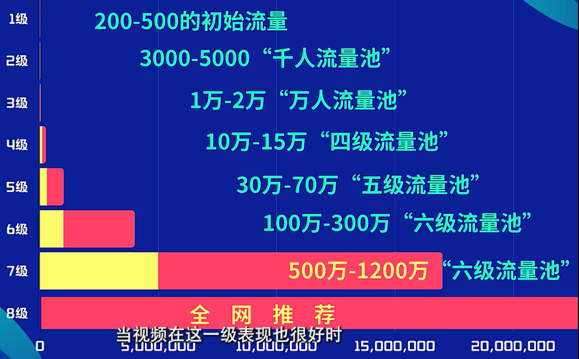
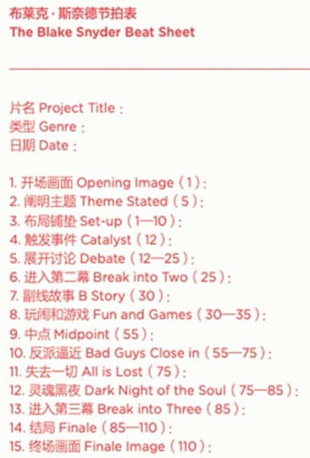
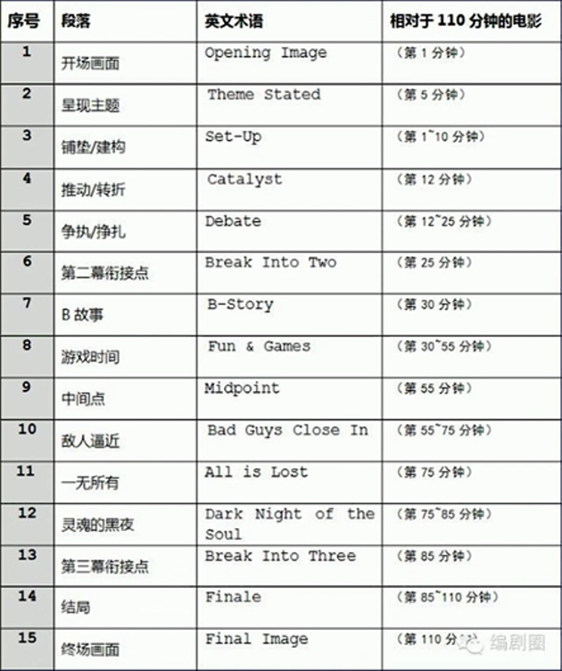

# 提升认知

## 时代红利：“红海”是个伪命题

2016 年抖音上线。2017 年以来，抖音以迅雷不及掩耳之势迅速火遍海内外，近几年更是打破 BAT 的重重封锁，于狭缝中义军突起，依靠内容、电商等快速成长为巨型商业帝国。当前短视频、中视频仍处于红利爆发期，未来在 5G、全息投影等新兴科技加持下，抖音依靠其“比用户更懂用户”的算法，产品样式必然更加丰富，甚至可以说充满无限可能，站在风口上猪都会飞起来。

随着平台的不断发展，创作者变现方式也愈加丰富：1.流量变现（抖音/西瓜中视频任务、其他各个平台的流量补贴等）；2.广告变现（比如影视推广、音乐推广、品牌推广等）；3.视频种草（比如 T 恤、挂历等影视周边产品）。具体形式上有西瓜 pick 任务、抖音小程序、抖音大厅任务、星图等，不少创作者已经实现了年入百万的目标。

有人说抖音创作者已经有了几亿了，还有机会吗？有，而且到处都是！阿炳团队始终认为，“红海”一直是个伪命题，如果我们做了功课，比如连续刷抖音、查询数据分析网站，就知道抖音的赛道无非就是各种类型与领域，或者说细分类型与细分领域的拼贴，见下表。

这样，可供创作的赛道就可以演化出很多种。在红海中存在蓝海，在蓝海中也存在红海。如何找到自己在抖音上的赛道，成为冲向风口的第一道题。这里面资金成本最低，做起来最不受时间地点限制，发挥空间巨大的类目，在我看来就是**影视解说**了。

## 了解平台：想做爆款，先搞清算法

先来思考第一个问题：抖音是个什么样的平台？

第一，抖音是一个**算法平台**，抖音拥有几亿用户和创作者，每分钟都有上千个视频被上传到抖音上，用户不可能观看完每一个抖音视频，所以抖音建立了一个复杂的算法，让用户从海量的内容当中看到他最喜欢的视频。简单来说，这个算法会从抖音所有的视频当中，挑选出用户最有可能喜欢的那一个。

那么，算法是如何知道每个人的喜好呢？利用数据，抖音会分析视频的画面、文案、标题，以及其他用户与这个视频的交互历史，比如点赞、评论和观看时长，从而给视频贴上内容标签并打上评分。除此以外，还会参考这个用户历史上看过的视频，以及交互历史，比如点赞、评论和转等，还有这个用户的搜索历史，相似用户喜爱视频等，从而给用户贴上一个需求标签。

那么，如何让算法推荐我们制作的视频呢？答案就是让用户喜欢我们的视频，也就是让视频内容标签和用户需求标签重合，因为这也是算法的目标。具体的推荐上就涉及到抖音的“**8 级流量池**”概念，如果你的视频表现好，它就会被逐级往下推荐，一般一个短视频会先给 200 到 500 的初始流量。如果你的视频在这级流量池里面表现良好，你的完播率、点赞率、评论率、转发率、搜索率等数据综合起来不错，视频就会被向下一级也就是千人流量池进行推荐，一般是 3000 到 5000。当视频在这级流量池表现也很好时，就会推送到万人流量池，一般是一万到两万，以此类推，见下表。

那么，如何让自己的视频进入高级流量池呢？

1. 创作高质量的作品，让观众持续喜欢你的内容，比如吸引更多的点赞、评论、分享，以获得更多的观看
2. 养成良好的发布习惯，持续稳定的发布作品，并给视频加上精准的文字描述，包括屏幕上一切可见的文字，有助于推荐算法更加全面的了解你的潜在观众，维系和粉丝的关系
3. 形成自己独特的创作风格，让自己的作品更有粉丝粘性
4. 通过阅读评论等方式来了解用户的馈，持续改进自己的内容。

这其中，第 2、3、4 点都是建立在第 1 点的基础之上。于是，如何创作优秀的视频成为重中之重。从战略思维上来讲，抖音作为一个泛娱乐平台，基本目标自然是占用用户的时间。一条作品的价值，首先就在于用户愿意花多长时间，也就是作品的完播率。从战役思维上来讲，一条作品要有好的互动，比如观看、点赞、评论、转发、搜索，也必须建立在播放时长的基础之上。那么问题来了，影响完播率的核心秘密到底是什么呢？

## 制定对策：算法背后其实是用户心理

算法背后其实是**用户心理**。影响视频完播率的到底是什么呢？又回到平台的用户思维和算法思维上，你做产品就应该考虑消费群体。抖音的用户包罗社会大众，幼童、青年、中年、老年，农民、工人、学生等各行各业、形形色色。你做产品，就应该考虑消费场景，有人起床就在刷抖音，有人坐地铁时刷，有人上班时摸鱼刷，有人睡前刷。不同时间、空间，用户的心理、心情、期待都是不同的，你的视频越具有**普适性**，就越能被更多的人喜欢，你做产品就应该考虑**消费心理**。

简单来讲，吸引力的核心就是**建立期待**，建立好奇、从众、感动、高兴、愤怒等等期待，这个后面还会有专题课专门讲解。做产品就应该考虑消费动作，让我们换位思考一下，用户刷到了你的视频，基于配音、文案、画面、标题、bgm，在 3 秒内迅速作出判断。划走或者是决定看下去，划走或看完，划走或看多遍，划走或下载，划走或点赞，划走或广域分享，划走或定点分享，划走或评论，划走或关注，划走或再创作，以及划走或跟商业直接相关的动作：比如看商品详情、点击商品链接、下载 APP。

为什么强调很多关于是否划走的判断，因为在抖音，划走的成本太低了，只需要轻轻动一下手指，根本没有任何顾虑。好了，思路清晰了，想要获得高完播率，首先就是要在开头的**黄金 3 秒**把人拿住，因为在抖音用户刷到你的作品是基于算法，他们对于作为创作者的你是陌生的、不信任的，想要占用用户的时间，必须用优质内容说话。

优质内容除了拿人的开头，还有**跌宕起伏的、紧凑不拖踏的中间**，以及**引发情绪的高潮**。搞清楚这个问题，我们不仅能做好影视、综艺、人物的解说，甚至可以在其他各类赛道上自由奔跑。那么如何设计开头、讲好中间、布置高潮，我们在后续的专题课中会有专门讲解，毕竟对于影视解说来讲，如何讲好故事在绝大多数情况下是核心中的核心。

## 剖析对手：让对手成为我们的磨刀石

让对手成为我们的磨刀石。站在巨人的肩膀上看世界，能让我们少走不少弯路。摸清了平台的基本算法后，那就来看看头部账号是怎么处理的。只有透过现象看清竞品的本质，才能真正找到必胜因素。

先来看“**毒蛇电影**”，贡献出有深度、有态度、有温度的个性解说，题材偏情感、励志、现实。“**布衣探案**”，风格随性自然，题材偏悬疑智商。“**婧公子**”，娓娓道来，直击女性关切话题。“**槽槽说电影**”，rap、段子，才艺纷呈，题材偏温情、奇幻。产品形式上，他们都做三联屏或六联屏，把每一部电影一拆三，每一段都是**悬疑开头**，悬念或高潮结尾，每一段都是一个**独立的故事**。

分析到这还不够，通过进一步刷，不停的刷，逐次分析他们的文案结构、配音风格、画面剪辑、甚至背景音乐，我们发现他们的产品内核是什么呢？没错，就是产品背后的用户思维，无时无刻、无孔不入的用户思维，也就是为用户需求至上。从故事的开头就开始讲用户最关心的点，一直牵着用户走，在响应用户期待和否定用户期待之间**来回穿插**。

除了头部影视解说账号，腰部账号的很多爆款思路也可以借鉴，除了腰部影视解说账号，还有其他赛道的产品也可以参考，比如他们是怎么开头的，养成刷的习惯，养成学习的习惯，只有这样才能立于不败之地

## 选准题目：关心“用户的关心”

关心“用户的关心”。打造个人 IP 是个长期工作，持续满足用户的需求、持续出爆款、始终以优质内容陪伴用户，才能被用户记住。可有人说，用户需求谁能说得清，毕竟不同职业的人关注点不同，同年龄的人关注点不同，不同性别的人关注点也不同。同一个人在不同年龄、不同环境关注点也不同，甚至还有临时关注和持久关注的区别。但有一点应当成为共识，理解门槛越低、越贴合大众生活、越现实的选题，关注度就越高，关注群体就越广，就越能满足用户需求，也就越能出爆款。

它山之石可以攻玉，我们在上节课说到，让对手成为我们的磨刀石，如果你经常刷抖音就会发现安全、医疗、教育、住房、财经等视频，点评论、转发、搜索率极高，说明这些方面备受抖音用户关注，那么我们选篇自然也可以向这些方面靠拢，并不是说其他类型的影视就做不爆，而是这些题材天然占有一些用户关心的优势。

## 避免踩坑：怎样带着镣铐跳舞

怎样带着镣铐跳舞？避免踩坑就是哪些题材不能碰、哪些话不能讲、哪些画面不能有，碰了就吃亏，轻了就是无法过审，或者过审后限流，重了可能会被举报甚至吃官司。因为抖音是一个公域流量平台，成年人能看到的内容，未成年人拿过手机就可以看了，所以抖音对作品审核比较严格，一切不利于未成年人成长的、不符合主流价值观的内容，都有被平台抵制的风险，需要特别注意的是，不管作品的整体价值导向如何，具体到每一个画面、每一个词、每一个声音，只要违反社区规定，平台就会限流。

[抖音-规则中心](https://www.douyin.com/rule/main)

对所有创作者来说都是公平的，如何带着料靠跳舞，这个就比较考验大家的语言艺术了，具体来说就是 8 个字：**虚实结合，详略得当**。比如有一些话讲了可能会违反公约，那么我们可以到网上去查询一下，这种话怎么用暗语去讲，讲了既能保证大众能懂，同时呢又避免踩坑。

## 教你看片：看电影，就是看套路

看电影就是看套路，这个套路不是指电影的分类，比如悬疑、惊悚、动作、爱情、喜剧，而是指剧情的套路。掌握了这个套路，看电影时才能胸有成竹，而不是被电影全程牵着走，甚至看不懂情节铺排、剧情走向了。电影出现仅 100 来年，但故事的出现却比较久远了。

先横向来看故事类型，法国喜剧家乔治普罗蒂研究了 1200 余部古今戏曲作品，列出了 36 种剧情模式，他自信的认为，古如今所有的戏剧剧情都不会超出这 36 种模式。亚里士多德曾将戏剧分为简单悲剧、简单喜剧、复杂悲剧、复杂喜剧四种基本类型。此后，歌德根据题材将剧情分为爱情、复仇等 7 种类型。奥特曼基将剧情和类型概括为 25 种模式。

### 电影剧情的 10 种类型

电影作为讲故事的一种形式，已经被归纳出各种类型体系。比如美国编剧导师布莱克斯奈德，就在他的畅销书《救猫咪：电影编剧指南》中指出，**电影剧情分为 10 种类型**。

1. **第一个**类型叫“**屋子里的怪兽**”，要素有空间、力量、原罪，这个片子的矛盾冲突核心，不是要被怪兽吃掉。这个片子有一个规律，就是通常有一个很贪婪的人或者是很骄傲的人，犯了某种错误，创造了某种生物，如果创造怪物的这个人还是非常执迷不悟的话，怪兽就一定会吃掉他。而其他无辜的人或者是虽然创造怪兽，可最后改过自新，就能在得到教训后逃过一劫。这种类型的影片会发生在一个相对封闭的环境中，比如说一个岛或者是一个房间，或者是太空，片子里的人很难逃出这个地方。《大白鲨》、《异形》、《侏罗纪公园》就是这种类型影片的典型代表，编剧在设计影片的时候会非常小心的设计哪个人物要死掉，因为有的人物如果你把它设计死掉了，观众就会很不高兴。在侏罗纪公园里小孩子都存活了，因为他们特别无辜。里面创造侏罗纪公园的老科学家最后也活下来了，因为他到最后的时候悔改了，所以编剧让他活下来了。
2. **第二个**类型叫“**寻找圣物**”，要素有寻宝、路径、团队、奖励，这个类型包含的主题就是要找到某个宝藏，这个宝藏可能是有型的，也可能是无形的，重点是寻找的过程。这个类型的规律是主角会在旅程的一开始，认为他要找到某个东西，可能是宝藏或者是其他的，可是到了影片结束时实际上他找到了自己，过程中的成长会比找到最初那个东西更重要，所以在这种类型影片里面，可能最后会找到宝藏，可是那个时候实际上他会觉得宝藏对他来说已经不那么重要，已经没有什么意义了，因为他发现了别的更重要的价值。《绿野仙踪》、《加勒比海盗》就是这种类型的影片。
3. **第三个**类型叫“**瓶子里的精灵**”，要素有愿望、诅咒、教训，这个类型里必须有一种特殊的物质或能力，也可以是一种愿望。比如说我想成为世界上最聪明的人，通常这个类型的影片在一开始这个愿望就会被实现，然而我们的主角的生活却因为这种愿望的实现而变得非常的糟糕，所以有的时候愿望也是一种诅咒。我们的主角许了一个愿并且实现了，如果生活从此就变得非常美好，那这部影片就没什么意思了，而如果变坏的话大家就非常喜欢。影片的主角许了一个愿，得到这个东西以后，生活改变了，这个改变并没有让他快乐，所以在片子的最后他会发现，其实自己原本的生活才是最美好的。电影《变相怪杰》就是希望有某种能力，结果真的得到了，然而这个面具开始不稳定，后来影响了他的生活。《大话王》这个片子，讲的正是愿望变成了诅咒。
4. **第四个**类型叫“**有困扰的人**”，要素有无辜、天降、生死，这种片子的核心是说“为什么某件事会发生在我身上”，这种类型的影片可能是剧情片
   也可能是喜剧片。一个非常普通的人，发现自己在一个非常不寻常的环境里面，因为在力量上面，这个普通人是敌不过他的对手或者是环境的，所以，他必须有一些他自己很独特的才能，或者是智力来克服这个问题。这种类型在美国特别多，比如说外星人来了，全世界只有一个人可以拯救大家，这是因为他们个人的独特性比较彰显，也就是影片里面有一个普通人会成为拯救大家的英雄。这类影片还有《虎胆龙威》、《未来战士》、《美丽人生》，包括周星驰的很多电影等。
5. **第五个**类型叫“**成人礼**”，要素有问题、过激、回归，这是有关成长的影片，也就是你成人以后会是什么样子。他可以做字面上的理解，就是一个小孩他长大了，另外还可以理解成这个主角本来就是成人，可是他经历过某些事情后，这些事情让他承认自己必须要在某些方面更成熟。这种影片一定要让观众一开始就发现这个角色有不足，所以当他遇到一个事情或者一个转变的时候，他必须要成长，他在这个成长过程当中，才会真正的了解自己的不足。这种类型的片子很容易和其他片子混合到一起，比如说《大话王》里面共同的教训就是他自己的一个成长，最经典的例子就是《星球大战》、《狮子王》、《功夫》等。
6. **第六个**类型叫“**爱情故事**”，要素有残缺主角、互为零件、隔阂，这个片子的主题就是爱情，“我爱你”的概念不会那么明显的在影片当中显现。
   如果这个影片的男女主人翁一开始就陷入爱河的话，就没有那么信任了，所以一般来说这种影片一开始是互相讨厌，可是影片结束时他们互相喜欢，而且这种类型里也包括了兄弟情，也就是没有性，讲述有爱的电影。《玩具总动员》也属于这种类型，两个玩具在争夺主人的爱，相当于男女之间的三角恋爱。需要注意的是，一般情况下两个主角都是有一点点残缺的，心理上或者是身体上的，然后两个主角在一起呢，就会显得特别的融洽、互相帮助、互为零件，但是两个人如果要实在要在一起的话，中间也会有一个巨大的隔阂，这个隔阂可以是跨越生死的隔阂，可以是贫富差距的隔阂，让观众为他们产生揪心。大家可以回想一下《我的野蛮女友》，这个剧情，它是不是比较符合，女主角的残缺点在哪里，男主角的残缺点又在哪里，他们俩为什么又一定要结合在一起，他们结合在一起又面临哪些阻碍。
7. **第七个**类型叫“**谜团**”，要素有秘密、探秘者、自我牺牲，这种类型的主题就是，到底发生了什么事情，为什么是这样。里面的角色从一开始的动机，就是去探寻为什么会发生了这个事件。在这种类型的片子里面，主要角色通常不会有太多改变，他的任务是去发掘这个事情的真相，但是到了片尾，大家就会发现一些人性的东西，甚至可能要牺牲主角的某一方面。《唐人街探案》就是这类型电影中很经典的例子，整个影片采用了更有意思的表达方法，即整个片子是倒着拍的，为了追寻一个真相。
8. **第八个**类型叫“**一个非常聪明的傻子**”，要素有愚者、伟业、变化，就是影片里面的主要人物很愚蠢，但是又很聪明。这个故事是有关那些我们
   认为并不聪明的角色，面对一个非常强大的敌人，然而是最终得到了胜利。也就是说他其实是用很聪明的方式来赢得这种胜利的，就好像我们说的大智若愚一样，在各种文化里面都会有这种人。这个类型里面很经典的例子就是《阿甘正传》和《食神》。
9. **第九个**类型叫“**一个人对抗一个机构一个组织**”，要素有群体、选择、抗争、牺牲，这种片子的主题是“我”来对抗整个世界，这种影片通常讲述的是一个人和一个组织之间的对抗，他从一个人的角度来陈述，这个组织里面有好的东西也有不好的东西。所以这类影片里面表达的是，在这个圈子里人失去了自由或者是独立性。这种影片在美国也是很受欢迎的，因为美国人如果在公司里面丧失了一些自由的话，他会感觉到非常的辛苦，所以会有这样一系列的电影。经典的影片例子就是《飞跃疯人院》和《教父》，这种类型的片子都是个体和群体之间的抗争，这种类型影片还有些变化，比如说一个个体想要脱离组织，想要对抗组织，比如说《克隆人》这部电影。但还有一种是，一个个体被组织赶出来了，但是他想回去，比如说《虫虫特工队》。
10. **第十个**类型叫“**超级英雄**”，要素有能力、命门、对手、使命，这跟前面一个类型相反，主角是一个有特殊能力的人，可是却在一个很普通的环境里面，因为有了超级的能力，所以在这个环境里是非常不寻常的。由于他跟别人不一样，他就会有一种痛苦，别人对他的嫉妒也会成为这个片子里面的主要冲突。这类电影里会有很多冒险的情节，只有一个超级英雄的话就很无聊，所以通常会有一个记恨超级英雄的一个人物出来跟他对抗。比如说《超人特工队》、《科学怪人》、《蜘蛛侠》，这种影片里面要是有爱情的话，就会有一个人成为人质，用来威胁超级英雄。

### 电影的 15 点节拍

从故事结构的纵向上看，布莱克的“救猫咪”系列最出名的莫过于书中的剧本“**节拍表**”了，先大概看一下，等下会结合实力细致讲解。

是不是简洁纯粹、简单易懂？括号里的数字代表各个节拍所在的页码，需要提出的是，好莱坞要求**一页剧本约等于电影的一分钟**，出色的剧本结构一定脱离不开这个节拍表。不信你可以拿优秀的经典电影套进这个结构里试试看，你会发现他们都是严格按照这个方式来创作的。对于新手编剧来说，这些都是可以快速上手的实用技巧，是一套可以直接套用的**流程模板**。

同样，这些原理也可以用在小说创作上，甚至帮助短视频博主们**创作视频脚本**。讲故事的原理是不会变的，千变万化的只是形式，了解这些编剧观影套路后，我们再看电影也会有新的观点和视角。对于烂片，通过梗盖，就能判断出故事类型和大体情节，有效避雷，拯救钱包。对于好作品，可以看得更透彻、更有条理，大大提升安利他人的成功率。

接下来让我们小试牛刀，一张节拍表看懂《我不是药神》的剧作，关于《我不是药神》的美誉已经太多了，在此不再赘述，今天就单纯从一张节拍表来分析一下这部影片的剧作。《我不是药神》的导演文牧野，在接受媒体采访时曾说“这个电影很难，题材受环境影响很容易变成文艺电影，实际上它有很多商业电影元素”。就看你怎么切入，怎么着手，你是按照故事写人物，还是按照人物写故事，这是两个方向。怎么改变一个人的负面力量，让他变成英雄，也是比较难的。本片摄影执导王博学谈起关于如何为这部电影确定影像风格时说：“这个电影在文牧野导演开始弄剧本的时候就做了一个很大胆的方向上的调整，就是要拍一个商业的现实主义题材电影，剧本开始就放弃了很多，没有走个人表达，是按照好莱坞经典叙事模式走的，目的就是让它更靠近观众”。访谈内容请看：专访《我不是药神》摄影指导王博学，用镜头触摸现实的纯正与轻盈。

众所周知，好莱坞对于剧本的要求是全世界最严格的，因为符合观众的观影习惯，好莱坞的编剧方法也被称为最有效的编剧法，以罗伯特麦基、布莱克斯奈德等为代表的好莱坞编剧大师和戏剧教育家，更是总结了一套无往不利的**编剧法则**，将故事中各桥段的发生时间**细化到了每分每秒**。下面就是好莱坞编剧们奉为圭臬的编剧节拍表，这**15 点结构**也可以理解为是对电影三幕结构的细化，在《基本剧作法》里面写道：不管三幕、五幕还是七幕，只要行之有效、恰如其分的把故事组织在或多或少的场景和段落之中就行。

根据《我不是药神》主创采访的相关文章，我们了解到我不是药神分为四幕，接下来就结合上面的节拍表，**分析下《我不是药神》的剧作**。

1. **开场画面**：顾名思义，是影片开场的画面，这个画面要求能够展现整个影片的基调。包括展示题材、类型、影调；定调的内容是前史、建置主要人物或主要事件前史。杂乱的上海老街弄，昏暗的保健品店，蓬头垢面的中年男人......影片一开场就构建了一个脏乱差的现实世界。
2. **呈现主题**：如果是一部 110 分钟的电影（《我不是药神》片长 117 分钟），那在他的前 5 分钟之内一定要带出整个影片的主题，可以给主角出难题，或者是将一个问题或概念抛给观众。卖印度神油的小老板程勇生意不景气，拖欠房租。去老人院交费，被告知老爸病重，负责人还让他下次按年交费（因为生活紧迫，恨不得分期付款）。婚姻失败，且老婆提出要带孩子移民，程勇跟老婆谈判发生冲突，进派出所，被小舅子曹斌（周一围饰）教训了一顿。
3. **铺垫/建构**：在影片的前 10 分钟内，要构建出这个世界的规则，展现人物的个性、人物之间的关系，如果在 10 分钟以内没能塑造出人物性格，展现出人物的目标、需求，观众就会看得云里雾里。在好莱坞，如果制片方或大明星没能在你剧本的前 10 页纸里看到个鲜明的角色，或者一个明确的目标，就会毫不犹豫地扔掉你的剧本。刚交完父亲的费用，面对儿子几百块钱的球鞋，程勇的第一反应是多少钱，日子过得相当槛尬。而戴着口罩的吕受益，胡须渣滓，不合时宜的打扮，一副小心翼翼的样子，病急乱投医的他循着“印度”俩字找上门来。在本片的前 10 分钟，程勇展现了自己最大的诉求就是挣钱。(生意惨淡、房东催租、前妻争子、父亲病重)。而吕受益的最大诉求是印度仿制药“格列宁”。(慢粒白血病人、吃不起高价正版药)。此时的程勇虽然潦倒窘迫，但还没到必须为了挣钱链而走险的地步，所以他并没有把吕受益的话放在心上。
4. **推动/转折**：这里出现第一个故事的转折点，剧情因此向前推进，这里一定要出现一个打破主人公平静生活的事件。在整个冒险结束之前，这个推动(催化)时刻是把主角引向快乐的东西。父亲重病急需动手术，面对高昂的医疗费，程勇一个人喝闷酒，一张小卡片扔到他的桌上，他想起什么，赶回店里，发现店门因拖欠房租已被房东锁住，程勇打破玻璃窗爬进店里，找到了吕受益留电话号码的卡片。与吕受益商谈关于去印度带药事情。这个地方呢影片交代了一个大背景事件：患者游行围攻售卖高价药的医药公司。在抗议的人群里，吕受益的表现最为淡定，看着病友们上前围堵喊口号，他咬着鸡腿翻着白眼，一副司空见惯又有点鄙夷的模样。
5. **争执/挣扎**：挣扎充分展现主角面对意外，与周围人或自己内心发生争执。程勇去印度买药，发现批发一瓶药只要四百元，找到商机，想做代理，承诺一个月内卖出一百瓶。面对满满一箱的仿制药，怎么卖出去？程勇和老吕到处卖药却不断被拒绝，一瓶都没有卖出去。
6. **第二幕衔接点**：从这里开始故事进入第二部分，经历了与他人的斗争和内心的挣扎之后，主人公找到改变现状的办法。在《我不是药神》中，找到销售的渠道是争执的结果，主角找到问题的解决之道，由此进入第二幕，进入第二世界。老吕提议找到病友群的群主刘思慧，于是出现了在夜总会看到刘思慧为了给女儿筹钱，跳钢管舞的场景。刘思慧找来各个群主，在饭馆与程勇见面，这次见面的场景很有仪式感(喜感) ，一群各医院的群主纷纷过来问好，这个场景和吕受益到神油店的情景也有点相似，一旦有人介绍，病人就像抓住最后的救命稻草般无条件信任。众人在程勇的要求下摘了口罩(吕受益初次见到程勇，拉下三层口罩以示尊重。这次餐馆会面，程勇认为群主们戴着口罩是对他的不尊重，当大家摘下口罩，他也把烟熄灭了)。
7. **B 故事**：故事进入第二阶段后，开启了另一条轴线，多数剧本中的 B 故事是“爱情故事”或者是主人公的冒险、传奇从这里开始，在这条故事线中，主人公的性格和环境要和第一段故事有巨大的反差，主人公的内心世界被渐渐袒露出来，观众能够看到主人公的另一面，或者对之前提出的问题有不同角度的思考。从黄毛抢药到入伙抵债，邀请老刘当英文翻译， “卖药五人组”正式成立：帮忙牵线的吕受益、钢管舞女+病友群群主刘思慧、会讲英语的刘牧师、屠宰场的打工仔黄毛。从这开始，那个曾经暗淡冷清的印度神油店开始热闹起来，大家悄悄聚集在这间破旧杂乱的小店，购买一瓶瓶能给他们活下去希望的“印度神药”。这一幕是不是很容易让人想起《达拉斯买家俱乐部》里排队买药的镜头？
8. **游戏时间**：主人公进入第二世界后不断有新的发现，人物在快速成长。这个阶段氛围通常是比较轻松的，因为真正的敌人还没有出现，但这个阶段也可以体现主人公的真实性格。程勇卖药非常顺利，钱大把大把入兜，其他四个人既有钱赚又有药吃，大口喝酒、大块吃肉，程勇还顺利送老父亲入院动手术。在夜总会庆功时，为了替刘思慧出气，砸钱让男经理跳舞，更是本片的一大笑点。膨胀的程勇甚至想要潜规则思慧，后来因为看到思慧患白血病的小女儿，决定离开。
9. **中间点**：游戏时间结束，主人公迎来第二个大的转折点，这是一个乐极生悲或者否极泰来的时刻。(“伪胜利”或者“伪失败”)。在本片中，有患者家属找上门来，说是吃了假药导致住院。程勇一伙发现假药贩子张长林。五人大闹张长林卖药现场，最后进派出所，留下了笔录证据。程勇在此了解到卖假药是要判刑坐牢的，内心有了点小波动。
10. **敌人逼近**：在这个时间点，主人公将遭遇挫折，因为坏蛋搅局，主角队伍会遭遇分歧、质疑，最终分道扬镳。张长林深夜到店里与程勇谈判，威逼利诱希望程勇让出代理权，程勇第一次拒绝。之后程勇进货，遭遇张长林匿名举报。一番惊险，程勇感觉到了危险。雨夜，大家一起吃火锅，程勇宣布要洗手不干，把代理权给张长林。大家不解，争执过后，小团体散伙了。第一个离开的是黄毛，被噎住的话，倒上一杯满满的啤酒，面对程勇一饮而尽，带着满手的血走进雨里。最后一个离开的是吕受益，他一开始笑着以为只是一个闹剧，当程勇说出“滚”，他的嘴角慢慢合上，由笑到哭，戴上口罩，打开那扇门离开(第一次打开那扇门的时候，他摘下口罩，带着尊敬和希望)。大背景事件：警察已经在医药代表的强压下，开始着手调查。
11. **一无所有**：此刻主人公跌入谷底。在很多优秀影片中，会利用“一无所有”这个时机让某个人死掉。这是旧世界、旧人物消亡的时候。这也是为主题的升华扫清道路。一年后，程勇发迹办厂，整天忙碌。吕受益的妻子来找程勇，告知老吕病情恶化，张长林高价售药，被人举报，已成为通缉犯，现抗癌药断货。程勇去见老吕，备受病痛折磨的老吕表面依旧乐观，他决定为了老吕再去印度进药。可惜老吕自杀，程勇受到巨大打击，决心低价卖药。张长林来找程勇，讹走一笔钱之后被抓，但没吐出程勇。警察加大力度追查假药事件，抓走许多患者，但是大家达成一致，并未供出程勇。程勇的小舅子刑警曹斌，也在侦破过程中，被白血病人们的无力现状震撼。“警察领导，我求求你，别再查「假药」了行么。这药假不假，我们这些吃的人还不知道么？我吃了三年正版药，房子吃没了，家也吃垮了。现在好不容易有了便宜药，可你们非说这是「假药」。不吃药，我们就只能等死。我不想死，我想活着，行吗？”
12. **灵魂的黑夜**：顾名思义，“灵魂的黑夜”就是黎明前的黑暗。这个阶段的主人公处于深渊，还想不出拯救自身及周围所有人的办法，看不到希望。在港口提货时，黄毛发现保安报警，为保护程勇，黄毛自己开车引开警察，最终车祸身亡。在医院里，程勇冲着抓捕黄毛的刑警曹斌哭吼: “他才 20 岁！他只想活着，他有什么罪？”剪了头发买了车票的黄毛最终还是没能回家，程勇拿着火车票痛哭。
13. **第三幕衔接点**：故事的第三部分开始，经过了一连串的打击，主人公态度更为明确，重新出发。对于前面黄毛之死的安排，编剧之一的钟伟在接受采访时说:“黄毛是很单纯的种人，他的死是类型片创作思路里的一个套路：英雄诞生，周围的人必须付出代价！”正是黄毛的死，引发程勇送走孩子、不顾一切后果低价卖药。这是全片的一个转折：从亏欠病人的坏人，到还病人情分的英雄。
14. **结局**：结局就是新世界诞生的地方，不只是主角人一个人的胜利，他还必须改变世界。在一次和病友们交货时，警方围堵了程勇和他的药。站在被告席的程勇十分平静，在为自己辩护的环节，他只说了寥寥几句——“我犯了法，该怎么判，我都没有话讲。但是看着这些病人，我心里难过，他们吃不起进口的天价药，他们就只能等死，甚至自杀。不过，我相信今后会越来越好的，希望这一天能早一点到吧。”最后警车押送程勇时，出现了影片最催泪的一幕，道路两边密密麻麻站满了白血病友，他们从全国各地自发前来送别程勇。镜头扫过的地方，每一个病友都摘下来防护细菌的口罩，用感激的目光注视着缓缓开过的警车，在这群人中，程勇甚至看到了老吕和黄毛......这一幕就像《辛德勒名单》里面，一无所有的犹太人，为了感谢恩人辛德勒，枢出嘴里的金牙，为同样一无所有的辛德勒打造了一枚金戒指。还有《死亡诗社》片尾，基汀老师被开除，离校前，他回教室去取回自己的物品，正值校长代替自己给曾经的学生们上课，校长催促基汀快走时，托德突然站上了自己的课桌，接着学生一个又一个站在书桌上呼唤“oh, captain, my captain”，既是在向基汀老师致敬也是在向权威、向自己宣告，独立自由的种子已经埋在心底。
15. **终场画面**：对应开场画面，强调新世界。表明事件的变化，或者主人公经过一系列事件后的成长，他将以什么样的态度来面对新世界(新生活)。片尾，程勇出狱，曹斌前来接他。曹斌告诉程勇不要再卖药了，现在这种药已经列入医保了。

通过以上分析，可以发现《我不是药神》是一个比较标准的类型片，导演文牧野在一次采访中也提到过，他认为自己是一个类型化的作者电影导演。“我基本上是处于类型化稍微多一点，作者化稍微少一点的那个位置。”他说：“我觉得电影不只是文学，也是建筑学，非常需要理性的平衡。怎么吸引观众在电影院看两个小时？那就是把每个笑点和泪点都打好位置，再反复去验证。”这种创作方式是好莱坞式的，也是非常高效的（从口碑票房双丰收就可以看出）。

上面开头分享的节拍表，是大多数好莱坞编剧能够源源不断地，以生产线的方式生产剧本的秘密。如果你也想尝试，可以先找几部喜欢的类型电影，套入这个表格，对照其中的编剧法则去探索一下这些剧作的奥秘，然后再以这样的方式，尝试去写一个**标准化的“剧本”**，可以是一句话、一段话或者一篇故事梗概。这样就可以为我们理清电影故事脉络，**创作优秀的电影解说文案奠定扎实基础**。

## 磨炼文案：写文案，不如写情绪

写文案，不如写情绪。大家都知道电影是为观众服务的，确切的说应该是为观众的情绪服务的，因此创作剧本必须要学会**换位思考**。思考什么呢？思考观众的兴趣需求、情感需求、知识需求。**兴趣需求**包括爬山、攀岩、游泳、各类球类等等。你讲的东西如果贴合了观众的兴趣点，自然就有流量。**情感需求**包括可怜、敬佩、喜欢、讨厌等等，你要与观众共情，让观众喜欢你喜欢的，讨厌你喜欢的，这样才能聊到一块去。**知识需求**这是一个宽泛的概念，你讲的东西，如果恰好是观众迫切想要了解的知识，那么恭喜你，仅靠知识本身的魅力，你就能找到朋友了。

有的朋友说你讲的什么鬼啊，太抽象了。那么我们来看看具体的情况，在一部结构符合斯奈德节拍表的电影里，观众在观影过程中到底会产生什么样的情绪变化。我们叫它“**情绪节拍表**”

1. 开篇抓眼球（兴奋、刺激、恐惧）。一般用兴奋。
2. 入戏（主角可怜可信可爱）。可怜：常用被坏人欺负。可爱：救猫咪，通过让主角救援一个弱小角色，让观众爱上主角。可信：让主角有一个致命的缺点，塑造人物形象的可信度。
3. 预期（期待、憧憬或担忧，悬念伏笔）。比如《斗破苍穹》开头的三年之约，用来制造观众期待感。
4. 游戏时间（欢乐、伙伴、爱情，试炼，新道具）。上路先游戏，营造轻松愉快的氛围，这时男二或女一出场。
5. 情绪放大（大期待或者是大担忧）。引导观众开始思考主角的未来，做的决定的对错，可以通过一件事强化期待。
6. 小满足（小小的满足观众的期待，之后悬念浮现痕迹）。高兴，惊讶，悲伤这类的情绪出现，剧情达到小高潮，虚假的胜利会失败。观众以为是好结果，会高兴一下。剧情上往往是主角获得个什么好东西，得个宝贝，技能升级。或者小惊讶，剧情是观众想要的，却不是以他想要的法式给他的。或者悲伤。
7. 转折（小满足后直接来个生气）。观众生自己的气，或者生主角的气，让观众觉得咱搞错了，不是这样，刚才的是虚假的胜利。做法：就是把主角打入谷底。
8. 难过（灵魂黑夜中，前面悬念揭开答案不利于主角）。男二可能死了，或女主献祭了，必须有人要牺牲。
9. 欣慰。主角痛定思痛，舔拭伤口，积蓄力量，主角要想通一些事情，比如看看武功秘籍。做法：就是完成一个主角的心愿，技能升级，武器装备升级，等级升级，获得个新的大招。
10. 马上接转折。激动（激将决战）大高潮。男主挺身而上，决定拼了，大干一场，孤注一掷。做法：就是主角获得了各种新的能力，需要给观众展示一下。跟反派或幕后大 boss 决战。
11. 大满足（转危为安，不利因素反转优势结局）。大喜或大悲或再反转。

总结：故事波澜起伏，才能情绪抑扬顿挫，再简单的故事，也能有趣呈现。  
电影通过剧本拿捏观众，电影解说通过解说文案操纵观众的情绪，具体如何操纵，我们后面专题课再详细讲解吧。

## 选配画面：读懂画面背后的潜台词

读懂画面背后的潜台词。有的人要说，剪辑就剪辑嘛，读懂潜台词干嘛。这就涉及到我们说过的，算法的背后是用户的心理。你做产品就应该考虑消费群体、消费场景、消费心理、消费动作。

要讲清楚画面，首先要讲清楚画面和文案的关系。我们都知道创作一个作品时，往往是先写完文案，再对照文案配音，而后才是剪辑。看起来好像是剪辑是在文案的后面，而实际上呢，写文案就像画素描，在我们画之前，我们的脑海中就有了成品的大概轮廓，在画的时候在不断丰富细节。同样在写文案的时候，其实本就应该先想好画面，对照画面来写，等我们写好文案后，一个剪辑的作品的雏形就应该已经出现在我们的脑海里了，剩下的只是用电脑软件把它具象化而已。

这样你就理解了，本身就是对照画面写的文案，文案本身自然也应该极具画面感，让用户听到文案就能联想到画面。好啰嗦了这么多，我们只是想说，**文案和画面不可分割，是有机统一的整体**。底层逻辑就是，**好的画面能够瞬间传递出抓人的信息**，配合抓人的文案就能够一直留住用户。

那么什么是好的画面呢？两个标准：一是**精准高效**，就是画面的信息一看就懂，最贴合文案。二是**通感共情**，也就是代入感，你说故事中的人物很痛苦，那画面就要能体现痛苦，让观众感同身受。

- 具体**挑选画面**有以下 4 种原则：
  - **原则一**：挑选画面的冲突点、矛盾点，说白了就是可看性。人们普遍喜欢看热闹、看冲突，不喜欢看平淡无奇。你的文案很抓人还不够，你的画面也最好能够快速抓人眼球，视觉比比听觉更高效。
  - **原则二**：始终保持画面的精准高效。同一句文案可以在电影中找到很多可以匹配的画面，你不知道怎么选，那就问问自己，哪个画面看上去秒懂？哪个画面最能体现文案的意思呢？
  - **原则三**：掌握画面的节奏感。节奏感有两方面，一是时间上的节奏，比如这个文案配音只有两秒，但是精彩的画面不止两秒，这时就要判断，是删减画面还是增加留白。还有，动作戏可能画面会更快，后面的情感爆发点，画面可能要慢一点，让观众能够沉浸故事，与主角共情。二是景别上的节奏，也就是全景、中景、近景的节奏，你不妨抱着学习拍摄的心态看一部电影，你会发现电影的镜头语言是很丰富的，表达方式是很多的，景别是镜头语言的重要组成部分，它的变化让电影在视觉上不那么沉闷。
  - **原则四**：运动画面往往比静止画面更有张力。这不是说禁止画面就一定没有运动画面更具有艺术性，而是说对于抖音的广大用户来说，运动画面更容易理解，传递的信息更加丰富，运动画面是更为大众的选择。

说了那么多，光说不练没用，你要多看电影，多看电影解说，好的差的作品都看，拆解他们的优点，摒弃他们的缺点，然后多多体悟练习，这样才能成长。

- 再说说几个**雷区**：
  - 抖音的视频**亮度要足够**，还是回到用户思维上，回到消费群体、消费场景、消费心理、消费动作上，亮是大众的，暗有可能看不清，用户自然会划走。
  - **主题要清晰突出**，你要通过这个画面传达什么信息，要让观众秒懂，如果画面中元素过多，观众就会不知所云。
  - **字幕要比画面快 0.1 秒左右**，同时不要过长，一直看字幕容易出戏，如果画面已经展现了情节和悬念，你再出字幕和声音是不是有点不搭，另一个就是字幕一般控制在 10 个字以下，太长了就增加了理解成本。

说了那么多，看起来很复杂，其实很简单，原则永远只有一个，那就是靠近用户，换位思考。

## 自我提升：变，是不变的法宝

变，是不变的法宝。先提出一个问题，在抖音有不少创作者发现自己的流量做着做着就突然变得很低，这是为什么？要回答这个问题，还是要回到用户思维上去。

1. 用户的兴趣点会变。上个月喜欢科普类，这个月可能突然就喜欢剧情类了。原来喜欢你的视频，现在可能突然就不爱看了。
2. 你的产品没有革新。用户早已厌烦了你那一成不变的套路和体系，迫切需求更刺激、更多元的内容。
3. 流量的竞争更加激烈。随着更多同领域创作者的涌入，有更贴合用户需求的竞品出现，总量有限的流量池就被瓜分

所以要想持续获得平台的高流量，就必须自我革新，对产品进行迭代。从文案、画面、配音、配乐、运营等各方面提升内容质量！

## 各类变现：让广告不像广告

让广告不像广告。成熟的平台都有成熟的商业模式。这其中最传统也最主流的就是广告。因为广告是四方共赢：

1. 商家借此扩大产品曝光量，提高交易额
2. 平台从商品交易中抽取费用，从广告单中抽取费用，借助内容提高流量，也就是用户数量和观看时长
3. 创作者获得广告收益
4. 用户获得想看的内容和想买的商品

平台为了监控广告流程，确保业务合规合法和自身利益，都会建立自己的广告系统。比如抖音的新图，快手的快接单，微博的微任务。创作者可以和 mcn 一起设置单价，客户选择下单。创作者根据客户要求制作视频，上传发布，接受平台审核，完成任务，最后结算。平台会把你做广告的历史数据，提供给客户，这样客户就能评估请你做广告是否划算。目前主要有以下几种类型：

1. **宣发类广告**：这是一种专为影视类帐号量身定制的一种广告类型，也是比较符合帐号的属性的。比如即将上映的电影电视剧，综艺节目等，为了获得更高的观看率，特地让自媒体为它们宣传造势。而且你不用特地去找素材，广告商会给你一定的物料，你还不用担心版权问题。
2. **品牌类广告**：比如某水果手机，某蕾丝等等，素材上有些品牌会自己拍宣传片，比如苹果几乎每年都会拍，比如某蕾丝和某车会一起拍宣传片强调安全。或者品牌方购买电影版权，创作者就可以从电影和品牌价值观共通点入手，自然过渡到阐释推广品牌价值上。
3. **APP 类广告**：游戏、社交、影视类 App 为了引流，拿出所属的版权给创作者，创作者可自制游戏过程素材，软件使用过程素材或者排选影视进行创作，比如某瓜电影、某人影视、某剧 TV 这些 App 就会让你在标题、评论区等位置回他们的官方抖音账号，或者让你挂个下载链接，说这个影视在这里可以看，从而达到引流目的。般就是根据效果，每一万赞一两百块。现在因为抖音在打击非官方引流行为，所以有越来越多的 App 在走抖音官方提倡的星图模式。
4. **音乐类广告**：就是最近有音乐刚出，但是音乐制作发行后希望加大曝光，比如《沙漠骆驼》《学描叫》都是在短视频平台炒火的。再者，一些音乐 App 也通过所属的有版权的音乐来推动自己的 App 下载。
5. **种草和带货**：种草指的是在短视频中宣传某个商品，发布时挂上小黄车购物通道，靠每单佣金来分红。带货呢指的就是直播时把商品链接放小黄车来带动销量，这就是另一种模式了。

还有一种广告以外的收益，那就是纯粹的**流量收益**。这个很容易理解，就是视频平台拿出各种收益，发给做出优质内容的你，激励你更好地创作，这样，你会继续创造价值，而且会有更多的创作者慕利而来，平台才能细续留住用户。比如，**中视频计划**就是西瓜视频联合抖音推出的激励活动，收益丰厚，一个视频几千块都很常见。此外，企鹅号、腾讯视频、某手等十几个平台都推出了自己的激励活动，不少创作者已经月入十万加。

那么问题来了你总是做广告，用户会不会看你很烦，下一次看到你就划走怎么办？这就要讲到一个重要的内容，怎么做广告才能让用户不反感？答案很简单，还是换位思考，要么广告很有意思，让人意识不到这是个广告，这个确实很难。要么你坦白的说今天就是要恰饭了，让用户感动于你的直率、可怜、可爱。要么你就讲出很有深度的道理，营造出一种价值观，用这个产品是绝对没错的，是对你有好处的，对你是刚需的。

## 团队组建：怎样才能让 1+1=2

怎样才能让 1 加 1 大于 2。在我们看来，真正的团队应该是效率的代名词，如果你做自媒体到达了一定的瓶颈期，你想获得更好的创意、更好的文案、更好的剪辑、更好的运营，那么这时候就需要一个高效的团队。细心的朋友应该注意到，我们说的是到达一个瓶颈期，也就是说必须已经成功了一小步，我们不鼓励一上来就说，我要组建一个 10 人的团队，在没摸清楚整个流程，也无法把控平台调性，和内容质量的情况下，贸然组建团队确实有点莽撞。

高效的团队可以一起坐下来选题、一起讨论文案、一起研究剪辑画面的细节、一起把关最终的内容质量，甚至运营直播，都会把质量提升一个台阶。高效的团队就涉及到几个核心的问题：

1. 建立什么样的工作机制，每个人负责什么模块，模块中间怎么衔接？
2. 人员从哪里找？怎么知道他们适不适合？
3. 收入怎么分配？工作时间地点怎么安排？如何管理人员？

这看似简单的问题，却有着不简单的答案，到底要怎么实现 1 加 1 大于 1。这节课我们先把这个问题，细分成了上面的三个小问题。具体我们想放到直播课后期专题讲解，不是卖关子，我们认为这样面对面的沟通，或许是更好的方式。
