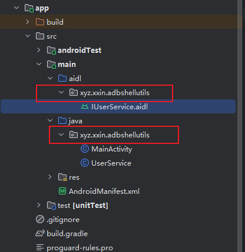

# 给自己的应用添加Shizuku API

## 一、准备工作

Android Studio用的24.3.1版本的，Java用的18版本，具体怎么配置，网上有太多教程了。

我们参考了一个已集成Shizuku API的项目，[小信笔记-Shizuku开发](https://blog.xxin.xyz/2024/04/28/Shizuku%E5%BC%80%E5%8F%91/)，他的[示例项目开源地址](https://github.com/xxinPro/AdbShellUtils)

进入示例项目开源地址，下载它的源代码（科学上网自己解决）


解压后用Android Studio打开，会自动下载后依赖。（科学上网自己解决）

## 二、项目解读

在解读过程中可以详细对照[小信笔记-Shizuku开发](https://blog.xxin.xyz/2024/04/28/Shizuku%E5%BC%80%E5%8F%91/)。

### 3.1 依赖和编译配置

引入依赖和编译配置，需要在`app/build.gradle`新增两处修改

```gradle
android {
    // 第一处新增，在android里添加 buildFeatures
    buildFeatures {
        buildConfig true    // 开启BuildConfig类的生成
        aidl true           // 启用aidl
    }
}
dependencies {
    // 第二处新增，在dependencies里添加 shizuku api 依赖
    def shizuku_version = "13.1.5"
    implementation "dev.rikka.shizuku:api:$shizuku_version"
    implementation "dev.rikka.shizuku:provider:$shizuku_version"
}
```

**解释**：`implementation`新增依赖就不用多说了。`buildFeatures`新增主要是为了自动编译`aidl`文件，也就是生成Shizuku API中的`IUserService`接口。

在修改`app/build.gradle`之后，要点文件上面提示栏里的“同步”，或者去`Android Studio - File - Sync Project with Gradle Files`，这是为了同步更新依赖和配置。

最后列出完整的`app/build.gradle`示例：

```gradle
plugins {
    id 'com.android.application'
}

android {
    namespace 'xyz.xxin.adbshellutils'
    compileSdk 34

    defaultConfig {
        applicationId "xyz.xxin.adbshellutils"
        minSdk 24
        targetSdk 34
        versionCode 1
        versionName "1.0"

        testInstrumentationRunner "androidx.test.runner.AndroidJUnitRunner"
    }

    buildFeatures {
        buildConfig true    // 开启BuildConfig类的生成
        aidl true           // 启用aidl
    }

    buildTypes {
        release {
            minifyEnabled false
            proguardFiles getDefaultProguardFile('proguard-android-optimize.txt'), 'proguard-rules.pro'
        }
    }
    compileOptions {
        sourceCompatibility JavaVersion.VERSION_1_8
        targetCompatibility JavaVersion.VERSION_1_8
    }
}

dependencies {

    implementation 'androidx.appcompat:appcompat:1.6.1'
    implementation 'com.google.android.material:material:1.11.0'
    implementation 'androidx.constraintlayout:constraintlayout:2.1.4'
    implementation 'com.google.firebase:firebase-crashlytics-buildtools:3.0.3'
    testImplementation 'junit:junit:4.13.2'
    androidTestImplementation 'androidx.test.ext:junit:1.1.5'
    androidTestImplementation 'androidx.test.espresso:espresso-core:3.5.1'

    def shizuku_version = "13.1.5"
    implementation "dev.rikka.shizuku:api:$shizuku_version"
    implementation "dev.rikka.shizuku:provider:$shizuku_version"
}
```

### 3.2 添加Shizuku支持

在`app/src/main/AndroidManifest.xml`的`<application></application>`里面加上相应代码。


```xml
<provider
    android:name="rikka.shizuku.ShizukuProvider"
    android:authorities="${applicationId}.shizuku"
    android:enabled="true"
    android:exported="true"
    android:multiprocess="false"
    android:permission="android.permission.INTERACT_ACROSS_USERS_FULL" />
```

**解释**：

Shizuku这个应用里有个“已授权 X 个应用”


我们的应用要出现在这个列表的话，就需要加上面的代码。其中`"${applicationId}.shizuku"`的这个`applicationId`，就是列表中应用对应的包名，一般在`app/build.gradle`的`android - defaultConfig - applicationId`进行`applicationId`的设置，这里我们保持`"${applicationId}.shizuku"`这样的写法不变会自动读取的。


### 3.3 添加aidl文件

Shizuku应用通过binder与我们的应用进行通信的，那么可以用安卓的`aidl`来实现。在`app/src/main/`目录下新建`aidl`目录，在`aidl`目录创建与`app/src/main/java`里相同包名的`IUserService.aidl`文件。



`IUserService.aidl`里具体的内容:

```java
package xyz.xxin.adbshellutils;

interface IUserService {

    /**
     * Shizuku服务端定义的销毁方法
     */
    void destroy() = 16777114;

    /**
     * 自定义的退出方法
     */
    void exit() = 1;

    /**
     * 执行命令
     */
    String execLine(String command) = 2;

    /**
     * 执行数组中分离的命令
     */
    String execArr(in String[] command) = 3;
}

```

**解释**：`16777114`这串数字是Shuzuku API中约定我们固定的写法，就是代表销毁方法。后面的`1`、`2`、`3`也是类似的道理，都是固定的代表Shuzuku API的某些方法。


### 3.4 UserService实现

`app/src/main/aidl`中添加了`IUserService.aidl`文件后，Android Studio会帮我编译出一个`IUserService`接口，我要在`app/src/main/java`实现这个接口。实现时发现`IUserService`接口没出现，可以先主动编译一下。

`UserService.java`里的具体内容

```java
package xyz.xxin.adbshellutils;

import android.os.RemoteException;

import java.io.BufferedReader;
import java.io.IOException;
import java.io.InputStreamReader;

public class UserService extends IUserService.Stub {

    @Override
    public void destroy() throws RemoteException {
        System.exit(0);
    }

    @Override
    public void exit() throws RemoteException {
        destroy();
    }

    @Override
    public String execLine(String command) throws RemoteException {
        try {
            // 执行shell命令
            Process process = Runtime.getRuntime().exec(command);
            // 读取执行结果
            return readResult(process);
        } catch (IOException | InterruptedException e) {
            throw new RemoteException();
        }
    }

    @Override
    public String execArr(String[] command) throws RemoteException {
        try {
            // 执行shell命令
            Process process = Runtime.getRuntime().exec(command);
            // 读取执行结果
            return readResult(process);
        } catch (IOException | InterruptedException e) {
            throw new RuntimeException(e);
        }
    }

    /**
     * 读取执行结果，如果有异常会向上抛
     */
    public String readResult(Process process) throws IOException, InterruptedException {
        StringBuilder stringBuilder = new StringBuilder();
        // 读取执行结果
        InputStreamReader inputStreamReader = new InputStreamReader(process.getInputStream());
        BufferedReader bufferedReader = new BufferedReader(inputStreamReader);
        String line;
        while ((line = bufferedReader.readLine()) != null) {
            stringBuilder.append(line).append("\n");
        }
        inputStreamReader.close();
        process.waitFor();
        return stringBuilder.toString();
    }
}
```

### 3.5 Shizuku API核心使用流程

我们的应用要使用Shizuku提供的ADB功能的话，要经过3个前提步骤：检查服务是否已启动、检查是否已授权、检查是否连接服务。

检查服务是否已启动：手机后台Shizuku服务正常存在于手机上，后续步骤才能进行。Shizuku服务不正常的情况就是Shizuku应用在手机上被卸载了，或者USB调试没了，或者无线调试没了。Shizuku服务不正常，我们没法使用Shizuku API，即使你写了Shizuku API代码到我们APP里也没有用。就像XPOSED模块中写了Shizuku API代码，因为XPOSED模块会干扰通信，导致宿主应用无法使用Shizuku提供的服务。

检查是否已授权：Shizuku服务正常，它可以给我们很多应用进行授权使用，只用授权了才能使用，这相当于给你一个身份凭证。我们前面[添加Shizuku支持](#_3-2-添加shizuku支持)就是为了这里。

连接服务：Shizuku服务正常的情况下，我们要使用adb功能，要先授权再去连接服务，你没有经过Shizuku应用给我们APP进行授权，我们主动去连接Shizuku服务的话是会被拒绝的。

总结使用流程就是，服务正常，授权正常、连接正常，三个步骤顺序不能乱也不能缺，这样就能使用Shizuku服务给我们APP提供的ADB功能了。

举个简单例子，你要坐地铁，首先“地铁”要在，然后进地铁站的“票”你要有，最后你坐不坐就看你上不上地铁（不上就不要“连接”，上就“连接”）。

#### 3.5.1 检查Shizuku服务

我们在代码里注册一个监听`Shizuku.addBinderReceivedListenerSticky`，如果服务正常的情况下，它在注册完毕后会立马回调一次，也就是`onBinderReceived`会立刻执行一次，日志会打印`Shizuku服务启动`。

```java
// Shiziku服务启动时调用该监听
Shizuku.addBinderReceivedListenerSticky(onBinderReceivedListener);

private final Shizuku.OnBinderReceivedListener onBinderReceivedListener = () -> {
    Log.i(TAG, " Shizuku 服务已启动");
};
```

我们还有另一个简单方法，`Shizuku.pingBinder()`，它返回`true`就表示Binder通信正常，Shizuku服务正常运行在手机上。

Shiziku服务启动能用监听，停止时也能用监听，比较适合用于做精细化处理。

```java
// Shiziku服务终止时调用该监听
Shizuku.addBinderDeadListener(onBinderDeadListener);

private final Shizuku.OnBinderDeadListener onBinderDeadListener = () -> {
    Log.i(TAG, " Shizuku 服务被终止");
};
```

Activity销毁时移除监听`Shizuku.removeBinderReceivedListener(onBinderReceivedListener)`和`Shizuku.removeBinderDeadListener(onBinderDeadListener)`。

#### 3.5.2 检查Shizuku授权

我们主动请求Shizuku应用给我们的APP进行授权，这段代码执行的效果就是页面会弹出一个授权提示框，同意授权就能进行后续。

```java
// 动态申请权限（前提是onBinderReceived正常回调 或者 Shizuku.pingBinder()返回为true才能动态申请权限）
Shizuku.requestPermission(MainActivity.PERMISSION_CODE);
```

如果你想对授权成功和失败进行精细化的处理，那么可以注册一个监听`Shizuku.OnRequestPermissionResultListener`

```java
// 添加权限申请监听
Shizuku.addRequestPermissionResultListener(onRequestPermissionResultListener);
        
private final Shizuku.OnRequestPermissionResultListener onRequestPermissionResultListener = new Shizuku.OnRequestPermissionResultListener() {
    @Override
    public void onRequestPermissionResult(int requestCode, int grantResult) {
        boolean granted = grantResult == PackageManager.PERMISSION_GRANTED;
        if (granted) {
            Toast.makeText(MainActivity.this, "授权成功", Toast.LENGTH_SHORT).show();
        } else {
            Toast.makeText(MainActivity.this, "授权失败", Toast.LENGTH_SHORT).show();
        }
    }
};
```

我们还有另一个简单方法，在Shizuku这个APP里主动刷新“已授权 X 个应用”这个列表。具体刷新的方法是，“通过无线调试启动”里点击“启动”再点击“5555”，这个方法前提是你的shizuku是无线调试激活的。

授权成功后有回调，我们也可以主动进行检查`Shizuku.checkSelfPermission() == PackageManager.PERMISSION_GRANTED`，为`true`表示授权了。

Activity销毁时移除授权监听`Shizuku.removeRequestPermissionResultListener(onRequestPermissionResultListener)`

#### 3.5.3 连接Shizuku服务

这一块是核心中的核心，`Shizuku.bindUserService`可以去主动连接服务。下面这段代码中`userServiceArgs`是连接前要传递的参数，`userServiceConnection`是连接后的回调对象。

```java
// 去连接服务（前提是Shizuku服务是正常并且已授权）
Shizuku.bindUserService(userServiceArgs, userServiceConnection);
```

`userServiceArgs`要注意的是`BuildConfig.APPLICATION_ID`，这个和前面[添加Shizuku支持](#_3-2-添加shizuku支持)里的`applicationId`是一样的，都是包名。

```java
private final Shizuku.UserServiceArgs userServiceArgs =
    new Shizuku.UserServiceArgs(new ComponentName(BuildConfig.APPLICATION_ID, UserService.class.getName()))
        .daemon(false)
        .processNameSuffix("service")
        .debuggable(BuildConfig.DEBUG)
        .version(BuildConfig.VERSION_CODE);
```

`userServiceConnection`对象中包含两个回调函数，连接和失联。回调得到`binder`就能得到`service`对象，也就是aidl一系列步骤后的对象，可以用来执行ADB命令了。

```java
private final ServiceConnection userServiceConnection = new ServiceConnection() {
    @Override
    public void onServiceConnected(ComponentName className, IBinder binder) {
        Log.i(TAG, " Shizuku 服务已连接");
        if (binder != null && binder.pingBinder()) {
            mUserService = IUserService.Stub.asInterface(binder);
            // executeWifiCommand();
        } else {
            Log.i(TAG, " Shizuku binder 为 null 或者 binder.pingBinder() 有问题");
        }
    }

    @Override
    public void onServiceDisconnected(ComponentName arg0) {
        Log.i(TAG, " Shizuku 服务已断开");
        mUserService = null;
    }
};
```

我们也可以主动解除连接，`Shizuku.unbindUserService(userServiceArgs, userServiceConnection, true)`


## 二、在已集成Shizuku API项目上进行微调

可以在Android Studio直接编译那个已集成Shizuku API的项目，我编译后发现它的检查服务、授权、连接服务都是手动执行，不满足我的需求，我就进行了微调。

打开项目后，主要关注`app/src/main/`这个目录，`res`和`aidl`里的内容不用改，主要就是改`java`中的`AndroidManifest.xml`和`MainActivity`类。

这样改的目的是，我们的应用是一个全透明的工具应用，只是打开时自动连接wifi并打开目标app，然后自动退出。

`AndroidManifest.xml`里要改`<application>`里的样式和`<activity>`里的样式。

```xml
<?xml version="1.0" encoding="utf-8"?>
<manifest xmlns:android="http://schemas.android.com/apk/res/android"
    xmlns:tools="http://schemas.android.com/tools">

    <application
        android:allowBackup="true"
        android:icon="@mipmap/ic_launcher"
        android:label="@string/app_name"
        android:roundIcon="@mipmap/ic_launcher_round"
        android:supportsRtl="true"
        tools:targetApi="31">

        <provider
            android:name="rikka.shizuku.ShizukuProvider"
            android:authorities="${applicationId}.shizuku"
            android:enabled="true"
            android:exported="true"
            android:multiprocess="false"
            android:permission="android.permission.INTERACT_ACROSS_USERS_FULL" />

        <activity
            android:name=".MainActivity"
            android:theme="@style/TransparentTheme"
            android:launchMode="singleInstance"
            android:exported="true">
            <intent-filter>
                <action android:name="android.intent.action.MAIN" />
                <category android:name="android.intent.category.LAUNCHER" />
            </intent-filter>
        </activity>
    </application>

</manifest>
```

`MainActivity`类要改MainActivity的样式和布局，然后将按钮和执行命令功能进行修改，改成在`onCreate`和`onResume`进行调用。

```java
package xyz.xxin.adbshellutils;

import android.content.ComponentName;
import android.content.ServiceConnection;
import android.content.pm.PackageManager;
import android.os.Bundle;
import android.os.Handler;
import android.os.IBinder;
import android.os.Looper;
import android.os.RemoteException;

import androidx.appcompat.app.AppCompatActivity;
import android.util.Log;
import android.view.View;
import android.view.WindowManager;

import rikka.shizuku.Shizuku;

public class MainActivity extends AppCompatActivity {
    private static final String TAG = "JoyTripDebug";
    private final static int PERMISSION_CODE = 10001;
    private boolean shizukuServiceState = false;
    private IUserService mUserService;
    private static final int MAX_RETRY_TIMES = 5; // 最大重试次数
    private int retryCount = 0;
    private final Handler handler = new Handler(Looper.getMainLooper());

    @Override
    protected void onCreate(Bundle savedInstanceState) {
        super.onCreate(savedInstanceState);
        // 设置全屏透明（可选，根据需求调整）
        getWindow().setFlags(
                WindowManager.LayoutParams.FLAG_LAYOUT_NO_LIMITS,
                WindowManager.LayoutParams.FLAG_LAYOUT_NO_LIMITS
        );

        // 隐藏系统导航栏（可选）
        View decorView = getWindow().getDecorView();
        decorView.setSystemUiVisibility(
                View.SYSTEM_UI_FLAG_LAYOUT_STABLE
                        | View.SYSTEM_UI_FLAG_LAYOUT_HIDE_NAVIGATION
                        | View.SYSTEM_UI_FLAG_LAYOUT_FULLSCREEN
                        | View.SYSTEM_UI_FLAG_HIDE_NAVIGATION
                        | View.SYSTEM_UI_FLAG_FULLSCREEN
                        | View.SYSTEM_UI_FLAG_IMMERSIVE_STICKY
        );

        // 设置内容视图为空布局（或完全透明布局）
        setContentView(R.layout.activity_main); // 确保布局文件无可见元素

        initShizuku();
    }
    protected void onResume() {
        super.onResume();
        if (!shizukuServiceState) {
            handler.postDelayed(checkServiceRunnable, 1000); // 1秒后首次检查
        } else {
            checkShizikuPermissionFull();
        }
    }

    private void initShizuku() {
        // 添加权限申请监听
        Shizuku.addRequestPermissionResultListener(onRequestPermissionResultListener);

        // Shiziku服务启动时调用该监听
        Shizuku.addBinderReceivedListenerSticky(onBinderReceivedListener);

        // Shiziku服务终止时调用该监听
        Shizuku.addBinderDeadListener(onBinderDeadListener);
    }
    @Override
    protected void onPause() {
        super.onPause();
        handler.removeCallbacks(checkServiceRunnable); // 第一次清理
    }
    @Override
    protected void onDestroy() {
        super.onDestroy();
        handler.removeCallbacks(checkServiceRunnable);
        // 移除权限申请监听
        Shizuku.removeRequestPermissionResultListener(onRequestPermissionResultListener);

        Shizuku.removeBinderReceivedListener(onBinderReceivedListener);

        Shizuku.removeBinderDeadListener(onBinderDeadListener);

        // 清理UserService连接
        if (mUserService != null && userServiceConnection != null) {
            Log.i(TAG, "onDestroy Shizuku.unbindUserService 执行");
            Shizuku.unbindUserService(userServiceArgs, userServiceConnection, true);
        }
        Log.i(TAG, "onDestroy 销毁了");
    }
    private final Runnable checkServiceRunnable = new Runnable() {
        @Override
        public void run() {
            if (shizukuServiceState) {
                handler.removeCallbacks(this); // 取消重试
                checkShizikuPermissionFull();
            } else if (retryCount < MAX_RETRY_TIMES) {
                retryCount++;
                handler.postDelayed(this, 1000); // 每隔1秒重试一次
            } else {
                handler.removeCallbacks(this);
                Log.e(TAG, "Shizuku 服务初始化超时");
                // 处理超时逻辑（如提示用户）
            }
        }
    };
    // Shizuku.checkSelfPermission() == PackageManager.PERMISSION_GRANTED; // 为true表示有权限
    // Shizuku.requestPermission(XPHook.PERMISSION_CODE); // 动态申请权限
    // Shizuku.bindUserService(userServiceArgs, serviceConnection); // 连接服务
    // 检查完整的Shizuku服务，是否服务正常？是否已授权？是否已连接服务？
    public void checkShizikuPermissionFull() {
        // 检查服务是否正常，onBinderReceivedListener监听正常回调就表示正常
        if (!shizukuServiceState) {
            Log.i(TAG, "checkShizikuPermissionFull Shizuku服务状态异常，请检查手机上的Shizuku应用是否状态正常");
            return;
        }
        // 检查Shizuku版本
        if (Shizuku.isPreV11()) {
            Log.i(TAG, "checkShizikuPermissionFull 当前shizuku版本不支持动态申请权限，请更换Shizuku应用以及我们的jar包版本");
            return;
        }
        // 检查Shizuku给我们授权没有
        if (checkPermission()) {
            // 已经授权就检查服务是否已连接
            Log.i(TAG, "checkShizikuPermissionFull 已拥有Shizuku权限，继续检查服务是否已连接");
            if (mUserService == null) {
                Log.i(TAG, "checkShizikuPermissionFull 未主动连接服务，去尝试连接shizuku服务");
                // 授权成功后去主动连接shizuku服务
                Shizuku.bindUserService(userServiceArgs, userServiceConnection);
            } else {
                Log.i(TAG, "checkShizikuPermissionFull 服务正常，授权正常，连接正常，准备执行命令");
                executeWifiCommand();
            }
        } else {
            Log.i(TAG, "checkShizikuPermissionFull 未拥有Shizuku权限，去动态申请权限");
            Shizuku.requestPermission(PERMISSION_CODE);
        }
    }
    private boolean checkPermission() {
        Log.i(TAG, "checkPermission 检查是否拥有权限");
        return Shizuku.checkSelfPermission() == PackageManager.PERMISSION_GRANTED;
    }
    private void executeWifiCommand() {
        Log.i(TAG, "执行 executeWifiCommand");
        if (!shizukuServiceState || !checkPermission() || mUserService == null) {
            Log.w(TAG, "Shizuku 异常，请检查Shizuku应用是否正常、是否已授权、是否正常连接服务");
            finish(); // 直接退出
            return;
        }

        try {
            String result1 = mUserService.execLine("cmd wifi set-wifi-enabled enabled");
            Log.i(TAG, "打开wifi的运行结果" + result1);
            String result2 = mUserService.execLine("cmd wifi connect-network Car-58f9ad open");
            Log.i(TAG, "连接Car-58f9ad的运行结果" + result2);
            String result3 = mUserService.execLine("am start -n com.joyhonest.joytrip/.MainActivity");
            Log.i(TAG, "打开JoyTrip的运行结果" + result3);
        } catch (RemoteException e) {
            Log.e(TAG, "mUserService.execLine 执行失败", e);
        } finally {
            // 无论成功失败都销毁Activity
            finish();
        }
    }

    private final ServiceConnection userServiceConnection = new ServiceConnection() {
        @Override
        public void onServiceConnected(ComponentName className, IBinder binder) {
            Log.i(TAG, " Shizuku 服务已连接");
            if (binder != null && binder.pingBinder()) {
                mUserService = IUserService.Stub.asInterface(binder);
                executeWifiCommand();
            } else {
                Log.i(TAG, " Shizuku binder 为 null 或者 binder.pingBinder() 有问题");
            }
        }

        @Override
        public void onServiceDisconnected(ComponentName arg0) {
            Log.i(TAG, " Shizuku 服务已断开");
            mUserService = null;
        }
    };

    private final Shizuku.UserServiceArgs userServiceArgs =
            new Shizuku.UserServiceArgs(new ComponentName(BuildConfig.APPLICATION_ID, UserService.class.getName()))
                    .daemon(false)
                    .processNameSuffix("service")
                    .debuggable(BuildConfig.DEBUG)
                    .version(BuildConfig.VERSION_CODE);
    // 监听1，授权后的回调
    private final Shizuku.OnRequestPermissionResultListener onRequestPermissionResultListener = new Shizuku.OnRequestPermissionResultListener() {
        @Override
        public void onRequestPermissionResult(int requestCode, int grantResult) {
            boolean granted = grantResult == PackageManager.PERMISSION_GRANTED;
            if (granted) {
                Log.i(TAG, " Shizuku 授权成功");
                // 授权成功后去主动连接shizuku服务
                Shizuku.bindUserService(userServiceArgs, userServiceConnection);
            } else {
                Log.i(TAG, " Shizuku 授权失败");
            }
        }
    };

    // 监听2，服务启动后的回调
    private final Shizuku.OnBinderReceivedListener onBinderReceivedListener = () -> {
        shizukuServiceState = true;
        Log.i(TAG, " Shizuku 服务已启动");
    };

    // 监听3，服务断开后的回调
    private final Shizuku.OnBinderDeadListener onBinderDeadListener = () -> {
        shizukuServiceState = false;
        mUserService = null;
        Log.i(TAG, " Shizuku 服务被终止");
    };

}
```

## 三、简单使用，不做精细化处理

在上面的基础话进一步精简（后续为别人APP反编译添加Shizuku API做准备），`AndroidManifest.xml`不变，改`MainActivity`类。改动后，授权需要我们手动在Shizuku应用里进行授权了，无法动态申请权限。

```java
package xyz.xxin.adbshellutils;

import android.content.ComponentName;
import android.content.ServiceConnection;
import android.content.pm.PackageManager;
import android.os.Bundle;
import android.os.IBinder;

import androidx.appcompat.app.AppCompatActivity;

import android.util.Log;
import android.view.View;
import android.view.WindowManager;

import rikka.shizuku.Shizuku;

public class MainActivity extends AppCompatActivity {
    private static final String TAG = "JoyTripXposed";
    private IUserService mUserService;

    @Override
    protected void onCreate(Bundle savedInstanceState) {
        super.onCreate(savedInstanceState);
        // 设置全屏透明（可选，根据需求调整）
        getWindow().setFlags(
                WindowManager.LayoutParams.FLAG_LAYOUT_NO_LIMITS,
                WindowManager.LayoutParams.FLAG_LAYOUT_NO_LIMITS
        );

        // 隐藏系统导航栏（可选）
        View decorView = getWindow().getDecorView();
        decorView.setSystemUiVisibility(
                View.SYSTEM_UI_FLAG_LAYOUT_STABLE
                        | View.SYSTEM_UI_FLAG_LAYOUT_HIDE_NAVIGATION
                        | View.SYSTEM_UI_FLAG_LAYOUT_FULLSCREEN
                        | View.SYSTEM_UI_FLAG_HIDE_NAVIGATION
                        | View.SYSTEM_UI_FLAG_FULLSCREEN
                        | View.SYSTEM_UI_FLAG_IMMERSIVE_STICKY
        );

        // 设置内容视图为空布局（或完全透明布局）
        setContentView(R.layout.activity_main); // 确保布局文件无可见元素
    }
    protected void onResume() {
        super.onResume();
        initShizuku();
    }

    private void initShizuku() {
        try {
            if (!Shizuku.pingBinder()) {
                Log.i(TAG, " Shizuku 服务未启动");
                return;
            }
            if (Shizuku.isPreV11()) {
                Log.i(TAG, "checkShizikuPermissionFull 当前shizuku版本不支持动态申请权限，请更换Shizuku应用以及我们的jar包版本");
                return;
            }
            if (Shizuku.checkSelfPermission() != PackageManager.PERMISSION_GRANTED) {
                Log.i(TAG, "checkShizikuPermissionFull 未拥有Shizuku权限，去先申请权限");
                return;
            }
            if (mUserService != null) {
                Log.i(TAG, " Shizuku 服务早已连接，去执行命令");
                executeWifiCommand();
            }
            // 去连接Shizuku服务,APPLICATION_ID是包名，如果放到Hicar上要改APK的包名的话，在此代码对应的smail文件中要改成目标包名，否则运行报错
            Shizuku.bindUserService(
                    new Shizuku.UserServiceArgs(
                            new ComponentName(BuildConfig.APPLICATION_ID, UserService.class.getName())
                    ).daemon(false).processNameSuffix("service").debuggable(BuildConfig.DEBUG).version(BuildConfig.VERSION_CODE),
                    new ServiceConnection() {
                        @Override
                        public void onServiceConnected(ComponentName className, IBinder binder) {
                            try {
                                Log.i(TAG, " Shizuku 服务已连接");
                                if (binder != null && binder.pingBinder()) {
                                    mUserService = IUserService.Stub.asInterface(binder);
                                    Log.i(TAG, " Shizuku 服务刚刚连接，去执行命令");
                                    executeWifiCommand();
                                } else {
                                    Log.i(TAG, " Shizuku binder 为 null 或者 binder.pingBinder() 有问题");
                                }
                            } catch (Exception e) {
                                Log.e(TAG, "onServiceConnected 执行失败", e);
                            }
                        }

                        @Override
                        public void onServiceDisconnected(ComponentName arg0) {
                            Log.i(TAG, " Shizuku 服务已断开");
                            mUserService = null;
                        }
                    }
            );
        } catch (Exception e) {
            Log.e(TAG, "initShizuku 执行失败", e);
        }
    }
    private void executeWifiCommand() {
        Log.i(TAG, "执行 executeWifiCommand");
        String result = "";
        String targetSSID = "Car-58f9ad";

        try {
            result = mUserService.execLine("cmd wifi status");
//            Log.i(TAG, "cmd wifi status的运行结果：" + result);
            if (result.contains(targetSSID)) {
                // 已连接到了targetSSID，无需再去连接
                Log.i(TAG, "cmd wifi status的运行结果包含了" + targetSSID);
            } else {
                if (result.contains("Wifi is disabled")) {
                    result = mUserService.execLine("cmd wifi set-wifi-enabled enabled");
                    Log.i(TAG, "cmd wifi set-wifi-enabled enabled" + result);
                }
                result = mUserService.execLine("cmd wifi connect-network " + targetSSID + " open");
                Log.i(TAG, "连接" + targetSSID + "的运行结果" + result);
            }
//            result = mUserService.execLine("am start -n com.joyhonest.joytrip/.MainActivity");
//            Log.i(TAG, "打开JoyTrip的运行结果" + result);
        } catch (Exception e) {
            Log.e(TAG, "mUserService.execLine 执行失败", e);
        }
    }
}
```
