# 给别人的应用添加Shizuku权限

## 一、准备工作

准备工作如下


## 二、相关命令

将原apk进行反编译

```shell
java -jar "C:\Users\liuliang\Downloads\apktool_2.11.1.jar" d "C:\Users\liuliang\Downloads\joytrip.apk" -o "C:\Users\liuliang\Downloads\joytrip-app"
```

将修改后的代码进行二次打包

```shell
java -jar "C:\Users\liuliang\Downloads\apktool_2.11.1.jar" b "C:\Users\liuliang\Downloads\joytrip-app" -o "C:\Users\liuliang\Downloads\joytrip-modify.apk"
```

## 三、代码注入

我们将joytrip.apk进行反编译。得到如下目录

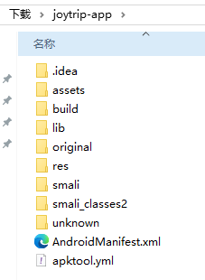

我们将上一章的最后精简版的代码进行编译后，再反编译。得到如下目录


### 3.1 Shizuku API依赖库添加

复制依赖库，无需管`build.gradle`，因为编译后没有这个文件，那么只需要把`smali`里有关Shizuku API依赖库复制过去就可以了。

将`app-debug\smali_classes2`下的`rikka`目录复制放到`joytrip-app\smali`里。

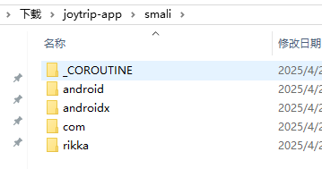

再把`app-debug\smali_classes4`下的`moe`和`rikka`目录复制放到`joytrip-app\smali_classes2`里。不要管`smali_classes2`和`smali_classes4`怎么对不上，是可以使用的，无需担心。

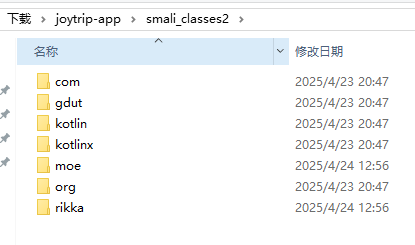

### 3.2 添加Shizuku支持

不能把未编译的`AndroidManifest`的`provider`直接复制过去，因为编译后有变化。

打开`app-debug\AndroidManifest.xml`里面搜索`shizuku`（不要区分大小写）。

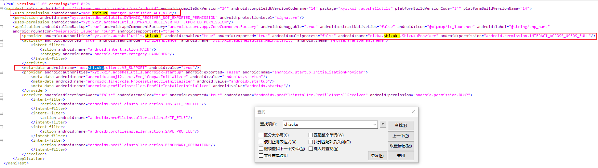

将相关配置复制到`joytrip-app\AndroidManifest.xml`里。

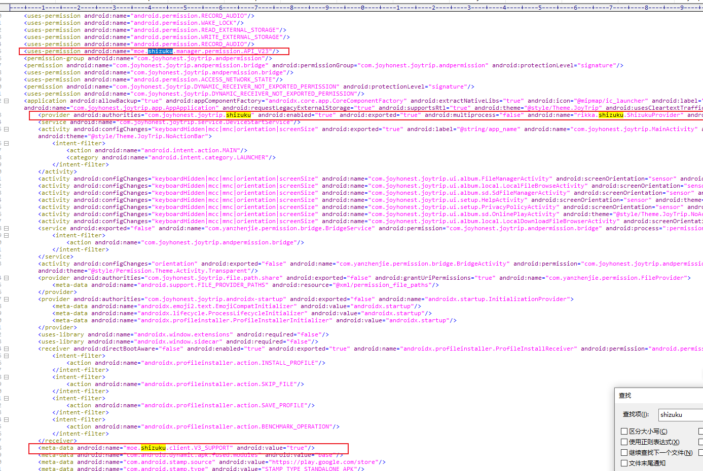

### 3.3 aidl和UserService相关smali处理

在`app-debug\`里找到业务核心代码部分，也就是`app-debug\smali_classes3\xyz\xxin\adbshellutils\`

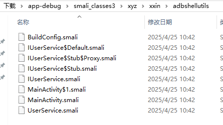

将`IUserService.smali`、`IUserService$Default.smali`、`IUserService$Stub.smali`、`IUserService$Stub$Proxy.smali`、`UserService.smali`这几个文件复制到`joytrip-app\smali_classes2\com\joyhonest\joytrip\`。

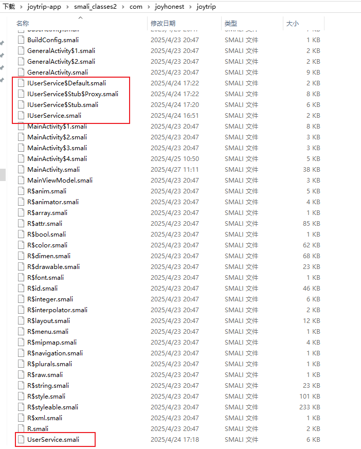

复制后每个文件记得修改smali代码中的包名，例如搜索`xyz/xxin/adbshellutils`然后全部替换成`com/joyhonest/joytrip`，搜索`xyz.xxin.adbshellutils`然后全部替换成`com.joyhonest.joytrip`，最后搜索`xyz`看还有没有漏掉的。

### 3.4 MainActivity相关smali处理

#### 3.4.1 简要说明

我们在[给自己的应用添加Shizuku权限](./2.给自己的应用添加ShizukuAPI.md)的最后一节里进行了代码精简就是为了我们这一步做准备的，代码我们再列出来看一下。

```java
package xyz.xxin.adbshellutils;

import android.content.ComponentName;
import android.content.ServiceConnection;
import android.content.pm.PackageManager;
import android.os.Bundle;
import android.os.IBinder;

import androidx.appcompat.app.AppCompatActivity;

import android.util.Log;
import android.view.View;
import android.view.WindowManager;

import rikka.shizuku.Shizuku;

public class MainActivity extends AppCompatActivity {
    private static final String TAG = "JoyTripXposed";
    private IUserService mUserService;

    @Override
    protected void onCreate(Bundle savedInstanceState) {
        super.onCreate(savedInstanceState);
        // 设置全屏透明（可选，根据需求调整）
        getWindow().setFlags(
                WindowManager.LayoutParams.FLAG_LAYOUT_NO_LIMITS,
                WindowManager.LayoutParams.FLAG_LAYOUT_NO_LIMITS
        );

        // 隐藏系统导航栏（可选）
        View decorView = getWindow().getDecorView();
        decorView.setSystemUiVisibility(
                View.SYSTEM_UI_FLAG_LAYOUT_STABLE
                        | View.SYSTEM_UI_FLAG_LAYOUT_HIDE_NAVIGATION
                        | View.SYSTEM_UI_FLAG_LAYOUT_FULLSCREEN
                        | View.SYSTEM_UI_FLAG_HIDE_NAVIGATION
                        | View.SYSTEM_UI_FLAG_FULLSCREEN
                        | View.SYSTEM_UI_FLAG_IMMERSIVE_STICKY
        );

        // 设置内容视图为空布局（或完全透明布局）
        setContentView(R.layout.activity_main); // 确保布局文件无可见元素
    }
    protected void onResume() {
        super.onResume();
        initShizuku();
    }

    private void initShizuku() {
        try {
            if (!Shizuku.pingBinder()) {
                Log.i(TAG, " Shizuku 服务未启动");
                return;
            }
            if (Shizuku.isPreV11()) {
                Log.i(TAG, "checkShizikuPermissionFull 当前shizuku版本不支持动态申请权限，请更换Shizuku应用以及我们的jar包版本");
                return;
            }
            if (Shizuku.checkSelfPermission() != PackageManager.PERMISSION_GRANTED) {
                Log.i(TAG, "checkShizikuPermissionFull 未拥有Shizuku权限，去先申请权限");
                return;
            }
            if (mUserService != null) {
                Log.i(TAG, " Shizuku 服务早已连接，去执行命令");
                executeWifiCommand();
            }
            // 去连接Shizuku服务,APPLICATION_ID是包名，如果放到Hicar上要改APK的包名的话，在此代码对应的smail文件中要改成目标包名，否则运行报错
            Shizuku.bindUserService(
                    new Shizuku.UserServiceArgs(
                            new ComponentName(BuildConfig.APPLICATION_ID, UserService.class.getName())
                    ).daemon(false).processNameSuffix("service").debuggable(BuildConfig.DEBUG).version(BuildConfig.VERSION_CODE),
                    new ServiceConnection() {
                        @Override
                        public void onServiceConnected(ComponentName className, IBinder binder) {
                            try {
                                Log.i(TAG, " Shizuku 服务已连接");
                                if (binder != null && binder.pingBinder()) {
                                    mUserService = IUserService.Stub.asInterface(binder);
                                    Log.i(TAG, " Shizuku 服务刚刚连接，去执行命令");
                                    executeWifiCommand();
                                } else {
                                    Log.i(TAG, " Shizuku binder 为 null 或者 binder.pingBinder() 有问题");
                                }
                            } catch (Exception e) {
                                Log.e(TAG, "onServiceConnected 执行失败", e);
                            }
                        }

                        @Override
                        public void onServiceDisconnected(ComponentName arg0) {
                            Log.i(TAG, " Shizuku 服务已断开");
                            mUserService = null;
                        }
                    }
            );
        } catch (Exception e) {
            Log.e(TAG, "initShizuku 执行失败", e);
        }
    }
    private void executeWifiCommand() {
        Log.i(TAG, "执行 executeWifiCommand");
        String result = "";
        String targetSSID = "Car-58f9ad";

        try {
            result = mUserService.execLine("cmd wifi status");
//            Log.i(TAG, "cmd wifi status的运行结果：" + result);
            if (result.contains(targetSSID)) {
                // 已连接到了targetSSID，无需再去连接
                Log.i(TAG, "cmd wifi status的运行结果包含了" + targetSSID);
            } else {
                if (result.contains("Wifi is disabled")) {
                    result = mUserService.execLine("cmd wifi set-wifi-enabled enabled");
                    Log.i(TAG, "cmd wifi set-wifi-enabled enabled" + result);
                }
                result = mUserService.execLine("cmd wifi connect-network " + targetSSID + " open");
                Log.i(TAG, "连接" + targetSSID + "的运行结果" + result);
            }
//            result = mUserService.execLine("am start -n com.joyhonest.joytrip/.MainActivity");
//            Log.i(TAG, "打开JoyTrip的运行结果" + result);
        } catch (Exception e) {
            Log.e(TAG, "mUserService.execLine 执行失败", e);
        }
    }
}
```

我们可以看到`onCreate`用不上，我在`onResume`里才使用shizuku Api的代码。那么我们就需要把`MainActivity.smali`里的`initShizuku`相关代码复制过去就可以了。

#### 3.4.2 initShizuku入口移植

在`app-debug\smali_classes3\xyz\xxin\adbshellutils\MainActivity.smali`搜索`onResume`或者`initShizuku`

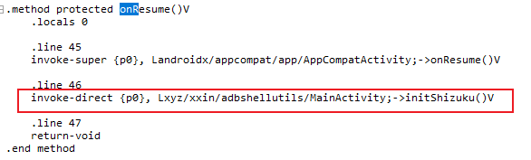

把`invoke-direct {p0}, Lxyz/xxin/adbshellutils/MainActivity;->initShizuku()V`移植到`joytrip-app\smali_classes2\com\joyhonest\joytrip\MainActivity.smali`里。**注意要修改包名**。

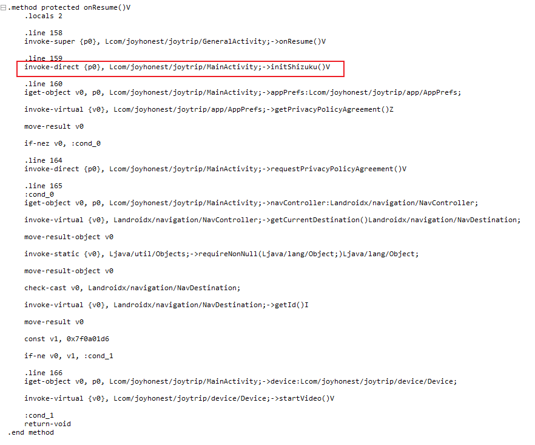

#### 3.4.3 initShizuku移植

同样的，在`app-debug`的`MainActivity.smali`里搜索`initShizuku`，将整个`initShizuku`方法都移植过去。直接放到`joytrip-app`的`MainActivity.smali`的末尾。

**注意**，`.method private initShizuku()V`是方法开头，`.end method`是方法结尾。`.line 51`这种可以删除，但是`.locals 5`别删了。**记得修改smali代码中的包名**，例如搜索`xyz/xxin/adbshellutils`然后全部替换成`com/joyhonest/joytrip`，搜索`xyz.xxin.adbshellutils`然后全部替换成`com.joyhonest.joytrip`，最后搜索`xyz`看还有没有漏掉的。

```smali
.method private initShizuku()V
    .locals 5

    const-string v0, "JoyTripDebug"

    :try_start_0
    invoke-static {}, Lrikka/shizuku/Shizuku;->pingBinder()Z

    move-result v1

    if-nez v1, :cond_0

    const-string v1, " Shizuku \u670d\u52a1\u672a\u542f\u52a8"

    invoke-static {v0, v1}, Landroid/util/Log;->i(Ljava/lang/String;Ljava/lang/String;)I

    return-void

    :cond_0
    invoke-static {}, Lrikka/shizuku/Shizuku;->isPreV11()Z

    move-result v1

    if-eqz v1, :cond_1

    const-string v1, "checkShizikuPermissionFull \u5f53\u524dshizuku\u7248\u672c\u4e0d\u652f\u6301\u52a8\u6001\u7533\u8bf7\u6743\u9650\uff0c\u8bf7\u66f4\u6362Shizuku\u5e94\u7528\u4ee5\u53ca\u6211\u4eec\u7684jar\u5305\u7248\u672c"

    invoke-static {v0, v1}, Landroid/util/Log;->i(Ljava/lang/String;Ljava/lang/String;)I

    return-void

    :cond_1
    invoke-static {}, Lrikka/shizuku/Shizuku;->checkSelfPermission()I

    move-result v1

    if-eqz v1, :cond_2

    const-string v1, "checkShizikuPermissionFull \u672a\u62e5\u6709Shizuku\u6743\u9650\uff0c\u53bb\u5148\u7533\u8bf7\u6743\u9650"

    invoke-static {v0, v1}, Landroid/util/Log;->i(Ljava/lang/String;Ljava/lang/String;)I

    return-void

    :cond_2
    iget-object v1, p0, Lcom/joyhonest/joytrip/MainActivity;->mUserService:Lcom/joyhonest/joytrip/IUserService;

    if-eqz v1, :cond_3

    const-string v1, " Shizuku \u670d\u52a1\u65e9\u5df2\u8fde\u63a5\uff0c\u53bb\u6267\u884c\u547d\u4ee4"

    invoke-static {v0, v1}, Landroid/util/Log;->i(Ljava/lang/String;Ljava/lang/String;)I

    invoke-direct {p0}, Lcom/joyhonest/joytrip/MainActivity;->executeWifiCommand()V

    :cond_3
    new-instance v1, Lrikka/shizuku/Shizuku$UserServiceArgs;

    new-instance v2, Landroid/content/ComponentName;

    const-string v3, "com.joyhonest.joytrip"

    const-class v4, Lcom/joyhonest/joytrip/UserService;

    invoke-virtual {v4}, Ljava/lang/Class;->getName()Ljava/lang/String;

    move-result-object v4

    invoke-direct {v2, v3, v4}, Landroid/content/ComponentName;-><init>(Ljava/lang/String;Ljava/lang/String;)V

    invoke-direct {v1, v2}, Lrikka/shizuku/Shizuku$UserServiceArgs;-><init>(Landroid/content/ComponentName;)V

    const/4 v2, 0x0

    invoke-virtual {v1, v2}, Lrikka/shizuku/Shizuku$UserServiceArgs;->daemon(Z)Lrikka/shizuku/Shizuku$UserServiceArgs;

    move-result-object v1

    const-string v2, "service"

    invoke-virtual {v1, v2}, Lrikka/shizuku/Shizuku$UserServiceArgs;->processNameSuffix(Ljava/lang/String;)Lrikka/shizuku/Shizuku$UserServiceArgs;

    move-result-object v1

    sget-boolean v2, Lcom/joyhonest/joytrip/BuildConfig;->DEBUG:Z

    invoke-virtual {v1, v2}, Lrikka/shizuku/Shizuku$UserServiceArgs;->debuggable(Z)Lrikka/shizuku/Shizuku$UserServiceArgs;

    move-result-object v1

    const/4 v2, 0x1

    invoke-virtual {v1, v2}, Lrikka/shizuku/Shizuku$UserServiceArgs;->version(I)Lrikka/shizuku/Shizuku$UserServiceArgs;

    move-result-object v1

    new-instance v2, Lcom/joyhonest/joytrip/MainActivity$4;

    invoke-direct {v2, p0}, Lcom/joyhonest/joytrip/MainActivity$4;-><init>(Lcom/joyhonest/joytrip/MainActivity;)V

    invoke-static {v1, v2}, Lrikka/shizuku/Shizuku;->bindUserService(Lrikka/shizuku/Shizuku$UserServiceArgs;Landroid/content/ServiceConnection;)V
    :try_end_0
    .catch Ljava/lang/Exception; {:try_start_0 .. :try_end_0} :catch_0

    goto :goto_0

    :catch_0
    move-exception v1

    .local v1, "e":Ljava/lang/Exception;
    const-string v2, "initShizuku \u6267\u884c\u5931\u8d25"

    invoke-static {v0, v2, v1}, Landroid/util/Log;->e(Ljava/lang/String;Ljava/lang/String;Ljava/lang/Throwable;)I

    .end local v1    # "e":Ljava/lang/Exception;
    :goto_0
    return-void
.end method
```

#### 3.4.4 executeWifiCommand移植

和initShizuku方法移植一样，直接复制过来，然后**记得修改smali代码中的包名**，例如搜索`xyz/xxin/adbshellutils`然后全部替换成`com/joyhonest/joytrip`，搜索`xyz.xxin.adbshellutils`然后全部替换成`com.joyhonest.joytrip`，最后搜索`xyz`看还有没有漏掉的。

```smali
.method private executeWifiCommand()V
    .locals 6

    const-string v0, "cmd wifi set-wifi-enabled enabled"

    const-string v1, "\u6267\u884c executeWifiCommand"

    const-string v2, "JoyTripDebug"

    invoke-static {v2, v1}, Landroid/util/Log;->i(Ljava/lang/String;Ljava/lang/String;)I

    const-string v1, ""

    .local v1, "result":Ljava/lang/String;
    const-string v3, "Car-58f9ad"

    .local v3, "targetSSID":Ljava/lang/String;
    :try_start_0
    iget-object v4, p0, Lcom/joyhonest/joytrip/MainActivity;->mUserService:Lcom/joyhonest/joytrip/IUserService;

    const-string v5, "cmd wifi status"

    invoke-interface {v4, v5}, Lcom/joyhonest/joytrip/IUserService;->execLine(Ljava/lang/String;)Ljava/lang/String;

    move-result-object v4

    move-object v1, v4

    invoke-virtual {v1, v3}, Ljava/lang/String;->contains(Ljava/lang/CharSequence;)Z

    move-result v4

    if-eqz v4, :cond_0

    new-instance v0, Ljava/lang/StringBuilder;

    invoke-direct {v0}, Ljava/lang/StringBuilder;-><init>()V

    const-string v4, "cmd wifi status\u7684\u8fd0\u884c\u7ed3\u679c\u5305\u542b\u4e86"

    invoke-virtual {v0, v4}, Ljava/lang/StringBuilder;->append(Ljava/lang/String;)Ljava/lang/StringBuilder;

    move-result-object v0

    invoke-virtual {v0, v3}, Ljava/lang/StringBuilder;->append(Ljava/lang/String;)Ljava/lang/StringBuilder;

    move-result-object v0

    invoke-virtual {v0}, Ljava/lang/StringBuilder;->toString()Ljava/lang/String;

    move-result-object v0

    invoke-static {v2, v0}, Landroid/util/Log;->i(Ljava/lang/String;Ljava/lang/String;)I

    goto :goto_0

    :cond_0
    const-string v4, "Wifi is disabled"

    invoke-virtual {v1, v4}, Ljava/lang/String;->contains(Ljava/lang/CharSequence;)Z

    move-result v4

    if-eqz v4, :cond_1

    iget-object v4, p0, Lcom/joyhonest/joytrip/MainActivity;->mUserService:Lcom/joyhonest/joytrip/IUserService;

    invoke-interface {v4, v0}, Lcom/joyhonest/joytrip/IUserService;->execLine(Ljava/lang/String;)Ljava/lang/String;

    move-result-object v4

    move-object v1, v4

    new-instance v4, Ljava/lang/StringBuilder;

    invoke-direct {v4}, Ljava/lang/StringBuilder;-><init>()V

    invoke-virtual {v4, v0}, Ljava/lang/StringBuilder;->append(Ljava/lang/String;)Ljava/lang/StringBuilder;

    move-result-object v0

    invoke-virtual {v0, v1}, Ljava/lang/StringBuilder;->append(Ljava/lang/String;)Ljava/lang/StringBuilder;

    move-result-object v0

    invoke-virtual {v0}, Ljava/lang/StringBuilder;->toString()Ljava/lang/String;

    move-result-object v0

    invoke-static {v2, v0}, Landroid/util/Log;->i(Ljava/lang/String;Ljava/lang/String;)I

    :cond_1
    iget-object v0, p0, Lcom/joyhonest/joytrip/MainActivity;->mUserService:Lcom/joyhonest/joytrip/IUserService;

    new-instance v4, Ljava/lang/StringBuilder;

    invoke-direct {v4}, Ljava/lang/StringBuilder;-><init>()V

    const-string v5, "cmd wifi connect-network "

    invoke-virtual {v4, v5}, Ljava/lang/StringBuilder;->append(Ljava/lang/String;)Ljava/lang/StringBuilder;

    move-result-object v4

    invoke-virtual {v4, v3}, Ljava/lang/StringBuilder;->append(Ljava/lang/String;)Ljava/lang/StringBuilder;

    move-result-object v4

    const-string v5, " open"

    invoke-virtual {v4, v5}, Ljava/lang/StringBuilder;->append(Ljava/lang/String;)Ljava/lang/StringBuilder;

    move-result-object v4

    invoke-virtual {v4}, Ljava/lang/StringBuilder;->toString()Ljava/lang/String;

    move-result-object v4

    invoke-interface {v0, v4}, Lcom/joyhonest/joytrip/IUserService;->execLine(Ljava/lang/String;)Ljava/lang/String;

    move-result-object v0

    move-object v1, v0

    new-instance v0, Ljava/lang/StringBuilder;

    invoke-direct {v0}, Ljava/lang/StringBuilder;-><init>()V

    const-string v4, "\u8fde\u63a5"

    invoke-virtual {v0, v4}, Ljava/lang/StringBuilder;->append(Ljava/lang/String;)Ljava/lang/StringBuilder;

    move-result-object v0

    invoke-virtual {v0, v3}, Ljava/lang/StringBuilder;->append(Ljava/lang/String;)Ljava/lang/StringBuilder;

    move-result-object v0

    const-string v4, "\u7684\u8fd0\u884c\u7ed3\u679c"

    invoke-virtual {v0, v4}, Ljava/lang/StringBuilder;->append(Ljava/lang/String;)Ljava/lang/StringBuilder;

    move-result-object v0

    invoke-virtual {v0, v1}, Ljava/lang/StringBuilder;->append(Ljava/lang/String;)Ljava/lang/StringBuilder;

    move-result-object v0

    invoke-virtual {v0}, Ljava/lang/StringBuilder;->toString()Ljava/lang/String;

    move-result-object v0

    invoke-static {v2, v0}, Landroid/util/Log;->i(Ljava/lang/String;Ljava/lang/String;)I
    :try_end_0
    .catch Landroid/os/RemoteException; {:try_start_0 .. :try_end_0} :catch_0

    :goto_0
    goto :goto_1

    :catch_0
    move-exception v0

    .local v0, "e":Landroid/os/RemoteException;
    const-string v4, "mUserService.execLine \u6267\u884c\u5931\u8d25"

    invoke-static {v2, v4, v0}, Landroid/util/Log;->e(Ljava/lang/String;Ljava/lang/String;Ljava/lang/Throwable;)I

    .end local v0    # "e":Landroid/os/RemoteException;
    :goto_1
    return-void
.end method
```

#### 3.4.5 initShizuku中的特殊点

initShizuku方法中`const-string v3, "com.joyhonest.joytrip"`这里面的字符串是包名，如果你二次打包编译后想改包名，那么这里就不要漏掉。

initShizuku方法中`invoke-direct {v2, p0}, Lcom/joyhonest/joytrip/MainActivity$4;-><init>(Lcom/joyhonest/joytrip/MainActivity;)V`中的`MainActivity$4`，这个其实是把`app-debug`的`MainActivity$1.smali`移植过来然后重命名`MainActivity$4.smali`的，因为`joytrip-app`已经有了`MainActivity$1.smali`、`MainActivity$2.smali`、`MainActivity$3.smali`，所以得命名`$4`。

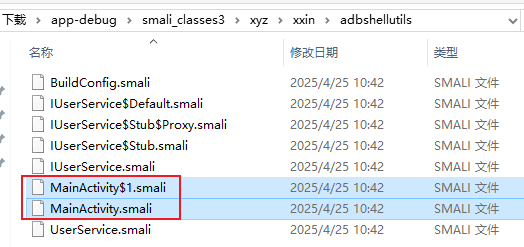
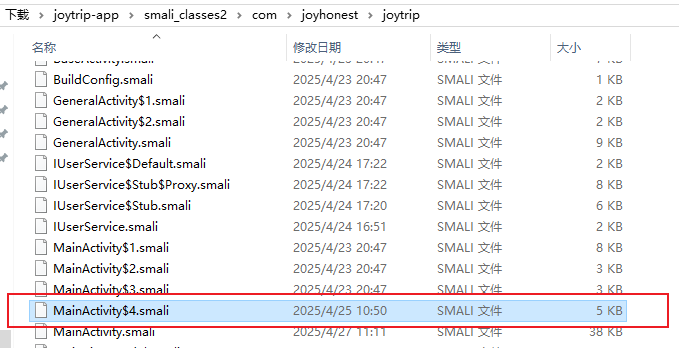

#### 3.4.6 MainActivity$4中的特殊点

首先所有包名里的`$1`记得修改成`$4`，最好是搜索`com/joyhonest/joytrip/MainActivity$1`，全部替换成`com/joyhonest/joytrip/MainActivity$4`

```smali
.class Lcom/joyhonest/joytrip/MainActivity$4;
```

然后是`access$002`这个在`MainActivity$4.smali`使用了，但是是在`MainActivity.smali`里定义的，那就需要把`app-debug`的`MainActivity.smali`的`access$002`移植到`joytrip-app`的`MainActivity.smali`。

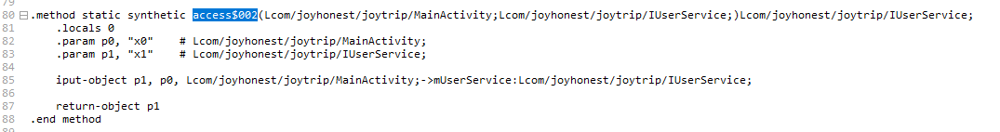

我还要保证`access$`其他的也能正常调用，发现`MainActivity$4.smali`里还有`access$100`，那就需要把`app-debug`的`MainActivity.smali`的`access$100`移植到`joytrip-app`的`MainActivity.smali`，但是在移植的时候又发现`joytrip-app`的`MainActivity.smali`已经有了`access$100`，我们可以重新命名为`access$003`。

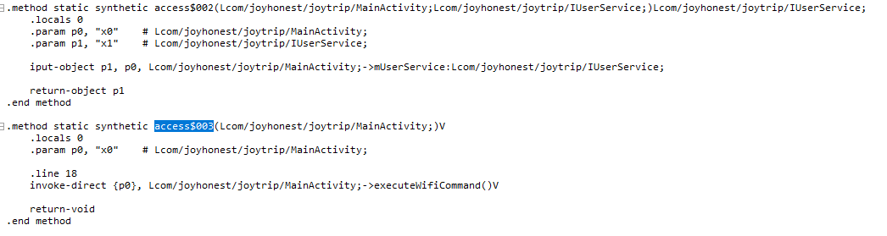


#### 3.4.7 MainActivity其他处理

`private IUserService mUserService`会被编译成`.field private mUserService:Lcom/joyhonest/joytrip/IUserService;`，所以在`joytrip-app`的`MainActivity.smali`要加上。

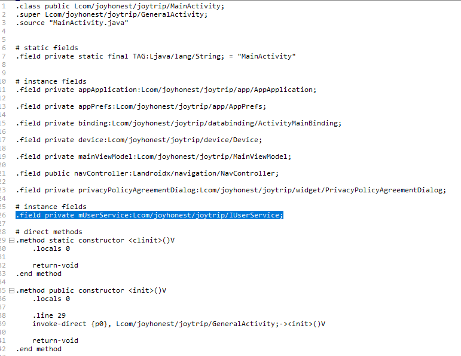

### 3.5 其他修改

`joytrip-app\res\values\strings.xml`和`joytrip-app\res\values-zh\strings.xml`里搜索`app_name`可以修改应用在手机上的名称。

`joytrip-app\apktool.yml`里可以修改`version`、`apkFileName`、`versionName`。

`joytrip-app\res\mipmap-xxhdpi`里可以修改图片资源。

## 四、签名

使用`MT管理器`或者`NP管理器`可以进行对二次打包的apk进行重新签名。

如果要使用别人的包名，那么`com.joyhonest.joytrip`就要修改成别人的包名，但是你不想修改那么多代码里的包名，可以只修改`AndroidManifest.xml`的相关配置。

- 搜索`package="com.joyhonest.joytrip"`替换成`package="你的新包名"`
- 搜索`com.joyhonest.joytrip.andpermission`替换成`你的新包名.andpermission`
- 搜索`android:authorities="com.joyhonest.joytrip.shizuku`替换成`android:authorities="新包名`