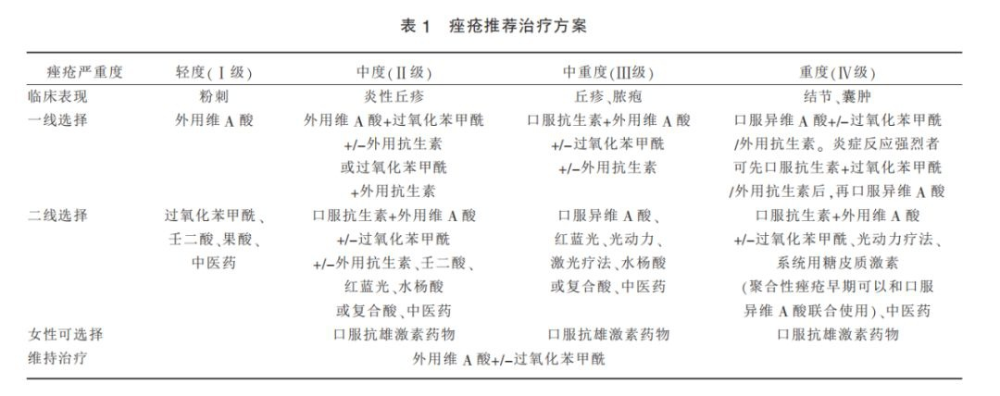

# 祛痘去粉刺祛印

## 刷酸

分享一篇知乎帖子，[痤疮治疗指南](https://zhuanlan.zhihu.com/p/114453335)。效果还可以，就是“抗争”比较激烈。  
  
使用过的产品：

- 阿达帕林凝胶:祛轻度痘，避光只能晚上用，可全脸用可预防粉刺形成。可抗炎、溶解粉刺，但不能用于刀伤、擦伤等。会有轻微脱屑表现，轻度痘用它即可。（**备孕和哺乳期的人别用！**）
- 过氧苯甲酰凝胶:祛中度痘，早晚可用，点涂。可杀菌除臭、溶解角质，但不能用于溃破处或者粘膜处，也不能过度使用。会有轻微脱屑表现，中度痘可搭配阿达帕林凝胶一起使用。（**强氧化剂，注意避开抗氧化护肤品**）
- 果酸：这个作用类型跟上面的维 A 酸类似，一般作为面膜使用，敷的时间 10 分钟左右，不要超过 15 分钟，一周使用次数不要超过两次！浓度非常低的水杨酸和壬二酸可以日常涂抹，但还是主要量，还要抹开，不然容易损伤皮肤！

## 十滴水、碘伏

### 使用方法

- 分享一个 DY 视频主，叫[仙鹤大叔](https://v.douyin.com/J2DAWAd/)，也可以搜微信公众号“仙鹤大叔张文鹤”，是一个经常给网友进行医学科普的皮肤专家。本人有转载他的[鹤叔医疗科普合集](./鹤叔医疗科普合集.md)。
- 其中就有介绍使用[“十滴水”](https://www.zhihu.com/question/352658787)来 **祛粉刺（白头黑头）** 的方法，**具体使用方法**：
  - 每次用稍微烫手的一盆温热水，往里面加上半支中药“十滴水”（皮肤敏感者慎用）；
  - 然后用这个水洗脸，并进行揉搓（通窍）；
  - 再使用中性的温和洗面奶进行清洁，并揉搓（排脂）；
  - 最后记得润肤保湿，皮肤太干燥会使角质层增厚阻塞毛孔。
  - 其实保险起见，洗完最好使用碘伏对粉刺外面进行杀菌，以免开窍后细菌趁机而入；
  - 用“十滴水”洗完可能会脸红，注意好用量；后续精简护肤，尽量不用化妆品，防止又堵塞了毛孔；
  - 粉刺没了就不要使用“十滴水”了，是药三分毒哦！
- 如果 **粉刺已经恶化（红头脓头）**，可以使用碘伏来杀菌，之前的“过氧苯甲酰凝胶”也可以哦！

### 分区对待

- 鼻子这块主要是螨虫问题，非常容易长痘，可以使用硫软膏加碘伏，碘伏在内杀菌，硫软膏在外杀菌。
- 口周区的痤疮主要跟肠道内的毒素有关，外用就是之前的“十滴水”和碘伏，内部就是肠道排毒了；便秘使用芦荟胶囊，习惯性拉肚子用人参健脾丸；其实最好的方法是忌口，减少高热量食物、辣椒的食入。
- 面颊区主要是外部细菌感染的，外用还是用“十滴水”和碘伏来解决问题，定期（最好每周）对枕套、被套、毛巾等进行烫洗。
- 额头区主要是内分泌失调问题，要自己调整好心情、作息，还要多运动，外用仍然是“十滴水”和碘伏，内用药不太推荐使用激素药，很难把握用量还比较伤身体（大概是口服维 A 等），实在要用请寻医！中药调理我记得有一家“新汉方”还可以。
