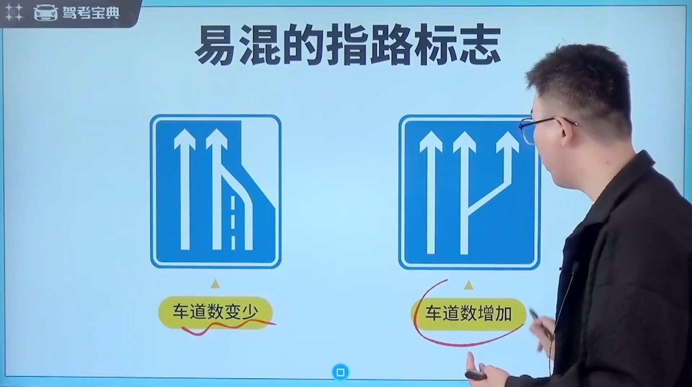
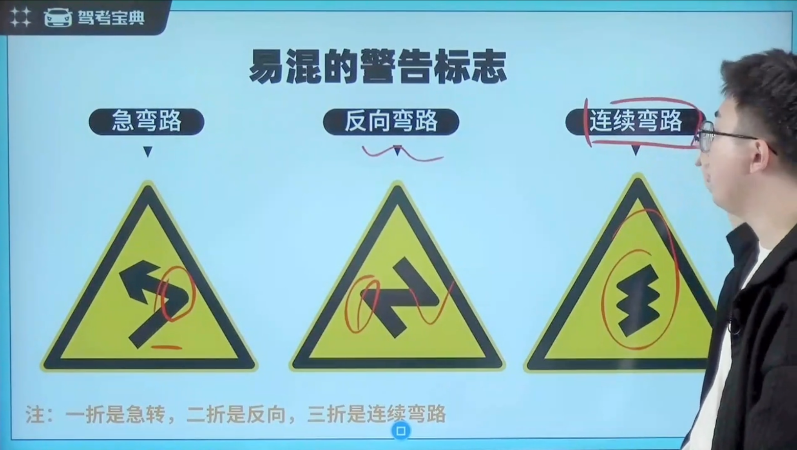
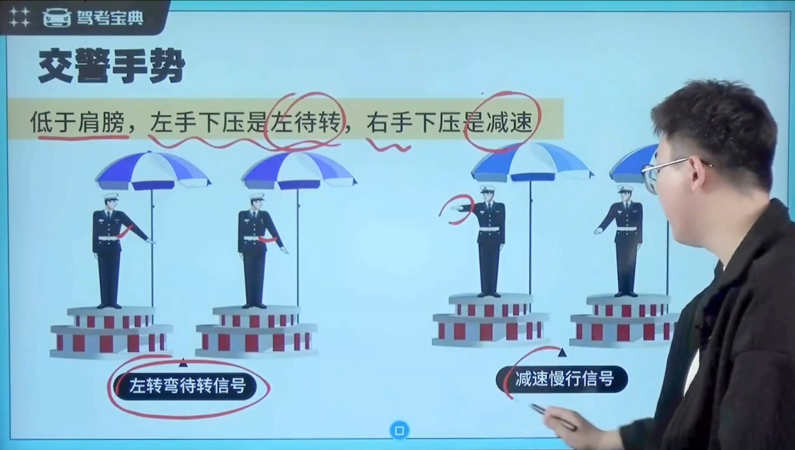
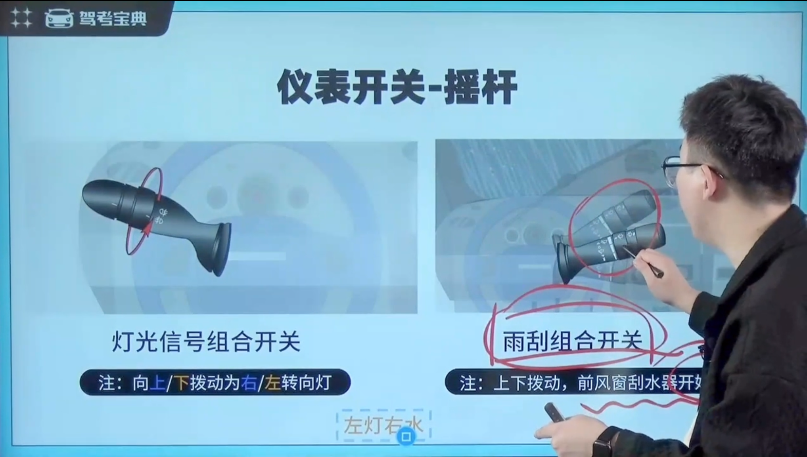
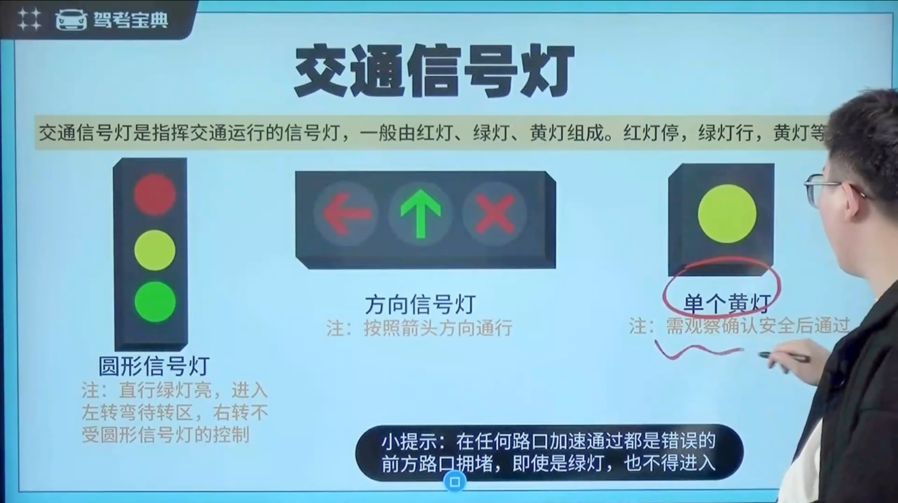

# 科目 1-信号开关类

## 一、交通标志

### 1.1 常见的指示标志

### 1.2 易混的指示标志

### 1.3 常见的指路标志

### 1.4 易混的指路标志

### 1.5 常见的高速公路指路标志

### 1.6 易混的高速公路指路标志

### 1.7 易混的警告标志

### 1.8 常见的禁令标志

### 1.9 易混的禁令标志

### 1.10 易混的标志

红高蓝底黄建议

## 二、交通标线

### 2.1 常见的标线

白低黄高

### 2.2 易混的标线

## 三、交警手势

### 3.1 停车和直行

### 3.2 左转和右转

### 3.3 左待转和减速

### 3.4 变道

## 四、仪表开关

### 4.1 需要手动开启的灯光

### 4.2 故障指示灯

### 4.3 其他指示灯

### 4.4 车内开关

### 4.5 速度相关

### 4.6 摇杆

### 4.7 启动开关

## 五、交通信号灯

