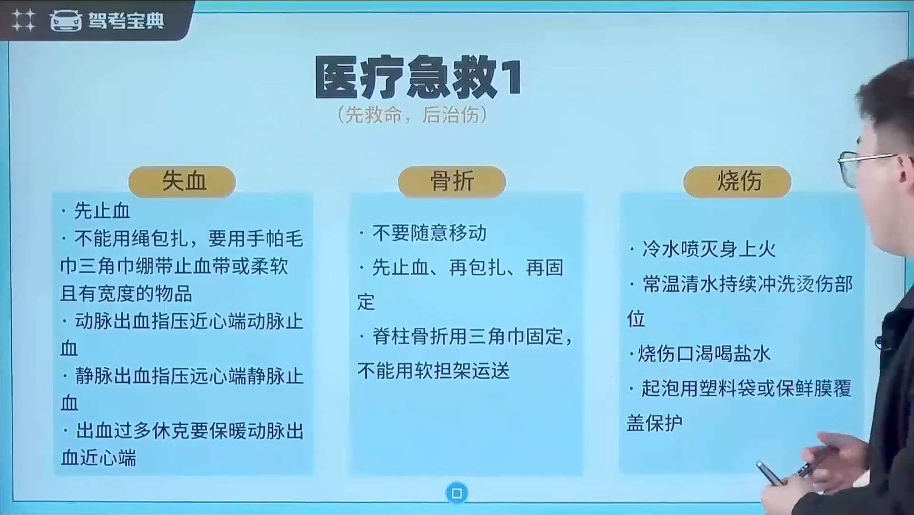
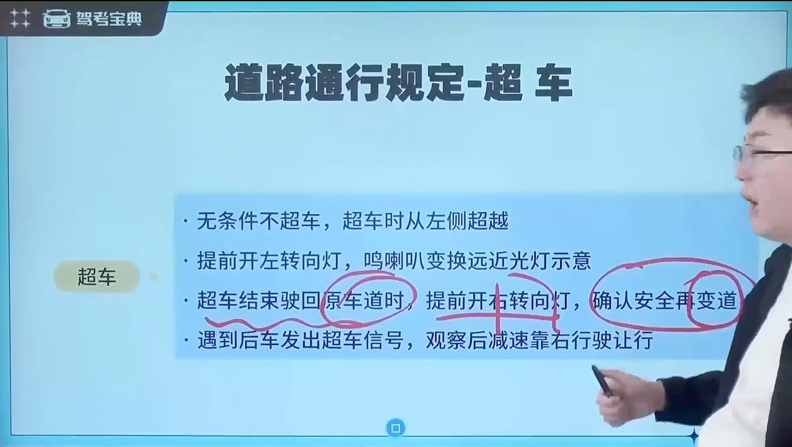

# 科目 1-通行常识类

## 一、意外事故处理

### 1.1 车辆故障

### 1.2 事故判断

### 1.3 爆胎专题

### 1.4 综合措施

## 二、现场医疗急救

### 2.1 医疗急救

### 2.2 危险化学品

## 三、行车安全常识

### 3.1 ABS

### 3.2 停车视距

### 3.3 综合规定

## 四、通行原则

### 4.1 道路通行规定

#### 4.1.1 基础规则

#### 4.1.2 会车

#### 4.1.3 超车

#### 4.1.4 禁止超车

#### 4.1.5 综合通行规定

### 4.2 速度

#### 4.2.1 高速公路

#### 4.2.2 普通公路

#### 4.2.3 不能超过 30 的情况

特殊路段、特殊天气、特殊情况

#### 4.2.4 优先级

#### 4.2.5 高速公路及车距

### 4.3 灯光

#### 4.3.1 转向灯

#### 4.3.2 综合规定

### 4.4 特殊道路天气

#### 4.4.1 特殊天气

#### 4.4.2 特殊道路

### 4.5 文明驾驶

#### 4.5.1 行车注意事项

#### 4.5.2 综合规定

