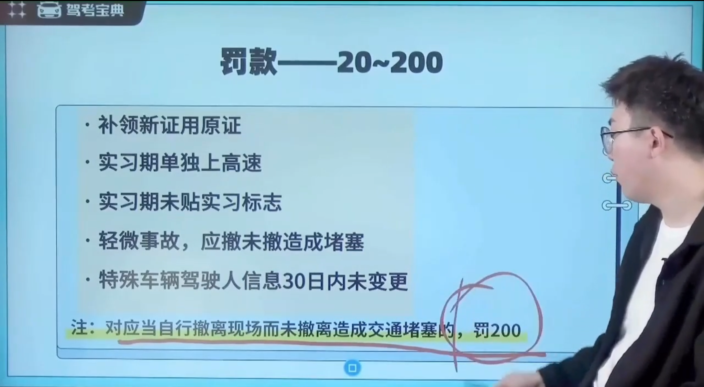

# 科目 1-交通法规类

## 一、驾驶证相关知识

### 1.1 驾驶证类型

### 1.2 驾驶证的申请条件

### 1.3 有效期、实习期

### 1.4 两证两标一号牌

### 1.5 不得申请的情况

### 1.6 吊销、撤销、注销

口诀：

- 假 1 、吊 2 、撤 3 、醉 5 、逃终生
- 拼装、报废、超 50%，200-2000，吊驾照

### 1.7 补领和换领

### 1.8 变更登记

## 二、责任判定

### 2.1 危险驾驶罪

### 2.2 交通肇事罪

### 2.3 交通肇事刑期

## 三、扣分

### 3.1 记分分值

### 3.2 记分规则

### 3.3 记分减免

## 四、罚款

### 4.1 20-200

### 4.2 200-500

### 4.3 200-2000

### 4.4 1000-2000

### 4.5 2000-5000

