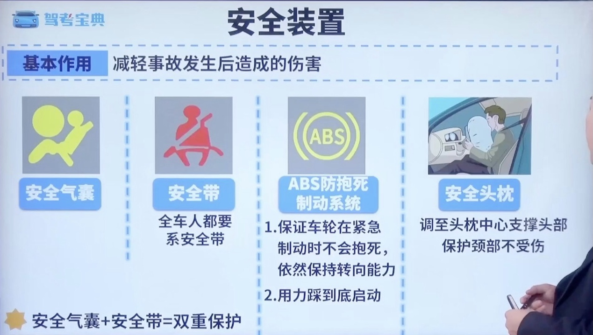

# 科目 4-事故相关类

## 一、事故案例分析

## 二、责任判定

### 2.1 常见违法行为

### 2.2 保险免责情况

### 2.3 交通肇事罪

### 2.4 责任比例

## 三、事故处理

### 3.1 故障处理

### 3.2 交通事故判定

### 3.3 意外事故处理

### 3.4 爆胎专题

### 3.5 安全装置

## 四、现场急救

### 4.1 现场医疗急救

### 4.2 危险化学品

## 五、速度规定

### 5.1 不得超过 30 的情况

### 5.2 有无中心线速度

### 5.3 速度优先级

### 5.4 高速公路速度

### 5.5 高速公路低能见度速度

