# 科目 4-常识类

## 一、道路通行原则

## 1.1 超车

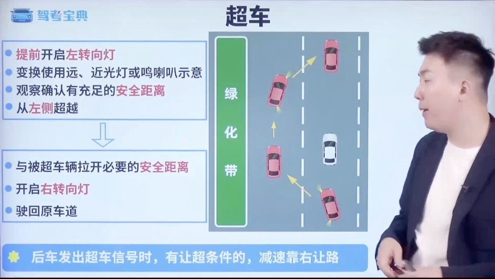
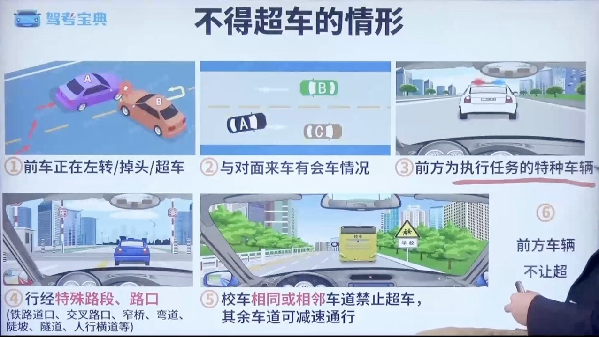

## 1.2 会车

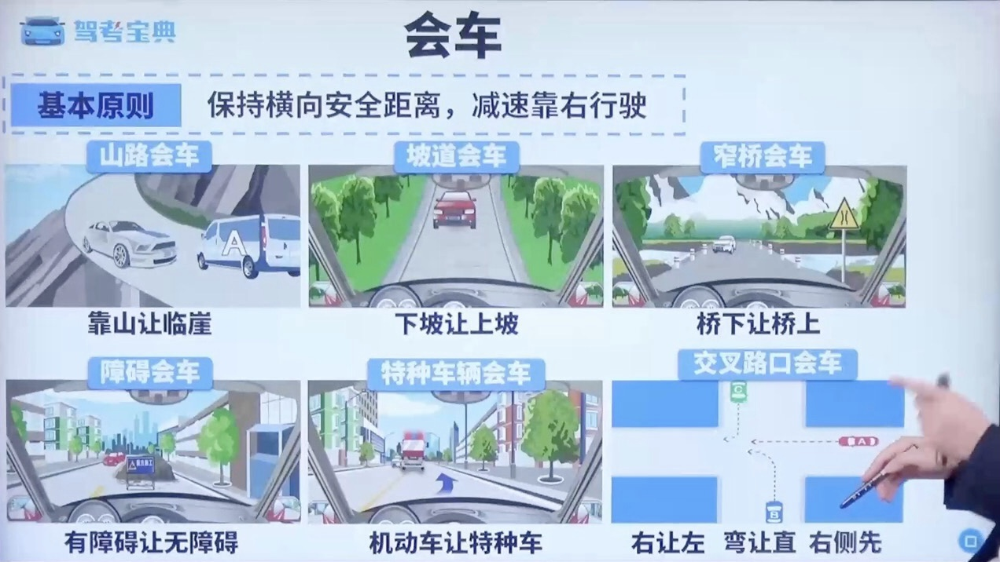

## 1.3 跟车

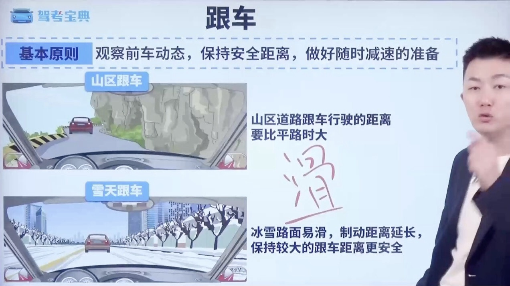

## 1.4 倒车

## 1.5 掉头

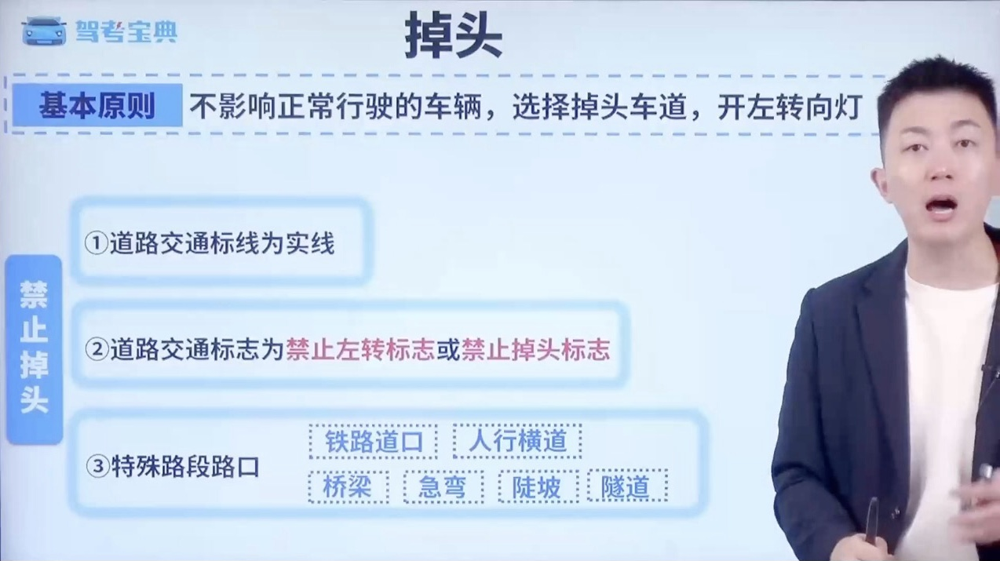

## 1.6 变道

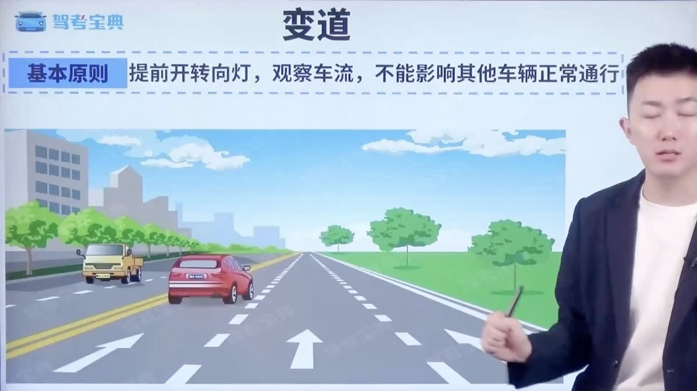

## 1.7 停车

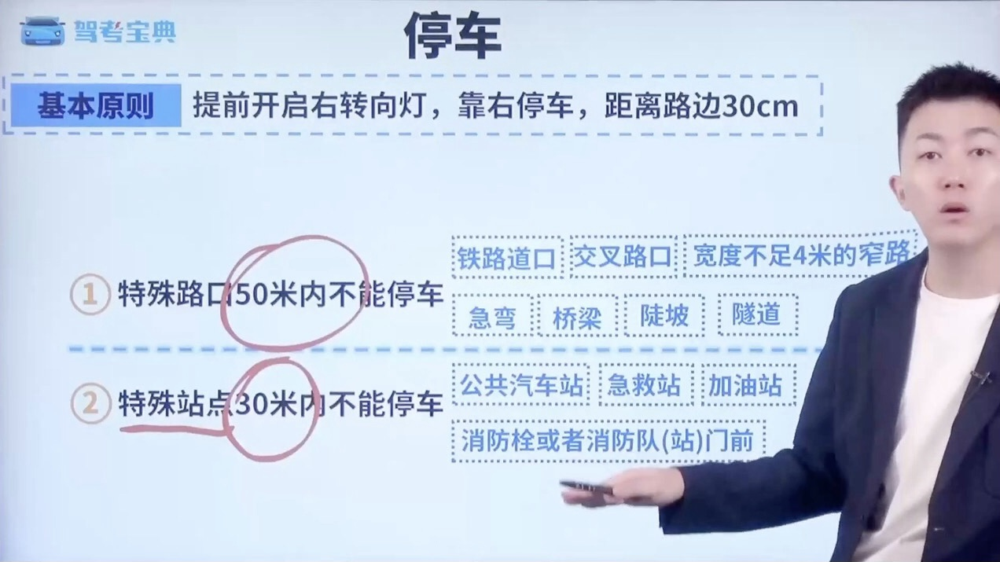

## 二、特殊道路天气

### 2.1 特殊道路通行规定

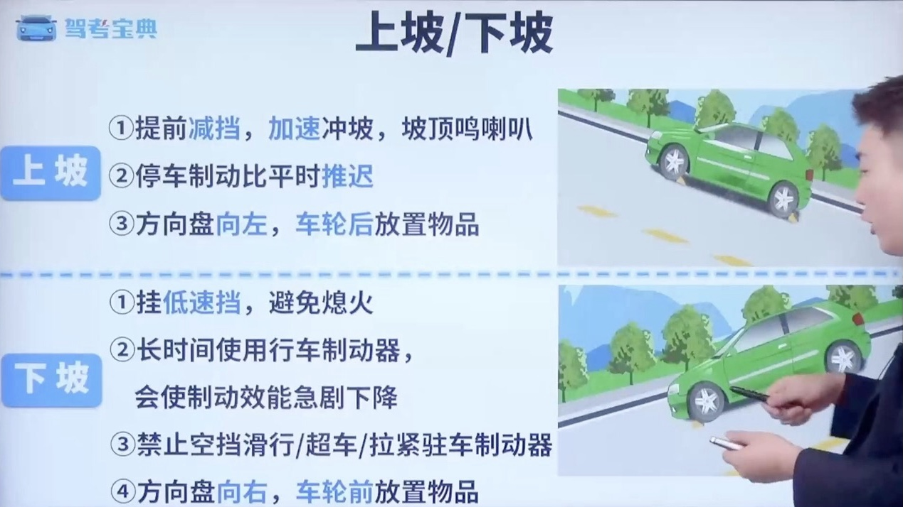

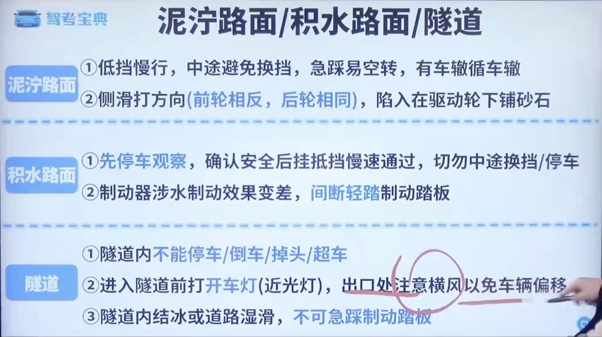

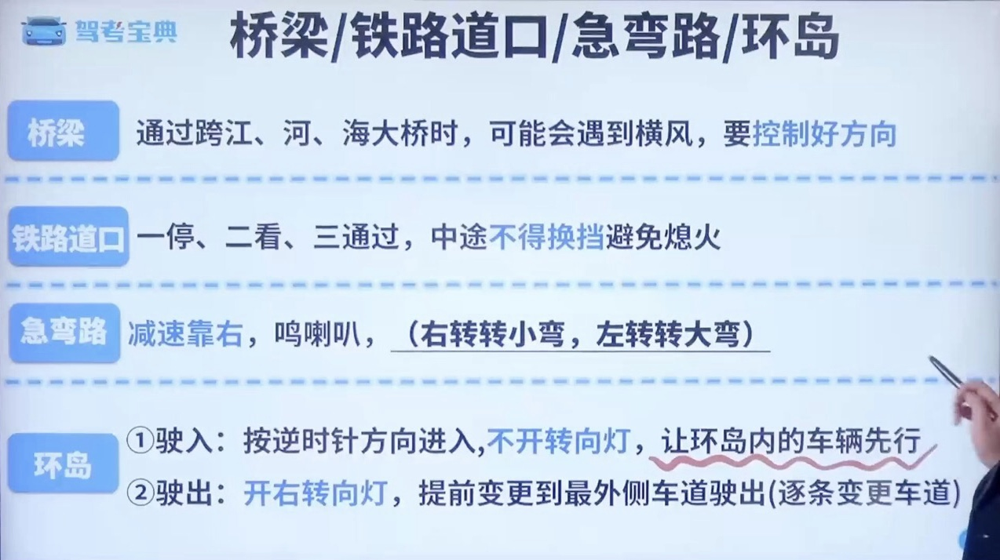

### 2.2 特殊天气通行规定

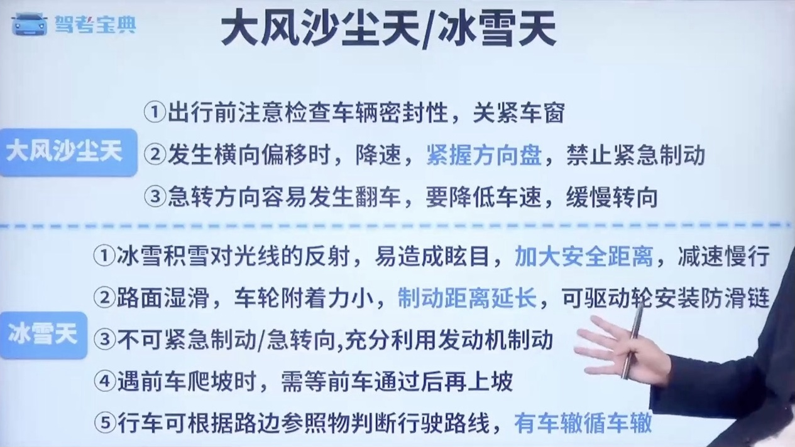

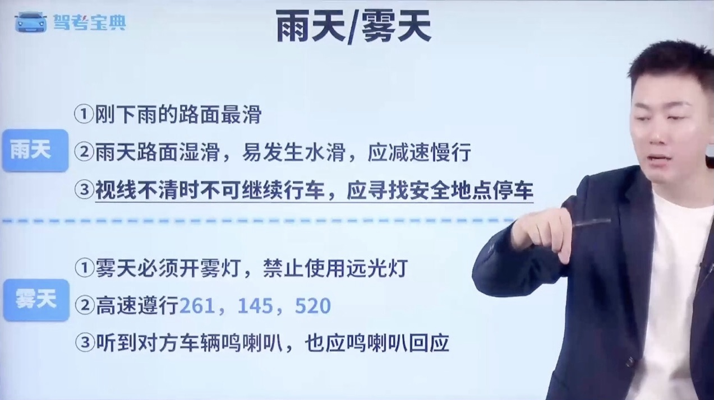

## 三、灯光使用

### 3.1 特殊道路灯光

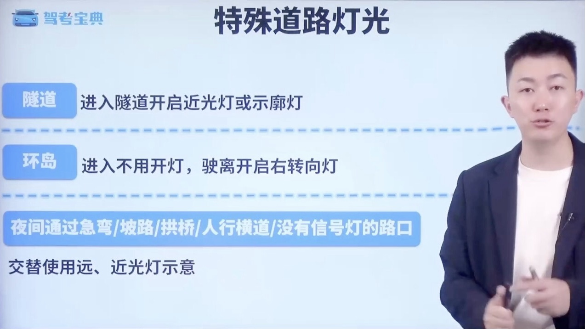

### 3.2 特殊天气灯光

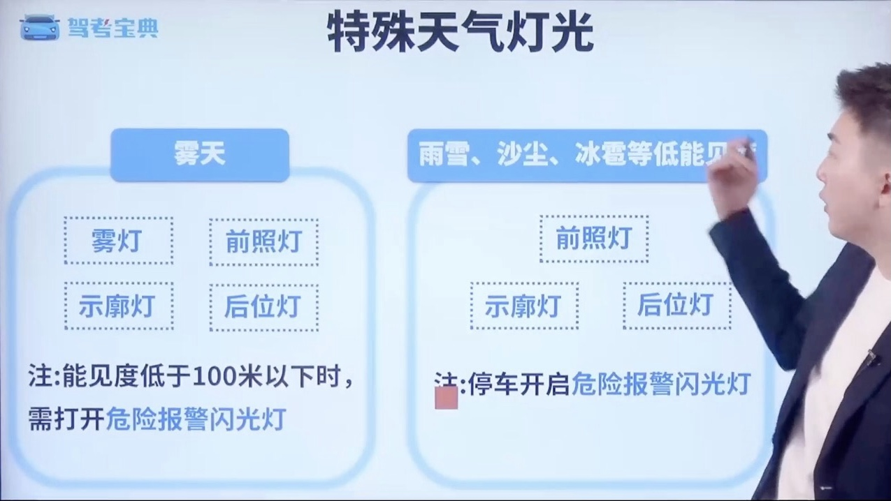

### 3.3 特殊情况灯光

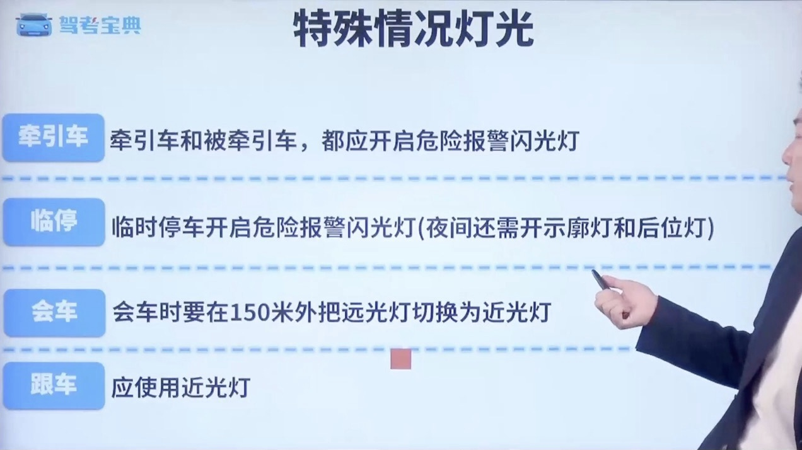

### 3.4 灯光距离判断

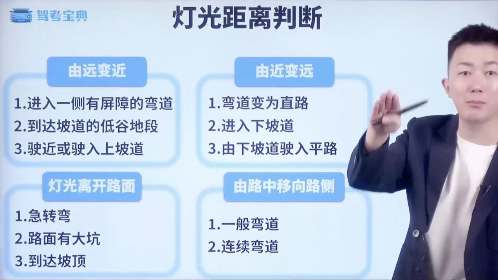

## 四、文明驾驶

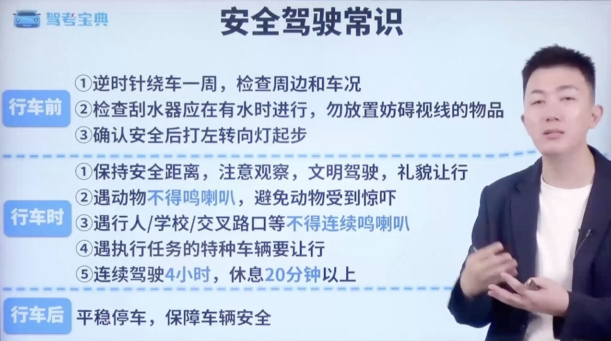
