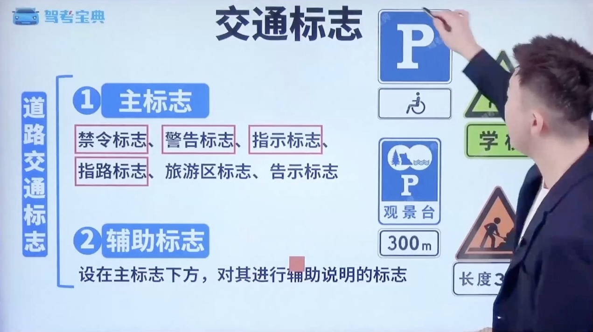
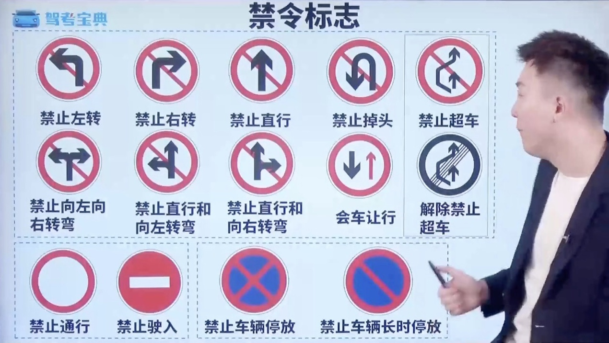
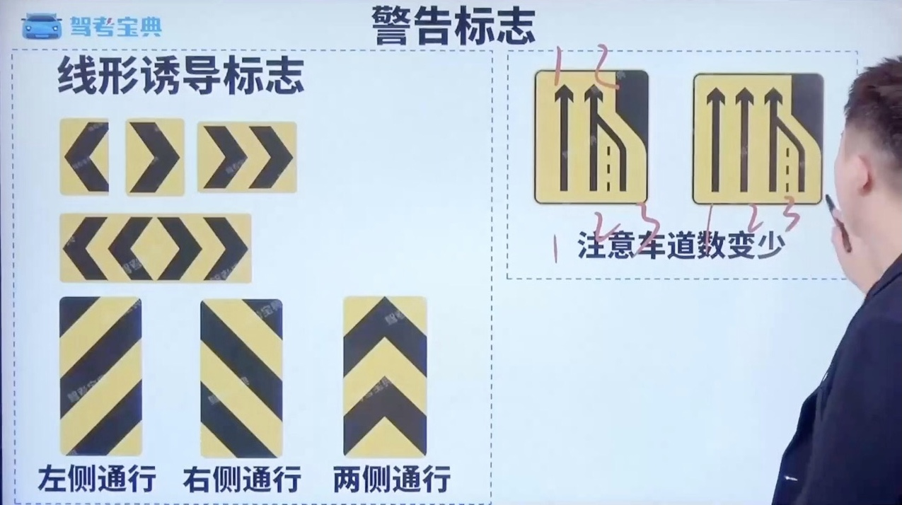
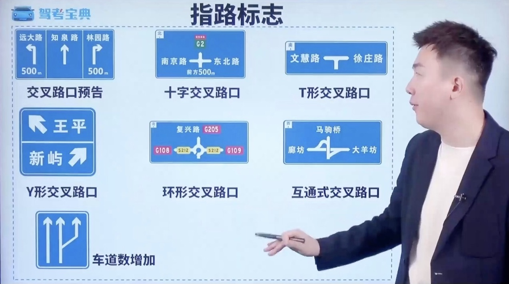

# 科目 4-图标类

## 一、交通标志

### 1.1 标志含义

### 1.2 禁令标志

### 1.3 警告标志

### 1.4 指示标志

#### 1.4.1 常见指示标志

#### 1.4.2 易混标志

#### 1.4.3 指路标志

### 1.5 旅游区标志

### 1.6 告示标志

## 二、交通标线

### 2.1 标线分类

### 2.2 常见标线

### 2.3 易混标线

## 三、交通信号灯

### 3.1 圆形信号灯

### 3.2 箭头信号灯

### 3.3 车道信号灯

## 四、交警手势

## 五、仪表指示灯

