# 开店以及设置

## 准备工作

### 实名抖音号

开店必须要绑定一个已实名的抖音号，而每个身份证只能用于实名一个抖音号。

如果你的身份证之前实名在一个没什么用的小号上，那就开店前注销掉。

抖音号注销有 7 天的反悔期，7 天后，这个身份证就会自动解绑。

如果你不小心给刚刚钱包实名了，那又要等 2 天才能注销。也就是说最多等 9 天才能拿到实名。

### 营业执照

有条件的还是在本地办理营业执照，因为网上代办是有几率被查到，这样就会影响店铺。网上代办的营业执照一定要带打假服务。

### 一个干净的 IP

可以用[天翼云电脑](https://www.ctyun.cn/h5/auth/)或者阿里云电脑，来注册店铺。

在日常运营时，可以使用子账号。一个 IP 只能有一个主账号，但可以有多个子账号。

以防出错，可以一个云电脑管理一个店铺，成本高了一点，但干净稳定。家里的电脑就用来登录不同店铺的子账号。

## 店铺设置

### 店铺基础

- [抖店官网](https://fxg.jinritemai.com/)，注册流程不具体说了，就是填资料。
- 在**店铺-资质中心-行业资质**中，选择“女装”，然后缴纳 2000 [保证金](https://school.jinritemai.com/doudian/web/article/101816)。
- 在**店铺-店铺信息设置-店铺设置**中，开通所有的支付方式，其中微信要二次签约。注意，管家账户和先用后付不用开通。
- 在**店铺-经营账号管理-店铺官方账号**中，绑定已经实名的抖音号。一定要注意提前弄好实名账号。
- 在**店铺-子账号管理-岗位管理**中，设置一个全部权限的岗位，然后用邮箱账号设置一个店铺的子账号并使用该岗位。
- 在**订单-物流工具-地址库管理**中，新增地址，地址填上家打单发货地址，联系人填自己店铺名，电话填自己的电话。
- 在**订单-物流工具-运费模板**中，新增运费模板，除了港澳台、新疆、西藏，其他全部包邮。新疆西藏也可以送，但要加 15 元运费。
- 在**店铺-店铺装修**中，等上货一定数量后使用一键智能装修。
- 在**店铺-商家保障中心**中，可以开通运费险，这样会增加曝光，但是会增大退货率。后续运费险很高的话，五六块的样子，可以把运费险关掉，在客服设置里开场白文案中说明“七天无理由退换货”。

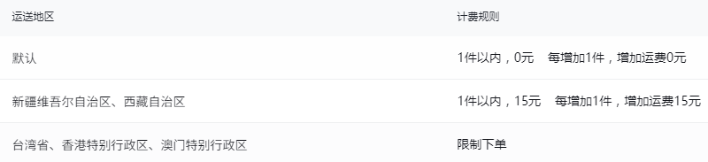

### 飞鸽客服设置

店铺后台右上角有个“接待”，点击它。然后再点击“客服管理”。

- **个人设置-基础设置**，消息提醒里的通知都打开，声音自己选。
- **自动化设置-常见问题**，在开场白文案里添加 7 天无理由的文案，运费险如果关了也告知一下客人。
- **自动化设置-自助服务**，除了“疫情延迟发货通知”，其他全部打开。
- 飞鸽机器人暂时不要开，可能会卡消息，导致消息接收不及时。
- **客服工具-在线客服设置**，会话超时设置为 360 分钟，原因是不让弹出服务评价。
- **分流排队-访客分流**，基础分流规则里的分配客服全部设置成那个子账号。主账号只用来服务授权。
- **分流排队-规则设置**，设置组/账号不接受分流，把主账号设置为不分流，离线留言预警启动并设置为子账号。

## 相关软件

- 智能店长——上架产品
- 店管家——用来对接福利品，动销发的礼品
- 超群打单——用来对接真实订单发货、
- 小抖商家助手——开活动（限时限量购、拼团、生成二维码补单）

## 智能店长

先在[抖店服务市场](https://fuwu.jinritemai.com/)里搜索“智能店长\_开店必备”，购买高级版就够用了。

在抖店服务市场的“已购服务”里打开智能店长，用主账号授权登录，进入商品上货，右上角有个“搬家配置”。

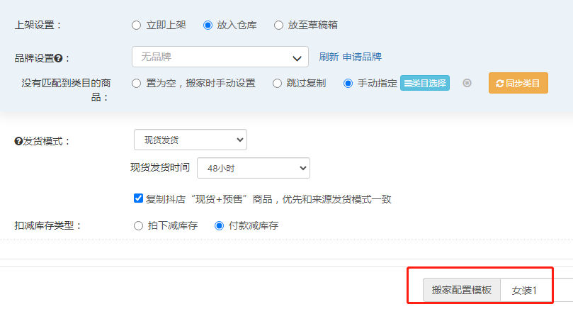
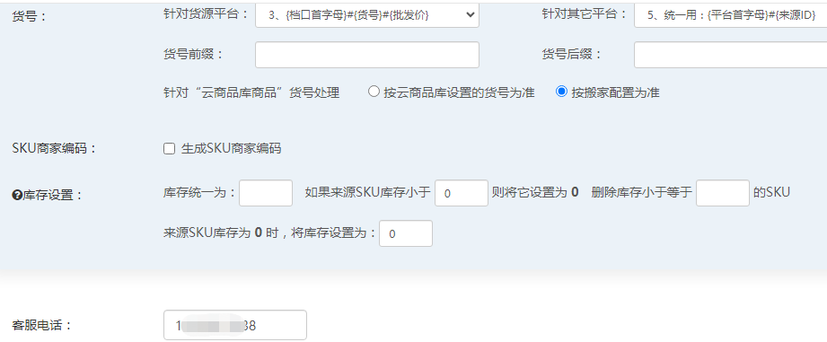
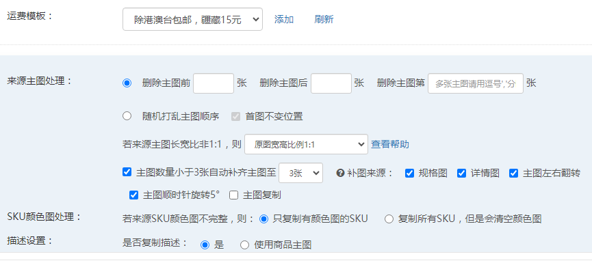
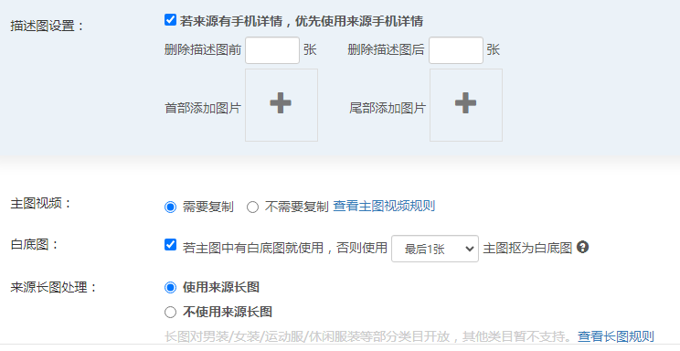
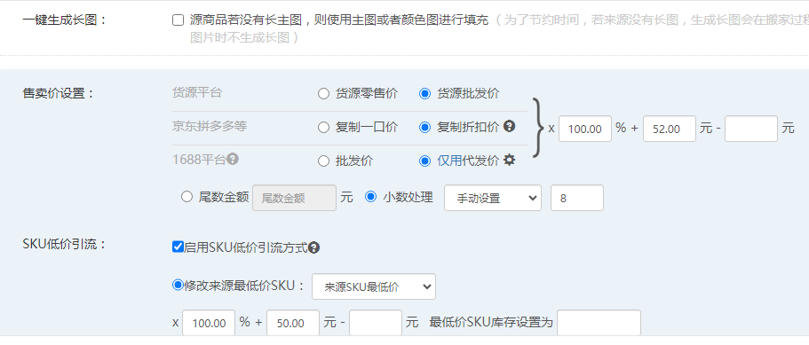
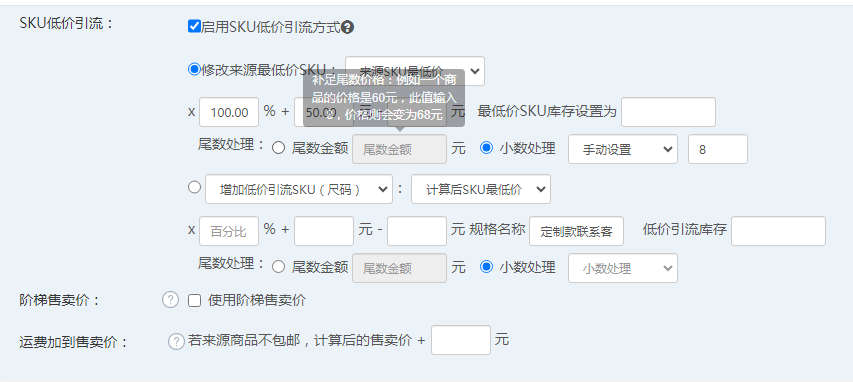
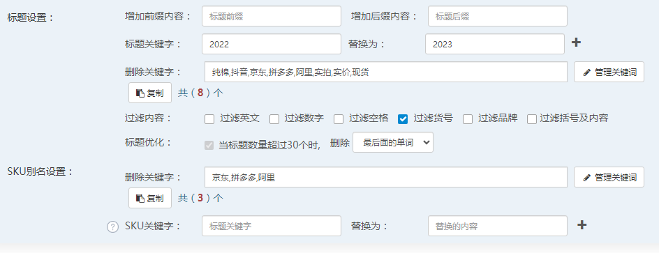
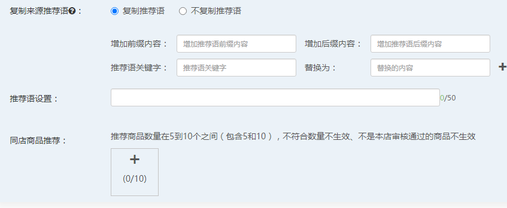
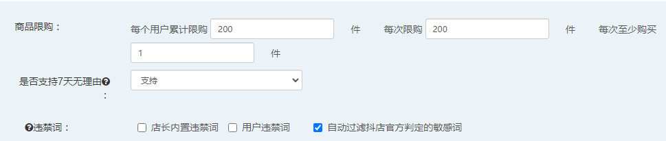
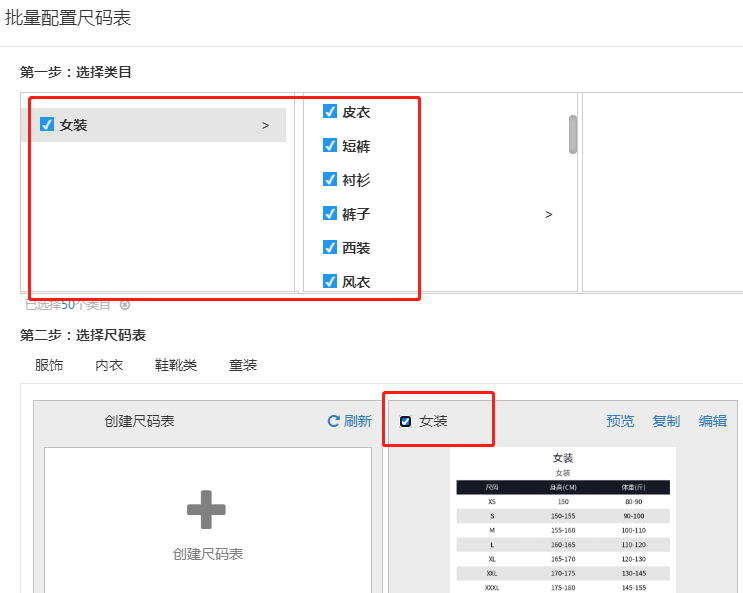
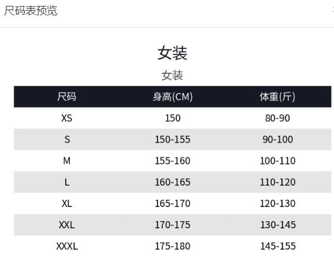

## 超群设置

流程：

- 先在服务市场购买“超群打单”，然后点进去使用，进去的时候绑定的手机号必须是上家的，不然到时候还要联系官方解绑。
- 绑定好后，上家会开通一个子账号给我们使用，我们点击“商品-商品下载绑定”。
- 进入页面后，将要发货的订单 ID 号复制到那个搜索框进行搜索。
- “替换商品编码”这一栏，比如档口是“大时代 1 楼 110”以及货号是 8098，那么这一栏应该填写成“DSD1F/110-8098”。这个货号是搜款网上该档口的商品的货号。例如“国投 3 楼 343-C”以及“3977 实拍现货”改为“GTOU3F/343-C-3977”。例如“”以及
- “拿货价”按搜款网的价格进行填写，如果有很多 SKU，那么在第二栏有个按钮，点击它将所有的 SKU 价格都填进去。
- 需要拿货的订单，在抖音订单管理里面将该订单打上一个黄色旗帜(第 3 个)。
- 然后点击“订单-打单发货”，在“备注旗帜”里选择黄色旗帜，查看这些待拿货的订单。上家会点击“打标签”用这个标签去档口拿货，拿货回来他们会点击“订单-标签扫码发货”进行一个发货。

常见问题：

- 如果客户修改地址，没发之前，你要在你的店铺后台去修改地址，如果发了，那就通知上家去联系快递修改地址。
- 如果客服修改款式规格，要去超群里对应订单修改它的“规格”，手动修改。
- 没拿到货的，上家会反馈。要下架的就下架，超时的让上家预发货。
