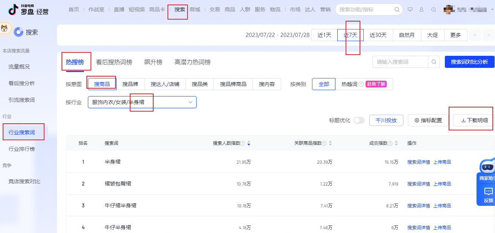
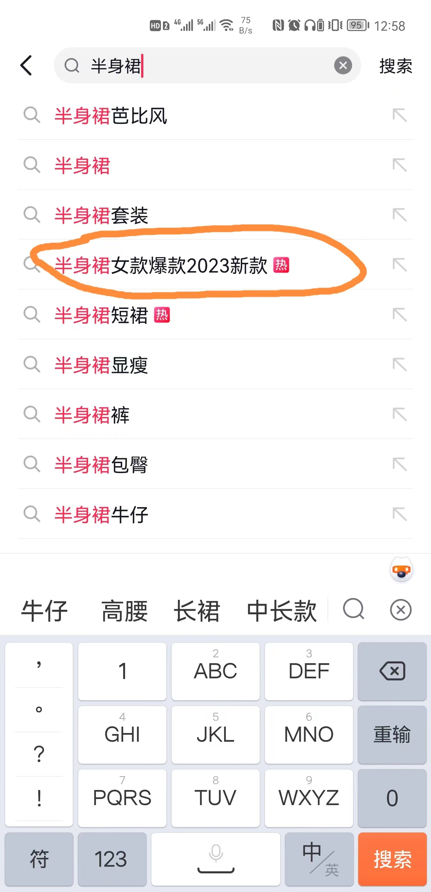
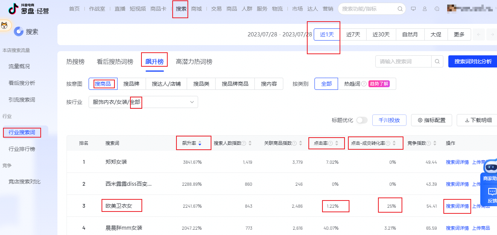
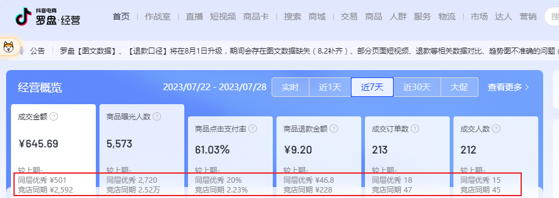
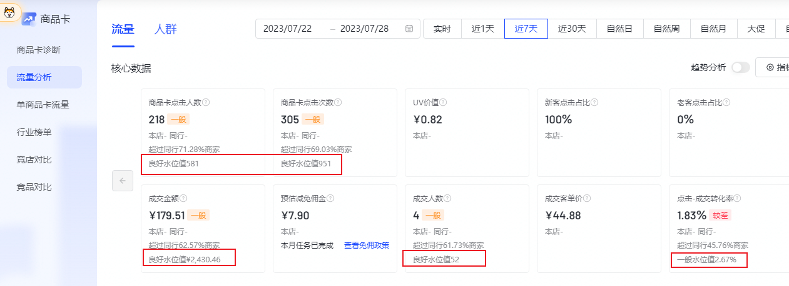
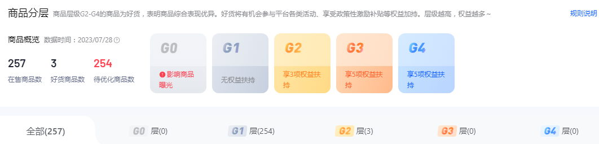

# 店铺运营

## 搜索玩法

### 组标题(长和短)

关键词表：

1. 进入[电商罗盘](https://compass.jinritemai.com/shop)，在顶部点击“搜索”，在左侧点击“**行业搜索词**”，点击“**近 7 天**”，点击“**热搜榜**”，“按意图”选择“**搜商品**”，“按行业”选择我们做的**子**类目。
2. 点击“下载明细”，打开下载好的表格，只留**搜索人数指数**、**点击率**、**点击成交转换率**、**竞争指数**。新建一列“核心竞争力”
3. 计算核心竞争力，公式是`搜索人数指数 * 点击率 * 点击成交转换率 / 竞争指数`，也就是输入`=B2*C2*D2/E2`回车，这个单元格右下角连点两下。最后按照竞争指数进行降序排序。

组词：

1. 从“关键词表”挑一个词输入到抖音商城的搜索框里，不要点“搜索”，它会出现一个下拉框。从下拉框里面挑一个带有“热”标签的关键词（平台正在推的词）。
2. 把这个正热的关键词放到我们标题的开头，然后从“关键词表”里挑出符合我们商品的关键词，将它们放到我们标题剩余位置。
3. 保证开头和结尾是大词，也就是“半身裙”或“百褶裙”这种（卫衣、上衣、外套、连衣裙、沙滩裙等等）。

导购短标题：

1. 不要用系统的一键智能生成。
2. 我们的导购短标题要是：`大词+人群词+属性词`

### 借势——趋势词

追趋势：

1. 仍然是“**行业搜索词**”，点击“**近 1 天**”，点击“**飙升榜**”，“按意图”选择“**搜商品**”，“按行业”选择我们做的**一级**类目。
2. 按飙升率排序，再看**点击率**、**点击成交转换率**，要确保有成交转换。
3. 然后点击“搜索词详情”，查看近期情况，只有一天并且担心第二天数据掉了，那可以再观察一两天数据情况。
4. 拿这个趋势词去组标题，或者围绕这个词去选新品。

## 推荐玩法

### 前提

体验分大于 65 分，宝贝产生销量。

关于体验分：

- 有效订单 30 单就能出分
- 自己做福利品，150 单左右，但是出单很慢。
- 找服务商选 150 个品就破 0 动销（进精选用抖客做），第一天做 60 个品，第二天做 90 个品。
- 找服务商，它们会上一个福利，用千川投流做，一天就能做完，第二天出分。200 单有 80 分。

### 赛马机制

新店通病：流量特别容易卡死或者下跌。

抖音小店有个推流机制：层级水位线，这是赛马机制。

层级：容器，只决定流量的上限，不决定流量的下限。

GMV 销售额：

1. 每天上传一个过账款，也就是补坑产。
2. 给一个炮灰链接设置一个大额满减券。营销-优惠券-自有渠道券，指定商品满减券，金额比如满 3000 减 50。每人限领 1 张。
3. 这个券有个推广，打开有个二维码。让朋友用抖音扫码，通过这个优惠券下单付款。
4. 抖店不稽查未发货订单，我们不发货，让朋友第二天申请退款。
