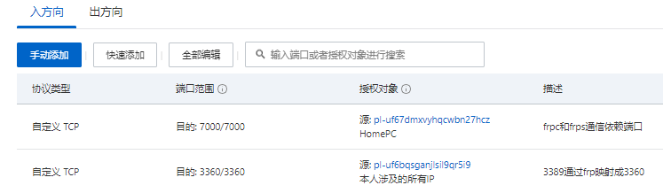

# Frp 实现内网穿透

## 云服务器

暂时使用的是[阿里云](https://www.aliyun.com/)的[云服务器 ECS](https://www.aliyun.com/product/ecs)，轻量应用服务器、ECS 通用型、ECS 共享型都可以。

[搬瓦工](https://bandwagonhost.com/)和[vultr](https://www.vultr.com/)也可以。

## 使用 frp

### 下载 frp 到服务端

在阿里云的[云服务器 ECS 控制台](https://ecs.console.aliyun.com/)里，我们点击云服务器的**远程连接**，进入服务端控制台。

输入`cd /usr/local`进入个人默认的程序安装路径，输入`arch`查看处理器的架构，根据这个架构去[frp 的 GitHub](https://github.com/fatedier/frp/releases)里选择合适的版本。

由于是`x86_64`所以我们选择 amd64 版本，输入`wget https://github.com/fatedier/frp/releases/download/v0.35.0/frp_0.35.0_linux_amd64.tar.gz`将 frp 下载到服务端。如果`/usr/local`里已经有了 frp，是可以输入`rm -rf frp`进行删除的。

输入`tar -zxvf frp_0.35.0_linux_amd64.tar.gz`对 frp 的压缩包进行解压，输入`rm frp_0.35.0_linux_amd64.tar.gz`对压缩包进行删除（输入`yes`确认删除），输入`mv frp_0.35.0_linux_amd64 frp`对解压出来的文件夹进行重命名。

```txt
cd /usr/local
wget https://github.com/fatedier/frp/releases/download/v0.35.0/frp_0.35.0_linux_amd64.tar.gz
tar -zxvf frp_0.35.0_linux_amd64.tar.gz
rm frp_0.35.0_linux_amd64.tar.gz
mv frp_0.35.0_linux_amd64 frp
```

### 配置服务端里的 frp

输入`cd frp`进入服务端的 frp，输入`rm frpc`、`rm frpc.ini`和`rm frpc_full.ini`是为了删除客户端的东西，在服务端是用不着的。

要配置一下 frps.ini。输入`vim frps.ini`，再输入`i`进入输入模式，输入以下内容：

```txt
[common]
bind_port = 7000
token = 88888888
dashboard_port = 7500
dashboard_user = admin
dashboard_pwd = admin
```

按 Esc 退出输入模式，输入`:wq`退出并保存。上面的`bind_port`是 frp 监听端口，`dashboard_port`是控制页面对应端口，`token`是服务端与客户端通信的令牌，`dashboard_user`是进入控制页面的账户，`dashboard_pwd`是进入控制页面账户对应的密码。`dashboard_xxx`不是特别重要，最重要的是`bind_port`和`token`。

我们要让 frp 在服务端开机自运行。输入`vim /etc/systemd/system/frps.service`，再输入`i`进入输入模式，输入以下内容：

```txt
[Unit]
Description=frps daemon
After=syslog.target  network.target
Wants=network.target

[Service]
Type=simple
ExecStart=/usr/local/frp/frps -c /usr/local/frp/frps.ini
Restart=always
RestartSec=1min

[Install]
WantedBy=multi-user.target
```

按 Esc 退出输入模式，输入`:wq`退出并保存。最后输入`systemctl start frps && systemctl enable frps`就设置好了开机启动。

可以让服务端停止后再启动，然后输入`netstat -tanlp`查看进程（杀进程使用`kill -9 xxx`）。

```txt
# 刷新服务列表
systemctl daemon-reload
# 设置开机自启
systemctl enable frps
# 关闭开机自启
systemctl disable frps
# 启动服务
systemctl start frps
# 停止服务
systemctl stop frps
```

### 配置客户端里的 frp

去[frp 的 GitHub](https://github.com/fatedier/frp/releases)里选择相应的版本，比如 windows 我们暂时使用的是`frp_0.35.0_windows_amd64.zip`，下载解压到本地某个目录下，删除`frps`、`frps.ini`和`frps_full.ini`与客户端无关的文件。使用文本编辑器打开`frpc.ini`编辑如下

```txt
[common]
server_addr = 139.224.248.233
server_port = 7000
token = 88888888

[rdc]
type = tcp
local_ip = 127.0.0.1
local_port = 3389
remote_port = 3360
```

上面的`server_addr = 139.224.248.233`是 frps 服务端所在的云服务器的公网 IP（阿里云 ECS 实例公网 IP）；`server_port = 7000`是 frps 服务端所依赖的端口，frpc 和 frps 之间的连接就依赖于这个`7000`端口；`token = 88888888`是 frpc 和 frps 之间的通信令牌，在 frps 也同样设置过了；`[rdc]`是自定义名字；`type = tcp`是因为我们使用[RD Client](https://docs.microsoft.com/zh-cn/windows-server/remote/remote-desktop-services/clients/remote-desktop-clients)，它是 tcp 类型的；`local_ip= 127.0.0.1`是本地机器 IP（暂时就填默认的`127.0.0.1`）；`local_port = 3389`是你要映射本地机器的哪个端口，因为要使用 RD Client，所以是`3389`端口；`remote_port = 3360`表示将本地的那个端口要映射到远程 frps 所在服务器的哪个端口，总的来说就是将本地的`3389`端口映射到`139.xxx.xxx.xxx`的`3360`端口。

我们需要在电脑开机时自动运行客户端的 frp。在 frp 目录下新建 startfrpc.bat 批处理文件，使用文本编辑器打开并编辑：

```txt
@echo off
:: 定义WIFI名称
set wifi_name=TP-LINK_602
:: 连接WIFI，查看当前连接信息，并且是否是wifi_name
(netsh WLAN show interfaces | findStr %wifi_name% >nul) || (
    :: ||表示否则，意味着当前连接不是wifi_name，那就netsh wlan connect连接wifi_name
    netsh wlan connect ssid=%wifi_name% name=%wifi_name%
)
:: 延迟2秒
timeout /t 2 /nobreak
:: 得确保联网后再运行frpc，看是否已经启动了frpc，>nul表示前面这句信息不输出到cmd框
(tasklist|findstr "frp" >nul) || (
    :: 没有启动frpc，就在这启动frpc，||表示否则
    d:\frp_0.35.0_windows_amd64\frpc.exe -c d:\frp_0.35.0_windows_amd64\frpc.ini
)
```

我们将 startfrpc.bat 加入到任务计划程序。打开电脑的“任务计划程序”，选择右侧的“创建任务...”。

- 在常规这个页签里，名称填为“frpc”，然后勾上“不管用户是否登录都要运行”、“使用最高权限运行”、“隐藏”。
- 在触发器这个页签里，选择新建，然后开始任务选择“启动时”，可以自己选择是否重复执行以及间隔。
- 在操作这个页签里，选择新建，然后点击“浏览”选择前面创建的“start.bat”（D:\frp_0.35.0_windows_amd64\start.bat），最后在“起始于”里填写 start.bat 的父路径（D:\frp_0.35.0_windows_amd64）。
- 返回常规页签，然后点击确定，输入电脑登录密码，就完成了 frpc 的自启动。

### 给云服务器设置安全组

云服务器**内部**的 frps 依赖的`7000`可以不用管，因为你在服务器命令行里输入`firewall-cmd --state`，会发现阿里云服务器操作系统内的防火墙是默认关闭的，所以内部使用`7000`端口可以不用管了。如果你要放开云服务器本身的防火墙并添加`7000`端口，可以参考如下命令。

```txt
# 先查看防火墙状态
firewall-cmd --state
# 启用防火墙
systemctl start firewalld
# 停用防火墙
systemctl stop firewalld
firewall-cmd --zone=public --add-port=7000/udp --permanent
firewall-cmd --zone=public --add-port=7000/tcp --permanent
# 放行端口后要重新加载
firewall-cmd --reload
```

而**外部**想访问服务器以及它的一些端口，那就必须放开一些端口，这个是在[阿里云控制台](https://ecs.console.aliyun.com/)——网络与安全——安全组。frpc 所在机器想与云服务里的 frps 进行通信连接，需要开放云服务器安全组的`7000`给外部用；然后我们要使用 RDClient 进行远程桌面控制，通过 frp 将`3389`映射到云服务器的`3360`端口了，那么还需要开放云服务器安全组的`3360`给外部用。`7000`和`3360`开放给谁，也要限定好，不是谁想加就加的。



安全组的授权对象我们使用的是[前缀列表](https://ecs.console.aliyun.com/#/prefixList/cn-shanghai)

## 说在最后

使用 Frp 还是挺简单的，但是它的安全性还是有些差，功能上也只是反向代理、映射端口，如果想异地组网（虚拟局域网）那就不能使用 Frp 了，可以使用[SoftEther 实现虚拟局域网](./SoftEther实现虚拟局域网.md)
