# SoftEther 实现虚拟局域网

## 云服务器

暂时使用的是[阿里云](https://www.aliyun.com/)的[云服务器 ECS](https://www.aliyun.com/product/ecs)，轻量应用服务器、ECS 通用型、ECS 共享型都可以。

[搬瓦工](https://bandwagonhost.com/)和[vultr](https://www.vultr.com/)也可以。

## 使用 SoftEther

### 安装 SoftEther 到服务端

我们用浏览器打开[softether-download](http://www.softether-download.com/)网址，选择`SoftEther VPN Server`组件。我们使用的是阿里云云服务器 ECS，操作系统是 CentOS Linux，CPU 可以通过`cat /proc/cpuinfo`命令进行查询。在软件列表里选择一个你想要的版本，比如本人选择的是`v4.34-9744-beta`，右击它复制它的链接。

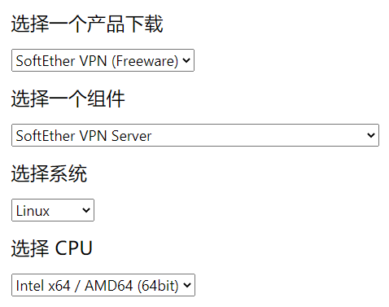

然后远程连接我们的 ECS（xShell 等工具连接），输入`cd /usr/local`进入个人默认的程序安装路径。然后输入`wget https://github.com/SoftEtherVPN/SoftEtherVPN_Stable/releases/download/v4.34-9744-beta/softether-vpnserver-v4.34-9744-beta-2020.03.20-linux-x64-64bit.tar.gz`将 SoftEther 下载到服务端（上一步复制的链接）。

输入`tar -zxvf softether-vpnserver-v4.34-9744-beta-2020.03.20-linux-x64-64bit.tar.gz`对 SoftEther 的压缩包进行解压，输入`rm softether-vpnserver-v4.34-9744-beta-2020.03.20-linux-x64-64bit.tar.gz`对压缩包进行删除（输入`yes`确认删除），最后留下的`vpnserver`文件夹就是 SoftEther。

输入`cd vpnserver`进入这个文件夹，再输入`make`进行编译安装，一路按`1`同意。

```txt
cd /usr/local
wget clone https://github.com/SoftEtherVPN/SoftEtherVPN_Stable/releases/download/v4.34-9744-beta/softether-vpnserver-v4.34-9744-beta-2020.03.20-linux-x64-64bit.tar.gz
tar -zxvf softether-vpnserver-v4.34-9744-beta-2020.03.20-linux-x64-64bit.tar.gz
rm softether-vpnserver-v4.34-9744-beta-2020.03.20-linux-x64-64bit.tar.gz
cd vpnserver
make
```

安装好 SoftEther 后，我们要让 SoftEther 在服务端开机自运行。输入`vim /etc/systemd/system/vpnserver.service`，再输入`i`进入输入模式，输入以下内容：

```txt
[Unit]
Description=vpnserver daemon
After=network.target

[Service]
Type=forking
ExecStart=/usr/local/vpnserver/vpnserver start
ExecStop= /usr/local/vpnserver/vpnserver stop

[Install]
WantedBy=multi-user.target
```

按 Esc 退出输入模式，输入`:wq`退出并保存。最后输入`systemctl start vpnserver && systemctl enable vpnserver`就设置好了开机启动。可以让服务端停止后再启动（重启），然后输入`netstat -tanlp`查看进程（杀进程使用`kill -9 xxx`）。

参考命令：

```txt
# 刷新服务列表
systemctl daemon-reload
# 设置开机自启
systemctl enable vpnserver
# 关闭开机自启
systemctl disable vpnserver
# 启动服务
systemctl start vpnserver
# 停止服务
systemctl stop vpnserver
```

### 给服务端设置安全组

云服务器**内部**的 SoftEther 依赖的`5555`可以不用管，因为你在服务器命令行里输入`firewall-cmd --state`，会发现阿里云服务器操作系统内的防火墙是默认关闭的，所以内部使用`5555`端口可以不用管了。如果你要放开云服务器本身的防火墙并添加`7000`端口，可以参考如下命令。

```txt
# 先查看防火墙状态
firewall-cmd --state
# 启用防火墙
systemctl start firewalld
# 停用防火墙
systemctl stop firewalld
firewall-cmd --zone=public --add-port=5555/udp --permanent
firewall-cmd --zone=public --add-port=5555/tcp --permanent
# 放行端口后要重新加载
firewall-cmd --reload
```

而**外部**想访问服务器以及它的一些端口，那就必须放开一些端口，这个是在[阿里云控制台](https://ecs.console.aliyun.com/)——网络与安全——安全组。外部的手机电脑想连接云服务器 SoftEther 的虚拟网络，必须开放`500`和`4500`。至于`5555`那是内部用的，跟外部使用无关。`500`和`4500`开放给谁，也要限定好，不是谁想加就加的。

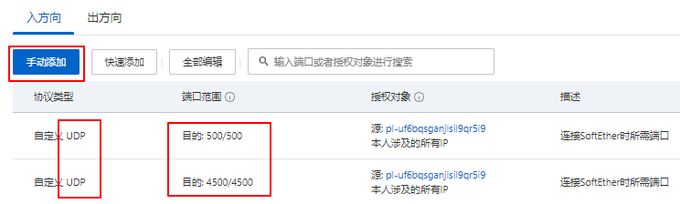

安全组的授权对象我们使用的是[前缀列表](https://ecs.console.aliyun.com/#/prefixList/cn-shanghai)

### 远程管理工具

在云服务器里对 SoftEther 服务进行配置管理是相当的不方便，SoftEther 官方给我们提供了一个远程管理工具。比如我在家里的 windows 系统上使用“远程管理工具”，对云服务器里的 SoftEther 服务进行管理，这就比较类似于本地使用 XShell 管理云服务器。

我们用浏览器打开[softether-download](http://www.softether-download.com/)网址，选择`SoftEther VPN Server Manager for Windows`组件（如果你 MAC 就选择 MAC 版），安装的时候一定要选择“仅限管理工具”（因为 Server 已经在云服务器上安装好了，本地机器就不用再安装了）。

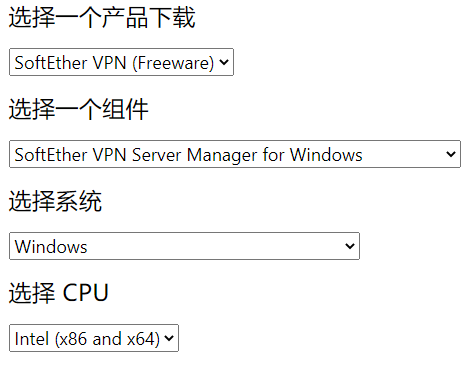  
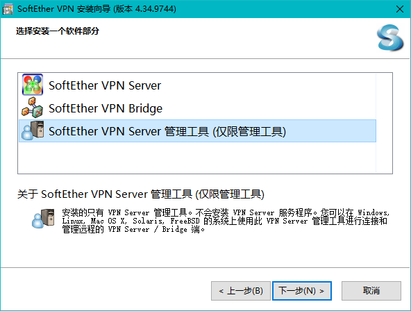

安装好后，它会自动打开`SE-VPN Server Manager (Tools)`，然后我们选择“新设置”

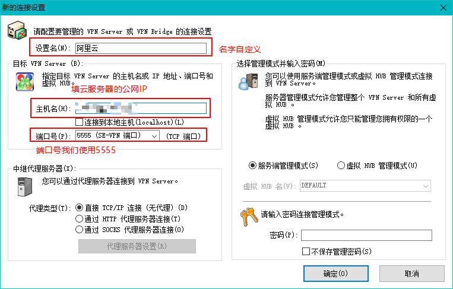

新设置创建好后，我们对它进行“连接”，第一次进入，如果在云服务器 SoftEther 服务端里没有设置过管理员密码（上一小节我们并没有设置，所以放到这里进行设置），则会在该远程管理工具里弹出管理员密码设置弹框。

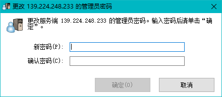

管理员密码设置过后，会弹出“SoftEther VPN Server 简单安装”，我们直接关闭这个界面，意思是我们进行手动配置。

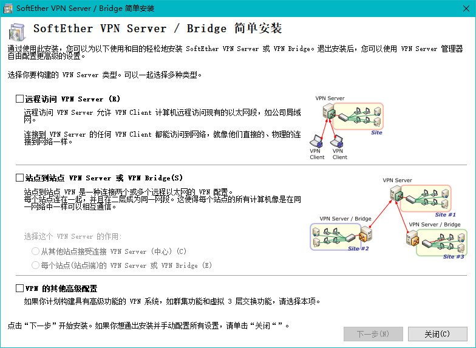

接下来会让你进行“IPsec/L2TP 设置”，这个会涉及到客户端连接 SoftEther VPN（也就是手机或电脑连接 VPN）。一定要把共享密钥记住，在手机或电脑连接 VPN 时用到。

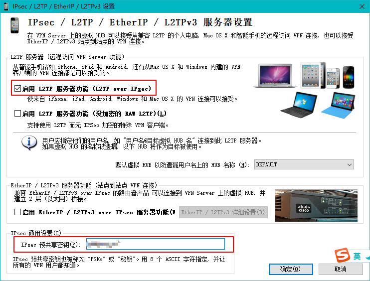

然后就会出现 SoftEther 远程管理器页面，我们可以对默认的 hub 进行管理，也可以删除默认的建立新的 hub。我们这里就删除默认新建 hub 了。

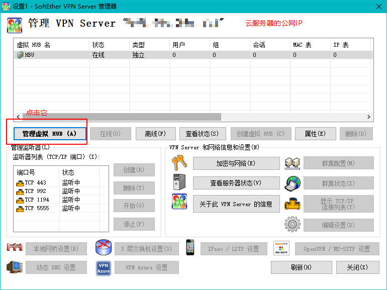  
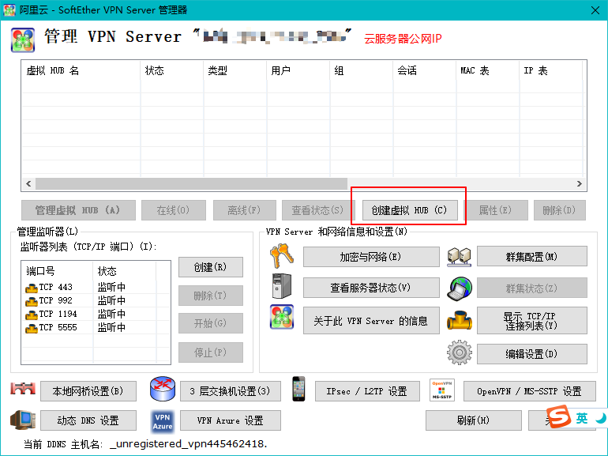  
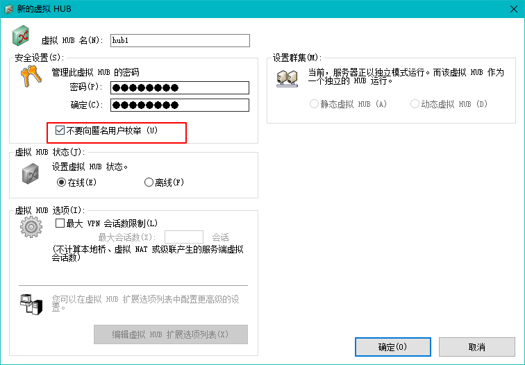

对新 hub 进行“管理虚拟 HUB”，新建用户，你有几台客户端机器就新建几个用户。

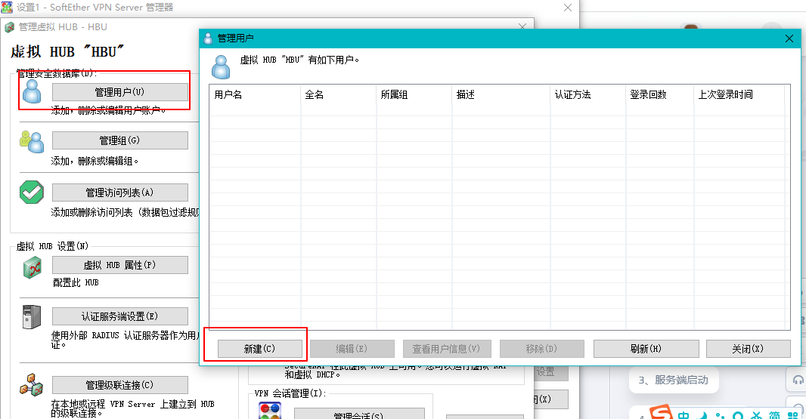  
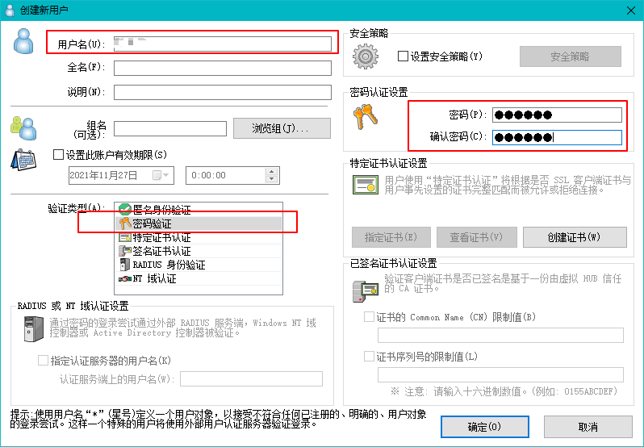

开启 NAT 地址转换和 DHCP 服务，这个是为了给客户端机器分配虚拟网络 IP 的。值得注意的是，“应用到客户端的选项”我们全部清空了，意思是让客户端使用自己的网关，否则可能上不了网。

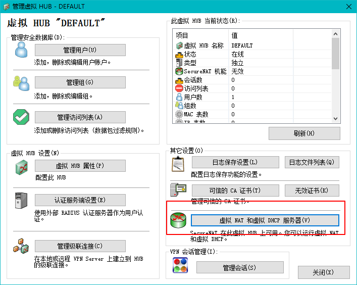  
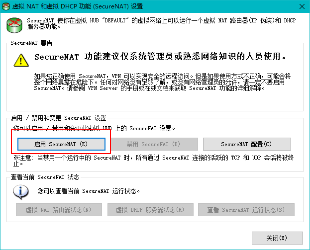  
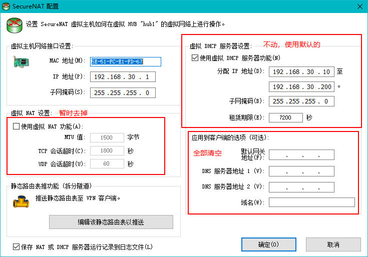

其他除了`5555`端口暂时都删除

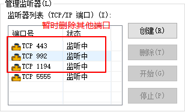

OpenVpn 设置暂时用不着，因为我们使用的是“IPsec/L2TP”方式进行连接的。

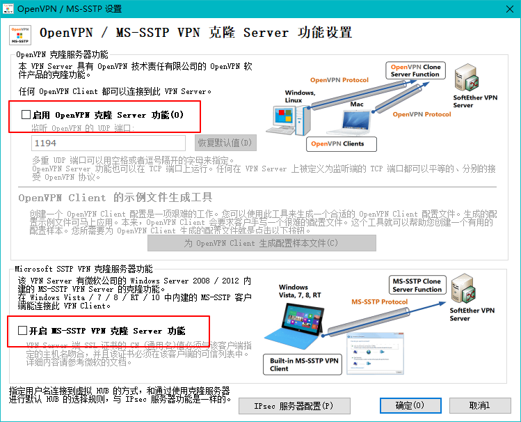

### 客户端连接

**Windows 连接 SoftEther VPN**，我们并没有使用 SoftEther 提供的客户端进行 SoftEther VPN 的连接，而是使用**windows**自带的 VPN 功能进行连接的。值得注意的是，预共享密钥就是我们在上一小节“IPsec/L2TP 设置”里的共享密钥，至于用户就是“管理虚拟 HUB”里新建的用户，用户名的格式得是`用户名@hub名`。

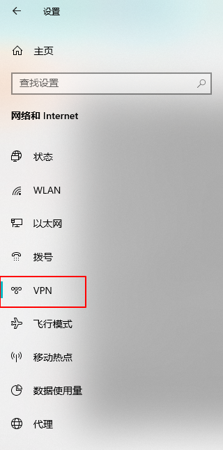  
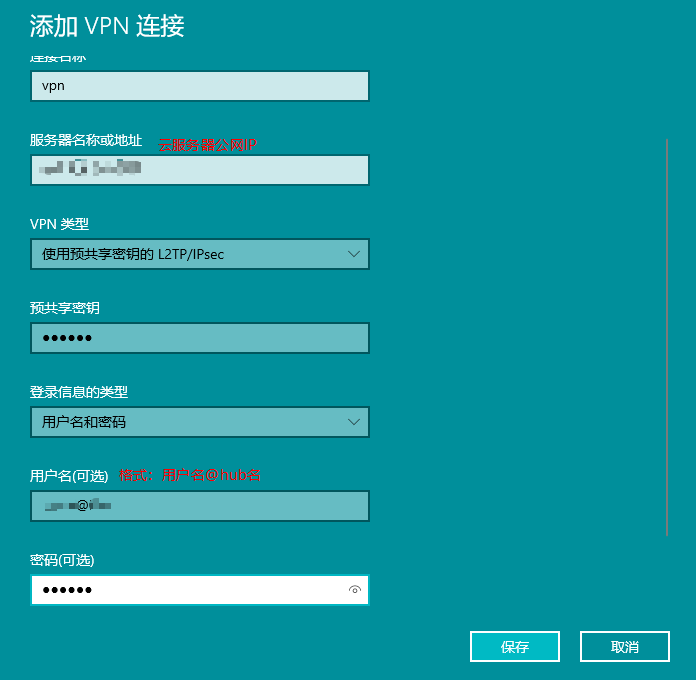

windows 连接 SoftEther VPN 后，可能上不了网。需要进行一个设置，不使用远程网络的默认网关，对于本地的请求还是走本地网关。

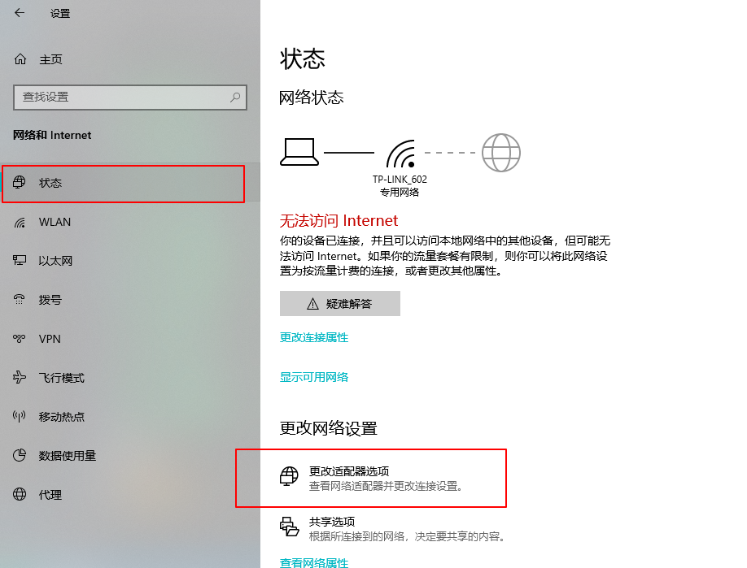  
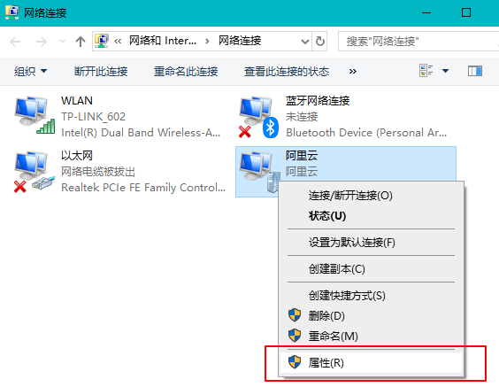  
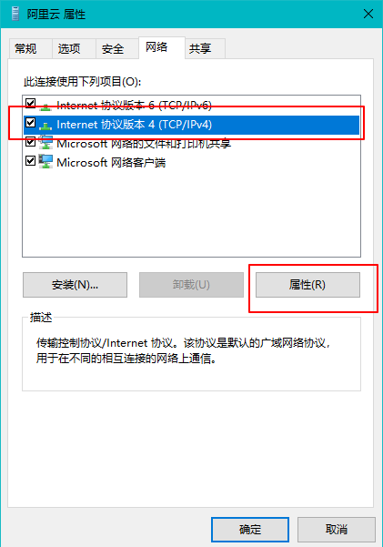  
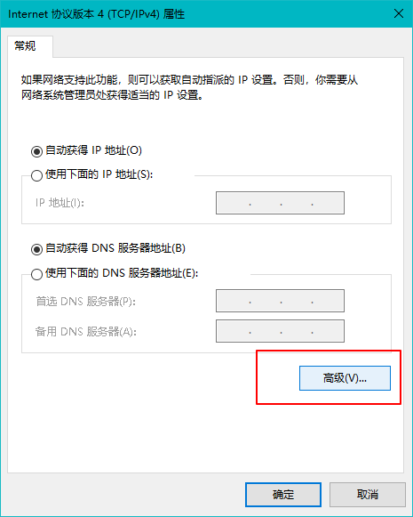  


**IOS 连接 SoftEther VPN**，通用——VPN——添加 VPN 配置，“类型”选择“L2TP”，“描述”随意填写，“服务器”填云服务器的公网 IP 地址，“账户”就是“用户名@hub 名”这样的格式，“密码”填用户对应密码，“密钥”就是“IPsec/L2TP 设置”里的共享密钥，“发送所有流量”取消勾选。

**安卓连接 SoftEther VPN**，以三星 S8 为例，连接——更多连接设置——VPN——添加 VPN 配置文件，“姓名”随意填写，“类型”选择“L2TP/IPSec PSK”，“服务器地址”填云服务器的公网 IP 地址，“L2TP 密钥”不填，“IPSec 识别符”不填，“IPSec 预分享密钥”填“IPsec/L2TP 设置”里的共享密钥，勾上“显示购机选项”，“DNS 搜索域”和“DNS 服务器”不填，“转发路由”填 hub 默认分配 IP 端`192.168.30.0/24`（子网掩码是`255.255.255.0`所以长度是 24），用户名就是“用户名@hub 名”这样的格式，“密码”填用户对应密码。

`/24`的意思是`11111111.11111111.11111111.00000000`（24 个 1），转为十进制是`255.255.255.0`，这个`255.255.255.0`表示`192.168.30.0`的最后一位可以是是`1~244`，即`192.168.30.1`到`192.168.30.244`。

### 连不上或者连上了不能上网

连不上的原因，很大原因是云服务器端口没开放。开放 5555 端口是为了 SoftEther 的使用，开发 500 和 4500 是为了电脑和手机能正常连接 SoftEther。


电脑连上但不能上网，要关闭“远程网络的默认网关”，IOS 也是同理得去掉“发送所有流量”的勾，安卓的话就是“转发路由”填 hub 默认分配 IP 端，这些操作都在上一节说过了。它们这样做的原因是本地请求直接走本地网关，有关 VPN 请求就走 VPN。

## SoftEther 配合 RDC

SoftEther 也可以使用 RD Client 进行远程桌面控制，对虚拟局域网中任意两台客户端都可以使用，只要获取它对应的**虚拟局域网 IP**。更多的是一个虚拟局域网的功能，可以联机打游戏、访问局域网内机器里的资料等等。

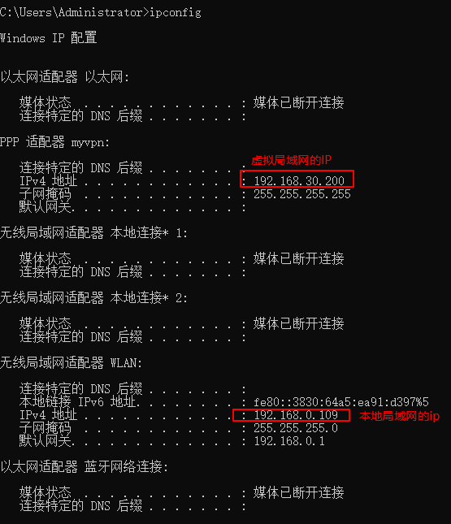

使用 RD Client 进行远程桌面控制的时候，我们就输入上面这个**虚拟局域网**的 IP 地址`192.168.30.200`。如果你的控制端和被控制端都在**本地局域网**，就直接用第二个红色框 IP`192.168.0.109`。（至于 RD Client 到底怎么用就不展开了）

每次重连 SoftEther VPN，被控制端机器获取的 IP 地址可能和上一次不一样，这就导致控制端使用 RD Client 时填写的 IP 也得跟着改动。所以我们得让这个 IP 一个固定 IP 地址。我们先查看 SoftEther 的 DHCP 设置，有效 IP 段是`192.168.30.10`到`192.168.30.200`。再让被控制端机器的 VPN 的虚拟网卡获取 IP 固定为`192.168.30.200`。

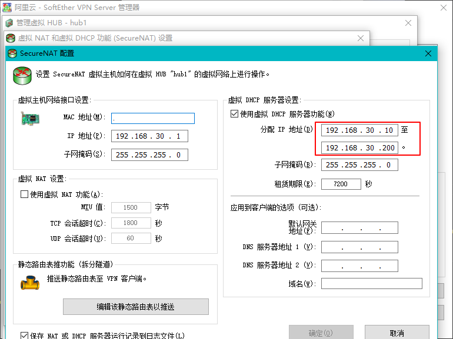

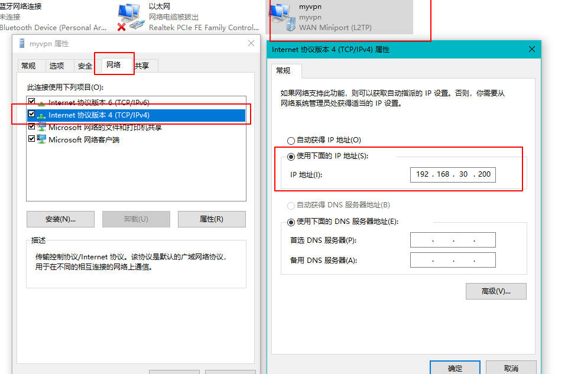

**手动连接**VPN 其实很麻烦，一旦我们不在电脑前就无法手动连 VPN 了，所以我们需要电脑开机后**自动连接 VPN**。Windows 环境的话，在 SoftEther 目录（其他目录也可以）下新建 startvpn.bat 批处理文件，使用文本编辑器打开并编辑：

```txt
@echo off
rem WIFI名称
set wifi_name=TP-LINK_602
rem 连接WIFI
(netsh WLAN show interfaces | findStr %wifi_name% >nul && (
    echo wifi already connected
)) || (
    netsh wlan connect ssid=%wifi_name% name=%wifi_name%
    echo wifi connect succeed
)
rem 延迟2秒
timeout /t 2 /nobreak
rem 连接VPN
(ipconfig|find/i "myvpn" && (
    echo vpn already connected
)) || (
    rasdial myvpn user2@hub1 123456
    echo vpn connect succeed
)
```

大致解释一下：`@echo off`是不显示执行框，`rem`是注释标识符，`set`定义一个变量，`netsh WLAN show interfaces`是查看当前连接 wifi 的信息，`findStr %wifi_name%`是进一步查看 wifi 连接信息里的 wifi 名，`echo xxx`是提示语 xxx，`netsh wlan connect ssid=%wifi_name% name=%wifi_name%`是连接到某个 wifi，查看 ssid 可以使用`netsh wlan show networks mode=bssid`，`ipconfig|find/i "myvpn"`表示连上 vpn 没有如果连上是能查到 vpn 名称的，`rasdial myvpn user2@hub1 123456`是连接到名为`myvpn`的 vpn，账号格式是`用户名@hub名`。

我们将准备好的 startvpn.bat 加入到任务计划程序，让 startvpn.bat 在电脑开机时执行。打开电脑的“任务计划程序”，选择右侧的“创建任务...”。

- 在常规这个页签里，名称填为“myvpn”，然后勾上“不管用户是否登录都要运行”、“使用最高权限运行”、“隐藏”。
- 在触发器这个页签里，选择新建，然后开始任务选择“启动时”，可以自己选择是否重复执行以及间隔。
- 在操作这个页签里，选择新建，然后点击“浏览”选择前面创建的“startvpn.bat”，最后在“起始于”里填写 startvpn.bat 的父路径（D:\SoftEther VPN Server Manager）。
- 返回常规页签，然后点击确定，输入电脑登录密码，就完成了 VPN 的自动连接。

至于怎么让被控制端机器怎么**自动开机**，这就涉及到“电源管理”，比如戴尔的 BOIS 的“Power Management”、“Auto On Mode”、“Auto On Time”、“wake ON lan/wan ”、“USB Wake Support”等。

## 说在最后

SoftEther 相比 Frp 就安全一些，有用户分配、密码验证、秘钥验证等等，并且客户端使用不需要下载什么文件软件等，直接使用系统自带工具连接。如果只是单纯的用 RDC 远程桌面控制，用 Frp 就足够了；如果要多台机器联机使用就用 SoftEther。

最好不要使用该技术应用到国外云服务器上，就算你用了也要低调使用（学习 IT 技术、理智获取国外资讯等），也不要做违法犯罪的事（这个就不用多说了吧）。
